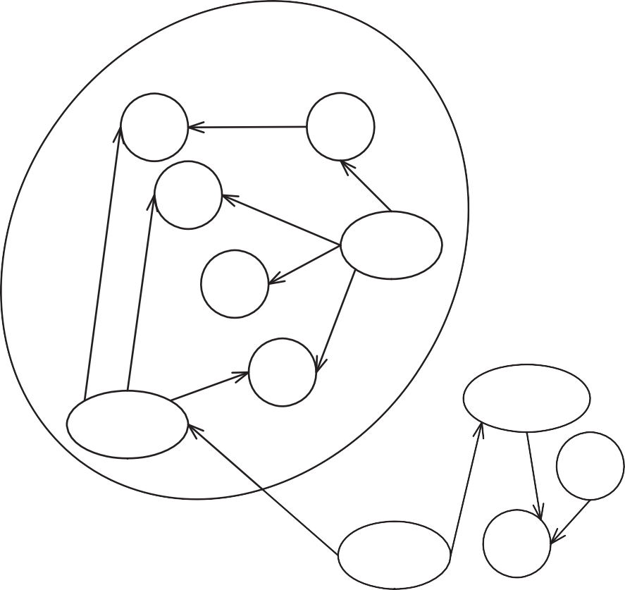

### [Foreword](#contents)

"...then it began..."

In his introduction to this book, Michael Feathers uses that phrase to describe the start of his passion for software.

> 在这本书的引言中，Michael Feathers用这句话来描述他对软件热情的开始。

"...then it began..."

Do you know that feeling? Can you point to a single moment in your life and say: "...then it began..."? Was there a single event that changed the course of your life and eventually led you to pick up this book and start reading this fore- word?

> 你知道那种感觉吗？你能指着你生命中的某个时刻说：“……然后它开始了……”吗？有没有一件事改变了你的人生历程，最终让你拿起这本书，开始阅读这本书？

I was in sixth grade when it happened to me. I was interested in science and space and all things technical. My mother found a plastic computer in a catalog and ordered it for me. It was called *Digi-Comp I*. Forty years later that little plastic computer holds a place of honor on my bookshelf. It was the catalyst that sparked my enduring passion for software. It gave me my first inkling of how joyful it is to write programs that solve problems for people. It was just three plastic S-R flip-flops and six plastic and-gates, but it was enough---it served. Then... for me... it began...

> 这件事发生在我六年级的时候，我对科学、太空和所有技术感兴趣。我妈妈在目录里找到一台塑料电脑，帮我订了一台，名叫“数码公司I”。四十年后，那台小小的塑料电脑在我的书架上占据了一个荣誉的位置。正是这种催化剂激发了我对软件的持久热情。它让我第一次意识到为人们编写解决问题的程序是多么快乐。它只有三个塑料S-R触发器和六个塑料与门，但它已经足够了——它起作用了。然后对我来说…它开始了。。。

But the joy I felt soon became tempered by the realization that software sys- tems almost always degrade into a mess. What starts as a clean crystalline design in the minds of the programmers rots, over time, like a piece of bad meat. The nice little system we built last year turns into a horrible morass of tangled functions and variables next year.

> 但当我意识到软件系统几乎总是会退化成一团乱麻时，我的喜悦很快就缓和了。在程序员的脑海中，一开始是一个干净的水晶设计，随着时间的推移，它就像一块坏肉一样腐烂。我们去年建立的漂亮的小系统明年将变成一个由复杂的函数和变量组成的可怕的泥沼。

Why does this happen? Why do systems rot? Why can't they stay clean?

Sometimes we blame our customers. Sometimes we accuse them of changing the requirements. We comfort ourselves with the belief that if the customers had just been happy with what they said they needed, the design would have been fine. It's the customer's fault for changing the requirements on us.

> 有时我们会责怪我们的客户。有时我们指责他们改变了要求。我们相信，如果客户对他们所说的感到满意，设计就会很好，这让我们感到安慰。改变对我们的要求是客户的错。

Well, here's a news flash: *Requirements change*. Designs that cannot tolerate changing requirements are poor designs to begin with. It is the goal of every competent software developer to create designs that tolerate change.

> 好吧，这里有一个新闻快讯：*需求变化*。不能容忍不断变化的需求的设计从一开始就是糟糕的设计。每一个有能力的软件开发人员的目标都是创建能够容忍更改的设计。

This seems to be an intractably hard problem to solve. So hard, in fact, that nearly every system ever produced suffers from slow, debilitating rot. The rot is so pervasive that we've come up with a special name for rotten programs. We call them: **Legacy Code**.

> 这似乎是一个难以解决的难题。事实上，如此艰难，以至于几乎每一个产生的系统都会遭受缓慢而衰弱的腐烂。这种腐烂是如此普遍，以至于我们为腐烂的程序想出了一个特殊的名字。我们称之为：**遗留代码**。

Legacy code. The phrase strikes disgust in the hearts of programmers. It con- jures images of slogging through a murky swamp of tangled undergrowth with leaches beneath and stinging flies above. It conjures odors of murk, slime, stag- nancy, and offal. Although our first joy of programming may have been intense, the misery of dealing with legacy code is often sufficient to extinguish that flame.

> 旧代码。这句话引起了程序员的反感。它描绘了在一片杂乱的灌木丛中艰难前行的画面，下面是沥滤物，上面是刺痛的苍蝇。它会散发出臭味、黏液味、停滞味和内脏味。尽管我们编程的最初乐趣可能是强烈的，但处理遗留代码的痛苦往往足以扑灭火焰。

Many of us have tried to discover ways to *prevent* code from becoming leg- acy. We've written books on principles, patterns, and practices that can help programmers keep their systems clean. But Michael Feathers had an insight that many of the rest of us missed. Prevention is imperfect. Even the most disciplined development team, knowing the best principles, using the best patterns, and fol- lowing the best practices will create messes from time to time. The rot still accu- mulates. It's not enough to try to prevent the rot---you have to be able to *reverse* it.

> 我们中的许多人都试图找到防止代码失控的方法。我们写过一些关于原理、模式和实践的书，这些书可以帮助程序员保持系统的清洁。但迈克尔·费瑟斯有一个我们很多人都错过的洞察力。预防不完善。即使是最有纪律的开发团队，知道最好的原则，使用最好的模式，遵循最好的实践，也会时不时地制造混乱。腐败仍在滋生。仅仅试图防止腐败是不够的——你必须能够“扭转”它。

That's what this book is about. It's about reversing the rot. It's about taking a tangled, opaque, convoluted system and slowly, gradually, piece by piece, step by step, turning it into a simple, nicely structured, well-designed system. It's about reversing entropy.

> 这就是这本书的主题。这是关于扭转颓势。这是关于把一个混乱、不透明、错综复杂的系统慢慢地、逐渐地、一块一块地、一步一步地变成一个简单、结构良好、设计良好的系统。这是关于熵的反转。

Before you get too excited, I warn you; reversing rot is not easy, and it's not quick. The techniques, patterns, and tools that Michael presents in this book are effective, but they take work, time, endurance, and *care*. This book is not a magic bullet. It won't tell you how to eliminate all the accumulated rot in your systems overnight. Rather, this book describes a set of disciplines, concepts, and attitudes that you will carry with you for the rest of your career and that *will help you to turn systems that gradually degrade into systems that gradually improve*.

> 在你太激动之前，我警告你；扭转腐败并不容易，而且速度也不快。迈克尔在这本书中介绍的技术、模式和工具是有效的，但它们需要工作、时间、耐力和小心。这本书不是灵丹妙药。它不会告诉你如何在一夜之间消除系统中积累的所有腐败。相反，这本书描述了一系列你将在职业生涯的剩余时间里随身携带的纪律、概念和态度，它们将帮助你将逐渐退化的系统转变为逐渐改进的系统。

***Robert C. Martin 2E June, 2004***

### [Preface](#contents)

Do you remember the first program you wrote? I remember mine. It was a little graphics program I wrote on an early PC. I started programming later than most of my friends. Sure, I'd seen computers when I was a kid. I remember being really impressed by a minicomputer I once saw in an office, but for years I never had a chance to even sit at a computer. Later, when I was a teenager, some friends of mine bought a couple of the first TRS-80s. I was interested, but I was actually a bit apprehensive, too. I knew that if I started to play with com- puters, I'd get sucked into it. It just looked too cool. I don't know why I knew myself so well, but I held back. Later, in college, a roommate of mine had a computer, and I bought a C compiler so that I could teach myself programming. Then it began. I stayed up night after night trying things out, poring through the source code of the emacs editor that came with the compiler. It was addic- tive, it was challenging, and I loved it.

> 你还记得你写的第一个程序吗？我记得我的。这是我在早期的电脑上写的一个小图形程序。我比大多数朋友都晚开始编程。当然，我小时候见过电脑。我记得有一次在办公室里看到的一台小型计算机给我留下了深刻的印象，但多年来，我甚至没有机会坐在电脑前。后来，当我十几岁的时候，我的一些朋友买了几辆第一辆TRS-80。我很感兴趣，但实际上我也有点担心。我知道，如果我开始玩电脑，我会被它吸引。它看起来太酷了。我不知道为什么我这么了解自己，但我忍住了。后来，在大学里，我的一个室友有了一台电脑，我买了一个C编译器，这样我就可以自学编程了。然后它开始了。我彻夜未眠，仔细研究编译器附带的emacs编辑器的源代码。它令人上瘾，充满挑战，我喜欢它。

I hope you've had experiences like this---just the raw joy of making things work on a computer. Nearly every programmer I ask has. That joy is part of what got us into this work, but where is it day to day?

> 我希望你有过这样的经历——只是在电脑上工作的原始乐趣。我问过的几乎每个程序员都有。这种快乐是我们从事这项工作的部分原因，但它在哪里？

A few years ago, I gave my friend Erik Meade a call after I'd finished work one night. I knew that Erik had just started a consulting gig with a new team, so I asked him, "How are they doing?" He said, "They're writing legacy code, man." That was one of the few times in my life when I was sucker-punched by a coworker's statement. I felt it right in my gut. Erik had given words to the pre- cise feeling that I often get when I visit teams for the first time. They are trying very hard, but at the end of the day, because of schedule pressure, the weight of history, or a lack of any better code to compare their efforts to, many people are writing legacy code.

> 几年前，一天晚上我下班后，给我的朋友Erik Meade打了个电话。我知道Erik刚刚在一个新团队开始了一项咨询工作，所以我问他，“他们过得怎么样？”他说，“他们在写遗产代码，伙计。”这是我一生中为数不多的几次被同事的声明打得鼻青脸肿。我感觉到了。埃里克用语言表达了我第一次访问球队时经常有的赛前感觉。他们正在努力，但最终，由于日程压力、历史的重量，或者缺乏更好的代码来与他们的努力进行比较，许多人正在编写遗留代码。

What is legacy code? I've used the term without defining it. Let's look at the strict definition: Legacy code is code that we've gotten from someone else. Maybe our company acquired code from another company; maybe people on the original team moved on to other projects. Legacy code is somebody else's code. But in programmer-speak, the term means much more than that. The term *legacy code* has taken on more shades of meaning and more weight over time.

> 什么是遗留代码？我使用了这个术语，但没有定义它。让我们看看严格的定义：遗留代码是我们从其他人那里得到的代码。也许我们公司从另一家公司获得了代码；也许最初团队中的人转到了其他项目。遗留代码是别人的代码。但从程序员的角度来说，这个词的意义远不止于此。随着时间的推移，“遗留代码”一词有了更多的含义和分量。

What do you think about when you hear the term *legacy code*? If you are at all like me, you think of tangled, unintelligible structure, code that you have to change but don't really understand. You think of sleepless nights trying to add in features that should be easy to add, and you think of demoralization, the sense that everyone on the team is so sick of a code base that it seems beyond care, the sort of code that you just wish would die. Part of you feels bad for even thinking about making it better. It seems unworthy of your efforts. That definition of legacy code has nothing to do with who wrote it. Code can degrade in many ways, and many of them have nothing to do with whether the code came from another team.

> 当你听到“遗留代码”这个词时，你会怎么想？如果你和我一样，你会想到复杂、难以理解的结构，你必须更改但并不真正理解的代码。你会想到失眠的夜晚，试图添加本应易于添加的功能，你会想到士气低落，团队中的每个人都厌倦了代码库，以至于它似乎无法照顾，你只希望这种代码会消亡。你的一部分甚至因为想让它变得更好而感到难过。这似乎不值得你努力。遗留代码的定义与谁写的无关。代码可以在很多方面退化，其中许多与代码是否来自另一个团队无关。

In the industry, *legacy code* is often used as a slang term for difficult-to-change code that we don't understand. But over years of working with teams, helping them get past serious code problems, I've arrived at a different definition.

> 在行业中，“遗留代码”经常被用作俚语，表示我们不理解的难以更改的代码。但经过多年与团队的合作，帮助他们克服严重的代码问题，我得出了不同的定义。

To me, *legacy code* is simply code without tests. I've gotten some grief for this definition. What do tests have to do with whether code is bad? To me, the answer is straightforward, and it is a point that I elaborate throughout the book:

> 对我来说，遗留代码只是没有测试的代码。我为这个定义感到有些悲伤。测试与代码是否坏有什么关系？对我来说，答案很简单，这是我在整本书中阐述的一点：

You might think that this is severe. What about clean code? If a code base is very clean and well structured, isn't that enough? Well, make no mistake. I love clean code. I love it more than most people I know, but while clean code is good, it's not enough. Teams take serious chances when they try to make large changes without tests. It is like doing aerial gymnastics without a net. It requires incredible skill and a clear understanding of what can happen at every step. Knowing precisely what will happen if you change a couple of variables is often like knowing whether another gymnast is going to catch your arms after you come out of a somersault. If you are on a team with code that clear, you are in a better position than most programmers. In my work, I've noticed that teams with that degree of clarity in all of their code are rare. They seem like a statistical anomaly. And, you know what? If they don't have supporting tests, their code changes still appear to be slower than those of teams that do.

> 你可能会认为这很严重。那么干净的代码呢？如果一个代码库非常干净且结构良好，那还不够吗？好吧，别搞错了。我喜欢干净的代码。我比我认识的大多数人都更喜欢它，但尽管干净的代码很好，但这还不够。当团队试图在没有测试的情况下做出大的改变时，他们会抓住很大的机会。这就像在没有网的情况下做空中体操。这需要令人难以置信的技能和对每一步可能发生的事情的清晰理解。准确地知道如果你改变几个变量会发生什么，通常就像知道你翻筋斗后另一名体操运动员是否会抓住你的手臂一样。如果你所在的团队的代码如此清晰，那么你的处境就比大多数程序员要好。在我的工作中，我注意到在所有代码中都有这种清晰程度的团队是罕见的。它们看起来像是统计上的反常现象。你知道吗？如果他们没有支持测试，他们的代码更改似乎仍然比有支持测试的团队慢。

Yes, teams do get better and start to write clearer code, but it takes a long time for older code to get clearer. In many cases, it will never happen com- pletely. Because of this, I have no problem defining legacy code as code without tests. It is a good working definition, and it points to a solution.

> 是的，团队确实变得更好，开始编写更清晰的代码，但旧代码需要很长时间才能变得更清晰。在许多情况下，它永远不会完全发生。正因为如此，我可以将遗留代码定义为无需测试的代码。这是一个很好的工作定义，它指向了一个解决方案。

I've been talking about tests quite a bit so far, but this book is not about test- ing. This book is about being able to confidently make changes in any code

> 到目前为止，我一直在谈论测试，但这本书不是关于测试的。这本书是关于能够自信地对任何代码进行更改

base. In the following chapters, I describe techniques that you can use to under- stand code, get it under test, refactor it, and add features.

> 基础在接下来的几章中，我将介绍一些技术，您可以使用这些技术来对代码进行测试、重构和添加特性。

One thing that you will notice as you read this book is that it is not a book about pretty code. The examples that I use in the book are fabricated because I work under nondisclosure agreements with clients. But in many of the exam- ples, I've tried to preserve the spirit of code that I've seen in the field. I won't say that the examples are always representative. There certainly are oases of great code out there, but, frankly, there are also pieces of code that are far worse than anything I can use as an example in this book. Aside from client confidentiality, I simply couldn't put code like that in this book without boring you to tears and burying important points in a morass of detail. As a result, many of the examples are relatively brief. If you look at one of them and think "No, he doesn't understand---my methods are much larger than that and much worse," please look at the advice that I am giving at face value and see if it applies, even if the example seems simpler.

> 当你读这本书时，你会注意到一件事，那就是它不是一本关于漂亮代码的书。我在书中使用的例子是捏造的，因为我与客户签订了保密协议。但在许多考试中，我都试图保留我在该领域看到的代码精神。我不会说这些例子总是有代表性的。当然有很多很棒的代码，但坦率地说，也有一些代码比我在这本书中举的任何例子都糟糕得多。除了对客户保密之外，我在这本书中写下这样的代码时，会让你厌烦得流泪，并将重要的点埋在细节的泥沼中。因此，许多例子都比较简短。如果你看着其中一个，然后想“不，他不明白——我的方法比这个大得多，而且更糟”，请从表面上看我给出的建议，看看它是否适用，即使这个例子看起来更简单。

The techniques here have been tested on substantially large pieces of code. It is just a limitation of the book format that makes examples smaller. In particu- lar, when you see ellipses (...) in a code fragment like this, you can read them as "insert 500 lines of ugly code here":

> 这里的技术已经在相当大的代码块上进行了测试。这只是书籍格式的限制，使例子变得更小。特别是，当你在这样的代码片段中看到省略号（…）时，你可以把它们读成“在这里插入500行丑陋的代码”：

m_pDispatcher-\>register(listener);

\...

m_nMargins++;

If this book is not about pretty code, it is even less about pretty design. Good design should be a goal for all of us, but in legacy code, it is something that we arrive at in discrete steps. In some of the chapters, I describe ways of adding new code to existing code bases and show how to add it with good design prin- ciples in mind. You can start to grow areas of very good high-quality code in legacy code bases, but don't be surprised if some of the steps you take to make changes involve making some code slightly uglier. This work is like surgery. We have to make incisions, and we have to move through the guts and suspend some aesthetic judgment. Could this patient's major organs and viscera be bet- ter than they are? Yes. So do we just forget about his immediate problem, sew him up again, and tell him to eat right and train for a marathon? We could, but what we really need to do is take the patient as he is, fix what's wrong, and move him to a healthier state. He might never become an Olympic athlete, but we can't let "best" be the enemy of "better." Code bases can become healthier and easier to work in. When a patient feels a little better, often that is the time when you can help him make commitments to a healthier life style. That is what we are shooting for with legacy code. We are trying to get to the point at

> 如果这本书不是关于漂亮的代码，那么它就更不关于漂亮的设计了。好的设计应该是我们所有人的目标，但在遗留代码中，这是我们通过离散步骤实现的。在其中的一些章节中，我描述了向现有代码库添加新代码的方法，并展示了如何在牢记良好设计原则的情况下添加新代码。您可以开始在遗留代码库中增加非常好的高质量代码区域，但如果您为进行更改而采取的一些步骤涉及使某些代码变得稍微丑陋，也不要感到惊讶。这项工作就像外科手术。我们必须做出切口，我们必须穿过内脏，暂停一些审美判断。这个病人的主要器官和内脏会比现在更好吗？对那么，我们是不是忘记了他眼前的问题，再次给他缝合伤口，让他好好吃饭，训练马拉松？我们可以，但我们真正需要做的是让病人保持原样，解决问题，让他处于更健康的状态。他可能永远不会成为奥运会运动员，但我们不能让“最好”成为“更好”的敌人。代码库可以变得更健康，更容易使用。当患者感觉好一点时，通常是你可以帮助他做出更健康生活方式的承诺的时候。这就是我们对遗留代码的追求。我们正试图在

which we are used to ease; we expect it and actively attempt to make code change easier. When we can sustain that sense on a team, design gets better.

> 我们习惯于放松；我们期待它，并积极尝试使代码更改更容易。当我们能够在团队中保持这种感觉时，设计就会变得更好。

The techniques I describe are ones that I've discovered and learned with coworkers and clients over the course of years working with clients to try to establish control over unruly code bases. I got into this legacy code emphasis accidentally. When I first started working with Object Mentor, the bulk of my work involved helping teams with serious problems develop their skills and interactions to the point that they could regularly deliver quality code. We often used Extreme Programming practices to help teams take control of their work, collaborate intensively, and deliver. I often feel that Extreme Programming is less a way to develop software than it is a way to make a well-jelled work team that just happens to deliver great software every two weeks.

> 我所描述的技术是我在多年与客户合作的过程中发现并与同事和客户一起学习的，试图建立对不规则代码库的控制。我无意中进入了这种遗留代码强调。当我刚开始使用Object Mentor时，我的大部分工作都涉及帮助有严重问题的团队发展他们的技能和互动，使他们能够定期交付高质量的代码。我们经常使用极限编程实践来帮助团队控制他们的工作、集中协作和交付。我经常觉得极限编程与其说是开发软件的一种方式，不如说是组建一个团队的一种方法，恰好每两周就能交付一次优秀的软件。

From the beginning, though, there was a problem. Many of the first XP projects were "greenfield" projects. The clients I was seeing had significantly large code bases, and they were in trouble. They needed some way to get con- trol of their work and start to deliver. Over time, I found that I was doing the same things over and over again with clients. This sense culminated in some work I was doing with a team in the financial industry. Before I'd arrived, they'd realized that unit testing was a great thing, but the tests that they were executing were full scenario tests that made multiple trips to a database and exercised large chunks of code. The tests were hard to write, and the team didn't run them very often because they took so long to run. As I sat down with them to break dependencies and get smaller chunks of code under test, I had a terrible sense of déjà vu. It seemed that I was doing this sort of work with every team I met, and it was the sort of thing that no one really wanted to think about. It was just the grunge work that you do when you want to start working with your code in a controlled way, if you know how to do it. I decided then that it was worth really reflecting on how we were solving these problems and writing them down so that teams could get a leg up and start to make their code bases easier to live in.

> 然而，从一开始就存在问题。许多最初的XP项目都是“绿地”项目。我看到的客户有相当大的代码库，他们遇到了麻烦。他们需要一些方法来控制他们的工作并开始交付。随着时间的推移，我发现我和客户一次又一次地做同样的事情。这种感觉在我与金融行业的一个团队一起做的一些工作中达到了顶峰。在我到达之前，他们已经意识到单元测试是一件很棒的事情，但他们正在执行的测试是全场景测试，需要多次访问数据库并运行大量代码。测试很难编写，团队也不经常运行，因为运行时间太长。当我和他们坐下来打破依赖关系，测试更小的代码块时，我有一种可怕的似曾相识的感觉。我似乎和我遇到的每一个团队都在做这种工作，这是没有人真正想去想的事情。当你想开始以可控的方式处理代码时，如果你知道如何做的话，这只是你所做的垃圾工作。当时我决定，值得真正反思一下我们是如何解决这些问题的，并把它们写下来，这样团队就可以站起来，开始让他们的代码库更容易使用。

A note about the examples: I've used examples in several different program- ming languages. The bulk of the examples are written in Java, C++, and C. I picked Java because it is a very common language, and I included C++ because it presents some special challenges in a legacy environment. I picked C because it highlights many of the problems that come up in procedural legacy code. Among them, these languages cover much of the spectrum of concerns that arise in leg- acy code. However, if the languages you use are not covered in the examples, take a look at them anyway. Many of the techniques that I cover can be used in other languages, such as Delphi, Visual Basic, COBOL, and FORTRAN.

> 关于示例的说明：我已经在几种不同的程序设计语言中使用了示例。大部分示例都是用Java、C++和C编写的。我选择Java是因为它是一种非常常见的语言，而我选择C++是因为它在遗留环境中带来了一些特殊的挑战。我选择C是因为它突出了过程遗留代码中出现的许多问题。其中，这些语言涵盖了legacy代码中出现的许多问题。但是，如果您使用的语言没有包含在示例中，那么无论如何都要查看它们。我介绍的许多技术可以用于其他语言，如Delphi、Visual Basic、COBOL和FORTRAN。

I hope that you find the techniques in this book helpful and that they allow you to get back to what is fun about programming. Programming can be very rewarding and enjoyable work. If you don't feel that in your day-to-day work, I hope that the techniques I offer you in this book help you find it and grow it on your team.

> 我希望你能发现这本书中的技术很有帮助，它们能让你回到编程的乐趣所在。编程可以是一项非常有收获和愉快的工作。如果你在日常工作中没有这种感觉，我希望我在这本书中为你提供的技巧能帮助你找到它，并在你的团队中成长。

#### Acknowledgments

First of all, I owe a serious debt to my wife, Ann, and my children, Deborah and Ryan. Their love and support made this book and all of the learning that preceded it possible. I'd also like to thank "Uncle Bob" Martin, president and founder of Object Mentor. His rigorous pragmatic approach to development and design, separating the critical from the inconsequential, gave me something to latch upon about 10 years ago, back when it seemed that I was about to drown in a wave of unrealistic advice. And thanks, Bob, for giving me the opportunity to see more code and work with more people over the past five years than I ever imagined possible.

> 首先，我欠我的妻子安和我的孩子黛博拉和瑞恩一大笔债。他们的爱和支持使这本书和之前的所有学习成为可能。我还要感谢Object Mentor的总裁兼创始人“Bob叔叔”Martin。大约10年前，他对开发和设计采取了严谨务实的方法，将关键的与无关紧要的区分开来，这给了我一些可以抓住的东西，当时我似乎即将淹没在不切实际的建议浪潮中。感谢Bob，在过去的五年里，让我有机会看到比我想象的更多的代码，与更多的人合作。

I also have to thank Kent Beck, Martin Fowler, Ron Jeffries, and Ward Cun- ningham for offering me advice at times and teaching me a great deal about team work, design, and programming. Special thanks to all of the people who reviewed the drafts. The official reviewers were Sven Gorts, Robert C. Martin, Erik Meade, and Bill Wake; the unofficial reviewers were Dr. Robert Koss, James Grenning, Lowell Lindstrom, Micah Martin, Russ Rufer and the Silicon Valley Patterns Group, and James Newkirk.

> 我还要感谢Kent Beck、Martin Fowler、Ron Jeffries和Ward Cunningham，他们有时会给我建议，教会我很多关于团队合作、设计和编程的知识。特别感谢所有审阅草稿的人。官方评审人是Sven Gorts、Robert C.Martin、Erik Meade和Bill Wake；非官方评审人是Robert Koss博士、James Grenning、Lowell Lindstrom、Micah Martin、Russ Rufer和硅谷模式小组，以及James Newkirk。

Thanks also to reviewers of the very early drafts I placed on the Internet. Their feedback significantly affected the direction of the book after I reorga- nized its format. I apologize in advance to any of you I may have left out. The early reviewers were: Darren Hobbs, Martin Lippert, Keith Nicholas, Phlip Plumlee, C. Keith Ray, Robert Blum, Bill Burris, William Caputo, Brian Mar- ick, Steve Freeman, David Putman, Emily Bache, Dave Astels, Russel Hill, Christian Sepulveda, and Brian Christopher Robinson.

> 也感谢我在互联网上发布的早期草稿的审稿人。他们的反馈在我重组了书的格式后，极大地影响了书的方向。我提前向我可能遗漏的任何人道歉。早期评审人有：达伦·霍布斯、马丁·利珀特、基思·尼古拉斯、Phlip Plumlee、C.基思·雷、罗伯特·布鲁姆、比尔·伯里斯、威廉·卡普托、布莱恩·马里克、史蒂夫·弗里曼、大卫·普特曼、艾米丽·巴切、戴夫·阿斯特尔斯、拉塞尔·希尔、克里斯蒂安·塞普尔维达和布莱恩·克里斯托弗·罗宾逊。

Thanks also to Joshua Kerievsky who gave a key early review and Jeff Langr who helped with advice and spot reviews all through the process.

> 还感谢约书亚·克里耶夫斯基（Joshua Kerievsky）和杰夫·兰格（Jeff Langr），前者提供了关键的早期评估，后者在整个过程中提供了建议和现场评估。

The reviewers helped me polish the draft considerably, but if there are errors remaining, they are solely mine.

> 审稿人帮我对草稿进行了相当大的润色，但如果还有错误，那都是我的错。

Thanks to Martin Fowler, Ralph Johnson, Bill Opdyke, Don Roberts, and John Brant for their work in the area of refactoring. It has been inspirational.

> 感谢Martin Fowler、Ralph Johnson、Bill Opdyke、Don Roberts和John Brant在重构领域所做的工作。这很鼓舞人心。

I also owe a special debt to Jay Packlick, Jacques Morel, and Kelly Mower of Sabre Holdings, and Graham Wright of Workshare Technology for their support and feedback.

> 我还特别感谢Sabre Holdings的Jay Packlick、Jacques Morel和Kelly Mower，以及Workshare Technology的Graham Wright，感谢他们的支持和反馈。

Special thanks also to Paul Petralia, Michelle Vincenti, Lori Lyons, Krista Hansing, and the rest of the team at Prentice-Hall. Thank you, Paul, for all of the help and encouragement that this first-time author needed.

> 特别感谢Paul Petralia、Michelle Vincenti、Lori Lyons、Krista Hansing和Prentice Hall团队的其他成员。保罗，谢谢你对这位第一次写作的作者的帮助和鼓励。

Special thanks also to Gary and Joan Feathers, April Roberts, Dr. Raimund Ege, David Lopez de Quintana, Carlos Perez, Carlos M. Rodriguez, and the late Dr. John C. Comfort for help and encouragement over the years. I also have to thank Brian Button for the example in Chapter 21, *I'm Changing the Same Code All Over the Place*. He wrote that code in about an hour when we were developing a refactoring course together, and it's become my favorite piece of teaching code.

> 特别感谢Gary和Joan Feathers、April Roberts、Raimund Ege博士、David Lopez de Quintana、Carlos Perez、Carlos M.Rodriguez和已故的John C.Comfort博士多年来的帮助和鼓励。我还要感谢Brian Button在第21章中的例子，“我正在到处更改相同的代码”。当我们一起开发重构课程时，他用了大约一个小时就写下了这段代码，这已经成为我最喜欢的教学代码。

Also, special thanks to Janik Top, whose instrumental *De Futura* served as the soundtrack for my last few weeks of work on this book.

> 此外，特别感谢Janik Top，他的器乐《未来》为我最后几周的这本书配乐。

Finally, I'd like to thank everyone whom I've worked with over the past few years whose insights and challenges strengthened the material in this book.

> 最后，我要感谢在过去几年里与我共事的每一个人，他们的见解和挑战加强了本书的内容。

Michael Feathers *<mfeathers@objectmentor.com> [www.objectmentor.com](http://www.objectmentor.com/) [www.michaelfeathers.com](http://www.michaelfeathers.com/)*

> Michael Feathers*<mfeathers@objectmentor.com>[www.objectmentor.com](http://www.objectmentor.com/)[www.michaelflowes.com](http://www.michaelfeathers.com/)*

### [Introduction](#contents)

#### How to Use This Book

I tried several different formats before settling on the current one for this book. Many of the different techniques and practices that are useful when working with legacy code are hard to explain in isolation. The simplest changes often go easier if you can find seams, make fake objects, and break dependencies using a couple of dependency-breaking techniques. I decided that the easiest way to make the book approachable and handy would be to organize the bulk of it (*Part II, Changing Software*) in FAQ (frequently asked questions) format. Because specific techniques often require the use of other techniques, the FAQ chapters are heavily interlinked. In nearly every chapter, you'll find references, along with page numbers, for other chapters and sections that describe particu- lar techniques and refactorings. I apologize if this causes you to flip wildly through the book as you attempt to find answers to your questions, but I assumed that you'd rather do that than read the book cover to cover, trying to understand how all the techniques operate.

> 我尝试了几种不同的格式，然后为这本书选择了目前的格式。许多在使用遗留代码时有用的不同技术和实践很难单独解释。如果您能够找到接缝、制作假对象并使用两种依赖关系打破技术打破依赖关系，那么最简单的更改通常会变得更容易。我决定，让这本书变得平易近人和方便的最简单方法是以FAQ（常见问题）格式组织大部分内容（*第二部分，更改软件*）。由于特定的技术通常需要使用其他技术，常见问题解答章节之间有很大的联系。在几乎每一章中，你都会发现其他章节的参考资料和页码，这些章节描述了特定的技术和重构。如果这导致你在试图找到问题的答案时疯狂地翻阅这本书，我很抱歉，但我认为你宁愿这样做，也不愿一本接一本地阅读，试图了解所有技术是如何运作的。

In *Changing Software*, I've tried to address very common questions that come up in legacy code work. Each of the chapters is named after a specific problem. This does make the chapter titles rather long, but hopefully, they will allow you to quickly find a section that helps you with the particular problems you are having.

> 在“更改软件”中，我试图解决遗留代码工作中出现的非常常见的问题。每一章都以一个特定的问题命名。这确实使章节标题相当长，但希望它们能让你快速找到一个章节来帮助你解决你遇到的特定问题。

*Changing Software* is bookended by a set of introductory chapters (*Part I, The Mechanics of Change*) and a catalog of refactorings, which are very useful in legacy code work (*Part III, Dependency-Breaking Techniques*). Please read the introductory chapters, particularly Chapter 4, *The Seam Model*. These chapters provide the context and nomenclature for all the techniques that fol- low. In addition, if you find a term that isn't described in context, look for it in the Glossary.

> *更改软件*由一组介绍性章节（*第一部分，更改机制*）和一系列重构组成，这些重构在遗留代码工作中非常有用（*第三部分，依赖性打破技术*）。请阅读介绍性章节，特别是第4章“接缝模型”。这些章节提供了以下所有技术的上下文和命名。此外，如果您发现上下文中没有描述的术语，请在词汇表中查找。

The refactorings in *Dependency-Breaking Techniques* are special in that they are meant to be done without tests, in the service of putting tests in place. I encourage you to read each of them so that you can see more possibilities as you start to tame your legacy code.

> *Dependency Breaking Techniques*中的重构是特别的，因为它们是在没有测试的情况下进行的，是为了将测试放在适当的位置。我鼓励您阅读其中的每一个，以便在开始驯服遗留代码时看到更多的可能性。

**xxi**

*This page intentionally left blank*

[]{#_bookmark9 .anchor}[**Part I**](#contents)

# [The Mechanics of Change](#contents)

*This page intentionally left blank*

[]{#_bookmark10 .anchor}[**Chapter 1**](#contents)

### [Changing Software](#contents)

[]{#_bookmark12 .anchor}Changing code is great. It's what we do for a living. But there are ways of changing code that make life difficult, and there are ways that make it much easier. In the industry, we haven't spoken about that much. The closest we've gotten is the literature on refactoring. I think we can broaden the discussion a bit and talk about how to deal with code in the thorniest of situations. To do that, we have to dig deeper into the mechanics of change.

> []｛#_bookmark12.锚点｝更改代码非常棒。这就是我们的谋生之道。但是，有些更改代码的方法会让生活变得困难，也有一些方法会让它变得更容易。在这个行业，我们还没有谈论那么多。我们得到的最接近的是关于重构的文献。我认为我们可以扩大讨论范围，讨论如何在最棘手的情况下处理代码。要做到这一点，我们必须深入研究变革的机制。

#### [Four Reasons to Change Software](#contents)

For simplicity's sake, let's look at four primary reasons to change software.

> 为了简单起见，让我们来看一下更改软件的四个主要原因。

1.  Adding a feature

2.  Fixing a bug

3.  Improving the design

4.  Optimizing resource usage

##### Adding Features and Fixing Bugs

Adding a feature seems like the most straightforward type of change to make. The software behaves one way, and users say that the system needs to do some- thing else also.

> 添加功能似乎是最简单的更改类型。软件的行为是单向的，用户说系统还需要做一些其他的事情。

Suppose that we are working on a web-based application, and a manager tells us that she wants the company logo moved from the left side of a page to the right side. We talk to her about it and discover it isn't quite so simple. She wants to move the logo, but she wants other changes, too. She'd like to make it animated for the next release. Is this fixing a bug or adding a new feature? It depends on your point of view. From the point of view of the customer, she is definitely asking us to fix a problem. Maybe she saw the site and attended a

> 假设我们正在开发一个基于web的应用程序，一位经理告诉我们，她希望将公司徽标从页面的左侧移到右侧。我们和她聊了聊，发现事情并不是那么简单。她想移动标志，但她也想做其他改变。她想为下一次发行制作动画。这是在修复bug还是添加新功能？这取决于你的观点。从客户的角度来看，她肯定是在要求我们解决问题。也许她看到了这个网站并参加了

####### 3

[]{#_bookmark13 .anchor}meeting with people in her department, and they decided to change the logo placement and ask for a bit more functionality. From a developer's point of view, the change could be seen as a completely new feature. "If they just stopped changing their minds, we'd be done by now." But in some organiza- tions the logo move is seen as just a bug fix, regardless of the fact that the team is going to have to do a lot of fresh work.

> []｛#_bookmark13.anchor｝与她所在部门的人员会面，他们决定更改徽标的位置，并要求提供更多功能。从开发人员的角度来看，这一变化可以被视为一个全新的功能。“如果他们停止改变主意，我们现在就完了。”但在一些组织中，标志的移动被视为只是一个错误修复，而不管团队将不得不做很多新的工作。

It is tempting to say that all of this is just subjective. You see it as a bug fix, and I see it as a feature, and that's the end of it. Sadly, though, in many organi- zations, bug fixes and features have to be tracked and accounted for separately because of contracts or quality initiatives. At the people level, we can go back and forth endlessly about whether we are adding features or fixing bugs, but it is all just changing code and other artifacts. Unfortunately, this talk about bug- fixing and feature addition masks something that is much more important to us technically: behavioral change. There is a big difference between adding new behavior and changing old behavior.

> 人们很容易说，所有这些都只是主观的。你把它看作是一个bug修复，我把它看作一个功能，就这样结束了。然而，可悲的是，在许多组织中，由于合同或质量计划的原因，bug修复和功能必须单独跟踪和说明。在人员级别，我们可以无休止地来回讨论是添加功能还是修复bug，但这都只是更改代码和其他工件。不幸的是，这种关于bug修复和特性添加的讨论掩盖了对我们来说更重要的东西：行为改变。添加新行为和更改旧行为之间有很大的区别。

In the company logo example, are we adding behavior? Yes. After the change, the system will display a logo on the right side of the page. Are we get- ting rid of any behavior? Yes, there won't be a logo on the left side.

> 在公司徽标示例中，我们是否添加了行为？对更改后，系统将在页面右侧显示一个徽标。我们正在摆脱任何行为吗？是的，左边不会有标志。

Let's look at a harder case. Suppose that a customer wants to add a logo to the right side of a page, but there wasn't one on the left side to start with. Yes, we are adding behavior, but are we removing any? Was anything rendered in the place where the logo is about to be rendered?

> 让我们来看一个更难的案例。假设一个客户想在页面的右侧添加一个徽标，但左侧没有徽标。是的，我们正在添加行为，但我们是否删除了任何行为？在即将渲染徽标的地方是否渲染了任何内容？

Are we changing behavior, adding it, or both?

It turns out that, for us, we can draw a distinction that is more useful to us as programmers. If we have to modify code (and HTML kind of counts as code), we could be changing behavior. If we are only adding code and calling it, we are often adding behavior. Let's look at another example. Here is a method on a Java class:

> 事实证明，对我们来说，我们可以做出对我们程序员更有用的区分。如果我们必须修改代码（HTML算是代码），我们可能会改变行为。如果我们只是添加代码并调用它，那么我们通常是在添加行为。让我们看另一个例子。下面是Java类上的一个方法：

public class CDPlayer

{

public void addTrackListing(Track track) {

\...

}

\...

}

The class has a method that enables us to add track listings. Let's add

another method that lets us replace track listings.

[]{#_bookmark14 .anchor}public class CDPlayer

{

public void addTrackListing(Track track) {

\...

}

public void replaceTrackListing(String name, Track track) {

\...

}

\...

}

When we added that method, did we add new behavior to our application or

change it? The answer is: neither. Adding a method doesn't change behavior unless the method is called somehow.

> 改变它？答案是：两者都不是。添加方法不会改变行为，除非以某种方式调用该方法。

Let's make another code change. Let's put a new button on the user interface for the CD player. The button lets users replace track listings. With that move, we're adding the behavior we specified in replaceTrackListing method, but we're also subtly changing behavior. The UI will render differently with that new but- ton. Chances are, the UI will take about a microsecond longer to display. It seems nearly impossible to add behavior without changing it to some degree.

> 让我们再次更改代码。让我们在CD播放器的用户界面上添加一个新按钮。该按钮允许用户替换曲目列表。通过这个动作，我们添加了在replaceTrackListing方法中指定的行为，但我们也在微妙地改变行为。UI将以不同的方式呈现新的but-ton。UI的显示时间可能会延长一微秒。如果不在某种程度上改变行为，添加行为似乎几乎是不可能的。

##### Improving Design

Design improvement is a different kind of software change. When we want to alter software's structure to make it more maintainable, generally we want to keep its behavior intact also. When we drop behavior in that process, we often call that a bug. One of the main reasons why many programmers don't attempt to improve design often is because it is relatively easy to lose behavior or create bad behavior in the process of doing it.

> 设计改进是一种不同类型的软件更改。当我们想要改变软件的结构以使其更易于维护时，通常我们也希望保持其行为的完整性。当我们在这个过程中放弃行为时，我们通常称之为bug。许多程序员不经常尝试改进设计的主要原因之一是，在进行设计的过程中，相对容易失去行为或产生不良行为。

The act of improving design without changing its behavior is called *refactor- ing*. The idea behind refactoring is that we can make software more maintain- able without changing behavior if we write tests to make sure that existing behavior doesn't change and take small steps to verify that all along the pro- cess. People have been cleaning up code in systems for years, but only in the last few years has refactoring taken off. Refactoring differs from general cleanup in that we aren't just doing low-risk things such as reformatting source code, or invasive and risky things such as rewriting chunks of it. Instead, we are making a series of small structural modifications, supported by tests to make the code easier to change. The key thing about refactoring from a change point of view is that there aren't supposed to be any functional changes when you refactor (although behavior can change somewhat because the structural changes that you make can alter performance, for better or worse).

> 在不改变其行为的情况下改进设计的行为称为重构。重构背后的理念是，如果我们编写测试以确保现有行为不会改变，并在整个过程中采取小步骤来验证这一点，我们就可以在不改变行为的情况下使软件更具可维护性。多年来，人们一直在清理系统中的代码，但直到最近几年才开始进行重构。重构与一般清理的不同之处在于，我们不仅仅是在做低风险的事情，比如重新格式化源代码，或者进行侵入性和风险性的事情，例如重写大块代码。相反，我们正在进行一系列小的结构修改，由测试支持，使代码更易于更改。从变化的角度来看，重构的关键是重构时不应该有任何功能性的变化（尽管行为可能会发生一些变化，因为你所做的结构变化可能会改变性能，无论好坏）。

##### Optimization

Optimization is like refactoring, but when we do it, we have a different goal. With both refactoring and optimization, we say, "We're going to keep function- ality exactly the same when we make changes, but we are going to change something else." In refactoring, the "something else" is program structure; we want to make it easier to maintain. In optimization, the "something else" is some resource used by the program, usually time or memory.

> 优化就像重构，但当我们这样做时，我们有一个不同的目标。对于重构和优化，我们说，“当我们做出改变时，我们会保持功能完全相同，但我们会改变其他东西。”在重构中，“其他东西”是程序结构；我们想让它更容易维护。在优化中，“其他东西”是程序使用的一些资源，通常是时间或内存。

##### Putting It All Together

It might seem strange that refactoring and optimization are kind of similar. They seem much closer to each other than adding features or fixing bugs. But is this really true? The thing that is common between refactoring and optimiza- tion is that we hold functionality invariant while we let something else change.

> 重构和优化有点相似，这可能看起来很奇怪。它们似乎比添加功能或修复bug更接近。但这真的是真的吗？重构和优化之间的共同点是，当我们让其他东西改变时，我们保持功能不变。

In general, three different things can change when we do work in a system: structure, functionality, and resource usage.

> 一般来说，当我们在一个系统中工作时，有三件不同的事情可能会发生变化：结构、功能和资源使用。

Let's look at what usually changes and what stays more or less the same when we make four different kinds of changes (yes, often all three change, but let's look at what is typical):

> 让我们看看当我们做出四种不同的改变时，通常会发生什么变化，以及什么或多或少保持不变（是的，通常三种都会发生变化，但让我们看看什么是典型的）：

+------------------+------------------------+--------------------+-------------------+------------------+
|                  | > **Adding a Feature** | > **Fixing a Bug** | > **Refactoring** | > **Optimizing** |
+==================+========================+====================+===================+==================+
| > Structure      | > Changes              | > Changes          | > Changes         | > ---            |
+------------------+------------------------+--------------------+-------------------+------------------+
| > Functionality  | > Changes              | > Changes          | > ---             | > ---            |
+------------------+------------------------+--------------------+-------------------+------------------+
| > Resource Usage | > ---                  | > ---              | > ---             | > Changes        |
+------------------+------------------------+--------------------+-------------------+------------------+

Superficially, refactoring and optimization do look very similar. They hold functionality invariant. But what happens when we account for new functional- ity separately? When we add a feature often we are adding new functionality, but without changing existing functionality.

> 从表面上看，重构和优化看起来确实非常相似。它们保持功能不变。但是，当我们单独考虑新的功能性时，会发生什么呢？当我们添加一个功能时，通常是在添加新功能，但不更改现有功能。

+---------------------+------------------------+--------------------+-------------------+------------------+
|                     | > **Adding a Feature** | > **Fixing a Bug** | > **Refactoring** | > **Optimizing** |
+=====================+========================+====================+===================+==================+
| > Structure         | > Changes              | > Changes          | > Changes         | > ---            |
+---------------------+------------------------+--------------------+-------------------+------------------+
| > New Functionality | > Changes              | > ---              | > ---             | > ---            |
+---------------------+------------------------+--------------------+-------------------+------------------+
| > Functionality     | > ---                  | > Changes          | > ---             | > ---            |
+---------------------+------------------------+--------------------+-------------------+------------------+
| > Resource Usage    | > ---                  | > ---              | > ---             | > Changes        |
+---------------------+------------------------+--------------------+-------------------+------------------+

[]{#_bookmark16 .anchor}invariant. In fact, if we scrutinize bug fixing, yes, it does change functionality, but the changes are often very small compared to the amount of existing func- tionality that is not altered.

> []｛#_bookmark16.anchor｝不变量。事实上，如果我们仔细检查bug修复，是的，它确实会更改功能，但与未更改的现有功能相比，更改通常非常小。

Feature addition and bug fixing are very much like refactoring and optimiza- tion. In all four cases, we want to change some functionality, some behavior, but we want to preserve much more (see Figure 1.1).

> 功能添加和错误修复非常像重构和优化。在这四种情况下，我们都希望更改一些功能和行为，但我们希望保留更多（见图1.1）。

[]{#_bookmark17 .anchor}Existing Behavior New Behavior

**Figure 1.1** *Preserving behavior.*

That's a nice view of what is supposed to happen when we make changes, but what does it mean for us practically? On the positive side, it seems to tell us what we have to concentrate on. We have to make sure that the small number of things that we change are changed correctly. On the negative side, well, that isn't the only thing we have to concentrate on. We have to figure out how to preserve the rest of the behavior. Unfortunately, preserving it involves more than just leaving the code alone. We have to know that the behavior isn't changing, and that can be tough. The amount of behavior that we have to pre- serve is usually very large, but that isn't the big deal. The big deal is that we often don't know how much of that behavior is at risk when we make our changes. If we knew, we could concentrate on that behavior and not care about the rest. Understanding is the key thing that we need to make changes safely.

> 这是一个很好的观点，说明当我们做出改变时应该发生什么，但实际上这对我们意味着什么？从积极的方面来看，它似乎告诉我们必须专注于什么。我们必须确保我们改变的少数事情得到正确的改变。从消极的方面来说，这并不是我们必须集中精力的唯一事情。我们必须想办法保护剩下的行为。不幸的是，保留它所涉及的不仅仅是代码本身。我们必须知道行为没有改变，这可能很艰难。我们必须预先发球的行为量通常很大，但这并不是什么大不了的。重要的是，当我们做出改变时，我们往往不知道这种行为有多大风险。如果我们知道，我们可以专注于这种行为，而不在乎其他的。理解是我们安全做出改变所需要的关键。

#### [Risky Change](#contents)

Preserving behavior is a large challenge. When we need to make changes and preserve behavior, it can involve considerable risk.

> 保护行为是一个巨大的挑战。当我们需要做出改变并保持行为时，可能会涉及相当大的风险。

[]{#_bookmark18 .anchor}To mitigate risk, we have to ask three questions:

1.  What changes do we have to make?

2.  How will we know that we've done them correctly?

3.  How will we know that we haven't broken anything? How much change can you afford if changes are risky?

> 3.我们怎么知道自己没有摔坏任何东西？如果改变有风险，你能负担得起多少改变？

Most teams that I've worked with have tried to manage risk in a very conser- vative way. They minimize the number of changes that they make to the code base. Sometimes this is a team policy: "If it's not broke, don't fix it." At other times, it isn't anything that anyone articulates. The developers are just very cau- tious when they make changes. "What? Create another method for that? No, I'll just put the lines of code right here in the method, where I can see them and the rest of the code. It involves less editing, and it's safer."

> 与我共事过的大多数团队都试图以一种非常保守的方式管理风险。它们最大限度地减少了对代码库所做的更改数量。有时这是一个团队政策：“如果它没有坏，就不要修理它。”在其他时候，这不是任何人所说的。开发人员在进行更改时非常谨慎。“什么？为此创建另一个方法？不，我只会把代码行放在方法的这里，在那里我可以看到它们和代码的其余部分。它需要更少的编辑，而且更安全。”

It's tempting to think that we can minimize software problems by avoiding them, but, unfortunately, it always catches up with us. When we avoid creating new classes and methods, the existing ones grow larger and harder to under- stand. When you make changes in any large system, you can expect to take a little time to get familiar with the area you are working with. The difference between good systems and bad ones is that, in the good ones, you feel pretty calm after you've done that learning, and you are confident in the change you are about to make. In poorly structured code, the move from figuring things out to making changes feels like jumping off a cliff to avoid a tiger. You hesitate and hesitate. "Am I ready to do it? Well, I guess I have to."

> 人们很容易认为，我们可以通过避免软件问题来最大限度地减少软件问题，但不幸的是，它总是困扰着我们。当我们避免创建新的类和方法时，现有的类和算法会变得更大，更难被低估。当你在任何大型系统中进行更改时，你可能需要花一点时间来熟悉你正在工作的领域。好的系统和坏的系统的区别在于，在好的系统中，你在完成学习后会感到非常平静，并且对即将做出的改变充满信心。在结构不佳的代码中，从弄清楚事情到做出更改，感觉就像是为了躲避老虎而跳下悬崖。你犹豫了又犹豫。“我准备好了吗？嗯，我想我必须这么做。”

Avoiding change has other bad consequences. When people don't make changes often they get rusty at it. Breaking down a big class into pieces can be pretty involved work unless you do it a couple of times a week. When you do, it becomes routine. You get better at figuring out what can break and what can't, and it is much easier to do.

> 避免改变还有其他不良后果。当人们不做出改变时，他们往往会对此感到生疏。除非你每周做几次，否则把一个大班分解成碎片可能是一项非常复杂的工作。当你这样做的时候，它就变成了例行公事。你会更好地弄清楚什么可以打破，什么不能打破，而且做起来容易得多。

The last consequence of avoiding change is fear. Unfortunately, many teams live with incredible fear of change and it gets worse every day. Often they aren't aware of how much fear they have until they learn better techniques and the fear starts to fade away.

> 避免改变的最后一个后果是恐惧。不幸的是，许多球队都生活在对变化的恐惧中，而且情况一天比一天糟糕。通常，直到他们学会了更好的技巧，恐惧开始消退，他们才意识到自己有多害怕。

We've talked about how avoiding change is a bad thing, but what is our alternative? One alternative is to just try harder. Maybe we can hire more peo- ple so that there is enough time for everyone to sit and analyze, to scrutinize all of the code and make changes the "right" way. Surely more time and scrutiny will make change safer. Or will it? After all of that scrutiny, will anyone know that they've gotten it right?

> 我们已经讨论过避免改变是一件坏事，但我们的替代方案是什么？一种选择是更加努力。也许我们可以雇佣更多的员工，这样每个人都有足够的时间坐下来分析，仔细审查所有代码，并以“正确”的方式进行更改。当然，更多的时间和审查将使变革更加安全。还是会这样？经过所有这些审查，有人知道他们做对了吗？

[[]{#_bookmark20 .anchor}]{#_bookmark19 .anchor}[**Chapter 2**](#contents)

> [[]{#_bookmark20.anchor}]{#_blaookmark19.anchor}[**第二章**]（#contents）

### [Working with Feedback](#contents)

Changes in a system can be made in two primary ways. I like to call them *Edit and Pray* and *Cover and Modify*. Unfortunately, *Edit and Pray* is pretty much the industry standard. When you use *Edit and Pray*, you carefully plan the changes you are going to make, you make sure that you understand the code you are going to modify, and then you start to make the changes. When you're done, you run the system to see if the change was enabled, and then you poke around further to make sure that you didn't break anything. The poking around is essential. When you make your changes, you are hoping and praying that you'll get them right, and you take extra time when you are done to make sure that you did.

> 系统中的更改可以通过两种主要方式进行。我喜欢称它们为“编辑和祈祷”和“覆盖和修改”。不幸的是，“编辑和祈祷”几乎是行业标准。当你使用“编辑和祈祷”时，你要仔细计划你将要做的更改，确保你理解你将要修改的代码，然后你开始做更改。完成后，您运行系统以查看更改是否已启用，然后进一步查看以确保您没有破坏任何内容。四处窥探是必不可少的。当你做出改变时，你希望并祈祷你能把它们做好，当你完成时，你会花额外的时间来确保你做到了。

Superficially, *Edit and Pray* seems like "working with care," a very profes- sional thing to do. The "care" that you take is right there at the forefront, and you expend extra care when the changes are very invasive because much more can go wrong. But safety isn't solely a function of care. I don't think any of us would choose a surgeon who operated with a butter knife just because he worked with care. Effective software change, like effective surgery, really involves deeper skills. Working with care doesn't do much for you if you don't use the right tools and techniques.

> 从表面上看，“编辑和祈祷”似乎是“小心工作”，这是一件非常专业的事情。你所采取的“小心”是最重要的，当变化非常具有侵略性时，你会花费额外的小心，因为可能会出更多的问题。但安全不仅仅是一种关心的功能。我不认为我们中的任何人会选择一个用黄油刀做手术的外科医生，仅仅因为他工作认真。有效的软件更改，就像有效的手术一样，确实需要更深层次的技能。如果你不使用正确的工具和技术，谨慎工作对你没有多大帮助。

*Cover and Modify* is a different way of making changes. The idea behind it is that it is possible to work with a *safety net* when we change software. The safety net we use isn't something that we put underneath our tables to catch us if we fall out of our chairs. Instead, it's kind of like a cloak that we put over code we are working on to make sure that bad changes don't leak out and infect the rest of our software. Covering software means covering it with tests. When we have a good set of tests around a piece of code, we can make changes and find out very quickly whether the effects were good or bad. We still apply the same care, but with the feedback we get, we are able to make changes more carefully.

> *覆盖和修改*是一种不同的更改方式。它背后的想法是，当我们更换软件时，可以使用“安全网”。如果我们从椅子上摔下来，我们使用的安全网并不是放在桌子下面用来抓我们的。相反，它有点像一件斗篷，我们把它盖在正在处理的代码上，以确保糟糕的更改不会泄露出去并感染我们软件的其他部分。覆盖软件意味着用测试覆盖它。当我们对一段代码进行了一组好的测试时，我们可以进行更改，并很快发现效果是好是坏。我们仍然采取同样的谨慎态度，但有了反馈，我们能够更加谨慎地做出改变。

If you are not familiar with this use of tests, all of this is bound to sound a little bit odd. Traditionally, tests are written and executed after development. A

> 如果你不熟悉测试的这种用法，那么所有这些听起来一定有点奇怪。传统上，测试是在开发之后编写和执行的。A.

####### 9

[]{#_bookmark21 .anchor}group of programmers writes code and a team of testers runs tests against the code afterward to see if it meets some specification. In some very traditional development shops, this is just the way that software is developed. The team can get feedback, but the feedback loop is large. Work for a few weeks or months, and then people in another group will tell you whether you've gotten it right.

> []{#_bookmark21.anchor}一组程序员编写代码，然后一组测试人员对代码进行测试，看看它是否符合某些规范。在一些非常传统的开发商店中，这只是软件的开发方式。团队可以获得反馈，但反馈循环很大。工作几周或几个月，然后另一个小组的人会告诉你你是否做对了。

Testing done this way is really "testing to attempt to show correctness." Although that is a good goal, tests can also be used in a very different way. We can do "testing to detect change."

> 以这种方式进行的测试实际上是“尝试显示正确性的测试”。尽管这是一个很好的目标，但测试也可以以非常不同的方式使用。我们可以做“检测变化的测试”

In traditional terms, this is called regression testing. We periodically run tests that check for known good behavior to find out whether our software still works the way that it did in the past.

> 在传统的术语中，这被称为回归测试。我们定期运行测试，检查已知的良好行为，以了解我们的软件是否仍然像过去那样工作。

When you have tests around the areas in which you are going to make changes, they act as a software vise. You can keep most of the behavior fixed and know that you are changing only what you intend to.

> 当你对要进行更改的领域进行测试时，它们就像一把软件老虎钳。你可以固定大部分行为，并知道你只改变了你想要的。

Regression testing is a great idea. Why don't people do it more often? There is this little problem with regression testing. Often when people practice it, they do it at the application interface. It doesn't matter whether it is a web applica- tion, a command-line application, or a GUI-based application; regression test- ing has traditionally been seen as an application-level testing style. But this is unfortunate. The feedback we can get from it is very useful. It pays to do it at a finer-grained level.

> 回归测试是个好主意。为什么人们不经常这样做呢？回归测试有一个小问题。通常，当人们练习它时，他们会在应用程序界面上进行。不管是web应用程序、命令行应用程序还是基于GUI的应用程序；回归测试传统上被视为一种应用程序级测试风格。但这是不幸的。我们从中得到的反馈非常有用。在更细粒度的级别上做这件事是值得的。

Let's do a little thought experiment. We are stepping into a large function that contains a large amount of complicated logic. We analyze, we think, we talk to people who know more about that piece of code than we do, and then we make a change. We want to make sure that the change hasn't broken any- thing, but how can we do it? Luckily, we have a quality group that has a set of regression tests that it can run overnight. We call and ask them to schedule a run, and they say that, yes, they can run the tests overnight, but it is a good thing that we called early. Other groups usually try to schedule regression runs in the middle of the week, and if we'd waited any longer, there might not be a

> 让我们做一个小小的思想实验。我们正在进入一个包含大量复杂逻辑的大型函数。我们分析，我们思考，我们与比我们更了解这段代码的人交谈，然后我们做出改变。我们想确保这个改变没有破坏任何东西，但我们该怎么做呢？幸运的是，我们有一个质量小组，它有一组回归测试，可以在一夜之间运行。我们打电话让他们安排一次测试，他们说，是的，他们可以在一夜之间进行测试，但我们早点打电话是件好事。其他小组通常会尝试将回归运行安排在周中，如果我们再等一段时间，可能就不会有

[]{#_bookmark22 .anchor}timeslot and a machine available for us. We breathe a sigh of relief and then go back to work. We have about five more changes to make like the last one. All of them are in equally complicated areas. And we're not alone. We know that sev- eral other people are making changes, too.

> []{#_bookmark22.anchor}时隙和一台机器。我们松了一口气，然后回去工作。与上一次一样，我们还有大约五次更改要做。它们都处于同样复杂的领域。我们并不孤单。我们知道其他一些人也在做出改变。

The next morning, we get a phone call. Daiva over in testing tells us that tests AE1021 and AE1029 failed overnight. She's not sure whether it was our changes, but she is calling us because she knows we'll take care of it for her. We'll debug and see if the failures were because of one of our changes or some- one else's.

> 第二天早上，我们接到一个电话。Daiva在测试中告诉告诉，测试AE1021和AE1029在一夜之间失败。她不确定这是否是我们的改变，但她打电话给我们，因为她知道我们会帮她处理的。我们将进行调试，看看失败是因为我们的某个更改还是其他更改。

Does this sound real? Unfortunately, it is very real. Let's look at another scenario.

> 这听起来是真的吗？不幸的是，这是非常真实的。让我们看看另一个场景。

We need to make a change to a rather long, complicated function. Luckily, we find a set of unit tests in place for it. The last people who touched the code wrote a set of about 20 unit tests that thoroughly exercised it. We run them and discover that they all pass. Next we look through the tests to get a sense of what the code's actual behavior is.

> 我们需要对一个相当长而复杂的函数进行更改。幸运的是，我们为它找到了一组单元测试。最后一个接触代码的人写了一组大约20个单元测试，对它进行了彻底的测试。我们运行它们，发现它们都通过了。接下来，我们查看测试，了解代码的实际行为。

We get ready to make our change, but we realize that it is pretty hard to fig- ure out how to change it. The code is unclear, and we'd really like to under- stand it better before making our change. The tests won't catch everything, so we want to make the code very clear so that we can have more confidence in our change. Aside from that, we don't want ourselves or anyone else to have to go through the work we are doing to try to understand it. What a waste of time!

> 我们已经准备好进行更改，但我们意识到很难弄清楚如何进行更改。代码尚不清楚，在进行更改之前，我们真的希望能更好地理解它。测试不会捕捉到所有内容，所以我们想让代码非常清晰，这样我们就可以对我们的更改更有信心。除此之外，我们不希望自己或其他人不得不经历我们正在做的工作来试图理解它。真是浪费时间！

We start to refactor the code a bit. We extract some methods and move some conditional logic. After every little change that we make, we run that little suite of unit tests. They pass almost every time that we run them. A few minutes ago, we made a mistake and inverted the logic on a condition, but a test failed and we recovered in about a minute. When we are done refactoring, the code is much clearer. We make the change we set out to make, and we are confident that it is right. We added some tests to verify the new behavior. The next pro- grammers who work on this piece of code will have an easier time and will have tests that cover its functionality.

> 我们开始对代码进行一些重构。我们提取了一些方法，移动了一些条件逻辑。在我们做了每一个小小的更改之后，我们都会运行一小套单元测试。几乎每次我们运行它们时，它们都会通过。几分钟前，我们犯了一个错误，在一个条件下颠倒了逻辑，但测试失败了，我们在大约一分钟内恢复了状态。当我们完成重构时，代码会更加清晰。我们做出了我们打算做出的改变，我们相信这是正确的。我们添加了一些测试来验证新行为。下一个处理这段代码的程序员将有一段更轻松的时间，并将进行涵盖其功能的测试。

Do you want your feedback in a minute or overnight? Which scenario is more efficient?

> 你想在一分钟内还是一夜之间得到反馈？哪种方案更有效？

Unit testing is one of the most important components in legacy code work. System-level regression tests are great, but small, localized tests are invaluable. They can give you feedback as you develop and allow you to refactor with much more safety.

> 单元测试是遗留代码工作中最重要的组成部分之一。系统级的回归测试很棒，但小型的本地化测试是非常宝贵的。它们可以在你开发的过程中给你反馈，并允许你以更安全的方式进行重构。

#### [What Is Unit Testing?](#contents)

The term *unit test* has a long history in software development. Common to most conceptions of unit tests is the idea that they are tests in isolation of indi- vidual components of software. What are components? The definition varies, but in unit testing, we are usually concerned with the most atomic behavioral units of a system. In procedural code, the units are often functions. In object- oriented code, the units are classes.

> “单元测试”一词在软件开发中有着悠久的历史。大多数单元测试概念的共同点是，它们是独立于软件单个组件的测试。什么是组件？定义各不相同，但在单元测试中，我们通常关注系统中最原子的行为单元。在程序代码中，单元通常是函数。在面向对象的代码中，单元是类。

Can we ever test only one function or one class? In procedural systems, it is often hard to test functions in isolation. Top-level functions call other func- tions, which call other functions, all the way down to the machine level. In object-oriented systems, it is a little easier to test classes in isolation, but the fact is, classes don't generally live in isolation. Think about all of the classes you've ever written that don't use other classes. They are pretty rare, aren't they? Usu- ally they are little data classes or data structure classes such as stacks and queues (and even these might use other classes).

> 我们可以只测试一个函数或一个类吗？在过程系统中，通常很难单独测试函数。顶级函数调用其他函数，这些函数调用其他功能，一直到机器级别。在面向对象的系统中，隔离测试类稍微容易一些，但事实是，类通常不会隔离。想想你写过的所有不使用其他类的类。它们非常罕见，不是吗？通常，它们是小数据类或数据结构类，如堆栈和队列（甚至可能使用其他类）。

Testing in isolation is an important part of the definition of a unit test, but why is it important? After all, many errors are possible when pieces of software are integrated. Shouldn't large tests that cover broad functional areas of code be more important? Well, they are important, I won't deny that, but there are a few problems with large tests:

> 隔离测试是单元测试定义的重要组成部分，但为什么它很重要？毕竟，在集成软件时可能会出现许多错误。覆盖代码广泛功能领域的大型测试难道不应该更重要吗？嗯，它们很重要，我不会否认，但大型测试存在一些问题：

-   **Error localization**---As tests get further from what they test, it is harder to determine what a test failure means. Often it takes considerable work to pinpoint the source of a test failure. You have to look at the test inputs, look at the failure, and determine where along the path from inputs to out- puts the failure occurred. Yes, we have to do that for unit tests also, but often the work is trivial.

> -**错误定位**---随着测试离测试越来越远，很难确定测试失败意味着什么。通常需要大量的工作来确定测试失败的原因。您必须查看测试输入，查看故障，并确定从输入到输出的路径上发生故障的位置。是的，我们也必须为单元测试这样做，但通常工作是琐碎的。

-   **Execution time**---Larger tests tend to take longer to execute. This tends to make test runs rather frustrating. Tests that take too long to run end up not being run.

> -**执行时间**---较大的测试往往需要更长的时间才能执行。这往往会使测试运行相当令人沮丧。运行时间过长的测试最终无法运行。

-   []{#_bookmark25 .anchor}**Coverage**---It is hard to see the connection between a piece of code and the values that exercise it. We can usually find out whether a piece of code is exercised by a test using coverage tools, but when we add new code, we might have to do considerable work to create high-level tests that exercise the new code.

> -[]｛#_bookmark25.anchor｝**Coverage**---很难看出一段代码和执行它的值之间的联系。我们通常可以使用覆盖率工具来确定一段代码是否由测试执行，但当我们添加新代码时，我们可能需要做大量的工作来创建执行新代码的高级测试。

Unit tests fill in gaps that larger tests can't. We can test pieces of code inde- pendently; we can group tests so that we can run some under some conditions and others under other conditions. With them we can localize errors quickly. If we think there is an error in some particular piece of code and we can use it in a test harness, we can usually code up a test quickly to see if the error really is there.

> 单元测试填补了大型测试无法填补的空白。我们可以独立测试代码片段；我们可以对测试进行分组，这样我们就可以在某些条件下运行一些测试，而在其他条件下运行另一些测试。有了它们，我们可以快速定位错误。如果我们认为某段特定的代码中存在错误，并且我们可以在测试中使用它，我们通常可以快速编写测试代码，看看错误是否真的存在。

Here are qualities of good unit tests:

1.  They run fast.

2.  They help us localize problems.

In the industry, people often go back and forth about whether particular tests are unit tests. Is a test really a unit test if it uses another production class? I go back to the two qualities: Does the test run fast? Can it help us localize errors quickly? Naturally, there is a continuum. Some tests are larger, and they use several classes together. In fact, they may seem to be little integration tests. By themselves, they might seem to run fast, but what happens when you run them all together? When you have a test that exercises a class along with several of its collaborators, it tends to grow. If you haven't taken the time to make a class separately instantiable in a test harness, how easy will it be when you add more code? It never gets easier. People put it off. Over time, the test might end up taking as long as 1/10th of a second to execute.

> 在这个行业中，人们经常反复讨论特定的测试是否是单元测试。如果一个测试使用另一个生产类，那么它真的是单元测试吗？我回到两个品质：测试跑得快吗？它能帮助我们快速定位错误吗？自然，这是一个连续体。有些测试比较大，它们同时使用几个类。事实上，它们似乎只是一些小的集成测试。就它们自己而言，它们可能看起来跑得很快，但当你把它们一起跑时会发生什么？当你有一个测试与几个合作者一起练习一个类时，它往往会增长。如果您还没有花时间在测试工具中单独实例化一个类，那么添加更多代码会有多容易？它从未变得更容易。人们推迟了测试。随着时间的推移，测试可能需要十分之一秒的时间才能执行。

Yes, I'm serious. At the time that I'm writing this, 1/10th of a second is an eon for a unit test. Let's do the math. If you have a project with 3,000 classes and there are about 10 tests apiece, that is 30,000 tests. How long will it take to run all of the tests for that project if they take 1/10th of a second apiece? Close

> 是的，我是认真的。在我写这篇文章的时候，十分之一秒是单元测试的eon。让我们计算一下。如果你有一个有3000个类的项目，每个类大约有10个测试，那就是30000个测试。如果每个项目需要1/10秒的时间，那么运行该项目的所有测试需要多长时间？关

[]{#_bookmark26 .anchor}to an hour. That is a long time to wait for feedback. You don't have 3,000 classes? Cut it in half. That is still a half an hour. On the other hand, what if the tests take 1/100th of a second apiece? Now we are talking about 5 to 10 min- utes. When they take that long, I make sure that I use a subset to work with, but I don't mind running them all every couple of hours.

> []｛#_bookmark26.anchor｝到一个小时。等待反馈需要很长时间。你没有3000节课？把它切成两半。还有半个小时。另一方面，如果每次测试耗时1/100秒，该怎么办？现在我们讨论的是5到10分钟。当它们花那么长时间时，我会确保使用一个子集进行处理，但我不介意每隔几个小时运行一次。

With Moore's Law's help, I hope to see nearly instantaneous test feedback for even the largest systems in my lifetime. I suspect that working in those sys- tems will be like working in code that can bite back. It will be capable of letting []{#_bookmark27 .anchor}us know when it is being changed in a bad way.

> 在摩尔定律的帮助下，即使是我一生中最大的系统，我也希望看到几乎即时的测试反馈。我怀疑在这些系统中工作就像在可以反噬的代码中工作一样。它将能够让[]｛#_bookmark27.anchor｝我们知道它何时以不好的方式被更改。

#### [Higher-Level Testing](#contents)

Unit tests are great, but there is a place for higher-level tests, tests that cover scenarios and interactions in an application. Higher-level tests can be used to pin down behavior for a set of classes at a time. When you are able to do that, often you can write tests for the individual classes more easily.

> 单元测试很好，但也有更高级别的测试，这些测试涵盖了应用程序中的场景和交互。更高级别的测试可以用于一次确定一组类的行为。当您能够做到这一点时，通常可以更容易地为各个类编写测试。

#### [Test Coverings](#contents)

So how do we start making changes in a legacy project? The first thing to notice is that, given a choice, it is always safer to have tests around the changes that we make. When we change code, we can introduce errors; after all, we're all

> 那么，我们如何开始对遗留项目进行更改呢？首先要注意的是，如果有选择，围绕我们所做的更改进行测试总是更安全的。当我们更改代码时，我们可能会引入错误；毕竟，我们都是

human. But when we cover our code with tests before we change it, we're more likely to catch any mistakes that we make.

> 人类但是，当我们在更改代码之前用测试覆盖代码时，我们更有可能发现我们犯的任何错误。

Figure 2.1 shows us a little set of classes. We want to make changes to the getResponseText method of InvoiceUpdateResponder and the getValue method of Invoice. Those methods are our change points. We can cover them by writing tests for the classes they reside in.

> 图2.1显示了一组小类。我们想更改InvoiceUpdateResponder的getResponseText方法和Invoice的getValue方法。这些方法是我们的转变点。我们可以通过为它们所在的类编写测试来覆盖它们。

To write and run tests we have to be able to create instances of InvoiceUpdate- Responder and Invoice in a testing harness. Can we do that? Well, it looks like it should be easy enough to create an Invoice; it has a constructor that doesn't accept any arguments. InvoiceUpdateResponder might be tricky, though. It accepts a DBConnection, a real connection to a live database. How are we going to handle that in a test? Do we have to set up a database with data for our tests? That's a lot of work. Won't testing through the database be slow? We don't particularly care about the database right now anyway; we just want to cover our changes in InvoiceUpdateResponder and Invoice. We also have a bigger problem. The con- structor for InvoiceUpdateResponder needs an InvoiceUpdateServlet as an argument. How easy will it be to create one of those? We could change the code so that it

> 为了编写和运行测试，我们必须能够在测试工具中创建InvoiceUpdate-Respoder和Invoice的实例。我们能做到吗？嗯，看起来创建发票应该很容易；它有一个不接受任何参数的构造函数。InvoiceUpdateResponder可能很棘手。它接受DBConnection，一个到活动数据库的真实连接。我们将如何在测试中处理这个问题？我们是否必须建立一个包含测试数据的数据库？这是一项艰巨的工作。通过数据库进行测试不会很慢吗？无论如何，我们现在并不特别关心数据库；我们只想涵盖InvoiceUpdateResponder和Invoice中的更改。我们还有一个更大的问题。InvoiceUpdateResponder的结构需要InvoiceUpdateServlet作为参数。创建其中一个会有多容易？我们可以更改代码

+------------------------------------+---+-----------------------------------+
| > \+ getResponseText () : String   |   |                                   |
+====================================+===+===================================+
|                                    |   |                                   |
+------------------------------------+---+-----------------------------------+
| > Changing **getResponseText** and |   |                                   |
| >                                  |   |                                   |
| > **getValue**                     |   |                                   |
+------------------------------------+---+-----------------------------------+
|                                    |   |                                   |
+------------------------------------+---+-----------------------------------+

**Figure 2.1** *Invoice update classes.*

[]{#_bookmark29 .anchor}doesn't take that servlet anymore. If the InvoiceUpdateResponder just needs a little bit of information from InvoiceUpdateServlet, we can pass it along instead of passing the whole servlet in, but shouldn't we have a test in place to make sure that we've made that change correctly?

> []｛#_bookmark29.anchor｝不再使用该servlet。如果InvoiceUpdateResponder只需要来自InvoiceUpdateServlet的一点信息，我们可以传递它，而不是传递整个servlet，但我们不应该有一个测试来确保我们正确地进行了更改吗？

All of these problems are dependency problems. When classes depend directly on things that are hard to use in a test, they are hard to modify and hard to work with.

> 所有这些问题都是依赖性问题。当类直接依赖于测试中难以使用的东西时，它们很难修改，也很难使用。

So, how do we do it? How do we get tests in place without changing code? The sad fact is that, in many cases, it isn't very practical. In some cases, it might even be impossible. In the example we just saw, we could attempt to get past the DBConnection issue by using a real database, but what about the servlet issue? Do we have to create a full servlet and pass it to the constructor of InvoiceUpdat- eResponder? Can we get it into the right state? It might be possible. What would we do if we were working in a GUI desktop application? We might not have any programmatic interface. The logic could be tied right into the GUI classes. What do we do then?

> 那么，我们该怎么做呢？我们如何在不更改代码的情况下进行测试？可悲的事实是，在许多情况下，这并不太实际。在某些情况下，这甚至可能是不可能的。在我们刚刚看到的示例中，我们可以尝试通过使用真实的数据库来解决DBConnection问题，但是servlet问题呢？我们是否必须创建一个完整的servlet并将其传递给InvoiceUpdat-eResponder的构造函数？我们能让它进入正确的状态吗？这也许是可能的。如果我们在GUI桌面应用程序中工作，我们会怎么做？我们可能没有任何编程接口。逻辑可以直接绑定到GUI类中。那我们该怎么办？

In the Invoice example we can try to test at a higher level. If it is hard to write tests without changing a particular class, sometimes testing a class that uses it is easier; regardless, we usually have to break dependencies between classes someplace. In this case, we can break the dependency on InvoiceUpdate- Servlet by passing the one thing that InvoiceUpdateResponder really needs. It needs the collection of invoice IDs that the InvoiceUpdateServlet holds. We can also break the dependency that InvoiceUpdateResponder has on DBConnection by intro- ducing an interface (IDBConnection) and changing the InvoiceUpdateResponder so that it uses the interface instead. Figure 2.2 shows the state of these classes after the changes.

> 在Invoice示例中，我们可以尝试在更高级别进行测试。如果在不更改特定类的情况下编写测试很困难，那么有时测试使用它的类会更容易；不管怎样，我们通常必须在某个地方打破类之间的依赖关系。在这种情况下，我们可以通过传递InvoiceUpdateResponder真正需要的一件事来打破对InvoiceUpdate-Serverlet的依赖。它需要InvoiceUpdateServlet持有的发票ID的集合。我们还可以通过引入接口（IDBConnection）并更改InvoiceUpdateResponder以使其使用该接口来打破InvoiceUpdateResponse对DBConnection的依赖。图2.2显示了更改后这些类的状态。

+---------------------------------------------------------+----------------------------------------------------------------------------------------+
| > []{#_bookmark30 .anchor}**«interface» IDBConnection** |                                                                                        |
+=========================================================+========================================================================================+
| > \+ getInvoices(Criteria) : List                       |                                                                                        |
+---------------------------------------------------------+----------------------------------------------------------------------------------------+
|                                                         | {width="5.615485564304462e-2in" height="0.11718722659667541in"} |
+---------------------------------------------------------+----------------------------------------------------------------------------------------+
| > **DBConnection**                                      |                                                                                        |
+---------------------------------------------------------+----------------------------------------------------------------------------------------+
| > \+ getInvoices(Criteria) : List                       |                                                                                        |
+---------------------------------------------------------+----------------------------------------------------------------------------------------+

**Figure 2.2** *Invoice update classes with dependencies broken.*

Is this safe to do these refactorings without tests? It can be. These refactor- ings are named *Primitivize Parameter (385)* and *Extract Interface (362)*, respec- tively. They are described in the dependency breaking techniques catalog at the end of the book. When we break dependencies, we can often write tests that make more invasive changes safer. The trick is to do these initial refactorings very conservatively.

> 在没有测试的情况下进行这些重构安全吗？可以。这些重构分别命名为*Primitialize Parameter（385）*和*Extract Interface（362）*。它们在本书末尾的依赖性打破技术目录中进行了描述。当我们打破依赖关系时，我们通常可以编写测试，使更具侵入性的更改更安全。诀窍是非常保守地进行这些初始重构。

Being conservative is the right thing to do when we can possibly introduce errors, but sometimes when we break dependencies to cover code, it doesn't turn out as nicely as what we did in the previous example. We might introduce parameters to methods that aren't strictly needed in production code, or we might break apart classes in odd ways just to be able to get tests in place. When we do that, we might end up making the code look a little poorer in that area. If we were being less conservative, we'd just fix it immediately. We can do that,

> 当我们可能会引入错误时，保守是正确的做法，但有时当我们打破依赖关系来覆盖代码时，结果并不像上一个例子那样好。我们可能会将参数引入到生产代码中不严格需要的方法中，或者我们可能会以奇怪的方式拆分类，以便能够进行适当的测试。当我们这样做的时候，我们可能会使代码在该领域看起来更差。如果我们不那么保守，我们会立即解决它。我们可以做到，

[[]{#_bookmark32 .anchor}]{#_bookmark31 .anchor}but it depends upon how much risk is involved. When errors are a big deal, and they usually are, it pays to be conservative.

> [[]{#_bookmark32.anchor}]{#_blaookmark31.anchor｝，但这取决于涉及的风险有多大。当错误是一件大事时，保守是值得的。

#### [The Legacy Code Change Algorithm](#contents)

When you have to make a change in a legacy code base, here is an algorithm you can use.

> 当你必须对遗留代码库进行更改时，这里有一个你可以使用的算法。

1.  Identify change points.

2.  Find test points.

3.  Break dependencies.

4.  Write tests.

5.  Make changes and refactor.

The day-to-day goal in legacy code is to make changes, but not just any changes. We want to make functional changes that deliver value while bringing more of the system under test. At the end of each programming episode, we should be able to point not only to code that provides some new feature, but also its tests. Over time, tested areas of the code base surface like islands rising out of the ocean. Work in these islands becomes much easier. Over time, the islands become large landmasses. Eventually, you'll be able to work in conti- nents of test-covered code.

> 遗留代码的日常目标是进行更改，而不仅仅是任何更改。我们希望在对系统进行更多测试的同时，进行能够带来价值的功能更改。在每一集节目的结尾，我们不仅应该能够指出提供一些新功能的代码，还应该能够指出它的测试。随着时间的推移，代码库的测试区域会像从海洋中升起的岛屿一样浮出水面。在这些岛上工作变得容易多了。随着时间的推移，这些岛屿变成了大片的陆地。最终，您将能够在测试覆盖的代码中工作。

Let's look at each of these steps and how his book will help you with them.

> 让我们看看这些步骤中的每一个，以及他的书将如何帮助你。

##### Identify Change Points

The places where you need to make your changes depend sensitively on your architecture. If you don't know your design well enough to feel that you are making changes in the right place, take a look at Chapter 16, *I Don't Under- stand the Code Well Enough to Change It*, and Chapter 17, *My Application Has No Structure*.

> 您需要进行更改的地方敏感地取决于您的架构。如果你对自己的设计还不够了解，觉得自己在正确的地方进行了更改，请参阅第16章“我没有足够好地理解代码来更改它”和第17章“我的应用程序没有结构”。

##### Find Test Points

In some cases, finding places to write tests is easy, but in legacy code it can often be hard. Take a look at Chapter 11, *I Need to Make a Change. What Methods Should I Test?*, and Chapter 12, *I Need to Make Many Changes in One Area. Do I Have to Break Dependencies for All the Classes Involved?* These chapters offer techniques that you can use to determine where you need to write your tests for particular changes.

> 在某些情况下，找到编写测试的地方很容易，但在遗留代码中，这通常很难。看看第11章，*我需要做出改变。我应该测试什么方法？*，第12章，*我需要在一个领域做出许多改变。我必须打破所有相关类的依赖关系吗？*这些章节提供了一些技术，您可以使用这些技术来确定需要在哪里编写针对特定更改的测试。

##### Break Dependencies

Dependencies are often the most obvious impediment to testing. The two ways this problem manifests itself are difficulty instantiating objects in test harnesses and difficulty running methods in test harnesses. Often in legacy code, you have to break dependencies to get tests in place. Ideally, we would have tests that tell us whether the things we do to break dependencies themselves caused prob- lems, but often we don't. Take a look at Chapter 23, *How Do I Know That I'm Not Breaking Anything?*, to see some practices that can be used to make the first incisions in a system safer as you start to bring it under test. When you have done this, take a look at Chapter 9, *I Can't Get This Class into a Test Har- ness*, and Chapter 10, *I Can't Run This Method in a Test Harness*, for scenarios that show how to get past common dependency problems. These sections heavily reference the dependency breaking techniques catalog at the back of the book, but they don't cover all of the techniques. Take some time to look through the catalog for more ideas on how to break dependencies.

> 依赖性往往是测试中最明显的障碍。这个问题表现出来的两种方式是难以在测试工具中实例化对象和难以在测试程序中运行方法。通常在遗留代码中，您必须打破依赖关系才能进行测试。理想情况下，我们会有测试来告诉我们，我们为打破依赖关系所做的事情本身是否会导致问题，但通常我们不会。看看第23章，“我怎么知道我没有破坏任何东西？”，看看一些可以用来让系统中的第一个切口在测试时更安全的做法。当你完成这项工作后，看看第9章“我不能让这个类进入测试环境”和第10章“我无法在测试环境中运行这个方法”，了解如何克服常见依赖性问题的场景。这些部分大量引用了本书后面的依赖性打破技术目录，但它们并没有涵盖所有的技术。花些时间浏览目录，了解有关如何打破依赖关系的更多想法。

Dependencies also show up when we have an idea for a test but we can't write it easily. If you find that you can't write tests because of dependencies in large methods, see Chapter 22, *I Need to Change a Monster Method and I Can't Write Tests for It*. If you find that you can break dependencies, but it takes too long to build your tests, take a look at Chapter 7, *It Takes Forever to Make a Change.* That chapter describes additional dependency-breaking work that you can do to make your average build time faster.

> 当我们有一个测试的想法，但我们无法轻松编写时，依赖关系也会出现。如果您发现由于大型方法的依赖性而无法编写测试，请参阅第22章“我需要更改一个Monster方法，我无法为它编写测试”。如果你发现你可以打破依赖关系，但构建测试需要很长时间，请参阅第7章，*永远需要做出改变。*该章描述了你可以做的其他打破依赖关系的工作，以加快平均构建时间。

##### Write Tests

I find that the tests I write in legacy code are somewhat different from the tests I write for new code. Take a look at Chapter 13, *I Need to Make a Change but I Don't Know What Tests to Write*, to learn more about the role of tests in legacy code work.

> 我发现我在遗留代码中编写的测试与我为新代码编写的测试有些不同。看看第13章“我需要做出改变，但我不知道要写什么测试”，了解更多关于测试在遗留代码工作中的作用。

##### Make Changes and Refactor

I advocate using test-driven development (TDD) to add features in legacy code. There is a description of TDD and some other feature addition techniques in Chapter 8, *How Do I Add a Feature?* After making changes in legacy code, we often are better versed with its problems, and the tests we've written to add fea- tures often give us some cover to do some refactoring. Chapter 20, *This Class Is Too Big and I Don't Want It to Get Any Bigger*; Chapter 22, *I Need to Change a Monster Method and I Can't Write Tests for It*; and Chapter 21, *I'm Chang- ing the Same Code All Over the Place* cover many of the techniques you can use to start to move your legacy code toward better structure. Remember that the things I describe in these chapters are "baby steps." They don't show you how to make your design ideal, clean, or pattern-enriched. Plenty of books show how to do those things, and when you have the opportunity to use those tech- niques, I encourage you to do so. These chapters show you how to make design better, where "better" is context dependent and often simply a few steps more maintainable than the design was before. But don't discount this work. Often the simplest things, such as breaking down a large class just to make it easier to work with, can make a significant difference in applications, despite being somewhat mechanical.

> 我主张使用测试驱动开发（TDD）在遗留代码中添加特性。第8章“如何添加特性？”中介绍了TDD和其他一些特性添加技术在对遗留代码进行更改后，我们通常会更好地了解其问题，并且我们为添加特性而编写的测试通常会为我们进行一些重构提供一些掩护。第20章，“这个班太大了，我不想它变得更大”；第22章，“我需要改变一个怪物的方法，但我不能为它写测试”；第21章“我到处都在使用相同的代码”涵盖了许多可以用来开始将遗留代码推向更好结构的技术。请记住，我在这些章节中描述的是“小步”。它们并没有向你展示如何使你的设计变得理想、干净或丰富。很多书都展示了如何做这些事情，当你有机会使用这些技术时，我鼓励你这样做。这些章节向你展示了如何让设计变得更好，其中“更好”取决于上下文，通常只是比以前的设计更容易维护几个步骤。但不要低估这项工作。通常，最简单的事情，比如分解一个大类以使其更容易使用，可以在应用程序中产生重大影响，尽管这有点机械化。

##### The Rest of This Book

The rest of this book shows you how to make changes in legacy code. The next two chapters contain some background material about three critical concepts in legacy work: sensing, separation, and seams.

> 本书的其余部分将向您展示如何对遗留代码进行更改。接下来的两章包含一些关于遗留工作中三个关键概念的背景材料：传感、分离和接缝。

[[]{#_bookmark36 .anchor}]{#_bookmark35 .anchor}[**Chapter 3**](#contents)

> [[]{#_bookmark36.anchor}]{#_blaookmark35.anchor}[**第三章**]（#contents）

### [Sensing and Separation](#contents)

Ideally, we wouldn't have to do anything special to a class to start working with it. In an ideal system, we'd be able to create objects of any class in a test harness and start working. We'd be able to create objects, write tests for them, and then move on to other things. If it were that easy, there wouldn't be a need to write about any of this, but unfortunately, it is often hard. Dependencies among classes can make it very difficult to get particular clusters of objects under test. We might want to create an object of one class and ask it questions, but to cre- ate it, we need objects of another class, and those objects need objects of another class, and so on. Eventually, you end up with nearly the whole system in a harness. In some languages, this isn't a very big deal. In others, most nota- bly C++, link time alone can make rapid turnaround nearly impossible if you don't break dependencies.

> 理想情况下，我们不必对一个类做任何特殊的事情就可以开始使用它。在理想的系统中，我们可以在测试工具中创建任何类的对象并开始工作。我们将能够创建对象，为它们编写测试，然后继续做其他事情。如果这很容易，就没有必要写这些了，但不幸的是，这通常很难。类之间的依赖关系可能会使获取测试中的特定对象集群变得非常困难。我们可能想创建一个类的对象并向它提问，但要创建它，我们需要另一个类，这些对象需要另一类的对象，以此类推。最终，你会发现几乎整个系统都在一个线束中。在某些语言中，这不是什么大事。在其他情况下，尤其是C++，如果不打破依赖关系，仅连接时间就几乎不可能实现快速周转。

In systems that weren't developed concurrently with unit tests, we often have to break dependencies to get classes into a test harness, but that isn't the only reason to break dependencies. Sometimes the class we want to test has effects on other classes, and our tests need to know about them. Sometimes we can sense those effects through the interface of the other class. At other times, we can't. The only choice we have is to impersonate the other class so that we can sense the effects directly.

> 在没有与单元测试同时开发的系统中，我们通常必须打破依赖关系才能将类纳入测试工具，但这并不是打破依赖关系的唯一原因。有时，我们想要测试的类会对其他类产生影响，我们的测试需要了解它们。有时我们可以通过其他类的接口来感知这些效果。在其他时候，我们不能。我们唯一的选择是模拟另一个类，这样我们就可以直接感知效果。

Generally, when we want to get tests in place, there are two reasons to break dependencies: *sensing* and *separation*.

> 通常，当我们想要进行适当的测试时，有两个原因可以打破依赖关系：*感知*和*分离*。

1.  **Sensing**---We break dependencies to *sense* when we can't access values our code computes.

> 1.**感知***——当我们无法访问代码计算的值时，我们会将依赖关系分解为*sense*。

2.  **Separation**---We break dependencies to *separate* when we can't even get a piece of code into a test harness to run.

> 2.**Separation**---当我们甚至无法将一段代码放入测试工具中运行时，我们会将依赖关系分解为*Separation*。

####### 21

[]{#_bookmark37 .anchor}Here is an example. We have a class named NetworkBridge in a network-man- agement application:

> []｛#_bookmark37.anchor｝下面是一个示例。我们在网络管理应用程序中有一个名为NetworkBridge的类：

public class NetworkBridge

{

public NetworkBridge(EndPoint \[\] endpoints) {

\...

}

public void formRouting(String sourceID, String destID) {

\...

}

\...

}

NetworkBridge accepts an array of EndPoints and manages their configuration

> NetworkBridge接受端点阵列并管理其配置

using some local hardware. Users of NetworkBridge can use its methods to route traffic from one endpoint to another. NetworkBridge does this work by changing settings on the EndPoint class. Each instance of the EndPoint class opens a socket and communicates across the network to a particular device.

> 使用一些本地硬件。NetworkBridge的用户可以使用其方法将流量从一个端点路由到另一个端点。NetworkBridge通过更改EndPoint类上的设置来完成这项工作。EndPoint类的每个实例都打开一个套接字，并通过网络与特定设备通信。

That was just a short description of what NetworkBridge does. We could go into more detail, but from a testing perspective, there are already some evident problems. If we want to write tests for NetworkBridge, how do we do it? The class could very well make some calls to real hardware when it is constructed. Do we need to have the hardware available to create an instance of the class? Worse than that, how in the world do we know what the bridge is doing to that hard- ware or the endpoints? From our point of view, the class is a closed box.

> 这只是对NetworkBridge功能的简短描述。我们可以更详细地介绍，但从测试的角度来看，已经存在一些明显的问题。如果我们想为NetworkBridge编写测试，我们该怎么做？该类在构造时可以很好地对实际硬件进行一些调用。我们需要有可用的硬件来创建类的实例吗？更糟糕的是，我们怎么知道这座桥对硬件或端点做了什么？从我们的角度来看，这个类是一个封闭的盒子。

It might not be too bad. Maybe we can write some code to sniff packets across the network. Maybe we can get some hardware for NetworkBridge to talk to so that at the very least it doesn't freeze when we try to make an instance of it. Maybe we can set up the wiring so that we can have a local cluster of end- points and use them under test. Those solutions could work, but they are an awful lot of work. The logic that we want to change in NetworkBridge might not need any of those things; it's just that we can't get a hold of it. We can't run an object of that class and try it directly to see how it works.

> 这可能还不算太糟。也许我们可以写一些代码来嗅探网络中的数据包。也许我们可以找一些硬件让NetworkBridge与之对话，这样当我们尝试创建一个实例时，它至少不会冻结。也许我们可以设置布线，这样我们就可以拥有一个本地端点集群，并在测试中使用它们。这些解决方案可能会奏效，但工作量很大。我们想要在NetworkBridge中改变的逻辑可能不需要任何这些东西；只是我们无法掌握它。我们无法运行该类的对象并直接尝试它的工作方式。

This example illustrates both the sensing and separation problems. We can't sense the effect of our calls to methods on this class, and we can't run it sepa- rately from the rest of the application.

> 这个例子说明了传感和分离问题。我们无法感知对该类方法的调用的效果，也无法将其与应用程序的其他部分分开运行。

Which problem is tougher? Sensing or separation? There is no clear answer. Typically, we need them both, and they are both reasons why we break depen- dencies. One thing is clear, though: There are many ways to separate software. In fact, there is an entire catalog of those techniques in the back of this book on that topic, but there is one dominant technique for sensing.

> 哪个问题更难？感应还是分离？没有明确的答案。通常，我们都需要它们，它们都是我们打破依赖的原因。不过，有一点是明确的：有很多方法可以分离软件。事实上，在这本书的后面有一整套关于这个主题的技术，但有一种主要的传感技术。

#### [Faking Collaborators](#contents)

One of the big problems that we confront in legacy code work is dependency. If we want to execute a piece of code by itself and see what it does, often we have to break dependencies on other code. But it's hardly ever that simple. Often that other code is the only place we can easily sense the effects of our actions. If we can put some other code in its place and test through it, we can write our tests. In object orientation, these other pieces of code are often called *fake objects*.

> 我们在遗留代码工作中面临的一个大问题是依赖性。如果我们想自己执行一段代码，看看它能做什么，通常我们必须打破对其他代码的依赖。但事情从来没有这么简单。通常情况下，其他代码是我们唯一能轻易感知行动效果的地方。如果我们能把一些其他代码放在它的位置并通过它进行测试，我们就可以编写测试了。在面向对象方面，这些其他代码段通常被称为“伪对象”。

##### Fake Objects

A *fake object* is an object that impersonates some collaborator of your class when it is being tested. Here is an example. In a point-of-sale system, we have a class called Sale (see Figure 3.1). It has a method called scan() that accepts a bar code for some item that a customer wants to buy. Whenever scan() is called, the Sale object needs to display the name of the item that was scanned, along with its price on a cash register display.

> 伪对象是在测试时模拟类的某个合作者的对象。下面是一个例子。在销售点系统中，我们有一个名为sale的类（见图3.1）。它有一个称为scan（）的方法，接受客户想要购买的商品的条形码。每当调用scan（）时，Sale对象都需要在收银机显示屏上显示扫描的商品的名称及其价格。

How can we test this to see if the right text shows up on the display? Well, if the calls to the cash register's display API are buried deep in the Sale class, it's going to be hard. It might not be easy to sense the effect on the display. But if we can find the place in the code where the display is updated, we can move to the design shown in Figure 3.2.

> 我们如何测试这一点，看看显示器上是否显示了正确的文本？好吧，如果对收银机显示API的调用被深深地埋在Sale类中，那就很难了。在显示器上感觉效果可能并不容易。但是，如果我们能在代码中找到更新显示的位置，我们就可以转到图3.2中所示的设计。

Here we've introduced a new class, ArtR56Display. That class contains all of the code needed to talk to the particular display device we're using. All we have to do is supply it with a line of text that contains what we want to display. We can move all of the display code in Sale over to ArtR56Display and have a system that does exactly the same thing that it did before. Does that get us anything? Well, once we've done that, we can move the a design shown in Figure 3.3.

> 在这里，我们介绍了一个新的类，ArtR56Display。该类包含与我们正在使用的特定显示设备对话所需的所有代码。我们所要做的就是为它提供一行文本，其中包含我们想要显示的内容。我们可以将Sale中的所有显示代码转移到ArtR56Display，并拥有一个与以前完全相同的系统。这能给我们带来什么吗？好吧，一旦我们完成了，我们就可以移动如图3.3所示的设计。

**Figure 3.1** *Sale.*

+-------------------------------+-----+-------------------------------+
| > **Sale**                    |     | > **ArtR56Display**           |
+===============================+=====+===============================+
| > \+ scan(barcode : String)   |     | > \+ showLine(line : String)  |
+-------------------------------+-----+-------------------------------+

**Figure 3.2** *Sale communicating with a display class.*

The Sale class can now hold on to either an ArtR56Display or something else, a FakeDisplay. The nice thing about having a fake display is that we can write tests against it to find out what the Sale does.

> Sale类现在可以保留ArtR56Display或其他东西，FakeDisplay。有一个假显示器的好处是，我们可以针对它编写测试，以了解销售的作用。

How does this work? Well, Sale accepts a display, and a display is an object of any class that implements the Display interface.

> 这是怎么回事？Sale接受一个display，display是实现display接口的任何类的对象。

public interface Display

{

void showLine(String line);

}

Both ArtR56Display and FakeDisplay implement Display.

A Sale object can accept a display through the constructor and hold on to it

> Sale对象可以通过构造函数接受显示并保留它

internally:

public class Sale

{

private Display display;

public Sale(Display display) { this.display = display;

}

public void scan(String barcode) {

\...

String itemLine = item.name()

\+ \" \" + item.price().asDisplayText(); display.showLine(itemLine);

\...

}

}

**Figure 3.3** *Sale with the display hierarchy.*

[]{#_bookmark40 .anchor}In the scan method, the code calls the showLine method on the display variable. But what happens depends upon what kind of a display we gave the Sale object when we created it. If we gave it an ArtR56Display, it attempts to display on the real cash register hardware. If we gave it a FakeDisplay, it won't, but we will be able to see what would've been displayed. Here is a test we can use to see that:

> []｛#_bookmark40.anchor｝在扫描方法中，代码调用display变量上的showLine方法。但会发生什么取决于我们在创建Sale对象时给它什么样的显示器。如果我们给它一个ArtR56显示器，它会尝试在真正的收银机硬件上显示。如果我们给它一个假显示器，它不会，但我们可以看到会显示什么。以下是我们可以用来查看的测试：

import junit.framework.\*;

public class SaleTest extends TestCase

{

public void testDisplayAnItem() { FakeDisplay display = new FakeDisplay(); Sale sale = new Sale(display);

> public void testDisplayAnItem（）｛FakeDisplay display=new FakeDisplay（）；Sale Sale=new Sale（display）；

sale.scan(\"1\");

assertEquals(\"Milk \$3.99\", display.getLastLine());

}

}

The FakeDisplay class is a little peculiar. Let's look at it:

public class FakeDisplay implements Display

{

private String lastLine = \"\";

public void showLine(String line) { lastLine = line;

}

public String getLastLine() { return lastLine;

}

}

The showLine method accepts a line of text and assigns it to the lastLine vari-

> showLine方法接受一行文本并将其分配给lastLine变量-

able. The getLastLine method returns that line of text whenever it is called. This is pretty slim behavior, but it helps us a lot. With the test we've written, we can find out whether the right text will be sent to the display when the Sale class is used.

> 能够的无论何时调用getLastLine方法，都会返回该行文本。这是一种相当苗条的行为，但它对我们帮助很大。通过我们编写的测试，我们可以发现当使用Sale类时，是否会向显示器发送正确的文本。

##### The Two Sides of a Fake Object

Fake objects can be confusing when you first see them. One of the oddest things about them is that they have two "sides," in a way. Let's take a look at the Fake- Display class again, in Figure 3.4.

> 当你第一次看到假物体时，它们可能会让人感到困惑。他们最奇怪的一点是，在某种程度上，他们有两面性。让我们再次看看Fake-Display类，如图3.4所示。

The showLine method is needed on FakeDisplay because FakeDisplay implements Display. It is the only method on Display and the only one that Sale will see. The other method, getLastLine, is for the use of the test. That is why we declare dis- play as a FakeDisplay, not a Display:

> 在FakeDisplay上需要showLine方法，因为FakeDisplay实现了Display。这是Display上唯一的方法，也是Sale将看到的唯一方法。另一个方法getLastLine用于测试。这就是为什么我们将dis-play声明为FakeDisplay，而不是Display：

**Figure 3.4** *Two sides to a fake object.*

[]{#_bookmark42 .anchor}import junit.framework.\*;

public class SaleTest extends TestCase

{

public void testDisplayAnItem() { **FakeDisplay** display = new FakeDisplay(); Sale sale = new Sale(display);

> public void testDisplayAnItem（）{**FakeDisplay**display=new FakeDisplay（）；Sale Sale=new Sale（display）；

sale.scan(\"1\");

assertEquals(\"Milk \$3.99\", **display.getLastLine()**);

}

}

The Sale class will see the fake display as Display, but in the test, we need to hold on to the object as FakeDisplay. If we don't, we won't be able to call getLastLine() to find out what the sale displays.

> Sale类会将假显示显示显示为display，但在测试中，我们需要将对象保留为FakeDisplay。如果我们不这样做，我们将无法调用getLastLine（）来了解销售显示的内容。

##### Fakes Distilled

The example I've shown in this section is very simple, but it shows the central idea behind fakes. They can be implemented in a wide variety of ways. In OO languages, they are often implemented as simple classes like the FakeDisplay class in the previous example. In non-OO languages, we can implement a fake by defining an alternative function, one which records values in some global data structure that we can access in tests. See Chapter 19, *My Project is Not Object- Oriented. How Do I Make Safe Changes?*, for details.

> 我在本节中展示的例子非常简单，但它展示了赝品背后的核心思想。它们可以通过多种方式来实现。在OO语言中，它们通常被实现为简单的类，如前面示例中的FakeDisplay类。在非OO语言中，我们可以通过定义一个替代函数来实现false，该函数在一些全局数据结构中记录值，我们可以在测试中访问这些值。请参阅第19章，*我的项目不是面向对象的。如何进行安全更改？*，详细信息。

##### Mock Objects

Fakes are easy to write and are a very valuable tool for sensing. If you have to write a lot of them, you might want to consider a more advanced type of fake called a *mock object*. Mock objects are fakes that perform assertions internally. Here is an example of a test using a mock object:

> 赝品很容易书写，是一种非常有价值的感知工具。如果你必须写很多，你可能想考虑一种更高级的假对象，称为*mock object*。Mock对象是在内部执行断言的伪对象。下面是一个使用mock对象的测试示例：

import junit.framework.\*;

public class SaleTest extends TestCase

{

public void testDisplayAnItem() { MockDisplay display = new MockDisplay();

> public void testDisplayAnItem（）｛MockDisplay display=new MockDisplay（）；

display.setExpectation(\"showLine\", \"Milk \$3.99\"); Sale sale = new Sale(display);

> display.setExpected（\“showLine\”，\“Milk\$3.99\”）；销售=新销售（显示）；

sale.scan(\"1\"); display.verify();

}

}

[]{#_bookmark43 .anchor}In this test, we create a mock display object. The nice thing about mocks is that we can tell them what calls to expect, and then we tell them to check and see if they received those calls. That is precisely what happens in this test case. We tell the display to expect its showLine method to be called with an argument of \"Milk \$3.99". After the expectation has been set, we just go ahead and use the object inside the test. In this case, we call the method scan(). Afterward, we call the verify() method, which checks to see if all of the expectations have been met. If they haven't, it makes the test fail.

> []｛#_bookmark43.anchor｝在这个测试中，我们创建了一个模拟显示对象。mocks的好处是，我们可以告诉他们要打什么电话，然后我们告诉他们检查一下，看看他们是否接到了这些电话。这正是这个测试用例中发生的情况。我们告诉显示器期望其showLine方法被调用，参数为\“Milk\$3.99”。在设置了期望值之后，我们只需继续在测试中使用该对象。在这种情况下，我们调用方法scan（）。之后，我们调用verify（）方法，该方法检查是否满足了所有期望。如果他们没有，测试就会失败。

Mocks are a powerful tool, and a wide variety of mock object frameworks are available. However, mock object frameworks are not available in all lan- guages, and simple fake objects suffice in most situations.

> mock是一个强大的工具，可以使用各种各样的mock对象框架。然而，mock对象框架并不是在所有语言中都可用，在大多数情况下，简单的伪对象就足够了。

[[]{#_bookmark45 .anchor}]{#_bookmark44 .anchor}[**Chapter 4**](#contents)

> [[]{#_bookmark45.anchor}]{#_blaookmark44.anchor}[**第4章**]（#contents）

### [The Seam Model](#contents)

[]{#_bookmark46 .anchor}One of the things that nearly everyone notices when they try to write tests for existing code is just how poorly suited code is to testing. It isn't just particular programs or languages. In general, programming languages just don't seem to support testing very well. It seems that the only ways to end up with an easily testable program are to write tests as you develop it or spend a bit of time trying to "design for testability." There is a lot of hope for the former approach, but if much of the code in the field is evidence, the latter hasn't been very successful.

> []｛#_bookmark46.anchor｝几乎每个人在尝试为现有代码编写测试时都会注意到的一件事是，代码不适合测试。这不仅仅是特定的程序或语言。一般来说，编程语言似乎不太支持测试。看来，获得一个易于测试的程序的唯一方法是在开发过程中编写测试，或者花一点时间尝试“可测试性设计”。前一种方法有很大的希望，但如果该领域的大部分代码都是证据，那么后一种方法就不太成功了。

One thing that I've noticed is that, in trying to get code under test, I've started to think about code in a rather different way. I could just consider this some private quirk, but I've found that this different way of looking at code helps me when I work in new and unfamiliar programming languages. Because I won't be able to cover every programming language in this book, I've decided to outline this view here in the hope that it helps you as well as it helps me.

> 我注意到的一件事是，在尝试测试代码时，我开始以一种完全不同的方式思考代码。我可以认为这是一种私人的怪癖，但我发现，当我使用新的和不熟悉的编程语言时，这种不同的看待代码的方式对我有帮助。因为我无法在这本书中涵盖每一种编程语言，所以我决定在这里概述这个观点，希望它对你和我都有帮助。

#### [A Huge Sheet of Text](#contents)

When I first started programming, I was lucky that I started late enough to have a machine of my own and a compiler to run on that machine; many of my friends starting programming in the punch-card days. When I decided to study programming in school, I started working on a terminal in a lab. We could compile our code remotely on a DEC VAX machine. There was a little account- ing system in place. Each compile cost us money out of our account, and we had a fixed amount of machine time each term.

> 当我第一次开始编程时，我很幸运，我开始得足够晚，有了一台自己的机器和一个可以在那台机器上运行的编译器；我的许多朋友都是在打卡时代开始编程的。当我决定在学校学习编程时，我开始在实验室的终端上工作。我们可以在DEC VAX机器上远程编译代码。有一个小的账户系统。每一次编译都会从我们的账户中花费我们的钱，而且我们每学期都有固定的机器时间。

At that point in my life, a program was just a listing. Every couple of hours, I'd walk from the lab to the printer room, get a printout of my program and scrutinize it, trying to figure out what was right or wrong. I didn't know enough to care much about modularity. We had to write modular code to show that we could do it, but at that point I really cared more about whether the code was

> 在我生命的那个阶段，一个程序只是一个清单。每隔几个小时，我就会从实验室走到打印机室，打印出我的程序并仔细检查，试图弄清楚什么是对的或错的。我对模块化的了解不够多。我们必须编写模块化代码来证明我们可以做到这一点，但在那一点上，我真的更关心代码是否

####### 29

going to produce the right answers. When I got around to writing object-ori- ented code, the modularity was rather academic. I wasn't going to be swapping in one class for another in the course of a school assignment. When I got out in the industry, I started to care a lot about those things, but in school, a program was just a listing to me, a long set of functions that I had to write and under- stand one by one.

> 将产生正确的答案。当我开始编写面向对象的代码时，模块化是相当学术化的。我不会在学校作业的过程中换一个班。当我进入这个行业时，我开始非常关心这些事情，但在学校里，一个程序对我来说只是一个清单，一长串的函数，我必须一个接一个地写出来。

This view of a program as a listing seems accurate, at least if we look at how people behave in relation to programs that they write. If we knew nothing about what programming was and we saw a room full of programmers work- ing, we might think that they were scholars inspecting and editing large impor- []{#_bookmark48 .anchor}tant documents. A program can seem like a large sheet of text. Changing a little text can cause the meaning of the whole document to change, so people make those changes carefully to avoid mistakes.

> 这种将程序视为列表的观点似乎是准确的，至少如果我们看看人们在编写程序时的行为方式。如果我们对编程一无所知，看到一屋子程序员在工作，我们可能会认为他们是检查和编辑大型重要文档的学者。一个程序可能看起来像一大块文本。更改一小部分文本会导致整个文档的含义发生变化，因此人们会谨慎地进行这些更改以避免出错。

Superficially, that is all true, but what about modularity? We are often told it is better to write programs that are made of small reusable pieces, but how often are small pieces reused independently? Not very often. Reuse is tough. Even when pieces of software look independent, they often depend upon each other in subtle ways.

> 从表面上看，这都是真的，但模块化呢？我们经常被告知，最好编写由可重复使用的小部件组成的程序，但小部件独立重复使用的频率有多高？不经常。重复使用很困难。即使软件看起来是独立的，它们也经常以微妙的方式相互依赖。

#### [Seams](#contents)

When you start to try to pull out individual classes for unit testing, often you have to break a lot of dependencies. Interestingly enough, you often have a lot of work to do, regardless of how "good" the design is. Pulling classes out of existing projects for testing really changes your idea of what "good" is with regard to design. It also leads you to think of software in a completely different way. The idea of a program as a sheet of text just doesn't cut it anymore. How should we look at it? Let's take a look at an example, a function in C++.

> 当您开始尝试提取单独的类进行单元测试时，通常需要打破许多依赖关系。有趣的是，无论设计有多“好”，你通常都有很多工作要做。从现有项目中提取类进行测试确实会改变你对设计“好”的看法。它也会让你以一种完全不同的方式来看待软件。一个程序作为一张文本的想法已经不能再切割它了。我们应该如何看待它？让我们来看一个例子，C++中的一个函数。

bool CAsyncSslRec::Init()

{

if (m_bSslInitialized) { return true;

}

m_smutex.Unlock(); m_nSslRefCount++;

m_bSslInitialized = true;

FreeLibrary(m_hSslDll1); m_hSslDll1=0; FreeLibrary(m_hSslDll2);

[]{#_bookmark49 .anchor}m_hSslDll2=0;

if (!m_bFailureSent) { m_bFailureSent=TRUE;

PostReceiveError(SOCKETCALLBACK, SSL_FAILURE);

}

CreateLibrary(m_hSslDll1,"syncesel1.dll"); CreateLibrary(m_hSslDll2,"syncesel2.dll");

> CreateLibrary（m_hSslDll1，“syncesel1.dll”）；CreateLibrary（m_hSslDll2，“syncesel2.dll”）；

m_hSslDll1-\>Init(); m_hSslDll2-\>Init();

return true;

}

It sure looks like just a sheet of text, doesn't it? Suppose that we want to run

> 它看起来确实只是一张纸，不是吗？假设我们想跑步

all of that method except for this line:

PostReceiveError(SOCKETCALLBACK, SSL_FAILURE);

How would we do that?

It's easy, right? All we have to do is go into the code and delete that line.

> 这很容易，对吧？我们所要做的就是进入代码并删除那一行。

Okay, let's constrain the problem a little more. We want to avoid executing that line of code because PostReceiveError is a global function that communi- cates with another subsystem, and that subsystem is a pain to work with under test. So the problem becomes, how do we execute the method without calling PostReceiveError under test? How do we do that and still allow the call to PostReceiveError in production?

> 好吧，让我们再把问题限制一下。我们希望避免执行这行代码，因为PostReceiveError是一个与另一个子系统通信的全局函数，而该子系统在测试中很难使用。因此，问题变成了，我们如何在不调用测试中的PostReceiveError的情况下执行该方法？我们如何做到这一点，并且仍然允许在生产中调用PostReceiveError？

To me, that is a question with many possible answers, and it leads to the idea of a seam.

> 对我来说，这是一个有很多可能答案的问题，它导致了接缝的想法。

Here's the definition of a seam. Let's take a look at it and then some examples.

> 这是接缝的定义。让我们来看看它，然后举几个例子。

Is there a seam at the call to PostReceiveError? Yes. We can get rid of the behavior there in a couple of ways. Here is one of the most straightforward ones. PostReceiveError is a global function, it isn't part of the CAsynchSslRec class. What happens if we add a method with the exact same signature to the CAsynch- SslRec class?

> 调用PostReceiveError时是否有接缝？对我们可以通过几种方式来消除那里的行为。这是最简单的一个。PostReceiveError是一个全局函数，它不是CAsynchSslRec类的一部分。如果我们向CAsynch-SslRec类添加一个具有完全相同签名的方法，会发生什么？

class CAsyncSslRec

{

\...

virtual void PostReceiveError(UINT type, UINT errorcode);

\...

};

In the implementation file, we can add a body for it like this:

void CAsyncSslRec::PostReceiveError(UINT type, UINT errorcode)

{

::PostReceiveError(type, errorcode);

}

That change should preserve behavior. We are using this new method to dele-

> 这种改变应该能保护行为。我们正在使用这种新方法来删除-

gate to the global PostReceiveError function using C++'s scoping operator (::). We have a little indirection there, but we end up calling the same global function.

> 使用C++的作用域运算符（：：）访问全局PostReceiveError函数。我们有一点间接性，但我们最终调用了相同的全局函数。

Okay, now what if we subclass the CAsyncSslRec class and override the

PostReceiveError method?

class TestingAsyncSslRec : public CAsyncSslRec

{

virtual void PostReceiveError(UINT type, UINT errorcode)

{

}

};

If we do that and go back to where we are creating our CAsyncSslRec and cre-

> 如果我们这样做，并回到我们创建CAsyncSslRec和cre的地方-

ate a TestingAsyncSslRec instead, we've effectively nulled out the behavior of the call to PostReceiveError in this code:

> 使用TestingAsyncSslRec，我们在这段代码中有效地将调用PostReceiveError的行为为null：

bool CAsyncSslRec::Init()

{

if (m_bSslInitialized) { return true;

}

m_smutex.Unlock(); m_nSslRefCount++;

m_bSslInitialized = true;

FreeLibrary(m_hSslDll1); m_hSslDll1=0; FreeLibrary(m_hSslDll2); m_hSslDll2=0;

> 自由图书馆（m_hSslDll1）；m_hSslDll1=0；自由库（m_hSslDll2）；m_hSslDll2=0；

if (!m_bFailureSent) { m_bFailureSent=TRUE;

**PostReceiveError(SOCKETCALLBACK, SSL_FAILURE);**

}

CreateLibrary(m_hSslDll1,\"syncesel1.dll\"); CreateLibrary(m_hSslDll2,\"syncesel2.dll\");

> CreateLibrary（m_hSslDll1，\“syncesel1.dll”）；CreateLibrary（m_hSslDll2，\“syncesel2.dll”）；

m_hSslDll1-\>Init(); m_hSslDll2-\>Init();

return true;

}

[[]{#_bookmark51 .anchor}]{#_bookmark50 .anchor}Now we can write tests for that code without the nasty side effect.

> [[]{#_bookmark51.anchor｝]{#_bookmark50.anchor}现在我们可以为该代码编写测试，而不会产生恶劣的副作用。

This seam is what I call an *object seam*. We were able to change the method that is called without changing the method that calls it. *Object seams* are avail- able in object-oriented languages, and they are only one of many different kinds of seams.

> 这个接缝就是我所说的“对象接缝”。我们能够在不改变调用它的方法的情况下更改被调用的方法。*对象接缝*在面向对象的语言中是可用的，它们只是许多不同类型接缝中的一种。

Why seams? What is this concept good for?

One of the biggest challenges in getting legacy code under test is breaking dependencies. When we are lucky, the dependencies that we have are small and localized; but in pathological cases, they are numerous and spread out through- out a code base. The seam view of software helps us see the opportunities that are already in the code base. If we can replace behavior at seams, we can selec- tively exclude dependencies in our tests. We can also run other code where those dependencies were if we want to sense conditions in the code and write tests against those conditions. Often this work can help us get just enough tests in place to support more aggressive work.

> 测试遗留代码的最大挑战之一是打破依赖关系。当我们幸运的时候，我们拥有的依赖关系很小，而且是本地化的；但在病理病例中，它们是大量的，并通过代码库传播开来。软件的seam视图帮助我们看到代码库中已经存在的机会。如果我们可以替换接缝处的行为，我们就可以选择性地排除测试中的依赖关系。如果我们想感知代码中的条件并根据这些条件编写测试，我们还可以在依赖关系所在的地方运行其他代码。通常，这项工作可以帮助我们进行足够的测试，以支持更积极的工作。

#### [Seam Types](#contents)

The types of seams available to us vary among programming languages. The best way to explore them is to look at all of the steps involved in turning the text of a program into running code on a machine. Each identifiable step exposes different kinds of seams.

> 我们可以使用的接缝类型因编程语言而异。探索它们的最佳方法是查看将程序的文本转换为机器上运行的代码所涉及的所有步骤。每个可识别的步骤都暴露出不同类型的接缝。

##### Preprocessing Seams

In most programming environments, program text is read by a compiler. The compiler then emits object code or bytecode instructions. Depending on the lan- guage, there can be later processing steps, but what about earlier steps?

> 在大多数编程环境中，程序文本由编译器读取。编译器然后发出目标代码或字节码指令。根据语言的不同，可能会有后面的处理步骤，但前面的步骤呢？

Only a couple of languages have a build stage before compilation. C and C++ are the most common of them.

> 只有少数几种语言在编译前有构建阶段。C和C++是它们中最常见的。

In C and C++, a macro preprocessor runs before the compiler. Over the years, the macro preprocessor has been cursed and derided incessantly. With it, we can take lines of text as innocuous looking as this:

> 在C和C++中，宏预处理器在编译器之前运行。多年来，宏预处理器一直受到诅咒和嘲笑。有了它，我们可以将一行行看起来无害的文本如下：

TEST(getBalance,Account)

{

Account account;

LONGS_EQUAL(0, account.getBalance());

}

and have them appear like this to the compiler.

class AccountgetBalanceTest : public Test

{ public: AccountgetBalanceTest () : Test (\"getBalance\" \"Test\") {} void run (TestResult& result\_); }

> ｛public:AccountgetBalanceTest（）：Test（\“getBalance\”\“Test\”）｛｝无效运行（TestResult&result\_）；｝

AccountgetBalanceInstance;

void AccountgetBalanceTest::run (TestResult& result\_)

{

Account account;

{ result\_.countCheck();

long actualTemp = (account.getBalance()); long expectedTemp = (0);

if ((expectedTemp) != (actualTemp))

{ result\_.addFailure (Failure (name\_, \"c:\\\\seamexample.cpp\", 24, StringFrom(expectedTemp),

> ｛result\_.addFailure（Failure（name\_，\“c:\\\\\seamexample.cpp\”，24，StringFrom（expectedTemp），

StringFrom(actualTemp))); return; } }

}

We can also nest code in conditional compilation statements like this to sup-

> 我们还可以在这样的条件编译语句中嵌套代码，以支持-

port debugging and different platforms (aarrrgh!):

\...

m_pRtg-\>Adj(2.0);

#ifdef DEBUG #ifndef WINDOWS

{ FILE \*fp = fopen(TGLOGNAME,\"w\");

if (fp) { fprintf(fp,\"%s\", m_pRtg-\>pszState); fclose(fp); }} #endif

m_pTSRTable-\>p_nFlush \|= GF_FLOT; #endif

\...

It's not a good idea to use excessive preprocessing in production code

because it tends to decrease code clarity. The conditional compilation directives (#ifdef, #ifndef, #if, and so on) pretty much force you to maintain several differ- ent programs in the same source code. Macros (defined with #define) can be used to do some very good things, but they just do simple text replacement. It is easy to create macros that hide terribly obscure bugs.

> 因为它往往会降低代码的清晰度。条件编译指令（#ifdef、#ifndef、#if等）几乎迫使您在同一源代码中维护几个不同的程序。宏（用#define定义）可以用来做一些非常好的事情，但它们只是做简单的文本替换。创建宏可以很容易地隐藏非常模糊的错误。

These considerations aside, I'm actually glad that C and C++ have a preproces- sor because the preprocessor gives us more seams. Here is an example. In a C pro- gram, we have dependencies on a library routine named db_update. The db_update function talks directly to a database. Unless we can substitute in another imple- mentation of the routine, we can't sense the behavior of the function.

> 抛开这些考虑不谈，我真的很高兴C和C++有一个预处理器，因为预处理器给了我们更多的接缝。下面是一个例子。在C程序中，我们依赖于一个名为db_update的库例程。db_update函数直接与数据库对话。除非我们可以在例程的另一个实现中进行替换，否则我们无法感知函数的行为。

#include \<DFHLItem.h\> #include \<DHLSRecord.h\>

extern int db_update(int, struct DFHLItem \*);

void account_update(

int account_no, struct DHLSRecord \*record, int activated)

{

if (activated) {

if (record-\>dateStamped && record-\>quantity \> MAX_ITEMS) { db_update(account_no, record-\>item);

> if（record-\>dateStamped&&record-\>quantity\>MAX_ITEMS）｛db_update（account_no，record-\>1item）；

} else {

db_update(account_no, record-\>backup_item);

}

}

db_update(MASTER_ACCOUNT, record-\>item);

}

We can use preprocessing seams to replace the calls to db_update. To do this,

> 我们可以使用预处理接缝来替换对db_update的调用。为此，

we can introduce a header file called localdefs.h.

#include \<DFHLItem.h\> #include \<DHLSRecord.h\>

extern int db_update(int, struct DFHLItem \*);

**#include \"localdefs.h\"**

void account_update(

int account_no, struct DHLSRecord \*record, int activated)

{

if (activated) {

if (record-\>dateStamped && record-\>quantity \> MAX_ITEMS) { db_update(account_no, record-\>item);

> if（record-\>dateStamped&&record-\>quantity\>MAX_ITEMS）｛db_update（account_no，record-\>1item）；

} else {

db_update(account_no, record-\>backup_item);

}

}

db_update(MASTER_ACCOUNT, record-\>item);

}

Within it, we can provide a definition for db_update and some variables that

> 在其中，我们可以提供db_update的定义和一些变量

will be helpful for us:

#ifdef TESTING

\...

struct DFHLItem \*last_item = NULL; int last_account_no = -1;

#define db_update(account_no,item)\\

{last_item = (item); last_account_no = (account_no);}

\...

#endif

[]{#_bookmark52 .anchor}With this replacement of db_update in place, we can write tests to verify that db_update was called with the right parameters. We can do it because the #include directive of the C preprocessor gives us a seam that we can use to replace text before it is compiled.

> []｛#_bookmark52.anchor｝有了db_update的替换，我们可以编写测试来验证是否使用了正确的参数调用了db_uupdate。我们之所以能做到这一点，是因为C预处理器的#include指令给了我们一个接缝，我们可以在编译文本之前使用它来替换文本。

Preprocessing seams are pretty powerful. I don't think I'd really want a pre- processor for Java and other more modern languages, but it is nice to have this tool in C and C++ as compensation for some of the other testing obstacles they present.

> 预处理接缝功能非常强大。我不认为我真的想要一个用于Java和其他更现代语言的预处理器，但在C和C++中有这个工具作为对它们所带来的其他一些测试障碍的补偿是很好的。

I didn't mention it earlier, but there is something else that is important to understand about seams: Every seam has an *enabling point*. Let's look at the def- inition of a seam again:

> 我之前没有提到这一点，但了解接缝还有一点很重要：每个接缝都有一个“使能点”。让我们再看看接缝的定义：

When you have a seam, you have a place where behavior can change. We can't really go to that place and change the code just to test it. The source code should be the same in both production and test. In the previous example, we wanted to change the behavior at the text of the db_update call. To exploit that seam, you have to make a change someplace else. In this case, the enabling point is a preprocessor define named TESTING. When TESTING is defined, the local- defs.h file defines macros that replace calls to db_update in the source file.

> 当你有接缝时，你就有了一个行为可以改变的地方。我们不能真的去那个地方仅仅为了测试而更改代码。生产和测试中的源代码都应该相同。在前面的示例中，我们希望更改db_update调用文本处的行为。要利用这条缝，你必须在其他地方做出改变。在这种情况下，启用点是一个名为TESTING的预处理器定义。定义TESTING时，本地-defs.h文件定义宏，这些宏将替换源文件中对db_update的调用。

##### Link Seams

In many language systems, compilation isn't the last step of the build process. The compiler produces an intermediate representation of the code, and that rep- resentation contains calls to code in other files. Linkers combine these represen- tations. They resolve each of the calls so that you can have a complete program at runtime.

> 在许多语言系统中，编译并不是构建过程的最后一步。编译器生成代码的中间表示，该表示包含对其他文件中代码的调用。链接器将这些表示组合在一起。它们解析每个调用，这样您就可以在运行时拥有一个完整的程序。

In languages such as C and C++, there really is a separate linker that does the operation I just described. In Java and similar languages, the compiler does the linking process behind the scenes. When a source file contains an import state- ment, the compiler checks to see if the imported class really has been compiled. If the class hasn't been compiled, it compiles it, if necessary, and then checks to see if all of its calls will really resolve correctly at runtime.

> 在像C和C++这样的语言中，确实有一个单独的链接器来执行我刚才描述的操作。在Java和类似的语言中，编译器在后台执行链接过程。当源文件包含导入状态时，编译器会检查导入的类是否真的已编译。如果该类尚未编译，则在必要时对其进行编译，然后检查其所有调用是否在运行时都能正确解析。

[]{#_bookmark53 .anchor}Regardless of which scheme your language uses to resolve references, you can usually exploit it to substitute pieces of a program. Let's look at the Java case. Here is a little class called FitFilter:

> []｛#_bookmark53.anchor｝无论您的语言使用哪种方案来解析引用，您通常都可以利用它来替换程序片段。让我们来看看Java案例。下面是一个名为FitFilter的小类：

package fitnesse;

import fit.Parse; import fit.Fixture;

import java.io.\*; import java.util.Date;

import java.io.\*; import java.util.\*;

public class FitFilter {

public String input; public Parse tables;

public Fixture fixture = new Fixture(); public PrintWriter output;

public static void main (String argv\[\]) { new FitFilter().run(argv);

}

public void run (String argv\[\]) { args(argv);

process(); exit();

}

public void process() { try {

tables = new Parse(input); fixture.doTables(tables);

} catch (Exception e) { exception(e);

}

\...

}

}

tables.print(output);

In this file, we import fit.Parse and fit.Fixture. How do the compiler and the JVM find those classes? In Java, you can use a classpath environment variable to determine where the Java system looks to find those classes. You can actually create classes with the same names, put them into a different directory, and

> 在这个文件中，我们导入fit.Parse和fit.Fixture。编译器和JVM如何找到这些类？在Java中，您可以使用类路径环境变量来确定Java系统查找这些类的位置。实际上，您可以创建具有相同名称的类，将它们放在不同的目录中，然后

alter the classpath to link to a different fit.Parse and fit.Fixture. Although it would be confusing to use this trick in production code, when you are testing, it can be a pretty handy way of breaking dependencies.

> 更改类路径以链接到不同的fit.Parse和fit.Fixture。虽然在生产代码中使用这个技巧会让人困惑，但在测试时，它可能是打破依赖关系的一种非常方便的方法。

This sort of dynamic linking can be done in many languages. In most, there is some way to exploit link seams. But not all linking is dynamic. In many older languages, nearly all linking is static; it happens once after compilation.

> 这种动态链接可以用多种语言实现。在大多数情况下，有一些方法可以利用链接接缝。但并不是所有的链接都是动态的。在许多较老的语言中，几乎所有的链接都是静态的；编译后会发生一次。

Many C and C++ build systems perform static linking to create executables. Often the easiest way to use the link seam is to create a separate library for any classes or functions you want to replace. When you do that, you can alter your build scripts to link to those rather than the production ones when you are test- ing. This can be a bit of work, but it can pay off if you have a code base that is littered with calls to a third-party library. For instance, imagine a CAD applica- tion that contains a lot of embedded calls to a graphics library. Here is an example of some typical code:

> 许多C和C++构建系统执行静态链接以创建可执行文件。通常，使用链接接缝的最简单方法是为要替换的任何类或函数创建一个单独的库。当你这样做的时候，你可以在测试时修改你的构建脚本，使其链接到那些而不是生产脚本。这可能需要一些工作，但如果你的代码库中充斥着对第三方库的调用，这可能会有回报。例如，假设一个CAD应用程序包含对图形库的大量嵌入式调用。以下是一些典型代码的示例：

void CrossPlaneFigure::rerender()

{

// draw the label

drawText(m_nX, m_nY, m_pchLabel, getClipLen()); drawLine(m_nX, m_nY, m_nX + getClipLen(), m_nY); drawLine(m_nX, m_nY, m_nX, m_nY + getDropLen()); if (!m_bShadowBox) {

> drawText（m_nX，m_nY，m_pchLabel，getClipLen（））；drawLine（m_nX，m_nY，m_nX+getClipLen（），m_nY）；drawLine（m_nX、m_nY、m_nX和m_nY+getDropLen（））；if（！m_bShadowBox）{

drawLine(m_nX + getClipLen(), m_nY,

m_nX + getClipLen(), m_nY + getDropLen()); drawLine(m_nX, m_nY + getDropLen(),

> m_nX+getClipLen（）、m_nY+getDropLen（（））；drawLine（m_nX，m_nY+getDropLen（），

m_nX + getClipLen(), m_nY + getDropLen());

}

// draw the figure

for (int n = 0; n \< edges.size(); n++) {

\...

}

\...

}

This code makes many direct calls to a graphics library. Unfortunately, the

> 此代码对图形库进行了许多直接调用。不幸的是

only way to really verify that this code is doing what you want it to do is to

> 真正验证此代码是否正在执行您希望它执行的操作的唯一方法是

[]{#_bookmark54 .anchor}look at the computer screen when figures are redrawn. In complicated code, that is pretty error prone, not to mention tedious. An alternative is to use link seams. If all of the drawing functions are part of a particular library, you can create stub versions that link to the rest of the application. If you are interested in only separating out the dependency, they can be just empty functions:

> []｛#_bookmark54.anchor｝在重新绘制图形时查看计算机屏幕。在复杂的代码中，这很容易出错，更不用说乏味了。另一种选择是使用连接接缝。如果所有绘图函数都是特定库的一部分，则可以创建链接到应用程序其余部分的存根版本。如果您只想分离依赖项，它们可以只是空函数：

void drawText(int x, int y, char \*text, int textLength)

{

}

void drawLine(int firstX, int firstY, int secondX, int secondY)

{

}

If the functions return values, you have to return something. Often a code that indicates success or the default value of a type is a good choice:

> 如果函数返回值，则必须返回一些值。通常，指示成功的代码或类型的默认值是一个不错的选择：

int getStatus()

{

return FLAG_OKAY;

}

The case of a graphics library is a little atypical. One reason that it is a good

> 图形库的情况有点非典型。这是一个好的原因

candidate for this technique is that it is almost a pure "tell" interface. You issue calls to functions to tell them to do something, and you aren't asking for much information back. Asking for information is difficult because the defaults often aren't the right thing to return when you are trying to exercise your code.

> 这种技术的候选者是它几乎是一个纯粹的“tell”接口。您向函数发出调用，告诉它们做某事，并且不会要求返回太多信息。询问信息是很困难的，因为当您尝试执行代码时，默认值通常不是正确的返回值。

Separation is often a reason to use a link seam. You can do sensing also; it just requires a little more work. In the case of the graphics library we just faked, we could introduce some additional data structures to record calls:

> 分离通常是使用连接接缝的原因。你也可以做感应；它只需要多一点工作。在我们刚刚伪造的图形库的情况下，我们可以引入一些额外的数据结构来记录调用：

std::queue\<GraphicsAction\> actions;

void drawLine(int firstX, int firstY, int secondX, int secondY)

{

actions.push_back(GraphicsAction(LINE_DRAW, firstX, firstY, secondX, secondY);

> actions.push_back（GraphicsAction（LINE_DRAW，firstX，firstY，secondX，secondY）；

}

With these data structures, we can sense the effects of a function in a test:

> 通过这些数据结构，我们可以在测试中感知函数的效果：

TEST(simpleRender,Figure)

{

std::string text = \"simple\"; Figure figure(text, 0, 0);

figure.rerender(); LONGS_EQUAL(5, actions.size());

[]{#_bookmark55 .anchor}GraphicsAction action;

action = actions.pop_front(); LONGS_EQUAL(LABEL_DRAW, action.type);

action = actions.pop_front(); LONGS_EQUAL(0, action.firstX); LONGS_EQUAL(0, action.firstY); LONGS_EQUAL(text.size(), action.secondX);

> action=actions.pop_front（）；LONGSEQUAL（0，action.firstX）；LONGSEQUAL（0，action.firstY）；LONGS_EQUAL（text.size（），action.secondX）；

}

The schemes that we can use to sense effects can grow rather complicated,

but it is best to start with a very simple scheme and allow it to get only as com- plicated as it needs to be to solve the current sensing needs.

> 但最好从一个非常简单的方案开始，并允许它只像解决当前传感需求所需的那样复杂。

The enabling point for a link seam is always outside the program text. Some- times it is in a build or a deployment script. This makes the use of link seams somewhat hard to notice.

> 链接接缝的启用点总是在程序文本之外。有时它在构建或部署脚本中。这使得链接接缝的使用有些难以注意。

##### Object Seams

Object seams are pretty much the most useful seams available in object-oriented programming languages. The fundamental thing to recognize is that when we look at a call in an object-oriented program, it does not define which method will actually be executed. Let's look at a Java example:

> 对象接缝几乎是面向对象编程语言中最有用的接缝。要认识到的基本问题是，当我们在面向对象程序中查看调用时，它并没有定义实际执行的方法。让我们看一个Java示例：

cell.Recalculate();

When we look at this code, it seems that there has to be a method named Recalculate that will execute when we make that call. If the program is going to run, there has to be a method with that name; but the fact is, there can be more than one:

> 当我们看到这段代码时，似乎必须有一个名为Recalculate的方法，它将在我们进行该调用时执行。如果程序要运行，必须有一个具有该名称的方法；但事实是，可能不止一个：

**Figure 4.1** *Cell hierarchy.*

Which method will be called in this line of code?

cell.Recalculate();

Without knowing what object cell points to, we just don't know. It could be the Recalculate method of ValueCell or the Recalculate method of FormulaCell. It could even be the Recalculate method of some other class that doesn't inherit from Cell (if that's the case, cell was a particularly cruel name to use for that variable!). If we can change which Recalculate is called in that line of code with- out changing the code around it, that call is a seam.

> 在不知道对象单元格指向什么的情况下，我们就是不知道。它可以是ValueCell的Recalculate方法或FormulaCell的重新计算方法。它甚至可能是其他类的Recalculate方法，该方法不是从Cell继承的（如果是这样的话，Cell对该变量来说是一个特别残酷的名称！）。如果我们可以在不更改代码的情况下更改代码行中调用的Recalculate，那么该调用就是一个接缝。

In object-oriented languages, not all method calls are seams. Here is an example of a call that isn't a seam:

> 在面向对象的语言中，并不是所有的方法调用都是接缝。以下是一个不是接缝的调用示例：

public class CustomSpreadsheet extends Spreadsheet

{

public Spreadsheet buildMartSheet() {

\...

Cell cell = new FormulaCell(this, \"A1\", \"=A2+A3\");

\...

**cell.Recalculate();**

\...

}

\...

}

In this code, we're creating a cell and then using it in the same method. Is the

> 在这段代码中，我们将创建一个单元格，然后以相同的方法使用它。是

call to Recalculate an object seam? No. There is no enabling point. We can't change which Recalculate method is called because the choice depends on the class of the cell. The class of the cell is decided when the object is created, and we can't change it without modifying the method.

> 调用以重新计算对象接缝？没有。没有任何使能点。我们无法更改调用的Recalculate方法，因为选择取决于单元格的类。单元格的类是在创建对象时决定的，如果不修改方法，我们就无法更改它。

What if the code looked like this?

[]{#_bookmark56 .anchor}public class CustomSpreadsheet extends Spreadsheet

> []｛#_bookmark56.anchor｝公共类CustomSpreadsheet扩展电子表格

{

public Spreadsheet buildMartSheet(**Cell cell**) {

\...

**cell.Recalculate();**

\...

}

\...

}

Is the call to cell.Recalculate in buildMartSheet a seam now? Yes. We can cre-

> 调用单元格。现在在buildMartSheet中重新计算接缝吗？对我们可以屠杀-

ate a CustomSpreadsheet in a test and call buildMartSheet with whatever kind of Cell we want to use. We'll have ended up varying what the call to cell.Recalcu- late does without changing the method that calls it.

> 在测试中使用CustomSpreadsheet，并使用我们想要使用的任何类型的Cell调用buildMartSheet。我们最终会改变对cell.Recalcu-late的调用，而不改变调用它的方法。

Where is the enabling point?

In this example, the enabling point is the argument list of buildMartSheet. We can decide what kind of an object to pass and change the behavior of Recalculate any way that we want to for testing.

> 在本例中，启用点是buildMartSheet的参数列表。我们可以决定传递什么样的对象，并以任何方式更改“重新计算”的行为以进行测试。

Okay, most object seams are pretty straightforward. Here is a tricky one. Is there an object seam at the call to Recalculate in this version of buildMartSheet?

> 好吧，大多数物体接缝都很简单。这是一个棘手的问题。在这个版本的buildMartSheet中，调用Recalculate时是否有对象接缝？

public class CustomSpreadsheet extends Spreadsheet

{

public Spreadsheet buildMartSheet(Cell cell) {

\...

**Recalculate(cell);**

\...

}

**private static** void Recalculate(Cell cell) {

\...

}

\...

}

The Recalculate method is a static method. Is the call to Recalculate in

buildMartSheet a seam? Yes. We don't have to edit buildMartSheet to change behavior at that call. If we delete the keyword static on Recalculate and make it a protected method instead of a private method, we can subclass and over- ride it during test:

> buildMart缝合？对我们不必编辑buildMartSheet来更改调用时的行为。如果我们在Recalculate上删除关键字static，并使其成为受保护的方法而不是私有方法，我们可以在测试过程中对其进行子类化和覆盖：

public class CustomSpreadsheet extends Spreadsheet

{

public Spreadsheet buildMartSheet(Cell cell) {

\...

Recalculate(cell);

\...

}

**protected** void Recalculate(Cell cell) {

\...

}

\...

}

public class TestingCustomSpreadsheet extends CustomSpreadsheet { protected void Recalculate(Cell cell) {

> 公共类TestingCustomSpreadsheet扩展CustomSpreadsheet｛protected void Recalculate（单元格）{

\...

}

}

Isn't this all rather indirect? If we don't like a dependency, why don't we just

> 这不是很间接吗？如果我们不喜欢依赖，为什么不

go into the code and change it? Sometimes that works, but in particularly nasty legacy code, often the best approach is to do what you can to modify the code as little as possible when you are getting tests in place. If you know the seams that your language offers and how to use them, you can often get tests in place more safely than you could otherwise.

> 进入代码并更改它？有时这是有效的，但在特别讨厌的遗留代码中，通常最好的方法是在进行测试时尽可能少地修改代码。如果你知道你的语言提供的接缝以及如何使用它们，你通常可以比其他情况下更安全地进行测试。

The seams types I've shown are the major ones. You can find them in many programming languages. Let's take a look at the example that led off this chap- ter again and see what seams we can see:

> 我展示的接缝类型是主要的。你可以在许多编程语言中找到它们。让我们再来看看这个例子，看看我们能看到哪些接缝：

bool CAsyncSslRec::Init()

{

if (m_bSslInitialized) { return true;

}

m_smutex.Unlock(); m_nSslRefCount++;

m_bSslInitialized = true;

FreeLibrary(m_hSslDll1); m_hSslDll1=0; FreeLibrary(m_hSslDll2); m_hSslDll2=0;

> 自由图书馆（m_hSslDll1）；m_hSslDll1=0；自由库（m_hSslDll2）；m_hSslDll2=0；

if (!m_bFailureSent) { m_bFailureSent=TRUE;

**PostReceiveError(SOCKETCALLBACK, SSL_FAILURE);**

}

CreateLibrary(m_hSslDll1,\"syncesel1.dll\"); CreateLibrary(m_hSslDll2,\"syncesel2.dll\");

> CreateLibrary（m_hSslDll1，\“syncesel1.dll”）；CreateLibrary（m_hSslDll2，\“syncesel2.dll”）；

m_hSslDll1-\>Init(); m_hSslDll2-\>Init(); return true;

}

[]{#_bookmark57 .anchor}What seams are available at the PostReceiveError call? Let's list them.

> []｛#_bookmark57.anchor｝PostReceiveError调用中有哪些接缝可用？让我们列出它们。

1.  PostReceiveError is a global function, so we can easily use the *link seam* there. We can create a library with a stub function and link to it to get rid of the behavior. The enabling point would be our makefile or some setting in our IDE. We'd have to alter our build so that we would link to a testing library when we are testing and a production library when we want to build the real system.

> 1.PostReceiveError是一个全局函数，所以我们可以很容易地使用那里的*link seam*。我们可以创建一个带有存根函数的库，并链接到它以消除这种行为。启用点将是我们的makefile或IDE中的一些设置。我们必须更改我们的构建，以便在测试时链接到测试库，在想要构建真实系统时链接到生产库。

2.  We could add a #include statement to the code and use the preprocessor to define a macro named PostReceiveError when we are testing. So, we have a *preprocessing seam* there. Where is the *enabling point*? We can use a preprocessor define to turn the macro definition on or off.

> 2.我们可以在代码中添加#include语句，并在测试时使用预处理器定义一个名为PostReceiveError的宏。所以，我们有一个预处理接缝。“使能点”在哪里？我们可以使用预处理器定义来打开或关闭宏定义。

3.  We could also declare a virtual function for PostRecieveError like we did at the beginning of this chapter, so we have an *object seam* there also. Where is the enabling point? In this case, the enabling point is the place where we decide to create an object. We can create either an CAsyncSsl- Rec object or an object of some testing subclass that overrides PostRe- cieveError.

> 3.我们也可以像本章开头那样为PostReciveError声明一个虚拟函数，所以我们也有一个*对象接缝*。使能点在哪里？在这种情况下，启用点是我们决定创建对象的地方。我们可以创建一个CAsyncSsl-Rec对象，也可以创建覆盖PostRe-cieveError的某个测试子类的对象。

It is actually kind of amazing that there are so many ways to replace the behavior at this call without editing the method:

> 实际上，令人惊讶的是，有这么多方法可以在不编辑方法的情况下替换此调用中的行为：

bool CAsyncSslRec::Init()

{

\...

if (!m_bFailureSent) { m_bFailureSent=TRUE;

**PostReceiveError(SOCKETCALLBACK, SSL_FAILURE);**

}

\...

return true;

}

It is important to choose the right type of seam when you want to get pieces

> 当你想要获得单品时，选择正确的接缝类型是很重要的

of code under test. In general, *object seams* are the best choice in object-oriented languages. *Preprocessing seams* and *link seams* can be useful at times but they are not as explicit as *object seams.* In addition, tests that depend upon them can be hard to maintain. I like to reserve *preprocessing seams* and *link seams* for cases where dependencies are pervasive and there are no better alternatives.

> 的代码。一般来说，*对象接缝*是面向对象语言中的最佳选择*预处理接缝*和*链接接缝*有时会很有用，但它们不像*对象接缝那样明确。*此外，依赖它们的测试可能很难维护。我喜欢为依赖性普遍存在且没有更好的替代方案的情况保留*预处理接缝*和*链接接缝*。

When you get used to seeing code in terms of seams, it is easier to see how to test things and to see how to structure new code to make testing easier.

> 当你习惯于从接缝的角度来看待代码时，就更容易看到如何测试东西，以及如何构建新代码以使测试更容易。

[[[]{#_bookmark60 .anchor}]{#_bookmark59 .anchor}]{#_bookmark58 .anchor}[**Chapter 5**](#contents)

> [[]]｛#_bookmark60.anchor｝]｛#_bookmark59.anchor}]｛#bookmark58.anchor}[**第5章**]（#contents）

### [Tools](#contents)

What tools do you need when you work with legacy code? You need an editor (or an IDE) and your build system, but you also need a testing framework. If there are refactoring tools for your language, they can be very helpful as well.

> 使用遗留代码时，您需要什么工具？您需要一个编辑器（或IDE）和构建系统，但也需要一个测试框架。如果您的语言有重构工具，它们也会非常有用。

In this chapter, I describe some of the tools that are currently available and the role that they can play in your legacy code work.

> 在本章中，我将介绍一些当前可用的工具，以及它们在遗留代码工作中可以发挥的作用。

#### [Automated Refactoring Tools](#contents)

Refactoring by hand is fine, but when you have a tool that does some refactor- ing for you, you have a real time saver. In the 1990s, Bill Opdyke started work on a C++ refactoring tool as part of his thesis work on refactoring. Although it never became commercially available, to my knowledge, his work inspired many other efforts in other languages. One of the most significant was the Smalltalk refactoring browser developed by John Brant and Don Roberts at the University of Illinois. The Smalltalk refactoring browser supported a very large number of refactorings and has served as a state-of-the-art example of auto- mated refactoring technology for a long while. Since then, there have been many attempts to add refactoring support to various languages in wider use. At the time of this writing, many Java refactoring tools are available; most are integrated into IDEs, but a few are not. There are also refactoring tools for Del- phi and some relatively new ones for C++. Tools for C# refactoring are under active development at the time of this writing.

> 手工重构是可以的，但当你有一个工具可以为你做一些重构时，你就可以真正节省时间。在20世纪90年代，Bill Opdyke开始研究C++重构工具，这是他关于重构的论文工作的一部分。尽管它从未商业化，但据我所知，他的作品激发了许多其他语言的努力。其中最重要的是伊利诺伊大学的John Brant和Don Roberts开发的Smalltalk重构浏览器。Smalltalk重构浏览器支持大量重构，并且在很长一段时间内一直是自动匹配重构技术的最先进的例子。从那时起，已经有许多尝试将重构支持添加到更广泛使用的各种语言中。在撰写本文时，已有许多Java重构工具可用；大多数集成到IDE中，但也有少数没有。还有一些用于Del-phi的重构工具和一些相对较新的用于C++的重构工具。在撰写本文时，C#重构工具正在积极开发中。

With all of these, tools it seems that refactoring should be much easier. It is,

> 有了所有这些工具，重构似乎应该容易得多。是的，

in some environments. Unfortunately, the refactoring support in many of these tools varies. Let's remember what refactoring is again. Here is Martin Fowler's definition from *Refactoring: Improving the Design of Existing Code* (Addison- Wesley 1999):

> 在某些环境中。不幸的是，这些工具中的许多工具对重构的支持各不相同。让我们再次记住什么是重构。以下是Martin Fowler在《重构：改进现有代码的设计》（Addison-Wesley 1999）中的定义：

####### 45

[]{#_bookmark61 .anchor}A change is a refactoring only if it doesn't change behavior. Refactoring tools should verify that a change does not change behavior, and many of them do. This was a cardinal rule in the Smalltalk refactoring browser, Bill Opdyke's work, and many of the early Java refactoring tools. At the fringes, however, some tools don't really check---and if they don't check, you could be introduc- ing subtle bugs when you refactor.

> []｛#_bookmark61.anchor｝只有在不改变行为的情况下，更改才是重构。重构工具应该验证一个改变不会改变行为，很多都会改变。这是Smalltalk重构浏览器、Bill Opdyke的工作以及许多早期Java重构工具中的一条基本规则。然而，在边缘，有些工具并没有真正检查——如果他们不检查，那么在重构时可能会引入一些细微的错误。

It pays to choose your refactoring tools with care. Find out what the tool developers say about the safety of their tool. Run your own tests. When I encounter a new refactoring tool, I often run little sanity checks. When you attempt to extract a method and give it the name of a method that already exists in that class, does it flag that as an error? What if it is the name of a method in a base class---does the tool detect that? If it doesn't, you could mis- takenly override a method and break code.

> 谨慎选择重构工具是值得的。了解工具开发人员对其工具安全性的评价。运行您自己的测试。当我遇到一个新的重构工具时，我经常进行一些健全性检查。当你试图提取一个方法并给它一个已经存在于该类中的方法的名称时，它会将其标记为错误吗？如果它是基类中方法的名称，该工具会检测到吗？如果没有，您可能会错误地重写一个方法并破坏代码。

In this book, I discuss work with and without automated refactoring sup- port. In the examples, I mention whether I am assuming the availability of a refactoring tool.

> 在这本书中，我讨论了使用和不使用自动重构支持的工作。在示例中，我提到了我是否假设重构工具的可用性。

In all cases, I assume that the refactorings supplied by the tool preserve behav- ior. If you discover that the ones supplied by your tool don't preserve behavior, don't use the automated refactorings. Follow the advice for cases in which you don't have a refactoring tool---it will be safer.

> 在所有情况下，我都假设该工具提供的重构保留了行为。如果您发现工具提供的重构不能保持行为，请不要使用自动重构。在没有重构工具的情况下，请遵循建议——这样会更安全。

[]{#_bookmark62 .anchor}In at least two Java refactoring tools, we can use a refactoring to remove the v vari- able from doSomething. After the refactoring, the code looks like this:

> []｛#_bookmark62.anchor｝在至少两个Java重构工具中，我们可以使用重构来从doSomething中删除变量。重构后，代码如下所示：

public class A {

private int alpha = 0; private int getValue() {

alpha++; return 12;

}

public void doSomething() { int total = 0;

for (int n = 0; n \< 10; n++) { total += getValue();

[]{#_bookmark63 .anchor}}

}

}

See the problem? The variable was removed, but now the value of alpha is incre- mented 10 times rather than 1. This change clearly didn't preserve behavior.

> 看到问题了吗？变量被删除了，但现在alpha的值增加了10倍，而不是1。这一变化显然没有保护行为。

It is a good idea to have tests around your code before you start to use automated refactorings. You can do some automated refactoring without tests, but you have to know what the tool is checking and what it isn't. When I start to use a new tool, the first thing that I do is put its support for extracting methods through its paces. If I can trust it well enough to use it without tests, I can get the code into a much more test- able state.

> 在开始使用自动重构之前，最好先对代码进行测试。你可以在没有测试的情况下进行一些自动重构，但你必须知道工具在检查什么，它没有检查什么。当我开始使用一个新工具时，我要做的第一件事就是通过它的步伐来支持提取方法。如果我能够很好地信任它，在没有测试的情况下使用它，我就可以使代码进入一个更易于测试的状态。

#### [Mock Objects](#contents)

One of the big problems that we confront in legacy code work is dependency. If we want to execute a piece of code by itself and see what it does, often we have to break dependencies on other code. But it's hardly ever that simple. If we remove the other code, we need to have something in its place that supplies the right values when we are testing so that we can exercise our piece of code thor- oughly. In object-oriented code, these are often called mock objects.

> 我们在遗留代码工作中面临的一个大问题是依赖性。如果我们想自己执行一段代码，看看它能做什么，通常我们必须打破对其他代码的依赖。但事情从来没有这么简单。如果我们删除了另一个代码，那么在测试时，我们需要在它的位置上提供正确的值，这样我们才能彻底地执行我们的代码。在面向对象的代码中，这些对象通常被称为mock对象。

Several mock object libraries are freely available. The web site [www](http://www.mockobjects.com/).mock- [objects.com](http://www.mockobjects.com/) is a good place to find references for most of them.

> 有几个mock对象库是免费提供的。网站[www](http://www.mockobjects.com/).mock-[objects.com](http://www.mockobjects.com/)是一个很好的地方，可以为他们中的大多数人找到参考资料。

#### [Unit-Testing Harnesses](#contents)

Testing tools have a long and varied history. Not a year goes by that I don't run into four or five teams that have bought some expensive license-per-seat testing tool that ends up not living up to its price. In fairness to tool vendors, testing is a tough problem, and people are often seduced by the idea that they can test through a GUI or web interface without having to do anything special to their application. It can be done, but it is usually more work than anyone on a team is prepared to admit. In addition, a user interface often isn't the best place to write tests. UIs are often volatile and too far from the functionality being tested. When UI-based tests fail, it can be hard to figure out why. Regardless, people often spend considerable money trying to do all of their testing with those sorts of tools.

> 测试工具有着悠久而多样的历史。没有一年我会遇到四五个团队购买了一些昂贵的每个座位的许可证测试工具，但最终却达不到它的价格。公平地说，对于工具供应商来说，测试是一个棘手的问题，人们经常被这样一种想法所吸引，即他们可以通过GUI或web界面进行测试，而不必对他们的应用程序做任何特殊的事情。这是可以做到的，但这通常比团队中任何人都愿意承认的要多。此外，用户界面通常不是编写测试的最佳场所。UI通常是不稳定的，并且离正在测试的功能太远。当基于UI的测试失败时，很难弄清楚原因。不管怎样，人们经常花大量的钱试图用这些工具进行所有的测试。

The most effective testing tools I've run across have been free. The first one is the xUnit testing framework. Originally written in Smalltalk by Kent Beck and then ported to Java by Kent Beck and Erich Gamma, xUnit is a small, powerful design for a unit-testing framework. Here are its key features:

> 我遇到的最有效的测试工具都是免费的。第一个是xUnit测试框架。xUnit最初由Kent Beck用Smalltalk编写，然后由Kent Bake和Erich Gamma移植到Java，它是一个小型、强大的单元测试框架设计。以下是它的主要功能：

-   It lets programmers write tests in the language they are developing in.

-   All tests run in isolation.

-   Tests can be grouped into suites so that they can be run and rerun on demand.

The xUnit framework has been ported to most major languages and quite a few small, quirky ones.

> xUnit框架已经移植到大多数主要语言和相当多的小而古怪的语言。

The most revolutionary thing about xUnit's design is its simplicity and focus. It allows us to write tests with little muss and fuss. Although it was originally designed for unit testing, you can use it to write larger tests because xUnit really doesn't care how large or small a test is. If the test can be written in the lan- guage you are using, xUnit can run it.

> xUnit的设计最具革命性的地方在于它的简洁和专注。它允许我们在编写测试时不必大惊小怪。虽然它最初是为单元测试设计的，但你可以用它来编写更大的测试，因为xUnit真的不在乎测试有多大或有多小。如果测试可以用你正在使用的语言编写，xUnit就可以运行它。

In this book, most of the examples are in Java and C++. In Java, JUnit is the preferred xUnit harness, and it looks very much like most of the other xUnits. In C++, I often use a testing harness I wrote named CppUnitLite. It looks quite a bit different, and I describe it in this chapter also. By the way, I'm not slight- ing the original author of CppUnit by using CppUnitLite. I was that guy a long time ago, and I discovered only after I released CppUnit that it could be quite a bit smaller, easier to use, and far more portable if it used some C idioms and only a bare subset of the C++ language.

> 在这本书中，大多数例子都是用Java和C++编写的。在Java中，JUnit是首选的xUnit工具，它看起来与大多数其他xUnit非常相似。在C++中，我经常使用我编写的名为CppUnitLite的测试工具。它看起来有点不同，我也在这一章中描述了它。顺便说一句，我使用CppUnitLite并不是在轻视CppUnit的原作者。很久以前我就是那个人，直到我发布CppUnit后，我才发现，如果它使用一些C习惯用法，并且只使用C++语言的一个子集，它可能会更小、更容易使用、更便携。

##### JUnit

In JUnit, you write tests by subclassing a class named TestCase.

import junit.framework.\*;

public class FormulaTest extends TestCase { public void testEmpty() {

assertEquals(0, new Formula(\"\").value());

}

public void testDigit() {

assertEquals(1, new Formula(\"1\").value());

}

}

Each method in a test class defines a test if it has a signature of this form:

> 测试类中的每个方法都定义了一个测试，如果它具有以下形式的签名：

void testXXX(), where XXX is the name you want to give the test. Each test method can contain code and assertions. In the previous testEmpty method, there is code to create a new Formula object and call its value method. There is also assertion code that checks to see if that value is equal to 0. If it is, the test passes. If it isn't, the test fails.

> void testXXX（），其中XXX是要为测试命名的名称。每个测试方法都可以包含代码和断言。在前面的testEmpty方法中，有一段代码用于创建一个新的Formula对象并调用其值方法。还有断言代码，用于检查该值是否等于0。如果是，则测试通过。如果不是，则测试失败。

In a nutshell, here is what happens when you run JUnit tests. The JUnit test runner loads a test class like the one shown previously, and then it uses reflec- tion to find all of the test methods. What it does next is kind of sneaky. It cre- ates a completely separate object for each one of those test methods. From the previous code, it creates two of them: an object whose only job is to run the testEmpty method, and an object whose only job is to run the testDigit object. If you are wondering what the classes of the objects are, in both cases, it is the same: FormulaTest. Each object is configured to run exactly one of the test meth- ods on FormulaTest. The key thing is that we have a completely separate object for each method. There is no way that they can affect each other. Here is an example.

> 简而言之，以下是运行JUnit测试时会发生的情况。JUnit测试运行程序加载一个测试类，就像前面显示的那样，然后它使用reflection来查找所有的测试方法。它接下来要做的事情有点偷偷摸摸。它为每一种测试方法创建了一个完全独立的对象。从前面的代码中，它创建了其中两个：一个对象的唯一任务是运行testEmpty方法，另一个对象唯一任务是执行testDigit对象。如果你想知道对象的类是什么，在这两种情况下，都是一样的：FormulaTest。每个对象都被配置为在FormulaTest上只运行一种测试方法。关键是我们为每个方法都有一个完全独立的对象。它们不可能相互影响。下面是一个例子。

public class EmployeeTest extends TestCase { private Employee employee;

protected void setUp() {

employee = new Employee(\"Fred\", 0, 10);

TDate cardDate = new TDate(10, 10, 2000); employee.addTimeCard(new TimeCard(cardDate,40));

> TDate cardDate=新TDate（102000）；employee.addTimeCard（新TimeCard（cardDate，40））；

}

public void testOvertime() {

TDate newCardDate = new TDate(11, 10, 2000);

employee.addTimeCard(new TimeCard(newCardDate, 50)); assertTrue(employee.hasOvertimeFor(newCardDate));

> employee.addTimeCard（新TimeCard（newCardDate，50））；assertTrue（employee.hasOvertimeFor（newCardDate））；

[]{#_bookmark67 .anchor}}

public void testNormalPay() { assertEquals(400, employee.getPay());

}

}

In the EmployeeTest class, we have a special method named setUp. The setUp

> 在EmployeeTest类中，我们有一个名为setUp的特殊方法。设置

method is defined in TestCase and is run in each test object before the test method is run. The setUp method allows us to create a set of objects that we'll use in a test. That set of objects is created the same way before each test's execu- tion. In the object that runs testNormalPay, an employee created in setUp is checked to see if it calculates pay correctly for one timecard, the one added in setUp. In the object that runs testOvertime, an employee created in setUp for that object gets an additional timecard, and there is a check to verify that the second timecard triggers an overtime condition. The setUp method is called for each object of the class EmployeeTest, and each of those objects gets its own set of objects created via setUp. If you need to do anything special after a test finishes executing, you can override another method named tearDown, defined in TestCase. It runs after the test method for each object

> 方法在TestCase中定义，并在运行测试方法之前在每个测试对象中运行。setUp方法允许我们创建一组将在测试中使用的对象。在执行每个测试之前，以相同的方式创建该组对象。在运行testNormalPay的对象中，将检查在setUp中创建的员工，以查看其是否正确计算了一张考勤卡（即在setUp添加的考勤卡）的工资。在运行testOvertime的对象中，在setUp中为该对象创建的员工将获得一个额外的时间卡，并进行检查以验证第二个时间卡是否触发加班条件。为类EmployeeTest的每个对象调用setUp方法，并且这些对象中的每个对象都有自己的一组通过setUp创建的对象。如果在测试执行完成后需要做任何特殊的事情，可以覆盖TestCase中定义的另一个名为tearDown的方法。它在每个对象的测试方法之后运行

When you first see an xUnit harness, it is bound to look a little strange. Why do test-case classes have setUp and tearDown at all? Why can't we just create the objects we need in the constructor? Well, we could, but remember what the test runner does with test case classes. It goes to each test case class and creates a set of objects, one for each test method. That is a large set of objects, but it isn't so bad if those objects haven't allocated what they need yet. By placing code in setUp to create what we need just when we need it, we save quite a bit on resources. In addition, by delaying setUp, we can also run it at a time when we can detect and report any problems that might happen during setup.

> 当你第一次看到xUnit线束时，它看起来一定有点奇怪。为什么测试用例类有setUp和tearDown？为什么我们不能在构造函数中创建我们需要的对象？好吧，我们可以，但请记住测试运行器对测试用例类做了什么。它转到每个测试用例类，并创建一组对象，每个对象对应一个测试方法。这是一组很大的对象，但如果这些对象还没有分配他们需要的东西，那也没那么糟糕。通过在setUp中放置代码，在我们需要的时候创建我们需要的东西，我们节省了相当多的资源。此外，通过延迟setUp，我们还可以在检测和报告安装过程中可能发生的任何问题时运行它。

##### CppUnitLite

When I did the initial port of CppUnit, I tried to keep it as close as I could to JUnit. I figured it would be easier for people who'd seen the xUnit architecture before, so it seemed to be the better thing to do. Almost immediately, I ran into a series of things that were hard or impossible to implement cleanly in C++ because of differ- ences in C++ and Java's features. The primary issue was C++'s lack of reflection. In Java, you can hold on to a reference to a derived class's methods, find methods at runtime, and so on. In C++, you have to write code to register the method you want to access at runtime. As a result, CppUnit became a little bit harder to use and understand. You had to write your own suite function on a test class so that the test runner could run objects for individual methods.

> 当我完成CppUnit的初始端口时，我试图使它尽可能接近JUnit。我认为对于以前看过xUnit体系结构的人来说，这会更容易，所以这似乎是更好的做法。几乎立刻，我就遇到了一系列很难或不可能在C++中干净实现的事情，因为C++和Java的特性不同。主要问题是C++缺乏反思。在Java中，您可以保留对派生类方法的引用，在运行时查找方法，等等。在C++中，您必须编写代码来注册要在运行时访问的方法。因此，CppUnit变得有点难以使用和理解。您必须在测试类上编写自己的套件函数，以便测试运行程序可以为各个方法运行对象。

[]{#_bookmark68 .anchor}Test \*EmployeeTest::suite()

{

TestSuite \*suite = new TestSuite;

suite.addTest(new TestCaller\<EmployeeTest\>(\"testNormalPay\", testNormalPay));

> suite.addTest（new TestCaller\<EmployeeTest\>（\“testNormalPay\”，testNormalPay））；

suite.addTest(new TestCaller\<EmployeeTest\>(\"testOvertime\", testOvertime));

> suite.addTest（new TestCaller\<EmployeeTest\>（\“testOvertime”，testOvertime））；

return suite;

}

Needless to say, this gets pretty tedious. It is hard to maintain momentum

> 不用说，这会变得非常乏味。很难保持势头

writing tests when you have to declare test methods in a class header, define them in a source file, and register them in a suite method. A variety of macro schemes can be used to get past these issues, but I choose to start over. I ended up with a scheme in which someone could write a test just by writing this source file:

> 编写测试时，必须在类头中声明测试方法，在源文件中定义它们，并在套件方法中注册它们。可以使用各种宏观方案来克服这些问题，但我选择从头开始。我最终提出了一个方案，其中有人只需编写以下源文件就可以编写测试：

#include \"testharness.h\" #include \"employee.h\" #include \<memory\>

using namespace std; TEST(testNormalPay,Employee)

{

auto_ptr\<Employee\> employee(new Employee(\"Fred\", 0, 10)); LONGS_EQUALS(400, employee-\>getPay());

> auto_ptr\<Employee\>Employee（新员工（\“Fred\”，0，10））；LONGSEQUALS（400，employee-\>getPay（））；

}

This test used a macro named LONGS_EQUAL that compares two long integers

for equality. It behaves the same way that assertEquals does in JUnit, but it's tai- lored for longs.

> 平等。它的行为与assertEquals在JUnit中的行为相同，但它被长期搁置。

The TEST macro does some nasty things behind the scenes. It creates a sub- class of a testing class and names it by pasting the two arguments together (the name of the test and the name of the class being tested). Then it creates an instance of that subclass that is configured to run the code in braces. The instance is static; when the program loads, it adds itself to a static list of test objects. Later a test runner can rip through the list and run each of the tests.

> TEST宏在幕后做了一些令人讨厌的事情。它创建一个测试类的子类，并通过将两个参数（测试的名称和要测试的类的名称）粘贴在一起来命名它。然后，它创建该子类的一个实例，该实例被配置为运行大括号中的代码。实例是静态的；当程序加载时，它将自己添加到测试对象的静态列表中。稍后，测试运行程序可以遍历列表并运行每个测试。

After I wrote this little framework, I decided not to release it because the code in the macro wasn't terribly clear, and I spend a lot of time convincing people to write clearer code. A friend of mine, Mike Hill, ran into some of the same issues before we met and created a Microsoft-specific testing framework called TestKit that handled registration the same way. Emboldened by Mike, I started to reduce the number of late C++ features used in my little framework, and then I released it. (Those issues had been a big issue in CppUnit. Nearly

> 在我写了这个小框架之后，我决定不发布它，因为宏中的代码不是很清楚，我花了很多时间说服人们写更清晰的代码。我的一个朋友Mike Hill在我们见面之前遇到了一些同样的问题，并创建了一个名为TestKit的微软特定测试框架，该框架以同样的方式处理注册。在Mike的鼓励下，我开始减少我的小框架中使用的后期C++功能的数量，然后我发布了它

[]{#_bookmark69 .anchor}every day I received e-mail from people who couldn't use templates or the stan- dard library, or who had exceptions with their C++ compiler.)

> []｛#_bookmark69.anchor｝我每天都会收到一些人发来的电子邮件，他们不能使用模板或标准库，或者他们的C++编译器有异常。）

Both CppUnit and CppUnitLite are adequate as testing harnesses. Tests writ- ten using CppUnitLite are a little briefer, so I use it for the C++ examples in this book.

> CppUnit和CppUnitLite都足以作为测试线束。使用CppUnitLite编写的测试有点简短，所以我在本书的C++示例中使用了它。

##### NUnit

NUnit is a testing framework for the .NET languages. You can write tests for C# code, VB.NET code, or any other language that runs on the .NET platform. NUnit is very close in operation to JUnit. The one significant difference is that it uses attributes to mark test methods and test classes. The syntax of attributes depends upon the .NET language the tests are written in.

> NUnit是一个用于.NET语言的测试框架。您可以为C#代码、VB.NET代码或在.NET平台上运行的任何其他语言编写测试。NUnit在操作上与JUnit非常接近。一个显著的区别是它使用属性来标记测试方法和测试类。属性的语法取决于编写测试的.NET语言。

Here is an NUnit test written in VB.NET:

Imports NUnit.Framework

\<TestFixture()\> Public Class LogOnTest Inherits Assertion

\<Test()\> Public Sub TestRunValid() Dim display As New MockDisplay() Dim reader As New MockATMReader()

> \<Test（）\>Public Sub-TestRunValidat（）Dim display As New MockDisplay（

Dim logon As New LogOn(display, reader) logon.Run()

AssertEquals(\"Please Enter Card\", display.LastDisplayedText) AssertEquals(\"MainMenu\",logon.GetNextTransaction().GetType.Name)

> AssertEquals（\“Please Enter Card”，display.LastDisplayedText）AssertEqual（\“MainMenu”，logon.GetNextTransaction（）.GetType.Name）

End Sub

End Class

\<TestFixture()\> and \<Test()\> are attributes that mark LogonTest as a test class and TestRunValid as a test method, respectively.

> \＜TestFixture（）\＞和＜Test（）\＜是分别将LogonTest标记为测试类和将TestRunValid标记为测试方法的属性。

##### Other xUnit Frameworks

There are many ports of xUnit to many different languages and platforms. In general, they support the specification, grouping, and running of unit tests. If you need to find an xUnit port for your platform or language, go to [www.xprogramming.com](http://www.xprogramming.com/) and look in the Downloads section. This site is run by Ron Jeffries, and it is the de facto repository for all of the xUnit ports.

> xUnit有许多端口可以连接到许多不同的语言和平台。一般来说，它们支持单元测试的规范、分组和运行。如果您需要为您的平台或语言找到xUnit端口，请访问[www.xpprogramming.com](http://www.xprogramming.com/)并查看下载部分。这个站点由Ron Jeffries运行，它实际上是所有xUnit端口的存储库。

#### [General Test Harnesses](#contents)

The xUnit frameworks I described in the preceding section were designed to be used for unit testing. They can be used to test several classes at a time, but that sort of work is more properly the domain of FIT and Fitnesse.

> 我在上一节中描述的xUnit框架被设计用于单元测试。它们可以用来一次测试几个类，但这类工作更适合FIT和Fitnesse的领域。

##### Framework for Integrated Tests (FIT)

FIT is a concise and elegant testing framework that was developed by Ward Cunningham. The idea behind FIT is simple and powerful. If you can write doc- uments about your system and embed tables within them that describe inputs and outputs for your system, and if those documents can be saved as HTML, the FIT framework can run them as tests.

> FIT是一个简洁优雅的测试框架，由Ward Cunningham开发。FIT背后的理念简单而强大。如果您可以编写有关系统的文档，并在其中嵌入描述系统输入和输出的表，并且这些文档可以保存为HTML，则FIT框架可以将它们作为测试运行。

FIT accepts HTML, runs tests defined in HTML tables in it, and produces HTML output. The output looks the same as the input, and all text and tables are preserved. However, the cells in the tables are colored green to indicate val- ues that made a test pass and red to indicate values that caused a test to fail. You also can use options to have test summary information placed in the result- ing HTML.

> FIT接受HTML，在其中的HTML表中运行定义的测试，并生成HTML输出。输出看起来与输入相同，并且保留了所有文本和表。但是，表格中的单元格颜色为绿色，表示通过测试的值，红色表示导致测试失败的值。您还可以使用选项将测试摘要信息放置在结果HTML中。

The only thing you have to do to make this work is to customize some table- handling code so that it knows how to run chunks of your code and retrieve results from them. Generally, this is rather easy because the framework pro- vides code to support a number of different table types.

> 要做到这一点，唯一需要做的就是自定义一些表处理代码，这样它就知道如何运行代码块并从中检索结果。一般来说，这很容易，因为框架提供了支持多种不同表类型的代码。

One of the very powerful things about FIT is its capability to foster commu- nication between people who write software and people who need to specify what it should do. The people who specify can write documents and embed actual tests within them. The tests will run, but they won't pass. Later develop- ers can add in the features, and the tests will pass. Both users and developers can have a common and up-to-date view of the capabilities of the system.

> FIT非常强大的一点是，它能够促进软件开发人员和需要指定软件应该做什么的人员之间的沟通。指定人员可以编写文档并在其中嵌入实际测试。测试会运行，但不会通过。以后的开发人员可以添加功能，测试就会通过。用户和开发人员都可以对系统的功能有一个通用的最新视图。

There is far more to FIT than I can describe here. There is more information about FIT at [http://fit.c2.com.](http://fit.c2.com/)

> FIT的内容远远超出我在这里所能描述的范围。有关FIT的更多信息，请访问[http://fit.c2.com.](http://fit.c2.com/)

##### Fitnesse

Fitnesse is essentially FIT hosted in a wiki. Most of it was developed by Robert Martin and Micah Martin. I worked on a little bit of it, but I dropped out to concentrate on this book. I'm looking forward to getting back to work on it soon.

> Fitnesse本质上是FIT托管在wiki中。其中大部分是由罗伯特·马丁和迈卡·马丁开发的。我写了一点，但我放弃了，专心写这本书。我期待着很快回去工作。

Fitnesse supports hierarchical web pages that define FIT tests. Pages of test tables can be run individually or in suites, and a multitude of different options make collaboration easy across a team. Fitnesse is available at [http://www.fitnesse.org.](http://www.fitnesse.org/) Like all of the other testing tools described in this chapter, it is free and supported by a community of developers.

> Fitnesse支持定义FIT测试的分层网页。测试表页面可以单独运行，也可以在套件中运行，大量不同的选项使团队之间的协作变得容易。Fitnesse可在[http://www.fitnesse.org.](http://www.fitnesse.org/)与本章中描述的所有其他测试工具一样，它是免费的，并得到开发人员社区的支持。

[]{#_bookmark72 .anchor}[**Part II**](#_bookmark2)

# [Changing Software](#_bookmark2)

*This page intentionally left blank*

[]{#_bookmark73 .anchor}[**Chapter 6**](#_bookmark2)

### [I Don't Have Much Time and I Have to Change It](#_bookmark2)

Let's face facts: The book you are reading right now describes additional work---work that you probably aren't doing now and work that could make it take longer to finish some change you are about to make in your code. You might be wondering whether it's worth doing these things right now.

> 让我们面对事实：你现在正在读的书描述了额外的工作——你现在可能没有做的工作，以及可能需要更长时间才能完成你即将在代码中进行的一些更改的工作。你可能想知道现在做这些事情是否值得。

The truth is, the work that you do to break dependencies and write tests for your changes is going to take some time, but in most cases, you are going to end up saving time---and a lot of frustration. When? Well, it depends on the project. In some cases, you might write tests for some code that you need to change, and it takes you two hours to do that. The change that you make afterward might take 15 minutes. When you look back on the experience, you might say, "I just wasted two hours---was it worth it?" It depends. You don't know how long that work might have taken you if you hadn't written the tests. You also don't know how much time it would've taken you to debug if you made a mistake, time you could have saved if you had tests in place. I'm not only talking about the amount of time you would save if the tests caught the error, but also the amount of time tests save you when you are trying to find an error. With tests around the code, nailing down functional problems is often easier.

> 事实是，你打破依赖关系并为你的更改编写测试的工作需要一些时间，但在大多数情况下，你最终会节省时间——还有很多挫折感。什么时候好吧，这取决于项目。在某些情况下，您可能会为一些需要更改的代码编写测试，而这需要两个小时。之后你所做的改变可能需要15分钟。当你回顾这段经历时，你可能会说：“我只是浪费了两个小时——这值得吗？”这取决于情况。如果你没有写测试，你不知道这项工作可能需要多长时间。你也不知道如果你犯了一个错误，你需要多少时间来调试，如果你有测试，你本可以节省时间。我不仅仅是在说如果测试发现错误，你会节省多少时间，还说当你试图找到错误时，测试会节省你多少时间。通过围绕代码的测试，确定功能问题通常更容易。

Let's assume the worst case. The change was simple, but we got the code around the change under test anyway; we make all of our changes correctly. Were the tests worth it? We don't know when we'll get back to that area of the code and make another change. In the best case, you go back into the code the next iteration, and you start to recoup your investment quickly. In the worst case, it's years before anyone goes back and modifies that code. But, chances are, we'll read it periodically, if only to find out whether we need to make a change there or someplace else. Would it be easier to understand if the classes were smaller and there were unit tests? Chances are, it would. But this is just the worst case. How often does it happen? Typically, changes cluster in systems.

> 让我们假设最坏的情况。更改很简单，但我们还是在测试中获得了有关更改的代码；我们所有的改变都是正确的。这些测试值吗？我们不知道什么时候才能回到代码的那个区域并进行另一次更改。在最好的情况下，您可以在下一次迭代中返回代码，并开始快速收回投资。在最坏的情况下，要过几年才能有人返回并修改代码。但是，我们很可能会定期阅读它，哪怕只是为了了解我们是否需要在那里或其他地方做出改变。如果类更小，并且有单元测试，会更容易理解吗？很有可能。但这只是最糟糕的情况。这种情况多久发生一次？通常，更改会聚集在系统中。

####### 57

If you are changing it today, chances are, you'll have a change close by pretty soon.

> 如果你今天要改变它，很可能很快就会有改变。

When I work with teams, I often start by asking them to take part in an experiment. For an iteration, we try to make no change to the code without having tests that cover the change. If anyone thinks that they can't write a test, they have to call a quick meeting in which they ask the group whether it is pos- sible to write the test. The beginnings of those iterations are terrible. People feel that they aren't getting all the work done that they need to. But slowly, they start to discover that they are revisiting better code. Their changes are getting easier, and they know in their gut that this is what it takes to move forward in a better way. It takes time for a team to get over that hump, but if there is one thing that I could instantaneously do for every team in the world, it would be to give them that shared experience, that experience that you can see in their faces: "Boy, we aren't going back to that again."

> 当我与团队合作时，我经常从让他们参加实验开始。对于迭代，我们尝试在没有覆盖更改的测试的情况下不对代码进行任何更改。如果有人认为他们不会写测试，他们必须召开一个快速会议，询问小组是否可以写测试。这些迭代的开始是可怕的。人们觉得他们没有完成他们需要完成的所有工作。但慢慢地，他们开始发现他们正在重新访问更好的代码。他们的改变越来越容易，他们从内心深处知道，这就是以更好的方式前进所需要的。一支球队需要时间来度过难关，但如果有一件事我可以立即为世界上的每一支球队做，那就是给他们分享经验，你可以从他们脸上看到这种经验：“天哪，我们不会再回到过去了。”

If you haven't had that experience yet, you need to.

Ultimately, this is going to make your work go faster, and that's important in nearly every development organization. But frankly, as a programmer, I'm just happy that it makes work much less frustrating.

> 最终，这将使您的工作更快，这在几乎每个开发组织中都很重要。但坦率地说，作为一名程序员，我很高兴它能让工作变得不那么令人沮丧。

When you get over the hump, life isn't completely rosy, but it is better. When you know the value of testing and you've felt the difference, the only thing that you have to deal with is the cold, mercenary decision of what to do in each par- ticular case.

> 当你度过难关时，生活并不完全美好，但它会更好。当你知道测试的价值并感受到差异时，你唯一要做的就是在每一个特殊的情况下做出冷酷、唯利是图的决定。

The hardest thing about trying to decide whether to write tests when you are under pressure is the fact that you just might not know how long it is going to take to add the feature. In legacy code, it is particularly hard to come up with estimates that are meaningful. There are some techniques that can help. Take a

> 在压力下决定是否编写测试最困难的是，你可能不知道添加该功能需要多长时间。在遗留代码中，很难得出有意义的估计值。有一些技术可以帮助你。拿一个

[]{#_bookmark75 .anchor}look at Chapter 16, *I Don't Understand the Code Well Enough to Change It*, for details. When you don't really know how long it is going to take to add a feature and you suspect that it will be longer than the amount of time you have, it is tempting to just hack the feature in the quickest way that you can. Then if you have enough time, you can go back and do some testing and refactoring. The hard part is actually going back and doing that testing and refactoring. Before people get over the hump, they often avoid that work. It can be a morale problem. Take a look at Chapter 24, *We Feel Overwhelmed. It Isn't Going to Get Any Better*, for some constructive ways to move forward.

> []｛#_bookmark75.anchor｝有关详细信息，请参阅第16章“我对代码的理解不够好，无法更改它”。当你真的不知道添加一个功能需要多长时间，并且怀疑它会比你现有的时间长时，你很容易以最快的方式破解该功能。然后，如果你有足够的时间，你可以回去做一些测试和重构。困难的部分实际上是返回并进行测试和重构。在人们渡过难关之前，他们通常会回避这项工作。这可能是一个士气问题。看看第24章，*我们感到不知所措。它不会变得更好*，以寻求一些建设性的前进方式。

So far, what I've described sounds like a real dilemma: Pay now or pay more

> 到目前为止，我所描述的听起来像是一个真正的困境：要么现在支付，要么支付更多

[]{#_bookmark76 .anchor}later. Either write tests as you make your changes or live with the fact that it is going to get tougher over time. It can be that tough, but sometimes it isn't.

> []｛#_bookmark76.anchor｝稍后。要么在进行更改时编写测试，要么接受随着时间的推移会变得越来越困难的事实。这可能很艰难，但有时并非如此。

If you have to make a change to a class right now, try instantiating the class in a test harness. If you can't, take a look at Chapter 9, *I Can't Get This Class into a Test Harness*, or Chapter 10, *I Can't Run This Method in a Test Harness*, first. Getting the code you are changing into a test harness might be easier than you think. If you look at those sections and you decide that you really can't afford to break dependencies and get tests in place now, scrutinize the changes that you need to make. Can you make them by writing fresh code? In many cases, you can. The rest of this chapter contains descriptions of several tech- niques we can use to do this.

> 如果现在必须更改一个类，请尝试在测试工具中实例化该类。如果你做不到，请先看第9章“我不能把这个类放入测试线束”，或第10章“我无法在测试线束中运行这个方法”。将您正在更改的代码转换为测试工具可能比您想象的更容易。如果你看了这些部分，你决定现在真的负担不起打破依赖关系和进行测试的费用，那么仔细检查你需要做出的更改。你能通过编写新代码来制作它们吗？在很多情况下，你可以。本章的其余部分包含了我们可以用来实现这一目标的几种技术的描述。

Read about these techniques and consider them, but remember that these techniques have to be used carefully. When you use them, you are adding tested code into your system, but unless you cover the code that calls it, you aren't testing its use. Use caution.

> 阅读并考虑这些技巧，但要记住，必须小心使用这些技巧。当你使用它们时，你是在把测试过的代码添加到你的系统中，但除非你涵盖了调用它的代码，否则你就不会测试它的使用。要小心。

#### [Sprout Method](#_bookmark2)

When you need to add a feature to a system and it can be formulated com- pletely as new code, write the code in a new method. Call it from the places where the new functionality needs to be. You might not be able to get those call points under test easily, but at the very least, you can write tests for the new code. Here is an example.

> 当你需要向系统添加一个功能，并且它可以完全公式化为新代码时，用一种新的方法编写代码。从需要新功能的地方调用它。你可能无法轻松地获得测试中的调用点，但至少，你可以为新代码编写测试。下面是一个例子。

public class TransactionGate

{

public void postEntries(List entries) {

for (Iterator it = entries.iterator(); it.hasNext(); ) { Entry entry = (Entry)it.next();

> for（Iterator it=entries.Iterator（）；it.hasNext（）；）｛Entry Entry=（Entry）it.next（）；

entry.postDate();

[]{#_bookmark77 .anchor}}

transactionBundle.getListManager().add(entries);

}

\...

}

We need to add code to verify that none of the new entries are already in transactionBundle before we post their dates and add them. Looking at the code, it seems that this has to happen at the beginning of the method, before the loop. But, actually, it could happen inside the loop. We could change the code to this:

> 在发布日期并添加之前，我们需要添加代码来验证transactionBundle中是否没有新条目。从代码来看，这似乎必须发生在方法的开头，循环之前。但是，实际上，它可能发生在循环内部。我们可以将代码更改为：

public class TransactionGate

{

public void postEntries(List entries) { List entriesToAdd = new LinkedList();

> public void postEntries（List entries）｛List entriesToAdd=new LinkedList（）；

for (Iterator it = entries.iterator(); it.hasNext(); ) { Entry entry = (Entry)it.next();

> for（Iterator it=entries.Iterator（）；it.hasNext（）；）｛Entry Entry=（Entry）it.next（）；

if (!transactionBundle.getListManager().hasEntry(entry) { entry.postDate();

> if（！transactionBundle.getListManager（）.hasEntry（entry）{entry.postDate（）；

entriesToAdd.add(entry);

}

}

transactionBundle.getListManager().add(entriesToAdd);

}

\...

}

This seems like a simple change, but it was pretty invasive. How do we know we got it right? There isn't any separation between the new code we've added and the old code. Worse, we're making the code a little muddier. We're mingling two operations here: date posting and duplicate entry detection. This method is rather small, but already it is a little less clear, and we've also introduced a tem- porary variable. Temporaries aren't necessarily bad, but sometimes they attract new code. If the next change that we have to make involves work with all non- duplicated entries before they are added, well, there is only one place in the code that a variable like that exists: right in this method. It will be tempting to just put that code in the method also. Could we have done this in a different way?

> 这似乎是一个简单的改变，但它相当具有侵入性。我们怎么知道我们做对了？我们添加的新代码和旧代码之间没有任何分隔。更糟糕的是，我们让代码变得有点混乱。我们在这里混合了两种操作：日期发布和重复条目检测。这个方法很小，但已经不太清楚了，我们还引入了一个临时变量。临时性并不一定是坏的，但有时它们会吸引新的代码。如果我们必须进行的下一个更改涉及在添加之前处理所有不重复的条目，那么，在代码中只有一个地方存在这样的变量：就在这个方法中。将代码也放在方法中是很诱人的。我们可以用不同的方式来做这件事吗？

Yes. We can treat duplicate entry removal as a completely separate opera- tion. We can use *test-driven development (88)* to create a new method named uniqueEntries:

> 对我们可以将删除重复条目视为一个完全独立的操作。我们可以使用*测试驱动开发（88）*创建一个名为uniqueEntries的新方法：

public class TransactionGate

{

\...

List uniqueEntries(List entries) { List result = new ArrayList();

for (Iterator it = entries.iterator(); it.hasNext(); ) { Entry entry = (Entry)it.next();

> for（Iterator it=entries.Iterator（）；it.hasNext（）；）｛Entry Entry=（Entry）it.next（）；

if (!transactionBundle.getListManager().hasEntry(entry) { result.add(entry);

> if（！transactionBundle.getListManager（）.hasEntry（entry）{result.add（entry；

}

}

return result;

}

\...

}

It would be easy to write tests that would drive us toward code like that for this method. When we have the method, we can go back to the original code and add the call.

> 编写测试会很容易，它会驱使我们为这个方法编写类似的代码。当我们有了方法后，我们可以返回到原始代码并添加调用。

public class TransactionGate

{

\...

public void postEntries(List entries) {

**List entriesToAdd = uniqueEntries(entries);**

for (Iterator it = entriesToAdd.iterator(); it.hasNext(); ) { Entry entry = (Entry)it.next();

> for（Iterator it=entriesToAdd.Iterator（）；it.hasNext（）；）｛Entry Entry=（Entry）it.next（）；

entry.postDate();

}

\...

}

}

transactionBundle.getListManager().add(**entriesToAdd**);

We still have a new temporary variable here, but the code is much less clut- tered. If we need to add more code that works with the nonduplicated entries, we can make a method for that code also and call it from here. If we end up with yet more code that needs to work with them, we can introduce a class and shift all of those new methods over to it. The net effect is that we end up keeping this method small and we end up with shorter, easier-to-understand methods overall.

> 我们在这里仍然有一个新的临时变量，但代码没有那么混乱。如果我们需要添加更多可用于非重复条目的代码，我们也可以为该代码创建一个方法，并从这里调用它。如果我们最终得到了更多需要使用它们的代码，我们可以引入一个类，并将所有这些新方法转移到它上面。最终的效果是，我们最终保持了这个方法的小规模，最终得到了更短、更容易理解的方法。

That was an example of *Sprout Method*. Here are the steps that you actually take:

> 这就是“萌芽方法”的一个例子。以下是您实际采取的步骤：

1.  Identify where you need to make your code change.

2.  If the change can be formulated as a single sequence of statements in one place in a method, write down a call for a new method that will do the work involved and then comment it out. (I like to do this before I even write the method so that I can get a sense of what the method call will look like in context.)

> 2.如果更改可以被公式化为方法中一个位置的单个语句序列，那么写下对一个新方法的调用，该方法将完成所涉及的工作，然后将其注释掉。（我喜欢在编写方法之前这样做，这样我就可以了解方法调用在上下文中的样子。）

3.  []{#_bookmark78 .anchor}Determine what local variables you need from the source method, and make them arguments to the call.

> 3.[]｛#_bookmark78.anchor｝从源方法中确定需要哪些局部变量，并使它们成为调用的参数。

4.  Determine whether the sprouted method will need to return values to source method. If so, change the call so that its return value is assigned to a variable.

> 4.确定发芽的方法是否需要将值返回到源方法。如果是，请更改调用，以便将其返回值分配给变量。

5.  Develop the sprout method using *test-driven development (88)*.

6.  Remove the comment in the source method to enable the call.

I recommend using *Sprout Method* whenever you can see the code that you are adding as a distinct piece of work or you can't get tests around a method yet. It is far preferable to adding code inline.

> 每当您看到要添加的代码是一项独特的工作，或者您还不能对方法进行测试时，我建议您使用*Sprout Method*。它比内联添加代码要好得多。

Sometimes when you want to use *Sprout Method*, the dependencies in your class are so bad that you can't create an instance of it without faking a lot of constructor arguments. One alternative is to use *Pass Null (111)*. When that won't work, consider making the sprout a public static method. You might have to pass in instance variables of the source class as arguments, but it will allow you to make your change. It might seem weird to make a static for this purpose, but it can be useful in legacy code. I tend to look at static methods on classes as a staging area. Often after you have several statics and you notice that they share some of the same variables, you are able to see that you can make a new class and move the statics over to the new class as instance methods. When they really deserve to be instance methods on the current class, they can be moved back into the class when you finally get it under test.

> 有时，当你想使用*Sprout Method*时，类中的依赖关系非常糟糕，以至于你无法在不伪造大量构造函数参数的情况下创建它的实例。一种替代方法是使用*Pass Null（111）*。如果这不起作用，可以考虑将萌芽作为一种公共静态方法。您可能需要将源类的实例变量作为参数传入，但这将允许您进行更改。为此目的创建一个静态可能看起来很奇怪，但它在遗留代码中可能很有用。我倾向于将类上的静态方法视为一个过渡区域。通常，在您有了几个静态，并且注意到它们共享一些相同的变量之后，您可以看到您可以创建一个新的类，并将静态作为实例方法转移到新的类中。当它们确实应该成为当前类上的实例方法时，当您最终对其进行测试时，可以将它们移回类中。

##### Advantages and Disadvantages

*Sprout Method* has some advantages and disadvantages. Let's look at the disad- vantages first. What are the downsides of *Sprout Method*? For one thing, when you use it, in effect you essentially are saying that you are giving up on the source method and its class for the moment. You aren't going to get it under test, and you aren't going to make it better---you are just going to add some new functionality in a new method. Giving up on a method or a class is the practical choice sometimes, but it still is kind of sad. It leaves your code in limbo. The source method might contain a lot of complicated code and a single sprout of a new method. Sometimes it isn't clear why only that work is happen- ing someplace else, and it leaves the source method in an odd state. But at least that points to some additional work that you can do when you get the source class under test later.

> *萌芽方法*有一些优点和缺点。让我们先来看看缺点。“萌芽方法”的缺点是什么？首先，当你使用它时，实际上你是在说你暂时放弃了源方法及其类。你不会对它进行测试，也不会让它变得更好——你只会在一个新方法中添加一些新功能。放弃一个方法或一个类有时是一个实际的选择，但这仍然有点可悲。它让你的代码处于不确定状态。源方法可能包含许多复杂的代码和一个新方法的萌芽。有时不清楚为什么只有这项工作发生在其他地方，这会使源方法处于奇怪的状态。但至少这表明，当稍后对源类进行测试时，您可以做一些额外的工作。

Although there are some disadvantages, there are a couple of key advan- tages. When you use *Sprout Method*, you are clearly separating new code from

> 尽管有一些缺点，但也有几个关键的优点。当您使用*Sprout方法*时，您显然是在将新代码与

[[]{#_bookmark80 .anchor}]{#_bookmark79 .anchor}old code. Even if you can't get the old code under test immediately, you can at least see your changes separately and have a clean interface between the new code and the old code. You see all of the variables affected, and this can make it easier to determine whether the code is right in context.

> [[]｛#_bookmark80.anchor｝]｛#bookmark79.anchor}旧代码。即使您不能立即对旧代码进行测试，您至少可以单独查看您的更改，并在新代码和旧代码之间有一个干净的接口。您可以看到所有受影响的变量，这可以更容易地确定代码在上下文中是否正确。

#### [Sprout Class](#_bookmark2)

*Sprout Method* is a powerful technique, but in some tangled dependency situa- tions, it isn't powerful enough.

> *萌芽方法*是一种强大的技术，但在一些复杂的依赖情况下，它还不够强大。

Consider the case in which you have to make changes to a class, but there is just no way that you are going to be able to create objects of that class in a test harness in a reasonable amount of time, so there is no way to sprout a method and write tests for it on that class. Maybe you have a large set of creational dependencies, things that make it hard to instantiate your class. Or you could have many hidden dependencies. To get rid of them, you'd need to do a lot of invasive refactoring to separate them out well enough to compile the class in a test harness.

> 考虑这样一种情况：您必须对一个类进行更改，但不可能在合理的时间内在测试工具中创建该类的对象，因此不可能在该类上萌芽一个方法并为其编写测试。也许您有一大组创造性依赖关系，这些依赖关系使得实例化类变得困难。或者您可能有许多隐藏的依赖项。为了消除它们，您需要进行大量的侵入性重构，以便将它们很好地分离出来，以便在测试工具中编译类。

In these cases, you can create another class to hold your changes and use it from the source class. Let's look at a simplified example.

> 在这些情况下，您可以创建另一个类来保存您的更改，并从源类中使用它。让我们看一个简化的例子。

Here is an ancient method on a C++ class called QuarterlyReportGenerator:

std::string QuarterlyReportGenerator::generate()

{

std::vector\<Result\> results = database.queryResults(

beginDate, endDate);

std::string pageText;

pageText += \"\<html\>\<head\>\<title\>\" \"Quarterly Report\" \"\</title\>\</head\>\<body\>\<table\>\";

> pageText+=“\<html\>\<head\>\<title \>\”“\”季度报告\“\”\</title \>\</head\>\<body\>\<table \>\“；

if (results.size() != 0) {

for (std::vector\<Result\>::iterator it = results.begin(); it != results.end();

> for（std:：vector\<Result\>：：迭代器it=results.begin（）；它！=results.end（）；

++it) { pageText += \"\<tr\>\";

pageText += \"\<td\>\" + it-\>department + \"\</td\>\"; pageText += \"\<td\>\" + it-\>manager + \"\</td\>\"; char buffer \[128\];

> pageText+=“\<td\>\”+it-\>department+\“\</td\>”；pageText+=“\<td\>\”+it-\>manager+\“\</td\>\n”；字符缓冲区\[128\]；

sprintf(buffer, \"\<td\>\$%d\</td\>\", it-\>netProfit / 100); pageText += std::string(buffer);

> sprintf（buffer，\“\<td\>\$%d\</td\>\”，it-\>netProfit/100）；pageText+=std:：string（缓冲区）；

sprintf(buffer, \"\<td\>\$%d\</td\>\", it-\>operatingExpense / 100); pageText += std::string(buffer);

> sprintf（buffer，\“\<td\>\$%d\</td\>\”，it-\>operatingExpense/100）；pageText+=std:：string（缓冲区）；

pageText += \"\</tr\>\";

}

[]{#_bookmark81 .anchor}} else {

pageText += \"No results for this period\";

}

pageText += \"\</table\>\"; pageText += \"\</body\>\"; pageText += \"\</html\>\";

> pageText+=“\</table\>\”；pageText+=“\</body\>\”；pageText+=“\</html\>\”；

return pageText;

}

Let's suppose that the change that we need to make to the code is to add a

> 让我们假设我们需要对代码进行的更改是添加

header row for the HTML table it's producing. The header row should look something like this:

> 它正在生成的HTML表的标题行。标题行应该如下所示：

\"\<tr\>\<td\>Department\</td\>\<td\>Manager\</td\>\<td\>Profit\</td\>\<td\>Expenses\</td\>\</tr\>\"

> \“部门经理

Furthermore, let's suppose that this is a huge class and that it would take about a day to get the class in a test harness, and this is time that we just can't afford right now.

> 此外，让我们假设这是一个巨大的课程，大约需要一天的时间才能将课程纳入测试工具，而这是我们现在负担不起的时间。

We could formulate the change as a little class called QuarterlyReportTable- HeaderProducer and develop it using *test-driven development (88).*

> 我们可以将更改公式化为一个名为QuarterlyReportTable-HeaderProducer的小类，并使用*测试驱动的开发进行开发（88）*

using namespace std;

class QuarterlyReportTableHeaderProducer

{

public:

string makeHeader();

};

string QuarterlyReportTableProducer::makeHeader()

{

return \"\<tr\>\<td\>Department\</td\>\<td\>Manager\</td\>" \"\<td\>Profit\</td\>\<td\>Expenses\</td\>";

> return \“\<tr\>\<td\>部门\</td\>\<td\>经理\</td\>”\“\<td\>利润\</td\\<td\>费用\</td>”；

}

When we have it, we can create an instance and call it directly in

QuarterlyReportGenerator::generate():

\...

QuarterlyReportTableHeaderProducer producer; pageText += producer.makeHeader();

> QuarterlyReportTableHeaderProducer生产者；pageText+=生产者.makeHeader（）；

\...

I'm sure that at this point you're looking at this and saying, "He can't be serious. It's ridiculous to create a class for this change! It's just a tiny little class that doesn't give you any benefit in the design. It introduces a completely new concept that just clutters the code." Well, at this point, that is true. The only

> 我相信，在这一点上，你会看到这一点，然后说：“他不可能是认真的。为这个变化创建一个类太荒谬了！这只是一个很小的类，在设计中没有给你任何好处。它引入了一个全新的概念，只是混淆了代码。”好吧，在这方面，这是真的。唯一

reason we're doing it is to get out of a bad dependency situation, but let's take a closer look.

> 我们这样做的原因是为了摆脱糟糕的依赖状况，但让我们仔细看看。

What if we'd named the class QuarterlyReportTableHeaderGenerator and gave it this sort of an interface?

> 如果我们将类命名为QuarterlyReportTableHeaderGenerator，并为其提供这种接口，会怎么样？

class QuarterlyReportTableHeaderGenerator

{

public:

string generate();

};

Now the class is part of a concept that we're familiar with. QuarterlyReportTa-

> 现在，类是我们熟悉的概念的一部分。季度报告Ta-

bleHeaderGenerator is a generator, just like QuarterlyReportGenerator. They both have generate() methods that return strings. We can document that commonal- ity in the code by creating an interface class and having them both inherit from it:

> bleHeaderGenerator是一个生成器，就像QuarterlyReportGenerator一样。它们都有返回字符串的generate（）方法。我们可以通过创建一个接口类并让它们从中继承来记录代码中的共性：

class HTMLGenerator

{

public:

virtual \~HTMLGenerator() = 0; virtual string generate() = 0;

};

class QuarterlyReportTableHeaderGenerator : public HTMLGenerator

{

public:

\...

virtual string generate();

\...

};

class QuarterlyReportGenerator : public HTMLGenerator

{

public:

\...

virtual string generate();

\...

};

As we do more work, we might be able to get QuarterlyReportGenerator under

> 随着我们做更多的工作，我们可能能够在

test and change its implementation so that it does most of its work using gener- ator classes.

> 测试并更改其实现，以便它使用generator类完成大部分工作。

In this case, we were able to quickly fold the class into the set of concepts that we already had in the application. In many other cases, we can't, but that doesn't mean that we should hold back. Some sprouted classes never fold back into the main concepts in the application. Instead, they become new ones. You

> 在这种情况下，我们能够快速地将类折叠到应用程序中已有的一组概念中。在许多其他情况下，我们不能，但这并不意味着我们应该退缩。一些萌芽的类在应用程序中从未重新融入到主要概念中。相反，它们变成了新的。你

might sprout a class and think that it is rather insignificant to your design until you do something similar someplace else and see the similarity. Sometimes you are able to factor out duplicated code in the new classes, and often you have to rename them, but don't expect it all to happen at once.

> 可能会产生一个类，并认为它对你的设计来说是微不足道的，直到你在其他地方做了类似的事情并看到了相似之处。有时，您可以在新类中排除重复的代码，并且经常需要重命名它们，但不要指望所有这些都会同时发生。

The way that you look at a sprouted class when you first create it and the way that you look at it after a few months are often significantly different. The fact that you have this odd new class in your system gives you plenty to think about. When you need to make a change close to it, you might start to think about whether the change is part of the new concept or whether the concept needs to change a little. This is all part of the ongoing process of design.

> 当你第一次创建一个萌芽的类时，你看待它的方式和几个月后看待它的方法通常有很大的不同。事实上，你的系统中有这个奇怪的新类，这给了你很多思考。当你需要做出接近它的改变时，你可能会开始思考这个改变是否是新概念的一部分，或者这个概念是否需要改变一点。这都是正在进行的设计过程的一部分。

Essentially two cases lead us to *Sprout Class*. In one case, your changes lead you toward adding an entirely new responsibility to one of your classes. For instance, in tax-preparation software, certain deductions might not be possi- ble at certain times of the year. You can see how to add a date check to the TaxCalculator class, but isn't checking that off to the side of TaxCalculator's main responsibility: calculating tax? Maybe it should be a new class. The other case is the one we led off this chapter with. We have a small bit of func- tionality that we could place into an existing class, but we can't get the class into a test harness. If we could get it to at least compile into a harness, we could attempt to use *Sprout Method*, but sometimes we're not even that lucky. The thing to recognize about these two cases is that even though the motiva- tion is different, when you look at the results, there isn't really a hard line between them. Whether a piece of functionality is strong enough to be a new responsibility is a judgment call. Moreover, because the code changes over time,

> 从本质上讲，有两个案例将我们引向“萌芽类”。在一种情况下，您的更改会导致您在某个类中添加一个全新的职责。例如，在报税软件中，在一年中的某些时间可能无法进行某些扣除。您可以看到如何将日期检查添加到TaxCalculator类中，但检查日期检查是否属于TaxCalcomputer的主要职责：计算税款？也许它应该是一个新的班级。另一个案例是我们在本章开头的案例。我们可以将一小部分函数放入现有的类中，但不能将该类放入测试工具中。如果我们能让它至少编译成一个工具，我们可以尝试使用*Sprout方法*，但有时我们甚至没有那么幸运。关于这两种情况，需要认识到的是，尽管动机不同，但当你看到结果时，它们之间并没有真正的界限。一项功能是否足够强大，足以成为一项新的责任，这是一个判断。而且由于代码随时间变化，

the decision to sprout a class often looks better in retrospect.

Here are the steps for *Sprout Class*:

1.  Identify where you need to make your code change.

2.  If the change can be formulated as a single sequence of statements in one place in a method, think of a good name for a class that could do that work. Afterward, write code that would create an object of that class in that place, and call a method in it that will do the work that you need to do; then comment those lines out.

> 2.如果更改可以被公式化为方法中一个位置的单个语句序列，那么为一个可以完成这项工作的类想出一个好名字。之后，编写代码，在该位置创建该类的对象，并在其中调用一个方法来完成您需要做的工作；然后把那些台词评论出来。

3.  Determine what local variables you need from the source method, and make them arguments to the classes' constructor.

> 3.从源方法中确定需要哪些局部变量，并使它们成为类构造函数的参数。

4.  Determine whether the sprouted class will need to return values to the source method. If so, provide a method in the class that will supply those values, and add a call in the source method to receive those values.

> 4.确定发芽的类是否需要向源方法返回值。如果是，请在类中提供一个将提供这些值的方法，并在源方法中添加一个接收这些值的调用。

5.  Develop the sprout class test first (see *test-driven development (88)*).

> 5.首先开发萌芽类测试（参见*测试驱动开发（88）*）。

6.  []{#_bookmark82 .anchor}Remove the comment in the source method to enable the object creation and calls.

> 6.[]｛#_bookmark82.anchor｝删除源方法中的注释以启用对象创建和调用。

##### Advantages and Disadvantages

The key advantage of *Sprout Class* is that it allows you to move forward with your work with more confidence than you could have if you were making inva- sive changes. In C++, *Sprout Class* has the added advantage that you don't have to modify any existing header files to get your change in place. You can include the header for the new class in the implementation file for the source class. In []{#_bookmark83 .anchor}addition, the fact that you are adding a new header file to your project is a good thing. Over time, you'll put declarations into the new header file that could have ended up in the header of the source class. This decreases the compilation load on the source class. At least you'll know that you aren't making a bad situ- ation worse. At some time later, you might be able to revisit the source class and put it under test.

> “萌芽课堂”的关键优势在于，它让你比在不断改变的情况下更有信心地推进工作。在C++中，*Sprout Class*还有一个额外的优势，即您不必修改任何现有的头文件来进行更改。您可以在源类的实现文件中包含新类的头。在[]｛#_bookmark83.anchor｝添加中，将新的头文件添加到项目中是一件好事。随着时间的推移，您将把声明放入新的头文件中，这些声明可能最终会出现在源类的头中。这减少了源类的编译负载。至少你会知道你并没有让一个糟糕的地方变得更糟。稍后，您可能可以重新访问源类并对其进行测试。

The key disadvantage of *Sprout Class* is conceptual complexity. As program- mers learn new code bases, they develop a sense of how the key classes work together. When you use *Sprout Class*, you start to gut the abstractions and do the bulk of the work in other classes. At times, this is entirely the right thing to do. At other times, you move toward it only because your back is against the wall. Things that ideally would have stayed in that one class end up in sprouts just to make safe change possible.

> “萌芽类”的主要缺点是概念复杂性。当程序开发人员学习新的代码库时，他们会对关键类如何协同工作产生一种感觉。当您使用*SproutClass*时，您开始挖掘抽象，并在其他类中完成大部分工作。有时，这样做是完全正确的。有时，你只是因为背靠墙才走向它。理想情况下，那些原本应该留在那一类的东西最终都发芽了，只是为了让安全的改变成为可能。

#### [Wrap Method](#_bookmark2)

Adding behavior to existing methods is easy to do, but often it isn't the right thing to do. When you first create a method, it usually does just one thing for a client. Any additional code that you add later is sort of suspicious. Chances are, you're adding it just because it has to execute at the same time as the code you're adding it to. Back in the early days of programming, this was named *temporal coupling*, and it is a pretty nasty thing when you do it excessively. When you group things together just because they have to happen at the same time, the relationship between them isn't very strong. Later you might find that you have to do one of those things without the other, but at that point they might have grown together. Without a seam, separating them can be hard work.

> 在现有方法中添加行为很容易，但通常这不是正确的做法。当你第一次创建一个方法时，它通常只为客户端做一件事。您以后添加的任何其他代码都有点可疑。很可能，你添加它只是因为它必须与你添加的代码同时执行。在编程的早期，这被称为“时间耦合”，如果你做得太多，这是一件非常糟糕的事情。当你仅仅因为事情必须同时发生而把它们组合在一起时，它们之间的关系就不是很牢固。后来你可能会发现，你必须在没有另一件事的情况下做其中一件事，但在那一点上，它们可能已经一起成长了。如果没有接缝，分离它们可能是一项艰巨的工作。

When you need to add behavior, you can do it in a not-so-tangled way. One of the techniques that you can use is *Sprout Method*, but there is another that is very useful at times. I call it *Wrap Method*. Here is a simple example.

> 当你需要添加行为时，你可以用一种不那么复杂的方式来完成。您可以使用的技术之一是“萌芽方法”，但有时还有另一种非常有用的方法。我称之为“包裹方法”。这里有一个简单的例子。

public class Employee

{

\...

public void pay() {

Money amount = new Money();

for (Iterator it = timecards.iterator(); it.hasNext(); ) { Timecard card = (Timecard)it.next();

> for（Iterator it=timecards.Iterator（）；it.hasNext（）；）｛Timecard＝（Timecard）it.next（）；

if (payPeriod.contains(date)) { amount.add(card.getHours() \* payRate);

}

}

payDispatcher.pay(this, date, amount);

}

}

In this method, we are adding up daily timecards for an employee and then sending his payment information to a PayDispatcher. Let's suppose that a new requirement comes along. Every time that we pay an employee, we have to update a file with the employee's name so that it can be sent off to some report- ing software. The easiest place to put the code is in the pay method. After all, it has to happen at the same time, right? What if we do this instead?

> 在这种方法中，我们为员工添加每日考勤卡，然后将他的付款信息发送给PayDispatcher。让我们假设出现了一个新的需求。每次我们向员工付款时，我们都必须更新一个包含员工姓名的文件，以便将其发送到一些报告软件。最容易放置代码的地方是在pay方法中。毕竟，它必须同时发生，对吧？如果我们改为这样做呢？

public class Employee

{

private void **dispatchPayment() {**

Money amount = new Money();

for (Iterator it = timecards.iterator(); it.hasNext(); ) { Timecard card = (Timecard)it.next();

> for（Iterator it=timecards.Iterator（）；it.hasNext（）；）｛Timecard＝（Timecard）it.next（）；

if (payPeriod.contains(date)) { amount.add(card.getHours() \* payRate);

}

}

payDispatcher.pay(this, date, amount);

}

public void pay() { logPayment(); **dispatchPayment();**

}

private void logPayment() {

\...

}

}

In the code, I've renamed pay() as dispatchPayment() and made it private.

Next, I created a new pay method that calls it. Our new pay() method logs a payment and then dispatches payment. Clients who used to call pay() don't have to know or care about the change. They just make their call, and every- thing works out okay.

[]{#_bookmark84 .anchor}This is one form of *Wrap Method*. We create a method with the name of the original method and have it delegate to our old code. We use this when we want to add behavior to existing calls of the original method. If every time a client calls pay() we want logging to occur, this technique can be very useful.

> []｛#_bookmark84.anchor｝这是*Wrap方法*的一种形式。我们使用原始方法的名称创建一个方法，并将其委托给我们的旧代码。当我们想将行为添加到原始方法的现有调用中时，我们会使用它。如果每次客户端调用pay（）时，我们都希望进行日志记录，那么这种技术可能非常有用。

There is another form of *Wrap Method* that we can use when we just want to add a new method, a method that no one calls yet. In the previous example, if we wanted logging to be explicit, we could add a makeLoggedPayment method to Employee like this:

> 当我们只想添加一个新方法时，我们可以使用另一种形式的*Wrap Method*，这个方法还没有人调用。在前面的例子中，如果我们希望日志记录是显式的，我们可以向Employee添加一个makeLoggedPayment方法，如下所示：

public class Employee

{

public void makeLoggedPayment() { logPayment();

pay();

}

public void pay() {

\...

}

private void logPayment() {

\...

}

}

Now users have the option of paying in either way. It was described by Kent

> 现在用户可以选择以任何一种方式付款。Kent描述

Beck in *Smalltalk Patterns: Best Practices* (Pearson Education, 1996).

*Wrap Method* is a great way to introduce seams while adding new features. There are only a couple of downsides. The first is that the new feature that you add can't be intertwined with the logic of the old feature. It has to be something that you do either before or after the old feature. Wait, did I say that is bad? Actually, it isn't. Do it when you can. The second (and more real) downside is that you have to make up a new name for the old code that you had in the method. In this case, I named the code in the pay() method dispatchPayment(). That is a bit of a stretch, and, frankly, I don't like the way the code ended up in this example. The dispatchPayment() method is really doing more than dispatch- ing; it calculates pay also. If I had tests in place, chances are, I'd extract the first part of dispatchPayment() into its own method named calculatePay() and make the pay() method read like this:

> *包裹方法*是在添加新功能的同时引入接缝的好方法。只有几个缺点。首先，您添加的新功能不能与旧功能的逻辑交织在一起。它必须是你在旧功能之前或之后做的事情。等等，我说过那很糟糕吗？事实上，事实并非如此。尽可能地去做。第二个（也是更真实的）缺点是，您必须为方法中的旧代码编一个新名称。在本例中，我将pay（）方法中的代码命名为dispatchPayment（）。这有点牵强，坦率地说，我不喜欢这个例子中代码的结束方式。dispatchPayment（）方法实际上做的不仅仅是分派；它还计算薪酬。如果我已经进行了测试，我很可能会将dispatchPayment（）的第一部分提取到它自己的名为calculatePay（）的方法中，并使pay（）方法如下所示：

[]{#_bookmark85 .anchor}public void pay() { logPayment();

Money amount = calculatePay(); dispatchPayment(amount);

}

That seems to separate all of the responsibilities well.

Here are the steps for the first version of the *Wrap Method*:

1.  Identify a method you need to change.

2.  If the change can be formulated as a single sequence of statements in one place, rename the method and then create a new method with the same name and signature as the old method. Remember to *Preserve Signatures (312)* as you do this.

> 2.如果更改可以在一个地方表述为一个单一的语句序列，则重命名该方法，然后创建一个与旧方法具有相同名称和签名的新方法。在执行此操作时，请记住“保留签名（312）”。

3.  Place a call to the old method in the new method

4.  Develop a method for the new feature, test first (see *test-driven devel- opment (88)*), and call it from the new method

> 4.为新特性开发一种方法，首先进行测试（参见*测试驱动的开发（88）*），然后从新方法中调用它

In the second version, when we don't care to use the same name as the old

method, the steps look like this:

1.  Identify a method you need to change.

2.  If the change can be formulated as a single sequence of statements in one place, develop a new method for it using *test-driven development (88)*.

> 2.如果变更可以在一个地方表述为一个单一的语句序列，那么使用*测试驱动开发（88）*为其开发一种新方法。

3.  Create another method that calls the new method and the old method.

##### Advantages and Disadvantages

*Wrap Method* is a good way of getting new, tested functionality into an applica- tion when we can't easily write tests for the calling code. *Sprout Method* and *Sprout Class* add code to existing methods and make them longer by at least one line, but *Wrap Method* does not increase the size of existing methods.

> *当我们无法轻松地为调用代码编写测试时，Wrap Method*是将新的、经过测试的功能引入应用程序的好方法*Sprout Method*和*Sprout Class*向现有方法添加代码，并使它们至少长一行，但*Wrap Method*不会增加现有方法的大小。

Another advantage of *Wrap Method* is that it explicitly makes the new func- tionality independent of existing functionality. When you wrap, you are not intertwining code for one purpose with code for another.

> *Wrap Method*的另一个优点是，它明确地使新功能独立于现有功能。当您进行包装时，您并不是为了一个目的而将代码与另一个目的的代码交织在一起。

The primary disadvantage of *Wrap Method* is that it can lead to poor names. In the previous example, we renamed the pay method dispatchPay() just because we needed a different name for code in the original method. If our code isn't terribly brittle or complex, or if we have a refactoring tool that does *Extract Method (415)* safely, we can do some further extractions and end up with better names. However, in many cases, we are wrapping because we don't have any tests, the code is brittle and those tools aren't available.

> *Wrap方法*的主要缺点是它可能导致名称不正确。在前面的例子中，我们将pay方法重命名为dispatchPay（），只是因为我们需要为原始方法中的代码取一个不同的名称。如果我们的代码不是非常脆弱或复杂，或者如果我们有一个安全地执行*ExtractMethod（415）*的重构工具，我们可以进行一些进一步的提取，最终得到更好的名称。然而，在许多情况下，我们正在包装，因为我们没有任何测试，代码很脆弱，而且这些工具不可用。

#### [Wrap Class](#_bookmark2)

The class-level companion to *Wrap Method* is *Wrap Class*. *Wrap Class* uses pretty much the same concept. If we need to add behavior in a system, we can add it to an existing method, but we can also add it to something else that uses that method. In *Wrap Class*, that something else is another class.

> *Wrap Method*的类级伴随是*Wrap class**Wrap Class*使用了几乎相同的概念。如果我们需要在系统中添加行为，我们可以将其添加到现有方法中，但也可以将它添加到使用该方法的其他方法中。在*Wrap Class*中，其他东西是另一个类。

Let's take a look at the code from the Employee class again.

class Employee

{

public void pay() {

Money amount = new Money();

for (Iterator it = timecards.iterator(); it.hasNext(); ) { Timecard card = (Timecard)it.next();

> for（Iterator it=timecards.Iterator（）；it.hasNext（）；）｛Timecard＝（Timecard）it.next（）；

if (payPeriod.contains(date)) { amount.add(card.getHours() \* payRate);

}

}

payDispatcher.pay(this, date, amount);

}

\...

}

We want to log the fact that we are paying a particular employee. One thing that we can do is make another class that has a pay method. Objects of that class can hold on to an employee, do the logging work in the pay() method, and then delegate to the employee so that it can perform payment. Often the easiest way to do this, if you can't instantiate the original class in a test harness, is to use *Extract Implementer (356)* or *Extract Interface (362)* on it and have the wrapper implement that interface.

> 我们想记录我们正在支付特定员工工资的事实。我们可以做的一件事是制作另一个具有pay方法的类。该类的对象可以保留一个雇员，在pay（）方法中进行日志记录工作，然后委托给该雇员，使其可以执行付款。如果不能在测试工具中实例化原始类，通常最简单的方法是在其上使用*ExtractImplementer（356）*或*ExtractInterface（362）*，并让包装器实现该接口。

In the following code we've used *Extract Implementer* to turn the Employee class into an interface. Now a new class, LoggingEmployee, implements that class. We can pass any Employee to a LoggingEmployee so that it will log as well as pay.

> 在下面的代码中，我们使用了*ExtractImplementer*将Employee类转换为一个接口。现在，一个新的类LoggingEmployee实现了该类。我们可以将任何员工传递给LoggingEmployee，这样它既可以记录也可以支付。

class LoggingEmployee extends Employee

{

public LoggingEmployee(Employee e) { employee = e;

}

public void pay() { logPayment(); employee.pay();

}

private void logPayment() {

\...

}

\...

}

This technique is called the *decorator pattern*. We create objects of a class that wraps another class and pass them around. The class that wraps should have the same interface as the class it is wrapping so that clients don't know that they are working with a wrapper. In the example, LoggingEmployee is a deco- rator for Employee. It needs to have a pay() method and any other methods on Employee that are used by the client.

> 这种技术被称为“装饰器模式”。我们创建一个类的对象，该类包装另一个类并传递它们。包装的类应该与正在包装的类具有相同的接口，这样客户端就不会知道他们正在使用包装器。在本例中，LoggingEmployee是Employees的一个decorator。它需要有一个pay（）方法和客户端使用的Employee上的任何其他方法。

**The Decorator Pattern**

Decorator allows you to build up complex behaviors by composing objects at runtime. For example, in an industrial process-control system, we might have a class called ToolController with methods such as raise(), lower(), step(), on(), and off(). If we need to have additional things happen whenever we raise() or lower() (things such as audible alarms to tell people to get out of the way), we could put that functionality right in those methods in the ToolController class. Chances are, though, that wouldn't be the end to the enhancements. Eventually, we might need to log the number of times we turn the controller on and off. We might also need to notify other controllers that are close by when we step so that they can avoid stepping at the same time. The list of things that we can do along with our five simple operations (raise, lower, step, on and off) is endless, and it won't do to just create subclasses for each combination of things. The number of combinations of those behaviors could be endless.

> Decorator允许您通过在运行时组合对象来构建复杂的行为。例如，在一个工业过程控制系统中，我们可能有一个名为ToolController的类，该类具有raise（）、lower（）、step（）、on（）和off（）等方法。如果我们需要在每次升高（）或降低（）时都发生额外的事情（比如声音警报，告诉人们让开），我们可以在ToolController类的这些方法中设置该功能。不过，这很可能并不是增强功能的终点。最终，我们可能需要记录我们打开和关闭控制器的次数。我们可能还需要在踩踏时通知附近的其他控制器，这样他们就可以避免同时踩踏。我们可以做的事情以及我们的五个简单操作（提升、降低、步进、打开和关闭）是无穷无尽的，只为每种事情的组合创建子类是不行的。这些行为的组合数量可能是无穷无尽的。

The decorator pattern is an ideal fit for this sort of problem. When you use decorator, you create an abstract class that defines the set of operations you need to support. Then you create a subclass that inherits from that abstract class, accepts an instance of the class in its constructor, and provides a body for each of those methods. Here is that class for the ToolController problem:

> decorator模式非常适合这类问题。当您使用decorator时，您将创建一个抽象类，该类定义您需要支持的一组操作。然后创建一个子类，该子类继承自该抽象类，在其构造函数中接受该类的实例，并为每个方法提供一个主体。以下是ToolController问题的类：

abstract class ToolControllerDecorator extends ToolController

{

protected ToolController controller;

public ToolControllerDecorator(ToolController controller) { this.controller = controller;

> public ToolControllerDecorator（ToolController控制器）｛this.controller=controller；

}

public void raise() { controller.raise(); } public void lower() { controller.lower(); } public void step() { controller.step(); } public void on() { controller.on(); } public void off() { controller.off(); }

> public void raise（）｛controller.reise（）；｝public void lower（）{controller.lower（）；}public void step（

}

[]{#_bookmark89 .anchor}This class might not look very useful, but it is. You can subclass it and override any or all of the methods to add additional behavior. For example, if we need to notify other controllers when we step, we could have a StepNotifyingController that looks like this:

> []｛#_bookmark89.anchor｝这个类看起来可能不太有用，但它确实有用。您可以对它进行子类化，并覆盖任何或所有方法来添加其他行为。例如，如果我们需要在踩踏时通知其他控制器，我们可以有一个StepNotifyingController，它看起来像这样：

public class StepNotifyingController extends ToolControllerDecorator

{

private List notifyees;

public StepNotifyingController(ToolController controller, List notifyees) {

> public StepNotifyingController（ToolController控制器，列出通知对象）{

super(controller); this.notifyees = notifyees;

}

public void step() {

// notify all notifyees here

\...

controller.step();

}

}

The really neat thing is that we can nest the subclasses of ToolControllerDecorator:

> 真正巧妙的是，我们可以嵌套ToolControllerDecorator的子类：

ToolController controller = new StepNotifyingController(

new AlarmingController

(new ACMEController()), notifyees);

When we perform an operation such as step() on the controller, it notifies all notify- ees, issues an alarm, and actually performs the stepping action. That latter part, actually performing the step action, happens in ACMEController, which is a concrete sub- class of ToolController, not ToolControllerDecorator. It doesn't pass the buck to anyone else; it just does each of the tool controller actions. When you are using the decorator pattern, you need to have at least one of these "basic" classes that you wrap around.

> 当我们在控制器上执行诸如step（）之类的操作时，它会通知所有notice-ees，发出警报，并实际执行step操作。后一部分，实际执行步骤操作，发生在ACMEController中，它是ToolController的一个具体子类，而不是ToolControllerDecorator。它不会把责任推卸给其他人；它只执行工具控制器的每个操作。当您使用decorator模式时，您需要至少包含一个这样的“基本”类。

Decorator is a nice pattern, but it is good to use it sparingly. Navigating through code that contains decorators that decorate other decorators is a lot like peeling away the layers of an onion. It is necessary work, but it does make your eyes water.

> Decorator是一种很好的图案，但少用它是很好的。浏览包含装饰其他装饰器的装饰器的代码非常像剥洋葱的层。这是必要的工作，但它确实会让你流泪。

This is a fine way of adding functionality when you have many existing call- ers for a method like pay(). However, there is another way of wrapping that is not so decorator-ish. Let's look at a case where we need to log calls to pay() in only one place. Instead of wrapping in the functionality as a decorator, we can put it in another class that accepts an employee, does payment, and then logs information about it.

> 当您有很多像pay（）这样的方法的现有调用程序时，这是添加功能的好方法。然而，还有另一种包装方式并不那么装饰。让我们来看看这样一个案例：我们只需要在一个地方记录对pay（）的调用。我们可以将它放在另一个类中，而不是作为装饰器包装功能，该类接受员工，进行付款，然后记录有关它的信息。

Here is a little class that does this:

class LoggingPayDispatcher

{

private Employee e;

[]{#_bookmark90 .anchor}public LoggingPayDispatcher(Employee e) { this.e = e;

> []｛#_bookmark90.anchor｝public LoggingPayDispatcher（员工e）｛this.e=e；

}

public void pay() { employee.pay(); logPayment();

}

private void logPayment() {

\...

}

\...

}

Now we can create LogPayDispatcher in the one place where we need to log

payments.

The key to *Wrap Class* is that you are able to add new behavior into a sys- tem without adding it to an existing class. When there are many calls to the code you want to wrap, it often pays to move toward a decorator-ish wrapper. When you use the *decorator pattern*, you can transparently add new behavior to a set of existing calls like pay()all at once. On the other hand, if the new behavior only has to happen in a couple of places, creating a wrapper that isn't decorator-ish can be very useful. Over time, you should pay attention to the responsibilities of the wrapper and see if the wrapper can become another high- level concept in your system.

> *Wrap Class*的关键在于，您可以在不将新行为添加到现有类的情况下将其添加到系统中。当有许多对要包装的代码的调用时，通常会倾向于装饰性的包装。当您使用*decorator模式*时，您可以同时向一组现有的调用（如pay（））透明地添加新行为。另一方面，如果新行为只需要在几个地方发生，那么创建一个非装饰性的包装器可能非常有用。随着时间的推移，您应该注意包装器的职责，看看包装器是否可以成为系统中的另一个高级概念。

Here are the steps for *Wrap Class*:

1.  Identify a method where you need to make a change.

2.  If the change can be formulated as a single sequence of statements in one place, create a class that accepts the class you are going to wrap as a con- structor argument. If you have trouble creating a class that wraps the original class in a test harness, you might have to use *Extract Imple- menter (356)* or *Extract Interface (362)* on the wrapped class so that you can instantiate your wrapper.

> 2.如果更改可以在一个地方表述为一个单一的语句序列，那么创建一个类，接受要包装的类作为构造参数。如果在创建一个将原始类封装在测试线束中的类时遇到问题，则可能必须在封装的类上使用*Extract Imple-menter（356）*或*Extract Interface（362）*，以便实例化封装器。

3.  Create a method on that class, using *test-driven development (88)*, that does the new work. Write another method that calls the new method and the old method on the wrapped class.

> 3.使用*测试驱动开发（88）*在该类上创建一个方法，完成新的工作。编写另一个方法，调用包装类上的新方法和旧方法。

4.  Instantiate the wrapper class in your code in the place where you need to enable the new behavior.

> 4.在代码中需要启用新行为的地方实例化包装类。

The difference between *Sprout Method* and *Wrap Method* is pretty trivial. You are using *Sprout Method* when you choose to write a new method and call

> *Sprout方法*和*Wrap方法*之间的区别很小。当您选择编写新方法并调用时，您正在使用*Sprout Method*

it from an existing method. You are using *Wrap Method* when you choose to rename a method and replace it with a new one that does the new work and calls the old one. I usually use *Sprout Method* when the code I have in the exist- ing method communicates a clear algorithm to the reader. I move toward *Wrap Method* when I think that the new feature I'm adding is as important as the work that was there before. In that case, after I've wrapped, I often end up with a new high-level algorithm, something like this:

> 它来自现有的方法。当您选择重命名方法并将其替换为执行新工作并调用旧方法的新方法时，您正在使用*Wrap Method*。当我在existing方法中的代码向读者传达清晰的算法时，我通常使用*Sprout方法。当我认为我添加的新功能与以前的工作一样重要时，我会转向“包裹方法”。在这种情况下，在我结束后，我通常会得到一个新的高级算法，类似于这样：

public void pay() { logPayment();

Money amount = calculatePay(); dispatchPayment(amount);

}

Choosing to use *Wrap Class* is a whole other issue. There is a higher thresh-

> 选择使用*Wrap Class*是另一个问题。有一个更高的阈值-

old for this pattern. Generally two cases tip me toward using *Wrap Class*:

> 对于这种模式来说是旧的。通常有两种情况提示我使用*Wrap Class*：

1.  The behavior that I want to add is completely independent, and I don't want to pollute the existing class with behavior that is low level or unre- lated.

> 1.我想添加的行为是完全独立的，我不想用低级别或不相关的行为污染现有的类。

2.  The class has grown so large that I really can't stand to make it worse. In a case like this, I wrap just to put a stake in the ground and provide a roadmap for later changes.

> 2.这个班越来越大了，我真的不能再让它变得更糟了。在这样的情况下，我总结只是为了在基础上打下基础，并为以后的更改提供路线图。

The second case is pretty hard to do and get used to. If you have a very large class that has, say, 10 or 15 different responsibilities, it might seem a little odd to wrap it just to add some trivial functionality. In fact, if you can't present a compelling case to your coworkers, you might get beat up in the parking lot or, worse, ignored for the rest of your workdays, so let me help you make that case.

> 第二种情况很难做到，也很难习惯。如果你有一个很大的类，有10或15个不同的职责，那么仅仅为了添加一些琐碎的功能而包装它可能会显得有点奇怪。事实上，如果你不能向你的同事提出一个令人信服的理由，你可能会在停车场被殴打，或者更糟的是，在你剩下的工作日里被忽视，所以让我帮你提出这个理由。

The biggest obstacle to improvement in large code bases is the existing code. "Duh," you might say. But I'm not talking about how hard it is to work in dif- ficult code; I'm talking about what that code leads you to believe. If you spend most of your day wading through ugly code, it's very easy to believe that it will always be ugly and that any little thing that you do to make it better is simply not worth it. You might think, "What does it matter whether I make this little piece nicer if 90 percent of the time I'll still being working with murky slime? Sure, I can make this piece better, but what will that do for me this afternoon? Tomorrow?" Well, if you look at it that way, I'd have to agree with you. Not much. But if you consistently do these little improvements, your system will start to look significantly different over the course of a couple of months. At some point, you'll come to work in the morning expecting to sink your hands into some slime and discover, "Huh, this code looks pretty good. It looks like

> 改进大型代码库的最大障碍是现有的代码。“啊，”你可能会说。但我并不是说在dif-ficult代码中工作有多难；我说的是那个代码让你相信什么。如果你一天中的大部分时间都在浏览丑陋的代码，你很容易相信它永远都是丑陋的，你为让它变得更好所做的任何小事都是不值得的。你可能会想，“如果90%的时间我仍在处理浑浊的黏液，我是否会把这件小事做得更好有什么关系？当然，我可以把这件事做得更好，但今天下午对我有什么影响？明天？”好吧，如果你这样看，我不得不同意你的看法。不多但是，如果你一直做这些小改进，你的系统在几个月内就会开始明显不同。在某个时候，你会在早上上班，期望把手伸进黏液中，然后发现，“啊，这个代码看起来很好

[[]{#_bookmark92 .anchor}]{#_bookmark91 .anchor}someone was in here refactoring recently." At that point, when you feel the dif- ference between good code and bad code in your gut, you are a changed person. You might even find yourself wanting to refactor far in excess of what you need to get the job done, just to make your life easier. It probably sounds silly to you if you haven't experienced it, but I've seen it happen to teams over and over again. The hard part is the initial set of steps because sometimes they look silly. "What? Wrap a class just to add this little feature? It looks worse than it did before. It's more complicated." Yes, it is, for now. But when you really start to break out those 10 or 15 responsibilities in that wrapped class, it will look far more appropriate.

> [[]{#_bookmark92.anchor}]{#bookmark91.anchor}最近有人在这里进行重构。“在这一点上，当你在内心深处感受到好代码和坏代码之间的差异时，你就是一个改变了的人。你甚至可能发现自己想要重构的东西远远超过了完成工作所需的东西，只是为了让你的生活更轻松。如果你没有经历过，这对你来说可能听起来很傻，但我已经看到这种情况一次又一次地发生在团队中。最困难的是最初的设置因为有时候它们看起来很傻。“什么？包装一个类只是为了添加这个小功能？它看起来比以前更糟糕。它更复杂。”是的，目前是这样。但是，当你真正开始在包装好的类中分解出这10或15个职责时，这看起来会更合适。

#### [Summary](#_bookmark2)

In this chapter, I outlined a set of techniques you can use to make changes with- out getting existing classes under test. From a design point of view, it is hard to know what to think about them. In many cases, they allow us to put some dis- tance between distinct new responsibilities and old ones. In other words, we start to move toward better design. But in other cases, we know that the only reason we've created a class is because we wanted to write new code with tests and we weren't prepared to take the time to get the existing class under test. This is a very real situation. When people do this in projects, you start to see new classes and methods sprouting around the carcasses of the old big classes. But then an interesting thing happens. After a while, people get tired of side- stepping the old carcasses, and they start to get them under test. Part of this is familiarity. If you have to look at this big, untested class repeatedly to figure out where to sprout from it, you get to know it better. It gets less scary. The other part of it is sheer tiredness. You get tired of looking at the trash in your living room, and you want to take it out. Chapter 9*, I Can't Get This Class into a Test Harness,* and Chapter 20*, This Class Is Too Big and I Don't Want It to Get Any Bigger*, are good places to start.

> 在本章中，我概述了一组技术，您可以使用这些技术进行更改，而不需要对现有类进行测试。从设计的角度来看，很难知道该怎么看待它们。在许多情况下，它们使我们能够区分不同的新职责和旧职责。换句话说，我们开始朝着更好的设计迈进。但在其他情况下，我们知道创建类的唯一原因是，我们想用测试来编写新代码，而我们不准备花时间对现有类进行测试。这是一个非常真实的情况。当人们在项目中这样做时，你会开始看到新的类和方法在旧的大类的尸体周围发芽。但随后发生了一件有趣的事情。过了一段时间，人们厌倦了对旧尸体的旁敲侧击，他们开始对它们进行测试。部分原因是熟悉。如果你必须反复观察这个未经测试的大类，以找出从中萌芽的地方，你就会更好地了解它。它变得不那么可怕了。另一方面是纯粹的疲劳。你厌倦了看客厅里的垃圾，你想把它拿出来。第9章“我不能把这门课变成测试工具”和第20章“这门课太大了，我不想让它变得更大”都是很好的起点。

[[]{#_bookmark94 .anchor}]{#_bookmark93 .anchor}[**Chapter 7**](#_bookmark2)

> [[]{#_bookmark94.anchor}]{#_blaookmark93.anchor}[**第7章**]（#_bookmark 2）

### [It Takes Forever to Make a Change](#_bookmark2)

[]{#_bookmark95 .anchor}How long does it take to make changes? The answer varies widely. On projects with terribly unclear code, many changes take a long time. We have to hunt through the code, understand all of the ramifications of a change, and then make the change. In clearer areas of the code, this can be very quick, but in really tangled areas, it can take a very long time. Some teams have it far worse than others. For them, even the simplest code changes take a long time to implement. People on those teams can find out what feature they need to add, visualize exactly where to make the change, go into the code and make the change in five minutes, and still not be able to release their change for several hours.

> []｛#_bookmark95.anchor｝进行更改需要多长时间？答案千差万别。对于代码非常不清晰的项目，许多更改都需要很长时间。我们必须仔细研究代码，了解更改的所有后果，然后做出更改。在代码的更清晰的区域，这可能非常快，但在真正复杂的区域，可能需要很长时间。有些球队的情况比其他球队糟糕得多。对他们来说，即使是最简单的代码更改也需要很长时间才能实现。这些团队中的人员可以找到他们需要添加的功能，直观地了解在哪里进行更改，进入代码并在五分钟内进行更改，但在几个小时内仍然无法发布更改。

Let's look at the reasons and some of the possible solutions.

#### [Understanding](#_bookmark2)

As the amount of code in a project grows, it gradually surpasses understanding. The amount of time it takes to figure out what to change just keeps increasing.

> 随着项目中代码数量的增长，它逐渐超越了理解。弄清楚该改变什么所花费的时间一直在增加。

Part of this is unavoidable. When we add code to a system, we can add it to existing classes, methods, or functions, or we can add new ones. In either case, it is going to take a while to figure out how to make a change if we are unfamil- iar with the context.

> 其中一部分是不可避免的。当我们将代码添加到系统中时，我们可以将其添加到现有的类、方法或函数中，也可以添加新的。无论哪种情况，如果我们不熟悉上下文，都需要一段时间才能弄清楚如何做出改变。

However, there is one key difference between a well-maintained system and a legacy system. In a well-maintained system, it might take a while to figure out how to make a change, but once you do, the change is usually easy and you feel much more comfortable with the system. In a legacy system, it can take a long time to figure out what to do, and the change is difficult also. You might also feel like you haven't learned much beyond the narrow understanding you had

> 然而，维护良好的系统和遗留系统之间有一个关键区别。在一个维护良好的系统中，可能需要一段时间才能弄清楚如何进行更改，但一旦你这样做了，更改通常很容易，你会对系统感到更舒适。在遗留系统中，可能需要很长时间才能弄清楚该做什么，而且改变也很困难。你可能也会觉得除了狭隘的理解之外，你还没有学到什么

####### 77

[[]{#_bookmark97 .anchor}]{#_bookmark96 .anchor}to acquire to make the change. In the worst cases, it seems like no amount of time will be enough to understand everything you need to do to make a change, and you have to walk blindly into the code and start, hoping that you'll be able to tackle all the problems that you encounter.

> [[]｛#_bookmark97.anchor｝]｛#bookmark96.anchor}来获取以进行更改。在最坏的情况下，似乎再多的时间也不足以理解你需要做的一切来做出改变，你必须盲目地进入代码并开始，希望你能够解决你遇到的所有问题。

Systems that are broken up into small, well-named, understandable pieces enable faster work. If understanding is a big issue on your project, take a look at Chapter 16, *I Don't Understand the Code Well Enough to Change It*, and Chapter 17, *My Application Has No Structure*, to get some ideas about how to proceed.

> 将系统分解成小的、命名良好的、可理解的部分，可以实现更快的工作。如果理解是你项目中的一个大问题，请参阅第16章“我对代码的理解不够好，无法更改它”和第17章“我的应用程序没有结构”，了解如何继续。

#### [Lag Time](#_bookmark2)

Changes often take a long time for another very common reason: lag time. Lag time is the amount of time that passes between a change that you make and the moment that you get real feedback about the change. At the time of this writ- ing, the Mars rover Spirit is crawling across the surface of Mars taking pictures. It takes about seven minutes for signals to get from Earth to Mars. Luckily, Spirit has some onboard guidance software that helps it move around on its own. Imagine what it would be like to drive it manually from Earth. You oper- ate the controls and find out 14 minutes later how far the rover moved. Then you decide what you want to do next, do it, and wait another 14 minutes to find out what happened. It seems ridiculously inefficient, right? Yet, when you think about it, that is exactly the way most of us work right now when we develop software. We make some changes, start a build, and then find out what happened later. Unfortunately, we don't have software that knows how to navi- gate around obstacles in the build, things such as test failures. What we try to do instead is bundle a bunch of changes and make them all at once so that we don't have to build too often. If our changes are good, we move along, albeit as slow as the Mars rover. If we hit an obstacle, we go even slower.

> 由于另一个非常常见的原因，更改通常需要很长时间：滞后时间。滞后时间是指从你做出的改变到你得到关于改变的真正反馈之间经过的时间。在写这篇文章的时候，“精神号”火星车正在火星表面爬行拍照。从地球到火星的信号大约需要7分钟。幸运的是，Spirit有一些车载导航软件，可以帮助它自己移动。想象一下，从地球上手动驾驶它会是什么样子。你操作控制装置，14分钟后就会发现火星车移动了多远。然后你决定下一步要做什么，去做，再等14分钟，看看发生了什么。它似乎效率低得离谱，对吧？然而，仔细想想，这正是我们大多数人现在开发软件时的工作方式。我们做了一些更改，开始构建，然后找出后来发生了什么。不幸的是，我们没有知道如何绕过构建中的障碍（如测试失败）的软件。相反，我们试图做的是捆绑一堆更改，并一次完成所有更改，这样我们就不必过于频繁地构建。如果我们的变化是好的，我们就会继续前进，尽管速度和火星车一样慢。如果我们碰到障碍物，我们会走得更慢。

The sad thing about this way of working is that, in most languages, it is com- pletely unnecessary. It's a complete waste of time. In most mainstream lan- guages, you can always break dependencies in a way that lets you recompile and run tests against whatever code you are working on in less than 10 seconds. If a team is really motivated, its members can get it down to less than five sec- onds, in most cases. What it comes down to is this: You should be able to com- pile every class or module in your system separately from the others and in its own test harness. When you have that, you can get very rapid feedback, and that just helps development go faster.

> 这种工作方式的可悲之处在于，在大多数语言中，它是完全没有必要的。这完全是在浪费时间。在大多数主流语言中，您总是可以打破依赖关系，使您能够在不到10秒内重新编译和运行针对正在处理的任何代码的测试。如果一个团队真的很有动力，在大多数情况下，其成员可以将其减少到不到5秒。归根结底是：您应该能够将系统中的每个类或模块与其他类或模块分开，并在其自己的测试工具中进行编译。当你有了这些，你可以得到非常快速的反馈，这只会帮助开发更快。

[]{#_bookmark99 .anchor}The human mind has some interesting qualities. If we have to perform a short task (5-10 seconds long) and we can only take a step once every minute, we usually do it and then pause. If we have to do some work to figure out what to do at the next step, we start to plan. After we plan, our minds wander until we can do the next step. If we compress the time betwen steps down from a minute to a few seconds, the quality of the mental work becomes different. We can use feedback to try out approaches quickly. Our work becomes more like driving than like waiting at a bus stop. Our concentration is more intense because we aren't constantly waiting for the next chance to do something. Most important, the amount of time that it takes us to notice and correct mistakes is []{#_bookmark98 .anchor}much smaller.

> []｛#_bookmark99.anchor｝人类的头脑有一些有趣的品质。如果我们必须执行一项短任务（5-10秒长），而我们每分钟只能迈出一步，我们通常会先做，然后暂停。如果我们必须做一些工作来弄清楚下一步该做什么，我们就开始计划。在我们计划好之后，我们会走神，直到我们可以迈出下一步。如果我们把每一步的时间从一分钟压缩到几秒钟，脑力劳动的质量就会有所不同。我们可以利用反馈快速尝试各种方法。我们的工作变得更像开车，而不是在公共汽车站等。我们的注意力更加集中，因为我们没有不断地等待下一次做某事的机会。最重要的是，我们注意到并纠正错误所花费的时间要小得多。

What keeps us from being able to work this way all the time? Some people can. People who program in interpreted languages can often get near-instantaneous feedback when they work. For the rest of us, who work in compiled languages, the main impediment is dependency, the need to compile something that we don't care about just because we want to compile something else.

> 是什么让我们不能一直这样工作？有些人可以。用解释语言编程的人在工作时通常可以获得近乎即时的反馈。对于我们其他使用编译语言的人来说，主要的障碍是依赖性，即需要编译一些我们不关心的东西，仅仅因为我们想编译其他东西。

#### [Breaking Dependencies](#_bookmark2)

Dependencies can be problematic, but, fortunately, we can break them. In object-oriented code, often the first step is to attempt to instantiate the classes that we need in a test harness. In the easiest cases, we can do this just by import- ing or including the declaration of the classes we depend upon. In harder cases, try the techniques in Chapter 9, *I Can't Get This Class into a Test Harness*. When you are able to create an object of a class in a test harness, you might have other dependencies to break if you want to test individual methods. In those cases, see Chapter 10, *I Can't Run This Method in a Test Harness*.

> 依赖关系可能会有问题，但幸运的是，我们可以打破它们。在面向对象的代码中，通常第一步是尝试实例化测试工具中所需的类。在最简单的情况下，我们可以通过导入或包含我们所依赖的类的声明来实现这一点。在更困难的情况下，请尝试第9章“我不能让这个类进入测试线束”中的技术。当你能够在测试工具中创建一个类的对象时，如果你想测试单个方法，你可能需要打破其他依赖关系。在这些情况下，请参阅第10章“我不能在测试线束中运行此方法”。

When you have a class that you need to change in a test harness, generally, you can take advantage of very fast edit-compile-link-test times. Usually, the execution cost for most methods is relatively low compared to the costs of the methods that they call, particularly if the calls are calls to external resources such as the database, hardware, or the communications infrastructure. The times when this doesn't happen are usually cases in which the methods are very calculation-intensive. The techniques I've outlined in Chapter 22, *I Need to Change a Monster Method and I Can't Write a Test for It*, can help.

> 当您在测试工具中有一个需要更改的类时，通常可以利用非常快速的编辑编译链接测试时间。通常，与它们调用的方法的成本相比，大多数方法的执行成本相对较低，特别是如果调用是对数据库、硬件或通信基础设施等外部资源的调用。没有发生这种情况的时候，通常是方法计算密集的情况。我在第22章“我需要改变一个怪物的方法，我不能为它写测试”中概述的技术可能会有所帮助。

In many cases, change can be this straightforward, but often people working in legacy code are stopped dead in their tracks by the first step: attempting to get a class into a test harness. This can be a very large effort in some systems. Some classes are very huge; others have so many dependencies that they seem to

> 在许多情况下，更改可以如此简单，但通常使用遗留代码的人在第一步就被阻止了：试图将类放入测试工具中。在某些系统中，这可能是一项非常大的工作。有些班级规模很大；其他人有太多的依赖关系，他们似乎

[]{#_bookmark100 .anchor}overwhelm the functionality that you want to work on entirely. In cases like these, it pays to see if you can cut out a larger chunk of the code and put it under test. See Chapter 12, *I Need to Make Many Changes in One Area. Do I Have to Break Dependencies for All the Classes Involved?* That chapter con- tains a set of techniques that you can use to find *pinch points (180)*, places where test writing is easier.

> []｛#_bookmark100.anchor｝完全淹没了您想要处理的功能。在这种情况下，看看是否可以裁剪出更大的代码块并对其进行测试是值得的。请参阅第12章，*我需要在一个领域做出许多改变。我必须打破所有相关类的依赖关系吗？*这一章包含了一组技术，您可以使用这些技术来找到*夹点（180）*，即测试写作更容易的地方。

In the rest of this chapter, I describe how you can go about changing the way that your code is organized to make builds easier.

> 在本章的其余部分中，我将描述如何更改代码的组织方式，以使构建更容易。

##### Build Dependencies

In an object-oriented system, if you have a cluster of classes that you want to build more quickly, the first thing that you have to figure out is which depen- dencies will get in the way. Generally, that is rather easy: You just attempt to use the classes in a test harness. Nearly every problem that you run into will be the result of some dependency that you should break. After the classes run in a test harness, there are still some dependencies that can affect compile time. It pays to look at everything that depends upon what you've been able to instanti- ate. Those things will have to recompile when you rebuild the system. How can you minimize this?

> 在一个面向对象的系统中，如果你有一个想要更快构建的类集群，你首先要弄清楚哪些依赖性会阻碍你。一般来说，这很容易：您只需尝试使用测试工具中的类。几乎你遇到的每一个问题都是你应该打破的依赖的结果。类在测试工具中运行后，仍然存在一些依赖项，这些依赖项会影响编译时间。观察一切取决于你所能实例化的东西是值得的。当您重新构建系统时，这些东西将不得不重新编译。如何将此最小化？

The way to handle this is to extract interfaces for the classes in your cluster that are used by classes outside the cluster. In many IDEs, you can extract an interface by selecting a class and making a menu selection that shows you a list of all of the methods in the class and allows you to choose which ones you want to be part of the new interface. Afterward, the tools allow you to provide the name of the new interface. They also give you the option of letting it replace references to the class with references to the interface everywhere it can in the code base. It's an incredibly useful feature. In C++, *Extract Implementer (356)* is a little easier than *Extract Interface (362)*. You don't have to change the names of references all over the place, but you do have to change the places that create instances of the old class (see *Extract Implementer (356)* for details).

> 处理此问题的方法是为集群中的类提取接口，这些接口由集群外的类使用。在许多IDE中，您可以通过选择一个类并进行菜单选择来提取接口，该菜单选择会向您显示该类中所有方法的列表，并允许您选择要成为新接口一部分的方法。之后，这些工具允许您提供新接口的名称。它们还为您提供了一个选项，让它在代码库中的任何地方都可以用对接口的引用来替换对类的引用。这是一个非常有用的功能。在C++中，*提取实现器（356）*比*提取接口（362）*简单一点。您不必到处更改引用的名称，但您必须更改创建旧类实例的位置（有关详细信息，请参阅*ExtractImplementer（356）*）。

When we have these clusters of classes under test, we have the option of

changing the physical structure of our project to make builds easier. We do this by moving the clusters off to a new package or library. Builds do become more complex when we do this, but here is the key: As we break dependencies and section off classes into new packages or libraries, the overall cost of a rebuild of the entire system grows, but the average time for a build can decrease.

> 更改我们项目的物理结构，使构建更容易。我们通过将集群转移到一个新的包或库来实现这一点。当我们这样做的时候，构建确实会变得更加复杂，但关键是：当我们将依赖关系分解并将类划分为新的包或库时，重建整个系统的总体成本会增加，但构建的平均时间会减少。

Let's look at an example. Figure 7.1 shows a small set of collaborating classes, all in the same package.

> 让我们看一个例子。图7.1显示了一小组协作类，它们都在同一个包中。

«creates»

**Figure 7.1** *Opportunity handling classes.*

We want to make some changes to the AddOpportunityFormHandler class, but it would be nice if we could make our build faster, too. The first step is to try to instantiate an AddOpportunityFormHandler. Unfortunately, all of the classes it depends upon are concrete. AddOpportunityFormHandler needs a ConsultantSched- ulerDB and an AddOpportunityXMLGenerator. It could very well be the case that both of those classes depend on other classes that aren't in the diagram.

> 我们想对AddOpportunityFormHandler类进行一些更改，但如果我们也能加快构建速度，那就太好了。第一步是尝试实例化AddOpportunityFormHandler。不幸的是，它所依赖的所有类都是具体的。AddOpportunityFormHandler需要一个ConsultantSchedulerDB和一个AddOpportunityXMLGenerator。很可能这两个类都依赖于图中没有的其他类。

If we attempt to instantiate an AddOpportunityFormHandler, who knows how many classes we'll end up using? We can get past this by starting to break dependencies. The first dependency we encounter is ConsultantSchedulerDB. We need to create one to pass to the AddOpportunityFormHandler constructor. It would be awkward to use that class because it connects to the database, and we don't want to do that during testing. However, we could use *Extract Implementer*

> 如果我们试图实例化一个AddOpportunityFormHandler，谁知道我们最终会使用多少个类呢？我们可以通过开始打破依赖关系来克服这一点。我们遇到的第一个依赖项是ConsultantSchedulerDB。我们需要创建一个传递给AddOpportunityFormHandler构造函数。使用该类会很尴尬，因为它连接到数据库，而且我们不想在测试期间这样做。但是，我们可以使用*ExtractImplementer*

*(356)* and break the dependency as shown in Figure 7.2.

**Figure 7.2** *Extracting an implementer on* ConsultantSchedulerDB*.*

Now that ConsultantSchedulerDB is an interface, we can create an AddOpportuni- tyFormHandler using a fake object that implements the ConsultantSchedulerDB inter- face. Interestingly, by breaking that dependency, we've made our build faster under some conditions. The next time that we make a modification to Consult- antSchedulerDBImpl, AddOpportunityFormHandler doesn't have to recompile. Why? Well, it doesn't directly depend on the code in ConsultantSchedulerDBImpl any- more. We can make as many changes as we want to the ConsultantSchedulerD- BImpl file, but unless we do something that forces us to change the ConsultantSchedulerDB interface, we won't have to rebuild the AddOpportunityForm- Handler class.

> 既然ConsultantSchedulerDB是一个接口，我们就可以使用一个实现ConsultantSchedulerDB接口的伪对象来创建一个AddOpportuni-tyFormHandler。有趣的是，通过打破这种依赖关系，我们在某些条件下加快了构建速度。下次我们对Consult-antSchedulerDBImpl进行修改时，AddOpportunityFormHandler不必重新编译。为什么？好吧，它不再直接依赖于ConsultantSchedulerDBImpl中的代码。我们可以对ConsultantSchedulerD-BImpl文件进行任意多的更改，但除非我们做一些强制更改ConsultantSchedulerDB接口的事情，否则我们不必重新生成AddOpportunityForm-Handler类。

If we want, we can isolate ourselves from forced recompilation even further, as shown in Figure 7.3. Here is another design for the system that we arrive at by using *Extract Implementer (356)* on the OpportunityItem class.

> 如果我们愿意，我们可以进一步将自己与强制重新编译隔离开来，如图7.3所示。这是我们通过在OpportunityItem类上使用*ExtractImplementer（356）*得到的系统的另一个设计。

**Figure 7.3** *Extracting an implementer on* OpportunityItem*.*

Now AddOpportunityFormHandler doesn't depend on the original code in OpportunityItem at all. In a way, we've put a "compilation firewall" in the code. We can make as many changes as we want to ConsultantSchedulerDBImpl and OpportunityItemImpl, but that won't force AddOpportunityFormHandler to recompile, and it won't force any users of AddOpportunityFormHandler to recom- pile. If we wanted to make this very explicit in the package structure of the application, we could break up our design into the separate packages shown in Figure 7.4.

> 现在AddOpportunityFormHandler根本不依赖于OpportunityItem中的原始代码。在某种程度上，我们在代码中设置了一个“编译防火墙”。我们可以对ConsultantSchedulerDBImpl和OpportunityItemImpl进行任意多的更改，但这不会强制AddOpportunityFormHandler重新编译，也不会强制AddOpportunityFormHandler的任何用户重新编译。如果我们想在应用程序的包结构中非常明确地说明这一点，我们可以将我们的设计分解为单独的包，如图7.4所示。

**Figure 7.4** *Refactored package structure.*

[]{#_bookmark102 .anchor}Now we have a package, OpportunityProcessing, that really has no dependen- cies on the database implementation. Whatever tests we write and place in the package should compile quickly, and the package itself doesn't have to recom- pile when we change code in the database implementation classes.

> []｛#_bookmark102.anchor｝现在我们有了一个名为OpportunityProcessing的包，它实际上不依赖于数据库实现。无论我们编写什么测试并将其放入包中，都应该快速编译，并且当我们更改数据库实现类中的代码时，包本身不必重新编译。

So far, we've done a few things to prevent AddOpportunityFormHandler from being recompiled when we modify classes it depends upon. That does make builds faster, but it is only half of the issue. We can also make builds faster for code that depends on AddOpportunityFormHandler. Let's look at the package design again, in Figure 7.5.

> 到目前为止，我们已经做了一些事情来防止在修改AddOpportunityFormHandler所依赖的类时重新编译它。这确实使构建更快，但这只是问题的一半。对于依赖AddOpportunityFormHandler的代码，我们还可以更快地进行构建。让我们再看一下包设计，如图7.5所示。

**Figure 7.5** *Package structure.*

[]{#_bookmark103 .anchor}AddOpportunityFormHandler is the only public production (non-test) class in OpportunityProcessing. Any classes in other packages that depend on it have to recompile when we change it. We can break that dependency also by using *Extract Interface (362)* or *Extract Implementer (356)* on AddOpportunityForm Handler. Then, classes in other packages can depend on the interfaces. When we do that, we've effectively shielded all of the users of this package from recompilation when we make most changes.

> []｛#_bookmark103.anchor｝AddOpportunityFormHandler是OpportunityProcessing中唯一的公共生产（非测试）类。当我们更改它时，其他包中依赖它的任何类都必须重新编译。我们还可以通过在AddOpportunityForm Handler上使用*Extract Interface（362）*或*Extract Implementer（356）*来打破这种依赖。然后，其他包中的类可以依赖于接口。当我们这样做时，当我们进行大多数更改时，我们已经有效地保护了该包的所有用户不被重新编译。

We can break dependencies and allocate classes across different packages to make build time faster, and doing it is very worthwhile. When you can rebuild and run your tests very quickly, you can get greater feedback as you develop. In []{#_bookmark104 .anchor}most cases, that means fewer errors and less aggravation. But it isn't free. There is some conceptual overhead in having more interfaces and packages. Is that a fair price to pay compared to the alternative? Yes. At times, it can take a little longer to find things when you have more packages and interfaces, but when you do, you can work with them very easily.

> 我们可以打破依赖关系，在不同的包之间分配类，以加快构建时间，这样做是非常值得的。当你可以很快地重建和运行测试时，你可以在开发过程中获得更多的反馈。在[]｛#_bookmark104.anchor｝的大多数情况下，这意味着更少的错误和更少的恶化。但它不是免费的。拥有更多的接口和包会带来一些概念上的开销。与其他选择相比，这是一个公平的价格吗？对有时，当你有更多的包和接口时，找到东西可能需要更长的时间，但当你这样做时，你可以很容易地使用它们。

When you start to optimize your average build time, you end up with areas of code that are very easy to work with. It might be a bit of a pain to get a small set of classes compiling separately and under test, but the important thing to remember is that you have to do it only once for that set of classes; afterward, you get to reap the benefits forever.

> 当你开始优化你的平均构建时间时，你最终会得到非常容易处理的代码区域。让一小部分类单独编译并进行测试可能会有点痛苦，但重要的是要记住，对于这组类，你只需要做一次；之后，你将永远受益。

#### [Summary](#_bookmark2) {#summary-2}

The techniques I've shown in this chapter can be used to speed up build time for small clusters of classes, but this is only a small portion of what you can do using interfaces and packages to manage dependencies. Robert C. Martin's book *Agile Software Development: Principles, Patterns, and Practices* (Pearson Education, 2002) presents more techniques along these lines that every soft- ware developer should know.

> 我在本章中展示的技术可以用来加快小型类集群的构建时间，但这只是使用接口和包来管理依赖关系的一小部分。Robert C.Martin的《敏捷软件开发：原理、模式和实践》（Pearson Education，2002）一书提出了每个软件开发人员都应该知道的更多技术。

*This page intentionally left blank*

[[]{#_bookmark106 .anchor}]{#_bookmark105 .anchor}[**Chapter 8**](#_bookmark2)

> [[]{#_bookmark106.anchor}]{#_bookmark105.anchor}[**第8章**]（#_bookmark 2）

### [How Do I Add a Feature?](#_bookmark2)

This has to be the most abstract and problem-domain-specific question in the book. I almost didn't add it because of that. But the fact is, regardless of our design approach or the particular constraints we face, there are some tech- niques that we can use to make the job easier.

> 这一定是本书中最抽象、问题领域最具体的问题。正因为如此，我几乎没有添加它。但事实是，无论我们的设计方法或面临的特定限制如何，我们都可以使用一些技术来简化工作。

Let's talk about context. In legacy code, one of the most important consider- ations is that we don't have tests around much of our code. Worse, getting them in place can be difficult. People on many teams are tempted to fall back on the techniques in Chapter 6, *I Don't Have Much Time and I Have to Change It*, because of this. We can use the techniques described there (sprouting and wrap- ping) to add to code without tests, but there are some hazards aside from the obvious ones. For one thing, when we sprout or wrap, we don't significantly modify the existing code, so it isn't going to get any better for a while. Duplica- tion is another hazard. If the code that we add duplicates code that exists in the untested areas, it might just lie there and fester. Worse, we might not realize that we are going to have duplication until we get far along making our changes. The last hazards are fear and resignation: fear that we can't change a particular piece of code and make it easier to work with, and resignation because whole areas of the code just aren't getting any better. Fear gets in the way of good decision mak- ing. The sprouts and wraps left in the code are little reminders of it.

> 让我们谈谈上下文。在遗留代码中，最重要的考虑之一是我们没有对大部分代码进行测试。更糟糕的是，将它们落实到位可能很困难。许多团队的人都很想回到第六章“我没有太多时间，我必须改变它”中的技术，因为这一点。我们可以使用上面描述的技术（萌芽和包装）来添加到代码中，而无需测试，但除了明显的危险之外，还有一些危险。首先，当我们发芽或包装时，我们不会显著修改现有的代码，所以它在一段时间内不会变得更好。小白鼠是另一种危险。如果我们添加的代码与未测试区域中存在的代码重复，那么它可能就在那里并恶化。更糟糕的是，在我们做出改变之前，我们可能不会意识到我们会有重复。最后的危险是恐惧和听天由命：担心我们无法更改特定的代码并使其更容易使用，以及听天由放任，因为代码的整个领域都没有变得更好。恐惧阻碍了做出好的决策。代码中留下的萌芽和包装只是一个小小的提醒。

In general, it's better to confront the beast than hide from it. If we can get

> 总的来说，与其躲避野兽，不如直面野兽

code under test, we can use the techniques in this chapter to move forward in a good way. If you need to find ways to get tests in place, look at Chapter 13, *I Need to Make a Change, but I Don't Know What Tests to Write*. If dependen- cies are getting in your way, look at Chapter 9, *I Can't Get This Class into a Test Harness*, and Chapter 10, *I Can't Run This Method in a Test Harness*.

> 在测试中的代码，我们可以使用本章中的技术以一种良好的方式向前推进。如果你需要找到适当的测试方法，请参阅第13章“我需要做出改变，但我不知道该写什么测试”。如果依赖关系阻碍了你，请参阅第9章“我不能将此类放入测试线束”和第10章“我无法在测试线束中运行此方法”。

Once we have tests in place, we are in a better position to add new features.

> 一旦我们进行了测试，我们就可以更好地添加新功能。

We have a solid foundation.

**87**

#### [Test-Driven Development (TDD)](#_bookmark2)

The most powerful feature-addition technique I know of is test-driven develop- ment (TDD). In a nutshell, it works like this: We imagine a method that will help us solve some part of a problem, and then we write a failing test case for it. The method doesn't exist yet, but if we can write a test for it, we've solidified our understanding of what the code we are about to write should do.

> 据我所知，最强大的特性添加技术是测试驱动开发（TDD）。简而言之，它的工作原理是这样的：我们想象一个方法可以帮助我们解决问题的某个部分，然后我们为它编写一个失败的测试用例。该方法还不存在，但如果我们能为它编写测试，我们就巩固了对即将编写的代码应该做什么的理解。

*Test-driven development* uses a little algorithm that goes like this:

1.  Write a failing test case.

2.  Get it to compile.

3.  Make it pass.

4.  Remove duplication.

5.  Repeat.

Here is an example. We're working on a financial application, and we need a class that is going to use some high-powered mathematics to verify whether cer- tain commodities should be traded. We need a Java class that calculates some- thing called the first statistical moment about a point. We don't have a method that does that yet, but we do know that we can write a test case for the method. We know the math, so we know that the answer should be -0.5 for the data we code in the test.

> 下面是一个例子。我们正在开发一个金融应用程序，我们需要一个课程，它将使用一些强大的数学来验证某些商品是否应该交易。我们需要一个Java类来计算一个点的第一统计矩。我们还没有这样做的方法，但我们知道我们可以为该方法编写一个测试用例。我们知道数学，所以我们知道我们在测试中编码的数据的答案应该是-0.5。

##### Write a Failing Test Case

Here is a test case for the functionality we need.

public void testFirstMoment() {

InstrumentCalculator calculator = new InstrumentCalculator(); calculator.addElement(1.0);

> InstrumentCalculator calculator=新InstrumentCalculater（）；calculator.addElement（1.0）；

calculator.addElement(2.0);

assertEquals(-0.5, calculator.firstMomentAbout(2.0), TOLERANCE);

}

##### Get It to Compile

The test we just wrote is nice, but it doesn't compile. We don't have a method named firstMomentAbout on InstrumentCalculator. But we add it as an empty method. We want the test to fail, so we have it return the double value NaN (which definitely is not the expected value of -0.5).

> 我们刚刚编写的测试很好，但它没有编译。我们在InstrumentCalculator上没有名为firstMomentAbout的方法。但我们将其添加为空方法。我们希望测试失败，所以我们让它返回双倍值NaN（这肯定不是-0.5的预期值）。

[]{#_bookmark109 .anchor}public class InstrumentCalculator

{

double firstMomentAbout(double point) { return Double.NaN;

}

\...

}

##### Make It Pass

With that test in place, we write the code that makes it pass.

public double firstMomentAbout(double point) { double numerator = 0.0;

for (Iterator it = elements.iterator(); it.hasNext(); ) { double element = ((Double)(it.next())).doubleValue(); numerator += element - point;

> for（Iterator it=elements.Iterator（）；it.hasNext（）；）{double-element=（（double）（it.next（）））.bdoubleValue（）；numerator+=元素-点；

}

return numerator / elements.size();

}

##### Remove Duplication

Do we have any duplication here? Not really. We can go on to the next case.

> 我们这里有复制品吗？不是。我们可以继续下一个案子。

##### Write a Failing Test Case

The code we just wrote makes the test pass, but it definitely won't be good for all cases. In the return statement, we could accidentally divide by 0. What should we do in that case? What do we return when we have no elements? In this case, we want to throw an exception. The results will be meaningless for us unless we have data in our elements list.

> 我们刚刚编写的代码使测试通过，但它肯定不会对所有情况都有好处。在return语句中，我们可能会意外地除以0。在这种情况下我们该怎么办？当我们没有元素时，我们会返回什么？在这种情况下，我们想要抛出一个异常。除非我们的元素列表中有数据，否则结果对我们来说将毫无意义。

This next test is special. It fails if an InvalidBasisException isn't thrown, and it passes if no exceptions are thrown or any other exception is thrown. When we run it, it fails because an ArithmeticException is thrown when we divide by 0 in firstMomentAbout.

> 下一次测试很特别。如果没有抛出InvalidBasisException，它将失败；如果没有抛出异常或抛出任何其他异常，它将通过。当我们运行它时，它会失败，因为当我们在firstMomentAbout中除以0时会抛出ArithmeticException。

public void testFirstMoment() { try {

new InstrumentCalculator().firstMomentAbout(0.0); fail(\"expected InvalidBasisException\");

> new InstrumentCalculator（）.firstMemomentAbout（0.0）；fail（\“expected InvalidBasisException \”）；

}

catch (InvalidBasisException e) {

}

}

##### Get It to Compile

To do this, we have to alter the declaration of firstMomentAbout so that it throws an InvalidBasisException.

> 为此，我们必须更改firstMomentAbout的声明，以便它抛出InvalidBasisException。

public double firstMomentAbout(double point)

**throws InvalidBasisException** {

double numerator = 0.0;

for (Iterator it = elements.iterator(); it.hasNext(); ) { double element = ((Double)(it.next())).doubleValue(); numerator += element - point;

> for（Iterator it=elements.Iterator（）；it.hasNext（）；）{double-element=（（double）（it.next（）））.bdoubleValue（）；numerator+=元素-点；

}

return numerator / elements.size();

}

But that doesn't compile. The compiler errors tell us that we have to actually throw the exception if it is listed in the declaration, so we go ahead and write the code.

> 但这并不能编译。编译器错误告诉我们，如果声明中列出了异常，我们就必须实际抛出异常，所以我们继续编写代码。

public double firstMomentAbout(double point) throws InvalidBasisException {

> public double firstMomentAbout（双点）引发InvalidBasisException{

**if (element.size() == 0)**

**throw new InvalidBasisException(\"no elements\");**

double numerator = 0.0;

for (Iterator it = elements.iterator(); it.hasNext(); ) { double element = ((Double)(it.next())).doubleValue(); numerator += element - point;

> for（Iterator it=elements.Iterator（）；it.hasNext（）；）{double-element=（（double）（it.next（）））.bdoubleValue（）；numerator+=元素-点；

}

return numerator / elements.size();

}

##### Make It Pass

Now our tests pass.

##### Remove Duplication

There isn't any duplication in this case.

##### Write a Failing Test Case

The next piece of code that we have to write is a method that calculates the sec- ond statistical moment about a point. Actually, it is just a variation of the first. Here is a test that moves us toward writing that code. In this case, the expected value is 0.5 rather than -0.5. We write a new test for a method that doesn't exist yet: secondMomentAbout.

> 我们必须编写的下一段代码是一种计算点的秒统计矩的方法。实际上，它只是第一个的变体。下面是一个测试，它推动我们编写代码。在这种情况下，预期值为0.5，而不是-0.5。我们为一种还不存在的方法写了一个新的测试：secondMomentAbout。

public void testSecondMoment() throws Exception { InstrumentCalculator calculator = new InstrumentCalculator(); calculator.addElement(1.0);

> public void testSecondMoment（）抛出异常｛InstrumentCalculator calculator=new InstrumentCalculater（）；calculator.addElement（1.0）；

calculator.addElement(2.0);

assertEquals(0.5, calculator.secondMomentAbout(2.0), TOLERANCE);

}

##### Get It to Compile

To get it to compile, we have to add a definition for secondMomentAbout. We can use the same trick we used for the firstMomentAbout method, but it turns out that the code for the second moment is only a slight variation of the code for the first moment.

> 为了编译它，我们必须添加secondMomentAbout的定义。我们可以使用与firstMomentAbout方法相同的技巧，但事实证明，第二时刻的代码只是第一时刻代码的微小变化。

This line in firstMoment:

numerator += element - point;

has to become this in the case of the second moment:

numerator += Math.pow(element -- point, 2.0);

And there is a general pattern for this sort of thing. The *n*th statistic moment is calculated using this expression:

> 这类事情有一个普遍的模式。使用以下表达式计算第*n*个统计力矩：

numerator += Math.pow(element -- point, N);

The code in firstMomentAbout works because element -- point is the same as

> firstMomentAbout中的代码之所以有效，是因为元素--point与

Math.pow(element -- point, 1.0).

At this point, we have a couple of choices. We can notice the generality and write a general method that accepts an "about" point and a value for N. Then we can replace every use of firstMomentAbout(double) with a call to that general method. We can do that, but it would burden the callers with the need to supply an N value, and we don't want to allow clients to supply an arbitrary value for N. It seems like we are getting lost in thought here. We should put this on hold and finish what we've started so far. Our only job right now is to make it compile. We can generalize later if we find that we still want to.

> 在这一点上，我们有几个选择。我们可以注意到它的一般性，并编写一个接受“about”点和N值的通用方法。然后，我们可以用对该通用方法的调用来替换firstMomentAbout（double）的每次使用。我们可以这样做，但这会给呼叫者带来负担，使他们需要提供N值，而且我们不想允许客户为N提供任意值。我们似乎陷入了沉思。我们应该暂停这件事，完成我们迄今为止已经开始的工作。我们现在唯一的工作就是编译它。如果我们发现我们还想推广，我们以后可以推广。

To make it compile, we can make a copy of the firstMomentAbout method and rename it so that it is now called secondMomentAbout:

> 要使其编译，我们可以复制firstMomentAbout方法并重命名它，使其现在被称为secondMomentAbout:

public double secondMomentAbout(double point) throws InvalidBasisException {

> public double-secondMomentAbout（双点）引发InvalidBasisException{

if (elements.size() == 0)

throw new InvalidBasisException(\"no elements\");

double numerator = 0.0;

for (Iterator it = elements.iterator(); it.hasNext(); ) { double element = ((Double)(it.next())).doubleValue(); numerator += element - point;

> for（Iterator it=elements.Iterator（）；it.hasNext（）；）{double-element=（（double）（it.next（）））.bdoubleValue（）；numerator+=元素-点；

}

return numerator / elements.size();

}

##### Make It Pass

This code fails the test. When it fails, we can go back and make it pass by changing the code to this:

> 此代码未通过测试。当它失败时，我们可以返回并通过将代码更改为：

public double secondMomentAbout(double point) throws InvalidBasisException {

> public double-secondMomentAbout（双点）引发InvalidBasisException{

if (elements.size() == 0)

throw new InvalidBasisException(\"no elements\");

double numerator = 0.0;

for (Iterator it = elements.iterator(); it.hasNext(); ) { double element = ((Double)(it.next())).doubleValue(); numerator += Math.pow(element -- point, 2.0);

> for（Iterator it=elements.Iterator（）；it.hasNext（）；）{double-element=（（double）（it.next（）））.bdoubleValue（）；numerator+=Math.pow（element-point，2.0）；

}

return numerator / elements.size();

}

You might be shocked by the cut/copy/paste we just did, but we're going to

> 你可能会对我们刚刚做的剪切/复制/粘贴感到震惊，但我们会

remove duplication in a second. This code that we are writing is fresh code. But the trick of just copying the code that we need and modifying it in a new method is pretty powerful in the context of legacy code. Often when we want to add features to particularly awful code, it's easier to understand our modifi- cations if we put them in some new place and can see them side by side with the old code. We can remove duplication later to fold the new code into the class in a nicer way, or we can just get rid of the modification and try it in a different way, knowing that we still have the old code to look at and learn from.

> 一秒钟内消除重复。我们正在编写的代码是新代码。但是，在遗留代码的上下文中，复制我们需要的代码并用新方法修改它的技巧非常强大。通常，当我们想在特别糟糕的代码中添加功能时，如果我们把它们放在新的地方，并且可以将它们与旧代码并排查看，就更容易理解我们的修改。我们可以稍后删除重复，以更好的方式将新代码折叠到类中，或者我们可以去掉修改，以不同的方式尝试，因为我们知道我们还有旧代码可以查看和学习。

##### Remove Duplication

Now that we have both tests passing, we have to do the next step: remove duplication. How do we do it?

> 既然两个测试都通过了，我们就必须做下一步：消除重复。我们该怎么做？

One way to do it is to extract the entire body of secondMomentAbout, call it

> 一种方法是提取secondMomentAbout的整个主体，称之为

nthMomentAbout and give it a parameter, N:

public double secondMomentAbout(double point) throws InvalidBasisException {

> public double-secondMomentAbout（双点）引发InvalidBasisException{

**return nthMomentAbout(point, 2.0);**

}

**private double nthMomentAbout(double point, double n) throws InvalidBasisException {**

> **private double nthMomentAbout（双点，双n）引发InvalidBasisException{**

**if (elements.size() == 0)**

**throw new InvalidBasisException("no elements");**

**double numerator = 0.0;**

**for (Iterator it = elements.iterator(); it.hasNext(); ) { double element = ((Double)(it.next())).doubleValue(); numerator += Math.pow(element -- point, n);**

> **for（Iterator it=elements.Iterator（）；it.hasNext（）；）｛double element=（（double）（it.next（）））.bdoubleValue（）；numerator+=Math.pow（element-point，n）**

**}**

**return numerator / elements.size();**

**}**

If we run our tests now, we'll see that they pass. We can go back to first-

> 如果我们现在运行测试，我们会看到它们通过。我们可以回到第一个-

MomentAbout and replace its body with a call to nthMomentAbout:

public double firstMomentAbout(double point) throws InvalidBasisException {

> public double firstMomentAbout（双点）引发InvalidBasisException{

**return nthMomentAbout(point, 1.0);**

}

This final step, removing duplication, is very important. We can quickly

and brutally add features to code by doing things such as copy whole blocks of code, but if we don't remove the duplication afterward, we are just causing trouble and making a maintenance burden. On the other hand, if we have tests in place, we are able to remove duplication easily. We definitely saw this here, but the only reason we had tests is because we used TDD from the start. In legacy code, the tests that we write around existing code when we use TDD are very important. When we have them in place, we have a free hand to write

> 并通过复制整块代码等方式粗暴地为代码添加功能，但如果之后不消除重复，我们只会制造麻烦并增加维护负担。另一方面，如果我们有适当的测试，我们就能很容易地消除重复。我们在这里肯定看到了这一点，但我们进行测试的唯一原因是因为我们从一开始就使用TDD。在遗留代码中，当我们使用TDD时，我们围绕现有代码编写的测试非常重要。当我们有了它们，我们就可以自由写作了

[]{#_bookmark112 .anchor}whatever code we need to add a feature, and we know that we'll be able to fold it into the rest of the code without making things worse.

> []｛#_bookmark112.fanchor｝我们需要添加功能的任何代码，我们知道我们可以将其折叠到代码的其余部分，而不会使情况变得更糟。

[]{#_bookmark113 .anchor}For legacy code, we can extend the TDD algorithm this way:

> []｛#_bookmark113.hanchor｝对于遗留代码，我们可以通过以下方式扩展TDD算法：

0.  *Get the class you want to change under test*.

1.  Write a failing test case.

2.  Get it to compile.

3.  Make it pass. (*Try not to change existing code as you do this.*)

4.  Remove duplication.

5.  Repeat.

#### [Programming by Difference](#_bookmark2)

*Test-driven development* isn't tied to object orientation. In fact, the example in the previous section is really just a piece of procedural code wrapped up in a class. In OO, we have another option. We can use inheritance to introduce fea- tures without modifying a class directly. After we've added the feature, we can figure out exactly how we really want the feature integrated.

> *测试驱动的开发*与面向对象无关。事实上，上一节中的示例实际上只是一段封装在类中的过程代码。在OO中，我们有另一种选择。我们可以使用继承来引入特征，而无需直接修改类。在我们添加了该功能之后，我们可以确切地了解我们真正想要如何集成该功能。

The key technique for doing this is something called *programming by differ- ence*. It is a rather old technique that was discussed and used quite a bit in the 1980s, but it fell out of favor in the 1990s when many people in the OO com- munity noticed that inheritance can be rather problematic if it is overused. But just because we use inheritance initially doesn't mean that we have to keep it in place. With the help of the tests, we can move easily to other structures if the inheritance becomes problematic.

> 实现这一点的关键技术是所谓的“通过差异编程”。这是一种相当古老的技术，在20世纪80年代曾被讨论和使用过，但在20世纪90年代，当OO社区的许多人注意到如果过度使用继承可能会产生很大问题时，它就失宠了。但仅仅因为我们最初使用继承并不意味着我们必须将其保留在适当的位置。在测试的帮助下，如果继承出现问题，我们可以很容易地转移到其他结构。

Here's an example that shows how it works. We have a tested Java class called MailForwarder that is part of a Java program that manages mailing lists. It has a method named getFromAddress. This is what it looks like:

> 下面是一个示例，展示了它的工作原理。我们有一个经过测试的Java类MailForwarder，它是管理邮件列表的Java程序的一部分。它有一个名为getFromAddress的方法。它看起来是这样的：

private InternetAddress getFromAddress(Message message) throws MessagingException {

> private InternetAddress getFromAddress（消息消息）引发MessagingException{

Address \[\] from = message.getFrom (); if (from != null && from.length \> 0)

> 地址\[\]from=message.getFrom（）；if（from！=null&&from.length\>0）

return new InternetAddress (from \[0\].toString ()); return new InternetAddress (getDefaultFrom());

> 返回新的InternetAddress（from \[0\].toString（））；返回新的InternetAddress（getDefaultFrom（））；

}

The purpose of this method is to strip out the "from" address of a received

> 此方法的目的是从接收的

mail message and return it so that it can be used as the "from" address of the message that is forwarded to list recipients.

> 邮件并返回，以便将其用作转发给列表收件人的邮件的“发件人”地址。

It's used in only one place, these lines in a method named forwardMessage:

> 它只在一个地方使用，这些行在一个名为forwardMessage的方法中：

MimeMessage forward = new MimeMessage (session); forward.setFrom (getFromAddress (message));

> MimeMessage转发=新MimeMessage（会话）；forward.setFrom（getFromAddress（message））；

Now, what do we need to do if we have a new requirement? What if we need

to support mailing lists that are anonymous? Members of these lists can post, but the "from" address of their messages should be set to a particular e-mail address based upon the value of domain (an instance variable of the Message- Fowarder class). Here is a failing test case for that change (when the test executes, the expectedMessage variable is set to the message that the MessageFowarder for- wards):

> 支持匿名邮件列表？这些列表的成员可以发帖，但他们邮件的“发件人”地址应该根据域（Message-Fowarder类的实例变量）的值设置为特定的电子邮件地址。以下是该更改的失败测试用例（当测试执行时，expectedMessage变量被设置为MessageFowarder for-wards的消息）：

public void testAnonymous () throws Exception { MessageForwarder forwarder = new MessageForwarder(); forwarder.forwardMessage (makeFakeMessage()); assertEquals (\"anon-members@\" + forwarder.getDomain(),

> public void testAnonymous（）throws Exception｛MessageForwarder转发器=新的Message转发器（）；转发器转发消息（makeFakeMessage（））；assertEquals（\“anon-members@”+转发器.getDomain（），

expectedMessage.getFrom ()\[0\].toString());

}

Do we have to modify MessageForwarder to add this functionality? Not

really---we could just subclass MessageForwarder and make a class called Anon- ymousMessageForwarder. We can use it in the test instead.

> 实际上，我们可以将MessageForwarder子类化，并创建一个名为Anon-ymousMessageForwarders的类。我们可以在测试中使用它。

public void testAnonymous () throws Exception { MessageForwarder forwarder = new AnonymousMessageForwarder(); forwarder.forwardMessage (makeFakeMessage());

> public void testAnonymous（）抛出异常｛MessageForwarder转发器=new AnonymousMessageForwarder（）；转发器转发消息（makeFakeMessage（））；

assertEquals (\"anon-members@\" + forwarder.getDomain(), expectedMessage.getFrom ()\[0\].toString());

> assertEquals（\“anon-members@”+转发器.getDomain（），expectedMessage.getFrom（）\[0\].toString（））；

}

Then we subclass (see Figure 8.1).

+-----------------------------------------------------------------------+
| > []{#_bookmark115 .anchor}**MessageForwarder**                       |
+=======================================================================+
| > \+ MessageForwarder()                                               |
| >                                                                     |
| > \+ processMessage(Message)                                          |
| >                                                                     |
| > \- forwardMessage(Message) \# getFromAddress(Message)               |
| >                                                                     |
| > ...                                                                 |
+-----------------------------------------------------------------------+

**Figure 8.1** *Subclassing* MessageForwarder*.*

Here we've made the getFromAddress method protected in MessageForwarder rather than private. Then we overrode it in AnonymousMessageForwarder. In that class, it looks like this:

> 在这里，我们在MessageForwarder中保护了getFromAddress方法，而不是私有方法。然后我们在AnonymousMessageForwarder中重写它。在该类中，它看起来是这样的：

protected InternetAddress getFromAddress(Message message) throws MessagingException {

> 受保护的InternetAddress getFromAddress（消息消息）引发MessagingException{

String anonymousAddress = \"anon-\" + listAddress; return new InternetAddress(anonymousAddress);

> 字符串anonymousAddress=\“anon-\”+listAddress；返回新的InternetAddress（anonymousAddress）；

}

What does that get us? Well, we've solved the problem, but we've added a

new class to our system for some very simple behavior. Does it make sense to subclass a whole message-forwarding class just to change its "from" address? Not in the long term, but the thing that is nice is that it allows us to pass our test quickly. And when we have that test passing, we can use it to make sure that we preserve this new behavior when we decide that we want to change the design.

> 我们系统中的一些非常简单的行为的新类。仅仅为了更改其“from”地址而对整个消息转发类进行子类划分有意义吗？不是从长远来看，但好在它能让我们快速通过测试。当我们通过测试时，我们可以使用它来确保在我们决定要更改设计时保留这种新行为。

public void testAnonymous () throws Exception { MessageForwarder forwarder = new AnonymousMessageForwarder(); forwarder.forwardMessage (makeFakeMessage());

> public void testAnonymous（）抛出异常｛MessageForwarder转发器=new AnonymousMessageForwarder（）；转发器转发消息（makeFakeMessage（））；

assertEquals (\"anon-members@\" + forwarder.getDomain(), expectedMessage.getFrom ()\[0\].toString());

> assertEquals（\“anon-members@”+转发器.getDomain（），expectedMessage.getFrom（）\[0\].toString（））；

}

That almost seemed too easy. What's the catch? Well, here it is: If we use this

> 这似乎太容易了。有什么收获？好吧，在这里：如果我们使用这个

technique repeatedly and we don't pay attention to some key aspects of our design, it starts to degrade rapidly. To see what can happen, let's consider another change. We want to forward messages to the mailing list recipients, but

> 技术重复，我们不注意设计的一些关键方面，它开始迅速退化。看看会发生什么，让我们考虑另一个变化。我们希望将邮件转发给邮件列表收件人，但是

we also want to send them via blind carbon copy (bcc) to some other people who can't be on the official mailing list. We can call them off-list recipients.

> 我们还想通过盲复写（bcc）将它们发送给其他一些不能在官方邮件列表上的人。我们可以取消他们的名单收件人。

It looks easy enough; we could subclass MessageForwarder again and override its process method so that it sends messages to that destination, as in Figure 8***.***2. That could work fine except for one thing. What if we need a MessageFor- warder that does both things: send all messages to off-list recipients and do

> 它看起来很容易；我们可以再次对MessageForwarder进行子类化，并覆盖其处理方法，以便它将消息发送到该目的地，如图8***。***2所示。除了一件事，这可能很好。如果我们需要一个同时做这两件事的MessageFor-warder：将所有消息发送给列表外的收件人，然后执行

all forwarding anonymously?

This is one of the big problems with using inheritance extensively. If we put features into distinct subclasses, we can only have one of those features at a time.

> 这是广泛使用继承的一个大问题。如果我们将特性放入不同的子类中，那么一次只能拥有其中一个特性。

How can we get out of this bind? One way is to stop before adding the off- list recipients feature and refactor so that it can go in cleanly. Luckily, we have that test in place that we wrote earlier. We can use it to verify that we preserve behavior as we move to another scheme.

> 我们怎样才能摆脱困境？一种方法是在添加off-listreceivers功能之前停止，并进行重构，以便它可以干净地进入。幸运的是，我们有我们之前写的测试。我们可以用它来验证我们在转移到另一个方案时是否保留了行为。

For the anonymous forwarding feature, there is a way that we could've implemented it without subclassing. We could have chosen to make anonymous forwarding a configuration option. One way of doing this is to change the con- structor of the class so that it accepts a collection of properties:

> 对于匿名转发功能，有一种方法可以在不进行子类化的情况下实现它。我们本可以选择将匿名转发作为配置选项。一种方法是更改类的结构，使其接受一组属性：

Properties configuration = new Properties(); configuration.setProperty(\"anonymous\", \"true\");

> 属性配置=新属性（）；configuration.setProperty（\“anonymount\”，\“true\”）；

MessageForwarder forwarder = new MessageForwarder(configuration);

Can we make our test pass when we do that? Let's look at the test again:

public void testAnonymous () throws Exception { MessageForwarder forwarder = new AnonymousMessageForwarder(); forwarder.forwardMessage (makeFakeMessage());

> public void testAnonymous（）抛出异常｛MessageForwarder转发器=new AnonymousMessageForwarder（）；转发器转发消息（makeFakeMessage（））；

+-----------------------------------------------------------------------+
| > **MessageForwarder**                                                |
+=======================================================================+
| > \+ MessageForwarder()                                               |
| >                                                                     |
| > \+ processMessage(Message)                                          |
| >                                                                     |
| > \- forwardMessage(Message) \# getFromAddress(Message)               |
| >                                                                     |
| > ...                                                                 |
+-----------------------------------------------------------------------+

**Figure 8.2** *Subclassing for two differences.*

assertEquals (\"anon-members@\" + forwarder.getDomain(), expectedMessage.getFrom ()\[0\].toString());

> assertEquals（\“anon-members@”+转发器.getDomain（），expectedMessage.getFrom（）\[0\].toString（））；

}

Currently, this test passes. AnonymousMessageForwarder overrides the getFrom

> 目前，该测试已通过。AnonymousMessageForwarder重写getFrom

method from MessageForwarder. What if we alter the getFrom method in MessageFor- warder like this?

> 方法。如果我们像这样更改MessageFor-warder中的getFrom方法呢？

private InternetAddress getFromAddress(Message message) throws MessagingException {

> private InternetAddress getFromAddress（消息消息）引发MessagingException{

String fromAddress = getDefaultFrom();

if (configuration.getProperty(\"anonymous\").equals(\"true\")) { fromAddress = \"anon-members@\" + domain;

> if（configuration.getProperty（\“anomount\”）.equals（\“true\”））｛fromAddress=\“anon-members@\”+domain；

}

else {

Address \[\] from = message.getFrom (); if (from != null && from.length \> 0) {

> 地址\[\]from=message.getFrom（）；if（from！=null&&from.length\>0）{

fromAddress = from \[0\].toString ();

}

}

return new InternetAddress (fromAddress);

}

Now we have a getFrom method in MessageFowarder that should be able to han-

> 现在我们在MessageFowarder中有一个getFrom方法，它应该能够-

dle the anonymous case and the regular case. We can verify this by commenting out the override of getFrom in AnonymousMessageForwarder and seeing if the tests pass:

> 忽略匿名案例和常规案例。我们可以通过在AnonymousMessageForwarder中注释掉getFrom的覆盖并查看测试是否通过来验证这一点：

public class AnonymousMessageForwarder extends MessageForwarder

{

/\*

protected InternetAddress getFromAddress(Message message) throws MessagingException {

> 受保护的InternetAddress getFromAddress（消息消息）引发MessagingException{

String anonymousAddress = \"anon-\" + listAddress; return new InternetAddress(anonymousAddress);

> 字符串anonymousAddress=\“anon-\”+listAddress；返回新的InternetAddress（anonymousAddress）；

}

\*/

}

Sure enough, they do.

We don't need the AnonymousMessageForwarder class any longer, so we can delete

> 我们不再需要AnonymousMessageForwarder类，所以我们可以删除

it. Then we have to find each place that we create an AnonymousMessageForwarder and replace its constructor call with a call to the constructor that accepts a properties collection.

> 然后，我们必须找到创建AnonymousMessageForwarder的每个位置，并将其构造函数调用替换为对接受属性集合的构造函数的调用。

We can use the properties collection to add the new feature also. We can have a property that enables the off-list recipient feature.

> 我们也可以使用属性集合来添加新功能。我们可以拥有一个启用列表外收件人功能的属性。

[]{#_bookmark116 .anchor}Are we done? Not really. We've made the getFrom method on Message- Forwarder a little messy, but because we have tests, we can very quickly do an extract method to clean it up a little. Right now it looks like this:

> []｛#_bookmark116.fanchor｝我们完成了吗？不是。我们已经将Message-Forwarder上的getFrom方法弄得有点乱，但由于我们有测试，我们可以非常快速地执行一个提取方法来稍微清理一下。现在看起来是这样的：

private InternetAddress getFromAddress(Message message) throws MessagingException {

> private InternetAddress getFromAddress（消息消息）引发MessagingException{

String fromAddress = getDefaultFrom();

if (configuration.getProperty(\"anonymous\").equals(\"true\")) { fromAddress = \"anon-members@\" + domain;

> if（configuration.getProperty（\“anomount\”）.equals（\“true\”））｛fromAddress=\“anon-members@\”+domain；

}

else {

Address \[\] from = message.getFrom (); if (from != null && from.length \> 0) fromAddress = from \[0\].toString ();

> 地址\[\]from=message.getFrom（）；if（from！=null&&from.length\>0）fromAddress=from\[0\].toString（）；

}

return new InternetAddress (fromAddress);

}

After some refactoring, it looks like this:

private InternetAddress getFromAddress(Message message) throws MessagingException {

> private InternetAddress getFromAddress（消息消息）引发MessagingException{

String fromAddress = getDefaultFrom();

if (configuration.getProperty(\"anonymous\").equals(\"true\")) { from = getAnonymousFrom();

> if（configuration.getProperty（\“anonymous\”）.equals（\“true\”））｛from=getAnonymousFrom（）；

}

else {

from = getFrom(Message);

}

return new InternetAddress (from);

}

That's a little cleaner but the anonymous mailing and off-list recipient fea-

> 这有点干净，但匿名邮件和名单外收件人功能-

tures are folded into the MessageForwarder now. Is this bad in light of the *Single Responsibility Principle (246)*? It can be. It depends on how large the code related to a responsibility gets and how tangled it is with the rest of the code. In this case, determining whether the list is anonymous isn't that big of a deal. The property approach allows us to move on in a nice way. What can we do when there are many properties and the code of the MessageForwarder starts to get littered with conditional statements? One thing we can do is start to use a class rather than a properties collection. What if we created a class called Mailing-Configuration and let it hold the properties collection? (See Figure 8.3.)

> tures现在被折叠到MessageForwarder中。根据“单一责任原则”（246），这是否糟糕？可以。这取决于与责任相关的代码有多大，以及它与其他代码的纠缠程度。在这种情况下，确定名单是否匿名并不是什么大事。房地产方法使我们能够以一种良好的方式继续前进。当有很多属性，并且MessageForwarder的代码中开始充斥着条件语句时，我们该怎么办？我们可以做的一件事是开始使用类而不是属性集合。如果我们创建了一个名为MailingConfiguration的类，并让它保存属性集合，会怎么样？（见图8.3。）

+---------------------------------------------------------+----+---------------------------------------------+
| > **MessageForwarder**                                  |    |                                             |
+=========================================================+====+=============================================+
| > \+ MessageForwarder()                                 |    | > **MailingConfiguration**                  |
| >                                                       |    |                                             |
| > \+ processMessage(Message)                            |    |                                             |
| >                                                       |    |                                             |
| > \- forwardMessage(Message) \# getFromAddress(Message) |    |                                             |
| >                                                       |    |                                             |
| > ...                                                   |    |                                             |
+---------------------------------------------------------+----+---------------------------------------------+
|                                                         |    | > \+ getProperty(String) : String           |
|                                                         |    | >                                           |
|                                                         |    | > \+ addProperty(String name, String value) |
+---------------------------------------------------------+----+---------------------------------------------+
|                                                         |    |                                             |
+---------------------------------------------------------+----+---------------------------------------------+

**Figure 8.3** *Delegating to* MailingConfiguration*.*

Looks nice, but isn't this overkill? It looks like the MailingConfiguration just does the same things that a properties collection does.

> 看起来不错，但这不是太夸张了吗？看起来MailingConfiguration只是做与属性集合相同的事情。

What if we decided to move getFromAddress to the MailingConfiguration class? The MailingConfiguration class could accept a message and decide what "from" address to return. If the configuration is set up for anonymity, it would return the anonymous mailing "from" address. If it isn't, it could take the first address from the message and return it. Our design would be as it appears in Figure 8.4. Notice that we don't have to have method to get and set properties any longer. MailingConfiguration now supports higher-level functionality.

> 如果我们决定将getFromAddress移到MailingConfiguration类中呢？MailingConfiguration类可以接受消息并决定返回什么“发件人”地址。如果配置设置为匿名，它将返回匿名邮件“发件人”地址。如果不是，它可以从消息中获取第一个地址并返回。我们的设计如图8.4所示。请注意，我们不再需要使用方法来获取和设置属性。MailingConfiguration现在支持更高级别的功能。

+------------------------------+----+-------------------------------------+
| > **MessageForwarder**       |    |                                     |
+==============================+====+=====================================+
| > \+ MessageForwarder()      |    | > **MailingConfiguration**          |
| >                            |    |                                     |
| > \+ processMessage(Message) |    |                                     |
| >                            |    |                                     |
| > \- forwardMessage(Message) |    |                                     |
| >                            |    |                                     |
| > ...                        |    |                                     |
+------------------------------+----+-------------------------------------+
|                              |    | > \+ getFromAddress(Message)        |
+------------------------------+----+-------------------------------------+
|                              |    |                                     |
+------------------------------+----+-------------------------------------+

**Figure 8.4** *Moving behavior to* MailingConfiguration*.*

We could also start to add other methods to MailingConfiguration. For instance, if we want to implement that off-list recipients feature, we can add a method named buildRecipientList on the MailingConfiguration and let the MessageForwarder use it, as shown in Figure 8***.***5.

> 我们还可以开始向MailingConfiguration添加其他方法。例如，如果我们想实现列表外收件人功能，我们可以在MailingConfiguration上添加一个名为buildRecipientList的方法，并让MessageForwarder使用它，如图8***.***5所示。

+------------------------------+----+-------------------------------------------------+
| > **MessageForwarder**       |    |                                                 |
+==============================+====+=================================================+
| > \+ MessageForwarder()      |    | > **MailingConfiguration**                      |
| >                            |    |                                                 |
| > \+ processMessage(Message) |    |                                                 |
| >                            |    |                                                 |
| > \- forwardMessage(Message) |    |                                                 |
| >                            |    |                                                 |
| > ...                        |    |                                                 |
+------------------------------+----+-------------------------------------------------+
|                              |    | > \+ getFromAddress(Message)                    |
|                              |    | >                                               |
|                              |    | > \+ buildRecipientList(List recipients) : List |
+------------------------------+----+-------------------------------------------------+

**Figure 8.5** *Moving more behavior to* MailingConfiguration*.*

[]{#_bookmark117 .anchor}With these changes, the name of the class isn't as nice as it was. A configura- tion is usually a rather passive thing. This class actively builds and modifies data for MessageFowarders at their request. If there isn't another class with the same name in the system already, the name MailingList might be a good fit. MessageForwarders ask mailing lists to calculate from addresses and build recipi- ent lists. We can say that it is the responsibility of a mailing list to determine how messages are altered. Figure 8.6 shows our design after the renaming.

> []｛#_bookmark117.fanchor｝有了这些更改，类的名称就没有以前那么好了。配置通常是一件相当被动的事情。此类根据MessageFowarders的请求主动构建和修改数据。如果系统中还没有其他具有相同名称的类，那么名称MailingList可能非常适合。MessageForwarders要求邮件列表根据地址进行计算并构建接收列表。我们可以说，邮件列表有责任确定消息是如何更改的。图8.6显示了更名后的设计。

+------------------------------+----+-------------------------------------------------+
| > **MessageForwarder**       |    |                                                 |
+==============================+====+=================================================+
| > \+ MessageForwarder()      |    | > **MailingList**                               |
| >                            |    |                                                 |
| > \+ processMessage(Message) |    |                                                 |
| >                            |    |                                                 |
| > \- forwardMessage(Message) |    |                                                 |
| >                            |    |                                                 |
| > ...                        |    |                                                 |
+------------------------------+----+-------------------------------------------------+
|                              |    | > \+ getFromAddress(Message)                    |
|                              |    | >                                               |
|                              |    | > \+ buildRecipientList(List recipients) : List |
+------------------------------+----+-------------------------------------------------+

**Figure 8.6** MailingConfiguration *renamed as* MailingList*.*

*Programming by Difference* is a useful technique. It allows us to make changes quickly, and we can use tests to move to a cleaner design. But to do it well, we have to look out for a couple of "gotchas." One of them is *Liskov substitution principle (LSP)* violation.

> *差分编程是一种有用的技术。它允许我们快速做出更改，并且我们可以使用测试来转向更清洁的设计。但要做好这件事，我们必须注意几个“陷阱”。其中之一就是违反了利斯科夫替代原则。

*(continues)*

public class Square extends Rectangle

{

\...

public Square(int x, int y, int width) { \... }

\...

}

Square inherits the setWidth and setHeight methods of Rectangle. What should the area be when we execute this code?

> Square继承了Rectangle的setWidth和setHeight方法。当我们执行此代码时，区域应该是什么？

Rectangle r = new Square(); r.setWidth(3); r.setHeight(4);

If the area is 12, the Square really isn't a square is it? We could override setWidth and setHeight so that they can keep the Square "square". We could have setWidth and setHeight both modify the width variable in squares, but that could lead to some counterintuitive results. Anyone who expects that all rectangles will have an area of 12 when their width is set to 3 and their height is set to 4 is in for a surprise. They'd get 16 instead.

> 如果面积是12，广场真的不是一个广场，是吗？我们可以覆盖setWidth和setHeight，这样它们就可以保持正方形的“方形”。我们可以让setWidth和setHeight都以正方形修改宽度变量，但这可能会导致一些违反直觉的结果。当宽度设置为3，高度设置为4时，任何人都希望所有矩形的面积都为12，这会让人大吃一惊。他们会得到16分。

This is a classic example of a Liskov Substitution Principle (LSP) violation. Objects of subclasses should be substitutable for objects of their superclasses throughout our code. If they aren't we could have silent errors in our code.

> 这是违反利斯科夫替代原则（LSP）的典型例子。在我们的代码中，子类的对象应该可以替换其超类的对象。如果不是这样，我们的代码中可能会出现无声错误。

The LSP implies that clients of a class should be able to use objects of a sub- class without having to know that they are objects of a subclass. There aren't any mechanical ways to completely avoid LSP violations. Whether a class is LSP conformant depends upon the clients that it has and what they expect. However, some rules of thumb help:

> LSP意味着一个类的客户端应该能够使用一个子类的对象，而不必知道它们是子类的对象。没有任何机械的方法可以完全避免LSP违规。一个类是否符合LSP取决于它所拥有的客户端以及它们所期望的内容。但是，一些经验法则有帮助：

1.  Whenever possible, avoid overriding concrete methods.

2.  If you do, see if you can call the method you are overriding in the overriding method.

> 2.如果你这样做了，看看你是否可以在重写方法中调用你正在重写的方法。

Wait, we didn't do those things in the MessageForwarder. In fact, we did the opposite. We overrode a concrete method in a subclass (AnonymousMessage- Forwarder). What's the big deal?

> 等等，我们没有在MessageForwarder中执行这些操作。事实上，我们做的恰恰相反。我们重写了一个子类（AnonymousMessage-Forwarder）中的一个具体方法。有什么大不了的？

Here's the issue: When we override concrete methods as we did when we overrode the getFromAddress of MessageForwarder in AnonymousMessageForwarder, we could be changing the meaning of some of the code that uses MessageFowarders. If there are references to MessageForwarder scattered throughout our application and we set one of them to an AnonymousMessageForwarder, people who are using it might think that it is a simple MessageFowarder and that it gets the "from" address from the message it's processing and uses it when it processes messages. Would it

> 问题是：当我们像在AnonymousMessageForwarder中重写MessageForwarders的getFromAddress那样重写具体方法时，我们可能会更改一些使用MessageFowarders的代码的含义。如果在我们的应用程序中散布着对MessageForwarder的引用，并且我们将其中一个引用设置为AnonymousMessageForwarders，那么使用它的人可能会认为它是一个简单的MessageFowarder，它从正在处理的消息中获取“发件人”地址，并在处理消息时使用它。会吗

[]{#_bookmark118 .anchor}matter to people who use this class whether it does that or uses another special address as the "from" address? That depends on the application. In general, code gets confusing when we override concrete methods too often. Someone can notice a MessageForwarder reference in code, take a look at the MessageFowarder class, and think that the code it has for getFromAddress is executed. They might have no idea that the reference is pointing to an AnonymousMessageForwarder and that its getFromAddress method is the one that is used. If we really wanted to keep the inheritance around, we could have made MessageForwarder abstract, given it an abstract method for getFromAddress, and let the subclasses provide concrete bodies. Figure 8.7 shows what the design would look like after these changes.

> []｛#_bookmark118.fanchor｝对于使用此类的人来说很重要，无论它是这样做还是使用另一个特殊地址作为“发件人”地址？这取决于应用程序。通常，当我们过于频繁地重写具体方法时，代码会变得混乱。有人可能会注意到代码中的MessageForwarder引用，查看MessageFowarder类，并认为它为getFromAddress提供的代码已经执行。他们可能不知道引用指向的是AnonymousMessageForwarder，而它的getFromAddress方法就是所使用的方法。如果我们真的想保留继承，我们可以让MessageForwarder抽象化，给它一个getFromAddress的抽象方法，并让子类提供具体的实体。图8.7显示了这些更改后的设计外观。

I call this sort of hierarchy a normalized hierarchy. In a normalized hierar- chy, no class has more than one implementation of a method. In other words, none of the classes has a method that overrides a concrete method it inherited from a superclass. When you ask the question "How does this class do X?" you can answer it by going to class X and looking. Either the method is there or it is abstract and implemented in one of the subclasses. In a normalized hierarchy you don't have to worry about subclasses overriding behavior they inherited from their superclasses.

+----------------------------------+---------------+---+------------------------------+----------------+
| > **AddressPreservingForwarder** |               |   | > **AnonymousForwarder**     |                |
+----------------------------------+---------------+---+------------------------------+----------------+
| > \# getFromAddress(Message)     |               |   | > \# getFromAddress(Message) |                |
+----------------------------------+---------------+---+------------------------------+----------------+

**Figure 8.7** *Normalized hierarchy.*

[[]{#_bookmark120 .anchor}]{#_bookmark119 .anchor}Is it worth doing this all of the time? A few concrete overrides every once in a while don't hurt, as long as it doesn't cause a *Liskov substitution principle* violation. However, it's good to think about how far classes are from normal- ized form every once in a while and at times to move toward it when we pre- pare to separate out responsibilities.

> [[]{#_bookmark120.fanchor}]{#_bookmark119.fanchor}一直这样做值得吗？每隔一段时间进行几次具体的覆盖并没有什么坏处，只要它不会导致违反利斯科夫替代原则。然而，偶尔想想班级离正常形式还有多远是很好的，当我们准备分开责任时，有时也会朝着这个方向前进。

*Programming by Difference* lets us introduce variations quickly in systems. When we do, we can use our tests to pin down the new behavior and move to more appropriate structures when we need to. Tests can make the move very rapid.

> *通过Difference编程*，我们可以在系统中快速引入变体。当我们这样做时，我们可以使用我们的测试来确定新的行为，并在需要时转移到更合适的结构。测试可以使移动非常迅速。

#### [Summary](#_bookmark2) {#summary-1}

You can use the techniques in this chapter to add features to any code that you can get under test. The literature on *test-driven development* has grown in recent years. In particular, I recommend Kent Beck's book *Test-Driven Development by Example* (Addison-Wesley, 2002), and Dave Astel's *Test- Driven Development: A Practical Guide* (Prentice Hall Professional Technical Reference, 2003).

> 您可以使用本章中的技术为您可以测试的任何代码添加功能。近年来，关于“测试驱动开发”的文献越来越多。特别是，我推荐Kent Beck的《示例测试驱动开发》（Addison Wesley，2002）和Dave Astel的《测试驱动开发：实用指南》（Prentice Hall Professional Technical Reference，2003）。

[]{#_bookmark121 .anchor}[**Chapter 9**](#_bookmark2)

### [I Can't Get This Class into a Test Harness](#_bookmark2)

This is the hard one. If it were always easy to instantiate a class in a test har- ness, this book would be a lot shorter. Unfortunately, it's often hard to do.

> 这是最难的一个。如果在测试中实例化一个类总是很容易的话，这本书会短得多。不幸的是，这通常很难做到。

Here are the four most common problems we encounter:

1.  Objects of the class can't be created easily.

2.  The test harness won't easily build with the class in it.

3.  The constructor we need to use has bad side effects.

4.  Significant work happens in the constructor, and we need to sense it.

In this chapter, we go through a series of examples that highlight these prob- lems in different languages. There is more than one way to tackle each of these problems. However, reading through these examples is a great way of becoming familiar with the arsenal of dependency breaking techniques and learning how to trade them off and apply them in particular situations.

> 在本章中，我们将通过一系列例子来强调不同语言中的这些问题。解决这些问题的方法不止一种。然而，阅读这些例子是一种很好的方式，可以熟悉打破依赖的技术库，并学习如何权衡它们并将其应用于特定情况。

**105**

#### [The Case of the Irritating Parameter](#_bookmark2)

When I need to make a change in a legacy system, I usually start out buoyantly optimistic. I don't know why I do. I try to be a realist as much as I can, but the optimism is always there. "Hey," I say to myself (or a partner), "this sounds like it will be easy. We just have to make the Floogle flumoux a bit, and then we'll be done." It all sounds so easy in words until we get to the Floogle class (what- ever that is) and look at it a bit. "Okay, so we need to add a method here, and change this other method, and, of course we'll need to get it in a testing har- ness." At this point, I start to doubt a little. "Gee, it looks like the simplest con- structor on this class accepts three parameters. But," I say optimistically, "maybe it won't be too hard to construct it."

> 当我需要改变一个遗留系统时，我通常一开始就非常乐观。我不知道我为什么这么做。我尽可能地成为一个现实主义者，但乐观主义总是存在的。“嘿，”我对自己（或伴侣）说，“这听起来很容易。我们只需要做一点Floogle flumoux，然后我们就完成了。”这一切听起来都很容易，直到我们进入Floogle课程（不管怎样）并仔细看一看。“好吧，所以我们需要在这里添加一个方法，并更改其他方法，当然，我们需要在测试中使用它。”在这一点上，我开始有点怀疑。“天哪，看起来这个类中最简单的构造函数接受三个参数。但是，”我乐观地说，“也许构造它不会太难。”

Let's take a look at an example and see whether my optimism is appropriate or just a defense mechanism.

> 让我们看看一个例子，看看我的乐观情绪是合适的，还是仅仅是一种防御机制。

In the code for a billing system, we have an untested Java class named

CreditValidator.

public class CreditValidator

{

public CreditValidator(RGHConnection connection,

CreditMaster master, String validatorID) {

\...

}

Certificate validateCustomer(Customer customer) throws InvalidCredit {

\...

}

\...

}

One of the many responsibilities of this class is to tell us whether customers

> 这个班的许多职责之一是告诉我们客户

have valid credit. If they do, we get back a certificate that tells us how much credit they have. If they don't, the class throws an exception.

> 拥有有效信用。如果他们这样做了，我们会得到一份证书，告诉我们他们有多少信用。如果没有，该类将抛出一个异常。

Our mission, should we choose to accept it, it is to add a new method to this class. The method will be named getValidationPercent, and its job will be to tell us the percentage of successful validateCustomer calls we've made over the life of the validator.

> 如果我们选择接受它，我们的任务就是向这个类添加一个新方法。该方法将被命名为getValidationPercent，它的工作是告诉我们在验证器的生命周期中成功调用validateCustomer的百分比。

How do we get started?

When we need to create an object in a test harness, often the best approach is to just try to do it. We could do a lot of analysis to find out why it would or

> 当我们需要在测试工具中创建一个对象时，通常最好的方法就是尝试去做

[]{#_bookmark124 .anchor}would not be easy or hard, but it is just as easy to create a JUnit test class, type this into it, and compile the code:

> []｛#_bookmark124.fanchor｝不容易也不难，但创建一个JUnit测试类，在其中键入它，并编译代码同样容易：

public void testCreate() {

CreditValidator validator = new CreditValidator();

}

This test is a construction test. Construction tests do look a little weird. When I write one, I usually don't put an assertion in it. I just try to create the object. Later, when I'm finally able to construct an object in the test harness, I usually get rid of the test or rename it so that I can use it to test something more substantial.

> 此测试为结构测试。构造测试看起来确实有点奇怪。当我写一个时，我通常不会在里面加断言。我只是试着创建对象。后来，当我终于能够在测试工具中构造一个对象时，我通常会去掉测试或重命名它，这样我就可以用它来测试更实质的东西。

Back to our example:

We haven't added any of the arguments to the constructor yet, so the com- piler complains. It tells us that there is no default constructor for CreditValidator. Hunting through the code, we discover that we need an RGHConnection, a Credit- Master, and a password. Each of these classes has only one constructor. This is what they look like:

> 我们还没有向构造函数添加任何参数，所以编译器会抱怨。它告诉我们CreditValidator没有默认的构造函数。通过搜索代码，我们发现我们需要一个RGHConnection、一个Credit-Master和一个密码。这些类中的每一个都只有一个构造函数。它们是这样的：

public class RGHConnection

{

public RGHConnection(int port, String Name, string passwd) throws IOException {

> 公共RGHConnection（int端口、字符串名称、字符串密码）引发IOException{

\...

}

}

public class CreditMaster

{

public CreditMaster(String filename, boolean isLocal) {

\...

}

}

When an RGHConnection is constructed, it connects with a server. The connec-

> 当构造RGHConnection时，它将与服务器连接。connec-

tion uses that server to get all of the reports it needs to validate a customer's credit.

> tion使用该服务器获取验证客户信用所需的所有报告。

The other class, CreditMaster, gives us some policy information that we use in our credit decisions. On construction, a CreditMaster loads the information from a file and holds it in memory for us.

> 另一个类CreditMaster为我们提供了一些政策信息，我们在信贷决策中使用这些信息。在构造时，CreditMaster从文件中加载信息，并为我们保存在内存中。

So, it does seem pretty easy to get this class in a testing harness, right? Not so fast. We can write the test, but can we live with it?

> 所以，把这个类放在测试工具中似乎很容易，对吧？没那么快。我们可以写测试，但我们能接受它吗？

[]{#_bookmark125 .anchor}public void testCreate() throws Exception {

RGHConnection connection = new RGHConnection(DEFAULT_PORT,

\"admin\", \"rii8ii9s\"); CreditMaster master = new CreditMaster(\"crm2.mas\", true); CreditValidator validator = new CreditValidator(

> \“admin\”，\“rii8ii9s\”）；CreditMaster master=新的CreditMaster（\“crm2.mas\”，true）；CreditValidator验证器=新的CreditValidator(

connection, master, \"a\");

}

It turns out that establishing RGHConnections to the server in a test is not a good

> 事实证明，在测试中建立与服务器的RGH连接不是一件好事

idea. It takes a long time, and the server isn't always up. On the other hand, the CreditMaster is not really a problem. When we create a CreditMaster, it loads its file quickly. In addition, the file is read-only, so we don't have to worry about our tests corrupting it.

> 主意这需要很长时间，而且服务器并不总是处于启动状态。另一方面，CreditMaster并不是一个真正的问题。当我们创建CreditMaster时，它会快速加载文件。此外，该文件是只读的，所以我们不必担心我们的测试会损坏它。

The thing that is really getting in our way when we want to create the valida- tor is the RGHConnection. It is an *irritating parameter*. If we can create some sort of a fake RGHConnection object and make CreditValidator believe that it's talking to a real one, we can avoid all sorts of connection trouble. Let's take a look at the methods that RGHConnection provides (see Figure 9.1).

> 当我们想要创建验证器时，真正阻碍我们的是RGHConnection。这是一个令人恼火的参数。如果我们可以创建某种假的RGHConnection对象，并让CreditValidator相信它正在与真实对象对话，我们就可以避免各种连接问题。让我们来看看RGHConnection提供的方法（见图9.1）。

It looks like RGHConnection has a set of methods that deal with the mechanics of forming a connection: connect, disconnect, and retry, as well as more business- specific methods such as RFDIReportFor and ACTIOReportFor. When we write our new method on CreditValidator, we are going to have to call RFDIReportFor to get all of the information that we need. Normally, all of that information comes from the server, but because we want to avoid using a real connection, we'll have to find some way to supply it ourselves.

> 看起来RGHConnection有一组方法来处理形成连接的机制：连接、断开连接和重试，以及更特定于业务的方法，如RFDIReportFor和ACTIOReportFor。当我们在CreditValidator上编写新方法时，我们必须调用RFDIReportFor才能获得所需的所有信息。通常，所有这些信息都来自服务器，但因为我们想避免使用真正的连接，我们必须找到一些自己提供的方法。

In this case, the best way to make a fake object is to use *Extract Interface*

> 在这种情况下，制作假对象的最佳方法是使用*提取接口*

*(362)* on the RGHConnection class. If you have a tool with refactoring support, chances are good that it supports *Extract Interface*. If you don't have a tool that supports *Extract Interface*, remember that it is easy enough to do by hand.

> *RGHConnection类上的（362）*。如果您有一个支持重构的工具，那么它很可能支持*提取接口*。如果您没有支持*提取接口*的工具，请记住，手工操作很容易。

**Figure 9.1** RGHConnection*.*

[]{#_bookmark126 .anchor}After we do *Extract Interface (362)*, we end up with a structure like the one shown in Figure 9.2.

> []｛#_bookmark126.fanchor｝在我们完成*提取接口（362）*之后，我们得到了一个如图9.2所示的结构。

We can start to write tests by creating a little fake class that provides the reports that we need:

> 我们可以通过创建一个小的假类来开始编写测试，该类提供我们需要的报告：

public class FakeConnection implements IRGHConnection

{

public RFDIReport report;

public void connect() {} public void disconnect() {}

public RFDIReport RFDIReportFor(int id) { return report; }

public ACTIOReport ACTIOReportFor(int customerID) { return null; }

}

With that class, we can start to write tests like this:

void testNoSuccess() throws Exception {

CreditMaster master = new CreditMaster(\"crm2.mas\", true); IRGHConnection connection = new FakeConnection(); CreditValidator validator = new CreditValidator(

> CreditMaster master=新的CreditMaster（\“crm2.mas\”，true）；IRGHConnection connection=new FakeConnection（）；CreditValidator验证器=新的CreditValidator(

connection, master, \"a\"); connection.report = new RFDIReport(\...);

Certificate result = validator.validateCustomer(new Customer(\...));

assertEquals(Certificate.VALID, result.getStatus());

}

**Figure 9.2** RGHConnection *after extracting an interface*

[]{#_bookmark127 .anchor}The FakeConnection class is a little weird. How often do we ever write methods that don't have any bodies or that just return null to callers? Worse, it has a public variable that anyone can set whenever they want to. It seems like the class violates all of the rules. Well, it doesn't really. The rules are different for classes that we use to make testing possible. The code in FakeConnection isn't pro- duction code. It won't ever run in our full working application---just in the test harness.

> []｛#_bookmark127.anchor｝FakeConnection类有点奇怪。我们多久编写一次不包含任何实体或只向调用方返回null的方法？更糟糕的是，它有一个公共变量，任何人都可以随时设置。这个类似乎违反了所有规则。事实并非如此。对于我们用来使测试成为可能的类，规则是不同的。FakeConnection中的代码不是生产代码。它永远不会在我们的完整工作应用程序中运行——只是在测试线束中。

Now that we can create a validator, we can write our getValidationPercent

method. Here is a test for it.

void testAllPassed100Percent() throws Exception { CreditMaster master = new CreditMaster(\"crm2.mas\", true);

> void testAllPassed100Percent（）抛出异常｛CreditMaster master=new CreditMaster（\“crm2.mas\”，true）；

IRGHConnection connection = new FakeConnection(\"admin\", \"rii8ii9s\"); CreditValidator validator = new CreditValidator(

> IRGHConnection connection=new FakeConnection（\“admin\”，\“rii8ii9s\”）；CreditValidator验证器=新的CreditValidator(

connection, master, \"a\");

connection.report = new RFDIReport(\...);

Certificate result = validator.validateCustomer(new Customer(\...)); assertEquals(100.0, validator.getValidationPercent(), THRESHOLD);

> 证书结果=validator.validateCustomer（新客户（\…））；assertEquals（100.0，validator.getValidationPercent（），阈值）；

}

The test checks to see if the validation percent is roughly 100.0 when we get a single valid credit certificate.

> 当我们获得一份有效的信用证书时，测试会检查验证百分比是否大约为100.0。

The test works fine, but as we write the code for getValidationPercent, we notice something interesting. It turns out that getValidationPercent isn't going to use the CreditMaster at all, so why are we making one and passing it into the CreditValidator? Maybe we don't need to. We could create the CreditValidator like this in our test:

> 该测试运行良好，但当我们为getValidationPercent编写代码时，我们注意到了一些有趣的东西。事实证明，getValidationPercent根本不会使用CreditMaster，那么我们为什么要制作一个并将其传递给CreditValidator呢？也许我们不需要。我们可以在测试中创建这样的CreditValidator：

CreditValidator validator = new CreditValidator(connection, null, \"a\");

Are you still there?

The way people react to lines of code like that often says a lot about the kind of system they work on. If you looked at it and said, "Oh, fine, so he's passing a null into the constructor---we do that all the time in our system," chances are,

> 人们对这样的代码行的反应通常说明了他们所工作的系统的类型。如果你看了看，然后说：“哦，好吧，所以他把一个null传递给构造函数——我们在系统中一直都这样做，”很可能，

you've got a pretty nasty system on your hands. You probably have checks for null all over the place and a lot of conditional code that you use to figure out what you have and what you can do with it. On the other hand, if you looked at it and said, "What is wrong with this guy?! Passing null around in a system? Doesn't he know anything at all?", well, for those of you in the latter group (at least those who are still reading and haven't slammed the book shut in the bookstore), I just have this to say: Remember, we're only doing this in the tests. The worst that can happen is that some code will attempt to use the variable. In that case, the Java runtime will throw an exception. Because the harness catches all exceptions thrown in tests, we'll find out pretty quickly whether the parame- ter is being used at all.

> 你手上有一个相当讨厌的系统。你可能到处都在检查null，还有很多条件代码，你可以用它们来计算你拥有什么以及你可以用它做什么。另一方面，如果你看着它说，“这家伙怎么了？！在系统中传递null？他什么都不知道吗？”，对于后一组的人（至少是那些仍在阅读，还没有把书关在书店的人），我只想说：记住，我们只是在测试中这样做的。可能发生的最糟糕的情况是，某些代码将尝试使用该变量。在这种情况下，Java运行时将抛出一个异常。因为该工具捕获了测试中抛出的所有异常，所以我们很快就会发现是否使用了参数。

When I work in Java, I often start with a test like this in the beginning and fill in the parameters as I need them.

> 当我在Java中工作时，我经常从一开始就进行这样的测试，并根据需要填写参数。

public void testCreate() {

CreditValidator validator = new CreditValidator(null, null, \"a\");

}

The important thing to remember is this: Don't pass null in production code

> 需要记住的重要一点是：不要在生产代码中传递null

unless you have no other choice. I know that some libraries out there expect you to, but when you write fresh code there are better alternatives. If you are tempted to use null in production code, find the places where you are returning

> 除非你别无选择。我知道有些库希望您这样做，但当您编写新代码时，会有更好的替代方案。如果您想在生产代码中使用null，请找到要返回的位置

[]{#_bookmark129 .anchor}nulls and passing nulls, and consider a different protocol. Consider using the

> []｛#_bookmark129.ancher｝null和传递null，并考虑不同的协议。考虑使用

*Null Object Pattern* instead.

**Null Object Pattern**

The *Null Object Pattern* is a way of avoiding the use of null in programs. For exam- ple, if we have a method that is going to return an employee given an ID, what should we return if there is no employee with that ID?

> *Null对象模式*是一种避免在程序中使用Null的方法。例如，如果我们有一个方法要返回给定ID的员工，那么如果没有具有该ID的员工我们应该返回什么？

for(Iterator it = idList.iterator(); it.hasNext(); ) { EmployeeID id = (EmployeeID)it.next();

> for（Iterator it=idList.Iterator（）；it.hasNext（）；）｛EmployeeID id=（EmployeeID）it.next（）；

Employee e = finder.getEmployeeForID(id); e.pay();

}

We have a couple of choices. We could just decide to throw an exception so that we don't have to return anything, but that would force clients to deal with the error explicitly. We could also return null, but then clients would have to check for null explicitly.

> 我们有几个选择。我们可以决定抛出一个异常，这样我们就不必返回任何内容，但这将迫使客户端明确处理错误。我们也可以返回null，但客户端必须显式检查null。

There is a third alternative. Does the previous code really care whether there is an employee to pay? Does it have to? What if we had a class called NullEmployee? An instance of NullEmployee has no name and no address, and when you tell it to pay, it just does nothing.

> 还有第三种选择。以前的代码真的关心是否有员工需要支付吗？必须这样做吗？如果我们有一个名为NullEmployee的类呢？NullEmployee的实例没有名称和地址，当您告诉它付款时，它什么也不做。

Null objects can be useful in contexts like this; they can shield clients from explicit error checking. As nice as null objects are, you have to be cautious when you use them. For instance, here is a very bad way of counting the number of paid employees:

> 空对象在这样的上下文中可能很有用；它们可以保护客户端不受显式错误检查的影响。尽管null对象很好，但在使用它们时必须小心。例如，这里有一种非常糟糕的计算带薪员工人数的方法：

int employeesPaid = 0;

for(Iterator it = idList.iterator(); it.hasNext(); ) { EmployeeID id = (EmployeeID)it.next();

> for（Iterator it=idList.Iterator（）；it.hasNext（）；）｛EmployeeID id=（EmployeeID）it.next（）；

Employee e = finder.getEmployeeForID(id); e.pay();

mployeesPaid++; // bug!

}

If any of the returned employees are null employees, the count will be wrong.

> 如果返回的任何员工都是空员工，则计数将是错误的。

Null objects are useful specifically when a client doesn't have to care whether an operation is successful. In many cases, we can finesse our design so that this is the case.

> 空对象非常有用，特别是当客户端不必关心操作是否成功时。在很多情况下，我们可以巧妙地设计，这样就可以了。

*Pass Null* and *Extract Interface (362)* are two ways of approaching irritating parameters. But another alternative can be used at times. If the problematic dependency in a parameter isn't hard-coded into its constructor, we can use *Subclass and Override Method (401)* to get rid of the dependency. That could be possible in this case. If the constructor of RGHConnection uses its connect method to form a connection, we could break the dependency by overriding connect() in

> *Pass Null*和*Extract Interface（362）*是两种接近刺激性参数的方法。但有时也可以使用另一种替代方案。如果参数中有问题的依赖项没有硬编码到其构造函数中，我们可以使用*Subclass and Override Method（401）*来消除依赖项。在这种情况下，这是可能的。如果RGHConnection的构造函数使用其connect方法来形成连接，我们可以通过重写中的connect（）来打破依赖关系

[[]{#_bookmark131 .anchor}]{#_bookmark130 .anchor}a testing subclass. *Subclass and Override Method (401)* can be a very useful way of breaking dependencies, but we have to be sure that we aren't altering the behavior we want to test when we use it.

> [[]{#_bookmark131.achor}]{#_bbookmark130.achor}是一个测试子类*子类和覆盖方法（401）*是打破依赖关系的一种非常有用的方法，但我们必须确保在使用它时不会改变我们想要测试的行为。

#### [The Case of the Hidden Dependency](#_bookmark2)

Some classes are deceptive. We look at them, we find a constructor that we want to use, and we try to call it. Then, bang! We run into an obstacle. One of the most common obstacles is *hidden dependency*; the constructor uses some resource that we just can't access nicely in our test harness. We run into this situation in this next example, a poorly designed C++ class that manages a mailing list:

> 有些课程是骗人的。我们观察它们，找到一个我们想要使用的构造函数，并尝试调用它。然后，砰！我们遇到了一个障碍。最常见的障碍之一是“隐性依赖”；构造函数使用了一些我们在测试工具中无法很好地访问的资源。我们在下一个例子中遇到了这种情况，一个设计糟糕的C++类管理邮件列表：

class mailing_list_dispatcher

{

public:

mailing_list_dispatcher ();

virtual \~mailing_list_dispatcher;

void send_message(const std::string& message);

void add_recipient(const mail_txm_id id,

const mail_address& address);

\...

private:

mail_service \*service; int status;

};

Here is part of the constructor of the class. It allocates a mail_service object

> 这是该类构造函数的一部分。它分配一个mail_service对象

using new in the constructor initializer list. That is poor style, and it gets worse. The constructor does a lot of detailed work with the mail_service. It also uses a magic number, 12---what does 12 mean?

> 在构造函数初始值设定项列表中使用new。这是一种糟糕的风格，而且情况越来越糟。构造函数对mail_service做了很多详细的工作。它还使用了一个神奇的数字，12——12是什么意思？

mailing_list_dispatcher::mailing_list_dispatcher()

: service(new mail_service), status(MAIL_OKAY)

{

const int client_type = 12; service-\>connect();

if (service-\>get_status() == MS_AVAILABLE) {

service-\>register(this, client_type, MARK_MESSAGES_OFF); service-\>set_param(client_type, ML_NOBOUNCE \| ML_REPEATOFF);

> service-\>register（this，client_type，MARK_MESSAGES_OFF）；service-\>set_param（客户端类型，ML_NOBOUNCE\|ML_REPEATOF）；

}

else

status = MAIL_OFFLINE;

\...

}

[]{#_bookmark132 .anchor}We can create an instance of this class in a test, but it's probably not going to do us much good. First of all, we'll have to link to the mail libraries and config- ure the mail system to handle registrations. And if we use the send_message func- tion in our tests, we'll really be sending mail to people. It will be hard to test that functionality in an automated way unless we set up a special mailbox and connect to it repeatedly, waiting for a mail message to arrive. That could be great as an overall system test, but if all we want to do now is add some new tested functionality to the class, that could be overkill. How can we create a simple object to add some new functionality?

> []｛#_bookmark132.fanchor｝我们可以在测试中创建这个类的实例，但这可能对我们没有多大好处。首先，我们必须链接到邮件库并配置邮件系统来处理注册。如果我们在测试中使用send_message函数，那么我们实际上就是在向用户发送邮件。除非我们设置一个特殊的邮箱并重复连接，等待邮件到达，否则很难以自动化的方式测试该功能。作为一个整体系统测试，这可能很好，但如果我们现在只想在类中添加一些新的测试功能，那就太过分了。我们如何创建一个简单的对象来添加一些新功能？

The fundamental problem here is that the dependency on mail_service is hid- den in the mailing_list_dispatcher constructor. If there was some way to replace the mail_service object with a fake, we could sense through the fake and get some feedback as we change the class.

> 这里的根本问题是对mail_service的依赖被隐藏在mailing_list_dispatcher构造函数中。如果有某种方法可以用fake替换mail_service对象，我们可以通过fake进行感知，并在更改类时获得一些反馈。

One of the techniques we can use is *Parameterize Constructor (379)*. With this technique, we externalize a dependency that we have in a constructor by passing it into the constructor.

> 我们可以使用的技术之一是*参数化构造函数（379）*。通过这种技术，我们将构造函数中的依赖项传递到构造函数中，从而将其外部化。

This is what the constructor code looks like after *Parameterize Constructor (379)*:

> 这就是*Parameterize constructor（379）*之后的构造函数代码：

mailing_list_dispatcher::mailing_list_dispatcher(mail_service \*service)

: status(MAIL_OKAY)

{

const int client_type = 12; service-\>connect();

if (service-\>get_status() == MS_AVAILABLE) {

service-\>register(this, client_type, MARK_MESSAGES_OFF); service-\>set_param(client_type, ML_NOBOUNCE \| ML_REPEATOFF);

> service-\>register（this，client_type，MARK_MESSAGES_OFF）；service-\>set_param（客户端类型，ML_NOBOUNCE\|ML_REPEATOF）；

}

else

status = MAIL_OFFLINE;

\...

}

The only difference, really, is that the mail_service object is created outside the

> 实际上，唯一的区别是mail_service对象是在

class and passed in. That might not seem like much of an improvement, but it does give us incredible leverage. We can use *Extract Interface (362)* to make an interface for mail_service. One implementer of the interface can be the produc- tion class that really sends mail. Another can be a fake class that senses the things that we do to it under test and lets us make sure that they happened.

> 上课后通过了考试。这似乎没有太大的进步，但它确实给了我们难以置信的影响力。我们可以使用*提取接口（362）*为mail_service创建一个接口。接口的一个实现者可以是真正发送邮件的生产类。另一个可能是一个假类，它可以感知我们在测试中对它所做的事情，并让我们确保它们发生了。

*Parameterize Constructor (379)* is a very convenient way to externalize constructor dependencies, but people don't think of it very often. One of the stumbling blocks is that people often assume that all clients of the class will have to be changed to pass the new parameter, but that isn't true. We can handle it like this. First we extract the body of the constructor into a new

> *Parameterize Constructor（379）*是一种将构造函数依赖关系外部化的非常方便的方法，但人们并不经常想到它。其中一个障碍是，人们经常认为必须更改类的所有客户端才能传递新参数，但事实并非如此。我们可以这样处理。首先，我们将构造函数的主体提取到一个新的

method that we can call initialize. Unlike most method extractions, this one is pretty safe to attempt without tests because we can *Preserve Signatures (312)* as we do it.

> 方法，我们可以调用initialize。与大多数方法提取不同，这一次在没有测试的情况下尝试是非常安全的，因为我们可以在执行时*保留签名（312）*。

void mailing_list_dispatcher::initialize(mail_service \*service)

{

status = MAIL_OKAY;

const int client_type = 12; service.connect();

if (service-\>get_status() == MS_AVAILABLE) {

service-\>register(this, client_type, MARK_MESSAGES_OFF); service-\>set_param(client_type, ML_NOBOUNCE \| ML_REPEATOFF);

> service-\>register（this，client_type，MARK_MESSAGES_OFF）；service-\>set_param（客户端类型，ML_NOBOUNCE\|ML_REPEATOF）；

}

else

status = MAIL_OFFLINE;

\...

}

mailing_list_dispatcher::mailing_list_dispatcher(mail_service \*service)

{

initialize(service);

}

Now we can supply a constructor that has the original signature. Tests can

> 现在我们可以提供一个具有原始签名的构造函数。测试可以

call the constructor parameterized by mail_service, and clients can call this one. They don't need to know that anything has changed.

> 调用由mail_service参数化的构造函数，客户端可以调用此构造函数。他们不需要知道发生了什么变化。

mailing_list_dispatcher::mailing_list_dispatcher()

{

initialize(new mail_service);

}

This refactoring is even easier in languages such as C# and Java because we

> 这种重构在C#和Java等语言中甚至更容易，因为我们

can call constructors from other constructors in those languages.

For instance, if we were doing something similar in C#, the resultant code would look like this:

> 例如，如果我们在C#中执行类似的操作，则生成的代码将如下所示：

public class MailingListDispatcher

{

public MailingListDispatcher()

: this(new MailService())

{}

public MailingListDispatcher(MailService service) {

\...

}

}

Dependencies hidden in constructors can be tackled with many techniques.

Often we can use *Extract and Override Getter (352)*, *Extract and Override*

> 通常我们可以使用*提取和覆盖Getter（352）*，*提取和重写*

[[]{#_bookmark134 .anchor}]{#_bookmark133 .anchor}*Factory Method (350)*, and *Supersede Instance Variable (404)*, but I like to use *Parameterize Constructor (379)* as often as I can. When an object is created in a constructor and it doesn't have any construction dependencies itself, *Parameterize Constructor* is a very easy technique to apply.

> [[]｛#_bookmark134.ancher｝]｛#_bookmark133.ancher}*工厂方法（350）*和*替代实例变量（404）*，但我喜欢尽可能频繁地使用*参数化构造函数（379）*。当一个对象是在构造函数中创建的，并且它本身没有任何构造依赖项时，*Parameterize constructor*是一种非常容易应用的技术。

#### [The Case of the Construction Blob](#_bookmark2)

*Parameterize Constructor (379)* is one of the easiest techniques that we can use to break hidden dependencies in a constructor, and it is the one that I often turn to first. Unfortunately, it isn't always the best choice. If a constructor constructs a large number of objects internally or accesses a large number of globals, we could end up with a very large parameter list. In worse situations, a constructor creates a few objects and then uses them to create other objects, like this:

> *参数化构造函数（379）*是我们可以用来打破构造函数中隐藏依赖关系的最简单的技术之一，也是我经常首先使用的技术。不幸的是，它并不总是最好的选择。如果构造函数在内部构造大量对象或访问大量全局，我们可能会得到一个非常大的参数列表。在更糟糕的情况下，构造函数会创建一些对象，然后使用它们来创建其他对象，如下所示：

class WatercolorPane

{

public:

WatercolorPane(Form \*border, WashBrush \*brush, Pattern \*backdrop)

{

\...

anteriorPanel = new Panel(border);

anteriorPanel-\>setBorderColor(brush-\>getForeColor()); backgroundPanel = new Panel(border, backdrop);

> 前面板-\>setBorderColor（brush-\>getForeColor（））；backgroundPanel=新面板（边框、背景）；

}

\...

}

cursor = new FocusWidget(brush, backgroundPanel);

\...

If we want to sense through the cursor, we are in trouble. The cursor object is embedded in a blob of object creation. We can try to move all of the code used to create the cursor outside of the class. Then a client can create the cursor and pass it as an argument. But that isn't very safe if we don't have tests in place, and it could be a big burden on clients on this class.

> 如果我们想通过光标来感知，我们就有麻烦了。光标对象嵌入到对象创建的blob中。我们可以尝试将用于创建游标的所有代码移到类之外。然后客户端可以创建光标并将其作为参数传递。但如果我们没有测试，那就不是很安全，而且这可能会给这类客户带来很大负担。

If we have a refactoring tool that safely extracts methods, we can use *Extract and Override Factory Method (350)* on code in a constructor, but that doesn't work in all languages. In Java and C#, we can do it, but C++ doesn't allow calls to virtual functions in constructors to resolve to virtual functions defined in derived classes. And in general, it isn't a good idea. Functions in derived classes often assume that they can use variables from their base class. Until the constructor of the base class is completely finished, there is a chance that an overridden function that it calls can access an uninitialized variable.

> 如果我们有一个可以安全提取方法的重构工具，我们可以在构造函数中的代码上使用*Extract and Override Factory Method（350）*，但这并不适用于所有语言。在Java和C#中，我们可以做到这一点，但C++不允许调用构造函数中的虚拟函数来解析派生类中定义的虚拟函数。总的来说，这不是一个好主意。派生类中的函数通常假设它们可以使用基类中的变量。在基类的构造函数完全完成之前，它调用的重写函数有可能访问未初始化的变量。

[]{#_bookmark135 .anchor}Another option is *Supersede Instance Variable (404)*. We write a setter on the class that allows us to swap in another instance after we construct the object.

> []｛#_bookmark135.fanchor｝另一个选项是*替代实例变量（404）*。我们在类上写一个setter，它允许我们在构造对象后在另一个实例中交换。

class WatercolorPane

{

public:

WatercolorPane(Form \*border, WashBrush \*brush, Pattern \*backdrop)

{

\...

anteriorPanel = new Panel(border);

anteriorPanel-\>setBorderColor(brush-\>getForeColor()); backgroundPanel = new Panel(border, backdrop);

> 前面板-\>setBorderColor（brush-\>getForeColor（））；backgroundPanel=新面板（边框、背景）；

cursor = new FocusWidget(brush, backgroundPanel);

\...

}

void supersedeCursor(FocusWidget \*newCursor)

{

delete cursor; cursor = newCursor;

}

}

In C++, we have to be very careful with this refactoring. When we replace an object, we have to get rid of the old one. Often that means that we have to use the delete operator to call its destructor and destroy its memory. When we do that, we have to understand what the destructor does and whether it destroys anything that is passed to the object's constructor. If we are not careful about how we clean up memory, we can introduce some subtle bugs.

> 在C++中，我们必须非常小心地进行重构。当我们更换一个物体时，我们必须去掉旧的。这通常意味着我们必须使用delete运算符来调用其析构函数并销毁其内存。当我们这样做时，我们必须了解析构函数的作用，以及它是否会破坏传递给对象构造函数的任何东西。如果我们不小心清理内存，我们可能会引入一些微妙的错误。

In most other languages, *Supersede Instance Variable (404)* is pretty straight- forward. Here is the result recoded in Java. We don't have to do anything spe- cial to get rid of the object that cursor was referring to; the garbage collector will get rid of it eventually. But we should be very careful not to use the superseding method in production code. If the objects that we are superseding manage other resources, we can cause some serious resource problems.

> 在大多数其他语言中，*替代实例变量（404）*是非常直接的。这是用Java重新编码的结果。我们不需要做任何特殊的事情来去除光标所指的对象；垃圾收集器最终会将其清除。但是我们应该非常小心，不要在生产代码中使用替代方法。如果我们要取代的对象管理其他资源，我们可能会导致一些严重的资源问题。

void supersedeCursor(FocusWidget newCursor) { cursor = newCursor;

}

Now that we have a superseding method, we can attempt to create a FocusWidget

> 现在我们有了一个替代方法，我们可以尝试创建一个FocusWidget

outside the class and then pass it into the object after construction. Because we need to sense, we can use *Extract Interface (362)* or *Extract Implementer (356)* on the FocusWidget class and create a fake object to pass in. It will certainly be easier to create than the FocusWidget that is created in the constructor.

> 在类外部，然后在构造后将其传递到对象中。因为我们需要感知，我们可以在FocusWidget类上使用*ExtractInterface（362）*或*ExtractImplementer（356）*，并创建一个伪对象来传入。这肯定比在构造函数中创建的FocusWidget更容易创建。

[[]{#_bookmark137 .anchor}]{#_bookmark136 .anchor}TEST(renderBorder, WatercolorPane)

> [[]｛#_bookmark137.ancher｝]｛#_bookmark136.ancher}TEST（renderBorder，WatercolorPane）

{

\...

TestingFocusWidget \*widget = new TestingFocusWidget; WatercolorPane pane(form, border, backdrop);

> TestingFocusWidget\*widget=新的TestingFocus widget；水彩窗格（形式、边框、背景）；

pane.supersedeCursor(widget);

LONGS_EQUAL(0, pane.getComponentCount());

}

I don't like to use *Supersede Instance Variable (404)* unless I can't avoid it.

> 我不喜欢使用*替代实例变量（404）*，除非我无法避免。

The potential for resource-management problems is too great. However, I do use it in C++ at times. Often I'd like to use *Extract and Override Factory Method (350)*, and we can't do that in C++ constructors. For that reason, I use *Supersede Instance Variable (404)* occasionally.

> 资源管理问题的可能性太大了。然而，我有时确实会在C++中使用它。我经常想使用*Extract and Override Factory Method（350）*，但我们在C++构造函数中无法做到这一点。出于这个原因，我偶尔会使用*替代实例变量（404）*。

#### [The Case of the Irritating Global Dependency](#_bookmark2)

For years in the software industry, people have bemoaned the fact that there aren't more reusable components on the market. It's getting better over time; there are plenty of commercial and open-source frameworks, but in general, many of them are not really things that we use; they are things that use our code. Frameworks often manage the lifecycle of an application, and we write code to fill in the holes. We can see this in all sorts of frameworks, from ASP.NET to Java Struts. Even the xUnit frameworks behave this way. We write test classes; xUnit calls them and displays their results.

> 多年来，在软件行业，人们一直在哀叹市场上没有更多可重复使用的组件。随着时间的推移，情况越来越好；有很多商业和开源框架，但总的来说，其中许多并不是我们真正使用的东西；它们是使用我们代码的东西。框架通常管理应用程序的生命周期，我们编写代码来填补漏洞。我们可以在各种各样的框架中看到这一点，从ASP.NET到JavaStruts。甚至xUnit框架也有这种行为。我们编写测试类；xUnit调用它们并显示它们的结果。

Frameworks solve many problems, and they do give us a boost when we start projects, but this isn't the kind of reuse that people really expected early on in software development. Old-style reuse happens when we find some class or set of classes that we want to use in our application and we just do it. We just add them to a project and use them. It would be nice to be able to do this routinely, but frankly, I think we are kidding ourselves even thinking about that sort of reuse if we can't pull a random class out of an average application and compile it independently in a test harness without doing a lot of work (grumble, grumble).

> 框架解决了许多问题，当我们开始项目时，它们确实会给我们带来动力，但这并不是人们在软件开发早期真正期望的那种重用。当我们找到要在应用程序中使用的某个类或一组类时，就会发生旧式重用。我们只需将它们添加到项目中并使用它们。能够经常这样做会很好，但坦率地说，如果我们不能从一个普通的应用程序中提取一个随机类，并在测试工具中独立编译它，而不做大量的工作（抱怨，抱怨），我认为我们甚至在开玩笑，甚至考虑这种重用。

Many different kinds of dependency can make it hard to create and use classes in a testing framework, but one of the hardest to deal with is global vari- able usage. In simple cases, we can use *Parameterize Constructor (379)*, *Param- eterize Method (383)*, and *Extract and Override Call (348)* to get past these dependencies, but sometimes dependencies on globals are so extensive that it is

> 许多不同类型的依赖可能会使在测试框架中创建和使用类变得困难，但最难处理的是全局可变使用。在简单的情况下，我们可以使用*Parameterize Constructor（379）*、*Param-eterize Method（383）*和*Extract and Override Call（348）*来克服这些依赖关系，但有时对全局变量的依赖关系非常广泛

easier to deal with the problem at the source. We run into this situation in this next example, a class in a Java application that records building permits for a governmental agency. Here is one of the primary classes:

> 更容易从源头上处理问题。我们在下一个例子中遇到了这种情况，Java应用程序中的一个类记录了政府机构的建筑许可证。以下是其中一个主要类：

public class Facility

{

private Permit basePermit;

public Facility(int facilityCode, String owner, PermitNotice notice) throws PermitViolation {

> public Facility（int facilityCode、String owner、PermitNotice通知）抛出PermitViolation{

Permit associatedPermit = PermitRepository.getInstance().findAssociatedPermit(notice);

> Permission-associatedPermission=PermitPositiony.getInstance（）.findAssociatedPermit（通知）；

if (associatedPermit.isValid() && !notice.isValid()) { basePermit = associatedPermit;

> if（associatedPermission.isValid（）&&！notice.isValid（））｛basePermission=associatedPermit；

}

else if (!notice.isValid()) {

Permit permit = new Permit(notice); permit.validate();

basePermit = permit;

}

else

throw new PermitViolation(permit);

}

\...

}

We want to create a Facility in a test harness, so we start by trying to create an object in the test harness:

> 我们想在测试线束中创建一个Facility，因此我们首先尝试在测试线束内创建一个对象：

public void testCreate() {

PermitNotice notice = new PermitNotice(0, \"a\");

Facility facility = new Facility(Facility.RESIDENCE, \"b\", notice);

}

The test compiles okay, but when we start to write additional tests, we notice

> 测试编译良好，但当我们开始编写额外的测试时，我们注意到

a problem. The constructor uses a class named PermitRepository, and it needs to be initialized with a particular set of permits to set up our tests properly. Sneaky, sneaky. Here is the offending statement in the constructor:

> 一个问题。构造函数使用一个名为Permitpository的类，并且需要使用一组特定的许可证对其进行初始化，以正确设置我们的测试。偷偷摸摸。以下是构造函数中的违规语句：

Permit associatedPermit =

PermitRepository.getInstance().findAssociatedPermit(notice);

We could get past this by parameterizing the constructor, but in this application, this isn't an isolated case. There are 10 other classes that have roughly the same line of code. It sits in constructors, regular methods, and static methods. We can imagine spending a lot of time confronting this problem in the code base.

> 我们可以通过参数化构造函数来克服这个问题，但在这个应用程序中，这不是一个孤立的情况。还有10个其他类具有大致相同的代码行。它位于构造函数、正则方法和静态方法中。我们可以想象在代码库中花费大量时间来解决这个问题。

[]{#_bookmark138 .anchor}If you've studied design patterns, you probably recognize this as an example of the *Singleton Design Pattern (372)*. The getInstance method of PermitRepository is a static method whose job is to return the only instance of PermitRepository that can exist in our application. The field that holds that instance is static also, and it lives in the PermitRepository class.

> []｛#_bookmark138.fanchor｝如果你研究过设计模式，你可能会认为这是*Singleton设计模式（372）*的一个例子。Permitpository的getInstance方法是一个静态方法，其任务是返回应用程序中唯一存在的Permitpositive实例。保存该实例的字段也是静态的，并且它位于PermitPositional类中。

In Java, the singleton pattern is one of the mechanisms people use to make global variables. In general, global variables are a bad idea for a couple of rea- sons. One of them is opacity. When we look at a piece of code, it is nice to be able to know what it can affect. For instance, in Java, when we want to under- stand how this piece of code can affect things, we have to look only a couple places:

> 在Java中，singleton模式是人们用来生成全局变量的机制之一。总的来说，全局变量对几个区域来说是个坏主意。其中之一就是不透明。当我们查看一段代码时，能够知道它会影响什么是很好的。例如，在Java中，当我们想了解这段代码如何影响事物时，我们只需要看几个地方：

Account example = new Account(); example.deposit(1);

int balance = example.getBalance();

We know that an account object can affect things that we pass into the Account constructor, but we aren't passing anything in. Account objects can also affect objects that we pass as parameters to methods, but in this case, we aren't passing anything in that can be changed---it's just an int. Here we are assigning the return value of getBalance to a variable, and that is really the only value that should be affected by this set of statements.

> 我们知道account对象可以影响我们传递到account构造函数中的东西，但我们没有传递任何东西。account对象也可以影响我们作为参数传递给方法的对象，但在这种情况下，我们不会传递任何可以更改的东西——它只是一个int。在这里，我们将getBalance的返回值分配给一个变量，这实际上是唯一应该受到这组语句影响的值。

When we use global variables, this situation is turned upside down. We can look at the use of a class such as Account and not have a clue whether it is access- ing or modifying variables declared someplace else in the program. Needless to say, this can make it harder to understand programs.

> 当我们使用全局变量时，这种情况会颠倒过来。我们可以查看像Account这样的类的使用，而不知道它是在访问还是修改程序中其他地方声明的变量。不用说，这会使程序更难理解。

The tough part in a testing situation is that we have to figure which globals are being used by a class and set them up with the proper state for a test. And we have to do that before each test if the setup is different. It's pretty tedious; I've done it on dozens of systems to get them under test, and it doesn't get any more enjoyable.

> 测试情况中最困难的部分是，我们必须弄清楚类正在使用哪些全局变量，并为它们设置适当的测试状态。如果设置不同，我们必须在每次测试之前这样做。这相当乏味；我已经在几十个系统上进行了测试，但这并没有变得更令人愉快。

Back to our regularly scheduled example:

PermitRepository is a singleton. Because it is, it is particularly hard to fake. The whole idea of the singleton pattern is to make it impossible to create more than one instance of a singleton in an application. That might be fine in production code, but, when testing, each test in a suite of tests should be a mini-applica- tion, in a way: It should be totally isolated from the other tests. So, to run code containing singletons in a test harness, we have to relax the singleton property. Here's how we do it.

> PermitDepository是一个单例。正因为如此，它特别难以伪造。singleton模式的全部思想是使应用程序中不可能创建一个以上的singleton实例。这在生产代码中可能很好，但在测试时，一组测试中的每个测试都应该是一个小型应用程序，在某种程度上：它应该与其他测试完全隔离。因此，要在测试工具中运行包含singleton的代码，我们必须放宽singleton属性。以下是我们的做法。

[]{#_bookmark139 .anchor}The first step is to add a new static method to the singleton class. The method allows us to replace the static instance in the singleton. We'll call it setTestingInstance.

> []｛#_bookmark139.fanchor｝第一步是向singleton类添加一个新的静态方法。该方法允许我们替换singleton中的静态实例。我们将其称为setTestingInstance。

public class PermitRepository

{

private static PermitRepository instance = null; private PermitRepository() {}

> private static PermitPositionary instance=null；private PermitPosition（）｛｝

**public static void setTestingInstance(PermitRepository newInstance)**

{

instance = newInstance;

}

public static PermitRepository getInstance()

{

if (instance == null) {

instance = new PermitRepository();

}

return instance;

}

public Permit findAssociatedPermit(PermitNotice notice) {

\...

}

\...

}

Now that we have that setter, we can create a testing instance of a

PermitRepository and set it. We'd like to write code like this in our test setup:

> Permitpository并设置它。我们希望在测试设置中编写这样的代码：

public void setUp() {

PermitRepository repository = new PermitRepository();

\...

// add permits to the repository here

\...

PermitRepository.setTestingInstance(repository);

}

[]{#_bookmark140 .anchor}*Introduce Static Setter (372)* isn't the only way of handling this situation. Here is another approach. We can add a resetForTesting() method to the singleton that looks like this:

> []｛#_bookmark140.fanchor｝*引入静态设置程序（372）*并不是处理这种情况的唯一方法。这是另一种方法。我们可以向singleton添加一个resetForTesting（）方法，如下所示：

public class PermitRepository

{

\...

public void resetForTesting() { instance = null;

}

\...

}

If we call this method in our test setUp (and it's a good idea to call it in tearDown also), we can create fresh singletons for every test. The singleton will reintialize itself for every test. This scheme works well when the public methods on the singleton allow you to set up the singleton's state every way you need to during testing. If the single- ton doesn't have those public methods or uses some external resources that affect its state, *Introduce Static Setter (372)* is the better choice. You can subclass the singleton, override methods to break dependencies, and add public methods to the subclass to set up state properly.

> 如果我们在测试setUp中调用这个方法（最好也在tearDown中调用它），我们可以为每个测试创建新的singleton。单例将为每个测试重新初始化自己。当singleton上的公共方法允许您在测试期间按照需要的方式设置singleton的状态时，此方案运行良好。如果single-ton没有那些公共方法，或者使用了一些影响其状态的外部资源，那么*Introduct Static Setter（372）*是更好的选择。您可以对singleton进行子类化，重写方法以打破依赖关系，并向子类中添加公共方法以正确设置状态。

Will that work? Not yet. When people use the *Singleton Design Pattern (372)*, they often make the constructor of the singleton class private, and with good reason. That is the clearest way to make sure that no one outside the class can make another instance of the singleton.

> 这样行吗？还没有。当人们使用*Singleton设计模式（372）*时，他们通常会将Singleton类的构造函数设为私有的，这是有充分理由的。这是确保类之外的任何人都不能创建singleton的另一个实例的最清晰的方法。

At this point, we have a conflict between two design goals. We want to make sure that we have only one instance of a PermitRepository in a system, and we want a system in which the classes are testable independently. Can we have both?

> 在这一点上，我们有两个设计目标之间的冲突。我们希望确保在一个系统中只有一个Permitpository实例，并且我们希望在一个可以独立测试类的系统中。我们可以两者都吃吗？

Let's backtrack for a minute. Why do we want only one instance of a class in a system? The answer varies depending on the system, but here are some of the most common answers:

> 让我们回溯一分钟。为什么我们在一个系统中只想要一个类的实例？答案因系统而异，但以下是一些最常见的答案：

1.  **We are modeling the real world, and there is only one of these things in the real world.** Some hardware-control systems are like this. People make a class for each circuit board they need to control; they figure that if there is just one of each, it should be a singleton. The same holds true for databases. There is only one collection of permits in our agency, so the thing that provides access to it should be a singleton.

> 1.**我们正在对现实世界进行建模，而现实世界中只有其中一种。**一些硬件控制系统就是这样的。人们为他们需要控制的每个电路板制作一个类；他们认为，如果每个只有一个，那么它应该是一个singleton。数据库也是如此。我们机构只有一个许可证集合，所以提供访问权限的应该是单身人士。

2.  **If two of these things are created, we could have a serious problem.** This often happens, again, in the hardware control domain. Imagine acciden- tally creating two nuclear control rod controllers and having two differ- ent parts of a program operating the same control rods without knowing about each other.

> 2.**如果创建了其中两个，我们可能会遇到严重的问题。**这种情况在硬件控制领域经常发生。想象一下，意外地创建了两个核控制棒控制器，并且一个程序的两个不同部分在不了解彼此的情况下操作相同的控制棒。

3.  []{#_bookmark141 .anchor}**If someone creates two of these things, we'll be using too many resources.** This happens often. The resources can be physical things such as disk space or memory consumption, or they can be abstract things such as the number of software licenses.

> 3.[]｛#_bookmark141.fanchor｝**如果有人创建了其中两个，我们将使用太多资源。**这种情况经常发生。资源可以是物理事物，如磁盘空间或内存消耗，也可以是抽象事物，如软件许可证的数量。

Those are the primary reasons why people want to enforce a single instance, but they aren't the primary reasons why people use singletons. Often people create singletons because they want to have a global variable. They feel that it would be too painful to pass the variable around to the places where it is needed.

> 这些是人们想要强制执行单个实例的主要原因，但它们不是人们使用singleton的主要原因。通常，人们创建单身汉是因为他们想要一个全局变量。他们觉得把变量传递到需要的地方太痛苦了。

If we have a singleton for the latter reason, there really isn't any reason to keep the singleton property. We can make the constructor protected, public, or package scope and still have a decent, testable system. In the other cases, it is still worth exploring that alternative. We can introduce other protection if we need to. We could add a check to our build system in which we search through all the source files to make sure that setTestingInstance is not called by non-test- ing code. We can do the same thing with runtime checks. If setTestingInstance is called at runtime, we can issue an alarm or suspend the system and wait for operator intervention. The truth is, it wasn't possible to enforce singleton-ness in many pre-OO languages, and people did manage to make many safe systems. In the end, it comes down to responsible design and coding.

> 如果出于后一个原因我们有一个singleton，那么实际上没有任何理由保留singleton属性。我们可以使构造函数成为受保护的、公共的或包范围的，并且仍然有一个体面的、可测试的系统。在其他情况下，这一备选方案仍然值得探索。如果需要，我们可以引入其他保护。我们可以在构建系统中添加一个检查，在该检查中我们搜索所有源文件，以确保非测试代码不会调用setTestingInstance。我们可以对运行时检查做同样的事情。如果在运行时调用setTestingInstance，我们可以发出警报或挂起系统，等待操作员干预。事实是，在许多OO之前的语言中不可能强制实现单例性，人们确实设法制造了许多安全的系统。最后，它归结为负责任的设计和编码。

If breaking the singleton property isn't a serious problem, we can rely on a team rule. For instance, everyone on the team should understand that we have one instance of the database in the application and that we shouldn't have another.

> 如果破坏singleton属性不是一个严重的问题，我们可以依赖团队规则。例如，团队中的每个人都应该明白，我们在应用程序中有一个数据库实例，而不应该有另一个。

To relax the singleton property on PermitRepository, we can make the construc- tor public. And that will work fine for us as long as the public methods on PermitRepository allow us to do everything that we need to set up a repository for our tests. For example, if PermitRepository has a method named addPermit that allows us to fill it up with whatever permits we need for our tests, it might be enough to just allow ourselves to make repositories and use them in our tests. At other times, we might not have the access we need, or, worse, the singleton might be doing things that we would not want to have happen in a test harness, such as talk to a database in the background. In these cases, we can *Subclass and Override Method (401)* and make derived classes that make testing easier.

> 为了放松PermitPositional上的singleton属性，我们可以将构造函数公开。只要PermitDepository上的公共方法允许我们完成为测试建立存储库所需的一切，这对我们来说就很好。例如，如果PermitDepository有一个名为addPermit的方法，允许我们用测试所需的任何许可来填充它，那么只允许我们自己创建存储库并在测试中使用它们就足够了。在其他时候，我们可能没有所需的访问权限，或者，更糟糕的是，单例可能正在做我们不希望在测试工具中发生的事情，比如在后台与数据库对话。在这些情况下，我们可以*子类和覆盖方法（401）*，并生成使测试更容易的派生类。

Here is an example in our permit system. In addition to the method and vari- ables that make PermitRepository a singleton, we have the following method:

> 这是我们许可证制度中的一个例子。除了使PermitPositional成为singleton的方法和变量外，我们还有以下方法：

public class PermitRepository

{

\...

public Permit findAssociatedPermit(PermitNotice notice) {

// open permit database

\...

// select using values in notice

\...

// verify we have only one matching permit, if not report error

\...

// return the matching permit

\...

}

}

If we want to avoid talking to the database, we can subclass PermitRepository

> 如果我们想避免与数据库对话，我们可以将PermitPositional子类化

like this:

public class TestingPermitRepository extends PermitRepository

{

private Map permits = new HashMap();

public void addAssociatedPermit(PermitNotice notice, permit) { permits.put(notice, permit);

> public void addAssociatedPermit（PermitNotice，permit）{permissions.put（notice，permission）；

}

public Permit findAssociatedPermit(PermitNotice notice) { return (Permit)permits.get(notice);

> public Permission findAssociatedPermit（PermitNotice）｛return（Permit）permissions.get（notice）；

}

}

When we do this, we can preserve part of the singleton property. Because we

> 当我们这样做时，我们可以保留singleton属性的一部分。因为我们

are using a subclass of PermitRepository, we can make the constructor of PermitRepository protected rather than public. That will prevent the creation of more than one PermitRepository, although it does allow us to create subclasses.

> 如果正在使用PermitPositional的子类，我们可以使PermitPosession的构造函数受到保护，而不是公开的。这将防止创建多个PermitDepository，尽管它确实允许我们创建子类。

public class PermitRepository

{

private static PermitRepository instance = null; protected PermitRepository() {}

> private static PermitPositionary instance=null；受保护的PermitPosition（）｛｝

public static void setTestingInstance(PermitRepository newInstance)

{

instance = newInstance;

}

public static PermitRepository getInstance()

{

if (instance == null) {

instance = new PermitRepository();

}

[]{#_bookmark142 .anchor}return instance;

}

public Permit findAssociatedPermit(PermitNotice notice)

{

\...

}

\...

}

In many cases, we can use *Subclass and Override Method (401)* like this to get a fake singleton in place. At other times, the dependencies are so extensive that it is easier to use *Extract Interface (362)* on the singleton and change all of the references in the application so that they use the interface name. This can be a lot of work, but we can *Lean on the Compiler (315)* to make the change. This is what the PermitRepository class will look like after the extraction:

> 在许多情况下，我们可以像这样使用*Subclass和OverrideMethod（401）*来获得一个伪的singleton。在其他时候，依赖关系非常广泛，因此更容易在单例上使用*Extract Interface（362）*，并更改应用程序中的所有引用，以便它们使用接口名称。这可能是一项艰巨的工作，但我们可以*依靠编译器（315）*来做出改变。提取后，PermitPositional类的外观如下：

public class PermitRepository **implements IPermitRepository**

{

private static IPermitRepository instance = null; protected PermitRepository() {}

> private static IPermitpository instance=null；受保护的PermitPosition（）｛｝

public static void setTestingInstance(IPermitRepository newInstance)

{

instance = newInstance;

}

public static **IPermitRepository** getInstance()

{

if (instance == null) {

instance = new PermitRepository();

}

return instance;

}

public Permit findAssociatedPermit(PermitNotice notice)

{

\...

}

\...

}

[]{#_bookmark143 .anchor}The IPermitRepository interface will have signatures for all of the public non- static methods on PermitRepository.

> []｛#_bookmark143.fanchor｝IPermitpository接口将具有Permitpository上所有公共非静态方法的签名。

public interface IPermitRepository

{

Permit findAssociatedPermit(PermitNotice notice);

\...

}

If you are using a language that has a refactoring tool, you might be able to

> 如果您使用的语言具有重构工具，那么您可能能够

perform this interface extraction automatically. If you are using a language without one, it might be easier to use *Extract Implementer (356)* instead.

> 自动执行此接口提取。如果您使用的语言没有，那么使用*提取实现器（356）*可能会更容易。

The name for this whole refactoring is *Introduce Static Setter (372)*. This is a

> 整个重构的名称是*引入静态设置器（372）*。这是一个

technique that we can use to get tests in place despite extensive global depen- dencies. Unfortunately, it doesn't do much to get past the global dependencies. If you choose to tackle that problem, you can do so by using *Parameterize Method (383)* and *Parameterize Constructor (379)*. With those refactorings, you trade a global reference for either a temporary variable in a method or a field in an object. The downside to *Parameterize Method (383)* is that you can end up with many additional methods that distract people when they try to understand the classes. The downside to *Parameterize Constructor (379)* is that each object that currently uses the global ends up with an additional field. The field will have to be passed to its constructor, so the class that creates the object needs to have access to the instance also. If too many objects need this addi- tional field, it can substantially impact the amount of memory used by the application, but often that indicates other design problems.

> 尽管存在广泛的全球依赖，我们仍可以使用该技术进行测试。不幸的是，它对克服全局依赖性没有多大作用。如果您选择解决该问题，可以使用*Parameterize Method（383）*和*Parameterize Constructor（379）*。通过这些重构，您可以用全局引用来交换方法中的临时变量或对象中的字段。*Parameterize Method（383）*的缺点是，当人们试图理解类时，您可能会使用许多额外的方法来分散他们的注意力。*Parameterize Constructor（379）*的缺点是，当前使用全局的每个对象最终都会有一个额外的字段。字段必须传递给它的构造函数，因此创建对象的类也需要访问实例。如果太多的对象需要此附加字段，则可能会严重影响应用程序使用的内存量，但这通常表明存在其他设计问题。

Let's look at the worst case. We have an application with several hundred classes that creates thousands of objects at runtime, and each of them needs access to the database. Without even looking at the application, the first ques- tion that comes to my mind is, why? If the system does anything more than access a database, it can be factored so that some classes do those other things and others store and retrieve data. When we make a concerted effort to sepa- rate responsibilities in an application, dependencies become localized; we might not need a reference to a database in every object. Some objects are populated using data retrieved from the database. Others perform calculation on data sup- plied through their constructors.

> 让我们看看最坏的情况。我们有一个包含数百个类的应用程序，它在运行时创建数千个对象，每个对象都需要访问数据库。在不看应用程序的情况下，我想到的第一个问题是，为什么？如果系统除了访问数据库之外还做任何事情，那么它可以被分解，以便一些类做其他事情，而另一些类存储和检索数据。当我们共同努力分离应用程序中的责任时，依赖关系就会本地化；我们可能不需要在每个对象中都引用数据库。某些对象是使用从数据库检索到的数据填充的。其他人则对通过其构造函数提供的数据进行计算。

As an exercise, pick a global variable in a large application and search for it. In most cases, variables that are global are globally accessible, but they really aren't globally used. They are used in a relatively small number of places. Imag- ine how we could get that object to the objects that need it if it couldn't be a glo- bal variable. How would we refactor the application? Are there responsibilities that we can separate out of sets of classes to decrease the scope of the global?

> 作为练习，在大型应用程序中选择一个全局变量并进行搜索。在大多数情况下，全局变量是全局可访问的，但它们实际上并没有全局使用。它们在相对较少的地方使用。想象一下，如果它不能是全局变量，我们如何将该对象传递给需要它的对象。我们将如何重构应用程序？我们是否有责任将其从类别中分离出来，以减少全球范围？

[[]{#_bookmark145 .anchor}]{#_bookmark144 .anchor}If you find a global variable that really is being used every place, it means there isn't any layering in your code. Take a look at Chapter 15, *My Applica- tion Is All API Calls,* and Chapter 17, *My Application Has No Structure*.

> [[]｛#_bookmark145.ancher｝]｛#_bookmark144.ancher}如果您发现一个全局变量实际上在每个地方都在使用，这意味着您的代码中没有任何分层。请看第15章，*我的应用程序是所有API调用，*和第17章，*应用程序没有结构*。

#### [The Case of the Horrible Include Dependencies](#_bookmark2)

C++ was my first OO language, and I have to admit that I felt very proud of myself for learning many of its details and complexities. It became dominant in the industry because it was an utterly pragmatic solution to many vexing prob- lems at the time. Machines are too slow? Okay, here is a language in which everything is optional. You can get all of the efficiency of raw C if you use only the C features. Can't get your team to use an OO language? Okay, here is a C++ compiler; you can write in the C subset of C++ and learn OO as you go.

> C++是我的第一种OO语言，我不得不承认，我为自己学习了它的许多细节和复杂性而感到非常自豪。它之所以在行业中占据主导地位，是因为它是当时许多棘手问题的一个完全务实的解决方案。机器太慢了？好的，这里有一种语言，所有的东西都是可选的。如果只使用C特性，就可以获得原始C的所有效率。无法让您的团队使用OO语言？好的，这是一个C++编译器；您可以使用C++的C子集进行编写，并边写边学OO。

Although C++ became very popular for a while, it eventually fell behind Java and some of the newer languages in popularity. There was leverage in maintain- ing backward compatibility with C, but there was much more leverage in mak- ing languages easier to work with. Repeatedly, C++ teams have learned that the language defaults are not ideal for maintenance, and they have to go beyond them a bit to keep a system nimble and easy to change.

> 尽管C++在一段时间内变得非常流行，但它最终在流行程度上落后于Java和一些较新的语言。在保持与C的向后兼容性方面有优势，但在使语言更易于使用方面有更多优势。C++团队一再认识到，语言默认值对于维护来说并不理想，他们必须稍微超越它们，以保持系统的灵活性和易更改性。

One part of C++'s C legacy that is especially problematic is its way of letting one part of a program know about another part. In Java and C#, if a class in one file needs to use a class in another file, we use an import or using statement to make its definition available. The compiler looks for that class and checks to see if it has been compiled already. If it hasn't, it compiles it. If it has been com- piled, the compiler reads a brief snippet of information from the compiled file, getting only as much information as it needs to make sure that all of the meth- ods the original class needs are on that class.

> C++的C遗产中一个特别有问题的部分是它让程序的一部分了解另一部分的方式。在Java和C#中，如果一个文件中的类需要使用另一个文件的类，我们会使用import或using语句使其定义可用。编译器查找该类并检查它是否已经编译。如果没有，它会编译它。如果它已经被编译，编译器会从编译的文件中读取一段简短的信息片段，只获取所需的信息，以确保原始类所需的所有方法都在该类上。

C++ compilers generally don't have this optimization. In C++, if a class needs to know about another class, the declaration of the class (in another file) is tex- tually included in the file that needs to use it. This can be a much slower pro- cess. The compiler has to reparse the declaration and build up an internal representation every time it sees that declaration. Worse, the include mechanism is prone to abuse. A file can include a file that includes a file, and so on. On projects in which people haven't avoided this, it's not uncommon to find small files that end up transitively including tens of thousands of lines of code. People wonder why their builds take so long, but because the includes are spread around the system, it is hard to point at any one particular file and understand why it is taking so long to compile.

> C++编译器通常没有这种优化。在C++中，如果一个类需要了解另一个类，则该类（在另一个文件中）的声明实际上包含在需要使用它的文件中。这可能是一个慢得多的过程。编译器必须重新分析声明，并在每次看到该声明时建立一个内部表示。更糟糕的是，包含机制容易被滥用。一个文件可以包括一个包含一个文件的文件，等等。在人们没有避免这种情况的项目中，经常会发现小文件最终会过渡地包含数万行代码。人们想知道为什么他们的构建需要这么长时间，但由于include分布在系统中，很难指向任何一个特定的文件，也很难理解为什么编译需要这么长的时间。

[]{#_bookmark146 .anchor}It might seem like I'm getting down on C++, but I'm not. It is an important language, and there is an incredible amount of C++ code out there---but it does take extra care to work with it well.

> []｛#_bookmark146.fanchor｝我似乎在学习C++，但我并没有。这是一种重要的语言，有大量的C++代码，但要想很好地使用它，确实需要格外小心。

In legacy code, it can be hard to instantiate a C++ class in a test harness. One of the most immediate issues we confront is header dependency. What header files do we need to create a class by itself in a test harness?

> 在遗留代码中，很难在测试工具中实例化C++类。我们面临的最直接的问题之一是标头依赖性。在测试工具中，我们需要什么头文件来自行创建类？

Here is part of the declaration of a huge C++ class named Scheduler. It has more than 200 methods, but I've shown only about 5 of them in the declaration. In addition to being large, the class has very severe and tangled dependencies on many other classes. How can we make a Scheduler in a test?

> 下面是一个名为Scheduler的大型C++类的声明的一部分。它有200多个方法，但我在声明中只显示了其中的5个方法。除了很大之外，这个类对许多其他类都有非常严重和复杂的依赖关系。我们如何在测试中创建Scheduler？

#ifndef SCHEDULER_H #define SCHEDULER_H

#include \"Meeting.h\" #include \"MailDaemon.h\"

\...

#include \"SchedulerDisplay.h\" #include \"DayTime.h\"

class Scheduler

{

public:

Scheduler(const string& owner);

\~Scheduler();

void addEvent(Event \*event); bool hasEvents(Date date);

bool performConsistencyCheck(string& message);

\...

};

#endif

Among other things, the Scheduler class uses Meetings, MailDaemons, Events, SchedulerDisplays, and Dates. If we want to create a test for Schedulers, the easiest thing that we can do is try to build one in the same directory in another file named SchedulerTests. Why do we want the tests in the same directory? In the presence of the preprocessor, it is often just easier. If the project doesn't use paths to include files in consistent ways, we could have a lot of work to do if we try to create the tests in other directories.

> 除其他外，Scheduler类还使用Meetings、MailDaemons、Events、SchedulerDisplay和Dates。如果我们想为Schedulers创建一个测试，我们能做的最简单的事情就是尝试在另一个名为SchedulerTest的文件中的同一目录中创建一个。为什么我们希望测试在同一个目录中？在有预处理器的情况下，这通常更容易。如果项目不使用路径以一致的方式包含文件，那么如果我们尝试在其他目录中创建测试，我们可能会有很多工作要做。

[]{#_bookmark147 .anchor}#include \"TestHarness.h\" #include \"Scheduler.h\"

> []｛#_bookmark147.fanchor｝#include\“TestHarness.h\”#include\”Scheduler.h\“

TEST(create,Scheduler)

{

Scheduler scheduler(\"fred\");

}

If we create a file and just type that object declaration into a test, we'll be

> 如果我们创建一个文件并将该对象声明键入到测试中，我们将

confronted with the include problem. To compile a Scheduler, we have to make sure that the compiler and linker know about all of the things that Scheduler needs, and all of the things those things need, and so on. Luckily, the build sys- tem gives us a large number of error messages and tells us about these things in exhaustive detail.

> 面临包含问题。要编译调度程序，我们必须确保编译器和链接器了解调度程序需要的所有东西，以及这些东西需要的所有事情，等等。幸运的是，构建系统给了我们大量的错误消息，告诉我们这些事情的详细信息。

In simple cases, the Scheduler.h file includes everything we need to be able to create a Scheduler, but in some cases, the header file doesn't include everything. We have to supply some additional includes to create and use an object.

> 在简单的情况下，Scheduler.h文件包含了创建Scheduler所需的所有内容，但在某些情况下，头文件并不包含所有内容。我们必须提供一些额外的include来创建和使用对象。

We could just copy over all of the #include directives from the Scheduler class source file, but the fact is, we might not need them all. The best tack to take is to add them one at a time and decide whether we really need those particular dependencies.

> 我们可以复制Scheduler类源文件中的所有#include指令，但事实是，我们可能不需要所有指令。最好的策略是一次添加一个，并决定我们是否真的需要这些特定的依赖关系。

In an ideal world, the easiest thing would be to include all of the files that we need until we don't have any build errors, but that can force us into a muddle. If there is a long line of transitive dependencies, we could end up including far more than we really need. Even if the line of dependencies isn't too long, we could end up depending on things that are very hard to work with in a test har- ness. In this example, the SchedulerDisplay class is one of those dependencies. I'm not showing it here, but it is actually accessed in the constructor of Scheduler. We can get rid of the dependency like this:

> 在理想的世界里，最简单的事情是包括我们需要的所有文件，直到我们没有任何构建错误，但这可能会迫使我们陷入混乱。如果有一长串可传递的依赖项，我们最终可能会包含远远超出我们实际需要的内容。即使依赖关系线不太长，我们最终也可能依赖于在测试中很难处理的事情。在本例中，SchedulerDisplay类就是其中一个依赖项。我没有在这里展示它，但它实际上是在Scheduler的构造函数中访问的。我们可以这样摆脱依赖：

#include \"TestHarness.h\" #include \"Scheduler.h\"

void SchedulerDisplay::displayEntry(const string& entyDescription)

{

}

TEST(create,Scheduler)

{

Scheduler scheduler(\"fred\");

}

Here we've introduced an alternative definition for SchedulerDisplay::display-

> 在这里，我们介绍了SchedulerDisplay:：display的另一种定义-

Entry. Unfortunately, when we do this, we need to have a separate build for the test cases in this file. We can have only one definition for each method in

> 进入不幸的是，当我们这样做时，我们需要在这个文件中为测试用例单独构建一个。中的每个方法只能有一个定义

[]{#_bookmark148 .anchor}SchedulerDisplay in a program, so we need to have a separate program for our scheduler tests.

> []｛#_bookmark148.fanchor｝SchedulerDisplay在程序中，因此我们需要有一个单独的程序来进行调度器测试。

Luckily, we can get some reuse for the fakes that we create this way. Instead of putting the definitions of classes such as SchedulerDisplay inline in the test file, we can put them in a separate include file that can be used across a set of test files:

> 幸运的是，我们可以重新使用我们以这种方式创建的赝品。我们可以将SchedulerDisplay等类的定义放在一个单独的包含文件中，而不是将它们内联在测试文件中，该文件可以在一组测试文件中使用：

#include \"TestHarness.h\" #include \"Scheduler.h\" **#include "Fakes.h"**

TEST(create,Scheduler)

[]{#_bookmark149 .anchor}{

Scheduler scheduler(\"fred\");

}

After doing it a couple of times, getting a C++ class instantiable in a harness

> 做了几次之后，在一个线束中获得一个可实例化的C++类

like this is pretty easy and pretty mechanical. There are a couple of very serious downsides. We have to create that separate program, and we really aren't breaking dependencies at the language level, so we aren't making the code cleaner as we break dependencies. Worse, those duplicate definitions that we put in the test file (SchedulerDisplay::displayEntry in this example) have to be maintained as long as we keep this set of tests in place.

> 这很简单，也很机械。有几个非常严重的缺点。我们必须创建那个单独的程序，而且我们确实没有在语言级别上打破依赖关系，所以我们在打破依赖关系的同时没有让代码变得更干净。更糟糕的是，只要我们保留了这组测试，就必须维护我们放在测试文件中的那些重复定义（本例中为SchedulerDisplay:：displayEntry）。

I reserve this technique for cases in which I have a very huge class with very severe dependency problems. It is not a technique to use often or lightly. If that class is going to be broken up into a large number of smaller classes over time, creating a separate test program for a class can be useful. It can act as a testing point for a lot of refactoring. Over time, this separate testing program can go away as you extract more classes and get them under test.

> 我保留这种技术，用于我有一个非常大的类，有非常严重的依赖性问题的情况。这不是一种经常或轻易使用的技巧。如果随着时间的推移，该类将被分解为大量较小的类，那么为一个类创建一个单独的测试程序可能会很有用。它可以作为许多重构的测试点。随着时间的推移，这个单独的测试程序可能会随着提取更多的类并对它们进行测试而消失。

#### [The Case of the Onion Parameter](#_bookmark2)

I like simple constructors. I really do. It is great to be able to decide to create a class and then just type in a constructor call and have a nice live, working object available to use. But in many cases, it can be hard to create objects. Every object needs to be set up in a good state, a state that makes it ready for addi- tional work. In many cases, this means we have to supply it with objects that are set up properly themselves. Those objects might require other objects so that they can be set up also, so we end up having to create objects to create objects to create objects to create a parameter for a constructor of the class that

> 我喜欢简单的构造函数。我真的很喜欢。能够决定创建一个类，然后输入一个构造函数调用，并有一个很好的实时工作对象可供使用，这真是太棒了。但在许多情况下，创建对象可能很困难。每个对象都需要设置在一个良好的状态下，一个可以为其他工作做好准备的状态。在许多情况下，这意味着我们必须为它提供正确设置的对象。这些对象可能需要其他对象，以便也可以设置它们，因此我们最终不得不创建对象来创建对象来为类的构造函数创建参数

[]{#_bookmark150 .anchor}we want to test. Objects inside of other objects---it seems like a big onion. Here is an example of this sort of problem.

> []｛#_bookmark150.a锚点｝我们要测试。其他物体内部的物体——看起来像一个大洋葱。这是这类问题的一个例子。

We have a class that displays a SchedulingTask:

public class SchedulingTaskPane extends SchedulerPane

{

public SchedulingTaskPane(SchedulingTask task) {

\...

}

}

To create it, we need to pass it a SchedulingTask, but to create a SchedulingTask, we have to use its one and only one constructor:

> 要创建它，我们需要向它传递SchedulingTask，但要创建SchedulingTask，我们必须使用它的一个且只有一个构造函数：

public class SchedulingTask extends SerialTask

{

public SchedulingTask(Scheduler scheduler, MeetingResolver resolver)

{

\...

}

}

If we discover that we need more objects to create Schedulers and Meeting- Resolvers, we're liable to pull our hair out. The only thing that keeps us from total despair is the fact that there has to be at least one class that doesn't require objects of another class as arguments. If there isn't, there is no way the system could ever have compiled.

> 如果我们发现我们需要更多的对象来创建Scheduler和Meeting-Resolver，我们很可能会抓狂。唯一让我们免于彻底绝望的是，必须至少有一个类不需要另一个类的对象作为参数。如果没有，系统就不可能编译。

The way to handle this situation is to take a close look at what we want to do. We need to write tests, but what do we really need from the parameters passed into the constructor? If we don't need anything from them in the tests, we can *Pass Null (111)*. If we just need some rudimentary behavior, we can use *Extract Interface (362)* or *Extract Implementer (356)* on the most immediate dependency and use the interface to create a fake object. In this case, the most immediate dependency of SchedulingTaskPane is SchedulingTask. If we can create a fake SchedulingTask, we can create a SchedulingTaskPane.

> 处理这种情况的方法是仔细研究我们想做什么。我们需要编写测试，但我们真正需要从传递到构造函数的参数中得到什么？如果我们在测试中不需要他们的任何东西，我们可以*通过Null（111）*。如果我们只需要一些基本的行为，我们可以在最直接的依赖项上使用*Extract Interface（362）*或*Extract Implementer（356）*，并使用该接口创建一个伪对象。在这种情况下，SchedulingTaskPane最直接的依赖项是SchedulingTask。如果我们可以创建一个假的SchedulelingTask，那么我们就可以创建SchedulelingTaskPane。

Unfortunately, SchedulingTask inherits from a class named SerialTask, and all it does is override some protected methods. All of the public methods are in SerialTask. Can we use *Extract Interface (362)* on SchedulingTask, or do we have to use it on SerialTask, too? In Java, we don't. We can create an interface for SchedulingTask that includes methods from SerialTask also.

> 不幸的是，SchedulingTask继承自一个名为SerialTask的类，它所做的只是覆盖一些受保护的方法。所有的公共方法都在SerialTask中。我们可以在SchedulingTask上使用*Extract Interface（362）*吗？或者我们也必须在SerialTask上使用它吗？在Java中，我们没有。我们可以为SchedulingTask创建一个接口，该接口还包括SerialTask中的方法。

Our resulting hierarchy looks like Figure 9.3.

**Figure 9.3** SchedulingTask*.*

In this case, we are lucky that we are using Java. In C++, unfortunately, we can't handle this case like this. There is no separate interface construct. Inter- faces are typically implemented as classes containing only pure virtual func- tions. If this example was ported to C++, the SchedulingTask would become abstract because it inherits a pure virtual function from SchedulingTask. To instantiate a SchedulingTask, we'd need to provide a body for run() in Scheduling- Task, which delegates to the run() from SerialTask. Fortunately, that would be easy enough to add. Here is what it looks like in code:

> 在这种情况下，我们很幸运，我们使用的是Java。不幸的是，在C++中，我们不能像这样处理这种情况。没有单独的接口构造。接口通常被实现为只包含纯虚拟函数的类。如果将此示例移植到C++，则SchedulingTask将变得抽象，因为它继承了来自SchedulingTask的纯虚拟函数。要实例化SchedulingTask，我们需要在Scheduling-Task中为run（）提供一个主体，它从SerialTask委托给run（）。幸运的是，添加这些内容很容易。以下是它在代码中的样子：

class SerialTask

{

public:

virtual void run();

\...

};

class ISchedulingTask

{

public:

virtual void run() = 0;

\...

};

class SchedulingTask : public SerialTask, public ISchedulingTask

{

public:

virtual void run() { SerialTask::run(); }

};

In any language where we can create interfaces or classes that act like inter-

> 在任何语言中，我们都可以创建类似inter的接口或类-

faces, we can systematically use them to break dependencies.

#### [The Case of the Aliased Parameter](#_bookmark2)

Often when we have parameters to constructors that get in the way, we can get past the problem by using *Extract Interface (362)* or *Extract Implementer*

> 通常，当构造函数的参数妨碍我们时，我们可以使用*Extract Interface（362）*或*Extract Implementer来解决问题*

*(356)*. But sometimes this isn't practical. Let's take a look at another class in

> *（356）*。但有时这并不实际。让我们看看中的另一节课

that building permit system that we saw in a previous section:

public class IndustrialFacility extends Facility

{

Permit basePermit;

public IndustrialFacility(int facilityCode, String owner, OriginationPermit permit) throws PermitViolation {

> public IndustrialFacility（int facilityCode、String所有者、OriginationPermit许可证）抛出PermitViolation{

Permit associatedPermit = PermitRepository.GetInstance()

.findAssociatedFromOrigination(permit);

if (associatedPermit.isValid() && !permit.isValid()) { basePermit = associatedPermit;

> if（associatedPermission.isValid（）&&！permission.isValid（））｛basePermission=associatedPermit；

}

else if (!permit.isValid()) { permit.validate(); basePermit = permit;

}

else

throw new PermitViolation(permit);

}

\...

}

We want to instantiate this class in a harness, but there are a couple of problems. One is that we are accessing a singleton again, PermitRepository. We can get past that problem by using the techniques we saw in the earlier section "The Case of the Irritating Global Dependency." But before we even get to that problem, we have another. It is hard to make the origination permit that we need to pass into the constructor. OriginationPermits have horrible dependencies. The immediate thought that I have is "Oh, I can use *Extract Interface* on the OriginationPermit class to get past this dependency," but it isn't that easy. Figure

> 我们想在一个线束中实例化这个类，但有几个问题。一个是我们再次访问一个单例，PermitPositional。我们可以通过使用我们在前一节“刺激性全球依赖案例”中看到的技术来解决这个问题。但在我们解决这个问题之前，我们还有另一个问题。很难获得我们需要传递给构造函数的发起许可。原始许可证具有可怕的依赖性。我立刻想到的是“哦，我可以在OriginationPermit类上使用*ExtractInterface*来克服这种依赖性”，但这并不是那么容易。图形

9.4 shows the structure of the Permit hierarchy.

{width="8.940288713910761e-2in" height="0.3134372265966754in"}**Figure 9.4** *The* Permit *hierarchy*

The IndustrialFacility constructor accepts an OriginationPermit and goes to the PermitRepository to get an associated permit; we use a method on PermitRepository that accepts an OriginationPermit and returns a Permit. If the repository finds the associated permit, it saves it to the permit field. If it doesn't, it saves the Origina- tionPermit to the permit field. We could create an interface for OriginationPermit, but that wouldn't do us any good. We would have to assign an IOriginationPermit to a Permit field, and that won't work. In Java, interfaces can't inherit from classes. The most obvious solution is to create interfaces all the way down and turn the Permit field into an IPermit field. Figure 9.5 shows what this would look like.

> 工业设施建造商接受始发许可证，并前往许可证存放处获得相关许可证；我们在PermitPositional上使用一个方法，该方法接受始发许可证并返回许可证。如果存储库找到关联的许可证，则将其保存到许可证字段中。如果没有，则将原始许可证保存到许可证字段中。我们可以为OriginationPermit创建一个接口，但这对我们没有任何好处。我们必须将IOoriginationPermission分配给一个Permission字段，但这不起作用。在Java中，接口不能从类继承。最明显的解决方案是一直创建接口，并将Permit字段转换为IPermit字段。图9.5显示了这种情况。

######## Yuck. That is a ridiculous amount of work, and I don t particularly like how

{width="8.913495188101488e-2in" height="0.3125in"}the code ends up. Interfaces are great for breaking dependencies, but when we get to the point that we have nearly a one-to-one relationship between classes and interfaces, the design gets cluttered. Don t get me wrong: If our backs are against the wall, it would be fine to move toward this design, but if there are other possibilities, we should explore them. Fortunately, there are.

**Figure 9.5** Permit *hierarchy with extract interfaces.*

[]{#_bookmark155 .anchor}*Extract Interface (362)* is just one way of breaking a dependency on a parameter. Sometimes it pays to ask why the dependency is bad. Sometimes cre- ation is a pain. At other times, the parameter has a bad side effect. Maybe it talks to the file system or a database. At still other times, it just might take too long for its code to run. When we use *Extract Interface (362)*, we can get past all of these issues, but we do it by brutally severing the connection to a class. If only pieces of a class are problems, we can take another approach and sever only the connection to them.

> []｛#_bookmark155.fanchor｝*提取接口（362）*只是打破对参数依赖关系的一种方法。有时，问一下为什么依赖性不好是值得的。有时疼痛是一种痛苦。在其他情况下，该参数会产生不良的副作用。也许它与文件系统或数据库通信。在其他时候，它的代码可能需要很长时间才能运行。当我们使用*提取接口（362）*时，我们可以克服所有这些问题，但我们通过残酷地切断与类的连接来做到这一点。如果一个类只有部分是问题，我们可以采取另一种方法，只切断与它们的连接。

Let's look closer at the OriginationPermit class. We don't want to use it in a test because it silently accesses a database when we tell it to validate itself:

> 让我们仔细看看OriginationPermission类。我们不想在测试中使用它，因为当我们告诉它验证自己时，它会静默地访问数据库：

public class OriginationPermit extends FacilityPermit

{

\...

public void validate() {

// form connection to database

\...

// query for validation information

\...

// set the validation flag

\...

// close database

\...

}

}

We don't want to do this in a test: We'd have to make some fake entries in

> 我们不想在测试中这样做：我们必须在

the database, and the DBA will get upset. We'd have to take him to lunch when he found out, and even then he'd still be upset. His job is hard enough as it is.

> 数据库和DBA都会感到不安。当他发现后，我们不得不带他去吃午饭，即使那样，他仍然会很难过。他的工作已经够难的了。

Another strategy that we can use is *Subclass and Override Method (401).* We can make a class called FakeOriginationPermit that supplies methods that make it easy to change the validation flag. Then, in subclasses, we can over- ride the validate method and set the validation flag any way that we need to while we are testing the IndustrialFacility class. Here is a good first test:

> 我们可以使用的另一种策略是*子类和覆盖方法（401）。*我们可以创建一个名为FakeOriginationPermit的类，该类提供可以轻松更改验证标志的方法。然后，在子类中，当我们测试IndustrialFacility类时，我们可以超越validate方法并以任何需要的方式设置验证标志。这是一个很好的第一个测试：

public void testHasPermits() {

**class AlwaysValidPermit extends FakeOriginationPermit**

**{**

**public void validate() {**

**// set the validation flag becomeValid();**

**}**

**}**;

Facility facility = new IndustrialFacility(Facility.HT_1, \"b\",

new **AlwaysValidPermit()**);

assertTrue(facility.hasPermits());

}

[]{#_bookmark156 .anchor}In many languages, we can create classes "on the fly" like this in methods. Although I don't like to do it often in production code, it is very convenient when we are testing. We can make special cases very easily.

> []｛#_bookmark156.fanchor｝在许多语言中，我们可以在方法中像这样“动态”创建类。虽然我不喜欢在生产代码中经常这样做，但当我们进行测试时，这非常方便。我们可以很容易地制作特殊情况。

*Subclass and Override Method (401)* helps us break dependencies on param- eters, but sometimes the factoring of methods in a class isn't ideal for it. We were lucky that the dependencies we didn't like were isolated in that validate method. In worse cases, they are intermingled with logic that we need, and we have to extract methods first. If we have a refactoring tool, that can be easy. If we don't, some of the techniques in Chapter 22, *I Need to Change a Monster Method and I Can't Write Tests for It*, might help.

> *子类和重写方法（401）*有助于我们打破对参数的依赖，但有时类中方法的分解并不理想。我们很幸运，我们不喜欢的依赖关系在验证方法中被隔离了。在更糟糕的情况下，它们与我们需要的逻辑交织在一起，我们必须首先提取方法。如果我们有一个重构工具，那就很容易了。如果我们不这样做，第22章“我需要改变一个怪物方法，我不能为它写测试”中的一些技巧可能会有所帮助。

[[]{#_bookmark158 .anchor}]{#_bookmark157 .anchor}[**Chapter 10**](#_bookmark2)

> [[]｛#_bookmark158.ancher｝]｛#bookmark157.ancher}[**第10章**]（#bookmark2）

### [I Can't Run This Method in a Test Harness](#_bookmark2)

Getting tests in place to make changes can be a bit of a problem. If you can instantiate your class separately in a test harness, consider yourself lucky. Many people can't. If you're having trouble, take a look at Chapter 9, *I Can't Get This Class into a Test Harness*.

> 让测试到位以进行更改可能会有点问题。如果您可以在测试工具中单独实例化您的类，那么您就认为自己很幸运。很多人做不到。如果你遇到麻烦，请参阅第9章“我不能让这个班进入测试线束”。

Instantiating a class is often only the first part of the battle. The second part is writing tests for the methods we need to change. Sometimes we can do this without instantiating the class at all. If the method doesn't use much instance data, we can use *Expose Static Method (345)* to get access to the code. If the method is pretty long and difficult to deal with, we can use *Break Out Method Object (330)* to move the code to a class that we can instantiate more easily.

> 实例化一个类通常只是战斗的第一部分。第二部分是为我们需要更改的方法编写测试。有时我们可以在根本不实例化类的情况下完成此操作。如果该方法不使用太多实例数据，我们可以使用*Expose-Static method（345）*来访问代码。如果这个方法很长，很难处理，我们可以使用*Break-Out method Object（330）*将代码移动到一个我们可以更容易地实例化的类中。

Fortunately, in most cases, the amount of work that we have to do to write tests for methods isn't as drastic. Here are some of the problems that we can run into.

> 幸运的是，在大多数情况下，我们为方法编写测试所需的工作量并没有那么大。以下是我们可能遇到的一些问题。

-   The method might not be accessible to the test. It could be private or have some other accessibility problem.

> -测试可能无法访问该方法。它可能是私有的，或者有其他一些可访问性问题。

-   It might be hard to call the method because it is hard to construct the parameters we need to call it.

> -调用该方法可能很困难，因为很难构造我们需要调用的参数。

-   The method might have bad side effects (modifying a database, launching a cruise missile, and so on), so it is impossible to run in a test harness.

> -这种方法可能会产生不良的副作用（修改数据库、发射巡航导弹等），因此不可能在测试中运行。

-   We might need to sense through some object that the method uses.

The rest of this chapter contains a set of scenarios that show different ways of getting past them and some of the trade-offs involved.

> 本章的其余部分包含一组场景，展示了克服这些场景的不同方法以及所涉及的一些权衡。

**137**

#### [The Case of the Hidden Method](#_bookmark2)

We need to make a change to a method in a class, but it's a private method. What should we do?

> 我们需要对类中的方法进行更改，但这是一个私有方法。我们该怎么办？

The first question to ask is whether we can test through a public method. If we can, it is a worthwhile thing to do. It saves us the trouble of trying to find a way of accessing the private method, and it has another benefit. If we test through public methods, we are guaranteed to be testing the method as it is used in the code. This can help us constrain our work a bit. In legacy code, there are often methods of very dubious quality lying around in classes. The amount of refactoring we'd have to do to make a private method useful for all callers might be rather large. Although it's nice to have very general methods that are useful to many callers, the fact is that each method has to be just func- tional enough to support the callers that use it and clear enough to understand and change easily. If we test a private method through the public methods that use it, there isn't much danger of making it too general. If the method needs to become public someday, the first user outside of the class should write test cases that explain exactly what the method does and how a caller can use it correctly. All that is fine, but in some cases, we just want to write a test case for a pri- vate method, a method whose call is buried deep in a class. We want concrete feedback and tests that explain how it is used---or, who knows, maybe it is just

> 要问的第一个问题是，我们是否可以通过公共方法进行测试。如果可以的话，这是一件值得做的事情。它省去了我们试图找到访问私有方法的方法的麻烦，还有另一个好处。如果我们通过公共方法进行测试，我们就可以保证在测试代码中使用的方法。这可以帮助我们限制我们的工作。在遗留代码中，类中经常存在质量非常可疑的方法。为了使私有方法对所有调用方都有用，我们必须进行大量重构。尽管拥有对许多调用方有用的非常通用的方法是很好的，但事实是，每个方法都必须具有足够的功能，以支持使用它的调用方，并且足够清晰，以便轻松理解和更改。如果我们通过使用它的公共方法来测试一个私有方法，那么就不会有太大的危险使其过于通用。如果某一天该方法需要公开，那么类之外的第一个用户应该编写测试用例，准确解释该方法的作用以及调用方如何正确使用它。所有这些都很好，但在某些情况下，我们只想为pri-vate方法编写一个测试用例，该方法的调用隐藏在类中。我们想要具体的反馈和测试来解释它是如何使用的——或者，谁知道呢，也许它只是

a pain to test it through the public methods on the class.

So, how do we write a test for a private method? This has to be one of the most common testing-related questions. Fortunately, there is a very direct answer for this question: If we need to test a private method, we should make it public. If making it public bothers us, in most cases, it means that our class is doing too much and we ought to fix it. Let's look at the cases. Why would mak- ing a private method public bother us? Here are some reasons:

> 那么，我们如何为私有方法编写测试呢？这一定是最常见的测试相关问题之一。幸运的是，这个问题有一个非常直接的答案：如果我们需要测试一个私有方法，我们应该将其公开。如果公开它让我们感到困扰，在大多数情况下，这意味着我们班做得太多了，我们应该解决它。让我们看看案例。为什么将私人方法公开会困扰我们？以下是一些原因：

1.  The method is just a utility; it isn't something clients would care about.

> 1.该方法只是一种实用程序；这不是客户关心的事情。

2.  If clients use the method, they could adversely affect results from other methods on the class.

> 2.如果客户端使用该方法，则可能会对类上其他方法的结果产生不利影响。

The first reason isn't very severe. An extra public method in a class's inter- face is forgivable, although we should try to figure out whether it would be bet- ter to put the method on another class. The second reason is a bit more serious, but fortunately there is a remedy: The private methods can be moved to a new class. They can be public on that class and our class can create an internal instance of it. That makes the methods testable and the design better.

> 第一个原因不是很严重。类接口中的额外公共方法是可以原谅的，尽管我们应该试着弄清楚将该方法放在另一个类上是否更可取。第二个原因比较严重，但幸运的是有一个补救措施：私有方法可以移动到一个新的类中。它们可以在该类上是公共的，我们的类可以创建它的内部实例。这使得方法可以测试，设计也更好。

[]{#_bookmark161 .anchor}Yes, I know this advice sounds strident, but it has some very positive effects. The fact remains: Good design is testable, and design that isn't testable is bad. The answer in cases like this is to start using the techniques in Chapter 20, *This Class Is Too Big and I Don't Want It to Get Any Bigger*. However, when there aren't many tests in place, we might have to move carefully and do some other work until we can break things down.

> 是的，我知道这个建议听起来很刺耳，但它有一些非常积极的影响。事实仍然是：好的设计是可测试的，不可测试的设计是坏的。在这种情况下，答案是开始使用第20章中的技巧，“这个班太大了，我不想它变得更大”。然而，当没有太多测试时，我们可能不得不谨慎行事，做一些其他工作，直到我们能够分解。

Let's see how to get past this problem in a realistic case. Here is part of a class declaration in C++:

> 让我们看看如何在现实的情况下解决这个问题。以下是C++中类声明的一部分：

class CCAImage

{

private:

void setSnapRegion(int x, int y, int dx, int dy);

\...

public:

void snap();

\...

};

The CCAImage class is used to take pictures in a security system. You might

> CCAImage类用于在安全系统中拍照。你可能

wonder why an image class is snapping pictures, but this is legacy code, remem- ber? The class has a snap() method that uses a low-level C API to control a cam- era and "take" the picture, but this is a very special kind of image. A single call to snap() can result in a couple of different camera actions, each of which takes a picture and places it on a different part of an image buffer held in the class. The logic used to decide where to place each picture is dynamic. It depends on the motion of the subject, the thing we are taking a picture of. Depending upon how the subject moves, the snap() method can make several repeated calls to setSnapRegion to determine where the current picture will be placed on the buffer. Unfortunately, the API for the camera has changed, so we need to make a change to setSnapRegion. What should we do?

> 想知道为什么一个图像类正在捕捉图片，但这是遗留代码，记住了吗？该类有一个snap（）方法，该方法使用低级C API来控制凸轮时代并“拍摄”图片，但这是一种非常特殊的图像。对snap（）的单个调用可能会导致两个不同的相机操作，每个操作都会拍摄一张照片，并将其放置在类中图像缓冲区的不同部分。用于决定每张图片放置位置的逻辑是动态的。这取决于主体的运动，也就是我们正在拍摄的东西。根据主题的移动方式，snap（）方法可以多次重复调用setSnapRegion，以确定当前图片将放在缓冲区的何处。不幸的是，相机的API已经更改，因此我们需要对setSnapRegion进行更改。我们该怎么办？

One thing that we could do is just make it public. Unfortunately, that could have some very negative consequences. The CCAImage class holds on to some variables that determine the current location of the snap region. If someone starts to call setSnapRegion in production code outside of the snap() method, it could cause serious trouble with the camera's tracking system.

> 我们可以做的一件事就是公开它。不幸的是，这可能会产生一些非常负面的后果。CCAImage类保留了一些变量，这些变量决定了捕捉区域的当前位置。如果有人开始在snap（）方法之外的生产代码中调用setSnapRegion，可能会导致相机的跟踪系统出现严重问题。

Well, that is the problem. Before we look into some solutions, let's talk about how we got into this mess. The real reason we can't test the image class well is that it has too many responsibilities. Ideally, it would be great to break it down into smaller classes using the techniques described in Chapter 20, but we have to carefully consider whether we want to do that much refactoring right now. It would be great to do it, but whether we can depends on where we are in our release cycle, how much time we have, and all the associated risks.

> 这就是问题所在。在我们研究一些解决方案之前，让我们谈谈我们是如何陷入这种混乱的。我们不能很好地测试image类的真正原因是它有太多的责任。理想情况下，使用第20章中描述的技术将其分解为更小的类会很好，但我们必须仔细考虑是否现在要进行那么多重构。这样做会很好，但我们能否做到这一点取决于我们在发布周期中的位置、我们有多少时间以及所有相关的风险。

[]{#_bookmark162 .anchor}If we can't afford to separate the responsibilities right now, can we still write tests for the method that we are changing? Fortunately, yes. Here's how we can do it.

> []｛#_bookmark162.fanchor｝如果我们现在不能承担责任，我们还能为我们正在更改的方法编写测试吗？幸运的是，是的。以下是我们的方法。

The first step is to change setSnapRegion from private to protected.

class CCAImage

{

protected:

void setSnapRegion(int x, int y, int dx, int dy);

\...

public:

void snap();

\...

};

Next, we can subclass CCAImage to get access to that method:

class TestingCCAImage : public CCAImage

{

public:

void setSnapRegion(int x, int y, int dx, int dy)

{

// call the setSnapRegion of the superclass CCAImage::setSnapRegion(x, y, dx, dy);

> //调用超类CCAImage的setSnapRegion:：setSnapRegion（x，y，dx，dy）；

}

};

After we've done this, we can call setSnapRegion on CCAImage in a test, albeit indirectly. But is this a good idea? Earlier, we didn't want to make the method public, but we are doing something similar. We're making it protected and making the method more accessible.

> 完成此操作后，我们可以在测试中调用CCAImage上的setSnapRegion，尽管是间接调用。但这是个好主意吗？早些时候，我们不想公开这种方法，但我们正在做类似的事情。我们正在保护它，并使该方法更易于访问。

Frankly, I don't mind doing this. For me, getting the tests in place is a fair trade. Yes, this change does let us violate encapsulation. When we are reasoning about how the code works, we do have to consider that setSnapRegion can be called in subclasses now, but that is relatively minor. Maybe that little piece will be enough to trigger us to do the full refactoring the next time we touch the

> 坦率地说，我不介意这样做。对我来说，做好测试是一项公平的交易。是的，这个更改确实让我们违反了封装。当我们对代码的工作原理进行推理时，我们必须考虑现在可以在子类中调用setSnapRegion，但这相对较小。也许这一小段就足以触发我们在下次接触

[[]{#_bookmark164 .anchor}]{#_bookmark163 .anchor}class. We can separate the responsibilities in CCAImage into different classes and make them testable.

> [[]｛#_bookmark164.ancher｝]｛#_bookmark163.ancher}类。我们可以将CCAImage中的职责划分为不同的类，并使其可测试。

#### [The Case of the "Helpful" Language Feature](#_bookmark2)

Language designers often try to make our lives easier, but they have a tough job. They have to balance ease of programming against security concerns and safety. Some features initially look like a clear "win" balancing all of these con- cerns well, but when we attempt to test code that uses them, we discover the cruel reality.

> 语言设计师经常试图让我们的生活更轻松，但他们的工作很艰难。他们必须在编程的易用性与安全问题和安全性之间取得平衡。一些功能最初看起来像是一个明显的“胜利”，很好地平衡了所有这些因素，但当我们试图测试使用它们的代码时，我们发现了残酷的现实。

Here is a piece of C# code that accepts a collection of uploaded files from a web client. The code iterates through each of them and returns a list of streams associated with files that have particular characteristics.

> 下面是一段C#代码，它接受来自web客户端的上传文件的集合。代码遍历它们中的每一个，并返回与具有特定特征的文件相关联的流的列表。

public void IList getKSRStreams(HttpFileCollection files) { ArrayList list = new ArrayList();

> public void IList getKSRStreams（HttpFileCollection文件）｛ArrayList list=new ArrayList（）；

foreach(string name in files) { HttpPostedFile file = files\[name\];

if (file.FileName.EndsWith(\".ksr\") \|\| (file.FileName.EndsWith(\".txt\")

> if（file.FileName.EndsWith（\“.ksr\”）\|\|（file.FileName.EdsWith（\“.txt\”）

&& file.ContentLength \> MIN_LEN)) {

\...

list.Add(file.InputStream);

}

}

return list;

}

We'd like to make some changes to this piece of code and maybe refactor it a

> 我们想对这段代码进行一些更改，也许可以将其重构为

little, but writing tests is going to be difficult. We'd like to create an

> 很少，但写测试会很困难。我们想创建一个

HttpFileCollection object and populate it with HttpPostedFile objects, but that is

> HttpFileCollection对象并用HttpPostedFile对象填充它，但这是

[]{#_bookmark165 .anchor}impossible. First of all, the HttpPostedFile class doesn't have a public constructor. Second, the class is sealed. In C#, this means that we can't create an instance of an HttpPostedFile, and we can't subclass it. HttpPostedFile is part of the .NET library. At runtime, some other class creates instances of this class, but we don't have access to it. A quick look at the HttpFileCollection class shows us that it has the same problems: no public constructors and no way to created derived classes.

> []｛#_bookmark165.fanchor｝不可能。首先，HttpPostedFile类没有公共构造函数。第二，课堂是封闭的。在C#中，这意味着我们不能创建HttpPostedFile的实例，也不能对其进行子类化。HttpPostedFile是.NET库的一部分。在运行时，其他一些类会创建这个类的实例，但我们无法访问它。快速查看HttpFileCollection类会发现它也有同样的问题：没有公共构造函数，也无法创建派生类。

Why did Bill Gates do this to us? After all, we've kept our licenses up-to-date and everything. I don't think he hates us. But if he does, well, maybe Scott McNealy does, too, because it's not just an issue with Microsoft's languages. Sun has a parallel syntax for preventing subclassing. They use the keyword final in Java to mark classes that are particularly sensitive when it comes to security. If just anyone could create a subclass of HttpPostedFile or even a class such as String, they could write some malicious code and pass it around in code that uses those classes. It's a very real danger, but sealed and final are pretty drastic tools; they leave us in a bind here.

> 比尔·盖茨为什么对我们这样做？毕竟，我们一直在更新我们的许可证。我不认为他恨我们。但如果他恨我们，也许斯科特·麦克尼利也恨我们，因为这不仅仅是微软语言的问题。Sun有一个防止子类化的并行语法。它们在Java中使用关键字final来标记在安全性方面特别敏感的类。如果任何人都可以创建HttpPostedFile的子类，甚至创建String之类的类，那么他们就可以编写一些恶意代码，并在使用这些类的代码中传递。这是一个非常真实的危险，但密封和最终是相当激烈的工具；他们让我们陷入困境。

What can we do to write tests for the getKSRStreams method? We can't use *Extract Interface (362)* or *Extract Implementer (356)*; the HttpPostedFile and HttpFileCollection classes aren't under our control, they are library classes and we can't change them. The only technique that we can use here is *Adapt Parameter (326)*.

> 我们可以做些什么来为getKSRStreams方法编写测试？我们不能使用*提取接口（362）*或*提取实现器（356）*；HttpPostedFile和HttpFileCollection类不在我们的控制之下，它们是库类，我们不能更改它们。我们在这里可以使用的唯一技术是*Adapt Parameter（326）*。

We're lucky, in this case, because the only thing that we do to the collection is iterate over it. Fortunately, the sealed HttpFileCollection class that our code uses has an unsealed superclass named NameObjectCollectionBase. We can subclass it and pass an object of that subclass to the getKSRStreams method. The change is safe and easy if we *Lean on the Compiler (315).*

> 在这种情况下，我们很幸运，因为我们对集合所做的唯一事情就是对它进行迭代。幸运的是，我们的代码使用的密封HttpFileCollection类有一个未密封的超类，名为NameObjectCollectionBase。我们可以将其子类化，并将该子类的对象传递给getKSRStreams方法。如果我们*依靠编译器（315），更改是安全而容易的*

public void LList getKSRStreams(OurHttpFileCollection files) { ArrayList list = new ArrayList();

> public void LList getKSRStreams（OurHttpFileCollection文件）｛ArrayList list=new ArrayList（）；

foreach(string name in files) { HttpPostedFile file = files\[name\];

if (file.FileName.EndsWith(\".ksr\") \|\| (file.FileName.EndsWith(\".txt\")

> if（file.FileName.EndsWith（\“.ksr\”）\|\|（file.FileName.EdsWith（\“.txt\”）

&& file.ContentLength \> MAX_LEN)) {

\...

list.Add(file.InputStream);

}

}

return list;

}

OurHttpFileCollection is a subclass of NameObjectCollectionBase and NameObject-

> OurHttpFileCollection是NameObjectCollectionBase和NameObject的子类-

CollectionBase is an abstract class that associates strings with objects.

[]{#_bookmark166 .anchor}That gets us past one problem. The next problem is tougher. We need Http- PostedFiles to run getKSRStreams in a test, but we can't create them. What do we need from them? It looks like we need a class that provides a couple of proper- ties: FileName and ContentLength. We can use *Skin and Wrap the API (205)* to get some separation between us and HttpPostedFile class*.* To do that, we extract an interface (IHttpPostedFile) and write a wrapper (HttpPostedFileWrapper):

> []｛#_bookmark166.fanchor｝这让我们解决了一个问题。下一个问题更加棘手。我们需要Http-PostedFiles来在测试中运行getKSRStreams，但我们无法创建它们。我们需要他们做什么？看起来我们需要一个提供两个适当关系的类：FileName和ContentLength。我们可以使用*Skin和Wrap the API（205）*在我们和HttpPostedFile类之间进行一些分离。*为此，我们提取一个接口（IHttpPostedFile）并编写一个包装器（HttpPostedFileWrapper）：

public class HttpPostedFileWrapper : IHttpPostedFile

{

public HttpPostedFileWrapper(HttpPostedFile file) { this.file = file;

}

public int ContentLength {

get { return file.ContentLength; }

}

\...

}

Because we have an interface, we can also create a class for testing:

public class FakeHttpPostedFile : IHttpPostedFile

{

public FakeHttpPostedFile(int length, Stream stream, \...) { \... }

public int ContentLength { get { return length; }

}

}

Now, if we *Lean on the Compiler (315)* and change our production code, we

> 现在，如果我们*依靠编译器（315）*并更改生产代码，我们

can use HttpPostedFileWrapper objects or FakeHttpPostedFile objects through the

> 可以通过

IHttpPostedFile interface without knowing which is being used.

public IList getKSRStreams(OurHttpFileCollection) { ArrayList list = new ArrayList(); foreach(string name in files) {

> public IList getKSRStreams（OurHttpFileCollection）｛ArrayList list=new ArrayList（）；foreach（文件中的字符串名称）{

**IHttpPostedFile** file = files\[name\]; if (file.FileName.EndsWith(\".ksr\") \|\|

> **IHttpPostedFile**file=files\[name\]；if（file.FileName.EndsWith（\“.ksr\”）\|\|

(file.FileName.EndsWith(\".txt\"))

&& file.ContentLength \> MAX_LEN)) {

\...

list.Add(file.InputStream);

}

}

return list;

}

The only annoyance is that we have to iterate the original HttpFileCollection

> 唯一的烦恼是我们必须迭代原始的HttpFileCollection

in the production code, wrap each HttpPostedFile that it contains, and then add

> 在生产代码中，包装它包含的每个HttpPostedFile，然后添加

[[]{#_bookmark168 .anchor}]{#_bookmark167 .anchor}it to a new collection that we pass to the getKSRStreams method. That's the price of security.

> [[]｛#_bookmark168.ancher｝]｛#_bookmark167.ancher}将其传递到一个新的集合，我们将该集合传递给getKSRStreams方法。这就是安全的代价。

Seriously, it is easy to believe that sealed and final are a wrong-headed mis- take, that they should never have been added to programming languages. But the real fault lies with us. When we depend directly on libraries that are out of our control, we are just asking for trouble.

> 说真的，人们很容易相信sealed和final是错误的，它们不应该被添加到编程语言中。但真正的错误在于我们。当我们直接依赖于我们无法控制的图书馆时，我们只是在自讨苦吃。

Some day, mainstream programming languages might provide special access permissions for tests, but in the meantime, it is good to use mechanisms such as sealed and final sparingly. And when we need to use library classes that use them, it's a good idea to isolate them behind some wrapper so that we have some wiggle room when we make our changes. See Chapter 14, *Dependencies on Libraries Are Killing Me*, and Chapter 15, *My Application Is All API Calls*, for more discussion and techniques that address this problem.

> 总有一天，主流编程语言可能会为测试提供特殊的访问权限，但与此同时，谨慎使用密封和最终等机制是件好事。当我们需要使用使用它们的库类时，最好将它们隔离在一些包装器后面，这样我们在进行更改时就有了一些回旋余地。有关解决此问题的更多讨论和技术，请参阅第14章“对库的依赖性正在杀死我”和第15章“我的应用程序是所有API调用”。

#### [The Case of the Undetectable Side Effect](#_bookmark2)

In theory, writing a test for a piece of functionality shouldn't be too bad. We instantiate a class, call its methods, and check their results. What could go wrong? Well, it can be that easy if the object we create doesn't communicate with any other objects. If other objects use it and it doesn't use anything else, our tests can use it also and act just like the rest of our program would. But objects that don't use other objects are rare.

> 理论上，为一个功能编写测试应该不会太糟糕。我们实例化一个类，调用它的方法，并检查它们的结果。可能出了什么问题？好吧，如果我们创建的对象不与任何其他对象通信，那就很容易了。如果其他对象使用它，而它不使用其他任何东西，那么我们的测试也可以使用它，并像程序的其他部分一样工作。但不使用其他对象的对象很少。

Programs build on themselves. Often we have objects with methods that don't return values. We call their methods, and they do some work, but we (the calling code) never get to know about it. The object calls methods on other objects, and we never have a clue how things turned out.

> 程序建立在自身之上。通常，我们有一些对象的方法不返回值。我们调用了他们的方法，他们做了一些工作，但我们（调用代码）永远不会了解它。对象调用了其他对象上的方法，我们永远不知道结果如何。

Here is a class with this problem:

public class AccountDetailFrame extends Frame implements ActionListener, WindowListener

> 公共类AccountDetailFrame扩展Frame实现ActionListener、WindowListener

{

private TextField display = new TextField(10);

\...

public AccountDetailFrame(\...) { \... }

public void actionPerformed(ActionEvent event) { String source = (String)event.getActionCommand(); if (source.equals(\"project activity\")) {

> public void actionPerformed（ActionEvent event）｛String source=（String）event.getActionCommand（）；if（source.equals（\“project-activity”））{

detailDisplay = new DetailFrame(); detailDisplay.setDescription(

getDetailText() + \" \" + getProjectionText()); detailDisplay.show();

[]{#_bookmark169 .anchor}String accountDescription

= detailDisplay.getAccountSymbol(); accountDescription += \": \";

\...

display.setText(accountDescription);

\...

}

}

\...

}

This old class in Java does it all. It creates GUI components, it receives notifi- cations from them using its actionPerformed handler, and it calculates what it needs to display and displays it. It does all of this in a particularly strange way: It builds up detailed text and then creates and displays another window. When the window is done with its work, it grabs information from it directly, pro- cesses it a bit, and then sets it onto one of its own text fields.

> Java中的这个旧类可以完成所有任务。它创建GUI组件，使用actionPerformed处理程序从中接收通知，并计算显示和显示所需的内容。它以一种特别奇怪的方式完成所有这些：构建详细的文本，然后创建和显示另一个窗口。当窗口完成其工作时，它会直接从中获取信息，对其进行一些处理，然后将其设置到自己的一个文本字段中。

We could try running this method in a test harness, but it would be pointless. It would create a window, show it to us, prompt us for input, and then go on to display something in another window. There is no decent place to sense what this code does.

> 我们可以尝试在测试工具中运行这个方法，但这毫无意义。它会创建一个窗口，显示给我们，提示我们输入，然后在另一个窗口中显示一些内容。没有合适的地方来感知这个代码的作用。

What can we do? First, we can start to separate work that is independent of the GUI from work that is really dependent on the GUI. Because we are work- ing in Java, we can take advantage of one of the available refactoring tools. Our first step is to perform a set of *Extract Method (415)* refactorings to divide up the work in this method.

> 我们能做什么？首先，我们可以开始将独立于GUI的工作与真正依赖GUI的工作分开。因为我们使用的是Java，所以我们可以利用其中一种可用的重构工具。我们的第一步是执行一组*ExtractMethod（415）*重构，以划分该方法中的工作。

Where should we start?

The method itself is primarily a hook for notifications from the windowing framework. The first thing it does is get the name of a command from the action event that is passed to it. If we extract the whole body of the method, we can separate ourselves from any dependency on the ActionEvent class.

> 该方法本身主要是来自窗口框架的通知的挂钩。它所做的第一件事是从传递给它的操作事件中获取命令的名称。如果我们提取方法的整个主体，我们就可以将自己与ActionEvent类的任何依赖关系分离开来。

public class AccountDetailFrame extends Frame implements ActionListener, WindowListener

> 公共类AccountDetailFrame扩展Frame实现ActionListener、WindowListener

{

private TextField display = new TextField(10);

\...

public AccountDetailFrame(\...) { \... }

public void actionPerformed(ActionEvent event) { String source = (String)event.getActionCommand(); **performCommand(source);**

> public void actionPerformed（ActionEvent event）｛String source=（String）event.getActionCommand（）；**performCommand（source）**

**}**

**public void performCommand(String source) { if (source.equals("project activity")) {**

> **public void performCommand（字符串源）｛if（source.equals（“项目活动”））{**

**detailDisplay = new DetailFrame(); detailDisplay.setDescription(**

**getDetailText() + \" \" + getProjectionText()); detailDisplay.show();**

**String accountDescription**

**= detailDisplay.getAccountSymbol(); accountDescription += \": \";**

**\...**

**display.setText(accountDescription);**

**\...**

**}**

**}**

**\...**

**}**

But that isn't enough to make the code testable. The next step is to extract methods for the code that accesses the other frame. It will help to make the detailDisplay frame an instance variable of the class.

> 但这还不足以使代码具有可测试性。下一步是为访问另一个帧的代码提取方法。这将有助于使detailDisplay框架成为类的实例变量。

public class AccountDetailFrame extends Frame implements ActionListener, WindowListener

> 公共类AccountDetailFrame扩展Frame实现ActionListener、WindowListener

{

private TextField display = new TextField(10);

**private DetailFrame detailDisplay;**

**\...**

public AccountDetailFrame(\...) { .. }

public void actionPerformed(ActionEvent event) { String source = (String)event.getActionCommand(); performCommand(source);

> public void actionPerformed（ActionEvent event）｛String source=（String）event.getActionCommand（）；performCommand（source）；

}

public void performCommand(String source) { if (source.equals(\"project activity\")) {

> public void performCommand（字符串源）｛if（source.equals（\“project-activity”））{

**detailDisplay = new DetailFrame();**

detailDisplay.setDescription(

getDetailText() + \" \" + getProjectionText()); detailDisplay.show();

String accountDescription

= detailDisplay.getAccountSymbol(); accountDescription += \": \";

\...

display.setText(accountDescription);

\...

}

}

\...

}

Now we can extract the code that uses that frame into a set of methods. What should we name the methods? To get ideas for names, we should take a look at what each piece of code does from the perspective of this class, or what it calculates for this class. In addition, we should not use names that deal with the display components. We can use display components in the code that we extract, but the names should hide that fact. With these things in mind, we can create either a command method or a query method for each chunk of code.

> 现在，我们可以将使用该框架的代码提取到一组方法中。我们应该给这些方法起什么名字？为了获得名称的想法，我们应该从这个类的角度来看每段代码的作用，或者它为这个类计算了什么。此外，我们不应该使用处理显示组件的名称。我们可以在提取的代码中使用显示组件，但名称应该隐藏这一事实。考虑到这些，我们可以为每个代码块创建一个命令方法或查询方法。

Here's what the performCommand method looks like after a series of extractions:

> 以下是performCommand方法在一系列提取后的样子：

public class AccountDetailFrame extends Frame implements ActionListener, WindowListener

> 公共类AccountDetailFrame扩展Frame实现ActionListener、WindowListener

{

public void performCommand(String source) { if (source.equals(\"project activity\")) {

> public void performCommand（字符串源）｛if（source.equals（\“project-activity”））{

**setDescription(getDetailText() + \" \" + getProjectionText());**

**\...**

String accountDescription = **getAccountSymbol();** accountDescription += \": \";

> 字符串accountDescription=**getAccountSymbol（）；**accountDescription+=\“：\”；

\...

display.setText(accountDescription);

\...

}

}

**void setDescription(String description) { detailDisplay = new DetailFrame(); detailDisplay.setDescription(description); detailDisplay.show();**

> **void setDescription（字符串描述）｛detailDisplay=new DetailFrame（）；detailDisplay.setDescription（描述）；detail Display.show（）**

**}**

**String getAccountSymbol() {**

**return detailDisplay.getAccountSymbol();**

}

\...

}

[]{#_bookmark171 .anchor}Now that we've extracted all of the code that deals with the detailDisplay frame, we can go through and extract the code that accesses components on the AccountDetailFrame.

> []｛#_bookmark171.fanchor｝现在我们已经提取了所有处理detailDisplay框架的代码，我们可以遍历并提取访问AccountDetailFrame上组件的代码。

public class AccountDetailFrame extends Frame implements ActionListener, WindowListener { public void performCommand(String source) {

> 公共类AccountDetailFrame扩展Frame实现ActionListener、WindowListener｛public void performCommand（字符串源）{

if (source.equals(\"project activity\")) { setDescription(getDetailText() + \" \" + getProjectionText());

> if（source.equals（“project-activity”）｛setDescription（getDetailText（）+\“\”+getProjectionText（）；

\...

String accountDescription

= detailDisplay.getAccountSymbol(); accountDescription += \": \";

**\...**

**setDisplayText(accountDescription);**

**\...**

}

}

void setDescription(String description) { detailDisplay = new DetailFrame(); detailDisplay.setDescription(description); detailDisplay.show();

> void setDescription（字符串描述）｛detailDisplay=new DetailFrame（）；detailDisplay.setDescription（描述）；detail Display.show（）；

}

String getAccountSymbol() {

return detailDisplay.getAccountSymbol();

}

**void setDisplayText(String description) { display.setText(description);**

> **void setDisplayText（字符串描述）｛display.setText（描述）**

**}**

\...

}

After those extractions, we can *Subclass and Override Method (401)* and test

> 在这些提取之后，我们可以*子类和覆盖方法（401）*并测试

whatever code is left in the performCommand method. For example, if we subclass AccountDetailFrame like this, we can verify that given the "project activity" com- mand, the display gets the proper text:

> performCommand方法中剩下的任何代码。例如，如果我们像这样子类化AccountDetailFrame，我们可以验证给定的“项目活动”命令，显示得到正确的文本：

public class TestingAccountDetailFrame extends AccountDetailFrame

{

String displayText = \"\"; String accountSymbol = \"\";

void setDescription(String description) {

}

String getAccountSymbol() { return accountSymbol;

[]{#_bookmark172 .anchor}}

void setDisplayText(String text) { displayText = text;

}

}

Here is a test that exercises the performCommand method:

public void testPerformCommand() {

TestingAccountDetailFrame frame = new TestingAccountDetailFrame(); frame.accountSymbol = \"SYM\";

> TestingAccountDetailFrame frame=新TestingAccountDetails frame（）；frame.accountSymbol=“SYM\”；

frame.performCommand(\"project activity\"); assertEquals(\"SYM: basic account\", frame.displayText);

> frame.performCommand（\“项目活动\”）；assertEquals（\“SYM:basic account\”，frame.displayText）；

}

When we separate out dependencies this way, very conservatively, by doing

automated extracting method refactorings, we might end up with code that makes us flinch a bit. For instance, a setDescription method that creates a frame and shows it is downright nasty. What happens if we call it twice? We have to deal with that issue, but doing these coarse extractions is a decent first step. Afterward, we can see if we can relocate the frame creation to a better place.

> 自动提取方法重构，我们最终可能会得到让我们有点退缩的代码。例如，创建一个框架并显示它的setDescription方法非常糟糕。如果我们叫两次会发生什么？我们必须处理这个问题，但进行这些粗略的提取是一个不错的第一步。之后，我们可以看看是否可以将框架创建重新定位到更好的位置。

Where are we now? We started with a class that had one class with one impor- tant method on it: performAction. We ended up with what is shown in Figure 10.1. We can't really see this in a UML diagram, but getAccountSymbol and set- Description use the detailDisplay field and nothing else. The setDisplayText method uses only the TextField named display. We could recognize these as separate responsibilities. If we do, we can eventually move to something

> 我们现在在哪里？我们从一个类开始，这个类有一个重要的方法：performAction。我们最终得到了如图10.1所示的结果。我们在UML图中看不到这一点，但getAccountSymbol和set-Description使用了detailDisplay字段，而没有使用其他字段。setDisplayText方法只使用名为display的TextField。我们可以将这些视为单独的责任。如果我们这样做，我们最终可以做一些事情

like what is shown in Figure 10.2.

+-----------------------------------------------------------------------+
| > **AccountDetailFrame**                                              |
+=======================================================================+
| -   display : TextField                                               |
|                                                                       |
| -   detailDisplay : DetailFrame                                       |
+-----------------------------------------------------------------------+
| > \+ performAction(ActionEvent)                                       |
| >                                                                     |
| > \+ performCommand(String)                                           |
| >                                                                     |
| > \+ getAccountSymbol : String                                        |
| >                                                                     |
| > \+ setDisplayText(String)                                           |
| >                                                                     |
| > \+ setDescription(String)                                           |
+-----------------------------------------------------------------------+

**Figure 10.1** AccountDetailFrame.

+-----------------------------------------------------------------------+
| > []{#_bookmark173 .anchor}**AccountDetailDisplay**                   |
+=======================================================================+
| > \- display : TextField                                              |
+-----------------------------------------------------------------------+
| > \+ setDisplayText(String)                                           |
+-----------------------------------------------------------------------+

**Figure 10.2** AccountDetailFrame *crudely refactored.*

This is an extremely crude refactoring of the original code, but at least it sep- arates responsibilities somewhat. The AccountDetailFrame is tied to the GUI (it is a subclass of Frame) and it still contains business logic. With further refactoring, we can move beyond that, but at the very least, now we can run the method that contained business logic in a test case. It is a positive step forward.

> 这是对原始代码的一次极其粗糙的重构，但至少在某种程度上分离了责任。AccountDetailFrame绑定到GUI（它是Frame的子类），并且它仍然包含业务逻辑。通过进一步的重构，我们可以超越这一点，但至少，现在我们可以在测试用例中运行包含业务逻辑的方法。这是向前迈出的积极一步。

The SymbolSource class is a concrete class that represents the decision to create another Frame and get information from it. However, we named it SymbolSource here because, from the point of view of the AccountDetailFrame, its job is to get symbol information any way it needs to. I wouldn't be surprised to see Symbol- Source become an interface, if that decision ever changes.

> SymbolSource类是一个具体的类，它表示创建另一个Frame并从中获取信息的决定。然而，我们在这里将其命名为SymbolSource，因为从AccountDetailFrame的角度来看，它的工作是以任何需要的方式获取符号信息。如果这个决定改变了，看到symbol-Source成为一个接口，我不会感到惊讶。

The steps we took in this example are very common. When we have a refac- toring tool, we can easily extract methods on a class and then start to identify groups of methods that can be moved to new classes. A good refactoring tool will only allow you to do an automated extract method refactoring when it is safe. However, that just makes the editing that we do between uses of the tool the most hazardous part of the work. Remember that it is okay to extract meth- ods with poor names or poor structure to get tests in place. Safety first. After the tests are in place, you can make the code much cleaner.

> 我们在这个例子中采取的步骤非常常见。当我们有了refac-toring工具时，我们可以很容易地提取类上的方法，然后开始识别可以移动到新类的方法组。一个好的重构工具只允许在安全的情况下进行自动提取方法重构。然而，这只会使我们在使用该工具之间进行的编辑成为工作中最危险的部分。记住，提取名称不好或结构不好的方法来进行测试是可以的。安全第一。测试完成后，您可以使代码更加干净。

[[]{#_bookmark175 .anchor}]{#_bookmark174 .anchor}[**Chapter 11**](#_bookmark2)

> [[]｛#_bookmark175.ancher｝]｛#bookmark174.ancher}[**第11章**]（#bookmark2）

### [I Need to Make a Change. What Methods Should I Test?](#_bookmark2)

[]{#_bookmark176 .anchor}We need to make some changes, and we need to write *characterization tests*

> []｛#_bookmark176.fanchor｝我们需要做一些更改，我们需要编写*特性测试*

*(186)* to pin down the behavior that is already there. Where should we write them? The simplest answer is to write tests for each method that we change. But is that enough? It can be if the code is simple and easy to understand, but in legacy code, often all bets are off. A change in one place can affect behavior someplace else; unless we have a test in place, we might never know about it.

> *（186）*来确定已经存在的行为。我们应该把它们写在哪里？最简单的答案是为我们更改的每个方法编写测试。但这够了吗？如果代码简单易懂，也可以这样做，但在遗留代码中，通常所有的赌注都会落空。一个地方的更改可能会影响其他地方的行为；除非我们有一个测试，否则我们可能永远不会知道它。

When I need to make changes in particularly tangled legacy code, I often spend time trying to figure out where I should write my tests. This involves thinking about the change I am going to make, seeing what it will affect, seeing what the affected things will affect, and so on. This type of reasoning is nothing new; people have been doing it since the dawn of the computer age.

> 当我需要对特别复杂的遗留代码进行更改时，我经常会花时间试图找出应该在哪里编写测试。这包括思考我将要做出的改变，看看它会影响什么，看看受影响的事情会影响什么等等。这种推理并不是什么新鲜事；从计算机时代开始，人们就一直在做这件事。

Programmers sit down and reason about their programs for many reasons. The funny thing is, we don't talk about it much. We just assume that everyone knows how to do it and that doing it is "just part of being a programmer." Unfortunately, that doesn't help us much when we are confronted with terribly tangled code that goes far beyond our ability to reason easily about it. We know that we should refactor it to make it more understandable, but then there is that issue of testing again. If we don't have tests, how do we know that we are refactoring correctly?

> 程序员坐下来思考他们的程序有很多原因。有趣的是，我们很少谈论它。我们只是假设每个人都知道如何做到这一点，并且这样做“只是程序员的一部分”。不幸的是，当我们遇到非常复杂的代码时，这对我们没有多大帮助，这些代码远远超出了我们轻松推理的能力。我们知道我们应该重构它，使它更容易理解，但接下来又是测试的问题。如果我们没有测试，我们如何知道我们正在正确地重构？

I wrote the techniques in this chapter to bridge the gap. Often we do have to reason about effects in non-trivial ways to find the best places to test.

> 我在这一章中写了一些技巧来弥补这一差距。通常，我们必须以非琐碎的方式对影响进行推理，以找到最佳的测试地点。

#### [Reasoning About Effects](#_bookmark2)

In the industry, we don't talk about this often, but for every functional change in software, there is some associated chain of effects. For instance, if I change

> 在这个行业中，我们不经常谈论这一点，但对于软件的每一次功能变化，都会有一些相关的影响链。例如，如果我改变

####### 151

[]{#_bookmark177 .anchor}the 3 to 4 in the following C# code, it changes the result of the method when it is called. It could also change the results of methods that call that method, and so on, all the way back to some system boundary. Despite this, many parts of the code won't have different behavior. They won't produce different results because they don't call getBalancePoint() directly or indirectly.

> []｛#_bookmark177.fanchor｝在下面的C#代码中，将3改为4，当调用该方法时，它会更改该方法的结果。它还可以更改调用该方法的方法的结果，等等，一直返回到某个系统边界。尽管如此，代码的许多部分不会有不同的行为。它们不会产生不同的结果，因为它们不会直接或间接调用getBalancePoint（）。

int getBalancePoint() {

const int SCALE_FACTOR = 3;

int result = startingLoad + (LOAD_FACTOR \* residual \* SCALE_FACTOR); foreach(Load load in loads) {

> int result=startingLoad+（LOAD_FACTOR\*残差\*SCALE_FACTOR）；foreach（加载中的加载）{

result += load.getPointWeight() \* SCALE_FACTOR;

}

return result;

}

The best way to get a sense of what effect reasoning is like is to look at an example. Here is a Java class that is part of an application that manipulates C++ code. It sounds pretty domain intensive, doesn't it? But domain knowledge doesn't matter when we reason about effects.

> 了解效果推理的最好方法是看一个例子。这里有一个Java类，它是处理C++代码的应用程序的一部分。这听起来相当密集的领域，不是吗？但当我们对影响进行推理时，领域知识并不重要。

Let's try a little exercise. Make a list of all of the things that can be changed after a CppClass object is created that would affect results returned by any of its methods.

> 让我们试着做点运动。列出创建CppClass对象后可以更改的所有内容，这些内容会影响其任何方法返回的结果。

public class CppClass { private String name; private List declarations;

public CppClass(String name, List declarations) { this.name = name;

this.declarations = declarations;

}

public int getDeclarationCount() { return declarations.size();

}

public String getName() {

[]{#_bookmark178 .anchor}return name;

}

public Declaration getDeclaration(int index) { return ((Declaration)declarations.get(index));

> public Declaration getDeclaration（int index）｛return（（Declaration）declarations.get（index））；

}

public String getInterface(String interfaceName, int \[\] indices) { String result = \"class \" + interfaceName + \" {\\npublic:\\n\"; for (int n = 0; n \< indices.length; n++) {

> public String getInterface（String interfaceName，int\[\]indexes）｛String result=\“class\”+interfaceName+\“｛\\npublic:\n\”；for（int n=0；n\<indices length；n++）{

Declaration virtualFunction

= (Declaration)(declarations.get(indices\[n\])); result += \"\\t\" + virtualFunction.asAbstract() + \"\\n\";

}

result += \"};\\n\"; return result;

}

}

Your list should look something like this:

1.  Someone could add additional elements to the declarations list after passing it to the constructor. Because the list is held by reference, changes made to it can alter the results of getInterface*,* getDeclaration, and getDeclarationCount.

> 1.有人可以在将声明列表传递给构造函数后，将其添加到声明列表中。由于列表是通过引用保存的，对其进行的更改可能会更改getInterface*、*getDeclaration和getDeclarationCount的结果。

2.  Someone can alter one of the objects held in the declarations list or replace one of its elements, affecting the same methods.

> 2.有人可以更改声明列表中的一个对象或替换其中的一个元素，从而影响相同的方法。

We make a sketch that shows that changes in declarations have an effect on

> 我们绘制了一个草图，显示声明中的更改对

getDeclarationCount() (see Figure 11.1).

**Figure 11.1** declarations *impacts* getDeclarationCount*.*

[]{#_bookmark179 .anchor}This sketch shows that if declarations changes in some way---for instance, if its size grows---getDeclarationCount() can return a different value.

> []｛#_bookmark179.fanchor｝这个草图显示，如果声明以某种方式发生变化——例如，如果其大小增加——getDeclarationCount（）可以返回不同的值。

We can make a sketch for getDeclaration(int index) also (see Figure 11.2). The return values of calls to getDeclaration(int index) can change if some-

> 我们也可以为getDeclaration（int index）绘制草图（见图11.2）-

thing causes declarations to change or if the declarations within it change.

> 事物会导致声明发生更改，或者如果其中的声明发生更改。

Figure 11.3 shows that similar things impact the getInterface method also. We can bundle all of these sketches together into a larger sketch (see Figure 11.4).

> 图11.3显示了类似的事情也会影响getInterface方法。我们可以将所有这些草图捆绑在一起，形成一个更大的草图（见图11.4）。

**Figure 11.2** declarations *and the objects it holds impact* getDeclarationCount*.*

**Figure 11.3** *Things that affect* getInterface*.*

**Figure 11.4** *Combined effect sketch.*

There isn't much syntax in these diagrams. I just call them *effect sketches*. The key is to have a separate bubble for each variable that can be affected and each method whose return value can change. Sometimes the variables are on the same object, and sometimes they are on different objects. It doesn't matter: We just make a bubble for the things that will change and draw an arrow to everything whose value can change at runtime because of them.

> 这些图表中没有太多语法。我只是把它们叫做“效果草图”。关键是为每个可能受到影响的变量和每个返回值可能更改的方法设置一个单独的气泡。有时变量在同一个对象上，有时它们在不同的对象上。这并不重要：我们只是为将要改变的事物制作一个气泡，并为所有在运行时值可能因此而改变的事物画一个箭头。

Let's widen our picture of the system that the previous class comes from and look at a bigger effect picture. CppClass objects are created in a class named ClassReader. In fact, we've been able to determine that they are created only in ClassReader.

> 让我们扩大对上一节课所用系统的了解，看看更大的效果图。CppClass对象是在名为ClassReader的类中创建的。事实上，我们已经能够确定它们仅在ClassReader中创建。

public class ClassReader {

private boolean inPublicSection = false; private CppClass parsedClass;

private List declarations = new ArrayList(); private Reader reader;

public ClassReader(Reader reader) { this.reader = reader;

}

[]{#_bookmark181 .anchor}public void parse() throws Exception { TokenReader source = new TokenReader(reader); Token classToken = source.readToken();

> []｛#_bookmark181.fanchor｝public void parse（）抛出异常｛TokenReader source=new TokenReader（reader）；Token classToken=source.readToken（）；

Token className = source.readToken();

Token lbrace = source.readToken(); matchBody(source);

Token rbrace = source.readToken(); Token semicolon = source.readToken();

if (classToken.getType() == Token.CLASS

&& className.getType() == Token.IDENT && lbrace.getType() == Token.LBRACE && rbrace.getType() == Token.RBRACE

> &&className.getType（）==Token.IDENT&&lbrace.getType（）===Token.lbrace&&rbrace.getType==Token.rbrace

&& semicolon.getType() == Token.SEMIC) {

**parsedClass = new CppClass(className.getText(),**

**declarations);**

}

}

\...

}

Remember what we learned about CppClass? Do we know that the list of dec- larations won't ever change after a CppClass is created? The view that we have of CppClass doesn't really tell us. We need to figure out how the declarations list gets populated. If we look at more of the class, we can see that declarations are added in only one place in CppClass, a method named matchVirtualDeclaration that is called by matchBody in parse.

> 还记得我们对CppClass的了解吗？我们知道在创建CppClass之后，dec-laration的列表永远不会改变吗？CppClass的视图并没有真正告诉我们。我们需要弄清楚声明列表是如何填充的。如果我们查看更多的类，我们可以看到声明只添加在CppClass中的一个位置，这是一个名为matchVirtualDeclaration的方法，由matchBody在解析中调用。

private void matchVirtualDeclaration(TokenReader source)

throws IOException {

if (!source.peekToken().getType() == Token.VIRTUAL) return;

List declarationTokens = new ArrayList(); declarationTokens.add(source.readToken()); while(source.peekToken().getType() != Token.SEMIC) {

> List declarationTokens=new ArrayList（）；declarationTokens.add（source.readToken（））；while（source.peekToken（）.getType（）！=代币SEMIC）{

declarationTokens.add(source.readToken());

}

declarationTokens.add(source.readToken()); if (inPublicSection)

**declarations.add(new Declaration(declarationTokens));**

}

It looks like all of the changes that happen to this list happen before the

> 此列表中发生的所有更改似乎都发生在

CppClass object is created. Because we add new declarations to the list and don't hold on to any references to them, the declarations aren't going to change, either.

> CppClass对象已创建。因为我们将新的声明添加到列表中，并且不保留对它们的任何引用，所以声明也不会更改。

[]{#_bookmark182 .anchor}Let's think about the things held by the declarations list. The readToken method of TokenReader returns token objects that just hold a string and an integer that never changes. I'm not showing it here, but a quick look at the Declaration class shows that nothing else can change its state after it is created, so we can feel pretty comfortable saying that when a CppClass object is created, its declaration list and the list's contents aren't going to change.

> []｛#_bookmark182.fanchor｝让我们考虑一下声明列表所包含的内容。TokenReader的readToken方法返回只包含一个字符串和一个永远不变的整数的令牌对象。我不在这里展示它，但快速查看Declaration类会发现，在创建它之后，没有其他东西可以改变它的状态，所以我们可以很放心地说，当创建CppClass对象时，它的声明列表和列表的内容不会改变。

How does this knowledge help us? If we were getting unexpected values from CppClass, we would know that we have to look at only a couple things. Generally, we can start to really look back at the places where the sub-objects of CppClass are created to figure out what is going on. We can also make the []{#_bookmark183 .anchor}code clearer by starting to mark some of the references in CppClass constant using Java's final keyword.

> 这些知识对我们有什么帮助？如果我们从CppClass中得到了意外的值，我们就会知道我们只需要看几件事。通常，我们可以开始真正回顾CppClass的子对象的创建位置，以了解发生了什么。我们还可以通过使用Java的final关键字开始标记CppClass常量中的一些引用，使[]｛#_bookmark183.fanchor｝代码更清晰。

In programs that aren't written very well, we often find it very difficult to fig- ure out why the results we are looking at are what they are. When we are at that point, we have a debugging problem and we have to reason backward from the problem to its source. When we are working with legacy code, we often have to ask a different question: If we make a particular change, how could it possibly affect the rest of the results of the program?

> 在写得不太好的程序中，我们经常发现很难弄清楚为什么我们看到的结果是什么。当我们处于这一点时，我们遇到了调试问题，我们必须从问题的根源向后推理。当我们使用遗留代码时，我们经常不得不问一个不同的问题：如果我们进行了特定的更改，它如何可能影响程序的其余结果？

This involves reasoning forward from points of change. When you get a good handle on this sort of reasoning, you have the beginnings of a technique for finding good places to write tests.

> 这涉及到从变化点向前推理。当你很好地处理了这类推理时，你就开始有了一种技巧来找到编写测试的好地方。

#### [Reasoning Forward](#_bookmark2)

In the previous example, we tried to deduce the set of objects that affect values at a particular point in code. When we are writing *characterization tests (186)*, we invert this process. We look at a set of objects and try to figure out what will change downstream if they stop working. Here is an example. The following class is part of an in-memory file system. We don't have any tests for it, but we want to make some changes.

> 在前面的例子中，我们试图推导出在代码中某个特定点影响值的对象集。当我们在写表征测试（186）时，我们颠倒了这个过程。我们观察一组对象，试图弄清楚如果它们停止工作，下游会发生什么变化。下面是一个例子。以下类是内存中文件系统的一部分。我们没有任何测试，但我们想做一些改变。

public class InMemoryDirectory {

private List elements = new ArrayList();

public void addElement(Element newElement) { elements.add(newElement);

}

[]{#_bookmark184 .anchor}public void generateIndex() {

Element index = new Element(\"index\");

for (Iterator it = elements.iterator(); it.hasNext(); ) { Element current = (Element)it.next();

> for（Iterator it=elements.Iterator（）；it.hasNext（）；）｛Element current＝（Element）it.next（）；

index.addText(current.getName() + \"\\n\");

}

addElement(index);

}

public int getElementCount() { return elements.size();

}

public Element getElement(String name) {

for (Iterator it = elements.iterator(); it.hasNext(); ) { Element current = (Element)it.next();

> for（Iterator it=elements.Iterator（）；it.hasNext（）；）｛Element current＝（Element）it.next（）；

if (current.getName().equals(name)) { return current;

}

}

return null;

}

}

InMemoryDirectory is a little Java class. We can create an InMemoryDirectory object, add elements into it, generate an index, and then access the elements. Elements are objects that contain text, just like files. When we generate an index, we create an element named index and append the names of all of the other ele- ments to its text.

> InMemoryDirectory是一个Java小类。我们可以创建一个InMemoryDirectory对象，向其中添加元素，生成索引，然后访问这些元素。元素是包含文本的对象，就像文件一样。当我们生成索引时，我们创建一个名为index的元素，并将所有其他元素的名称附加到其文本中。

One odd feature of InMemoryDirectory is that we can't call generateIndex twice without gumming things up. If we call generateIndex twice, we end up with two index elements (the second one created actually lists the first one as an element of the directory).

> InMemoryDirectory的一个奇怪的特性是，我们不能两次调用generateIndex而不把事情搞砸。如果我们调用generateIndex两次，我们最终会得到两个索引元素（创建的第二个索引元素实际上将第一个索引元素列为目录的元素）。

Fortunately, our application uses InMemoryDirectory in a very constrained way. It creates directories, fills them with elements, calls generateIndex, and then passes the directory around so that other parts of the application can access its elements. It all works fine right now, but we need to make a change. We need to modify the software to allow people to add elements at any time during the directory's lifetime.

> 幸运的是，我们的应用程序以一种非常受限的方式使用InMemoryDirectory。它创建目录，用元素填充目录，调用generateIndex，然后传递目录，以便应用程序的其他部分可以访问其元素。现在一切都很好，但我们需要做出改变。我们需要修改软件，允许人们在目录的生命周期内随时添加元素。

Ideally, we'd like to have index creation and maintenance happen as a side effect of adding elements. The first time someone adds an element, the index element should be created and it should contain the name of the element that was added. The second time, that same index element should be updated with

> 理想情况下，我们希望将创建和维护索引作为添加元素的副作用。第一次添加元素时，应该创建索引元素，并且它应该包含添加的元素的名称。第二次，应该使用

[]{#_bookmark185 .anchor}the name of the element that is added. It'll be easy enough to write tests for the new behavior and the code that satisfies them, but we don't have any tests for the current behavior. How do we figure out where to put them?

> []｛#_bookmark185.fanchor｝添加的元素的名称。为新行为和满足它们的代码编写测试是很容易的，但我们没有任何针对当前行为的测试。我们如何弄清楚把它们放在哪里？

In this example, the answer is clear enough: We need a series of tests that call addElement in various ways, generate an index, and then get the various elements to see if they are correct. How do we know that these are the right methods to use? In this case, the problem is simple. The tests are just a description of how we expect to use the directory. We could probably write them without even looking at the directory code because we have a good idea of what the directory is supposed to do. Unfortunately, figuring out where to test isn't always that simple. I could have used a big complicated class in this example, one that is kind of like the ones that are often lurking in legacy systems, but you would have gotten bored and closed the book. So let's pretend that this is a tough one and take a look at how we can figure out what to test by looking at the code. The same kind of reasoning applies to thornier problems.

> 在这个例子中，答案很清楚：我们需要一系列测试，以各种方式调用addElement，生成索引，然后获取各种元素，看看它们是否正确。我们如何知道这些是正确的使用方法？在这种情况下，问题很简单。这些测试只是对我们期望如何使用目录的描述。我们甚至可以在不看目录代码的情况下编写它们，因为我们对目录应该做什么有很好的了解。不幸的是，弄清楚在哪里测试并不总是那么简单。在这个例子中，我本可以使用一个很大的复杂类，一个有点像通常潜伏在遗留系统中的类，但你会感到无聊并关闭这本书。所以，让我们假设这是一个困难的问题，看看我们如何通过查看代码来确定要测试什么。同样的推理也适用于更棘手的问题。

In this example, the first thing that we need to do is figure out where we are going to make our changes. We need to remove functionality from generateIndex and add functionality to addElement. When we've identified those as the points of change, we can start to sketch effects.

> 在这个例子中，我们需要做的第一件事就是弄清楚我们将在哪里进行更改。我们需要从generateIndex中删除功能，并将功能添加到addElement中。当我们确定了这些变化点后，我们就可以开始绘制效果了。

Let's start with generateIndex. What calls it? No other methods in the class do. The method is called only by clients. Do we modify anything in generateIndex? We do create a new element and add it to the directory, so generateIndex can have an effect on the elements collection in the class (see Figure 11.5).

> 让我们从generateIndex开始。什么叫它？类中没有其他方法执行此操作。该方法仅由客户端调用。我们修改generateIndex中的任何内容吗？我们确实创建了一个新元素并将其添加到目录中，因此generateIndex可以对类中的elements集合产生影响（见图11.5）。

Now we can take a look at the elements collection and see what it can affect. Where else is it used? It looks like it is used in getElementCount and getElement. The elements collection is used in addElement also, but we don't need to count that because addElement behaves the same way, regardless of what we do to the elements collection: No user of addElements can be impacted by anything we do to the elements collection (see Figure 11.6).

> 现在我们可以看看元素集合，看看它会产生什么影响。它还在哪里使用？它看起来像是在getElementCount和getElement中使用的。元素集合也在addElement中使用，但我们不需要计算，因为无论我们对元素集合做什么，addElement的行为都是一样的：addElement的用户都不会受到我们对元素集做的任何事情的影响（见图11.6）。

**Figure 11.5** generateIndex *affects* elements*.*

**Figure 11.6** *Further effects of changes in* generateIndex*.*

Are we done? No, our change points were the generateIndex method and the addElement method, so we need to look at how addElement affects surrounding soft- ware also. It looks like addElement affects the elements collection (see Figure 11.7).

> 我们完了吗？不，我们的更改点是generateIndex方法和addElement方法，所以我们还需要看看addElement如何影响周围的软件。看起来addElement会影响元素集合（见图11.7）。

We can look to see what elements affects, but we've done that already because generateIndex affects elements.

> 我们可以看看元素会影响什么，但我们已经这样做了，因为generateIndex会影响元素。

The whole sketch appears in Figure 11.8.

**Figure 11.7** addElement *affects* elements*.*

The only way that users of the InMemoryDirectory class can sense effects is through the getElementCount and getElement methods. If we can write tests at those methods, it appears that we should be able to cover all of the effects of our change.

> InMemoryDirectory类的用户能够感知效果的唯一方法是通过getElementCount和getElement方法。如果我们能够用这些方法编写测试，那么我们似乎应该能够涵盖我们的更改的所有影响。

**Figure 11.8** *Effect sketch of the* InMemoryDirectory *class.*

But is there any chance we've missed anything? What about superclasses and subclasses? If any data in InMemoryDirectory is public, protected, or package- scoped, a method in a subclass could modify it in ways that we won't know about. In this example, the instance variables in InMemoryDirectory are private, so we don't have to worry about that.

> 但我们有没有可能错过什么？超类和子类呢？如果InMemoryDirectory中的任何数据是公共的、受保护的或包范围的，那么子类中的方法可能会以我们不知道的方式对其进行修改。在本例中，InMemoryDirectory中的实例变量是私有的，因此我们不必担心这一点。

Are we done? Well, there is one thing that we've glossed over completely. We're using the Element class in the directory, but it isn't part of our effect sketch. Let's look at it more closely.

> 我们完了吗？好吧，有一件事我们已经完全掩盖了。我们在目录中使用Element类，但它不是效果草图的一部分。让我们更仔细地看一下。

When we call generateIndex, we create an Element and repeatedly call addText

> 当我们调用generateIndex时，我们创建一个Element并重复调用addText

on it. Let's look at the code for Element:

public class Element { private String name; private String text = \"\";

public Element(String name) { this.name = name;

}

[]{#_bookmark188 .anchor}public String getName() { return name;

}

public void addText(String newText) { text += newText;

}

public String getText() { return text;

}

}

Fortunately, it is very simple. Let's create a bubble for a new element that

> 幸运的是，它非常简单。让我们为一个新元素创建一个气泡

generateIndex creates (see Figure 11.9).

When we have a new element and it is filled with text, generateIndex adds it to the collection, so the new element affects the collection (see Figure 11.10).

> 当我们有一个新元素并且它充满了文本时，generateIndex会将它添加到集合中，因此新元素会影响集合（见图11.10）。

**Figure 11.9** *Effects through the* Element *class.*

**Figure 11.10** generateIndex *affecting the* elements *collection.*

We know from our previous work that the addText method affects the elements collection, which, in turn, affects the return values of getElement and getElement- Count. If we want to see that the text is generated correctly, we can call getText on an element returned by getElement. Those are the only places that we have to write tests to detect the effects of our changes.

> 我们从之前的工作中知道，addText方法会影响元素集合，而元素集合又会影响getElement和getElement-Count的返回值。如果我们想查看文本是否正确生成，我们可以对getElement返回的元素调用getText。这些是我们唯一需要编写测试来检测变化影响的地方。

As I mentioned earlier, this is a rather small example, but it is very represen- tative of the type of reasoning that we need to do when we assess the impact of changes in legacy code. We need to find places to test, and the first step is figur- ing out where change can be detected: what the effects of the change are. When we know where we can detect effects, we can pick and choose among them when we write our tests.

> 正如我前面提到的，这是一个相当小的例子，但它非常能代表我们在评估遗留代码更改的影响时需要进行的推理类型。我们需要找到测试的地方，第一步是确定可以检测到变化的地方：变化的影响是什么。当我们知道在哪里可以检测到影响时，我们可以在编写测试时在其中进行挑选。

#### [Effect Propagation](#_bookmark2)

Some ways that effects propagate are easier to notice than others. In the InMemoryDirectory example in the last section, we ended up finding methods that returned values to the caller. Even though I start by tracing effects from change points, places where I am making a change, I usually notice methods with return values first. Unless their return values aren't being used, they propagate effects to code that calls them.

> 效果传播的某些方式比其他方式更容易被注意到。在上一节的InMemoryDirectory示例中，我们最终找到了向调用方返回值的方法。尽管我从更改点（我正在进行更改的地方）开始跟踪效果，但我通常会首先注意到带有返回值的方法。除非它们的返回值没有被使用，否则它们会将效果传播给调用它们的代码。

[]{#_bookmark191 .anchor}Effects can also propagate in silent, sneaky ways. If we have an object that accepts some object as a parameter, it can modify its state, and the change is reflected back into the rest of the application.

> []｛#_bookmark191.hanchor｝效果也可以以无声、狡猾的方式传播。如果我们有一个接受某个对象作为参数的对象，它可以修改其状态，并且更改会反映回应用程序的其余部分。

The sneakiest way that a piece of code can affect other code is through global or static data. Here is an example:

> 一段代码影响其他代码的最狡猾的方式是通过全局或静态数据。以下是一个示例：

public class Element { private String name; private String text = \"\";

public Element(String name) { this.name = name;

}

public String getName() { return name;

}

public void addText(String newText) { text += newText;

**View.getCurrentDisplay().addText(newText);**

}

public String getText() { return text;

}

}

This class is nearly the same as the Element class that we used in the InMemory-

> 这个类与我们在InMemory中使用的Element类几乎相同-

Directory example. In fact, only one line of code is different: the second line in addText. Looking at the signatures of the methods on Element isn't going to help us find the effect that elements have on views. Information hiding is great, unless it is information that we need to know.

> 目录示例。事实上，只有一行代码不同：addText中的第二行。查看Element上方法的签名并不能帮助我们找到元素对视图的影响。信息隐藏是很好的，除非是我们需要知道的信息。

Here is a heuristic that I use when looking for effects:

1.  []{#_bookmark193 .anchor}Identify a method that will change.

2.  If the method has a return value, look at its callers.

3.  See if the method modifies any values. If it does, look at the methods that use those values, and the methods that use those methods.

> 3.查看该方法是否修改了任何值。如果是，请查看使用这些值的方法以及使用这些方法的方法。

4.  Make sure you look for superclasses and subclasses that might be users of these instance variables and methods also.

> 4.确保查找可能也是这些实例变量和方法的用户的超类和子类。

5.  Look at parameters to the methods. See if they or any objects that their methods return are used by the code that you want to change.

> 5.查看方法的参数。查看它们或它们的方法返回的任何对象是否被要更改的代码使用。

6.  Look for global variables and static data that is modified in any of the methods you've identified.

> 6.查找在您确定的任何方法中修改的全局变量和静态数据。

#### [Tools for Effect Reasoning](#_bookmark2)

The most important tool that we have in our arsenal is knowledge of our pro- gramming language. In every language, there are little "firewalls," things that prevent effect propagation. If we know what they are, we know that we don't have to look past them.

> 我们武器库中最重要的工具是对编程语言的了解。在每种语言中，都有一些“防火墙”，防止效果传播。如果我们知道它们是什么，我们就知道我们不必忽视它们。

Let's suppose that we are about to change the representation in the following coordinate class. We want to move toward using a vector to hold on to the x and y values because we want to generalize the Coordinate class so that it can represent three- and four-dimensional coordinates. In the following Java code, we don't have to look beyond the class to understand the effect of that change:

> 让我们假设我们即将更改以下坐标类中的表示。我们希望使用向量来保持x和y值，因为我们希望推广坐标类，使其能够表示三维和四维坐标。在下面的Java代码中，我们不必超越类来理解这种更改的影响：

public class Coordinate { private double x = 0; private double y = 0;

public Coordinate() {}

[]{#_bookmark194 .anchor}public Coordinate(double x, double y) { this.x = x; this.y = x;

> []｛#_bookmark194.fanchor｝公共坐标（双x，双y）｛this.x=x；this.y=x；

}

public double distance(Coordinate other) { return Math.sqrt(

Math.pow(other.x - x, 2.0) + Math.pow(other.y - y, 2.0));

}

}

Here is some code that we do have to look beyond:

public class Coordinate { double x = 0;

double y = 0;

public Coordinate() {}

public Coordinate(double x, double y) { this.x = x; this.y = x;

}

public double distance(Coordinate other) { return Math.sqrt(

Math.pow(other.x - x, 2.0) + Math.pow(other.y - y, 2.0));

}

}

See the difference? It's subtle. In the first version of the class, the x and y vari-

> 看到区别了吗？这很微妙。在类的第一个版本中，x和y变量-

ables were private. In the second, they had package scope. In the first version, if we do anything that changes the x and y variables, it impacts clients only through the distance function, regardless of whether clients use Coordinate or a subclass of Coordinate. In the second version, clients in the package could be accessing the variables directly. We should look for that or try making them pri- vate to make sure that they aren't. Subclasses of Coordinate can use the instance variables, too, so we have to look at them and see if they are being used in methods of any subclasses.

> ables是私有的。在第二种情况下，他们有一揽子计划的范围。在第一个版本中，如果我们做任何改变x和y变量的事情，它只会通过距离函数影响客户端，而不管客户端是使用坐标还是坐标的子类。在第二个版本中，包中的客户端可以直接访问变量。我们应该寻找它，或者试着让它们变得有价值，以确保它们不是。Coordinate的子类也可以使用实例变量，所以我们必须查看它们，看看它们是否在任何子类的方法中使用。

Knowing our language is important because the subtle rules can often trip us up. Let's take a look at a C++ example:

> 了解我们的语言很重要，因为微妙的规则经常会让我们绊倒。让我们来看一个C++示例：

class PolarCoordinate : public Coordinate { public:

PolarCoordinate(); double getRho() const; double getTheta() const;

};

In C++, when the keyword const comes after a method declaration, the

method can't modify the instance variables of the object. Or can it? Suppose that the superclass of PolarCoordinate looks like this:

> 方法无法修改对象的实例变量。还是可以？假设PolarCoordinate的超类如下所示：

[[]{#_bookmark196 .anchor}]{#_bookmark195 .anchor}class Coordinate { protected:

> [[]｛#_bookmark196.ancher｝]｛#_bookmark195.ancher}class坐标｛protected:

mutable double first, second;

};

In C++, when the keyword mutable is used in a declaration, it means that

those variables can be modified in const methods. Admittedly, this use of mutable is particularly odd, but when it comes to figuring out what can and can't change in a program that we don't know well, we have to look for effects regardless of how odd they might be. Taking const to mean const in C++ without really checking can be dangerous. The same holds true for other language constructs that can be circumvented.

> 这些变量可以在const方法中进行修改。诚然，这种使用可变变量的方法特别奇怪，但当我们要弄清楚在一个我们不太了解的程序中什么可以改变，什么不能改变时，我们必须寻找效果，不管它们有多奇怪。在C++中，如果不进行真正的检查，就将const表示为const可能是危险的。其他可以绕过的语言结构也是如此。

#### [Learning from Effect Analysis](#_bookmark2)

Try to analyze effects in code whenever you get a chance. Sometimes you will notice that as you get very familiar with a code base, you feel that you don't have to look for certain things. When you feel that way, you've found some "basic goodness" in your code base. In the best code, there aren't many "got- chas." Some "rules" embodied in the code base, whether they are explicitly stated or not, prevent you from having to be paranoid as you look for possible effects. The best way to find these rules is to think of a way that a piece of soft- ware could have an effect on another, a way that you've never seen in the code base. Then say to yourself, "But, no, that would be stupid." When your code base has a lot of rules like that, it is far easier to deal with. In bad code, people don't know what the "rules" are, or the "rules" are littered with exceptions.

> 只要有机会，就试着分析代码中的效果。有时你会注意到，当你非常熟悉代码库时，你会觉得你不必寻找某些东西。当你有这种感觉时，你已经在你的代码库中发现了一些“基本的优点”。在最好的代码中，没有太多“got-chas”。代码库中包含的一些“规则”，无论是否明确说明，都可以防止你在寻找可能的效果时变得偏执。找到这些规则的最好方法是考虑一个软件对另一个软件的影响，这是你在代码库中从未见过的。然后对自己说：“但是，不，那太愚蠢了。”当你的代码库有很多这样的规则时，处理起来要容易得多。在糟糕的代码中，人们不知道“规则”是什么，或者“规则”中充满了异常。

The "rules" for a code base aren't necessarily grand statements of program- ming style, things such as "Never use protected variables." Instead, they are often contextual things. In the CppClass example at the beginning of chapter, we did a little exercise in which we tried to figure out what would affect users of a CppClass object after we created it. Here is an excerpt of that code:

> 代码库的“规则”不一定是程序设计风格的宏大语句，比如“永远不要使用受保护的变量”。相反，它们通常是上下文相关的东西。在本章开头的CppClass示例中，我们做了一个小练习，试图弄清楚创建CppClass对象后会对用户产生什么影响。以下是该代码的摘录：

[]{#_bookmark197 .anchor}public class CppClass { private String name; private List declarations;

> []｛#_bookmark197.fanchor｝公共类CppClass｛private String name；private List声明；

public CppClass(String name, List declarations) { this.name = name;

this.declarations = declarations;

}

\...

}

We listed the fact that someone could modify the declarations list after

passing it to the constructor. This is an ideal candidate for a "but that would be []{#_bookmark198 .anchor}stupid" rule. If we know when we start to look at the CppClass that we have been given a list that won't change, our reasoning is much easier.

> 将其传递给构造函数。这是“但那将是[]｛#_bookmark198.ancher｝愚蠢”规则的理想候选者。如果我们知道当我们开始查看CppClass时，我们得到了一个不会改变的列表，那么我们的推理就容易多了。

In general, programming gets easier as we narrow effects in a program. We need to know less to understand a piece of code. At the extreme, we end up with functional programming in languages such as Scheme and Haskell. Programs can actually be very easy to understand in those languages, but those languages aren't in widespread use. Regardless, in OO languages, restricting effects can make testing much easier, and there aren't any hurdles to doing it.

> 一般来说，当我们缩小程序中的效果时，编程会变得更容易。我们需要知道的更少才能理解一段代码。在极端情况下，我们最终会使用Scheme和Haskell等语言进行函数式编程。用这些语言编写的程序实际上很容易理解，但这些语言并没有得到广泛使用。无论如何，在OO语言中，限制效果可以使测试变得更容易，而且没有任何障碍。

#### [Simplifying Effect Sketches](#_bookmark2)

This book is about making legacy code easier to work with, so there is a sort of "spilt milk" quality to a lot of the examples. However, I wanted to take the opportunity to show you something very useful that you can see through effect sketches. This could affect how you write code as you move forward.

> 这本书是关于让遗留代码更容易使用的，所以很多例子都有一种“溢出的牛奶”的性质。然而，我想借此机会向你展示一些非常有用的东西，你可以通过效果草图看到。这可能会影响您在前进过程中编写代码的方式。

Remember the effect sketch for the CppClass class? (See Figure 11.11.)

**Figure 11.11** *Effect sketch for* CppClass*.*

It looks like there is a little fan-out. Two pieces of data, a declaration and the declarations collection, have effects on several different methods. We can pick and choose which ones we want to use for our tests. The best one to use is get- Interface because it exercises declarations a bit more. Some things we can sense through the getInterface method that we can't as easily through getDeclaration and getDeclarationCount. I wouldn't mind writing only tests for getInterface if I was characterizing CppClass, but it would be a shame that getDeclaration and get- DeclarationCount wouldn't be covered. But what if getInterface looked like this?

> 看起来好像有一个小风扇。声明和声明集合这两个数据对几种不同的方法都有影响。我们可以选择要用于测试的。最好使用的方法是get-Interface，因为它多练习一些声明。有些事情我们可以通过getInterface方法来感知，而通过getDeclaration和getDeclarationCount则无法轻松感知。如果我在描述CppClass，我不介意只为getInterface编写测试，但如果getDeclaration和get-DesclarationCount没有被涵盖，那将是一种遗憾。但是如果getInterface看起来像这样呢？

public String getInterface(String interfaceName, int \[\] indices) { String result = \"class \" + interfaceName + \" {\\npublic:\\n\"; for (int n = 0; n \< indices.length; n++) {

> public String getInterface（String interfaceName，int\[\]indexes）｛String result=\“class\”+interfaceName+\“｛\\npublic:\n\”；for（int n=0；n\<indices length；n++）{

Declaration virtualFunction = getDeclaration(indices\[n\]); result += \"\\t\" + virtualFunction.asAbstract() + \"\\n\";

> Declaration virtualFunction=getDeclaration（indexes\[n\]）；result+=\“\\t\”+virtualFunction.asAbstract（）+\“\\n\”；

}

result += \"};\\n\"; return result;

}

The difference here is subtle; the code now uses getDeclaration internally. So our sketch changes from Figure 11.12 to Figure 11.13.

> 这里的区别是微妙的；代码现在在内部使用getDeclaration。因此，我们的草图从图11.12更改为图11.13。

**Figure 11.12** *Effect sketch for* CppClass*.*

**Figure 11.13** *Effect sketch for Changed* CppClass*.*

It's just a small change, but it's a pretty significant one. The getInterface method now uses getDeclaration internally. We end up exercising getDeclaration whenever we test getInterface.

> 这只是一个小小的变化，但却是一个非常重要的变化。getInterface方法现在在内部使用getDeclaration。无论何时测试getInterface，我们最终都会使用getDeclaration。

[]{#_bookmark199 .anchor}When we remove tiny pieces of duplication, we often end up getting effect sketches with a smaller set of endpoints. This often translates into easier testing decisions.

> []｛#_bookmark199.fanchor｝当我们删除微小的重复部分时，我们通常会得到具有较小端点集的效果草图。这通常转化为更容易的测试决策。

**Effects and Encapsulation**

One of the often-mentioned benefits of object orientation is encapsulation. Many times when I show people the dependency-breaking techniques in this book, they point out that many of them break encapsulation. That's true. Many of them do.

> 面向对象的好处之一就是封装。很多时候，当我在这本书中向人们展示依赖性打破技术时，他们指出其中许多技术打破了封装。这是真的。他们中的许多人都这样做。

Encapsulation is important, but the reason why it is important is *more* important. Encapsulation helps us reason about our code. In well-encapsulated code, there are fewer paths to follow as you try to understand it. For instance, if we add another parameter to a constructor to break a dependency as we do in the *Parameterize Constructor (379)* refactoring, we have one more path to follow when we are reasoning about effects. Breaking encapsulation can make reasoning about our code harder, but it can make it easier if we end up with good explanatory tests afterward. When we have test cases for a class, we can use them to reason about our code more directly. We can also write new tests for any questions that we might have about the behavior of the code.

> 封装很重要，但它之所以重要，是因为它更重要。封装有助于我们对代码进行推理。在封装良好的代码中，当你试图理解它时，需要遵循的路径更少。例如，如果我们像在*Parameterize constructor（379）*重构中那样，向构造函数添加另一个参数来打破依赖关系，那么在推理效果时，我们还有一条路径需要遵循。破坏封装可能会使对代码的推理变得更加困难，但如果我们在之后进行了良好的解释性测试，则会使推理变得更容易。当我们有一个类的测试用例时，我们可以使用它们来更直接地推理我们的代码。我们还可以为可能存在的关于代码行为的任何问题编写新的测试。

Encapsulation and test coverage aren't always at odds, but when they are, I bias toward test coverage. Often it can help me get more encapsulation later.

> 封装和测试覆盖率并不总是不一致，但当它们不一致时，我倾向于测试覆盖率。通常它可以帮助我以后获得更多的封装。

Encapsulation isn't an end in itself; it is a tool for understanding.

When we need to find out where to write our tests, it's important to know what can be affected by the changes we are making. We have to reason about effects. We can do this sort of reasoning informally or in a more rigorous way with little sketches, but it pays to practice it. In particularly tangled code, it is one of the only skills we can depend upon in the process of getting tests in place.

> 当我们需要找出在哪里编写测试时，重要的是要知道我们所做的更改会影响什么。我们必须对影响进行推理。我们可以非正式地进行这种推理，也可以用小草图以更严格的方式进行推理，但实践起来是值得的。在特别复杂的代码中，这是我们在进行测试过程中唯一可以依赖的技能之一。

*This page intentionally left blank*

[]{#_bookmark200 .anchor}[**Chapter 12**](#_bookmark3)

### [I Need to Make Many Changes in One Area. Do I Have to Break Dependencies for All the Classes Involved?](#_bookmark3)

In some cases, it's easy to start writing tests for a class. But in legacy code, it's often difficult. Dependencies can be hard to break. When you've made a com- mitment to get classes into test harnesses to make work easier, one of the most infuriating things that you can encounter is a closely scattered change. You need to add a new feature to a system, and you find that you have to modify three or four closely related classes. Each of them would take a couple of hours to get under test. Sure, you know that the code will be better for it at the end, but do you really have to break all of those dependencies individually? Maybe not.

> 在某些情况下，开始为类编写测试很容易。但在遗留代码中，这通常很困难。依赖关系可能很难打破。当你做出了将类放入测试工具中以使工作更容易的承诺时，你可能会遇到的最令人愤怒的事情之一是一个分散的变化。您需要向系统添加一个新特性，并且您发现必须修改三到四个密切相关的类。他们每个人都需要几个小时才能接受测试。当然，你知道代码最终会更好，但你真的必须单独打破所有这些依赖关系吗？也许不是。

Often it pays to test "one level back," to find a place where we can write tests for several changes at once. We can write tests at a single public method for changes in a number of private methods, or we can write tests at the inter- face of one object for a collaboration of several objects that it holds. When we do this, we can test the changes we are making, but we also give ourselves some "cover" for more refactoring in the area. The structure of code below the tests can change radically as long as the tests pin down their behavior.

> 通常，测试“后退一级”是值得的，这样我们就可以找到一个可以同时为几个更改编写测试的地方。我们可以在一个公共方法上为多个私有方法的更改编写测试，或者在一个对象的接口上为它所拥有的多个对象的协作编写测试。当我们这样做时，我们可以测试我们正在做的更改，但我们也为自己在该领域进行更多重构提供了一些“掩护”。只要测试确定了它们的行为，测试下面的代码结构就可以发生根本性的变化。

####### 173

How do we get these "covering tests" in place? The first thing that we have []{#_bookmark203 .anchor}to figure out is where to write them. If you haven't already, take a look at Chap- ter 11, *I Need to Make a Change. What Methods Should I Test?* That chapter describes *effect sketches (155)*, a powerful tool that you can use to figure out where to write tests. In this chapter, I describe the concept of an *interception point* and show how to find them. I also describe the best kind of interception points you can find in code, *pinch points*. I show you how to find them and how they can help you when you want to write tests to cover the code you are going to change.

> 我们如何进行这些“覆盖测试”？我们有[]｛#_bookmark203.ancher｝要弄清楚的第一件事是在哪里编写它们。如果你还没有，请看第11章，*我需要做出改变。我应该测试什么方法？*该章描述了“效果草图（155）”，这是一个强大的工具，您可以使用它来确定在哪里编写测试。在本章中，我描述了“拦截点”的概念，并展示了如何找到它们。我还描述了你能在代码中找到的最好的拦截点，“夹点”。我向您展示了如何找到它们，以及当您想编写测试来覆盖要更改的代码时，它们如何帮助您。

#### [Interception Points](#_bookmark3)

An *interception point* is simply a point in your program where you can detect the effects of a particular change. In some applications, finding them is tougher than it is in others. If you have an application whose pieces are glued together without many natural seams, finding a decent *interception point* can be a big deal. Often it requires some effect reasoning and a lot of dependency breaking. How do we start?

> “拦截点”只是程序中可以检测特定更改影响的一个点。在某些应用程序中，找到它们比在其他应用程序中更困难。如果你有一个应用程序，它的各个部分被粘在一起，没有很多自然接缝，那么找到一个合适的“拦截点”可能是一件大事。通常，它需要一些效果推理和大量的依赖性打破。我们如何开始？

The best way to start is to identify the places where you need to make changes and start tracing effects outward from those change points. Each place where you can detect effects is an *interception point*, but it might not be the best *inter- ception point*. You have to make judgment calls throughout the process.

> 最好的方法是确定需要进行更改的地方，并开始从这些更改点向外跟踪效果。每个可以检测效果的地方都是一个“拦截点”，但它可能不是最好的“感知点”。你必须在整个过程中做出判断。

##### The Simple Case

Imagine that we have to modify a Java class called Invoice, to change the way that costs are calculated. The method that calculates all of the costs for Invoice is called getValue.

> 想象一下，我们必须修改一个名为Invoice的Java类，以更改成本的计算方式。计算Invoice所有成本的方法称为getValue。

public class Invoice

{

\...

public Money getValue() { Money total = itemsSum();

if (billingDate.after(Date.yearEnd(openingDate))) { if (originator.getState().equals(\"FL\") \|\|

> if（billingDate.after（Date.eyearEnd（openingDate））｛if（original.getState（）.equals（\“FL\”）\|\|

originator.getState().equals(\"NY\")) total.add(getLocalShipping());

else

total.add(getDefaultShipping());

}

else

total.add(getSpanningShipping()); total.add(getTax());

return total;

}

\...

}

We need to change the way that we calculate shipping costs for New York. The legislature just added a tax that affects our shipping operation there, and, unfortunately, we have to pass the cost on to the consumer. In the process, we are going to extract the shipping cost logic into a new class called ShippingPricer. When we're done, the code should look like this:

> 我们需要改变计算纽约运费的方式。立法机构刚刚增加了一项影响我们在那里航运运营的税收，不幸的是，我们不得不将成本转嫁给消费者。在这个过程中，我们将把运输成本逻辑提取到一个名为ShippingPricer的新类中。完成后，代码应该如下所示：

public class Invoice

{

public Money getValue() { Money total = itemsSum();

total.add(shippingPricer.getPrice()); total.add(getTax());

return total;

}

}

All of that work that was done in getValue is done by a ShippingPricer. We'll

> 所有在getValue中完成的工作都是由ShippingPricer完成的。我们会

have to alter the constructor for Invoice also to create a ShippingPricer that knows about the invoice dates.

> 必须更改Invoice的构造函数才能创建一个知道发票日期的ShippingPricer。

To find our interception points, we have to start tracing effects forward from our change points. The getValue method will have a different result. It turns out that no methods in Invoice use getValue, but getValue is used in another class: The makeStatement method of a class named BillingStatement uses it. This is shown in Figure 12.1.

> 为了找到我们的拦截点，我们必须从我们的变化点开始追踪影响。getValue方法将有不同的结果。事实证明，Invoice中没有任何方法使用getValue，但getValue在另一个类中使用：BillingStatement类的makeStatement方法使用了它。如图12.1所示。

**Figure 12.1** getValue *affects* BillingStatement.makeStatement*.*

We're also going to be modifying the constructor, so we have to look at code that depends on that. In this case, we're going to be creating a new object in the constructor, a ShippingPricer. The pricer won't affect anything except for the methods that use it, and the only one that will use it is the getValue method. Figure 12.2 shows this effect.

> 我们还将修改构造函数，所以我们必须查看依赖于它的代码。在这种情况下，我们将在构造函数中创建一个新对象，一个ShippingPricer。pricer不会影响任何东西，除了使用它的方法之外，唯一会使用它的是getValue方法。图12.2显示了这种影响。

creates

**Figure 12.2** *Effects on* getValue*.*

We can piece together the sketches as in Figure 12.3.

**Figure 12.3** *A chain of effects.*

So, where are our interception points? Really, we can use any of the bubbles in the diagram as an *interception point* here, provided that we have access to whatever they represent. We could try to test through the shippingPricer vari- able, but it is a private variable in the Invoice class, so we don't have access to it. Even if it were accessible to tests, shippingPricer is a pretty narrow *interception point*. We can sense what we've done to the constructor (create the shipping- Pricer) and make sure that the shippingPricer does what it is supposed to do, but we can't use it to make sure that getValue doesn't change in a bad way.

> 那么，我们的拦截点在哪里？实际上，我们可以在这里使用图中的任何气泡作为“拦截点”，前提是我们可以访问它们所代表的任何内容。我们可以尝试通过shippingPricer变量进行测试，但它是Invoice类中的一个私有变量，因此我们无法访问它。即使它可以进行测试，shipping普华永道也是一个非常狭窄的“拦截点”。我们可以感知我们对构造函数做了什么（创建shippingPricer），并确保shipping普华永道做了它应该做的事情，但我们不能用它来确保getValue不会以糟糕的方式更改。

We could write tests that exercise the makeStatement method of BillingState- ment and check its return value to make sure that we've made our changes cor- rectly. But better than that, we can write tests that exercise getValue on Invoice and check there. It might even be less work. Sure, it would be nice to get Bill- ingStatement under test, but it just isn't necessary right now. If we have to make a change to BillingStatement later, we can get it under test then.

> 我们可以编写测试来练习BillingStatement的makeStatement方法，并检查其返回值，以确保我们正确地进行了更改。但更好的是，我们可以编写测试，在Invoice上执行getValue并在那里进行检查。这甚至可能是更少的工作。当然，对账单状态进行测试会很好，但现在没有必要。如果我们以后必须对BillingStatement进行更改，那么我们可以对其进行测试。

##### Higher-Level Interception Points

In most cases, the best *interception point* we can have for a change is a public method on the class we're changing. These interception points are easy to find and easy to use, but sometimes they aren't the best choice. We can see this if we expand the Invoice example a bit.

> 在大多数情况下，我们可以拥有的更改的最佳*拦截点*是我们正在更改的类上的公共方法。这些拦截点很容易找到，也很容易使用，但有时它们并不是最好的选择。如果我们稍微扩展一下Invoice示例，我们可以看到这一点。

Let's suppose that, in addition to changing the way that shipping costs are calculated for Invoices, we have to modify a class named Item so that it contains a new field for holding the shipping carrier. We also need a separate per-shipper breakdown in the BillingStatement. Figure 12.4 shows what our current design looks like in UML.

> 让我们假设，除了更改发票运输成本的计算方式外，我们还必须修改一个名为Item的类，使其包含一个新的字段，用于存放运输承运人。我们还需要在账单中单独列出每个发货人的明细。图12.4显示了我们当前的设计在UML中的样子。

+-----------------------------------------------------------------------+
| > **Item**                                                            |
+=======================================================================+
| > \+ Item(id : int, price : Money)                                    |
+-----------------------------------------------------------------------+

**Figure 12.4** *Expanded billing system.*

If none of these classes have tests, we could start by writing tests for each class individually and making the changes that we need. That would work, but it can be more efficient to start out by trying to find a higher-level *interception point* that we can use to characterize this area of the code. The benefits of doing this are twofold: We could have less dependency breaking to do, and we're also holding a bigger chunk in the vise. With tests that characterize this group of classes, we have more cover for refactoring. We can alter the structure of Invoice and Item using the tests we have at BillingStatement as an invariant. Here is a good starter test for characterizing BillingStatement, Invoice, and Item together:

> 如果这些类都没有测试，我们可以从为每个类单独编写测试开始，并进行所需的更改。这是可行的，但一开始可以更有效地尝试找到一个更高级别的“拦截点”，我们可以使用它来表征代码的这一区域。这样做的好处有两个：我们可以减少对依赖的破坏，而且我们还可以承担更大的责任。有了表征这组类的测试，我们就有了更多重构的机会。我们可以使用BillingStatement中的测试作为不变量来更改Invoice和Item的结构。这里有一个很好的入门测试，可以将BillingStatement、Invoice和Item一起表征：

void testSimpleStatement() { Invoice invoice = new Invoice();

invoice.addItem(new Item(0,new Money(10)); BillingStatement statement = new BillingStatement(); statement.addInvoice(invoice);

> invoit.addItem（新项目（0，新货币（10））；BillingStatement语句=新的BillingStatement[（）；statement.addInvoice（发票）；

assertEquals(\"\", statement.makeStatement());

}

We can find out what BillingStatement creates for an invoice of one item and

> 我们可以了解BillingStatement为一个项目的发票创建了什么

change the test to use that value. Afterward, we can add more tests to see how statement formatting happens for different combinations of invoices and items. We should be especially careful to write cases that exercise areas of the code where we'll be introducing seams.

> 更改测试以使用该值。之后，我们可以添加更多的测试来查看发票和项目的不同组合的报表格式是如何发生的。我们应该特别小心地编写案例，以练习我们将要引入接缝的代码区域。

What makes BillingStatement an ideal *interception point* here? It is a single point that we can use to detect effects from changes in a cluster of classes. Figure

> 是什么让BillingStatement成为这里理想的“拦截点”？这是一个单一的点，我们可以使用它来检测类集群中变化的影响。图形

12.5 shows the effect sketch for the changes we are going to make.

**Figure 12.5** *Billing system effect sketch.*

Notice that all effects are detectable through makeStatement. They might not be easy to detect through makeStatement, but, at the very least, this is one place where it is possible to detect them all. The term I use for a place like this in a design is *pinch point*. A *pinch point* is a narrowing in an *effect sketch (155),* a place where it is possible to write tests to cover a wide set of changes. If you can find a *pinch point* in a design, it can make your work a lot easier.

> 请注意，所有效果都可以通过makeStatement检测到。通过makeStatement可能不容易检测到它们，但至少，这是一个可以检测到所有它们的地方。我在设计中用这个词来形容这样的地方是“夹点”。*夹点*是*效果草图（155）中的一个变窄部分，*在这个地方可以编写测试来覆盖广泛的更改。如果你能在设计中找到一个“关键点”，它可以让你的工作变得容易得多。

The key thing to remember about *pinch points*, though, is that they are determined by change points. A set of changes to a class might have a good pinch point even if the class has multiple clients. To see this, let's take a wider look at the invoicing system in Figure 12.6.

> 不过，关于“夹点”，需要记住的关键是它们是由变化点决定的。即使类有多个客户端，对该类的一组更改也可能具有很好的优势。要了解这一点，让我们更广泛地查看图12.6中的发票系统。

+----------------------------+-----------+------------------------------------+
| > **InventoryControl**     |           | > **Item**                         |
+============================+===========+====================================+
| > \+ run()                 |           | > \+ Item(id : int, price : Money) |
|                            |           | >                                  |
|                            |           | > \+ needsReorder () : boolean     |
+----------------------------+-----------+------------------------------------+
|                            |           |                                    |
+----------------------------+-----------+------------------------------------+

**Figure 12.6** *Billing system with inventory.*

We didn't notice it earlier, but Item also has a method named needsReorder. The InventoryControl class calls it whenever it needs to figure out whether it needs to place an order. Does this change our effect sketch for the changes we need to make? Not a bit. Adding a shippingCarrier field to Item doesn't impact the needsReorder method at all, so BillingStatement is still our *pinch point*, our narrow place where we can test.

> 我们之前没有注意到，但Item也有一个名为needsOrder的方法。InventoryControl类在需要确定是否需要下订单时调用它。这会改变我们需要做出的改变的效果图吗？一点也不。在Item中添加shippingCarrier字段根本不会影响needsOrder方法，因此BillingStatement仍然是我们的“瓶颈”，也是我们可以测试的狭窄位置。

Let's vary the scenario a bit more. Suppose that we have another change that we need to make. We have to add methods to Item that allow us to get and set the supplier for an Item. The InventoryControl class and the BillingStatement will use the name of the supplier. Figure 12.7 shows what this does to our effect sketch.

> 让我们进一步改变场景。假设我们需要做出另一个改变。我们必须向Item添加方法，以便获取和设置Item的供应商。InventoryControl类和BillingStatement将使用供应商的名称。图12.7显示了这对我们的效果图的影响。

Things don't look as good now. The effects of our changes can be detected through the makeStatement method of BillingStatement and through variables affected by the run method of InventoryControl, but there isn't a single *intercep- tion point* any longer. However, taken together, the run method and the make- Statement method can be seen as a *pinch point;* together they are just two

> 现在情况看起来没那么好。我们的更改的影响可以通过BillingStatement的makeStatement方法和InventoryControl的run方法影响的变量来检测，但不再有一个“中介点”了。然而，将run方法和make-Statement方法放在一起，可以看作是一个*夹点；*他们在一起只是两个

methods, and that is a narrower place to detect problems than the eight meth- ods and variables that have to be touched to make the changes. If we get tests in place there, we will have cover for a lot of change work.

> 方法，而这是一个比八种方法和变量更窄的检测问题的地方，这些方法和变量必须被触摸才能做出改变。如果我们在那里进行测试，我们将承担大量的变更工作。

In some software, it is pretty easy to find pinch points for sets of changes, but in many cases it is nearly impossible. A single class or method might have doz- ens of things that it can directly affect, and an effect sketch drawn from it might look like a large tangled tree. What can we do then? One thing that we can do is revisit our change points. Maybe we are trying to do too much at once. Con- sider finding *pinch points* for only one or two changes at a time. If you can't find a pinch point at all, just try to write tests for individual changes as close as you can.

> 在某些软件中，很容易找到更改集的夹点，但在许多情况下，这几乎是不可能的。一个类或方法可能有很多可以直接影响的东西，从中绘制的效果草图可能看起来像一棵缠结的大树。那我们该怎么办？我们可以做的一件事是重新审视我们的变化点。也许我们试图同时做太多。考虑一次只为一到两个更改找到“夹点”。如果你根本找不到一个关键点，就试着尽可能地为单个更改编写测试。

**Figure 12.7** *Full billing system scenario.*

[[]{#_bookmark206 .anchor}]{#_bookmark205 .anchor}Another way of finding a pinch point is to look for common usage across an *effect sketch (155).* A method or variable might have three users, but that doesn't mean that it is being used in three distinct ways. For example, suppose that we need to do some refactoring of the needsReorder method of the Item class in the previous example. I haven't shown you the code, but if we sketched out effects, we'd see that we can get a *pinch point* that includes the run method of InventoryControl and the makeStatement method of BillingStatement, but we can't really get any narrower than that. Would it be okay to write tests at only one of those classes and not the other? The key question to ask is, "If I break this method, will I be able to sense it in this place?" The answer depends on how the method is used. If it is used the same way on objects that have comparable val- ues, it could be okay to test in one place and not the other. Work through the analysis with your coworker.

> [[]｛#_bookmark206.ancher｝]｛#_bookmark205.ancher}找到夹点的另一种方法是在*效果草图中寻找常见用法（155）。*一个方法或变量可能有三个用户，但这并不意味着它以三种不同的方式使用。例如，假设我们需要对上一个示例中Item类的needsOrder方法进行一些重构。我还没有给你看代码，但如果我们勾勒出效果，我们会看到我们可以得到一个“夹点”，其中包括InventoryControl的run方法和BillingStatement的makeStatement方法，但我们真的不能再窄了。只在其中一个类而不在另一个类上编写测试可以吗？要问的关键问题是，“如果我打破了这个方法，我能在这个地方感觉到它吗？”答案取决于如何使用这个方法。如果它以同样的方式用于具有可比价值的对象，那么可以在一个地方进行测试，而不是在另一个地方。与同事一起完成分析。

#### [Judging Design with Pinch Points](#_bookmark3)

In the previous section, we talked about how useful *pinch points* are in testing, but they have other uses, too. If you pay attention to where your pinch points are, they can give you hints about how to make your code better.

> 在上一节中，我们讨论了“夹点”在测试中有多有用，但它们也有其他用途。如果你注意你的关键点在哪里，它们可以提示你如何让你的代码变得更好。

What is a *pinch point*, really? A pinch point is a natural encapsulation boundary. When you find a *pinch point*, you've found a narrow funnel for all of the effects of a large piece of code. If the method BillingStatement.makeStatement is a *pinch point* for a bunch of invoices and items, we know where to look when the statement isn't what we expect. The problem then has to be because of the BillingStatement class or the invoices and items. Likewise, we don't need to know about invoices and items to call makeStatement. This is pretty much the definition of encapsulation: We don't have to care about the internals, but when we do, we don't have to look at the externals to understand them. Often when I look for *pinch points*, I start to notice how responsibilities can be reallocated across classes to give better encapsulation.

> 什么是“夹点”，真的吗？夹点是一个自然的封装边界。当你找到一个“夹点”时，你就发现了一个狭窄的漏斗，可以容纳一大块代码的所有效果。如果BillingStatement.makeStatement方法对于一堆发票和项目来说是一个“夹点”，那么当声明不是我们所期望的时，我们知道该去哪里看。那么问题一定是因为BillingStatement类或发票和项目。同样，我们不需要知道发票和项目，就可以调用makeStatement。这几乎就是封装的定义：我们不必关心内部，但当我们关心时，我们不必看外部来理解它们。通常，当我寻找“夹点”时，我开始注意到如何在类之间重新分配职责，以提供更好的封装。

[]{#_bookmark207 .anchor}**Using Effect Sketches to Find Hidden Classes**

Sometimes when you have a large class, you can use effect sketches to discover how to break the class into pieces. Here is a little example in Java. We have a class called Parser that has a public method named parseExpression.

> 有时，当你有一个很大的类时，你可以使用效果草图来发现如何将类分解成碎片。这里有一个Java的小例子。我们有一个称为Parser的类，它有一个名为parseExpression的公共方法。

public class Parser

{

private Node root;

private int currentPosition; private String stringToParse;

public void parseExpression(String expression) { .. } private Token getToken() { .. }

> public void parseExpression（字符串表达式）｛..｝private Token getToken（）｛..｝

private boolean hasMoreTokens() { .. }

}

If we drew an effect sketch for this class, we'd find that parseExpression depends on getToken and hasMoreTokens, but it doesn't directly depend on stringToParse or current- Position, even though getToken and hasMoreTokens do. What we have here is a natural encapsulation boundary, even though it isn't really narrow (two methods hide two pieces of information). We can extract those methods and fields to a class called Tokenizer and end up with a simpler Parser class.

> 如果我们为这个类绘制一个效果草图，我们会发现parseExpression依赖于getToken和hasMoreTokens，但它并不直接依赖于stringToParse或current-Position，尽管getToken和hasMoreTokens都依赖。我们这里有一个自然的封装边界，尽管它并不是很窄（两个方法隐藏了两条信息）。我们可以将这些方法和字段提取到一个名为Tokenizer的类中，最后得到一个更简单的Parser类。

This isn't the only way to figure out how to separate responsibilities in a class; some- times the names will give you a hint, as they do in this case (we have two methods with the word Token in their names). This can help you see a large class in a different way, and that could lead to some good class extractions.

> 这并不是找出如何在课堂上划分职责的唯一方法；有时，名称会给你一个提示，就像它们在本例中所做的那样（我们有两个名称中包含单词Token的方法）。这可以帮助你以不同的方式看待一个大类，这可能会导致一些好的类提取。

As an exercise, create an effect sketch for changes in a large class and forget about the names of the bubbles. Just look at how they are grouped. Are there any natural encapsulation boundaries? If there are, look at the bubbles inside a boundary. Think about the name that you would use for that cluster of methods and variables: It could become the name of a new class. Think about whether changing any of the names would help.

> 作为练习，为大型类中的更改创建效果草图，并忘记气泡的名称。看看它们是如何分组的。是否存在任何自然的封装边界？如果有，看看边界内的气泡。想想你将用于该方法和变量集群的名称：它可能成为一个新类的名称。想想更改任何名称是否会有所帮助。

When you do this, do it with your teammates. The discussions that you have about naming have benefits far beyond the work that you are currently doing. They help you and your team develop a common view of what the system is and what it can become.

> 当你这样做的时候，和你的队友一起做。你关于命名的讨论所带来的好处远远超出了你目前正在做的工作。它们可以帮助您和您的团队对系统是什么以及它可以变成什么形成一个共同的观点。

Writing tests at *pinch points* is an ideal way to start some invasive work in part of a program. You make an investment by carving out a set of classes and getting them to the point that you can instantiate them together in a test har- ness. After you write your *characterization tests (186)*, you can make changes with impunity. You've made a little oasis in your application where the work has just gotten easier. But be careful---it could be a trap.

> 在“紧要关头”编写测试是在程序中开始一些侵入性工作的理想方式。您可以通过划分一组类来进行投资，并使它们达到可以在测试中一起实例化它们的程度。在您编写了*特性测试（186）*之后，您可以不受惩罚地进行更改。您在应用程序中创建了一个小绿洲，使工作变得更加轻松。但要小心，这可能是个陷阱。

#### [Pinch Point Traps](#_bookmark3)

We can get in trouble in a couple of ways when we write unit tests. One way is to let unit tests slowly grow into mini-integration tests. We need to test a class, so we instantiate several of its collaborators and pass them to the class. We check some values, and we can feel confident that the whole cluster of objects works well together. The downside is that, if we do this too often, we'll end up with a lot of big, bulky unit tests that take forever to run. The trick when we are writing unit tests for new code is to test classes as independently as possible. When you start to notice that your tests are too large, you should break down the class that you are testing, to make smaller independent pieces that can be tested more easily. At times, you will have to fake out collaborators because the job of a unit test isn't to see how a cluster of objects behaves together, but rather how a single object behaves. We can test that more easily through a fake.

> 当我们编写单元测试时，我们可能会在几个方面遇到麻烦。一种方法是让单元测试慢慢成长为小型集成测试。我们需要测试一个类，所以我们实例化它的几个合作者，并将它们传递给该类。我们检查了一些值，我们可以确信整个对象集群能够很好地协同工作。不利的一面是，如果我们经常这样做，我们最终会得到很多需要很长时间才能运行的大型、庞大的单元测试。当我们为新代码编写单元测试时，诀窍是尽可能独立地测试类。当你开始注意到你的测试太大时，你应该分解你正在测试的类，使更小的独立部分更容易测试。有时，您将不得不伪装出合作者，因为单元测试的工作不是查看一组对象在一起的行为，而是查看单个对象的行为。我们可以通过一个赝品更容易地测试它。

When we are writing tests for existing code, the tables are turned. Sometimes it pays to carve off a piece of an application and build it up with tests. When we have those tests in place, we can more easily write narrower unit tests for each of the classes we are touching as we do our work. Eventually, the tests at the *pinch point* can go away.

> 当我们为现有代码编写测试时，情况会发生变化。有时，从应用程序中截取一部分并通过测试构建它是值得的。当我们有了这些测试后，我们可以更容易地为我们在工作时接触的每个类编写更窄的单元测试。最终，“紧要关头”的测试可能会结束。

Tests at *pinch points* are kind of like walking several steps into a forest and

> 在“紧要关头”进行的测试有点像走进森林走几步

drawing a line, saying "I own all of this area." After you know that you own all of that area, you can develop it by refactoring and writing more tests. Over time, you can delete the tests at the *pinch point* and let the tests for each class support your development work.

> 画一条线，说“我拥有这个领域的全部。”在你知道你拥有这个领域之后，你可以通过重构和编写更多的测试来开发它。随着时间的推移，您可以在“紧要关头”删除测试，并让每个类的测试支持您的开发工作。

[]{#_bookmark210 .anchor}[**Chapter 13**](#_bookmark3)

### [I Need to Make a Change, but I Don't Know What Tests to Write](#_bookmark3)

When people talk about testing, they are usually referring to tests that they use to find bugs. Often these tests are manual tests. Writing automated tests to find bugs in legacy code often doesn't feel as efficient as just trying out the code. If you have some way of exercising legacy code manually, you can usually find bugs very quickly. The downside is that you have to do that manual work over and over again whenever you change the code. And, frankly, people just don't do that. Nearly every team I've worked with that depended on manual testing for its changes has ended far behind. The confidence of the team isn't what it could be.

> 当人们谈论测试时，他们通常指的是他们用来发现bug的测试。这些测试通常是手动测试。编写自动测试来查找遗留代码中的错误，通常感觉不如尝试代码那么有效。如果您有某种手动使用遗留代码的方法，通常可以很快发现错误。不利的一面是，每当您更改代码时，都必须一次又一次地进行手动操作。坦率地说，人们就是不这么做。与我合作过的几乎每一个依赖手动测试其更改的团队都远远落后。这支球队的信心已今非昔比。

No, finding bugs in legacy code usually isn't a problem. In terms of strategy, it can actually be misdirected effort. It is usually better to do something that helps your team start to write correct code consistently. The way to win is to concentrate effort on not putting bugs into code in the first place.

> 不，在遗留代码中查找错误通常不是问题。就战略而言，它实际上可能是被误导的努力。通常最好做一些事情来帮助您的团队开始一致地编写正确的代码。获胜的方法是集中精力一开始就不把错误放进代码中。

Automated tests are a very important tool, but not for bug finding---not directly, at least. In general, automated tests should specify a goal that we'd like to fulfill or attempt to preserve behavior that is already there. In the natural flow of development, tests that *specify* become tests that *preserve*. You will find bugs, but usually not the first time that a test is run. You find bugs in later runs when you change behavior that you didn't expect to.

> 自动化测试是一个非常重要的工具，但不是用来发现错误的——至少不是直接的。一般来说，自动化测试应该指定一个我们想要实现或试图保留已经存在的行为的目标。在自然的开发流程中，*指定*的测试变成了*保留*的测试。你会发现错误，但通常不是第一次运行测试。当你改变了你没有预料到的行为时，你会在以后的运行中发现错误。

Where does this leave us with legacy code? In legacy code, we might not have any tests for the changes we need to make, so there isn't any way to really verify that we're preserving behavior when we make changes. For this reason, the best approach we can take when we need to make changes is to bolster the area we want to change with tests to provide some kind of safety net. We'll find bugs

> 这给我们留下了哪些遗留代码？在遗留代码中，我们可能没有对需要进行的更改进行任何测试，因此没有任何方法可以真正验证我们在进行更改时是否保留了行为。因此，当我们需要做出改变时，我们能采取的最好方法是通过测试来支持我们想要改变的领域，以提供某种安全网。我们会找到虫子

####### 185

[[]{#_bookmark213 .anchor}]{#_bookmark212 .anchor}along the way, and we'll have to deal with them, but in most legacy code, if we make finding and fixing all of the bugs our goal, we'll never finish.

> [[]{#_bookmark213.achor}]{#bookmark212.achor}，我们将不得不处理它们，但在大多数遗留代码中，如果我们将查找和修复所有错误作为我们的目标，我们将永远无法完成。

#### [Characterization Tests](#_bookmark3)

Okay, so we need tests---how do we write them? One way of approaching this is to find out what the software is supposed to do and then write tests based on those ideas. We can try to dig up old requirements documents and project memos, and just sit down and start writing tests. Well, that's one approach, but it isn't a very good one. In nearly every legacy system, what the system does is more important than what it is supposed to do. If we write tests based on our assumption of what the system is supposed to do, we're back to bug finding again. Bug finding is important, but our goal right now is to get tests in place that help us make changes more deterministically.

> 好吧，所以我们需要测试——我们该怎么写？解决这个问题的一种方法是找出软件应该做什么，然后根据这些想法编写测试。我们可以尝试挖掘旧的需求文档和项目备忘录，然后坐下来开始编写测试。这是一种方法，但不是很好。在几乎每一个遗留系统中，系统所做的比它应该做的更重要。如果我们根据对系统应该做的假设编写测试，我们就会再次回到错误发现。发现错误很重要，但我们现在的目标是进行测试，帮助我们更有决心地做出改变。

The tests that we need when we want to preserve behavior are what I call *characterization tests*. A *characterization test* is a test that characterizes the actual behavior of a piece of code. There's no "Well, it should do this" or "I think it does that." The tests document the actual current behavior of the system.

> 当我们想要保持行为时，我们需要的测试就是我所说的“表征测试”。表征测试是一种表征代码实际行为的测试。没有“好吧，它应该这样做”或“我认为它会那样做”。测试记录了系统的实际当前行为。

Here is a little algorithm for writing characterization tests:

1.  Use a piece of code in a test harness.

2.  Write an assertion that you know will fail.

3.  Let the failure tell you what the behavior is.

4.  Change the test so that it expects the behavior that the code produces.

> 4.更改测试，使其预期代码产生的行为。

5.  Repeat.

In the following example, I'm reasonably sure that a PageGenerator is not going to generate the string "fred":

> 在下面的例子中，我有理由相信PageGenerator不会生成字符串“fred”：

void testGenerator() {

PageGenerator generator = new PageGenerator(); assertEquals(\"fred\", generator.generate());

> PageGenerator生成器=新的PageGenerator（）；assertEquals（\“fred\”，generator.generate（））；

}

Run your test and let it fail. When it does, you have found out what the code

> 运行测试并让它失败。当它出现时，你已经发现了代码

actually does under that condition. For instance, in the preceding code, a freshly created PageGenerator generates an empty string when its generate method is called:

> 实际上是在这种情况下。例如，在前面的代码中，新创建的PageGenerator在调用其generate方法时生成一个空字符串：

.F

Time: 0.01

There was 1 failure:

1\) testGenerator(PageGeneratorTest) junit.framework.ComparisonFailure: expected:\<fred\> but was:\<\>

> 1\）testGenerator（PageGeneratorTest）junit.framework.ComparasionFailure：应为：\<fred\>，但实际为：\</\>

at PageGeneratorTest.testGenerator (PageGeneratorTest.java:9)

at sun.reflect.NativeMethodAccessorImpl.invoke0 (Native Method)

at sun.reflect.NativeMethodAccessorImpl.invoke (NativeMethodAccessorImpl.java:39)

> 位于sun.reflect.NativeMethodAccessorImpl.invoke（NativeMethodAccessorImpl.java:39）

at sun.reflect.DelegatingMethodAccessorImpl.invoke (DelegatingMethodAccessorImpl.java:25)

> 在sun.reflect.DelegatingMethodAccessorImpl.invoke（DelegatingMethodAccessorImpl.java:25）

FAILURES!!!

Tests run: 1, Failures: 1, Errors: 0

We can alter the test so that it passes:

void testGenerator() {

PageGenerator generator = new PageGenerator(); assertEquals(\"\", generator.generate());

> PageGenerator生成器=新的PageGenerator（）；assertEquals（\“\”，generator.generate（））；

}

The test passes now. More than that, it documents one of the most basic

facts about the PageGenerator: When we create one and immediately ask it to generate, it generates an empty string.

> 关于PageGenerator的事实：当我们创建一个并立即要求它生成时，它会生成一个空字符串。

We can use the same trick to find out what its behavior would be when we feed it other data:

> 当我们向它提供其他数据时，我们可以使用同样的技巧来了解它的行为：

void testGenerator() {

PageGenerator generator = new PageGenerator(); generator.assoc(RowMappings.getRow(Page.BASE_ROW)); assertEquals(\"fred\", generator.generate());

> PageGenerator生成器=新的PageGenerator（）；generator.assoc（RowMappings.getRow（Page.BASE_ROW））；assertEquals（\“fred\”，generator.generate（））；

}

In this case, the error message of the test harness tells us that the resultant

> 在这种情况下，测试线束的错误消息告诉我们

string is "\<node\>\<carry\>1.1 vectrai\</carry\>\</node\>", so we can make that string the expected value in the test:

> 字符串是“\<node\>\<carry\>1.1 vectrai\</carry\>\</node\>”，因此我们可以使该字符串成为测试中的预期值：

void testGenerator() {

PageGenerator generator = new PageGenerator(); assertEquals(\"\<node\>\<carry\>1.1 vectrai\</carry\>\</node\>\",

> PageGenerator生成器=新的PageGenerator（）；assertEquals（\“\<node\>\<carry\>1.1 vectrai\</carry\>\</node\>\”，

generator.generate());

}

There is something fundamentally weird about doing this if you are used to

> 如果你习惯了这样做，那么做会有一些根本奇怪的地方

thinking about these tests as, well, tests. If we are just putting the values that the software produces into the tests, are our tests really testing anything at all?

> 把这些测试看作是测试。如果我们只是把软件产生的值放入测试中，那么我们的测试真的在测试什么吗？

[]{#_bookmark214 .anchor}What if the software has a bug? The expected values that we're putting in our tests could just simply be wrong.

> []｛#_bookmark214.fanchor｝如果软件有错误怎么办？我们在测试中输入的期望值可能只是错误的。

This problem goes away if we think of our tests in a different way. They aren't really tests written as a gold standard that the software must live up to. We aren't trying to find bugs right now. We are trying to put in a mechanism to find bugs later, bugs that show up as differences from the system's current behavior. When we adopt this perspective, our view of our tests is different: They don't have any moral authority; they just sit there documenting what pieces of the system really do. When we can see what the pieces do, we can use that knowledge along with our knowledge of what the system is supposed to do to make changes. Frankly, it's very important to have that knowledge of what the system actually does someplace. We can usually figure out what behavior we need to add by talking to other people or doing some calculations, but short of the tests, there is no other way to know what a system actually does except by "playing computer" in our minds, reading code and trying to reason through what the values will be at particular times. Some people do that faster than oth- ers, but regardless of how fast we can do it, it's pretty tedious and wasteful to have to do it over and over again.

> 如果我们以不同的方式看待我们的测试，这个问题就会消失。它们并不是真正作为软件必须达到的黄金标准编写的测试。我们现在并没有试图发现错误。我们正试图建立一种机制来稍后发现错误，这些错误显示为与系统当前行为的差异。当我们采用这种观点时，我们对测试的看法是不同的：它们没有任何道德权威；他们只是坐在那里记录系统的各个部分真正做了什么。当我们看到这些部分做了什么时，我们可以将这些知识与我们对系统应该做什么的知识结合起来进行更改。坦率地说，了解系统在某个地方的实际作用是非常重要的。我们通常可以通过与他人交谈或进行一些计算来找出我们需要添加的行为，但除了测试之外，除了在我们的脑海中“玩电脑”、阅读代码并试图推断特定时间的值之外，没有其他方法可以知道系统实际做了什么。有些人做得比其他人快，但不管我们能做得多快，一遍又一遍都是相当乏味和浪费的。

There is a lot more to writing characterization tests than what I've described so far. In the page generator example, it seemed like we were getting test values blindly by throwing values at the code and getting them back in the assertions. We can do that if we have a good sense of what the code is supposed to do. Some cases, such as not doing anything to an object and then seeing what its methods produce, are easy to think of and worth characterizing, but where do we go next? What is the total number of tests that we can apply to something such as the page generator? It's infinite. We could dedicate a good portion of our lives to writing case after case for this class. When do we stop? Is there any way of knowing which cases are more important than others?

> 写表征测试比我目前所描述的要多得多。在页面生成器示例中，我们似乎是在盲目地获取测试值，方法是向代码中抛出值，然后将它们返回到断言中。如果我们对代码应该做什么有很好的理解，我们就可以做到这一点。有些情况，比如不对对象做任何事情，然后看看它的方法产生了什么，很容易想到，也值得描述，但我们下一步该怎么办？我们可以应用于页面生成器之类的测试的总数是多少？它是无限的。我们可以用一生的大部分时间为这门课写一个又一个案例。我们什么时候停？有没有办法知道哪些情况比其他情况更重要？

The important thing to realize is that we aren't writing black-box tests here. We are allowed to look at the code we are characterizing. The code itself can give us ideas about what it does, and if we have questions, tests are an ideal way of asking them. The first step in characterizing is to get into a state of curi- osity about the code's behavior. At that point, we just write tests until we are satisfied that we understand it. Does that cover everything in the code? It might not. But then we do the next step. We think about the changes that we want to

> 需要意识到的重要一点是，我们并没有在这里编写黑盒测试。我们可以查看我们正在表征的代码。代码本身可以让我们了解它的作用，如果我们有问题，测试是询问问题的理想方式。表征的第一步是进入对代码行为的安全状态。在这一点上，我们只是编写测试，直到我们对理解它感到满意。这涵盖了代码中的所有内容吗？可能不会。但接下来我们要做下一步。我们思考我们想要的改变

[[]{#_bookmark216 .anchor}]{#_bookmark215 .anchor}make in the code and try to figure out whether the tests that we have will sense any problems that we can cause. If they won't, we add more tests until we feel confidence that they will. If we can't feel that confidence, it's safer to consider changing the software in a different way. Maybe we can do a piece of what we were considering first.

> [[]｛#_bookmark216.ancher｝]｛#bookmark215.ancher}在代码中进行测试，并试图弄清楚我们所进行的测试是否会检测到我们可能导致的任何问题。如果他们不愿意，我们会增加更多的测试，直到我们有信心他们会。如果我们感觉不到这种信心，那么考虑以不同的方式更改软件会更安全。也许我们可以先考虑一下。

#### [Characterizing Classes](#_bookmark3)

We have a class, and we want to figure out what to test. How do we do it? The first thing to do is to try to figure out what the class does at a high level. We can write tests for the simplest thing that we can imagine it doing and then let our curiosity guide us from there. Here are some heuristics that can help:

> 我们有一节课，我们想弄清楚要测试什么。我们该怎么做？首先要做的是努力弄清楚这个班在高水平上做了什么。我们可以为我们能想象到的最简单的事情编写测试，然后让我们的好奇心引导我们。以下是一些有帮助的启发式方法：

1.  Look for tangled pieces of logic. If you don't understand an area of code, consider introducing a *sensing variable (301)* to characterize it. Use sensing variables to make sure you execute particular areas of the code.

> 1.寻找错综复杂的逻辑。如果你不理解代码的某个区域，可以考虑引入一个*sensing变量（301）*来表征它。使用sensing变量来确保你执行代码的特定区域。

2.  As you discover the responsibilities of a class or method, stop to make a list of the things that can go wrong. See if you can formulate tests that trigger them.

> 2.当你发现一个类或方法的责任时，停下来列出可能出错的事情。看看你是否可以制定触发它们的测试。

3.  Think about the inputs you are supplying under test. What happens at extreme values?

> 3.想想你在测试中提供的输入。在极端值下会发生什么？

4.  Should any conditions be true at all times during the lifetime of the class? Often these are called invariants. Attempt to write tests to verify them. Often you might have to refactor to discover these conditions. If you do, the refactorings often lead to new insight about how the code should be.

> 4.在课程存续期间，是否有任何条件始终成立？这些通常被称为不变量。尝试编写测试来验证它们。通常，您可能需要进行重构才能发现这些条件。如果你这样做了，重构通常会带来关于代码应该如何的新见解。

The tests that we write to characterize code are very important. They are the documentation of the system's actual behavior. Like any documentation that you write, you have to think about what will be important to the reader. Put yourself in the reader's shoes. What would you like to know about the class you are working with if you'd never seen it? In what order would you like the information? When you use the xUnit frameworks, tests are just methods in a file.

> 我们为表征代码而编写的测试非常重要。它们是系统实际行为的文档。就像你写的任何文档一样，你必须思考什么对读者来说是重要的。设身处地为读者着想。如果你从未见过与你一起工作的班级，你想知道什么？你想要什么顺序的信息？当您使用xUnit框架时，测试只是文件中的方法。

[]{#_bookmark217 .anchor}You can put them in an order that makes it easier for people to learn about the code they exercise. Start with some easy cases that show the main intent of the class, and then move into cases that highlight its idiosyncrasies. Make sure you document the important things that you discover as tests. When you get to making your changes, often you'll find that the tests you've written are very appropriate for the work you are about to do. Whether we think about it consciously or not, the change that we set out to make often guides our curiosity.

> []｛#_bookmark217.fanchor｝您可以将它们按顺序排列，这样人们就更容易了解他们使用的代码。从一些简单的案例开始，展示类的主要意图，然后进入突出其特质的案例。确保将您发现的重要内容记录为测试。当你开始做出改变时，你会发现你写的测试非常适合你即将做的工作。无论我们是否有意识地思考，我们开始做出的改变往往会引导我们的好奇心。

#### [Targeted Testing](#_bookmark3)

After we've written tests to understand a section of code, we have to look at the things that we want to change and see if our tests really cover them. Here is an example, a method on a Java class that computes the value of fuel in leased tanks:

> 在我们编写了理解代码部分的测试之后，我们必须查看我们想要更改的内容，看看我们的测试是否真的涵盖了这些内容。下面是一个例子，Java类上的一个方法，用于计算租赁油箱中的燃油值：

public class FuelShare

{

private long cost = 0;

private double corpBase = 12.0; private ZonedHawthorneLease lease;

\...

public void addReading(int gallons, Date readingDate){ if (lease.isMonthly()) {

> public void addReading（int galls，Date readingDate）｛if（lease.isMonthly（））{

if (gallons \< Lease.CORP_MIN) cost += corpBase;

else

cost += 1.2 \* priceForGallons(gallons);

}

\...

lease.postReading(readingDate, gallons);

}

\...

}

We want to make a very direct change to the FuelShare class. We've already written some tests for it, so we are ready. Here is the change: We want to extract the top-level if-statement to a new method and then move that method to the ZonedHawthorneLease class. The lease variable in the code is an instance of that class.

> 我们想对FuelShare类进行一个非常直接的更改。我们已经为它编写了一些测试，所以我们已经做好了准备。更改如下：我们希望将顶级if语句提取到一个新方法中，然后将该方法移到ZonedHawthorneEasy类中。代码中的lease变量是该类的一个实例。

We can imagine what the code will look like after we refactor:

public class FuelShare

{

public void addReading(int gallons, Date readingDate){ cost += lease.computeValue(gallons,

> public void addReading（int galls，Date readingDate）｛cost+=lease.computeValue（galls，

priceForGallons(gallons));

}

\...

}

\...

lease.postReading(readingDate, gallons);

public class ZonedHawthorneLease extends Lease

{

public long computeValue(int gallons, long totalPrice) { long cost = 0;

if (lease.isMonthly()) {

if (gallons \< Lease.CORP_MIN) cost += corpBase;

else

cost += 1.2 \* totalPrice;

}

return cost;

}

\...

}

What kind of tests do we need to make sure that we do these refactorings correctly? One thing is certain: We know that we aren't going to be modifying this piece of logic at all:

> 我们需要什么样的测试来确保我们正确地进行这些重构？有一点是肯定的：我们知道我们根本不会修改这一逻辑：

if (gallons \< Lease.CORP_MIN) cost += corpBase;

Having a test in place to see how the value is computed below the

Lease.CORP_MIN limit would be nice, but it is not strictly necessary. On the other hand, this else-statement in the original code is going to change:

> Lease.CORP_MIN限制是不错的，但这并不是绝对必要的。另一方面，原始代码中的else语句将发生更改：

else

valueInCents += 1.2 \* priceForGallons(gallons);

When that code moves over to the new method, it will become this:

else

valueInCents += 1.2 \* **totalPrice;**

That's a small change, but it is a change nonetheless. If we can make sure that the else-statement executes in one of our tests, we're better off. Let's look at the original method again:

> 这是一个微小的变化，但它仍然是一个变化。如果我们能确保else语句在我们的一个测试中执行，那我们就更好了。让我们再看看原始方法：

public class FuelShare

{

public void addReading(int gallons, Date readingDate){ if (lease.isMonthly()) {

> public void addReading（int galls，Date readingDate）｛if（lease.isMonthly（））{

if (gallons \< CORP_MIN) cost += corpBase;

else

cost += 1.2 \* priceForGallons(gallons);

}

\...

}

}

\...

lease.postReading(readingDate, gallons);

If we are able to make a FuelShare with a monthly lease and we attempt to addReading for a number of gallons greater than Lease.CORP_MIN, we'll go through that leg of the else:

> 如果我们能够以每月租约的形式创建FuelShare，并且我们试图为大于lease.CORP_MIN的加仑数添加Reading，我们将完成其他部分：

public void testValueForGallonsMoreThanCorpMin() { StandardLease lease = new StandardLease(Lease.MONTHLY); FuelShare share = new FuelShare(lease);

> public void testValueForGallonsMoreThanCorpMin（）｛StandardLease lease=new StandardLease（lease.MONTHLY）；FuelShare share=new FuelShare（lease）；

share.addReading(FuelShare.CORP_MIN +1, new Date()); assertEquals(12, share.getCost());

> share.addReading（FuelShare.CORP_MIN+1，new Date（））；assertEquals（12，share.getCost（））；

}

One important thing to figure out when you are characterizing branches such as this is whether the inputs that you provide have special behavior that could lead a test to succeed when it should fail. Here's an example. Suppose that the code used doubles instead of ints to represent money:

> 当您对这样的分支进行表征时，需要弄清楚的一件重要事情是，您提供的输入是否具有特殊的行为，可以在测试失败时导致测试成功。下面是一个例子。假设代码使用doubles而不是int来表示货币：

public class FuelShare

{

private double cost = 0.0;

\...

public void addReading(int gallons, Date readingDate){ if (lease.isMonthly()) {

> public void addReading（int galls，Date readingDate）｛if（lease.isMonthly（））{

if (gallons \< CORP_MIN) cost += corpBase;

else

cost += 1.2 \* priceForGallons(gallons);

}

\...

lease.postReading(readingDate, gallons);

}

\...

}

We could run into some serious trouble. And, no, I'm not referring to the fact that the application probably leaks fractional cents all over the place because of floating-point rounding errors. Unless we pick our inputs well, we could make a mistake when we extract a method and never know it. One possi- ble mistake could happen if we extract a method and make one of its arguments an int rather than a double. In Java and many other languages, there is an auto- matic conversion from doubles to ints; the runtime just truncates the value. Unless we take care to devise inputs that will force us to see that error, we'll miss it.

> 我们可能会遇到一些严重的麻烦。而且，不，我指的不是由于浮点舍入错误，应用程序可能会到处泄漏小数。除非我们很好地选择输入，否则当我们提取一个方法时，我们可能会犯错误，而我们永远不会知道它。如果我们提取一种方法，并将其一个参数设为int而不是double，则可能会发生一个错误。在Java和许多其他语言中，存在从doubles到int的自动转换；运行时只是截断该值。除非我们精心设计输入，迫使我们看到这个错误，否则我们就会错过它。

Let's look at an example. What would be the effect on the previous code if the value of Lease.CORP_MIN is 10 and the value of corpBase is 12.0 when we run this test?

> 让我们看一个例子。当我们运行此测试时，如果Lease.CORP_MIN的值为10，corpBase的值为12.0，会对以前的代码产生什么影响？

public void testValue () {

StandardLease lease = new StandardLease(Lease.MONTHLY); FuelShare share = new FuelShare(lease);

> StandardLease lease=新的StandardLease（lease.MONTHLY）；FuelShare share=新的FuelShare（租赁）；

share.addReading(1, new Date()); assertEquals(12, share.getCost());

}

Because 1 is less than 10, we just add 12.0 to the initial value of cost, which

> 因为1小于10，所以我们只需在成本的初始值上加12.0，即

is 0. At the end of the calculation, the value of cost is 12.0. That is perfectly fine, but what if we extract the method like this and declare the value of cost as a long rather than a double?

> 为0。在计算结束时，成本值为12.0。这很好，但如果我们提取这样的方法，并将成本值声明为long而不是double呢？

public class ZonedHawthorneLease

{

public long computeValue(int gallons, long totalPrice) { long cost = 0;

if (lease.isMonthly()) {

[]{#_bookmark220 .anchor}if (gallons \< CORP_MIN) cost += corpBase;

else

cost += 1.2 \* totalPrice;

}

return cost;

}

}

That test that we wrote still passes, even though we are silently truncating the value of cost when we return it. A conversion from double to int is being executed, but it isn't really being fully exercised. It does the same thing that it would if there was no conversion, if we were just assigning an int to an int.

> 我们编写的测试仍然通过，尽管我们在返回cost时会悄悄地截断它的值。从double到int的转换正在执行，但它并没有真正得到充分执行。如果没有转换，如果我们只是将一个int赋值给一个int，它会做同样的事情。

How can we handle this? There are a couple of general strategies. One is to manually calculate the expected values for a piece of code. At each conversion, we see whether there is a truncation issue. Another technique is to use a debugger and step through assignments so that we can see what conversions a particular set of inputs triggers. A third technique is to use *sensing variables (301)* to verify that a particular path is being covered and that the conversions are exercised.

> 我们该如何处理？有几个通用策略。一种是手动计算一段代码的期望值。在每次转换时，我们都会看到是否存在截断问题。另一种技术是使用调试器并逐步完成赋值，这样我们就可以看到一组特定的输入触发了什么转换。第三种技术是使用*感测变量（301）*来验证特定路径是否被覆盖以及转换是否被执行。

There is a fourth option also. We can just decide to characterize a smaller chunk of code. If we have a refactoring tool that helps us extract methods safely, we can slice up the computeValue method and write tests for its pieces. Unfortunately, not all languages have refactoring tools---and at times, even the tools that are available don't extract methods the way that you wish they would.

> 还有第四种选择。我们可以决定表征一小段代码。如果我们有一个重构工具可以帮助我们安全地提取方法，我们就可以对computeValue方法进行切片，并为其片段编写测试。不幸的是，并不是所有的语言都有重构工具——有时，即使是可用的工具也不会像你希望的那样提取方法。

#### [A Heuristic for Writing Characterization Tests](#_bookmark3)

1.  Write tests for the area where you will make your changes. Write as many cases as you feel you need to understand the behavior of the code.

> 1.为你将要进行更改的区域编写测试。编写尽可能多的案例来理解代码的行为。

2.  After doing this, take a look at the specific things you are going to change, and attempt to write tests for those.

> 2.完成后，看看你将要改变的具体内容，并尝试为这些内容编写测试。

3.  If you are attempting to extract or move some functionality, write tests that verify the existence and connection of those behaviors on a case-by- case basis. Verify that you are exercising the code that you are going to move and that it is connected properly. Exercise conversions.

> 3.如果您正试图提取或移动某些功能，请编写测试，根据具体情况验证这些行为的存在和连接。请验证您正在执行要移动的代码，并且该代码已正确连接。练习转换。

*This page intentionally left blank*

[]{#_bookmark223 .anchor}[**Chapter 14**](#_bookmark3)

### [Dependencies on Libraries Are Killing Me](#_bookmark3)

One thing that really helps development is code reuse. If we can buy a library that solves some problem for us (and figure out how to use it), we can often cut substantial time off a project. The only problem is that it is very easy to become over-reliant on a library. If you use it promiscuously throughout your code, you are pretty much stuck with it. Some teams I've worked with have been severely burned by their over-reliance on libraries. In one case, a vendor raised royalties so high that the application couldn't make money in the marketplace. The team couldn't easily use another vendor's library because separating out the calls to the original vendor's code would've amounted to a rewrite.

> 真正有助于开发的一件事是代码重用。如果我们能买一个能为我们解决一些问题的库（并弄清楚如何使用它），我们通常可以节省大量的项目时间。唯一的问题是，人们很容易过度依赖图书馆。如果你在整个代码中乱用它，你几乎会被它卡住。我合作过的一些团队因过度依赖库而受到严重打击。在一个案例中，一个供应商将版税提高到如此之高，以至于应用程序无法在市场上赚钱。团队无法轻松使用另一个供应商的库，因为将对原始供应商代码的调用分离出来相当于重写。

At the time of this writing, much of the development world is polarized around Java and .NET. Both Microsoft and Sun have tried to make their plat- forms as broad as possible, creating many libraries so that people will continue to use their products. In a way, it is a win for many projects, but you can still over rely on particular libraries. Every hard-coded use of a library class is a place where you could have had a seam. Some libraries are very good about defining interfaces for all of their concrete classes. In other cases, classes are concrete and declared *final* or *sealed*, or they have key functions that are non- virtual, leaving no way to fake them out under test. In these cases, sometimes the best thing you can do is write a thin wrapper over the classes that you need to separate out. Make sure that you write your vendor and give them grief about making your development work difficult.

> 在撰写本文时，大部分开发世界都围绕Java和.NET两极分化。微软和Sun都试图使他们的平台尽可能广泛，创建了许多库，以便人们继续使用他们的产品。在某种程度上，这是许多项目的胜利，但您仍然可以过度依赖特定的库。库类的每一次硬编码使用都是一个可以有接缝的地方。有些库非常擅长为其所有具体类定义接口。在其他情况下，类是具体的，并声明为*final*或*sealed*，或者它们具有非虚拟的关键函数，在测试中无法伪造它们。在这些情况下，有时你能做的最好的事情就是在需要分离的类上写一个薄包装器。确保你给供应商写信，让他们为你的开发工作变得困难而悲伤。

####### 197

[]{#_bookmark225 .anchor}A fundamental tension exists between language features that try to enforce good design and things you have to do to test code. One of the most prevalent tensions is the *once dilemma*. If library assumes that there is going to be only one instance of a class in a system, it can make the use of fake objects difficult. There might not be any way to use *Introduce Static Setter (372)* or many of the other dependency-breaking techniques that you can use to deal with singletons. Sometimes wrapping the singleton is the only choice available to you.

> []｛#_bookmark225.fanchor｝在试图实施良好设计的语言功能和测试代码所必须做的事情之间存在着根本的紧张关系。最普遍的紧张局势之一是“曾经的困境”。若库假设系统中只有一个类的实例，那个么就很难使用假对象。可能没有任何方法可以使用*Introduct Static Setter（372）*或许多其他可以用来处理单身汉的依赖关系打破技术。有时，包装单例是您唯一可用的选择。

A related problem is the *restricted override dilemma*. In some OO languages, all methods are virtual. In others, they are virtual by default, but they can be made non-virtual. In others, you have to explicitly make them virtual. From a design perspective, there is some value in making some methods non-virtual. At times, various people in the industry have recommended making as many meth- ods non-virtual as possible. Sometimes the reasons they give are good, but it is hard to deny that this practice makes it hard to introduce sensing and separa- tion in code bases. It is also hard to deny that people often write very good code in Smalltalk, where that practice is impossible; in Java, where people generally don't do it; and even in C++, where plenty of code has been written without it. You can do very well just pretending that a public method is non-virtual in pro- duction code. If you do that, you can override it selectively in test and get the best of both worlds.

> 一个相关的问题是“受限覆盖困境”。在一些OO语言中，所有方法都是虚拟的。在其他情况下，默认情况下它们是虚拟的，但也可以将它们设置为非虚拟的。在其他情况下，您必须明确地使它们成为虚拟的。从设计的角度来看，使某些方法非虚拟化是有价值的。有时，业内人士建议尽可能多地制作非虚拟的方法。有时他们给出的理由是好的，但很难否认，这种做法使得在代码库中引入感知和分离变得困难。同样难以否认的是，人们经常在Smalltalk中编写非常好的代码，而这种做法是不可能的；在Java中，人们通常不会这么做；甚至在C++中，很多代码都是在没有它的情况下编写的。你可以在生产代码中假装公共方法是非虚拟的。若您这样做，您可以在测试中选择性地覆盖它，并两全其美。

[]{#_bookmark226 .anchor}[**Chapter 15**](#_bookmark3)

### [My Application Is All API Calls](#_bookmark3)

Build, buy, or borrow. It's a choice we all have to make when we develop soft- ware. Many times when we're working on an application, we suspect that we can save ourselves some time and effort by buying some vendor library, using some open source, or even just using significant chunks of code from libraries that come bundled with our platform (J2EE, .NET, and so on). There are many different things to consider when choosing to integrate code we can't change. We have to know how stable it is, whether it is sufficient, and how easy it is to use. And, when we do finally decide to use someone else's code, we're often left with another problem. We end up with applications that look like they are nothing but repeated calls to someone else's library. How do we make changes in code like that?

> 建造、购买或借贷。这是我们开发软件时必须做出的选择。很多时候，当我们在开发应用程序时，我们怀疑通过购买一些供应商库、使用一些开源，甚至只是使用与我们的平台捆绑在一起的库（J2EE、.NET等）中的大量代码，我们可以节省一些时间和精力。在选择集成我们无法更改的代码时，需要考虑许多不同的因素。我们必须知道它有多稳定，是否足够，以及它有多容易使用。而且，当我们最终决定使用别人的代码时，我们往往会遇到另一个问题。我们最终得到的应用程序看起来只不过是对他人库的重复调用。我们如何对代码进行这样的更改？

The immediate temptation is to say that we don't really need tests. After all, we aren't really doing anything significant; we're just calling a method here and there, and our code is simple. It's really simple. What can go wrong?

> 直接的诱惑是说我们其实并不需要测试。毕竟，我们并没有真正做任何重要的事情；我们只是在这里和那里调用一个方法，我们的代码很简单。这真的很简单。会出什么问题？

Many legacy projects have started from those humble beginnings. The code grows and grows, and things aren't quite as simple anymore. Over time, we might still be able to see areas of code that don't touch an API, but they are embedded in a patchwork of untestable code. We have to run the application every time we change something to make sure that it still works, and we are right back in the central dilemma of the legacy system programmer. Changes are uncertain; we didn't write all of the code, but we have to maintain it.

> 许多遗留项目都是从那些卑微的开端开始的。代码不断增长，事情不再那么简单了。随着时间的推移，我们可能仍然能够看到不接触API的代码区域，但它们嵌入了不稳定代码的拼凑中。每次更改某些内容时，我们都必须运行应用程序，以确保它仍然有效，而我们又回到了遗留系统程序员的核心困境中。变化是不确定的；我们没有编写所有的代码，但我们必须维护它。

Systems that are littered with library calls are harder to deal with than home- grown systems, in many respects. The first reason is that it is often hard to see how to make the structure better because all you can see are the API calls. Any- thing that would've been a hint at a design just isn't there. The second reason that API-intensive systems are difficult is that we don't own the API. If we did, we could rename interfaces, classes, and methods to make things clearer for us, or add methods to classes to make them available to different parts of the code.

> 在许多方面，充斥着库调用的系统比本土系统更难处理。第一个原因是，通常很难看到如何使结构更好，因为您只能看到API调用。任何可能暗示设计的东西都不存在。API扩展系统困难的第二个原因是我们没有API。如果我们这样做了，我们可以重命名接口、类和方法，使其更清晰，或者向类中添加方法，使它们可用于代码的不同部分。

####### 199

Here is an example. This is a listing of very poorly written code for a mailing list server. We're not even sure it works.

> 下面是一个例子。这是一个为邮件列表服务器编写的非常糟糕的代码列表。我们甚至不确定它是否有效。

import java.io.IOException; import java.util.Properties;

import javax.mail.\*;

import javax.mail.internet.\*;

public class MailingListServer

{

public static final String SUBJECT_MARKER = \"\[list\]\"; public static final String LOOP_HEADER = \"X-Loop\";

> public static最终字符串SUBJECT_MARKER=\“\[list\]\”；public static最终字符串LOOP_HEADER=\“X-LOOP\”；

public static void main (String \[\] args) { if (args.length != 8) {

System.err.println (\"Usage: java MailingList \<popHost\> \" + \"\<smtpHost\> \<pop3user\> \<pop3password\> \" +

> System.err.println（\“用法：java MailingList\<popHost\>\”+\“\<smtpHost\>\<pop3user\>\<pop3password\>\“+

\"\<smtpuser\> \<smtppassword\> \<listname\> \" + \"\<relayinterval\>\");

return;

}

HostInformation host = new HostInformation ( args \[0\], args \[1\], args \[2\], args \[3\],

> HostInformation host=新的HostInformation（args \[0]，args \[1]args \[2\]，args \[3\]，

args \[4\], args \[5\]); String listAddress = args\[6\];

int interval = new Integer (args \[7\]).intValue (); Roster roster = null;

> int interval=新整数（args \[7\]）.intValue（）；花名册=空；

try {

roster = new FileRoster(\"roster.txt\");

} catch (Exception e) {

System.err.println (\"unable to open roster.txt\"); return;

}

try {

do { try {

Properties properties = System.getProperties (); Session session = Session.getDefaultInstance (

> Properties属性=System.getProperties（）；会话会话=Session.getDefaultInstance(

properties, null);

Store store = session.getStore (\"pop3\"); store.connect (host.pop3Host, -1,

> Store Store=session.getStore（\“pop3\”）；store.connect（host.pop3Host，-1，

host.pop3User, host.pop3Password);

Folder defaultFolder = store.getDefaultFolder(); if (defaultFolder == null) {

> 文件夹defaultFolder=store.getDefaultFolder（）；if（defaultFolder==null）{

System.err.println(\"Unable to open default folder\"); return;

}

Folder folder = defaultFolder.getFolder (\"INBOX\"); if (folder == null) {

> 文件夹=defaultFolder.getFolder（\“INBOX\”）；if（文件夹==空）{

[]{#_bookmark228 .anchor}System.err.println(\"Unable to get: \"

\+ defaultFolder);

return;

}

folder.open (Folder.READ_WRITE); process(host, listAddress, roster, session,

> folder.open（folder.READ_WRITE）；进程（主机、listAddress、花名册、会话、，

store, folder);

} catch (Exception e) { System.err.println(e);

System.err.println (\"(retrying mail check)\");

}

System.err.print (\".\");

try { Thread.sleep (interval \* 1000); } catch (InterruptedException e) {}

> try｛Thread.sleep（interval\*1000）；｝catch（InterruptedException e）｛｝

} while (true);

}

catch (Exception e) { e.printStackTrace ();

}

}

private static void process(

HostInformation host, String listAddress, Roster roster, Session session,Store store, Folder folder)

> 主机信息主机，字符串列表地址，花名册，会话会话，存储区，文件夹）

throws MessagingException {

try {

if (folder.getMessageCount() != 0) { Message\[\] messages = folder.getMessages ();

> if（folder.getMessageCount（）！=0）｛Message\[\]messages=folder.getMessages（）；

doMessage(host, listAddress, roster, session, folder, messages);

}

} catch (Exception e) {

System.err.println (\"message handling error\"); e.printStackTrace (System.err);

> System.err.println（“消息处理错误”）；e.printStackTrace（System.err）；

}

finally { folder.close (true); store.close ();

}

}

private static void doMessage( HostInformation host, String listAddress, Roster roster,

> private static void doMessage（主机信息主机，字符串列表地址，花名册，

Session session, Folder folder,

Message\[\] messages) throws

MessagingException, AddressException, IOException, NoSuchProviderException {

> MessagingException、AddressException、IOException、NoSuchProviderException{

FetchProfile fp = new FetchProfile (); fp.add (FetchProfile.Item.ENVELOPE);

> FetchProfile fp=新的FetchProfile（）；fp.add（FetchProfile.Item.ENVELOPE）；

fp.add (FetchProfile.Item.FLAGS); fp.add (\"X-Mailer\");

folder.fetch (messages, fp);

for (int i = 0; i \< messages.length; i++) { Message message = messages \[i\];

> for（int i=0；i\<messages.length；i++）｛Message Message=messages\[i\]；

if (message.getFlags ().contains (Flags.Flag.DELETED)) continue;

System.out.println(\"message received: \"

\+ message.getSubject ());

if (!roster.containsOneOf (message.getFrom ())) continue;

MimeMessage forward = new MimeMessage (session); InternetAddress result = null;

> MimeMessage转发=新MimeMessage（会话）；InternetAddress结果=null；

Address \[\] fromAddress = message.getFrom ();

if (fromAddress != null && fromAddress.length \> 0) result =

new InternetAddress (fromAddress \[0\].toString ()); InternetAddress from = result;

> 新的InternetAddress（fromAddress\[0\].toString（））；InternetAddress from=结果；

forward.setFrom (from); forward.setReplyTo (new Address \[\] {

new InternetAddress (listAddress) }); forward.addRecipients (Message.RecipientType.TO,

> new InternetAddress（listAddress）}）；forward.addRecipients（消息回收类型.TO，

listAddress);

forward.addRecipients (Message.RecipientType.BCC, roster.getAddresses ());

> forward.addRecipients（Message.RecipientType.BCC，roster.getAddresses（））；

String subject = message.getSubject();

if (-1 == message.getSubject().indexOf (SUBJECT_MARKER)) subject = SUBJECT_MARKER + \" \" + message.getSubject();

> if（-1==message.getSubject（）.indexOf（SUBJECT_MARKER））SUBJECT=SUBJECT_MARKER+\“\”+message.getSubject（）；

forward.setSubject (subject); forward.setSentDate (message.getSentDate ()); forward.addHeader (LOOP_HEADER, listAddress); Object content = message.getContent ();

> forward.setSet主题（subject）；forward.setSentDate（message.getSentDate（））；forward.addHeader（LOOP_HEADER，listAddress）；对象内容=message.getContent（）；

if (content instanceof Multipart) forward.setContent ((Multipart)content);

> if（contentinstanceofMultipart）forward.setContent（（Multipart）content）；

else

forward.setText ((String)content);

Properties props = new Properties (); props.put (\"mail.smtp.host\", host.smtpHost);

> 属性props=新属性（）；props.put（\“mail.smtp.host\”，host.smtpHost）；

Session smtpSession = Session.getDefaultInstance (props, null);

Transport transport = smtpSession.getTransport (\"smtp\"); transport.connect (host.smtpHost,

> 传输传输=smtpSession.getTransport（\“smtp\”）；transport.connect（host.smtpHost，

host.smtpUser, host.smtpPassword); transport.sendMessage (forward, roster.getAddresses ()); message.setFlag (Flags.Flag.DELETED, true);

> host.smtpUser，host.smtp密码）；transport.sendMessage（转发，roster.getAddresses（））；message.setFlag（Flags.Flag.DELETED，true）；

}

}

}

It's a pretty small piece of code, but it isn't very clear. It's hard to see any lines of code that don't touch an API. Could this code be structured better? Could it be structured in a way that makes change easier?

> 这是一段很小的代码，但不是很清楚。很难看到任何不接触API的代码行。这个代码的结构可以更好吗？它的结构能让改变变得更容易吗？

Yes, it can.

The first step is to identify the computational core of code: What is this chunk of code really doing for us?

> 第一步是确定代码的计算核心：这段代码到底为我们做了什么？

It might help to try to write a brief description of what it does:

*This code reads configuration information from the command line and a list of e-mail addresses from a file. It checks for mail periodically. When it finds mail, it forwards it to each of the e-mail addresses in the file.*

> *此代码从命令行读取配置信息，并从文件中读取电子邮件地址列表。它定期检查邮件。当它发现邮件时，它会将其转发到文件中的每个电子邮件地址*

It seems that this program is mainly about input and output, but there is a little bit more. We're running a thread in the code. It sleeps and then wakes up periodically to check for mail. In addition, we aren't just sending out the incom- ing mail messages again; we're making new messages based on the incoming one. We have to set all of the fields and then check and alter the subject line so that it shows that the message is coming from the mailing list. So, we are doing some real work.

> 这个程序似乎主要是关于输入和输出的，但还有更多。我们正在代码中运行一个线程。它睡眠，然后定期醒来检查邮件。此外，我们不仅仅是再次发送收入邮件；我们正在根据传入的消息制作新消息。我们必须设置所有字段，然后检查并更改主题行，以便显示邮件来自邮件列表。所以，我们正在做一些真正的工作。

If we try to separate the code's responsibilities, we might end up with some- thing like this:

> 如果我们试图将代码的职责分开，我们可能会得到这样的结果：

1.  We need something that can receive each incoming message and feed it into our system.

> 1.我们需要能够接收每个传入消息并将其输入我们的系统的东西。

2.  We need something that can just send out a mail message.

3.  We need something that can make new messages for each incoming message, based on our roster of list recipients.

> 3.我们需要一些东西，可以根据我们的列表收件人名册，为每个收到的邮件制作新的邮件。

4.  We need something that sleeps most of the time but wakes up periodically to see if there is more mail.

> 4.我们需要的东西大部分时间都在睡觉，但会定期醒来，看看是否有更多的邮件。

Now when we look at those responsibilities, does it seem like some are more tied to the Java Mail API than others? Responsibilities 1 and 2 are definitely tied to the mail API. Responsibility 3 is a little trickier. The message classes that we need are part of the mail API, but we can probably test the responsibility independently by creating dummy incoming messages. Responsibility 4 doesn't really have anything to do with mail; it just requires a thread that is set to wake up at certain intervals.

> 现在，当我们审视这些职责时，是不是有些职责与JavaMailneneneba API的联系比其他职责更紧密？职责1和职责2肯定与邮件API有关。责任3有点棘手。我们需要的消息类是邮件API的一部分，但我们可能可以通过创建伪传入消息来独立测试责任。责任4实际上与邮件无关；它只需要一个线程，该线程被设置为以特定的间隔唤醒。

Figure 15.1 shows a little design that separates out these responsibilities.

> 图15.1显示了一个将这些职责分开的小设计。

{width="8.359689413823272e-2in" height="0.128082895888014in"}

+--------------------------------------------+-------+------------------------------------+
| > **MailReceiver**                         |       | > **«interface» MessageProcessor** |
+============================================+=======+====================================+
| > \+ checkForMail()                        |       |                                    |
| >                                          |       |                                    |
| > \- processMessages(Message\[\] messages) |       |                                    |
+--------------------------------------------+-------+------------------------------------+
|                                            |       | > \+ processMessages(Message)      |
+--------------------------------------------+-------+------------------------------------+

+-----------------------------------------------------------------------+-----------------------------------+
| > **MailForwarder**                                                   |                                   |
+-----------------------------------------------------------------------+-----------------------------------+
| > -+ processMessage(Message)- createForwardMessage(Message) : Message |                                   |
+-----------------------------------------------------------------------+-----------------------------------+

**Figure 15.1** *A better mailing list server.*

ListDriver drives the system. It has a thread that sleeps most of the time and wakes up periodically to check for mail. ListDriver checks for mail by telling the MailReceiver to check for mail. The MailReceiver reads the mail and sends the messages one by one to a MessageForwarder. The MessageForwarder creates messages for each of the list recipients and mails them using the MailSender.

> ListDriver驱动系统。它有一个线程，它大部分时间都处于睡眠状态，并定期醒来检查邮件。ListDriver通过通知MailReceiver检查邮件来检查邮件。MailReceiver读取邮件并将邮件逐一发送到MessageForwarder。MessageForwarder为每个列表收件人创建消息，并使用MailSender对其进行邮件发送。

This design is pretty nice. The MessageProcessor and MailService interfaces are handy because they allow us to test the classes independently. In particular, it's great to be able to work on the MessageFowarder class in a test harness without actually sending mail. That's easily achievable if we make a FakeMailSender class that implements the MailService interface.

> 这个设计很不错。MessageProcessor和MailService接口非常方便，因为它们允许我们独立测试类。特别是，能够在不实际发送邮件的情况下，在测试工具中处理MessageFowarder类是非常棒的。如果我们制作一个实现MailService接口的FakeMailSender类，这是很容易实现的。

Nearly every system has some core logic that can be peeled away from API calls. Although this case is small, it is actually worse than most. MessageForwarder is the piece of the system whose responsibility is most independent of the mechanics of sending and receiving mail, but it still uses the message classes of the JavaMail API. It doesn't seem like there are many places for plain old Java classes. Regardless, factoring the system into four classes and two interfaces in the diagram does give us some layering. The primary logic of the mailing list is

> 几乎每个系统都有一些可以从API调用中剥离的核心逻辑。虽然这个案例很小，但实际上比大多数案例都要糟糕。MessageForwarder是系统中的一部分，其职责最独立于发送和接收邮件的机制，但它仍然使用JavaMail API的消息类。普通的旧Java类似乎没有太多的位置。无论如何，在图中将系统分解为四个类和两个接口确实给了我们一些分层。邮件列表的主要逻辑是

in the MessageForwarder class, and we can get it under test. In the original code, it was buried and unapproachable. It's nearly impossible to break up a system into smaller pieces without ending up with some that are "higher level" than others.

> 在MessageForwarder类中，我们可以对其进行测试。在最初的代码中，它被埋葬了，无法接近。几乎不可能把一个系统分解成更小的部分，而不产生比其他系统“更高级别”的系统。

When we have a system that looks like it is nothing but API calls, it helps to imagine that it is just one big object and then apply the responsibility-separa- tion heuristics in Chapter 20, *This Class Is Too Big and I Don't Want It to Get Any Bigger*. We might not be able to move toward a better design immediately, but just the act of identifying the responsibilities can make it easier to make bet- ter decisions as we move forward.

> 当我们有一个看起来只不过是API调用的系统时，想象它只是一个大对象，然后应用第20章“这个类太大，我不希望它变得更大”中的责任分离启发法会有所帮助。我们可能无法立即实现更好的设计，但只要确定责任，就可以在前进的过程中更容易地做出更明智的决定。

Okay, that was what a better design looks like. It's nice to know that it's pos- sible, but back to reality: How do we move forward? There are essentially two approaches:

> 好吧，这就是更好的设计。很高兴知道这是可能的，但回到现实：我们如何前进？基本上有两种方法：

1.  Skin and Wrap the API

2.  Responsibility-Based Extraction

When we *Skin and Wrap the API*, we make interfaces that mirror the API as close as possible and then create wrappers around library classes. To minimize our chances of making mistakes, we can *Preserve Signatures (312)* as we work. One advantage to skinning and wrapping an API is that we can end up having no dependencies on the underlying API code. Our wrappers can delegate to the real API in production code and we can use fakes during test.

> 当我们*Skin和Wrap the API*时，我们使镜像API的接口尽可能接近，然后围绕库类创建包装器。为了最大限度地减少我们犯错误的机会，我们可以在工作时*保留签名（312）*。对API进行蒙皮和包装的一个优点是，我们最终可能对底层API代码没有依赖性。我们的包装器可以在生产代码中委托给真正的API，我们可以在测试期间使用伪造。

Can we use this technique with the mailing list code?

This is the code in the mailing list server that actually sends the mail messages:

> 这是邮件列表服务器中实际发送邮件的代码：

\...

Session smtpSession = Session.getDefaultInstance (props, null); Transport transport = smtpSession.getTransport (\"smtp\"); transport.connect (host.smtpHost, host.smtpUser,

> Session smtpSession=Session.getDefaultInstance（props，null）；传输传输=smtpSession.getTransport（\“smtp\”）；transport.connect（host.smtpHost，host.smtpUser，

host.smtpPassword);

transport.sendMessage (forward, roster.getAddresses ());

\...

If we wanted to break the dependency on the Transport class, we could make a wrapper for it, but in this code, we don't create the Transport object; we get it from the Session class. Can we create a wrapper for Session? Not really---Session is a final class. In Java, final classes can't be subclassed (grumble, grumble).

> 如果我们想打破对Transport类的依赖，我们可以为它制作一个包装器，但在这段代码中，我们不创建Transport对象；我们从会话课上得到的。我们可以为Session创建一个包装器吗？不完全是——这节课是最后一节课。在Java中，final类不能被子类化（抱怨，抱怨）。

This mailing list code is really a poor candidate for skinning. The API is rela- tively complicated. But if we don't have any refactoring tools available, it could be the safest course.

> 这个邮件列表代码真的不适合剥皮。API相对复杂。但如果我们没有任何可用的重构工具，这可能是最安全的方法。

[]{#_bookmark231 .anchor}Luckily, there are refactoring tools available for Java, so we can do something else called *Responsibility-Based Extraction*. In *Responsibility-Based Extraction*, we identify responsibilities in the code and start extracting methods for them.

> []｛#_bookmark231.fanchor｝幸运的是，Java有重构工具，所以我们可以做一些其他的事情，称为基于责任的提取。在*基于责任的提取*中，我们识别代码中的责任，并开始提取它们的方法。

What are the responsibilities in the preceding snippet of code? Well, its over- all goal is to send a message. What does it need to do this? It needs an SMTP session and a connected transport. In the following code, we've extracted the responsibility of sending messages into its own method and added that method to a new class: MailSender.

> 前一段代码中的职责是什么？好吧，它的总体目标是传递一个信息。它需要做什么？它需要一个SMTP会话和一个连接的传输。在下面的代码中，我们将发送消息的责任提取到它自己的方法中，并将该方法添加到一个新类：MailSender。

import javax.mail.\*;

import javax.mail.internet.InternetAddress; import java.util.Properties;

public class MailSender

{

private HostInformation host; private Roster roster;

public MailSender (HostInformation host, Roster roster) { this.host = host;

> public MailSender（HostInformation主机，花名册）{this.host=host；

this.roster = roster;

}

public void sendMessage (Message message) throws Exception { Transport transport

> public void sendMessage（Message Message）引发异常｛传输

= getSMTPSession ().getTransport (\"smtp\"); transport.connect (host.smtpHost,

host.smtpUser, host.smtpPassword); transport.sendMessage (message, roster.getAddresses ());

> host.smtpUser，host.smtp密码）；transport.sendMessage（消息，roster.getAddresses（））；

}

private Session getSMTPSession () { Properties props = new Properties (); props.put (\"mail.smtp.host\", host.smtpHost);

> private Session getSMTPSession（）｛Properties props=new Properties（）；props.put（\“mail.smtp.host\”，host.smtpHost）；

return Session.getDefaultInstance (props, null);

}

}

How do we choose between *Skin and Wrap the API* and *Responsibility-*

*Based Extraction*? Here are the trade-offs:

*Skin and Wrap the API* is good in these circumstances:

-   The API is relatively small.

-   You want to completely separate out dependencies on a third-party library.

-   []{#_bookmark232 .anchor}You don't have tests, and you can't write them because you can't test through the API.

> -[]｛#_bookmark232.a锚｝您没有测试，也无法编写测试，因为您无法通过API进行测试。

When we skin and wrap an API, we have the chance to get all of our code under test except for a thin layer of delegation from the wrapper to the real API classes.

> 当我们对API进行蒙皮和包装时，除了从包装器到真正的API类的一层薄薄的委托之外，我们有机会对所有代码进行测试。

*Responsibility-Based Extraction* is good in these circumstances:

-   The API is more complicated.

-   You have a tool that provides a safe extract method support, or you feel confident that you can do the extractions safely by hand.

> -您有一个提供安全提取方法支持的工具，或者您有信心手动安全提取。

Balancing the advantages and disadvantages of these techniques is kind of tricky. *Skin and Wrap the API* is more work, but it can be very useful when we want to isolate ourselves from third-party libraries, and that need comes up often. See Chapter 14, *Dependencies on Libraries Are Killing Me*, for details. When we use *Responsibility-Based Extraction*, we might end up extracting some of our own logic with the API code just so that we can extract a method with a higher-level name. If we do, our code can depend on higher-level inter- faces rather than low-level API calls, but we might not be able to get the code we've extracted under test.

> 平衡这些技术的优点和缺点有点棘手*API的皮肤和包裹是更多的工作，但当我们想将自己与第三方库隔离时，它可能非常有用，而且这种需求经常出现。有关详细信息，请参阅第14章“对库的依赖正在杀死我”。当我们使用*Responsibility-Based Extraction*时，我们可能会使用API代码提取一些我们自己的逻辑，这样我们就可以提取具有更高级别名称的方法。如果我们这样做，我们的代码可以依赖于更高级别的inter-faces，而不是低级别的API调用，但我们可能无法在测试中获得我们提取的代码。

Many teams use both techniques: a thin wrapper for testing and a higher- level wrapper to present a better interface to their application.

> 许多团队同时使用这两种技术：用于测试的瘦包装器和用于向应用程序提供更好接口的更高级别包装器。

*This page intentionally left blank*

[[]{#_bookmark234 .anchor}]{#_bookmark233 .anchor}[**Chapter 16**](#_bookmark3)

> [[]｛#_bookmark234.ancher｝]｛#bookmark233.ancher}[**第16章**]（#bookmark3）

### [I Don't Understand the Code Well Enough to Change It](#_bookmark3)

Stepping into unfamiliar code, especially legacy code, can be scary. Over time, some people become relatively immune to the fear. They develop confidence from confronting and slaying monsters in code over and over again, but it is tough not to be afraid. Everyone runs into demons that they can't slay from time to time. If you dwell on it before you start to look at the code, that makes it worse. You never know whether a change is going to be simple or a weeklong hair-pulling exercise that leaves you cursing the system, your situation, and nearly everything around you. If we understood everything we need to know to make our changes, things would go smoother. How can we get that understanding?

> 进入不熟悉的代码，尤其是遗留代码，可能会很可怕。随着时间的推移，有些人对恐惧相对免疫。他们通过一次又一次地对抗和杀死代码中的怪物来培养信心，但很难不害怕。每个人都会时不时地遇到他们无法杀死的恶魔。如果你在开始查看代码之前就对它进行了深入研究，那会使情况变得更糟。你永远不知道改变是简单的，还是一周的拔头发运动，让你诅咒系统、你的处境，以及你周围的几乎所有事情。如果我们了解了做出改变所需要知道的一切，事情就会更顺利。我们如何才能得到这种理解？

Here's a typical situation. You find out about a feature that you need to add to the system. You sit down and you start to browse the code. Sometimes you can find out everything you need to know quickly, but in legacy code, it can take some time. All the while, you are making a mental list of the things you have to do, trading off one approach against another. At some point, you might feel like you are making progress and you feel confident enough to start. In other cases, you might start to get dizzy from all of the things that you are try- ing to assimilate. Your code reading doesn't seem to be helping, and you just start working on what you know how to do, hoping for the best.

> 这是一个典型的情况。您发现了需要添加到系统中的功能。你坐下来，开始浏览代码。有时，您可以快速找到需要了解的所有信息，但在遗留代码中，这可能需要一些时间。一直以来，你都在脑海中列出你必须做的事情，权衡一种方法和另一种方法。在某个时刻，你可能会觉得自己在进步，并且有足够的信心开始。在其他情况下，你可能会因为所有你试图同化的东西而开始头晕。你的代码阅读似乎没有帮助，你只是开始研究你知道如何做的事情，抱着最好的希望。

There are other ways of gaining understanding, but many people don't use them because they are so caught up in trying to understand the code in the most immediate way that they can. After all, spending time trying to understand something looks and feels suspiciously like not working. If we can get through the understanding bit very fast, we can really start to earn our pay. Does that sound silly? It does to me, too, but often people do act that way---and it's unfortunate because we can do some simple, low-tech things to start work on a more solid footing.

> 还有其他方法可以获得理解，但许多人不使用它们，因为他们太专注于试图以最直接的方式理解代码。毕竟，花时间去理解一些看起来和感觉都可疑的东西，就像不起作用一样。如果我们能很快地理解这一点，我们就能真正开始赚取我们的工资。这听起来傻吗？对我来说也是如此，但人们经常这样做——这很不幸，因为我们可以做一些简单、低技术的事情，在更坚实的基础上开始工作。

**209**

#### [Notes/Sketching](#_bookmark3)

When reading through code gets confusing, it pays to start drawing pictures and making notes. Write down the name of the last important thing that you saw, and then write down the name of the next one. If you see a relationship between them, draw a line. These sketches don't have to be full-blown UML diagrams or function call graphs using some special notation---although, if things get more confusing, you might want to get more formal or neater to organize your thoughts. Sketching things out often helps us see things in a dif- ferent way. It's also a great way of maintaining our mental state when we are trying to understand something particularly complex.

> 当通读代码变得令人困惑时，开始画画和做笔记是值得的。写下你看到的最后一件重要的东西的名字，然后写下下下一件的名字。如果你看到他们之间的关系，画一条线。这些草图不一定是使用某种特殊符号的完整的UML图或函数调用图——尽管，如果事情变得更令人困惑，你可能希望更正式或更整洁地组织你的想法。勾画事物往往有助于我们以不同的方式看待事物。当我们试图理解一些特别复杂的事情时，这也是保持我们精神状态的好方法。

Figure 16.1 is a re-creation of a sketch that I drew with another programmer the other day as we were browsing code. We drew it on the back of a memo (the names in the sketch have been changed to protect the innocent).

> 图16.1是我前几天在浏览代码时与另一位程序员绘制的草图的重新创建。我们把它画在一份备忘录的背面（为了保护无辜者，草图中的名字已经改了）。

The sketch is not very intelligible now, but it was fine for our conversation.

> 这个草图现在不太清楚，但对我们的谈话来说很好。

We learned a bit and established an approach for our work.

Doesn't everyone do this? Well, yes and no. Few people use it frequently. I suspect that the reason is because there really isn't any guidance for this sort of thing, and it's tempting to think that every time we put pen to paper, we should be writing a snippet of code or using UML syntax. UML is fine, but so are blobs and lines and shapes that would be indecipherable to anyone who wasn't there when we drew them. The precision doesn't have to be on paper. The paper is just a tool to make conversation go easier and help us remember the concepts we're discussing and learning.

> 不是每个人都这么做吗？嗯，是的，也不是。很少有人经常使用它。我怀疑原因是因为这类事情真的没有任何指导，而且人们很容易认为，每次我们落笔时，我们都应该写一段代码或使用UML语法。UML很好，但是当我们绘制它们时，任何不在那里的人都无法理解的斑点、线条和形状也是如此。精度不一定要在纸上。这篇论文只是一个让对话变得更容易的工具，帮助我们记住我们正在讨论和学习的概念。

**Figure 16.1** *Sketch.*

[[]{#_bookmark238 .anchor}]{#_bookmark237 .anchor}The really great thing about sketching parts of a design as you are trying to understand them is that it is informal and infectious. If you find this technique useful, you don't have to push for your team to make it part of its process. All you have to do is this: Wait until you are working with someone trying to understand some code, and then make a little sketch of what you are looking at as you try to explain it. If your partner is really engaged in learning that part of the system too, he or she will look at the sketch and go back and forth with you as you figure out the code.

> [[]{#_bookmark238.a锚}]{#_bbookmark237.a锚}当你试图理解设计的各个部分时，绘制它们的真正好处是它是非正式的，具有感染力。如果你觉得这种技术很有用，你就不必强迫你的团队把它作为过程的一部分。你所要做的就是：等到你正在与试图理解某些代码的人合作，然后在你试图解释代码时，对你所看到的内容做一个小草图。如果你的伴侣真的也在学习系统的这一部分，他或她会看草图，在你弄清楚代码时与你来回交流。

When you start to do local sketches of a system, often you are tempted to take some time to understand the big picture. Take a look at Chapter 17, *My Application Has No Structure*, for a set of techniques that make it easier to understand and tend a large code base.

> 当你开始绘制系统的局部草图时，通常你会花一些时间来理解全局。请参阅第17章“我的应用程序没有结构”，了解一组使其更易于理解和处理大量代码库的技术。

#### [Listing Markup](#_bookmark3)

Sketching isn't the only thing that aids understanding. Another technique that I often use is *listing markup*. It is particularly useful with very long methods. The idea is simple and nearly everyone has done it at some time or another, but, frankly, I think it is underused.

> 素描并不是唯一有助于理解的东西。我经常使用的另一种技术是“列出标记”。它对非常长的方法特别有用。这个想法很简单，几乎每个人都曾这样做过，但坦率地说，我认为它没有得到充分利用。

The way to mark up a listing depends on what you want to understand. The first step is to print the code that you want to work with. After you have, you can use *listing markup* as you try to do any of the following activities.

> 标记列表的方式取决于你想了解什么。第一步是打印要使用的代码。完成后，您可以在尝试执行以下任何活动时使用*列出标记*。

##### Separating Responsibilities

If you want to separate responsibilities, use a marker to group things. If several things belong together, put a special symbol next to each of them so that you can identify them. Use several colors, if you can.

> 如果你想把责任分开，可以用记号笔把事情分组。如果几个东西属于一起，在它们旁边放一个特殊的符号，这样你就可以识别它们。如果可以的话，可以使用几种颜色。

##### Understanding Method Structure

If you want to understand a large method, line up blocks. Often indentation in long methods can make them impossible to read. You can line them up by drawing lines from the beginnings of blocks to the ends, or by commenting the ends of blocks with the text of the loop or condition that started them.

> 如果你想了解一个大的方法，把块排成一行。通常，长方法中的缩进会使它们无法读取。您可以通过从块的起点到终点绘制线，或者通过用循环的文本或启动它们的条件注释块的终点来将它们对齐。

The easiest way to line up blocks is inside out. For instance, when you are working in one of the languages in the C family, just start reading from the top of the listing past each opening brace until you get to the first closing brace. Mark that one and then go back and mark the one that matches it. Keep

> 排列方块最简单的方法是由内而外。例如，当您使用C族中的一种语言时，只需从列表顶部开始阅读，经过每个左大括号，直到到达第一个右大括号。标记那个，然后回去标记与之匹配的。保留

[]{#_bookmark239 .anchor}reading until you get to the next closing brace, and do the same thing. Look backward until you get to the opening brace that matches it.

> []｛#_bookmark239.fanchor｝阅读，直到找到下一个右大括号，然后做同样的事情。向后看，直到找到与之匹配的左括号。

##### Extract Methods

If you want to break up a large method, circle code that you'd like to extract. Annotate it with its coupling count (see Chapter 22, *I Need to Change a Monster Method and I Can't Write Tests for It*).

> 如果你想分解一个大的方法，圈出你想要提取的代码。用它的耦合计数来注释它（参见第22章，*我需要改变一个怪物方法，我不能为它写测试*）。

##### Understand the Effects of a Change

[]{#_bookmark240 .anchor}If you want to understand the effect of some change you are going to make, instead of making an *effect sketch (155)*, put a mark next to the code lines that you are going to change. Then put a mark next to each variable whose value can change as a result of that change and every method call that could be affected. Next, put marks next to the variables and methods that are affected by the things you just marked. Do this as many times as you need to, to see how effects propagate from the change. When you do that, you'll have a better sense of what you have to test.

> []｛#_bookmark240.fanchor｝如果您想了解将要进行的某些更改的效果，请在将要更改的代码行旁边打一个标记，而不是制作*效果草图（155）*。然后在其值可能因更改而更改的每个变量以及可能受到影响的每个方法调用旁边打一个标记。接下来，在受刚才标记的内容影响的变量和方法旁边打上标记。根据需要多次执行此操作，以查看效果如何从更改中传播。当你这样做的时候，你会对你必须测试的东西有更好的感觉。

#### [Scratch Refactoring](#_bookmark3)

One of the best techniques for learning about code is refactoring. Just get in there and start moving things around and making the code clearer. The only problem is, if you don't have tests, this can be pretty hazardous business. How do you know that you aren't breaking anything when you do all of this refac- toring to understand the code? The fact is, you can work in a way in which you don't need to care---and it's pretty easy to do. Check out the code from your version-control system. Forget about writing tests. Extract methods, move vari- ables, refactor it whatever way you want to get a better understanding of it--- just don't check it in again. Throw that code away. This is called *Scratch refac- toring.*

> 学习代码的最佳技术之一是重构。只要进入那里，开始四处移动，让代码变得更清晰。唯一的问题是，如果你没有测试，这可能是非常危险的业务。当你为了理解代码而进行所有这些复习时，你怎么知道你没有破坏任何东西？事实上，你可以用一种不需要关心的方式工作——而且这很容易做到。从你的版本控制系统中查看代码。忘掉写测试吧。提取方法，移动变量，以任何你想更好地理解它的方式重构它——只是不要再签入它。把那个代码扔掉。这被称为*划痕反射*

The first time I mentioned this to someone I was working with, he thought it

> 我第一次向同事提到这件事时，他认为

was wasteful, but we learned an incredible amount about the code that we were working on in that half hour of moving things around. After that, he was sold on the idea.

> 这很浪费，但在移动东西的半个小时里，我们学到了大量关于我们正在编写的代码的知识。在那之后，他被这个想法说服了。

*Scratch refactoring* is great way of getting down to the essentials and really learning how a piece of code works, but there are a couple of risks. The first risk is that we make some gross mistake when we refactor that leads us to think

> *Scratch重构*是深入了解基本内容并真正了解一段代码如何工作的好方法，但也有一些风险。第一个风险是，当我们重构时，会犯一些严重的错误，导致我们思考

[[]{#_bookmark242 .anchor}]{#_bookmark241 .anchor}that the system is doing something that it isn't. When that happens, we have a false view of the system, and that can cause some anxiety later when we start to really refactor. The second risk is related. We could get so attached to the way that the code turns out that we start to think about it in those terms all the time. It doesn't sound like that should be so bad, but it can be. There are many rea- sons why we might not end up with the same structure when we do get around to really refactoring. We might see a better way of structuring the code later. Our code could change between now and then, and we might have different insights. If we are too attached to the end point of a *Scratch refactoring*, we'll miss out on those insights.

> [[]｛#_bookmark242.ancher｝]｛#bookmark241.ancher}系统正在做一些它没有做的事情。当这种情况发生时，我们对系统有一个错误的看法，这可能会在以后我们开始真正重构时引起一些焦虑。第二个风险是相关的。我们可能会如此执着于代码的结果，以至于我们开始一直用这些术语来思考它。这听起来不应该那么糟糕，但确实可以。当我们真正进行重构时，有很多原因可以解释为什么我们最终可能不会得到相同的结构。稍后我们可能会看到构建代码的更好方法。从现在到那时，我们的代码可能会发生变化，我们可能会有不同的见解。如果我们过于执着于“划痕重构”的终点，我们就会错过这些见解。

*Scratch refactoring* is a good way to convince yourself that you understand the most important things about the code, and that, in itself, can make the work go easier. You feel reasonably confident that there isn't something scary behind every corner---or, if there is, you'll at least have some notice before you get there.

> *Scratch重构*是一个很好的方法，可以让自己相信你理解了代码中最重要的东西，而且它本身可以让工作变得更容易。你有理由相信，每个角落背后都没有什么可怕的东西——或者，如果有，你至少会在到达那里之前得到一些注意。

#### [Delete Unused Code](#_bookmark3)

If the code you are looking at is confusing and you can determine that some of it isn't used, delete it. It isn't doing anything for you except getting in your way. Sometimes people feel that deleting code is wasteful. After all, someone spent time writing that code---maybe it can be used in the future. Well, that is what version-control systems are for. That code will be in earlier versions. You can

> 如果你正在查看的代码令人困惑，并且你可以确定其中一些代码没有被使用，那么删除它。它除了妨碍你之外，对你没有任何帮助。有时人们觉得删除代码是浪费。毕竟，有人花了一些时间来编写代码——也许它可以在未来使用。这就是版本控制系统的作用。该代码将出现在早期版本中。你可以

always look for if you ever decide that you need it.

*This page intentionally left blank*

[]{#_bookmark243 .anchor}[**Chapter 17**](#_bookmark3)

### [My Application Has No Structure](#_bookmark3)

Long-lived applications tend to sprawl. They might have started out with a well-thought-out architecture, but over the years, under schedule pressure, they can get to the point at which nobody really understands the complete structure. People can work for years on a project and not have any idea where new fea- tures are intended to go; they just know the hacks that have been placed in the system recently. When they add new features, they go to the "hack points" because those are the areas that they know best.

> 长期使用的应用程序往往会扩展。他们一开始可能有一个经过深思熟虑的体系结构，但多年来，在日程安排的压力下，他们可能会达到没有人真正理解完整结构的地步。人们可以在一个项目上工作数年，而不知道新特性将走向何方；他们只是知道最近在系统中进行的黑客攻击。当他们添加新功能时，他们会进入“破解点”，因为这些是他们最了解的领域。

There is no easy remedy for this sort of thing, and the urgency of the situa- tion varies widely. In some cases, programmers run up against a wall. It's diffi- cult to add new features, and that brings the entire organization into crisis mode. People are charged with the task of figuring out whether it would be bet- ter to rearchitect or rewrite the system. In other organizations, the system limps along for years. Yes, it takes longer than it should to add new features, but that is just considered the price of doing business. Nobody knows how much better it could be or how much money is being lost because of poor structure.

> 这类事情没有简单的补救办法，而且情况的紧迫性差异很大。在某些情况下，程序员会碰壁。很难添加新功能，这会使整个组织陷入危机模式。人们的任务是弄清楚是重新设计还是重写系统。在其他组织中，该系统多年来举步维艰。是的，添加新功能的时间比应该的要长，但这只是做生意的代价。没有人知道它会好到什么程度，也没有人知道因为糟糕的结构而损失了多少钱。

When teams aren't aware of their architecture, it tends to degrade. What gets in the way of this awareness?

> 当团队没有意识到他们的体系结构时，它往往会退化。是什么阻碍了这种意识？

-   The system can be so complex that it takes a long time to get the big picture.

-   The system can be so complex that there is no big picture.

-   The team is in a very reactive mode, dealing with emergency after emergency so much that they lose sight of the big picture.

> -该团队处于一种非常被动的模式，处理一个又一个紧急情况，以至于他们忽视了大局。

Traditionally, many organizations have used the role of architect to solve these problems. Architects are usually charged with the task of working out the big picture and making decisions that preserve the big picture for the team. That can work, but there is one strong caveat. An architect has to be out in the

> 传统上，许多组织都使用架构师的角色来解决这些问题。架构师通常负责制定全局，并做出为团队保留全局的决策。这是可行的，但有一个强烈的警告。建筑师必须在外面

####### 215

[]{#_bookmark245 .anchor}team, working with the members day to day, or else the code diverges from the big picture. There are two ways this can happen: Someone could be doing something inappropriate in the code or the big picture itself could need to be modified. In some of the worst situations I've encountered with teams, the architect of a group has a completely different view of the system than the pro- grammers. Often this happens because the architect has other responsibilities and can't get into the code or can't communicate with the rest of the team often enough to really know what is there. As a result, communication breaks down across the organization.

> []{#_bookmark245.fanchor}团队，每天与成员合作，否则代码将偏离大局。这种情况有两种可能发生：有人可能在代码中做了一些不恰当的事情，或者大局本身可能需要修改。在我遇到的一些团队最糟糕的情况下，团队的架构师对系统的看法与程序员完全不同。这种情况经常发生，因为架构师有其他职责，无法进入代码，或者无法经常与团队其他成员沟通，从而真正了解其中的内容。结果，整个组织的沟通中断了。

The brutal truth is that architecture is too important to be left exclusively to []{#_bookmark246 .anchor}a few people. It's fine to have an architect, but the key way to keep an architec- ture intact is to make sure that everyone on the team knows what it is and has a stake in it. Every person who is touching the code should know the architec- ture, and everyone else who touches the code should be able to benefit from what that person has learned. When everyone is working off of the same set of ideas, the overall system intelligence of the team is amplified. If you have, say, a team of 20 and only 3 people know the architecture in detail, either those 3 have to do a lot to keep the other 17 people on track or the other 17 people just make mistakes caused by unfamiliarity with the big picture.

> 残酷的事实是，体系结构太重要了，不能只留给[]{#_bookmark246.fanchor}少数人。有一个建筑师是可以的，但保持架构完整的关键方法是确保团队中的每个人都知道它是什么，并与它有利害关系。每个接触代码的人都应该了解架构，其他接触代码的每个人应该能够从这个人学到的东西中受益。当每个人都在为同一套想法而努力时，团队的整体系统智能就会被放大。例如，如果你有一个20人的团队，只有3个人详细了解架构，要么这3个人必须做很多工作才能让其他17个人走上正轨，要么其他17个人只是因为不熟悉大局而犯错误。

How can we get a big picture of a large system? There are many ways to do this. The book *Object-Oriented Reengineering Patterns*, by Serge Demeyer, Stephane Ducasse, and Oscar M. Nierstrasz (Morgan Kaufmann Publishers, 2002), contains a catalog of techniques that deal with just this issue. Here I describe several others that are rather powerful. If you practice them often on a team, they will help keep architectural concerns alive in the team---and that's perhaps the most important thing you can do to preserve architecture. It is hard to pay attention to something that you don't think about often.

> 我们如何才能全面了解一个大系统？有很多方法可以做到这一点。Serge Demeyer、Stephane Ducasse和Oscar M.Nierstrasz（Morgan Kaufmann出版社，2002年）的《面向对象的再造模式》一书包含了一系列处理这一问题的技术。在这里，我描述了其他几个相当强大的。如果你经常在团队中实践它们，它们将有助于保持团队中对架构的关注——这可能是你能做的保护架构的最重要的事情。很难把注意力集中在你不经常思考的事情上。

#### [Telling the Story of the System](#_bookmark3)

When I work with teams, I often use a technique that I call "telling the story of the system." To do it well, you need at least two people. One person starts off by asking another, "What is the architecture of the system?" Then the other person tries to explain the architecture of the system using only a few concepts, maybe as few as two or three. If you are the person explaining, you have to pre- tend that the other person knows nothing about the system. In only a few sen- tences, you have to explain what the pieces of the design are and how they interact. After you say those few sentences, you have articulated what you feel

> 当我与团队合作时，我经常使用一种我称之为“讲述系统故事”的技巧。要做好这件事，你至少需要两个人。一个人首先问另一个人，“系统的架构是什么？”然后另一个人试图只用几个概念来解释系统的架构，可能只有两三个。如果你是解释的人，你必须预先意识到对方对这个系统一无所知。在少数几个场景中，你必须解释设计的各个部分是什么以及它们是如何相互作用的。在你说出这几句话之后，你已经清楚地表达了你的感受

[]{#_bookmark247 .anchor}are the most essential things about the system. Next, you pick the next most important things to say about the system. You keep going until you've said just about everything important about the core design of the system.

> []｛#_bookmark247.fanchor｝是系统中最重要的部分。接下来，您将选择关于系统的下一个最重要的内容。你一直坚持下去，直到你说了关于系统核心设计的所有重要内容。

When you start to do this, you'll notice an odd feeling. To really convey the system architecture that briefly, you have to simplify. You might say, "The gate- way gets rule sets from the active database," but as you say that, part of you might be screaming, "No! The gateway gets rule sets from the active database, but it also gets them from the current working set." When you say the simpler thing, it kind of feels like you are lying; you just aren't telling the whole story. But you are telling a simpler story that describes an easier-to-understand archi- tecture. For instance, why does the gateway have to get rule sets from more than one place? Wouldn't it be simpler if it was unified?

> 当你开始这样做的时候，你会注意到一种奇怪的感觉。要真正简要地传达系统体系结构，您必须简化。你可能会说，“gate-way从活动数据库中获取规则集”，但当你这么说的时候，你可能会尖叫，“不！gateway从活动数据库获取规则集，但它也从当前工作集获取规则集。”当你说更简单的话时，感觉有点像你在撒谎；你只是没有把整个故事讲出来。但你讲的是一个更简单的故事，描述了一个更容易理解的建筑。例如，为什么网关必须从多个地方获取规则集？如果统一的话不是更简单吗？

Pragmatic considerations often keep things from getting simple, but there is value in articulating the simple view. At the very least, it helps everyone under- stand what would've been ideal and what things are there as expediencies. The other important thing about this technique is that it really forces you to think about what is important in the system. What are the most important things to communicate?

> 务实的考虑往往会使事情变得简单，但阐明简单的观点是有价值的。至少，它可以帮助每个人了解什么是理想的，什么是权宜之计。这种技术的另一个重要之处在于，它确实迫使你思考系统中什么是重要的。沟通最重要的事情是什么？

Teams can go only so far when the system they work on is a mystery to them. In an odd way, having a simple story of how a system works just serves as a roadmap, a way of getting your bearing as you search for the right places to add features. It can also make a system a lot less scary.

> 只有当团队工作的系统对他们来说是个谜时，他们才能走到这一步。奇怪的是，有一个关于系统如何工作的简单故事只是一个路线图，一种在搜索添加功能的正确位置时获得方位的方式。它还可以使系统不那么可怕。

On your team, tell the story of the system often, just so that you share a view. Tell it in different ways. Trade off whether one concept is more important than another. As you consider changes to the system, you'll notice that some changes fall more in line with the story. That is, they make the briefer story feel like less of a lie. If you have to choose between two ways of doing something, the story can be a good way to see which one will lead to an easier-to- understand system.

> 在你的团队中，经常讲述系统的故事，这样你就可以分享一个观点。用不同的方式讲述。权衡一个概念是否比另一个更重要。当你考虑对系统的更改时，你会注意到有些更改更符合故事。也就是说，它们让简短的故事感觉不像是谎言。如果你必须在两种做事方式之间做出选择，这个故事可能是一个很好的方式，看看哪种方式会导致一个更容易理解的系统。

Here is an example of this sort of story telling in action. Here's a session dis- cussing JUnit. It does assume that you know a little bit about the architecture of JUnit. If you don't, take a little while to look at JUnit's source code. You can download it from [www.junit.org.](http://www.junit.org/)

> 这里有一个这样的故事讲述的例子。这是一个讨论JUnit的会议。它确实假设您对JUnit的体系结构有一点了解。如果没有，请花一点时间查看JUnit的源代码。你可以从[www.junit.org/]下载(http://www.junit.org/)

**What is the architecture of JUnit?**

JUnit has two primary classes. The first is called Test, and the other is called TestResult. Users create tests and run them, passing them a TestResult. When a test fails, it tells the TestResult about it. People can then ask the TestResult for all of the failures that have occurred.

> JUnit有两个主要类。第一个称为Test，另一个称为TestResult。用户创建并运行测试，并向它们传递TestResult。当测试失败时，它会告诉TestResult。然后人们可以向TestResult询问所有发生的失败。

Let's list the simplifications:

1.  There are many other classes in JUnit. I'm saying that Test and TestResult are primary only because I think so. To me, their interaction is the core interaction in the system. Others might have a different, equally valid view of the architecture.

> 1.JUnit中还有许多其他类。我说Test和TestResult是主要的，只是因为我这么认为。对我来说，它们的交互是系统中的核心交互。其他人可能对体系结构有不同的、同样有效的看法。

2.  Users don't create test objects. Test objects are created from test case classes via reflection.

> 2.用户不创建测试对象。测试对象是通过反射从测试用例类创建的。

3.  Test isn't a class; it's an interface. The tests that run in JUnit are usually written in subclasses of a class named TestCase, which implements Test.

> 3.考试不是一门课；这是一个接口。在JUnit中运行的测试通常是在名为TestCase的类的子类中编写的，该类实现了Test。

4.  People generally don't ask TestResults for failures. TestResults register lis- teners, which are notified whenever a TestResult receives information from a test.

> 4.人们通常不会向TestResults询问失败的原因。TestResults注册了lis-tenders，每当TestResult从测试中接收到信息时，就会通知它们。

5.  Tests report more than failures: They report the number of tests run and the number of errors. (Errors are problems that occur in the test that aren't explicitly checked for. Failures are failed checks.)

> 5.测试报告的不仅仅是失败：它们报告运行的测试数量和错误数量。（错误是指测试中出现的未明确检查的问题。失败是指检查失败。）

Do these simplifications give us any insight into how JUnit could be simpler? A little. Some simpler xUnit testing frameworks make Test a class and drop TestCase entirely. Other frameworks merge errors and failures so that they are reported the same way.

> 这些简化让我们深入了解JUnit是如何变得更简单的吗？一点点。一些更简单的xUnit测试框架将Test作为一个类，并完全放弃TestCase。其他框架合并错误和失败，以便以相同的方式报告它们。

Back to our story.

*Is that all?*

No. Tests can be grouped into objects called suites. We can run a

suite with a test result just like a single test. All of the tests inside it run and tell the test result when they fail.

> 套件的测试结果就像单个测试一样。它内部的所有测试都会运行，并在失败时告诉测试结果。

What simplifications do we have here?

1.  TestSuites do more than just hold and run a set of tests. They also create instances of TestCase-derived classes via reflection.

> 1.TestSuites所做的不仅仅是保持和运行一组测试。它们还通过反射创建TestCase派生类的实例。

2.  There is another simplification, sort of a left over from the first one. Tests don't actually run themselves. They pass themselves to the TestResult class, which, in turn, calls the test-execution method back on the test itself. This back and forth happens at a rather low level. Thinking about it the simple way is kind of convenient. It is a bit of a lie, but it is actu- ally the way JUnit used to be when it was a little simpler.

> 2.还有另一个简化，有点像第一个简化的遗留部分。测试实际上并不是自己运行的。它们将自己传递给TestResult类，后者反过来在测试本身上调用测试执行方法。这种反复发生在相当低的水平上。用简单的方式思考是很方便的。这有点像谎言，但它实际上是JUnit在简单一点时的样子。

*Is that all?*

No. Actually, Test is an interface. There is a class called TestCase that implements Test. Users subclass TestCase and then write their tests as public void methods that start with the word test in their subclass. The TestSuite class uses reflection to build up a group of tests that can be run in a single call to TestSuite's run method.

> 不。实际上，Test是一个接口。有一个名为TestCase的类实现了Test。用户将TestCase子类化，然后将他们的测试编写为公共void方法，该方法以子类中的单词test开头。TestSuite类使用反射来构建一组测试，这些测试可以在对TestSuite的run方法的单个调用中运行。

We can go further, but what I've shown so far gives a sense of the technique. We start out by making a brief description. When we simplify and rip away detail to describe a system, we are really abstracting. Often when we force ourselves to communicate a very simple view of a system, we can find new abstractions.

> 我们可以走得更远，但到目前为止我所展示的给人一种技术感。我们首先做一个简短的描述。当我们简化和剥离细节来描述一个系统时，我们实际上是在抽象。通常，当我们强迫自己传达一个非常简单的系统视图时，我们可以找到新的抽象。

If a system isn't as simple as the simplest story we can tell about it, does that mean that it's bad? No. Invariably, as systems grow, they get more complicated. The story gives us guidance.

> 如果一个系统没有我们能讲述的最简单的故事那么简单，那是否意味着它很糟糕？不。随着系统的发展，它们总是变得更加复杂。这个故事给了我们指导。

Suppose that we were going to add a new feature to JUnit. We want to gen- erate a report of all the tests that don't call any assertions when we run them. What options do we have given what was described in JUnit?

> 假设我们要向JUnit添加一个新特性。我们希望生成一个所有测试的报告，这些测试在运行时不调用任何断言。JUnit中描述的内容，我们给出了哪些选项？

One option is to add a method to the TestCase class called buildUsageReport that runs each method and then builds up a report of all of the methods that don't call an assert method. Would that be a good way of adding this feature? What would it do to our story? Well, it would add another little "lie of omis- sion" from our briefest description of the system:

> 一种选择是向TestCase类中添加一个名为buildUsageReport的方法，该方法运行每个方法，然后构建一个不调用assert方法的所有方法的报告。这是添加此功能的好方法吗？这对我们的故事有什么影响？好吧，这将在我们对该系统的最简短描述中添加另一个小小的“遗漏谎言”：

JUnit has two primary classes. The first is called Test, and the other is called TestResult. Users create tests and run them, passing along a TestResult. When a test fails, it tells the TestResult about it. People can then ask the TestResult for all of the failures that have occurred.

> JUnit有两个主要类。第一个称为Test，另一个称为TestResult。用户创建测试并运行它们，同时传递一个TestResult。当测试失败时，它会告诉TestResult。然后人们可以向TestResult询问所有发生的失败。

It seems that Tests now have this completely different responsibility: generat- ing reports, which we never mention.

> 测试现在似乎有了完全不同的职责：生成报告，而我们从未提及。

What if we went about adding the feature in a different way? We could alter the interaction between TestCase and TestResult so that TestResult gets a count of the number of assertions run whenever a test runs. Then we can make a report- building class and register it with TestResult as a listener. How does that impact the story of the system? It could be a good reason to generalize it a little. Tests don't just tell TestResults about the number of failures; they also tell them about the number of errors, the number of tests run, and the number of assertions run. We could change our brief story to this:

> 如果我们以不同的方式添加功能会怎样？我们可以更改TestCase和TestResult之间的交互，以便TestResult在测试运行时获得运行断言的数量。然后我们可以创建一个报表构建类，并将其作为监听器注册到TestResult中。这对系统的故事有何影响？这可能是一个很好的理由来概括一下它。测试不仅仅告诉TestResults失败的次数；它们还告诉他们错误的数量、运行的测试的数量和运行的断言的数量。我们可以将我们的简短故事改为：

[]{#_bookmark248 .anchor}JUnit has two primary classes. The first is called Test, and the other is called TestResult. Users create tests and run them, passing them a TestResult. When a test runs, it passes information about the test run to the TestResult. People can then ask the TestResult for **information** about all of the test runs.

> []｛#_bookmark248.ancher｝JUnit有两个主要类。第一个称为Test，另一个称为TestResult。用户创建并运行测试，并向它们传递TestResult。当测试运行时，它会将有关测试运行的信息传递给TestResult。然后，人们可以向TestResult询问有关所有测试运行的**信息**。

Is that better? Frankly, I like the original, the version that described record- ing failures. To me, it is one of the core behaviors of JUnit. If we change the code so that TestResults record the number of assertions run, we'd still be lying a bit, but we're already glossing over the other information that we send from []{#_bookmark249 .anchor}tests to test results. The alternative, putting the responsibility for running a bunch of cases and building a report from them on TestCase, would be a bolder lie: We aren't talking about this additional responsibility of TestCase at all. We're better off having tests report the number of assertions run as they execute. Our first story is generalized a little bit more but at least it is still substantially true. That means that our changes are falling more in line with the architecture of the system.

> 这样更好吗？坦率地说，我喜欢原版，描述录制失败的版本。对我来说，这是JUnit的核心行为之一。如果我们更改代码，使TestResults记录运行的断言数量，我们仍然会有点撒谎，但我们已经掩盖了我们从[]｛#_bookmark249.fanchor｝测试发送到测试结果的其他信息。另一种选择是，将运行一堆案例的责任放在TestCase上并从中构建报告，这将是一个更大胆的谎言：我们根本没有谈论TestCase的额外责任。我们最好让测试报告在执行断言时运行的断言数量。我们的第一个故事被概括了一点，但至少它仍然是真实的。这意味着我们的变化越来越符合系统的架构。

#### [Naked CRC](#_bookmark3)

In the early days of object orientation, many people struggled with the issue of design. It's hard to get used to object orientation when most of your program- ming experience is in the use of procedural languages. Simply put, the way that you think about your code is different. I remember the first time someone tried to show me an object-oriented design on a piece of paper. I looked at all the shapes and lines and heard the description, but the question that I kept wanting to ask was "Where's main()? Where is the entry point for all of these new object things?" I was bewildered for a little while, but then it started to click. The problem wasn't just mine, though. It seemed like most of the industry was struggling with the same issues at roughly the same time. Frankly, every day people new to the industry confront these issues when they encounter object- oriented code for the first time.

> 在面向对象的早期，许多人都在与设计问题作斗争。当你的大部分编程经验都是使用过程语言时，很难习惯面向对象。简单地说，您思考代码的方式是不同的。我记得第一次有人试图在一张纸上向我展示面向对象的设计。我看了看所有的形状和线条，听到了描述，但我一直想问的问题是“main（）在哪里？所有这些新物体的入口在哪里？”我困惑了一会儿，但后来它开始点击。不过，问题不只是我的。似乎该行业的大多数人都在大致同一时间遇到了同样的问题。坦率地说，每天刚进入这个行业的人在第一次遇到面向对象的代码时都会遇到这些问题。

In the 1980s, Ward Cunningham and Kent Beck were dealing with this issue. They were trying to help people start to think about design in terms of objects. At the time, Ward was using a tool named Hypercard, which allows you to cre- ate cards on a computer display and form links among them. Suddenly, the insight was there. Why not use real index cards to represent classes? It would

> 20世纪80年代，Ward Cunningham和Kent Beck正在处理这个问题。他们试图帮助人们开始从物体的角度来思考设计。当时，Ward正在使用一种名为Hypercard的工具，它可以让你在电脑显示器上创建卡片，并在它们之间形成链接。突然间，洞察力出现了。为什么不使用真正的索引卡来表示类呢？它会

[]{#_bookmark250 .anchor}make them tangible and easy to discuss. Should we talk about the Transaction class? Sure, here is its card---on it we have its responsibilities and collaborators. CRC stands for Class, Responsibility, and Collaborations. You mark up each card with a class name, its responsibilities, and a list of its collaborators (other classes that this class communicates with). If you think that a responsibility doesn't belong on a particular class, cross it out and write it on another class

> []｛#_bookmark250.fanchor｝使它们变得有形且易于讨论。我们应该谈谈Transaction类吗？当然，这是它的名片——上面有我们的责任和合作者。CRC代表阶级、责任和协作。您在每张卡片上标记一个类名、它的职责和它的合作者列表（这个类与之通信的其他类）。如果你认为责任不属于某个特定的类，把它划掉，写在另一个类上

card, or create another class card altogether.

Although CRC became rather popular for a while, eventually there was a large push toward diagrams. Nearly everyone teaching OO on the planet had their own notation for classes and relationships. Eventually, there was a large multiyear effort to consolidate notations. UML was the result, and many people thought that ended any talk of how to design systems. People started to think that the notation was a method, that UML was a way of developing systems: Draw plenty of diagrams, and then write code afterward. It took a while for people to realize that although UML is a good notation for documenting sys- tems, it's not the only way of working with the ideas that we use to build systems. At this point, I know that there is a much better way of communicat- ing about design on a team. It's a technique that some testing friends of mine dubbed Naked CRC because it is just like CRC, except that you don't write on the cards. Unfortunately, it isn't all that easy to describe in a book. Here's my best attempt.

> 尽管CRC在一段时间内变得相当流行，但最终还是有了对图表的巨大推动。地球上几乎每个教授OO的人都有自己的课堂和人际关系符号。最终，进行了多年的大规模整合。UML就是这样的结果，许多人认为它结束了任何关于如何设计系统的讨论。人们开始认为符号是一种方法，UML是开发系统的一种方式：绘制大量的图表，然后编写代码。人们花了一段时间才意识到，尽管UML是记录系统的一个很好的符号，但它并不是使用我们用来构建系统的思想的唯一方法。在这一点上，我知道在团队中有一种更好的沟通设计的方式。这是一种被我的一些测试朋友称为“裸CRC”的技术，因为它就像CRC一样，只是你不在卡上写。不幸的是，在一本书中描述起来并不那么容易。这是我最好的尝试。

Several years ago, I met Ron Jeffries at a conference. He'd promised me that he would show me how he could explain an architecture using cards in a way that made the interactions rather vivid and memorable. Sure enough, he did. This is the way that it works. The person describing the system uses a set of blank index cards and lays them down on a table one by one. He or she can move the cards, point at them, or do whatever else is needed to convey the typ- ical objects in the system and how they interact.

> 几年前，我在一次会议上遇到了罗恩·杰弗里斯。他曾向我承诺，他会向我展示如何用卡片解释一种建筑，使互动变得生动而难忘。果不其然，他做到了。这就是它的工作方式。描述该系统的人使用一套空白索引卡，并将它们逐一放在桌子上。他或她可以移动卡片，指向卡片，或者做任何其他需要的事情来传达系统中的典型对象及其交互方式。

Here is an example, a description of an online voting system:

"Here's how the real-time voting system works. Here is a client session" (points at card).

> “这是实时投票系统的工作原理。这是一个客户端会话”（指向卡片）。

"Each session has two connections, an incoming connection and an outgoing connection" (lays down each card on the original one and points at each, in turn).

> “每个会话有两个连接，一个传入连接和一个传出连接”（将每个卡放在原始卡上，依次指向每个卡）。

"When it starts up, a session is created on the server over here" (lays down the card on the right).

> “当它启动时，会在这里的服务器上创建一个会话”（将卡放在右边）。

"Server sessions have two connections apiece also" (puts down the two cards representing the connections on the card on the right).

> “服务器会话各有两个连接”（在右边的卡上放下代表连接的两张卡）。

"When a server session comes up, it registers with the vote manager (lays down the card for the vote manager above the server session).

> “当服务器会话启动时，它会向投票管理器注册（将投票管理器的卡放在服务器会话上方）。

[]{#_bookmark251 .anchor}"We can have many sessions on the server side" (puts down another set of cards for a new server session and its connections).

> []｛#_bookmark251.fanchor｝“我们可以在服务器端有许多会话”（为新的服务器会话及其连接放下另一组卡）。

"When a client votes, the vote is sent to the session on the server side" (motions with hands from one of the connections on the client-side session to a connection on a server-side session).

> “当客户端投票时，投票将发送到服务器端的会话”（用手从客户端会话上的一个连接移动到服务器端会话上的连接）。

"The server session replies with an acknowledgment and then records the vote with the vote manager" (points from the server session back to the client session, and then points from that server session to the vote manager).

> “服务器会话回复确认，然后用投票管理器记录投票”（从服务器会话指向客户端会话，然后从该服务器会话指向投票管理器）。

"Afterward, the vote manager tells each server session to tell its client session what the new vote count is" (points from the vote manager card to each server session, in turn).

> “然后，投票管理器告诉每个服务器会话告诉其客户端会话新的投票计数是多少”（依次从投票管理器卡指向每个服务器会话）。

I'm sure that this description is lacking something because I'm not able to move the cards around on the table or point at them the way I would if we were sitting at a table together. Still, this technique is pretty powerful. It makes pieces of a system into tangible things. You don't have to use cards; anything that is handy is fine. The key is that you are able to use motion and position to show how parts of the system interact. Often those two things can make involved sce- narios easier to grasp. For some reason, these carding sessions make designs more memorable also.

> 我确信这种描述有些欠缺，因为我无法像我们一起坐在桌子旁那样移动桌子上的卡片或指着它们。尽管如此，这种技术还是相当强大的。它把一个系统的各个部分变成有形的东西。你不必使用卡片；任何方便的东西都可以。关键是您能够使用运动和位置来显示系统各部分如何交互。通常，这两件事可以使相关的sce-narios更容易掌握。出于某种原因，这些梳理环节也使设计更加令人难忘。

There are just two guidelines in Naked CRC:

1.  Cards represent instances, not classes.

2.  Overlap cards to show a collection of them.

#### [Conversation Scrutiny](#_bookmark3)

In legacy code, it's tempting to avoid creating abstractions. When I'm looking at four or five classes that have about a thousand lines of code apiece, I'm not thinking about adding new classes as much as I'm trying to figure out what has to change.

> 在遗留代码中，避免创建抽象是很诱人的。当我看到四到五个类，每个类大约有一千行代码时，我并没有考虑添加新的类，而是试图找出需要更改的内容。

Because we are so distracted when we're trying to figure out these things, often we miss things that can give us additional ideas. Here's an example. I was working with several members of a team once, and they were going through the exercise of making a large chunk of code executable from several threads. The code was rather complicated and there were several opportunities for deadlock. We realized that if we could guarantee that resources were locked in and unlocked in a particular order, we could avoid deadlock in the code. We started to look at how we could modify the code to enable this. All the while, we were talking about this new locking policy and figuring out how to maintain counts in arrays to enable it. When one of the other programmers started to write the policy code inline, I said, "Wait, we're talking about a locking policy, right? Why don't we create a class called LockingPolicy and maintain the counts in there? We can use method names that really describe what we are trying to do, and that will be clearer than code that bumps counts in an array."

> 因为当我们试图弄清楚这些事情时，我们会分心，所以我们经常会错过能给我们带来额外想法的事情。下面是一个例子。我曾经和一个团队的几个成员一起工作过，他们正在进行从几个线程中生成一大块可执行代码的练习。代码相当复杂，并且存在多次死锁的机会。我们意识到，如果我们能够保证资源以特定的顺序锁定和解锁，我们就可以避免代码中的死锁。我们开始研究如何修改代码来实现这一点。一直以来，我们都在讨论这个新的锁定策略，并研究如何在数组中维护计数以启用它。当其他一位程序员开始内联编写策略代码时，我说，“等等，我们谈论的是锁定策略，对吧？我们为什么不创建一个名为LockingPolicy的类并在其中维护计数？我们可以使用真正描述我们试图做什么的方法名称，这将比在数组中增加计数的代码更清楚。”

The terrible thing is that the team wasn't inexperienced. There were some other very good-looking areas of the code base, but there is something mesmer- izing about large chunks of procedural code: They seem to beg for more.

> 糟糕的是，这支球队并非缺乏经验。代码库中还有其他一些非常好看的地方，但大块的过程代码也有一些令人着迷的地方：它们似乎在乞求更多。

Listen to conversations about your design. Are the concepts you're using in conversation the same as the concepts in the code? I wouldn't expect them all to be. Software has to satisfy stronger constraints than just being easy to talk about, but if there isn't a strong overlap between conversation and code, it's important to ask why. The answer is usually a mixture of two things: The code hasn't been allowed to adapt to the team's understanding, or the team needs to understand it differently. In any case, being very tuned to the concepts people naturally use to describe the design is powerful. When people talk about design, they are trying to make other people understand them. Put some of that under- standing in the code.

> 听听关于你的设计的对话。你在对话中使用的概念与代码中的概念相同吗？我不希望它们都是。软件必须满足更强的约束，而不仅仅是简单地谈论，但如果对话和代码之间没有强烈的重叠，那么问为什么是很重要的。答案通常是两件事的混合：代码没有被允许适应团队的理解，或者团队需要以不同的方式理解它。无论如何，非常适应人们自然用来描述设计的概念是很强大的。当人们谈论设计时，他们试图让其他人理解它们。把其中一些放在代码中。

In this chapter, I've described a couple of techniques for uncovering and communicating the architecture of large existing systems. Many of the tech- niques are also perfectly good ways of working out the design of new systems. Design is design, regardless of when it happens in the development cycle. One

> 在本章中，我描述了一些用于揭示和交流大型现有系统体系结构的技术。许多技术也是设计新系统的完美方法。设计就是设计，不管它在开发周期中何时发生。一

of the worst mistakes a team can make is it to feel that design is over at some point in development. If design is "over" and people are still making changes, chances are good that new code will appear in poor places, and classes will bloat because no one feels comfortable introducing new abstraction. There is no surer way to make a legacy system worse.

> 团队可能犯的最严重的错误之一是在开发的某个阶段感觉设计已经结束。如果设计已经“结束”，人们仍在进行更改，那么新代码很可能会出现在糟糕的地方，类也会膨胀，因为没有人愿意引入新的抽象。没有更可靠的方法可以让遗留系统变得更糟。

*This page intentionally left blank*

[[]{#_bookmark255 .anchor}]{#_bookmark254 .anchor}[**Chapter 18**](#_bookmark3)

> [[]｛#_bookmark255.anchor｝]｛#_bookmark254 anchor}[**第18章**]（#bookmark3）

### [My Test Code Is in the Way](#_bookmark3)

[]{#_bookmark256 .anchor}When you first start writing unit tests, it might feel unnatural. One thing that people commonly encounter is a sense that their tests are just in the way. They browse around their project and sometimes forget whether they are looking at test code or production code. The fact that you start to end up with a lot of test code doesn't help. Unless you start to establish some conventions, you can end up swamped.

> []｛#_bookmark256.fanchor｝当您第一次开始编写单元测试时，可能会感到不自然。人们通常会遇到的一件事是，他们的测试只是在挡路。他们浏览自己的项目，有时会忘记是在看测试代码还是生产代码。事实上，您开始以大量的测试代码结束并没有帮助。除非你开始建立一些惯例，否则你可能会被淹没。

#### [Class Naming Conventions](#_bookmark3)

One of the first things to establish is a class naming convention. Generally, you'll have at least one unit test class for each class that you work on, so it makes sense to make the unit test class name a variation of the class name. A couple of conventions are used. The most common ones are to use the word *Test* as a prefix or a suffix of the class name. So, if we have a class named DBEngine, we could call our test class TestDBEngine or DBEngineTest. Does it matter? Not really. Personally, I like the *Test* suffix convention. If you have an IDE that lists classes alphabetically, each class lines up next to its test class, and that makes it easier to navigate among them.

> 首先要建立的是类命名约定。通常，您处理的每个类至少有一个单元测试类，因此将单元测试类名作为类名的变体是有意义的。使用了几个约定。最常见的是使用单词*Test*作为类名的前缀或后缀。因此，如果我们有一个名为DBEngine的类，我们可以调用我们的测试类TestDBEngine或DBEngineTest。这有关系吗？不是。就我个人而言，我喜欢*Test*后缀约定。如果您有一个按字母顺序列出类的IDE，那么每个类都会排在其测试类旁边，这样可以更容易地在它们之间导航。

What other classes come up in testing? Often it's useful to fake classes for some of the collaborators of the classes in a package or directory. The convention I use for those is to use the prefix *Fake*. This groups all of them together alphabetically in a browser but somewhat away from the main classes in the package. This is convenient because often the fake classes are subclasses of classes in other directories.

> 测试中还有哪些课程？通常，为包或目录中类的一些合作者伪造类是有用的。我使用的惯例是使用前缀*Fake*。这在浏览器中按字母顺序将所有类组合在一起，但与包中的主要类有些不同。这很方便，因为伪类通常是其他目录中类的子类。

One other kind of class, the *testing subclass*, is often used in testing. A *testing subclass* is a class that you write just because you want to test a class, but it has some dependencies that you want to separate out. It's the subclass that you write when you use *Subclass and Override Method (401)*. The naming conven- tion that I use for testing subclasses is the name of the class prefixed by the

> 另一种类，测试子类，经常在测试中使用。*测试子类*是您编写的一个类，只是因为您想测试一个类别，但它有一些依赖项，您想分离出来。它是您在使用*子类和覆盖方法（401）*时编写的子类。我用于测试子类的命名约定是以

####### 227

[]{#_bookmark257 .anchor}word *Testing*. If classes in a package or directory are listed alphabetically, all of the testing subclasses are grouped together.

> []｛#_bookmark257.fanchor｝word*测试*。如果包或目录中的类按字母顺序列出，则所有测试子类都会分组在一起。

Here is an example listing of a directory for a small accounting package:

-   CheckingAccount

-   CheckingAccountTest

-   FakeAccountOwner

-   FakeTransaction

-   SavingsAccount

-   []{#_bookmark258 .anchor}SavingsAccountTest

-   TestingCheckingAccount

-   TestingSavingsAccount

Notice that each production class is next to its test class. The fakes group together and the testing subclasses group together.

> 请注意，每个生产类都位于其测试类的旁边。fakes组合在一起，测试子类组合在一起。

I'm not dogmatic about this arrangement. It works in many cases, but there are lots of variations and reasons to vary it. The key thing to remember is that ergonomics is important. It's important to consider how easy it will be to navi- gate back and forth between your classes and your tests.

> 我对这种安排并不武断。它在很多情况下都有效，但有很多变化和变化的原因。要记住的关键是人体工程学很重要。重要的是要考虑在类和测试之间来回导航的容易程度。

#### [Test Location](#_bookmark3)

So far in this chapter, I've been making the assumption that you'll place your testing code and your production code in the same directories. Generally, this is the easiest way to structure a project, but there are definitely some things that you have to consider when you decide whether to do this.

> 到目前为止，在本章中，我一直假设您将把测试代码和生产代码放在相同的目录中。一般来说，这是构建项目的最简单方法，但在决定是否这样做时，肯定需要考虑一些事情。

The main thing to consider is whether there are size constraints on your application's deployment. An application that runs on a server that you control might not have many constraints. If you can stand taking up essentially twice the amount of space in the deployment (the binaries for the production code and its tests), it is easy enough to keep the code and the tests in the same direc- tories and to deploy all of the binaries.

> 主要要考虑的是应用程序的部署是否存在大小限制。在您控制的服务器上运行的应用程序可能没有太多约束。如果您能够忍受在部署中占用两倍的空间（生产代码及其测试的二进制文件），那么将代码和测试保持在同一目录中并部署所有二进制文件就足够容易了。

On the other hand, if the software is a commercial product and runs on someone else's computer, the size of the deployment could be a problem. You can attempt to keep all of the testing code separate from the production source, but consider whether this affects how you navigate your code.

> 另一方面，如果该软件是商业产品，并且在其他人的计算机上运行，那么部署的规模可能会成为一个问题。您可以尝试将所有测试代码与生产源代码分开，但要考虑这是否会影响代码的导航方式。

[]{#_bookmark259 .anchor}Sometimes it doesn't make any difference, as this example shows. In Java, a package can span two different directories:

> []｛#_bookmark259.fanchor｝如本例所示，有时它没有任何区别。在Java中，一个包可以跨越两个不同的目录：

source

com

test

com

orderprocessing

dailyorders

orderprocessing

dailyorders

We can put the production classes in the dailyorders directory under source, and test classes in the dailyorders directory under test, and they can be seen as being in the same package. Some IDEs actually show you classes in those two directories in the same view so that you don't have to care where they are phys- ically located.

> 我们可以将生产类放在source下的dailyorders目录中，将测试类放在测试下的daily orders目录下，它们可以被视为在同一个包中。有些IDE实际上会在同一视图中显示这两个目录中的类，这样您就不必关心它们的物理位置。

In many other languages and environments, location does make a difference. If you have to navigate up and down directory structures to go back and forth between your code and its tests, it is like paying a tax as you work. People will just stop writing tests, and the work will go slower.

> 在许多其他语言和环境中，位置确实会有所不同。如果你必须在目录结构上来回导航，才能在代码和测试之间来回切换，这就像在工作时纳税一样。人们只会停止编写测试，工作就会变得更慢。

An alternative is to keep the production code and the test code in the same location but to use scripts or build settings to remove the test code from the deployment. If you use good naming conventions for your classes, this can work out fine.

> 另一种选择是将生产代码和测试代码保持在同一位置，但使用脚本或构建设置从部署中删除测试代码。如果您对类使用良好的命名约定，这可能会很好。

Above all, if you choose to separate test and production code, make sure it is for a good reason. Quite often teams separate the code for aesthetic reasons: They just can't stand the idea of putting their production code and tests together. Later that navigation in the project is painful. You can get used to hav- ing tests right next to your production source. After a period of time working that way, it just feels normal.

> 最重要的是，如果您选择分离测试代码和生产代码，请确保这是有充分理由的。团队常常出于美观的原因将代码分开：他们就是无法忍受将生产代码和测试放在一起的想法。后来，项目中的导航是痛苦的。您可以习惯在生产源旁边进行测试。这样工作一段时间后，感觉很正常。

*This page intentionally left blank*

[]{#_bookmark260 .anchor}[**Chapter 19**](#_bookmark3)

### [My Project Is Not Object Oriented. How Do I Make Safe Changes?](#_bookmark3)

The title of this chapter is a bit provocative. We can make safe changes in any language, but some languages make change easier than others. Even though object orientation has pretty much pervaded the industry, there are many other languages and ways of programming. There are rule-based languages, func- tional programming languages, constraint-based programming languages---the list goes on. But of all of these, none are as widespread as the plain old proce- dural languages, such as C, COBOL, FORTRAN, Pascal, and BASIC.

> 这一章的标题有点挑衅性。我们可以用任何语言进行安全的更改，但有些语言比其他语言更容易进行更改。尽管面向对象技术已经在这个行业中广泛存在，但还有许多其他语言和编程方法。有基于规则的语言、函数式编程语言、基于约束的编程语言等等。但在所有这些语言中，没有一种语言像C、COBOL、FORTRAN、Pascal和BASIC等简单的旧过程语言那样广泛。

Procedural languages are especially challenging in a legacy environment. It's important to get code under test before modifying it, but the number of things you can do to introduce unit tests in procedural languages is pretty small. Often the easiest thing to do is think really hard, patch the system, and hope that your changes were right.

> 过程语言在遗留环境中尤其具有挑战性。在修改代码之前对其进行测试是很重要的，但在过程语言中引入单元测试所能做的事情很少。通常，最简单的事情就是认真思考，修补系统，并希望您的更改是正确的。

This testing dilemma is pandemic in procedural legacy code. Procedural languages often just don't have the seams that OO (and many functional) programming languages do. Savvy developers can work past this by managing their dependencies carefully (there is a lot of great code written in C, for instance), but it is also easy to end up with a real snarl that is hard to change incrementally and verifiably.

> 这种测试困境是程序遗留代码中的流行病。过程语言通常没有OO（和许多函数式）编程语言那样的接缝。精明的开发人员可以通过仔细管理它们的依赖关系来克服这一点（例如，有很多很棒的代码是用C编写的），但也很容易导致真正的混乱，难以增量和可验证地进行更改。

Because breaking dependencies in procedural code is so hard, often the best strategy is to try to get a large chunk of the code under test before doing any- thing else and then use those tests to get some feedback while developing. The techniques in Chapter 12, *I Need to Make Many Changes in One Area. Do I Have to Break Dependencies for All the Classes Involved?* can help. They apply to procedural code as well as object-oriented code. In short, it pays to look for a *pinch point (180)* and then use the *link seam (36)* to break dependencies well

> 因为打破过程代码中的依赖关系非常困难，所以通常最好的策略是在做任何其他事情之前，先尝试测试一大块代码，然后在开发过程中使用这些测试来获得一些反馈。第12章“我需要在一个领域做出许多改变”中的技巧。我必须打破所有相关类的依赖关系吗？*可以提供帮助。它们适用于过程代码和面向对象代码。简而言之，寻找一个*夹点（180）*，然后使用*链接接缝（36）*来很好地打破依赖关系是值得的

####### 231

[[]{#_bookmark263 .anchor}]{#_bookmark262 .anchor}enough to get the code in a test harness. If your language has a macro prepro- cessor, you can use the *preprocessing seam (33)* as well.

> [[]｛#_bookmark263.ancher｝]｛#bookmark262.ancher}足以获得测试工具中的代码。如果你的语言有一个宏预处理器，你也可以使用预处理接缝（33）。

That's the standard course of action, but it isn't the only one. In the rest of

> 这是标准的做法，但不是唯一的做法。在的其余部分

this chapter, we look at ways to break dependencies locally in procedural programs, how to make verifiable changes more easily, and ways of moving forward when we're using a language that has a migration path to OO.

> 在本章中，我们将研究如何在过程程序中本地打破依赖关系，如何更容易地进行可验证的更改，以及在使用具有向OO迁移路径的语言时如何向前迈进。

#### [An Easy Case](#_bookmark3)

[]{#_bookmark264 .anchor}Procedural code isn't always a problem. Here's an example, a C function from the Linux operating system. Would it be hard to write tests for this function if we had to make some changes to it?

> []｛#_bookmark264.fanchor｝过程代码并不总是一个问题。这里有一个例子，一个来自Linux操作系统的C函数。如果我们必须对这个函数进行一些更改，那么为它编写测试会很困难吗？

void set_writetime(struct buffer_head \* buf, int flag)

{

int newtime;

if (buffer_dirty(buf)) {

/\* Move buffer to dirty list if jiffies is clear \*/ newtime = jiffies + (flag ? bdf_prm.b_un.age_super :

> /\*如果jiffies已清除，则将缓冲区移动到脏列表\*/newtime=jiffies+（flag？bdf_prm.b_un.age_super:

bdf_prm.b_un.age_buffer);

if(!buf-\>b_flushtime \|\| buf-\>b_flushtime \> newtime) buf-\>b_flushtime = newtime;

> 如果（！buf-\>b_flushtime\|\|buf-\>b_flushtime \>newtime）buf-\>1b_flushtime=newtime；

} else {

buf-\>b_flushtime = 0;

}

}

To test this function, we can set the value of the jiffies variable, create a

> 为了测试这个函数，我们可以设置jiffies变量的值，创建一个

buffer_head, pass it into the function, and then check its values after the call. In many functions, we're not so lucky. Sometimes a function calls a function that calls another function. Then it calls something hard to deal with: a function that actually does I/O someplace or comes from some vendor's library. We want to test what the code does, but too often the answer is "It does something cool, but only something outside the program will know about it, not you."

> buffer_head，将其传递到函数中，然后在调用后检查其值。在许多功能中，我们就没那么幸运了。有时一个函数调用一个调用另一个函数的函数。然后它调用了一些难以处理的东西：一个实际上在某个地方进行I/O的函数，或者来自某个供应商的库。我们想测试代码的作用，但答案往往是“它做了一些很酷的事情，但只有程序之外的人会知道，而不是你。”

#### [A Hard Case](#_bookmark3)

Here is a C function that we want to change. It would be nice if we could put it under test before we do:

> 这是一个我们想要更改的C函数。如果我们能在做之前对其进行测试，那就太好了：

#include \"ksrlib.h\"

int scan_packets(struct rnode_packet \*packet, int flag)

{

struct rnode_packet \*current = packet; int scan_result, err = 0;

while(current) {

scan_result = loc_scan(current-\>body, flag); if(scan_result & INVALID_PORT) {

> scan_result=loc_scan（当前-\>body，flag）；if（scan_result&INVALID_PORT）{

ksr_notify(scan_result, current);

}

\...

current = current-\>next;

}

return err;

}

This code calls a function named ksr_notify that has a bad side effect. It

> 这段代码调用了一个名为ksr_notify的函数，该函数具有不良的副作用。它

writes out a notification to a third party system, and we'd rather that it didn't do that while we're testing.

> 向第三方系统发出通知，我们宁愿它在测试时不这样做。

One way to handle this is to use a *link seam (36).* If we want to test without having the effect of all the functions in that library, we can make a library that contains fakes: functions that have the same names as the original functions but that don't really do what they are intended to do. In this case, we can write a body for ksr_notify that looks like this:

> 处理这一问题的一种方法是使用*link seam（36）。*如果我们想在不影响该库中所有函数的情况下进行测试，我们可以创建一个包含fakes的库：与原始函数同名但并没有真正完成其预期任务的函数。在这种情况下，我们可以为ksr_notify编写一个正文，如下所示：

void ksr_notify(int scan_code, struct rnode_packet \*packet)

{

}

We can build it in a library and link to it. The scan_packets function will behave exactly the same, except for one thing: It won't send the notification. But that's fine if we want to pin down other behavior in the function before changing it.

> 我们可以在库中构建它并链接到它。scan_packets函数的行为完全相同，只是有一点：它不会发送通知。但是，如果我们想在更改函数之前确定函数中的其他行为，那也没关系。

Is that the strategy we should use? It depends. If there are a lot of functions in the ksr library and we consider their calls to be sort of peripheral to the main logic of the system, then, yes, it would make sense to create a library of fakes and link to it during test. On the other hand, if we want to sense through those functions or we want to vary some of the values that they return, using *link seams (36)* isn't as nice; it's actually pretty tedious. Because the substitution happens at link time, we can provide only one function definition for each exe- cutable that we build. If we want a fake ksr_notify function to behave one way in one test and another way in another test, we have to put code in the body and set up conditions in the test that will force it to act a certain way. All in all,

> 这是我们应该使用的策略吗？这取决于情况。如果ksr库中有很多函数，并且我们认为它们的调用在某种程度上是系统主逻辑的外围，那么，是的，创建一个fakes库并在测试期间链接到它是有意义的。另一方面，如果我们想通过这些函数来感知，或者我们想改变它们返回的一些值，那么使用*link seams（36）*就不那么好了；这实际上相当乏味。因为替换发生在链接时，所以我们只能为我们构建的每个可执行程序提供一个函数定义。如果我们想让一个假的ksr_notify函数在一个测试中以某种方式表现，在另一个测试中将以另一种方式表现，我们必须将代码放入主体中，并在测试中设置条件，迫使它以某种方式行事。总而言之

[]{#_bookmark266 .anchor}it is kind of messy. Unfortunately, many procedural languages don't leave us with any other options.

> []｛#_bookmark266.a锚点｝有点乱。不幸的是，许多过程语言没有给我们留下任何其他选择。

In C, there is another alternative. C has a macro preprocessor that we can use to make it easier to write tests against the scan_packets function. Here is the file that contains scan_packets after we've added testing code:

> 在C中，还有另一种选择。C有一个宏预处理器，我们可以使用它来更容易地编写针对scan_packets函数的测试。以下是添加测试代码后包含scan_packets的文件：

#include \"ksrlib.h\"

**#ifdef TESTING**

**#define ksr_notify(code,packet) #endif**

int scan_packets(struct rnode_packet \*packet, int flag)

{

struct rnode_packet \*current = packet; int scan_result, err = 0;

while(current) {

scan_result = loc_scan(current-\>body, flag); if(scan_result & INVALID_PORT) {

> scan_result=loc_scan（当前-\>body，flag）；if（scan_result&INVALID_PORT）{

ksr_notify(scan_result, current);

}

\...

current = current-\>next;

}

return err;

}

**#ifdef TESTING #include \<assert.h\> int main () {**

**struct rnode_packet packet; packet.body = \...**

**\...**

**int err = scan_packets(&packet, DUP_SCAN); assert(err & INVALID_PORT);**

> **int err=扫描数据包（&packet，DUP_scan）；assert（err&INVALID_PORT）**

**\...**

**return 0;**

**}**

**#endif**

In this code, we have a preprocessing define, TESTING, that defines the call to ksr_notify out of existence when we are testing. It also provides a little stub that contains tests.

> 在这段代码中，我们有一个预处理定义TESTING，它定义了在测试时对ksr_notify的调用不存在。它还提供了一个包含测试的小存根。

Mixing tests and source into a file like this isn't really the clearest thing we can do. Often it makes code harder to navigate. An alternative is to use file inclusion so that the tests and production code are in different files:

> 将测试和源代码混合到这样的文件中并不是我们能做的最清楚的事情。通常这会使代码更难导航。另一种选择是使用文件包含，以便测试和生产代码位于不同的文件中：

#include \"ksrlib.h\"

**#include \"scannertestdefs.h\"**

int scan_packets(struct rnode_packet \*packet, int flag)

{

struct rnode_packet \*current = packet; int scan_result, err = 0;

while(current) {

scan_result = loc_scan(current-\>body, flag); if(scan_result & INVALID_PORT) {

> scan_result=loc_scan（当前-\>body，flag）；if（scan_result&INVALID_PORT）{

ksr_notify(scan_result, current);

}

\...

current = current-\>next;

}

return err;

}

**#include \"testscanner.tst\"**

With this change, the code looks reasonably close to what it would look like without the testing infrastructure. The only difference is that we have an #include statement at the end of the file. If we forward declare the functions we are testing, we can move everything in the bottom include file into the top one. To run the tests, we just have to define TESTING and build this file by itself.

> 有了这个更改，代码看起来相当接近没有测试基础设施的情况。唯一的区别是，我们在文件末尾有一个#include语句。如果我们向前声明我们正在测试的函数，我们可以将底部include文件中的所有内容移动到顶部include文件。要运行测试，我们只需要定义TESTING并自己构建这个文件。

When TESTING is defined, the main( ) function in testscanner.tst will be compiled and linked into an executable that will run the tests. The main( ) function we have in that file runs only tests for the scanning routines. We can set up things to run groups of tests at the same time by defining separate testing functions for each of our tests.

> 定义TESTING后，testscanner.tst中的main（）函数将被编译并链接到运行测试的可执行文件中。该文件中的main（）函数只运行扫描例程的测试。我们可以通过为每个测试定义单独的测试函数来设置同时运行测试组的功能。

#ifdef TESTING #include \<assert.h\>

void test_port_invalid() { struct rnode_packet packet; packet.body = \...

\...

int err = scan_packets(&packet, DUP_SCAN); assert(err & INVALID_PORT);

}

void test_body_not_corrupt() {

\...

}

void test_header() {

\...

[]{#_bookmark267 .anchor}}

#endif

In another file, we can call them from main:

int main() {

test_port_invalid(); test_body_not_corrupt(); test_header();

return 0;

}

We can go even further by adding registration functions that make test

[]{#_bookmark268 .anchor}grouping easier. See the various C unit-testing frameworks available at [www.xprogramming.com](http://www.xprogramming.com/) for details.

> []｛#_bookmark268.a锚点｝分组更容易。请参阅http://www.xpprogramming.com]上提供的各种C单元测试框架(http://www.xprogramming.com/)详细信息。

Although macro preprocessors are easily misused, they are actually very use- ful in this context. File inclusion and macro replacement can help us get past dependencies in the thorniest code. As long as we restrict rampant usage of macros to code that runs under test, we don't have to be too concerned that we'll misuse macros in ways that will affect the production code.

> 尽管宏预处理器很容易被滥用，但它们在这种情况下实际上非常有用。文件包含和宏替换可以帮助我们在最棘手的代码中克服依赖关系。只要我们将宏的大量使用限制在测试中运行的代码中，我们就不必太担心我们会以影响生产代码的方式滥用宏。

C is one of the few mainstream languages that have a macro preprocessor. In general, to break dependencies in other procedural languages, we have to use the *link seam (36)* and attempt to get larger areas of code under test.

> C是少数几个拥有宏预处理器的主流语言之一。一般来说，为了打破其他过程语言中的依赖关系，我们必须使用*link seam（36）*，并尝试获得更大范围的代码进行测试。

#### [Adding New Behavior](#_bookmark3)

In procedural legacy code, it pays to bias toward introducing new functions rather than adding code to old ones. At the very least, we can write tests for the new functions that we write.

> 在过程遗留代码中，偏向于引入新函数而不是在旧函数上添加代码是值得的。至少，我们可以为我们编写的新函数编写测试。

How do we avoid introducing dependency traps in procedural code? One way (outlined in Chapter 8, *How Do I Add a Feature?*) is to use *test-driven development (88)* (TDD). TDD works in both object-oriented and procedural code. Often the work of trying to formulate a test for each piece of code that we're thinking of writing leads us to alter its design in good ways. We concen- trate on writing functions that do some piece of computational work and then integrate them into the rest of the application.

> 我们如何避免在过程代码中引入依赖陷阱？一种方法（在第8章“我如何添加特性？”中概述）是使用*测试驱动开发（88）*（TDD）。TDD同时使用面向对象和过程代码。通常，为我们想写的每一段代码制定测试的工作会让我们以良好的方式改变它的设计。我们专注于编写做一些计算工作的函数，然后将它们集成到应用程序的其余部分中。

Often we have to think about what we are going to write in a different way to do this. Here's an example. We need to write a function called send_command. The send_command function is going to send an ID, a name, and a command string to another system through a function called mart_key_send. The code for the function won't be too bad. We can imagine that it will look something like this:

> 为了做到这一点，我们经常必须思考我们将要用不同的方式写什么。下面是一个例子。我们需要编写一个名为send_command的函数。send_command函数将通过一个名为mart_key_send的函数向另一个系统发送一个ID、一个名称和一个命令字符串。函数的代码不会太差。我们可以想象它会是这样的：

void send_command(int id, char \*name, char \*command_string) { char \*message, \*header;

> void send_command（int id，char\*name，char\*command_string）｛char\*message，\*header；

if (id == KEY_TRUM) {

message = ralloc(sizeof(int) + HEADER_LEN + \...

\...

} else {

\...

}

sprintf(message, \"%s%s%s\", header, command_string, footer); mart_key_send(message);

> sprintf（消息，\“%s%s\”，页眉，command_string，页脚）；mart_key_send（消息）；

free(message);

}

But how would we write a test for a function like that? Especially because

> 但是，我们该如何为这样的函数编写测试呢？尤其是因为

the only way to find out what happens is to be right where the call to

mart_key_send is? What if we took a slightly different approach?

We could test all of that logic before the mart_key_send call if it was in another function. We might write our first test like this:

> 如果mart_key_send调用在另一个函数中，我们可以在调用之前测试所有这些逻辑。我们可以这样写我们的第一个测试：

char \*command = form_command(1,

\"Mike Ratledge\", \"56:78:cusp-:78\");

assert(!strcmp(\"\<-rsp-Mike Ratledge\>\<56:78:cusp-:78\>\<-rspr\>\", command));

> assert（！strcmp（\“\<-rsp Mike Ratledge\>\<56:78:capp-：78\>\<-rspr\>\”，命令）；

Then we can write a form_command function, which returns a command:

char \*form_command(int id, char \*name, char \*command_string)

{

char \*message, \*header; if (id == KEY_TRUM) {

message = ralloc(sizeof(int) + HEADER_LEN + \...

\...

} else {

\...

}

sprintf(message, \"%s%s%s\", header, command_string, footer);

return message;

}

When we have that, we can write the simple send_command function that we

need:

void send_command(int id, char \*name, char \*command_string) { char \*command = form_command(id, name, command_string); mart_key_send(command);

> void send_command（int id，char\*name，char\*command_string）｛char\*command=form_command；mart_key_send（command）；

free(message);

}

[]{#_bookmark269 .anchor}In many cases, this sort of a reformulation is exactly what we need to move forward. We put all of the pure logic into one set of functions so we can keep them free of problematic dependencies. When we do this, we end up with little wrapper functions such as send_command, which bind our logic and our dependen- cies. It's not perfect, but it's workable when the dependencies aren't too pervasive. In other cases, we need to write functions that will be littered with external calls. There isn't much computation in these functions, but the sequencing of the calls that they make is very important. For example, if we are trying to write a function that calculates interest on a loan, the straightforward way of doing it

> []｛#_bookmark269.fanchor｝在许多情况下，这种重新表述正是我们前进所需要的。我们把所有的纯逻辑放在一组函数中，这样我们就可以使它们没有问题的依赖关系。当我们这样做时，我们最终会得到一些小的包装器函数，如send_command，它们绑定我们的逻辑和依赖关系。它并不完美，但当依赖关系不太普遍时，它是可行的。在其他情况下，我们需要编写充满外部调用的函数。这些函数中没有太多计算，但它们调用的顺序非常重要。例如，如果我们试图编写一个计算贷款利息的函数，那么直接的方法

might look something like this:

void calculate_loan_interest(struct temper_loan \*loan, int calc_type)

{

\...

db_retrieve(loan-\>id);

\...

db_retrieve(loan-\>lender_id);

\...

db_update(loan-\>id, loan-\>record);

\...

loan-\>interest = \...

}

What do we do in a case like this? In many procedural languages, the best

choice is to just skip writing the test first and write the function as best we can. Maybe we can test that it does the right thing at a higher level. But in C, we have another option. C supports function pointers, and we can use them to get another seam in place. Here's how:

> 我们的选择是先跳过编写测试，然后尽可能地编写函数。也许我们可以在更高的水平上测试它是否做了正确的事情。但在C中，我们有另一种选择。C支持函数指针，我们可以使用它们来获得另一个接缝。方法如下：

We can create a struct that contains pointers to functions:

struct database

{

void (\*retrieve)(struct record_id id);

void (\*update)(struct record_id id, struct record_set \*record);

\...

};

We can initialize those pointers to the addresses of the database-access func-

> 我们可以初始化那些指向数据库访问函数地址的指针-

tions. We can pass that struct to any new functions we write that need to access the database. In production code, the functions can point to the real database- access functions. We can have them point at fakes when we are testing.

> IONS。我们可以将该结构传递给我们编写的任何需要访问数据库的新函数。在生产代码中，函数可以指向真正的数据库访问函数。我们可以在测试时让他们指向赝品。

With earlier compilers, we might have to use the old-style function pointer syntax:

> 对于早期的编译器，我们可能不得不使用旧式的函数指针语法：

extern struct database db; (\*db.update)(load-\>id, loan-\>record);

[[]{#_bookmark271 .anchor}]{#_bookmark270 .anchor}But with others, we can call these functions in a very natural object-oriented style:

> [[]｛#_bookmark271.ancher｝]｛#_bookmark270.ancher}但是对于其他函数，我们可以以非常自然的面向对象风格调用这些函数：

extern struct database db; db.update(load-\>id, loan-\>record);

This technique isn't C specific. It can be used in most languages that support function pointers.

> 这种技术不是C特有的。它可以在大多数支持函数指针的语言中使用。

#### [Taking Advantage of Object Orientation](#_bookmark3)

In object-oriented languages, we have *object seams (40)* available. They have some nice properties:

> 在面向对象的语言中，我们有*对象接缝（40）*可用。它们有一些不错的特性：

-   They are easy to notice in the code.

-   They can be used to break code down into smaller, more understandable pieces.

-   They provide more flexibility. Seams that you introduce for testing might be useful when you have to extend your software.

> -它们提供了更多的灵活性。当您必须扩展软件时，您为测试引入的接缝可能会很有用。

Unfortunately, not all software can be easily migrated to objects, but, in some cases, it is far easier than others. Many procedural languages have evolved into object-oriented languages. Microsoft's Visual Basic language only recently became fully object oriented, there are OO extensions to COBOL and Fortran, and most C compilers give you capability to compile C++, too.

> 不幸的是，并不是所有的软件都可以很容易地迁移到对象，但在某些情况下，它比其他软件容易得多。许多过程语言已经发展成为面向对象的语言。微软的Visual Basic语言最近才完全面向对象，COBOL和Fortran都有OO扩展，大多数C编译器也能编译C++。

When your language gives you the option to move toward object orienta- tion, you have more options. The first step is usually to use *Encapsulate Global References (339)* to get the pieces you are changing under test. We can use it to get out of the bad dependency situation we had in the scan_packets function ear- lier in the chapter. Remember that the problem we had was with the ksr_notify function: We didn't want it to really notify whenever we ran our tests.

> 当你的语言让你可以选择面向对象时，你就有了更多的选择。第一步通常是使用*Encapsulate Global References（339）*来获取正在测试中更改的部分。我们可以使用它来摆脱本章中scan_packets函数ear-lier中存在的糟糕依赖情况。请记住，我们遇到的问题是ksr_notify函数：我们不希望它在运行测试时真正发出通知。

int scan_packets(struct rnode_packet \*packet, int flag)

{

struct rnode_packet \*current = packet; int scan_result, err = 0;

while(current) {

scan_result = loc_scan(current-\>body, flag); if(scan_result & INVALID_PORT) {

> scan_result=loc_scan（当前-\>body，flag）；if（scan_result&INVALID_PORT）{

ksr_notify(scan_result, current);

}

\...

current = current-\>next;

[]{#_bookmark272 .anchor}}

return err;

}

The first step is to compile under C++ rather than under C. This can be either

> 第一步是在C++下编译，而不是在C下编译

a small or a large change, depending on how we handle it. We can bite the bul- let and attempt to recompile the entire project in C++, or we can do it piece by piece, but it does take some time.

> 一个小的或大的更改，这取决于我们如何处理。我们可以咬紧牙关，尝试用C++重新编译整个项目，也可以一块一块地做，但这确实需要一些时间。

When we have the code compiling under C++, we can start by finding the declaration of the ksr_notify function and wrapping it in a class:

> 当我们在C++下编译代码时，我们可以从找到ksr_notify函数的声明并将其封装在一个类中开始：

class ResultNotifier

{

public:

virtual void ksr_notify(int scan_result,

struct rnode_packet \*packet);

};

We can also introduce a new source file for the class and put the default

implementation there:

extern \"C\" void ksr_notify(int scan_result,

struct rnode_packet \*packet);

void ResultNotifier::ksr_notify(int scan_result,

struct rnode_packet \*packet)

{

::ksr_notify(scan_result, packet);

}

Notice that we're not changing the name of the function or its signature.

We're using *Preserve Signatures (312)* so that we minimize any chance of errors.

> 我们使用“保留签名（312）”，这样我们就可以最大限度地减少出错的可能性。

Next, we declare a global instance of ResultNotifier and put it into a source file:

ResultNotifier globalResultNotifier;

Now we can recompile and let the errors tell us where we have to change things. Because we've put the declaration of ksr_notify in a class, the compiler doesn't see a declaration of it at global scope any longer.

> 现在我们可以重新编译，并让错误告诉我们必须在哪里更改内容。因为我们已经将ksr_notify的声明放在了一个类中，所以编译器不再在全局范围内看到它的声明。

Here's the original function:

#include \"ksrlib.h\"

int scan_packets(struct rnode_packet \*packet, int flag)

{

struct rnode_packet \*current = packet; int scan_result, err = 0;

while(current) {

scan_result = loc_scan(current-\>body, flag); if(scan_result & INVALID_PORT) {

> scan_result=loc_scan（当前-\>body，flag）；if（scan_result&INVALID_PORT）{

ksr_notify(scan_result, current);

}

\...

current = current-\>next;

}

return err;

}

To make it compile now, we can use an extern declaration to make the globalRe-

> 为了使它现在可以编译，我们可以使用extern声明使globalRe-

sultNotifier object visible and preface ksr_notify with the name of the object:

> sultNotificationer对象可见，并在ksr_notify前面加上对象名称：

#include \"ksrlib.h\"

extern ResultNotifier globalResultNotifier;

int scan_packets(struct rnode_packet \*packet, int flag)

{

struct rnode_packet \*current = packet; int scan_result, err = 0;

while(current) {

scan_result = loc_scan(current-\>body, flag); if(scan_result & INVALID_PORT) {

> scan_result=loc_scan（当前-\>body，flag）；if（scan_result&INVALID_PORT）{

globalResultNotifier.ksr_notify(scan_result, current);

}

\...

current = current-\>next;

}

return err;

}

At this point, the code works the same way. The ksr_notify method on

ResultNotifier delegates to the ksr_notify function. How does that do us any good? Well, it doesn't---yet. The next step is to find some way of setting things up so that we can use this ResultNotifier object in production and use another one when we are testing. There are many ways of doing this, but one that car- ries us further in this direction is to *Encapsulate Global References (339)* again and put scan_packets in another class that we can call Scanner.

> ResultNotifier委托给ksr_notify函数。这对我们有什么好处？嗯，还没有。下一步是找到一些设置方法，以便我们可以在生产中使用这个ResultNotifier对象，并在测试时使用另一个对象。有很多方法可以做到这一点，但在这个方向上更进一步的方法是再次封装全局引用（339），并将scan_packets放在另一个我们可以称之为Scanner的类中。

[]{#_bookmark273 .anchor}class Scanner

{

public:

int scan_packets(struct rnode_packet \*packet, int flag);

};

Now we can apply *Parameterize Constructor (379)* and change the class so

that it uses a ResultNotifier that we supply:

class Scanner

{

private:

ResultNotifier& notifier; []{#_bookmark274 .anchor}public:

Scanner();

Scanner(ResultNotifier& notifier);

int scan_packets(struct rnode_packet \*packet, int flag);

};

// in the source file Scanner::Scanner()

: notifier(globalResultNotifier)

{}

Scanner::Scanner(ResultNotifier& notifier)

: notifier(notifier)

{}

When we make this change, we can find the places where scan_packets is being used, create an instance of Scanner, and use it.

> 当我们进行此更改时，我们可以找到使用scan_packets的位置，创建Scanner的实例并使用它。

These changes are pretty safe and pretty mechanical. They aren't great exam- ples of object-oriented design, but they are good enough to use as a wedge to break dependencies and allow us to test as we move forward.

> 这些变化是非常安全和机械的。它们不是面向对象设计的好例子，但它们足够好，可以用作打破依赖关系的楔子，并允许我们在前进的过程中进行测试。

#### [It's All Object Oriented](#_bookmark3)

Some procedural programmers like to beat up on object orientation; they con- sider it unnecessary or think that its complexity doesn't buy anything. But when you really think about it, you begin to realize that all procedural programs are object oriented; it's just a shame that many contain only one object. To see this, imagine a program with about 100 functions. Here are their declarations:

> 一些程序性程序员喜欢抨击面向对象；他们认为它没有必要，或者认为它的复杂性买不到任何东西。但当你真正思考它时，你开始意识到所有的过程程序都是面向对象的；遗憾的是，许多只包含一个对象。要看到这一点，想象一个大约有100个函数的程序。以下是他们的声明：

\...

int db_find(char \*id, unsigned int mnemonic_id, struct db_rec \*\*rec);

\...

\...

void process_run(struct gfh_task \*\*tasks, int task_count);

\...

Now imagine that we can put all of the declarations in one file and surround them with a class declaration:

> 现在想象一下，我们可以将所有声明放在一个文件中，并用类声明包围它们：

class program

{

public:

\...

int db_find(char \*id, unsigned int mnemonic_id, struct db_rec \*\*rec);

\...

\...

void process_run(struct gfh_task \*\*tasks, int task_count);

\...

};

Now we can find each function definition (here's one):

int db_find(char \*id,

unsigned int mnemonic_id,

struct db_rec \*\*rec);

{

\...

}

And prefix its name with the name of the class:

int program::db_find(char \*id,

unsigned int mnemonic_id,

struct db_rec \*\*rec)

{

\...

}

Now we have to write a new main( )function for the program:

int main(int ac, char \*\*av)

{

program the_program;

return the_program.main(ac, av);

}

[]{#_bookmark275 .anchor}Does that change the behavior of the system? Not really. That change was just a mechanical process, and it kept the meaning and behavior of the program exactly the same. The old C system was, in reality, just one big object. When we start using *Encapsulate Global References (339)* we're making new objects, and subdividing the system in ways which make it easier to work with.

> []｛#_bookmark275.fanchor｝这会改变系统的行为吗？不是。这种变化只是一个机械的过程，它使程序的含义和行为完全相同。在现实中，旧的C系统只是一个大对象。当我们开始使用*Encapsulate Global References（339）*时，我们正在创建新对象，并以更容易使用的方式细分系统。

When procedural languages have object-oriented extensions, they allow us to move in this direction. This isn't deep object-orientation; it's just using objects enough to break up the program for testing.

> 当过程语言具有面向对象的扩展时，它们允许我们朝着这个方向前进。这不是深度对象定向；它只是使用了足够多的对象来分解程序进行测试。

What can we do besides extracting dependencies when our language sup- ports OO? For one thing, we can incrementally move it toward a better object design. In general, this means that you have to group related functions in classes and extract plenty of methods so that you can break apart tangled responsibili- ties. For more advice on this, see Chapter 20, *This Class Is Too Big and I Don't Want It to Get Any Bigger*.

> 当我们的语言支持OO时，除了提取依赖项之外，我们还能做什么？首先，我们可以逐步将其推向更好的对象设计。一般来说，这意味着必须将相关函数分组到类中，并提取大量方法，这样才能分解复杂的责任。有关这方面的更多建议，请参阅第20章，“这门课太大了，我不想它变得更大”。

Procedural code doesn't present us with as many options as object-oriented code does, but we can make headway in procedural legacy code. The particular seams that a procedural language presents critically affect the ease of the work. If the procedural language you are using has an object-oriented successor, I recommend moving toward it. *Object seams (40)* are good for far more than getting tests in place. Link and preprocessing seams are great for getting code under test, but they really don't do much to improve design beyond that.

> 过程代码不像面向对象代码那样为我们提供了很多选择，但我们可以在过程遗留代码方面取得进展。程序语言所呈现的特殊接缝严重影响了工作的轻松性。如果你使用的过程语言有一个面向对象的后继语言，我建议你转向它。*对象接缝（40）*的好处远远不止于让测试就位。链接和预处理接缝非常适合测试代码，但除此之外，它们对改进设计并没有多大作用。

[[]{#_bookmark277 .anchor}]{#_bookmark276 .anchor}[**Chapter 20**](#_bookmark3)

> [[]｛#_bookmark277.ancher｝]｛#bookmark276.ancher}[**第20章**]（#bookmark3）

### [This Class Is Too Big and I Don't Want It to Get Any Bigger](#_bookmark3)

Many of the features that people add to systems are little tweaks. They require the addition of a little code and maybe a few more methods. It's tempting to just make these changes to an existing class. Chances are, the code that you need to add must use data from some existing class, and the easiest thing is to just add code to it. Unfortunately, this easy way of making changes can lead to some serious trouble. When we keep adding code to existing classes, we end up with long methods and large classes. Our software turns into a swamp, and it takes more time to understand how to add new features or even just understand how old features work.

> 人们添加到系统中的许多功能都是小调整。它们需要添加一些代码，也许还需要添加一些方法。仅仅对现有类进行这些更改是很诱人的。很可能，您需要添加的代码必须使用某个现有类中的数据，而最简单的事情就是向其中添加代码。不幸的是，这种简单的更改方式可能会导致一些严重的问题。当我们不断向现有类添加代码时，我们最终会得到长方法和大类。我们的软件变成了一片沼泽，需要更多的时间来了解如何添加新功能，甚至只是了解旧功能是如何工作的。

I visited a team once that had what looked like a nice architecture on paper. They told me what the primary classes were and how they communicated with each other in the normal cases. Then, they showed me a couple of nice UML diagrams that showed the structure. I was surprised when I started to look at the code. Each of their classes could really be broken out into about 10 or so, and doing that would help them get past their most pressing problems.

> 我曾经拜访过一个团队，这个团队在纸面上看起来像是一个不错的架构。他们告诉我小学的课程是什么，以及在正常情况下他们是如何相互交流的。然后，他们给我看了几个很好的UML图，显示了结构。当我开始查看代码时，我感到很惊讶。他们的每节课实际上可以分成大约10节，这样做可以帮助他们克服最紧迫的问题。

What are the problems with big classes? The first is confusion. When you have 50 or 60 methods on a class, it's often hard to get a sense of what you have to change and whether it is going to affect anything else. In the worst cases, big classes have an incredible number of instance variables, and it is hard to know what the effects are of changing a variable. Another problem is task scheduling. When a class has 20 or so responsibilities, chances are, you'll have an incredible number of reasons to change it. In the same iteration, you might have several programmers who have to do different things to the class. If they are working concurrently, this can lead to some serious thrashing, particularly because of the third problem: Big classes are a pain to test. Encapsulation is a good thing, right? Well, don't ask testers about that; they are liable to bite your

> 大班有什么问题？首先是混乱。当你在一个类上有50或60个方法时，通常很难理解你必须更改什么，以及它是否会影响其他任何东西。在最坏的情况下，大类具有数量惊人的实例变量，并且很难知道更改变量会产生什么影响。另一个问题是任务调度。当一个类有20个左右的职责时，你很可能会有很多理由去改变它。在同一次迭代中，你可能会有几个程序员不得不对这个类做不同的事情。如果它们同时工作，这可能会导致一些严重的问题，特别是因为第三个问题：大型类测试起来很痛苦。封装是一件好事，对吧？好吧，不要问测试人员这个问题；它们很容易咬你

####### 245

[]{#_bookmark278 .anchor}head off. Classes that are too big often hide too much. Encapsulation is great when it helps us reason about our code and when we know that certain things can be changed only under certain circumstances. However, when we encapsu- late too much, the stuff inside rots and festers. There isn't any easy way to sense the effects of change, so people fall back on *Edit and Pray (9)* programming. At that point, either changes take far too long or the bug count increases. You have to pay for the lack of clarity somehow.

> []｛#_bookmark278.fanchor｝小心点。太大的类往往隐藏得太多。当封装有助于我们对代码进行推理，并且我们知道某些事情只有在特定情况下才能更改时，封装是非常棒的。然而，当我们裹得太晚的时候，里面的东西就会腐烂溃烂。没有任何简单的方法可以感知变化的影响，所以人们只能求助于编辑和祈祷（9）编程。在这一点上，要么更改花费的时间太长，要么错误数量增加。你必须为不清晰付出代价。

The first issue to confront when we have big classes is this: How can we work without making things worse? The key tactics we can use here are *Sprout Class (63)* and *Sprout Method (59)*. When we have to make changes, we should consider putting the code into a new class or a new method. *Sprout Class (63)* really keeps things from getting much worse. When you put new code into a new class, sure, you might have to delegate from the original class, but at least you aren't making it much bigger. *Sprout Method (59)* helps also, but in a more subtle way. If you add code in a new method, yes, you will have an additional method, but at the very least, you are identifying and naming another thing that the class does; often the names of methods can give you hints about how to break down a class into smaller pieces.

> 当我们上大课时，首先要面对的问题是：我们如何在不让事情变得更糟的情况下工作？我们可以在这里使用的关键策略是*萌芽类（63）*和*萌芽方法（59）*。当我们必须进行更改时，我们应该考虑将代码放入一个新的类或新的方法中*萌芽班（63）*确实避免了事情变得更糟。当您将新代码放入一个新类中时，当然，您可能必须从原始类进行委托，但至少不会使其变得更大*萌芽方法（59）*也有帮助，但以一种更微妙的方式。如果你在一个新方法中添加代码，是的，你会有一个额外的方法，但至少，你正在识别和命名类所做的另一件事；通常，方法的名称可以提示您如何将类分解为更小的部分。

The key remedy for big classes is refactoring. It helps to break down classes into sets of smaller classes. But the biggest issue is figuring out what the smaller classes should look like. Fortunately, we have some guidance.

> 大类的关键补救措施是重构。它有助于将类分解为更小的类集。但最大的问题是弄清楚小班级应该是什么样子。幸运的是，我们有一些指导。

The single-responsibility principle is kind of hard to describe because the idea of a responsibility is kind of nebulous. If we look at it in a very naïve way, we might say, "Oh, that means that every class should have only a single method, right?" Well, methods can be seen as responsibilities. A Task is responsible for running using its run method, for telling us how many subtasks it has with taskCount method, and so on. But what we mean by a responsibility really comes into focus when we talk about *main purpose*. Figure 20.1 shows an example.

> 单一责任原则有点难以描述，因为责任的概念有点模糊。如果我们以一种非常天真的方式看待它，我们可能会说，“哦，这意味着每个类都应该只有一个方法，对吧？”嗯，方法可以被视为责任。Task负责使用其run方法运行，用taskCount方法告诉我们它有多少个子任务，等等。但当我们谈论“主要目的”时，我们真正关注的是责任。图20.1显示了一个示例。

+-----------------------------------------------------------------------+
| > []{#_bookmark279 .anchor}**RuleParser**                             |
+=======================================================================+
| -   current : string                                                  |
|                                                                       |
| -   variables : HashMap                                               |
|                                                                       |
| -   currentPosition : int                                             |
+-----------------------------------------------------------------------+
| > \+ evaluate(string) : int                                           |
|                                                                       |
| -   branchingExpression(Node left, Node right) : int                  |
|                                                                       |
| -   causalExpression(Node left, Node right) int                       |
|                                                                       |
| -   variableExpression(Node node) : int                               |
|                                                                       |
| -   valueExpression(Node node) : int                                  |
|                                                                       |
| -   nextTerm() : string                                               |
|                                                                       |
| -   hasMoreTerms() : boolean                                          |
|                                                                       |
| > \+ addVariable(string name, int value)                              |
+-----------------------------------------------------------------------+

**Figure 20.1** *Rule parser.*

We have a little class here that evaluates strings containing rule expressions in some obscure language. What responsibilities does it have? We can look at the name of the class to find one responsibility: It parses. But is that its main purpose? Parsing doesn't seem to be it. It seems that it evaluates also.

> 我们这里有一个小类，用于计算某些模糊语言中包含规则表达式的字符串。它有什么责任？我们可以查看类的名称来找到一个责任：它解析。但这是它的主要目的吗？解析似乎不是它。它似乎也在评估。

What else does it do? It holds on to a current string, the string that it is parsing. It also holds on to a field that indicates the current position while it is parsing. Both of those mini-responsibilities seem to fit under the category of parsing.

> 它还能做什么？它保留当前字符串，即它正在解析的字符串。它还在解析时保留一个指示当前位置的字段。这两个小职责似乎都属于解析范畴。

Let's take a look at the other variable, the variables field. It holds on to a set of variables that the parser uses so that it can evaluate arithmetic expressions in rules such as a + 3. If someone calls the method addVariable with the argu- ments a and 1, the expression a + 3 will evaluate to 4. So, it seems that there is this other responsibility, variable management, in this class.

> 让我们来看看另一个变量，变量字段。它保留了解析器使用的一组变量，这样它就可以在规则（如+3）中计算算术表达式。如果有人用参数a和1调用addVariable方法，则表达式a+3的计算结果将为4。所以，在这个类中，似乎还有另一种责任，可变管理。

Are there more responsibilities? Another way to find them is to look at method names. Is there a natural way to group the names of the methods? It seems that the methods kind of fall into these groups:

> 还有更多的责任吗？找到它们的另一种方法是查看方法名称。有没有一种自然的方法来对方法的名称进行分组？这些方法似乎分为以下几类：

evaluate

branchingExpression causalExpression variableExpression valueExpression

nextTerm hasMoreTerms

addVariable

The evaluate method is an entry point of the class. It is one of only two public methods, and it denotes a key responsibility of the class: evaluation. All of the

> evaluate方法是类的一个入口点。它是仅有的两种公共方法之一，它表示类的一个关键责任：评估。所有

[]{#_bookmark280 .anchor}methods that end with the *Expression* suffix are kind of the same. Not only are they named similarly, but they all accept Nodes as arguments and return an int that indicates the value of a subexpression. The nextTerm and hasMoreTerms meth- ods are similar, too. They seem to be about some special form of tokenization for terms. As we said earlier, the addVariable method is concerned with variable management.

> 以*Expression*后缀结尾的[]｛#_bookmark280.ancher｝方法有点相同。它们不仅名称相似，而且都接受Nodes作为参数，并返回一个指示子表达式值的int。nextTerms和hasMoreTerms方法也类似。它们似乎是关于某种特殊形式的术语标记化。正如我们前面所说，addVariable方法与变量管理有关。

To summarize, it seems that Parser has the following responsibilities:

-   Parsing

-   Expression evaluation

-   Term tokenization

-   Variable management

If we had to come up with a design from scratch that separated all of these responsibilities, it might look something like Figure 20.2.

> 如果我们必须从头开始设计，将所有这些职责分开，它可能看起来像图20.2。

Is this overkill? It could be. Often people who write little language interpret- ers merge parsing and expression evaluation; they just evaluate as they parse. But although that can be convenient, often it doesn't scale well as a language grows. Another responsibility that is kind of meager is that of SymbolTable. If the only responsibility of SymbolTable is to map variable names to integers, the class isn't giving us much advantage over just using a hash table or a list. Nice design, but guess what? It is pretty hypothetical. Unless we are choosing to rewrite this part of the system, our little multiclass design is a castle in the sky.

> 这太夸张了吗？可能是这样的。通常那些编写少量语言解释器的人会将解析和表达式求值合并在一起；他们只是边分析边评估。但是，尽管这可能很方便，但随着语言的发展，它往往无法很好地扩展。另一个有点微薄的责任是SymbolTable。如果SymbolTable的唯一职责是将变量名映射到整数，那么与仅使用哈希表或列表相比，该类并没有给我们带来太多优势。设计不错，但你猜怎么着？这是非常假设的。除非我们选择重写系统的这一部分，否则我们的小型多类设计就是一座空中楼阁。

**Figure 20.2** *Rule classes with responsibilities separated.*

[[]{#_bookmark282 .anchor}]{#_bookmark281 .anchor}In real-world cases of big classes, the key is to identify the different responsi- bilities and then figure out a way to incrementally move toward more focused responsibilities.

> [[]{#_bookmark282.achor}]{#_bbookmark281.achor}在现实世界中的大类案例中，关键是识别不同的责任，然后找出一种方法，逐步向更专注的责任迈进。

#### [Seeing Responsibilities](#_bookmark3)

In the RuleParser example in the last section, I showed a particular decomposi- tion of a class into smaller classes. When I did that breakdown, I did it pretty much by rote. I listed all of the methods and started to think about what their purposes were. The key questions I asked were "Why is this method here?" and "What is it doing for the class?" Then I grouped them into lists, putting together methods that had a similar reason for being there.

> 在上一节的RuleParser示例中，我展示了一个将类分解为更小类的特殊方法。当我做那个分解时，我几乎是死记硬背的。我列出了所有的方法，并开始思考它们的目的是什么。我问的关键问题是“为什么这个方法在这里？”和“它对课堂有什么作用？”然后我把它们分组到列表中，把有类似原因的方法放在一起。

I call this way of seeing responsibilities method grouping. It's only one of many ways of seeing responsibilities in existing code.

> 我把这种看待责任的方式称为分组法。这只是查看现有代码中责任的多种方式之一。

Learning to see responsibilities is a key design skill, and it takes practice. It might seem odd to talk about a design skill in this context of working with leg- acy code, but there really is little difference between discovering responsibilities in existing code and formulating them for code that you haven't written yet. The key thing is to be able to see responsibilities and learn how to separate them well. If anything, legacy code offers far more possibilities for the applica- tion of design skill than new features do. It is easier to talk about design trade- offs when you can see the code that will be affected, and it is also easier to see whether structure is appropriate in a given context because the context is real and right in front of us.

> 学会理解责任是一项关键的设计技能，需要实践。在这种使用leg-acy代码的背景下谈论设计技能可能看起来很奇怪，但在现有代码中发现责任和为尚未编写的代码制定责任之间确实没有什么区别。关键是能够看到责任，并学会如何很好地将它们分开。如果说有什么不同的话，那么与新功能相比，遗留代码为设计技能的应用提供了更多的可能性。当你看到将受到影响的代码时，谈论设计权衡会更容易，也更容易看到结构在给定的上下文中是否合适，因为上下文是真实的，就在我们面前。

This section describes a set of heuristics that we can use to see responsibili- ties in existing code. Note that we are not inventing responsibilities; we're just discovering what is there. Regardless of what structure legacy code has, its pieces do identifiable things. Sometimes they are hard to see, but these tech- niques can help. Try to apply them even with code that you don't have to change immediately. The more you start noticing the responsibilities inherent in code, the more you learn about it.

> 本节描述了一组启发式方法，我们可以使用这些启发式方法来查看现有代码中的责任。请注意，我们并不是在捏造责任；我们只是在发现那里有什么。不管遗留代码有什么结构，它的部分都会做一些可识别的事情。有时它们很难看到，但这些技术可以帮助你。即使使用不必立即更改的代码，也要尝试应用它们。你越是开始注意到代码中固有的责任，你对它的了解就越多。

This technique, method grouping, is a pretty good start, particularly with very large classes. The important thing is to recognize that you don't have to

> 这种技术，方法分组，是一个很好的开始，特别是对于非常大的类。重要的是要认识到你不必

[]{#_bookmark283 .anchor}categorize all of the names into new classes. Just see if you can find some that look like they are part of a common responsibility. If you can identify some of these responsibilities that are a bit off to the side of the main responsibility of the class, you have a direction in which you can take the code over time. Wait until you have to modify one of the methods you've categorized, and then decide whether you want to extract a class at that point.

> []｛#_bookmark283.fanchor｝将所有名称分类到新的类中。看看你是否能找到一些看起来像是共同责任的一部分。如果您能够确定其中一些与类的主要职责有点偏离的职责，那么您就有了一个可以随着时间的推移来处理代码的方向。等待，直到您必须修改已分类的方法之一，然后决定此时是否要提取类。

Method grouping is a great team exercise also. Put up poster boards in your team room with lists of the method names for each of your major classes. Team members can mark up the posters over time, showing different groupings of methods. The whole team can hash out which groupings are better and decide on directions for the code to go in.

> 分组方法也是一个很好的团队练习。在你的团队房间里张贴海报板，上面列出了每个主要类的方法名称。团队成员可以随着时间的推移对海报进行标记，显示不同的方法分组。整个团队可以找出哪些分组更好，并决定代码进入的方向。

Big classes can hide too much. This question comes up over and over again from people new to unit testing: "How do I test private methods?" Many peo- ple spend a lot of time trying to figure out how to get around this problem, but, as I mentioned in an earlier chapter, the real answer is that if you have the urge to test a private method, the method shouldn't be private; if making the method public bothers you, chances are, it is because it is part of a separate responsibil- ity. It should be on another class.

> 大班可能会隐藏太多。刚接触单元测试的人反复提出这个问题：“我如何测试私有方法？”许多人花了很多时间试图解决这个问题，但正如我在前一章中提到的，真正的答案是，如果你有测试私有方法的冲动，那么该方法不应该是私有的；如果公开这个方法让你感到困扰，很可能是因为它是一个单独责任的一部分。它应该在另一节课上。

The RuleParser class earlier in this section is the quintessential example of this. It has two public methods: evaluate and addVariable. Everything else is private. What would the RuleParser class be like if we made nextTerm and has- MoreTerms public? Well, it would seem pretty odd. Users of the parser might get the idea that they have to use those two methods along with evaluate to parse and evaluate expressions. It would be odd to have those methods pub- lic on the RuleParser class, but it is far less odd---and, actually, perfectly fine--- to make them public methods on a TermTokenizer class. This doesn't make RuleParser any less encapsulated. Even though nextTerm and hasMoreTerms are public on TermTokenizer, they are accessed privately in a parser. This is shown in Figure 20.3.

> 本节前面的RuleParser类就是典型的例子。它有两个公共方法：evaluate和addVariable。其他一切都是私人的。如果我们公开nextTerms并公开MoreTerms，RuleParser类会是什么样子？这看起来很奇怪。解析器的用户可能会认为，他们必须使用这两种方法以及evaluate来解析和求值表达式。在RuleParser类上发布这些方法是很奇怪的，但在TermTokenizer类上公开这些方法就不那么奇怪了——实际上，这也很好。这并没有减少RuleParser的封装。尽管nextTerm和hasMoreTerms在TermTokenizer上是公共的，但它们在解析器中是私人访问的。如图20.3所示。

**Figure 20.3** RuleParser *and* TermTokenizer*.*

When you are trying to break up a big class, it's tempting to pay a lot of attention to the names of the methods. After all, they are one of the most noticeable things about a class. But the names of methods don't tell the whole story. Often big classes house methods that do many things at many different levels of abstraction. For instance, a method named updateScreen()might gener- ate text for a display, format it, and send it to several different GUI objects. Looking at the method name alone, you'd have no idea how much work is going on and how many responsibilities are nestled in that code.

> 当你试图分解一个大类时，很容易注意方法的名称。毕竟，它们是一个班级最引人注目的东西之一。但方法的名称并不能说明全部情况。通常，大类包含在许多不同抽象级别上做许多事情的方法。例如，一个名为updateScreen（）的方法可能会为显示生成文本，对其进行格式化，并将其发送到几个不同的GUI对象。单看方法名称，您可能不知道有多少工作正在进行，代码中包含了多少责任。

For this reason, it pays to do a little extract method refactoring before really settling on classes to extract. What methods should you extract? I handle this by looking for decisions. How many things are assumed in the code? Is the code calling methods from a particular API? Is it assuming that it will always be accessing the same database? If the code is doing these things, it's a good idea to extract methods that reflect what you intend at a high level. If you are getting particular information from a database, extract a method named after the information you are getting. When you do these extractions, you have many more methods, but you also might find that method grouping is easier. Better than that, you might find that you completely encapsulated some resource behind a set of methods. When you extract a class for them, you'll have broken some dependencies on low-level details.

> 因此，在真正确定要提取的类之前，进行一点提取方法重构是值得的。你应该提取什么方法？我通过寻找决策来处理这个问题。代码中假设了多少内容？代码是否从特定的API调用方法？它是否假设它将始终访问同一个数据库？如果代码正在做这些事情，那么最好提取能够在高级别上反映您意图的方法。如果要从数据库中获取特定信息，请提取一个以所获取信息命名的方法。当您进行这些提取时，您有更多的方法，但您也可能会发现方法分组更容易。更好的是，您可能会发现在一组方法后面完全封装了一些资源。当你为它们提取一个类时，你会破坏一些对低级细节的依赖。

It's really hard to find classes in which all the methods use all of the instance variables. Usually there is some sort of "lumping" in a class. Two or three methods might be the only ones that use a set of three variables. Often the names help you see this. For instance, in the RulerParser class, there is a collec- tion named variables and a method named addVariable. That shows us that there is an obvious relationship between that method and that variable. It doesn't tell us that there aren't other methods that access that variable, but at least we have a place to start looking.

> 很难找到所有方法都使用所有实例变量的类。通常在一个班级里会有一些“集体”现象。两个或三个方法可能是唯一使用一组三个变量的方法。通常，这些名字会帮助你看到这一点。例如，在RulerParser类中，有一个名为variables的集合和一个名称为addVariable的方法。这向我们表明，该方法和变量之间存在着明显的关系。它并没有告诉我们没有其他方法可以访问该变量，但至少我们有一个开始寻找的地方。

Another technique we can use to find these "lumps" is to make a little sketch of the relationships inside a class. These are called *feature sketches*. They show which methods and instance variables each method in a class uses, and they are pretty easy to make. Here is an example:

> 我们可以用来找到这些“块”的另一种技术是绘制一个类内部关系的草图。这些被称为“特征草图”。它们显示了类中每个方法使用的方法和实例变量，而且制作起来非常容易。以下是一个示例：

class Reservation

{

private int duration; private int dailyRate; private Date date;

private Customer customer;

private List fees = new ArrayList();

public Reservation(Customer customer, int duration, int dailyRate, Date date) {

> 公共预订（Customer Customer，int duration，int dailyRate，Date Date）{

this.customer = customer; this.duration = duration; this.dailyRate = dailyRate; this.date = date;

> this.customer=客户；this.duration=持续时间；this.dailyRate=每日费率；this.date=日期；

}

public void extend(int additionalDays) { duration += additionalDays;

}

public void extendForWeek() {

int weekRemainder = RentalCalendar.weekRemainderFor(date); final int DAYS_PER_WEEK = 7;

> int weekRemainder=RentalCalendar.weekRemainderFor（日期）；最终int DAYS_PER_WEEK=7；

extend(weekRemainder);

dailyRate = RateCalculator.computeWeekly(

customer.getRateCode())

/ DAYS_PER_WEEK;

}

public void addFee(FeeRider rider) { fees.add(rider);

}

int getAdditionalFees() { int total = 0;

[]{#_bookmark286 .anchor}for(Iterator it = fees.iterator(); it.hasNext(); ) { total += ((FeeRider)(it.next())).getAmount();

> []｛#_bookmark286.fanchor｝for（Iterator it=fees.Iterator（）；it.hasNext（）；）{total+=（（FeeRider）（it.next（）））.getAmount（）；

}

return total;

}

int getPrincipalFee() { return dailyRate

-   RateCalculator.rateBase(customer)

-   duration;

}

public int getTotalFee() {

return getPrincipalFee() + getAdditionalFees();

}

}

The firststep is to draw circles for each of the variables, as shown in Figure 20.4.

> 第一步是为每个变量画圆圈，如图20.4所示。

Next, we look at each method and put down a circle for it. Then we draw a line from each method circle to the circles for any instance variables and meth- ods that it accesses or modifies. It's usually okay to skip the constructors. Gen- erally, they modify each instance variable.

**Figure 20.4** Variables in the Reservation *class.*

[]{#_bookmark287 .anchor}Figure 20.5 shows the diagram after we've added a circle for the extend

> []｛#_bookmark287.fanchor｝图20.5显示了我们为扩展添加了一个圆圈后的图表

method:

**Figure 20.5** extend *uses duration.*

[]{#_bookmark288 .anchor}Figure 20.6 shows the sketch after we've added circles for each feature and lines for all of the features they use:

> []｛#_bookmark288.fanchor｝图20.6显示了在我们为每个特征添加了圆并为它们使用的所有特征添加了线之后的草图：

**Figure 20.6** *Feature sketch for* Reservation*.*

What can we learn from this sketch? One obvious thing is that there is a lit- tle bit of clustering in this class. The duration, dailyRate, date, and customer variables are used primarily by getPrincipalFee, extend, and extendForWeek. Are any of these methods public? Yes, extend and extendForWeek are, but getPrinci- palFee isn't. What would our system be like if we made this cluster into its own class (see Figure 20.7)?

> 我们能从这个草图中学到什么？一件显而易见的事情是，在这个类中有一点集群。持续时间、每日费率、日期和客户变量主要由getPrincipalFee、extend和extendForWeek使用。这些方法中有公开的吗？是的，延长和延长ForWeek是，但getPrinci-palFee不是。如果我们把这个集群做成自己的类，我们的系统会是什么样子（见图20.7）？

**Figure 20.7** *A cluster in* Reservation*.*

The big bubble in the diagram could be a new class. It would need to have extend, extendForWeek, and getPrincipalFee as public methods, but all of the other methods could be private. We could keep fees, addFee, getAdditionalFees, and get- TotalFee in the Reservation class and delegate to the new class (see Figure 20.8).

> 图表中的大气泡可能是一个新类。它需要将extend、extendForWeek和getPrincipalFee作为公共方法，但所有其他方法都可以是私有的。我们可以在Reservation类中保留fees、addFee、getAdditionalFees和get-TotalFee，并委托给新类（见图20.8）。

+--------------------------------+--------------+----------------------------------------+
| []{#_bookmark290 .anchor}**?** |              |                                        |
+================================+==============+========================================+
|                                |              | > **Reservation**                      |
+--------------------------------+--------------+----------------------------------------+
| > \+ extend(days)              |              |                                        |
| >                              |              |                                        |
| > \+ extendForWeek()           |              |                                        |
| >                              |              |                                        |
| > \+ getPrincipalFee()         |              |                                        |
+--------------------------------+--------------+----------------------------------------+
|                                |              | > \+ extend(days)\<\<delegates\>\>     |
|                                |              | >                                      |
|                                |              | > \+ extendForWeek() \<\<delegates\>\> |
|                                |              | >                                      |
|                                |              | > \+ addFee(FeeRider)                  |
+--------------------------------+--------------+----------------------------------------+
|                                |              |                                        |
+--------------------------------+--------------+----------------------------------------+
|                                |              | > \+ getTotalFee()                     |
+--------------------------------+--------------+----------------------------------------+
|                                |              | > \- getAdditionalFee()                |
+--------------------------------+--------------+----------------------------------------+

**Figure 20.8** Reservation *using a new class.*

The key thing to figure out before attempting this is whether this new class has a good, distinct responsibility. Can we come up with a name for it? It seems to do two things: extend a reservation and calculate its principal fee. It seems that Reservation is a good name, but we are already using it for the original class.

> 在尝试之前，要弄清楚的关键是这个新类是否有一个好的、明确的责任。我们能给它取个名字吗？它似乎做了两件事：延长预订和计算其本金费用。看起来Reservation是个不错的名字，但我们已经在为原始类使用它了。

Here's another possibility. We could flip things around. Instead of extracting all of the code in the big circle, we can extract the other code, as in Figure 20.9.

> 这是另一种可能性。我们可以扭转局面。我们可以提取其他代码，而不是提取大圆圈中的所有代码，如图20.9所示。

We can call the class that we extract FeeCalculator. That could work, but the

> 我们可以将提取的类称为FeeCalculator。这可能奏效，但

getTotalFee method needs to call getPrincipalFee on Reservation---or does it?

> getTotalFee方法需要在Reservation上调用getPrincipalFee，还是这样？

**Figure 20.9** *Seeing* Reservation *in another way.*

What if we call getPrincipalFee in Reservation and then pass that value to the

> 如果我们在Reservation中调用getPrincipalFee，然后将该值传递给

FeeCalculator? Here is a sketch of the code:

[]{#_bookmark291 .anchor}public class Reservation

{

\...

private FeeCalculator calculator = new FeeCalculator();

private int getPrincipalFee() {

\...

}

public Reservation(Customer customer, int duration, int dailyRate, Date date) {

> 公共预订（Customer Customer，int duration，int dailyRate，Date Date）{

this.customer = customer; this.duration = duration; this.dailyRate = dailyRate; this.date = date;

> this.customer=客户；this.duration=持续时间；this.dailyRate=每日费率；this.date=日期；

}

\...

public void addFee(FeeRider fee) { calculator.addFee(fee);

}

public getTotalFee() {

int baseFee = getPrincipalFee();

return calculator.getTotalFee(baseFee);

}

}

Our structure ends up looking like Figure 20.10.

We can even consider moving getPrincipalFee over to FeeCalculator to make

the responsibilities align with the class names better, but considering that getPrincipalFee depends on a number of variables in Reservation, it might be better to keep it where it is.

> 职责与类名更好地保持一致，但考虑到getPrincipalFee依赖于Reservation中的许多变量，最好将其保留在原地。

+-----------------------------------------+--------------+-------------------------+
|                                         |              | > **FeeCalculator**     |
+=========================================+==============+=========================+
| > **Reservation**                       |              |                         |
+-----------------------------------------+--------------+-------------------------+
|                                         |              | > \+ addFee(FeeRider)   |
|                                         |              | >                       |
|                                         |              | > \+ getTotalFee()      |
|                                         |              | >                       |
|                                         |              | > \- getAdditionalFee() |
+-----------------------------------------+--------------+-------------------------+
| > \+ extend (days)                      |              |                         |
| >                                       |              |                         |
| > \+ extendForWeek()                    |              |                         |
| >                                       |              |                         |
| > \+ addFee(FeeRider) \<\<delegates\>\> |              |                         |
+-----------------------------------------+--------------+-------------------------+
|                                         |              |                         |
+-----------------------------------------+--------------+-------------------------+
| > \+ getTotalFee()                      |              |                         |
+-----------------------------------------+--------------+-------------------------+
| > \- getPrincipalFee()                  |              |                         |
+-----------------------------------------+--------------+-------------------------+

**Figure 20.10** *Reservation using* FeeCalculator*.*

[]{#_bookmark292 .anchor}Feature sketches are a great tool for finding separate responsibilities in classes. We can try to group the features and figure out what classes we can extract based upon the names. But in addition to helping us find responsibili- ties, feature sketches allow us to see the dependency structure inside classes, and that can often be just as important as responsibility when we are deciding what to extract. In this example, there were two strong clusters of variables and methods. The only connection between them is the call of getPrincipalFee inside getTotalFee. In feature sketches, we often see these connections as a small set of lines connecting larger clusters. I call this a *pinch point (180)*, and I talk about them more in Chapter 12, *I Need to Make Many Changes in One Area. Do I Have to Break Dependencies for All the Classes Involved?*

> []｛#_bookmark292.anchor｝功能草图是在类中查找单独职责的好工具。我们可以尝试对特性进行分组，并根据名称找出可以提取的类。但是，除了帮助我们找到责任之外，特征草图还允许我们看到类内部的依赖结构，当我们决定提取什么时，这通常与责任一样重要。在这个例子中，有两个强大的变量和方法集群。它们之间唯一的连接是在getTotalFee内部调用getPrincipalFee。在特征草图中，我们经常将这些连接视为连接较大簇的一小组线。我称之为“夹点”（180），在第12章“我需要在一个领域做出许多改变”中我会更多地讨论它们。我必须打破所有相关类的依赖关系吗*

Sometimes when you draw a sketch, you don't find any pinch points. They aren't always there. But at the very least, seeing the names and the dependencies among the features can help.

> 有时，当你画草图时，你找不到任何夹点。他们并不总是在那里。但至少，查看功能之间的名称和依赖关系会有所帮助。

When you have the sketch, you can play around with different ways of breaking up the class. To do this, circle groups of features. When you circle fea- tures, the lines that you cross can define the interface of a new class. As you cir- cle, try to come up with a class name for each group. Frankly, aside from anything that you choose to do or not do when you extract classes, this is a great way of increasing your naming skill. It's also a good way of exploring design alternatives.

> 当你画好草图后，你可以用不同的方式来拆课。为此，请圈出要素组。当你圈出特征时，你穿过的线可以定义一个新类的接口。当你循环时，试着为每个组想出一个类名。坦率地说，除了在提取类时选择做或不做的任何事情之外，这是提高命名技能的好方法。这也是探索设计备选方案的好方法。

The *Single Responsibility Principle* tells us that classes should have a single responsibility. If that's the case, it should be easy to write it down in a single sentence. Try it with one of the big classes in your system. As you think of what the clients need and expect from the class, add clauses to the sentence. The class does this, and this, and this, and that. Is there any one thing that seems more important than anything else? If there is, you might have found the key respon- sibility of the class. The other responsibilities should probably be factored out into other classes.

> “单一责任原则”告诉我们类应该有单一责任。如果是这样的话，把它写在一句话里应该很容易。尝试使用系统中的一个大类。当你想到客户对课堂的需求和期望时，在句子中添加从句。这个班做这个，这个，这个和那个。有没有一件事看起来比其他任何事情都重要？如果有的话，您可能已经找到了类的关键责任。其他责任可能应该考虑到其他类别中。

There are two ways to violate the *Single Responsibility Principle*. It can be violated at the interface level and at the implementation level. SRP is violated at the interface level when a class presents an interface that makes it appear that it is responsible for a very large number of things. For instance, the interface to this class (see Figure 20.11) looks like it can be broken into three or four classes.

> 违反“单一责任原则”有两种方式。它可能在接口级别和实现级别被违反。当一个类提供了一个接口，使其看起来对大量的事情负责时，在接口级别就违反了SRP。例如，这个类的接口（见图20.11）看起来可以分成三到四个类。

**Figure 20.11** *The* ScheduledJob *class.*

The SRP violation that we care most about is violation at the implementation level. Plainly put, we care whether the class really does all of that stuff or whether it just delegates to a couple of other classes. If it delegates, we don't have a large monolithic class; we just have a class that is a facade, a front end for a bunch of little classes and that can be easier to manage.

> 我们最关心的SRP违规是在实施级别的违规。简单地说，我们关心这个类是否真的做了所有这些事情，或者它是否只是委托给其他几个类。如果它具有代表性，我们就没有一个庞大的单一阶级；我们只是有一个类，它是一个门面，是一堆小类的前端，更容易管理。

Figure 20.12 shows the ScheduledJob class with responsibilities delegated to a few other classes.

> 图20.12显示了ScheduledJob类，其职责被委派给其他几个类。

[]{#_bookmark293 .anchor}**ScheduledJob**

\+ addPredecessor(ScheduledJob)

\+ addSuccessor(ScheduledJob)

\+ getDuration() : int

\+ show();

\+ refesh()

\+ run()

\+ postMessage() : void

\+ isVisible() : boolean

\+ isModified() : boolean

\+ persist()

\+ acquireResources()

\+ releaseResources()

\+ isRunning()

\+ getElapsedTime()

\+ pause()

\+ resume()

\+ getActivities()

...

**ScheduledJobView**

\+ show()

\+ isVisible()

\+ refresh()

**Figure 20.12** ScheduledJob *with extracted classes.*

The *Single Responsibility Principle* is still violated at the interface level, but at the implementation level things are a bit better.

> 在接口级别仍然违反了“单一责任原则”，但在实现级别情况有所好转。

How would we solve the problem at the interface level? That's a bit harder. The general approach is to see if some of the classes we delegate to can actually be used directly by clients. For instance, if only some clients are interested in running ScheduledJobs, we could refactor toward something like this:

> 我们将如何在接口级别解决问题？这有点难。一般的方法是查看我们委托给的一些类是否真的可以由客户端直接使用。例如，如果只有一些客户端对运行ScheduledJobs感兴趣，我们可以进行如下重构：

+--------------------------------+---------------------------------------------+
|                                | > []{#_bookmark294 .anchor}**ScheduledJob** |
+================================+=============================================+
|                                | > \+ addPredecessor(ScheduledJob)           |
|                                | >                                           |
|                                | > \+ addSuccessor(ScheduledJob)             |
|                                | >                                           |
|                                | > \+ getDuration() : int                    |
|                                | >                                           |
|                                | > \+ show();                                |
|                                | >                                           |
|                                | > \+ refesh()                               |
|                                | >                                           |
|                                | > \+ run()                                  |
|                                | >                                           |
|                                | > \+ pause()                                |
|                                | >                                           |
|                                | > \+ resume()                               |
|                                | >                                           |
|                                | > \+ isRunning()                            |
|                                | >                                           |
|                                | > \+ postMessage() : void                   |
|                                | >                                           |
|                                | > \+ isVisible() : boolean                  |
|                                | >                                           |
|                                | > \+ isModified() : boolean                 |
|                                | >                                           |
|                                | > \+ persist()                              |
|                                | >                                           |
|                                | > \+ acquireResources()                     |
|                                | >                                           |
|                                | > \+ releaseResources()                     |
|                                | >                                           |
|                                | > \+ getElapsedTime()                       |
|                                | >                                           |
|                                | > \+ getActivities()                        |
|                                | >                                           |
|                                | > ...                                       |
+--------------------------------+---------------------------------------------+
|                                |                                             |
+--------------------------------+---------------------------------------------+

**Figure 20.13** *A client-specific interface for* ScheduledJob*.*

Now clients that are concerned only with controlling jobs can accept ScheduledJobs as JobControllers. This technique of making an interface for a particular set of clients keeps the design in line with the *Interface Segregation Principle*.

> 现在，只关心控制作业的客户端可以接受ScheduledJobs作为JobControllers。这种为一组特定客户端制作接口的技术使设计符合“接口分离原则”。

When we have interfaces for particular sets of clients, we can often start to move code from the big class to a new class that uses the original class, as you can see in Figure 20.14.

> 当我们为特定的客户端集提供接口时，我们通常可以开始将代码从大类移动到使用原始类的新类，如图20.14所示。

**Figure 20.14** *Segregating the interface of* ScheduledJob*.*

Instead of having ScheduledJob delegate to a JobController, we've made a JobController delegate to ScheduledJob. Now whenever a client wants to run a ScheduledJob, it creates a JobController, passing it a ScheduledJob, and uses the JobController to handle its execution.

> 我们没有将ScheduledJob委托给JobController，而是将JobController委托给ScheduledJob。现在，每当客户端想要运行ScheduledJob时，它都会创建一个JobController，向其传递一个ScheduledJob，并使用JobController来处理其执行。

This sort of refactoring is nearly always tougher than it sounds. Often to do it, you have to expose more methods in the public interface of the original class (ScheduledJob) so that the new front (StandardJobController) has access to every- thing it needs to do its work. Often it takes quite a bit of work to make a change like this. Client code now has to be changed to use the new class rather than the old one; to do that safely, you need to have tests around those clients. The nice thing about this refactoring, though, is that it does allow you to whit- tle away at the interface of a big class. Notice that ScheduledJob no longer has the methods that are on JobController.

> 这种重构几乎总是比听起来更难。通常，要做到这一点，您必须在原始类（ScheduledJob）的公共接口中公开更多的方法，以便新的前端（StandardJobController）可以访问它完成工作所需的每一件事。做出这样的改变通常需要相当多的工作。现在必须更改客户端代码以使用新类而不是旧类；为了安全地做到这一点，您需要对这些客户端进行测试。不过，这种重构的好处在于，它确实允许您减少大类的接口。请注意，ScheduledJob不再具有JobController上的方法。

[[]{#_bookmark297 .anchor}]{#_bookmark296 .anchor}*Scratch refactoring (212)* is a powerful tool. Just remember that it is an arti- ficial exercise. The things you see when you "scratch" are not necessarily the things you'll end up with when you refactor.

> [[]{#_bookmark297.achor}]{#_bbookmark296.achor}*Scratch重构（212）*是一个强大的工具。请记住，这是一项人工练习。当你“抓挠”时看到的东西不一定是你重构时最终得到的东西。

It is easy to become overwhelmed by the number of distinct responsibilities you can identify in a class. Remember that the changes you currently are mak- []{#_bookmark298 .anchor}ing are telling you about some particular way that the software can change. Often just recognizing that way of changing is enough to see the new code you write as a separate responsibility.

> 你很容易被你在一个类中可以识别的众多不同的职责所淹没。请记住，您当前所做的更改-[]｛#_bookmark298.fanchor｝ing是在告诉您软件可以更改的某些特定方式。通常，仅仅认识到这种更改方式就足以将您编写的新代码视为一项单独的责任。

#### [Other Techniques](#_bookmark4)

The heuristics for identifying responsibilities can really help you dig in and find new abstractions in old classes, but they are just tricks. The way to really get better at identification is to read more. Read books about design patterns. More important, read other people's code. Look at open-source projects, and just take some time to browse and see how other people do things. Pay attention to how classes are named and the correspondence between class names and the names of methods. Over time, you'll get better at identifying hidden responsi- bilities, and you'll just start to see them when you browse unfamiliar code.

> 识别责任的启发式方法确实可以帮助您深入挖掘并在旧类中找到新的抽象，但它们只是技巧。真正提高识别能力的方法是多读书。阅读有关设计模式的书籍。更重要的是，阅读他人的代码。看看开源项目，花点时间浏览一下，看看别人是怎么做的。注意类的命名方式以及类名和方法名称之间的对应关系。随着时间的推移，你会更好地识别隐藏的责任，当你浏览不熟悉的代码时，你就会开始看到它们。

#### [Moving Forward](#_bookmark4)

When you've identified a bunch of different responsibilities in a large class, there are only two other issues to deal with: strategy and tactics. Let's talk about strategy first.

> 当你在一个大类中确定了一堆不同的责任时，只有另外两个问题需要处理：战略和战术。让我们先谈谈战略。

##### Strategy

What should we do when we've identified all of these separate responsibilities? Should we take a week and start to whack at the big classes in the system? Should we break them all down into little bits? If you have time to do that, it's

> 当我们确定了所有这些单独的责任时，我们应该怎么做？我们是不是应该花一周的时间，开始抨击系统中的大班？我们应该把它们都分解成小块吗？如果你有时间的话

great, but it's rare. It can also be risky. In nearly every case that I've seen, when teams go on a large refactoring binge, system stability breaks down for a little while, even if they are being careful and writing tests as they go. If you are early in your release cycle, are willing to accept the risk, and have time, a refactoring binge can be fine. Just don't let the bugs dissuade you from other refactoring.

> 很棒，但很少见。这也可能有风险。在我见过的几乎每一种情况下，当团队进行大规模的重构时，系统稳定性都会在一段时间内崩溃，即使他们在进行测试时非常小心。如果你处于发布周期的早期，愿意接受风险，并且有时间，那么重构狂欢就可以了。只是不要让这些错误阻止您进行其他重构。

The best approach to breaking down big classes is to identify the responsibil- ities, make sure that everyone else on the team understands them, and then break down the class on an as-needed basis. When you do that, you spread out the risk of the changes and can get other work done as you go.

> 分解大类的最佳方法是确定责任，确保团队中的其他人都理解这些责任，然后根据需要分解类。当你这样做的时候，你就分散了变化的风险，并且可以边做边完成其他工作。

##### Tactics

In most legacy systems, the most that you can hope for in the beginning is to start to apply the SRP at the implementation level: Essentially, extract classes from your big class and delegate to them. Introducing SRP at the interface level requires more work. The clients of your class have to change, and you need tests for them. Nicely, introducing SRP at the implementation level makes it easier to introduce it at the interface level later. Let's look at the implementation case first.

> 在大多数遗留系统中，一开始你最希望的就是开始在实现级别应用SRP：本质上，从你的大类中提取类并委托给它们。在接口级别引入SRP需要更多的工作。你的类的客户端必须更改，你需要对它们进行测试。很好的是，在实现级别引入SRP使以后在接口级别引入它变得更容易。让我们先来看看实现案例。

The techniques that you use to extract classes depend upon a number of fac- tors. One is how easily you can get tests around the methods that could be affected. It pays to take a look at the class and list all of the instance variables and methods that you'll have to move. From this, you should get a good idea of what methods you should write tests for. In the case of the RuleParser class that we looked at previously, if we were considering breaking out a TermTokenizer class, we'd want to move the string field named current and the currentPosition field, as well as hasMoreTerms and nextTerm. The fact that hasMoreTerms and nextTerm are private means that we can't really write tests directly for them. We could make them public (after all, we are going to move them anyway), but it might be just as easy to create a RuleParser in a test harness and give it a set of strings to evaluate. If we do that, we'll have tests that cover hasMoreTerms and nextTerm, and we'll be able to move them to a new class safely.

> 用于提取类的技术取决于许多因素。一个是你可以多么容易地围绕可能受到影响的方法进行测试。查看类并列出所有必须移动的实例变量和方法是值得的。从中，您应该清楚地知道应该为哪些方法编写测试。在我们之前看到的RuleParser类的情况下，如果我们考虑拆分TermTokenizer类，我们希望移动名为current的字符串字段和currentPosition字段，以及hasMoreTerms和nextTerm。hasMoreTerms和nextTerms是私有的，这意味着我们不能直接为它们编写测试。我们可以公开它们（毕竟，我们无论如何都要移动它们），但在测试工具中创建一个RuleParser并给它一组字符串进行评估可能同样容易。如果我们这样做，我们将有涵盖hasMoreTerms和nextTerms的测试，我们将能够安全地将它们转移到新的类。

Unfortunately, many big classes are hard to instantiate in test harnesses. See Chapter 9, *I Can't Get This Class into a Test Harness*, for a set of tips that you can use to move forward. If you are able to get the class instantiated, you might have to use the tips in Chapter 10, *I Can't Run This Method in a Test Harness*, to get tests in place also.

> 不幸的是，许多大类很难在测试工具中实例化。请参阅第9章“我不能让这个类进入测试线束”，了解一组可以用来向前推进的技巧。如果你能够实例化这个类，你可能需要使用第10章“我不能在测试线束中运行这个方法”中的提示来进行测试。

If you are able to get tests in place, you can start to extract a class in a very straightforward way, using the *Extract Class* refactoring described in Martin Fowler's book *Refactoring: Improving the Design of Existing Code* (Addison-

> 如果您能够进行适当的测试，您可以使用Martin Fowler的《重构：改进现有代码的设计》（Addison-

Wesley, 1999). However, if you aren't able to get tests in place, you can still move forward, albeit in a slightly riskier way. This is a very conservative approach, and it works regardless of whether you have a refactoring tool. Here are the steps:

> Wesley，1999）。然而，如果你不能进行测试，你仍然可以继续前进，尽管风险略高。这是一种非常保守的方法，无论您是否有重构工具，它都能工作。以下是步骤：

1.  Identify a responsibility that you want to separate into another class.

> 1.确定一个你想分成另一类的责任。

2.  Figure out whether any instance variables will have to move to the new class. If so, move them to a separate part of the class declaration, away from the other instance variables.

> 2.弄清楚是否有任何实例变量必须移动到新的类中。如果是，请将它们移到类声明的一个单独部分，远离其他实例变量。

3.  If you have whole methods that you want to move to the new class, extract the bodies of each of them to new methods. The name of each new method should be the same as its old name, but with a unique common prefix in front of the name, something like MOVING, all in capital letters. If you are not using a refactoring tool, remember to *Preserve Signatures (312)* when you extract the methods. As you extract each method, put it in that separate part of the class declaration, next to the variables you are moving.

> 3.如果要将整个方法移到新类中，请将每个方法的主体提取到新方法中。每个新方法的名称都应该与其旧名称相同，但在名称前面有一个唯一的通用前缀，比如MOVING，都是大写字母。如果您没有使用重构工具，请记住在提取方法时保留签名（312）。提取每个方法时，将其放在类声明的单独部分中，放在要移动的变量旁边。

4.  If parts of methods should go to the other class, extract them from the original methods. Use that prefix MOVING again for their names, and put them in the separate section.

> 4.如果部分方法应该转到另一个类，请从原始方法中提取它们。再次使用前缀MOVING作为它们的名称，并将它们放在单独的部分中。

5.  At this point, you should have a section of your class that has instance variables that you need to move, along with a bunch of methods that you want to move also. Do a text search of the current class and all of its subclasses, to make sure that none of the variables that you are going to move is used outside of the methods you are going to move. It is impor- tant not to *Lean on the Compiler (315)* in this step. In many OO lan- guages, a derived class can declare variables with the same name as variables in a base class. Often this is called *shadowing*. If your class shadows any variables and other uses of the variables are hanging around, you could change the behavior of your code when you move the variables. Likewise, if you *Lean on the Compiler (315)* to find uses of a variable that is shadowing another, you won't find all of the places it is being used. Commenting out the declaration of a shadowed variable just makes the one that it shadows visible.

> 5.在这一点上，你应该有一个类的部分，其中有你需要移动的实例变量，还有一堆你也想移动的方法。对当前类及其所有子类进行文本搜索，以确保在要移动的方法之外没有使用要移动的变量。重要的是，在此步骤中不要“依赖编译器（315）”。在许多OO语言中，派生类可以声明与基类中的变量同名的变量。这通常被称为“阴影”。如果您的类隐藏了任何变量，并且变量的其他用途仍然存在，则可以在移动变量时更改代码的行为。同样，如果您*依靠编译器（315）*来查找某个变量的使用情况，而该变量正在跟踪另一个变量，那么您将无法找到它正在使用的所有位置。注释掉阴影变量的声明只会使其阴影变量可见。

6.  At this point, you can move all of the instance variables and methods you've separated directly to the new class. Create an instance of the new class in the old class, and *Lean on the Compiler (315)* to find places where the moved methods have to be called on the instance rather than on the old class.

> 6.此时，您可以将已分离的所有实例变量和方法直接移动到新类中。在旧类中创建一个新类的实例，然后*依靠编译器（315）*找到必须在实例上而不是在旧类上调用移动的方法的位置。

7.  []{#_bookmark300 .anchor}After you've done the move and the code compiles, you can start to remove the MOVING prefix on all of the moved methods. *Lean on the Com- piler (315)* to navigate to the places where you need to change the names.

> 7.[]｛#_bookmark300.fanchor｝完成移动并编译代码后，可以开始删除所有移动的方法上的MOVING前缀*依靠Compiler（315）*导航到需要更改名称的地方。

The steps for this refactoring are rather involved, but if you are in a very complex piece of code, they are necessary if you want to extract classes safely without tests.

> 这种重构的步骤相当复杂，但如果您在一段非常复杂的代码中，如果您想在没有测试的情况下安全地提取类，这些步骤是必要的。

There are a couple of things that can go wrong when you extract classes without tests. The most subtle bugs that we can inject are bugs related to inher- itance. Moving a method from one class to another is pretty safe. You can *Lean* []{#_bookmark301 .anchor}*on the Compiler (xx)* to aid your work, but in most languages all bets are off if you attempt to move a method that overrides another method. If you do, callers of the method on the original class will now call a method with the same name from a base class. A similar situation can occur with variables. A variable in a subclass can hide a variable with the same name in a superclass. Moving it just makes the one that was hidden visible.

> 当您在没有测试的情况下提取类时，可能会出现一些问题。我们可以注入的最微妙的错误是与内在有关的错误。将方法从一个类移动到另一个类是非常安全的。您可以在编译器（xx）*上*Lean*[]｛#_bookmark301.ancher｝*来帮助您的工作，但在大多数语言中，如果您试图移动覆盖另一个方法的方法，则所有赌注都将落空。如果这样做，原始类上方法的调用方现在将调用基类中具有相同名称的方法。变量也可能出现类似的情况。子类中的变量可以隐藏超类中同名的变量。移动它只会使隐藏的那个可见。

To get past these problems, we don't move the original methods at all. We create new methods by extracting the bodies of the old ones. The prefix is just a mechanical way of generating a new name and making sure that it doesn't clash with other names before the move. Instance variables are a little trickier: We have that manual step of searching for uses of variables before we use them. It is possible to make mistakes with this. Be very careful, and do it with a partner.

> 为了克服这些问题，我们根本不改变原来的方法。我们通过提取旧方法的身体来创造新方法。前缀只是一种生成新名称的机械方式，并确保它在移动前不会与其他名称冲突。实例变量有点棘手：在使用变量之前，我们需要手动搜索变量的用法。这样做可能会出错。要非常小心，和一个伙伴一起做。

#### [After Extract Class](#_bookmark4)

Extracting classes from a big class is often a good first step. In practice, the big- gest danger for teams doing this is getting overambitious. You might have done a *Scratch refactoring (212)* or developed some other view of what the system *should* look like. But remember, the structure you have in your application works. It supports the functionality; it just might not be tuned toward moving forward. Sometimes the best thing that you can do is formulate a view of how a large class is going to look after refactoring and then just forget about it. You did it to discover what is possible. To move forward, you have to be sensitive to what is there and move that not necessarily toward the ideal design, but at least in a better direction.

> 从大类中提取类通常是很好的第一步。在实践中，团队这样做的最大危险是变得过于雄心勃勃。您可能已经进行了一次“Scratch重构”（212），或者开发了系统应该是什么样子的其他视图。但请记住，应用程序中的结构是有效的。它支持功能；它可能不会朝着前进的方向发展。有时，你能做的最好的事情就是制定一个大型类在重构后的样子，然后忘记它。你这样做是为了发现什么是可能的。要向前迈进，你必须对现有的东西保持敏感，并不一定朝着理想的设计前进，但至少朝着更好的方向前进。

[]{#_bookmark302 .anchor}[**Chapter 21**](#_bookmark4)

### [I'm Changing the Same Code All Over the Place](#_bookmark4)

This can be one of the most frustrating things in legacy systems. You need to make a change, and you think, "Oh, that's all." Then you discover that you have to make the same change over and over again because there are about a dozen places with similar code in your system. You might get the sense that if you reengineered or restructured your system, you might not have this problem, but who has time for that? So you are left with another sore point in the system, something that adds up to general yuckiness.

> 这可能是遗留系统中最令人沮丧的事情之一。你需要做出改变，然后你会想，“哦，就这样。”然后你发现你必须一次又一次地做出同样的改变，因为你的系统中大约有十几个地方有类似的代码。你可能会觉得，如果你重新设计或重组了你的系统，你可能不会有这个问题，但谁有时间呢？因此，你在系统中留下了另一个痛点，这加起来就是普遍的恶心。

If you know about refactoring, you're in a better position. You know that removing duplication doesn't have to be a grand effort such as in reengineering or re-architecting. It's something that you can do in small chunks as you do your work. Over time, the system will get better as long as people aren't intro- ducing duplication behind your back. If they are, you can take steps with them short of physical violence, but that is another issue. The key question is, is it worth it? What do we get when we zealously squeeze duplication out of an area of code? The results are surprising. Let's take a look at an example.

> 如果你知道重构，你就处于一个更好的位置。您知道，消除重复不一定是一项巨大的努力，比如在重新设计或重新构建中。这是一件你可以在工作中分块做的事情。随着时间的推移，只要人们不在你背后引入重复，这个系统就会变得更好。如果他们是，你可以在没有身体暴力的情况下采取措施，但这是另一个问题。关键问题是，这值得吗？当我们狂热地将重复从代码区域中挤出时，我们会得到什么？结果令人惊讶。让我们来看一个例子。

We have a little Java-based networking system, and we have to send com- mands to a server. The two commands that we have are called AddEmployeeCmd and LogonCommand. When we need to issue a command, we instantiate it and pass an output stream to its write method.

> 我们有一个基于Java的网络系统，我们必须向服务器发送命令。我们拥有的两个命令被称为AddEmployeeCmd和LogonCommand。当我们需要发出一个命令时，我们实例化它，并将输出流传递给它的写方法。

Here are the listings for both command classes. Do you see any duplication here?

> 以下是这两个命令类的列表。你看到这里有复制品吗？

import java.io.OutputStream;

public class AddEmployeeCmd { String name;

String address;

String city;

String state;

String yearlySalary;

####### 269

private static final byte\[\] header = {(byte)0xde, (byte)0xad}; private static final byte\[\] commandChar = {0x02};

> 专用静态最终字节\[\]头=｛（字节）0xde，（字节）0x1d｝；私有静态最后一个字节\[\]commandChar=｛0x02｝；

private static final byte\[\] footer = {(byte)0xbe, (byte)0xef}; private static final int SIZE_LENGTH = 1;

> 私有静态最后一个字节\[\]页脚=｛（字节）0xbe，（字节）0sef｝；private static final int SIZE_LENGTH=1；

private static final int CMD_BYTE_LENGTH = 1;

private int getSize() { return header.length +

SIZE_LENGTH + CMD_BYTE_LENGTH +

footer.length + name.getBytes().length + 1 + address.getBytes().length + 1 + city.getBytes().length + 1 + state.getBytes().length + 1 + yearlySalary.getBytes().length + 1;

> footer.length+name.getBytes（）.length+1+address.getByte斯（）.llength+1+city.getBytes（；

}

public AddEmployeeCmd(String name, String address,

String city, String state, int yearlySalary) {

this.name = name; this.address = address; this.city = city; this.state = state;

> this.name=名称；this.address=地址；this.city=城市；this.state=状态；

this.yearlySalary = Integer.toString(yearlySalary);

}

public void write(OutputStream outputStream) throws Exception {

outputStream.write(header); outputStream.write(getSize()); outputStream.write(commandChar); outputStream.write(name.getBytes()); outputStream.write(0x00); outputStream.write(address.getBytes()); outputStream.write(0x00); outputStream.write(city.getBytes()); outputStream.write(0x00); outputStream.write(state.getBytes()); outputStream.write(0x00); outputStream.write(yearlySalary.getBytes()); outputStream.write(0x00); outputStream.write(footer);

> outputStream.write（标头）；outputStream.write（getSize（））；outputStream.write（commandChar）；outputStream.write（name.getBytes（））；outputStream.write（0x00）；outputStream.write（address.getBytes（））；outputStream.write（0x00）；outputStream.write（city.getBytes（））；outputStream.write（0x00）；outputStream.write（state.getBytes（））；outputStream.write（0x00）；outputStream.write（yearlySsalary.getBytes（））；outputStream.write（0x00）；outputStream.write（页脚）；

}

}

[]{#_bookmark304 .anchor}import java.io.OutputStream;

public class LoginCommand { private String userName; private String passwd;

> public类LoginCommand｛private String userName；private String passwd；

private static final byte\[\] header

= {(byte)0xde, (byte)0xad};

private static final byte\[\] commandChar = {0x01}; private static final byte\[\] footer

> 私有静态最后一个字节\[\]commandChar=｛0x01｝；专用静态最后字节\[\]页脚

= {(byte)0xbe, (byte)0xef}; private static final int SIZE_LENGTH = 1; private static final int CMD_BYTE_LENGTH = 1;

public LoginCommand(String userName, String passwd) { this.userName = userName;

> public登录命令（字符串用户名，字符串密码）｛this.userName=userName；

this.passwd = passwd;

}

private int getSize() {

return header.length + SIZE_LENGTH + CMD_BYTE_LENGTH + footer.length + userName.getBytes().length + 1 + passwd.getBytes().length + 1;

> return header.length+SIZE_length+CMD_BYTE_length+footer.length+userName.getBytes（）.length+1+passwd.getByte（）.langth+1；

}

public void write(OutputStream outputStream) throws Exception {

outputStream.write(header); outputStream.write(getSize()); outputStream.write(commandChar); outputStream.write(userName.getBytes()); outputStream.write(0x00); outputStream.write(passwd.getBytes()); outputStream.write(0x00); outputStream.write(footer);

> outputStream.write（标头）；outputStream.write（getSize（））；outputStream.write（commandChar）；outputStream.write（userName.getBytes（））；outputStream.write（0x00）；outputStream.write（passwd.getBytes（））；outputStream.write（0x00）；outputStream.write（页脚）；

}

}

Figure 21.1 shows the classes in UML.

**Figure 21.1** AddEmployeeCmd *and* LoginCommand*.*

It looks like there is a lot of duplication, but so what? The amount of code is pretty small. We could refactor it, cutting out duplication, and make it smaller, but is that going to make our lives easier? Maybe yes, maybe no; it's hard to tell just by looking at it.

> 看起来有很多重复，但那又怎样呢？代码量非常小。我们可以重构它，减少重复，缩小它，但这会让我们的生活更轻松吗？也许是，也许不是；光看就很难说。

Let's try to identify pieces of duplication and remove it, and see where we end up. Then we can decide whether the duplication removal was really helpful. The first thing that we need is a set of tests that we'll run after each refactor- ing. We'll cut them out of the description here for brevity, but remember that

> 让我们试着找出重复的部分并将其删除，看看我们的结果如何。然后我们可以决定重复消除是否真的有帮助。我们首先需要的是在每次重构后运行的一组测试

they are there.

#### [First Steps](#_bookmark4)

My first reaction when I am confronted by duplication is to step back and get a sense of the full scope of it. When I do that, I start thinking about what kind of classes I'll end up with and what the extracted bits of duplication will look like. Then I realize that I'm really over-thinking it. Removing small pieces of duplica- tion helps, and it makes it easier to see larger areas of duplication later. For instance, in the write method of LoginCommand, we have this code:

> 当我遇到重复时，我的第一反应是退后一步，了解它的全部范围。当我这样做时，我开始思考我最终会上什么样的课，以及提取的重复部分会是什么样子。然后我意识到我真的想得太多了。去除小块的重复会有所帮助，而且以后更容易看到更大的重复区域。例如，在LoginCommand的写入方法中，我们有以下代码：

outputStream.write(userName.getBytes()); outputStream.write(0x00); outputStream.write(passwd.getBytes()); outputStream.write(0x00);

> outputStream.write（userName.getBytes（））；outputStream.write（0x00）；outputStream.write（passwd.getBytes（））；outputStream.write（0x00）；

When we write out a string, we also write a terminating null character (0x00). We can extract the duplication like this. Create a method named writeField that

> 当我们写出一个字符串时，我们也会写出一个终止的空字符（0x00）。我们可以像这样提取重复。创建一个名为writeField的方法

[]{#_bookmark307 .anchor}accepts a string and an output stream. The method then writes the string to the stream and finishes up by writing a null.

> []｛#_bookmark307.fanchor｝接受字符串和输出流。然后，该方法将字符串写入流，并以写入null结束。

void writeField(OutputStream outputStream, String field) { outputStream.write(field.getBytes());

> void writeField（OutputStream OutputStream，String字段）｛OutputStream.write（field.getBytes（））；

outputStream.write(0x00);

}

**Deciding Where to Start**

When we go through a series of refactorings to remove duplication, we can end up with different structures, depending on where we start. For instance, imagine that we have a method like this:

> 当我们通过一系列重构来消除重复时，我们可能会得到不同的结构，这取决于我们从哪里开始。例如，假设我们有这样一个方法：

void c() { a(); a(); b(); a(); b(); b(); }

It can be broken down like this:

void c() { aa(); b(); a(); bb(); }

or like this:

void c() { a(); ab(); ab(); b(); }

So, which should we choose? The truth is, it doesn't make much difference structur- ally. Both groupings are better than what we had, and we can refactor them into the other grouping, if we need to. These aren't final decisions. I decide by paying atten- tion to the names that I would use. If I can find a name for two repeated calls to a(), that makes more sense, in context, than a name for a call to a() followed by a call to b(), then I'll use it.

> 那么，我们应该选择哪一个呢？事实是，它在结构上没有太大区别。这两个分组都比我们现有的要好，如果需要的话，我们可以将它们重构到另一个分组中。这些还不是最终决定。我通过对我将要使用的名称进行关注来做出决定。如果我能为两个对a（）的重复调用找到一个名称，在上下文中，这比一个调用a（）然后调用b（）的名称更有意义，那么我会使用它。

Another heuristic that I use is to start small. If I can remove tiny pieces of duplication, I do those first because often it makes the big picture clearer.

> 我使用的另一个启发式方法是从小处着手。如果我能去除微小的重复，我会先去除，因为这通常会让大局更加清晰。

When we have that method, we can replace each pair of string/null writes, running our tests periodically to make sure we haven't broken anything. Here is the write method of LoginCommand after the change:

> 当我们有了这个方法时，我们可以替换每对字符串/null写入，定期运行测试以确保我们没有破坏任何东西。以下是更改后LoginCommand的写入方法：

public void write(OutputStream outputStream) throws Exception {

outputStream.write(header); outputStream.write(getSize()); outputStream.write(commandChar); writeField(outputstream, username); writeField(outputStream, passwd); outputStream.write(footer);

> outputStream.write（标头）；outputStream.write（getSize（））；outputStream.write（commandChar）；writeField（outputstream，username）；writeField（outputStream，passwd）；outputStream.write（页脚）；

}

That takes care of the problem for the LoginCommand class, but it doesn't do a

> 这解决了LoginCommand类的问题，但它不会

thing for us in the AddEmployeeCmd class. AddEmployeeCmd has similar repeating

> AddEmployeeCmd类中为我们提供的东西。AddEmployeeCmd有类似的重复

[]{#_bookmark308 .anchor}sequences of string/null writes in its write method also. Because both classes are commands, we can introduce a superclass for them called Command. When we have it, we can pull writeField up into the superclass so that it can be used in both commands (see Figure 21.2).

> []｛#_bookmark308.ancher｝字符串/null写入序列也在其写入方法中。因为这两个类都是命令，所以我们可以为它们引入一个名为Command的超类。当我们拥有它时，我们可以将writeField拉到超类中，这样它就可以在两个命令中使用（见图21.2）。

**Figure 21.2** *Command hierarchy.*

We can go back over to AddEmployeeCmd now and replace its string/null writes with calls to writeField. When we're done, the write method for AddEmployeeCmd looks like this:

> 我们现在可以回到AddEmployeeCmd，用对writeField的调用来替换它的string/null写入。完成后，AddEmployeeCmd的写入方法如下所示：

public void write(OutputStream outputStream) throws Exception {

outputStream.write(header); outputStream.write(getSize()); outputStream.write(commandChar); writeField(outputStream, name); writeField(outputStream, address); writeField(outputStream, city); writeField(outputStream, state); writeField(outputStream, yearlySalary); outputStream.write(footer);

> outputStream.write（标头）；outputStream.write（getSize（））；outputStream.write（commandChar）；writeField（outputStream，name）；writeField（outputStream，地址）；writeField（outputStream，城市）；writeField（outputStream，state）；writeField（outputStream，yearlySsalary）；outputStream.write（页脚）；

}

The write for LoginCommand looks like this:

public void write(OutputStream outputStream) throws Exception {

outputStream.write(header); outputStream.write(getSize()); outputStream.write(commandChar); writeField(outputstream, userName); writeField(outputStream, passwd); outputStream.write(footer);

> outputStream.write（标头）；outputStream.write（getSize（））；outputStream.write（commandChar）；writeField（outputstream，userName）；writeField（outputStream，passwd）；outputStream.write（页脚）；

}

[]{#_bookmark309 .anchor}The code is a little cleaner, but we're not done yet. The write methods for AddEmployeeCmd and LoginCommand have the same form: write the header, the size, and the command char; then write a bunch of fields; and, finally, write the footer. If we can extract the difference, writing the fields, we end up with a LoginCommand write method that looks like this:

> []｛#_bookmark309.fanchor｝代码稍微干净一些，但我们还没有完成。AddEmployeeCmd和LoginCommand的写入方法具有相同的形式：写入标头、大小和命令字符；然后写一堆字段；最后，写下页脚。如果我们可以通过写入字段来提取差异，我们最终会得到一个LoginCommand写入方法，如下所示：

public void write(OutputStream outputStream) throws Exception {

outputStream.write(header); outputStream.write(getSize()); outputStream.write(commandChar); writeBody(outputstream); outputStream.write(footer);

> outputStream.write（标头）；outputStream.write（getSize（））；outputStream.write（commandChar）；writeBody（outputstream）；outputStream.write（页脚）；

}

Here is the extracted writeBody:

private void writeBody(OutputStream outputStream) throws Exception {

writeField(outputstream, userName); writeField(outputStream, passwd);

}

The write method for AddEmployeeCmd looks exactly the same, but its writeBody

> AddEmployeeCmd的write方法看起来完全相同，但它的writeBody

looks like this:

private void writeBody(OutputStream outputStream) throws Exception { writeField(outputStream, name);

> private void writeBody（OutputStream OutputStream）throws Exception｛writeField（OutputStream，name）；

writeField(outputStream, address); writeField(outputStream, city); writeField(outputStream, state); writeField(outputStream, yearlySalary);

> writeField（outputStream，地址）；writeField（outputStream，城市）；writeField（outputStream，state）；writeField（outputStream，yearlySsalary）；

}

The write methods for both classes look exactly the same. Can we move the write method up into the Command class? Not yet. Even though both writes look the same, they use data from their classes: header, footer, and commandChar. If we are going to try to make a single write method, it would have to call methods from the subclasses to get that data. Let's take a look at the variables in AddEmployeeCmd and LoginCommand:

> 两个类的写入方法看起来完全相同。我们可以将write方法上移到Command类中吗？还没有。尽管两种写入看起来相同，但它们使用了类中的数据：页眉、页脚和commandChar。如果我们要尝试制作一个单独的写方法，它必须调用子类中的方法才能获得数据。让我们来看看AddEmployeeCmd和LoginCommand中的变量：

public class AddEmployeeCmd extends Command { String name;

String address;

String city;

String state;

String yearlySalary;

private static final byte\[\] header

= {(byte)0xde, (byte)0xad};

private static final byte\[\] commandChar = {0x02}; private static final byte\[\] footer

> 私有静态最后一个字节\[\]commandChar=｛0x02｝；专用静态最后字节\[\]页脚

= {(byte)0xbe, (byte)0xef}; private static final int SIZE_LENGTH = 1; private static final int CMD_BYTE_LENGTH = 1;

\...

}

public class LoginCommand extends Command { private String userName;

private String passwd;

private static final byte\[\] header

= {(byte)0xde, (byte)0xad};

private static final byte\[\] commandChar = {0x01}; private static final byte\[\] footer

> 私有静态最后一个字节\[\]commandChar=｛0x01｝；专用静态最后字节\[\]页脚

= {(byte)0xbe, (byte)0xef}; private static final int SIZE_LENGTH = 1; private static final int CMD_BYTE_LENGTH = 1;

\...

}

Both classes have a lot of common data. We can pull header, footer, SIZE_LENGTH, and CMD_BYTE_LENGTH up to the Command class because they all have the same values. I'm going to make them protected temporarily so that we can recompile and test:

> 这两个类都有很多公共数据。我们可以将页眉、页脚、SIZE_LENGTH和CMD_BYTE_LENGTH拉到Command类，因为它们都具有相同的值。我将暂时保护它们，以便我们可以重新编译和测试：

public class Command {

protected static final byte\[\] header

= {(byte)0xde, (byte)0xad}; protected static final byte\[\] footer

= {(byte)0xbe, (byte)0xef}; protected static final int SIZE_LENGTH = 1; protected static final int CMD_BYTE_LENGTH = 1;

\...

}

Now we're left with the commandChar variable in both subclasses. It has a dif-

> 现在我们只剩下两个子类中的commandChar变量。它有一个dif-

ferent value for each of them. One simple way of handling this is to introduce an abstract getter on the Command class:

> 它们中每一个的不同值。处理此问题的一种简单方法是在Command类上引入一个抽象getter：

public class Command {

protected static final byte\[\] header

= {(byte)0xde, (byte)0xad}; protected static final byte\[\] footer

= {(byte)0xbe, (byte)0xef}; protected static final int SIZE_LENGTH = 1; protected static final int CMD_BYTE_LENGTH = 1;

[]{#_bookmark311 .anchor}protected abstract char \[\] getCommandChar();

\...

}

Now we can replace the commandChar variables on each subclass with a

getCommandChar override:

public class AddEmployeeCmd extends Command { protected char \[\] getCommandChar() {

> 公共类AddEmployeeCmd扩展Command｛protected char\[\]getCommandChar（）{

return new char \[\] { 0x02};

}

\...

}

public class LoginCommand extends Command { protected char \[\] getCommandChar() { return new char \[\] { 0x01};

> 公共类LoginCommand扩展Command｛protected char\[\]getCommandChar（）｛return new char\[\]｛0x01｝；

}

\...

}

Okay, now, it is safe to pull up the write method. Once we do, we end up

with a Command class that looks like this:

public class Command {

protected static final byte\[\] header

= {(byte)0xde, (byte)0xad}; protected static final byte\[\] footer

= {(byte)0xbe, (byte)0xef}; protected static final int SIZE_LENGTH = 1; protected static final int CMD_BYTE_LENGTH = 1;

protected abstract char \[\] getCommandChar();

protected abstract void writeBody(OutputStream outputStream); protected void writeField(OutputStream outputStream,

> 受保护的抽象void writeBody（OutputStream OutputStream）；protected void writeField（OutputStream OutputStream，

String field) { outputStream.write(field.getBytes()); outputStream.write(0x00);

> 字符串字段）｛outputStream.write（field.getBytes（））；outputStream.write（0x00）；

}

public void write(OutputStream outputStream) throws Exception {

outputStream.write(header); outputStream.write(getSize()); outputStream.write(commandChar); writeBody(outputstream); outputStream.write(footer);

> outputStream.write（标头）；outputStream.write（getSize（））；outputStream.write（commandChar）；writeBody（outputstream）；outputStream.write（页脚）；

}

}

[]{#_bookmark312 .anchor}Notice that we had to introduce an abstract method for writeBody and put it up in Command also (see Figure 21.3).

> []｛#_bookmark312.fanchor｝注意，我们必须为writeBody引入一个抽象方法，并将其放在Command中（见图21.3）。

**Figure 21.3** *Pulling up* writeField.

After we've moved up the write method, the only things that remain in each of the subclasses are the getSize methods, the getCommandChar method, and the constructors. Here's the LoginCommand class again:

> 在我们向上移动write方法之后，每个子类中只剩下getSize方法、getCommandChar方法和构造函数。下面是LoginCommand类：

public class LoginCommand extends Command { private String userName;

private String passwd;

public LoginCommand(String userName, String passwd) { this.userName = userName;

> public登录命令（字符串用户名，字符串密码）｛this.userName=userName；

this.passwd = passwd;

}

protected char \[\] getCommandChar() { return new char \[\] { 0x01};

}

protected int getSize() {

return header.length + SIZE_LENGTH + CMD_BYTE_LENGTH + footer.length + userName.getBytes().length + 1 + passwd.getBytes().length + 1;

> return header.length+SIZE_length+CMD_BYTE_length+footer.length+userName.getBytes（）.length+1+passwd.getByte（）.langth+1；

}

}

[]{#_bookmark313 .anchor}That is a pretty slim class. AddEmployeeCmd looks pretty similar. It has a getSize method and a getCommandChar method, and not much else. Let's look at the getSize methods a little more closely:

> []｛#_bookmark313.fanchor｝这是一个相当瘦的类。AddEmployeeCmd看起来非常相似。它有一个getSize方法和一个getCommandChar方法，没有其他方法。让我们更仔细地看一下getSize方法：

Here is the one for LoginCommand:

protected int getSize() {

return header.length + SIZE_LENGTH + CMD_BYTE_LENGTH + footer.length + userName.getBytes().length + 1 + passwd.getBytes().length + 1;

> return header.length+SIZE_length+CMD_BYTE_length+footer.length+userName.getBytes（）.length+1+passwd.getByte（）.langth+1；

}

And here is the one for AddEmployeeCmd:

private int getSize() {

return header.length + SIZE_LENGTH + CMD_BYTE_LENGTH + footer.length + name.getBytes().length + 1 + address.getBytes().length + 1 + city.getBytes().length + 1 + state.getBytes().length + 1 + yearlySalary.getBytes().length + 1;

> return header.length+SIZE_length+CMD_BYTE_length+footer.length+name.getBytes（）.length+1+address.getByte（）.llength+1+city.getBytes（；

}

What is the same and what is different? It looks like they both add the

header, the size length, the command byte length, and the footer length. Then they add the sizes of each of their fields. What if we extract what is computed differently: the size of the fields? We call the resulting method getBodySize().

> 页眉、大小长度、命令字节长度和页脚长度。然后他们添加每个字段的大小。如果我们提取不同计算的内容：字段的大小，会怎么样？我们调用得到的方法getBodySize（）。

private int getSize() {

return header.length + SIZE_LENGTH

\+ CMD_BYTE_LENGTH + footer.length + getBodySize();

}

If we do that, we end up with the same code in each method. We add up the

size of all of the bookkeeping data, and then we add the size of the body, which is the total of the sizes of all of the fields. After we do this, we can move getSize up into the Command class and have different implementations for getBodySize in each subclass (see Figure 21.4).

> 所有记账数据的大小，然后我们加上正文的大小，这是所有字段大小的总和。完成此操作后，我们可以将getSize上移到Command类中，并在每个子类中为getBodySize提供不同的实现（见图21.4）。

**Figure 21.4** *Pulling up* getSize*.*

Let's look at where we are now. We have this implementation of getBody in

AddEmployeeCmd:

protected int getBodySize() {

return name.getBytes().length + 1 + address.getBytes().length + 1 + city.getBytes().length + 1 + state.getBytes().length + 1 + yearlySalary.getBytes().length + 1;

> return name.getBytes（）length+1+address.getByte（）length+1+city.getBytes（；

}

We've ignored some rather blatant duplication here. It is kind of small, but

> 我们忽略了一些相当明目张胆的重复。它有点小，但是

let's be zealous and remove it completely:

protected int getFieldSize(String field) { return field.getBytes().length + 1;

> protected int getFieldSize（字符串字段）｛return field.getBytes（）.length+1；

}

protected int getBodySize() { return getFieldSize(name) +

getFieldSize(address) + getFieldSize(city) + getFieldSize(state) + getFieldSize(yearlySalary);

> getFieldSize（地址）+getFieldSize；

}

If we move the getFieldSize method up to the Command class, we can use it in

> 如果我们将getFieldSize方法上移到Command类，我们可以在

the getBodySize method of LoginCommand also:

protected int getBodySize() {

return getFieldSize(name) + getFieldSize(password);

}

[]{#_bookmark315 .anchor}Is there more duplication here at all? Actually, there is, but just a little. Both LoginCommand and AddEmployeeCmd accept a list of parameters, get their sizes, and write them out. Except for the commandChar variable, that accounts for all of the remaining differences between the two classes: What if we remove the duplica- tion by generalizing it a little? If we declare a list in the base class, we can add to it in each subclass constructor like this:

> []｛#_bookmark315.fanchor｝这里有更多的重复吗？事实上，有，但只是一点点。LoginCommand和AddEmployeeCmd都接受一个参数列表，获取它们的大小并写出它们。除了commandChar变量之外，这解释了两个类之间的所有剩余差异：如果我们通过对其进行一点泛化来删除双工，会怎么样？如果我们在基类中声明一个列表，我们可以在每个子类构造函数中添加，如下所示：

class LoginCommand extends Command

{

\...

public AddEmployeeCmd(String name, String password) { fields.add(name);

fields.add(password);

}

\...

}

When we add to the fields list in each subclass, we can use the same code to

> 当我们添加到每个子类中的字段列表时，我们可以使用相同的代码

get the body size:

int getBodySize() { int result = 0;

for(Iterator it = fields.iterator(); it.hasNext(); ) { String field = (String)it.next();

> for（Iterator it=fields.Iterator（）；it.hasNext（）；）｛字符串字段=（String）it.next（）；

result += getFieldSize(field);

}

return result;

}

Likewise, the writeBody method can look like this:

void writeBody(Outputstream outputstream) {

for(Iterator it = fields.iterator(); it.hasNext(); ) { String field = (String)it.next(); writeField(outputStream, field);

> for（Iterator it=fields.Iterator（）；it.hasNext（）；）｛字符串字段=（String）it.next（）；writeField（outputStream，field）；

}

}

We can pull up those methods to the superclass. When we've done that,

we've truly removed all of the duplication. Here is what the Command class looks like. To make things more sensible, we've made all the methods that are no longer accessed in subclasses private:

> 我们确实消除了所有的重复。以下是Command类的外观。为了更明智，我们将子类中不再访问的所有方法都设置为私有方法：

public class Command {

private static final byte\[\] header

= {(byte)0xde, (byte)0xad}; private static final byte\[\] footer

= {(byte)0xbe, (byte)0xef}; private static final int SIZE_LENGTH = 1; private static final int CMD_BYTE_LENGTH = 1;

[]{#_bookmark316 .anchor}protected List fields = new ArrayList(); protected abstract char \[\] getCommandChar();

> []｛#_bookmark316.fanchor｝protected List fields=new ArrayList（）；受保护的抽象字符\[\]getCommandChar（）；

private void writeBody(Outputstream outputstream) { for(Iterator it = fields.iterator(); it.hasNext(); ) {

> private void writeBody（Outputstream Outputstream）｛for（Iterator it=fields.Iterator（）；it.hasNext（）；）{

String field = (String)it.next(); writeField(outputStream, field);

}

}

private int getFieldSize(String field) { return field.getBytes().length + 1;

> private int getFieldSize（字符串字段）｛return field.getBytes（）.length+1；

}

private int getBodySize() { int result = 0;

for(Iterator it = fields.iterator(); it.hasNext(); ) { String field = (String)it.next();

> for（Iterator it=fields.Iterator（）；it.hasNext（）；）｛字符串字段=（String）it.next（）；

result += getFieldSize(field);

}

return result;

}

private int getSize() {

return header.length + SIZE_LENGTH

\+ CMD_BYTE_LENGTH + footer.length

\+ getBodySize();

}

private void writeField(OutputStream outputStream,

String field) { outputStream.write(field.getBytes()); outputStream.write(0x00);

> 字符串字段）｛outputStream.write（field.getBytes（））；outputStream.write（0x00）；

}

public void write(OutputStream outputStream) throws Exception {

outputStream.write(header); outputStream.write(getSize()); outputStream.write(commandChar); writeBody(outputstream); outputStream.write(footer);

> outputStream.write（标头）；outputStream.write（getSize（））；outputStream.write（commandChar）；writeBody（outputstream）；outputStream.write（页脚）；

}

}

The LoginCommand and AddEmployeeCmd classes are now incredibly thin:

public class LoginCommand extends Command {

public LoginCommand(String userName, String passwd) { fields.add(username);

> public LoginCommand（字符串用户名，字符串密码）｛fields.add（用户名）；

fields.add(passwd);

}

protected char \[\] getCommandChar() { return new char \[\] { 0x01};

}

}

public class AddEmployeeCmd extends Command {

public AddEmployeeCmd(String name, String address,

String city, String state, int yearlySalary) {

fields.add(name); fields.add(address); fields.add(city); fields.add(state);

> fields.add（name）；fields.add（地址）；fields.add（城市）；fields.add（state）；

fields.add(Integer.toString(yearlySalary));

}

protected char \[\] getCommandChar() { return new char \[\] { 0x02 };

}

}

Figure 21.5 is a UML diagram that shows where we end up.

**Figure 21.5** *Command hierarchy with duplication pulled up.*

[]{#_bookmark317 .anchor}Okay, so where are we now? We've removed so much duplication that we have just shells of classes. All of the functionality is in the Command class. In fact, it makes sense to wonder whether we really need separate classes for these two commands at all. What are the alternatives?

> []｛#_bookmark317.fanchor｝好吧，我们现在在哪里？我们已经删除了太多的重复，所以我们只有类的外壳。所有功能都在Command类中。事实上，怀疑这两个命令是否真的需要单独的类是有道理的。有哪些替代方案？

We could get rid of the subclasses and add a static method to the Command class that allows us to send a command:

> 我们可以去掉子类，并在Command类中添加一个静态方法，允许我们发送命令：

List arguments = new ArrayList(); arguments.add(\"Mike\"); arguments.add(\"asdsad\"); Command.send(stream, 0x01, arguments);

> List arguments=new ArrayList（）；arguments.add（\“Mike”）；arguments.add（\“asdsad\”）；命令.send（流，0x01，参数）；

But that would be a lot of work for clients. One thing is for sure: We do have to send two different command chars, and we don't want the user to have to keep track of them.

> 但这对客户来说将是一项艰巨的工作。有一点是肯定的：我们必须发送两个不同的命令字符，我们不希望用户必须跟踪它们。

Instead, we could add a different static method for each command that we want to send:

> 相反，我们可以为要发送的每个命令添加不同的静态方法：

Command.SendAddEmployee(stream,

\"Mike\", \"122 Elm St\", \"Miami\", \"FL\", 10000);

Command.SendLogin(stream, \"Mike\", \"asdsad\");

But that would force all of our client code to change. Right now, there are many places in our code where we construct AddEmployeeCmd and LoginCommand objects.

> 但这将迫使我们所有的客户端代码都发生更改。现在，在我们的代码中有很多地方可以构造AddEmployeeCmd和LoginCommand对象。

Maybe we are better off leaving the classes the way that they are now. Sure, the subclasses are pretty tiny, but does that really hurt anything? Not really.

> 也许我们最好还是像现在这样离开课堂。当然，子类非常小，但这真的有什么害处吗？不是。

Are we done? No, there is one little thing that we need do to now, something we should've done earlier. We can rename AddEmployeeCmd to AddEmployeeCommand. That would make the names of the two subclasses consistent. We're less likely to be wrong when we use names consistently.

> 我们完了吗？不，我们现在需要做一件小事，那就是我们应该早点做的事情。我们可以将AddEmployeeCmd重命名为AddEmployer命令。这将使两个子类的名称保持一致。当我们始终如一地使用名字时，我们就不太可能出错。

[]{#_bookmark318 .anchor}So, we've removed all of this duplication. Has it made things better or worse? Let's play out a couple of scenarios. What happens when we need to add a new command? Well, we can just subclass Command and create it. Let's compare that to what we would have to do in the original design. We could cre- ate a new command and then cut/copy and paste code from another command, changing all of the variables. But if we do that, we are introducing more dupli- cation and making things worse. Beyond that, it is error prone. We could mess up the use of the variables and get it wrong. No, it would definitely take a little longer to do it before we removed duplication.

> []｛#_bookmark318。anchor｝因此，我们已经删除了所有重复项。它是让事情变得更好还是更糟？让我们播放几个场景。当我们需要添加新命令时会发生什么？好吧，我们可以将Command子类化并创建它。让我们将其与原始设计中的操作进行比较。我们可以创建一个新命令，然后剪切/复制并粘贴来自另一个命令的代码，更改所有变量。但如果我们这样做，就会引入更多的口是心非，让事情变得更糟。除此之外，它还容易出错。我们可能会把变量的使用搞砸，然后出错。不，在我们消除重复之前，肯定需要更长的时间。

Do we lose any flexibility because of what we've done? What if we had to send commands that are made of something other than strings? We've already solved that problem, in a way. The AddEmployeeCommand class already accepts an integer, and we convert it to a string to send it as a command. We can do the same thing with any other type. We have to convert it to a string somehow to send it. We can do it in the constructor of any new subclass.

> 我们会因为我们所做的事情而失去灵活性吗？如果我们必须发送由字符串以外的东西组成的命令，该怎么办？我们已经在某种程度上解决了这个问题。AddEmployeeCommand类已经接受一个整数，我们将其转换为字符串以将其作为命令发送。我们可以对任何其他类型做同样的事情。我们必须以某种方式将其转换为字符串才能发送。我们可以在任何新子类的构造函数中完成。

What if we have a command with a different format? Suppose that we need a new command type that can nest other commands in its body. We can do that easily by subclassing Command and overriding its writeBody method:

> 如果我们有一个不同格式的命令呢？假设我们需要一个新的命令类型，它可以在其主体中嵌套其他命令。我们可以通过子类化Command并重写其writeBody方法来轻松做到这一点：

public class AggregateCommand extends Command

{

private List commands = new ArrayList(); protected char \[\] getCommandChar() {

> private List命令=new ArrayList（）；受保护的字符\[\]getCommandChar（）{

return new char \[\] { 0x03 };

}

public void appendCommand(Command newCommand) { commands.add(newCommand);

}

protected void writeBody(OutputStream out) { out.write(commands.getSize());

> protected void writeBody（OutputStream out）｛out.write（commands.getSize（））；

for(Iterator it = commands.iterator(); it.hasNext(); ) { Command innerCommand = (Command)it.next(); innerCommand.write(out);

> for（Iterator it=commands.Iterator（）；it.hasNext（）；）｛Command innerCommand=（Command）it.next（）；innerCommission.write（out）；

}

}

}

Everything else just works.

Imagine doing this if we hadn't removed the duplication.

This last example highlights something very important. When you remove duplication across classes, you end up with very small focused methods. Each of them does something that no other method does, and that gives us an incred- ible advantage: orthogonality.

> 最后一个例子突出了一些非常重要的东西。当您消除类之间的重复时，您最终会得到非常小的集中方法。它们中的每一个都做了其他方法无法做的事情，这给了我们一个越来越大的优势：正交性。

Orthogonality is a fancy word for independence. If you want to change exist- ing behavior in your code and there is exactly one place you have to go to make that change, you've got orthogonality. It is as if your application is a big box with knobs surrounding the outside. If there is only one knob per behavior for your system, changes are easy to make. When you have rampant duplication, you have more than one knob for each behavior. Think about writing fields. In the original design, if we had to use a 0x01 terminator for fields rather than a 0x00 terminator, we would have had to go through the code and make that change in many places. Imagine if someone asked us to write out two 0x00 ter- minators for each field. That would be pretty bad, too: no single-purpose knobs. But in the code we've refactored, we can edit or override writeField if we want to change how fields are written, and we can override writeBody when we need to handle special cases such as command aggregation. When behavior is localized in single methods, it's easy to replace it or add to it.

> 正交性是独立的一个奇特的词。如果你想改变代码中存在的行为，并且只有一个地方可以进行改变，那么你就有了正交性。就好像你的应用程序是一个外面有旋钮的大盒子。如果您的系统的每个行为只有一个旋钮，那么很容易进行更改。当你有猖獗的重复时，你的每种行为都有不止一个旋钮。想想写字段。在最初的设计中，如果我们必须为字段使用0x01终止符，而不是0x00终止符，我们将不得不遍历代码并在许多地方进行更改。想象一下，如果有人让我们为每个字段写两个0x00的分母。那也很糟糕：没有单一用途的旋钮。但在我们重构的代码中，如果我们想更改字段的编写方式，我们可以编辑或覆盖writeField，当我们需要处理特殊情况（如命令聚合）时，我们可以覆盖writeBody。当行为在单个方法中本地化时，很容易将其替换或添加到其中。

In this example, we've been doing many things---moving methods and vari- ables from class to class, breaking down methods---but most of it has been mechanical. We've just paid attention to duplication and removed it. The only creative thing that we've really done is come up with names for the new meth- ods. The original code didn't have the concept of a field or a command body, but in a way, the concept was there in the code. For instance, some variables were being treated differently, and we called them fields. At the end of the pro- cess, we ended up with a much neater orthogonal design, but it didn't feel like we were designing. It was more like we were noticing what was there and mov- ing the code closer to its essence, what it really was.

> 在这个例子中，我们已经做了很多事情——将方法和变量从一个类移动到另一个类，分解方法——但其中大部分都是机械的。我们只是注意重复并删除了它。我们真正做的唯一有创意的事情就是为新的方法命名。最初的代码没有字段或命令体的概念，但在某种程度上，这个概念就在代码中。例如，有些变量被区别对待，我们称之为字段。在过程的最后，我们得到了一个更整洁的正交设计，但感觉不像是在设计。这更像是我们注意到了那里有什么，并使代码更接近其本质，它到底是什么。

One of the startling things that you discover when you start removing dupli- cation zealously is that designs emerge. You don't have to plan most of the knobs in your application; they just happen. It isn't perfect. For instance, it would be nice if this method on Command:

> 当你开始狂热地去除口是心非时，你会发现一件令人震惊的事情是设计的出现。您不必计划应用程序中的大多数旋钮；它们只是偶然发生的。这并不完美。例如，如果Command上的此方法：

public void write(OutputStream outputStream) throws Exception {

outputStream.write(header); outputStream.write(getSize()); outputStream.write(commandChar); writeBody(outputstream); outputStream.write(footer);

> outputStream.write（标头）；outputStream.write（getSize（））；outputStream.write（commandChar）；writeBody（outputstream）；outputStream.write（页脚）；

}

[]{#_bookmark319 .anchor}Looked like this:

public void write(OutputStream outputStream) throws Exception {

writeHeader(outputStream); writeBody(outputstream); writeFooter(outputStream);

> writeHeader（outputStream）；writeBody（outputstream）；writeFooter（outputStream）；

}

Now we have a knob for writing headers and another for writing footers.

We can add knobs as we need to, but it's nice when they happen naturally.

Duplication removal is a powerful way of distilling a design. It not only makes a design more flexible, but it also makes change faster and easier.

> 消除重复是提取设计的一种强大方法。它不仅使设计更加灵活，而且使更改更快、更容易。

*This page intentionally left blank*

[[]{#_bookmark321 .anchor}]{#_bookmark320 .anchor}[**Chapter 22**](#_bookmark4)

> [[]｛#_bookmark321.ancher｝]｛#bookmark320.ancher}[**第22章**]（#bookmark4）

### [I Need to Change a Monster Method and I Can't Write Tests for It](#_bookmark4)

One of the hardest things about working in legacy code is dealing with large methods. In many cases, you can avoid refactoring long methods by using the *Sprout Method (59)* and *Sprout Class (63)* techniques. Even when you are able to avoid it, though, it's just a shame that you have to. Long methods are quag- mires in a code base. Whenever you have to change them, you have to go back and attempt to understand them again, and then you have to make your changes. Often that takes longer than it would if the code was cleaner.

> 使用遗留代码最困难的事情之一是处理大型方法。在许多情况下，可以使用*Sprout Method（59）*和*Sprout Class（63）*技术来避免重构长方法。即使你能够避免它，但遗憾的是，你不得不这样做。长方法在代码库中是一个难题。每当你必须改变它们时，你必须回去尝试再次理解它们，然后你必须做出改变。通常情况下，这需要比代码更干净时更长的时间。

Long methods are a pain, but monster methods are worse. A monster method is a method that is so long and so complex that you really don't feel comfortable touching it. Monster methods can be hundreds or thousands of lines long, with enough scattered indentation to make navigation nearly impossible. When you have monster methods you're tempted to print them on a couple of yards of continuous-feed paper and lay them out in a hallway so that you and your coworkers can figure them out.

> 长方法是一种痛苦，但怪物方法更糟糕。怪物方法是一种非常长和复杂的方法，以至于你真的不舒服地触摸它。怪物方法可以有数百或数千行长，有足够的分散缩进，几乎不可能进行导航。当你有怪物般的方法时，你会忍不住把它们打印在几码长的连续进纸纸上，然后把它们放在走廊里，这样你和你的同事就可以弄清楚了。

I was once on the road at a meeting, and as we were walking back to our hotel rooms, a friend of mine said, "Hey, you've got to see this." He went into his room and pulled out his laptop and showed me a method that went on for more than a thousand lines. My friend knew that I'd been studying refactoring and said, "How in the world would you refactor this?" We started thinking it through. We knew that testing was key, but where do you even begin with such a big method?

> 有一次我在路上开会，当我们走回酒店房间时，我的一个朋友说：“嘿，你一定要看看这个。”他走进房间，拿出笔记本电脑，向我展示了一个持续了一千多行的方法。我的朋友知道我一直在研究重构，他说：“你到底会怎么重构这个？”我们开始仔细思考。我们知道测试是关键，但你从哪里开始使用这么大的方法呢？

This chapter outlines what I've learned since then.

**289**

#### [Varieties of Monsters](#_bookmark4)

Monster methods come in a couple of varieties. These aren't necessarily distinct types. Methods out in the field are kind of like platypuses---they look like mix- tures of several types.

> 怪物的方法有几种。这些不一定是不同的类型。野外的方法有点像鸭嘴兽——它们看起来像几种类型的混合物。

##### Bulleted Methods

A bulleted method is a method with nearly no indentation. It is just a sequence of code chunks that reminds you of a bulleted list. Some of the code in the chunks might be indented, but the method itself isn't dominated by indentation. When you look at a bulleted method and squint your eyes, you see something like Figure 22.1.

> 项目符号法是一种几乎没有缩进的方法。它只是一个代码块序列，让你想起一个项目符号列表。块中的一些代码可能是缩进的，但方法本身并不受缩进的支配。当你看一个项目符号法并眯起眼睛时，你会看到类似于图22.1的东西。

This is the general form of a bulleted method. If you are lucky, someone will have put extra lines between the sections or comments to show you that they do somewhat distinct things. In an ideal world, you'd be able to just extract a method for each of the sections, but often the methods don't refactor easily that way. The space between the sections is a little bit deceptive because often tem- porary variables are declared in one section and used in the next. Breaking down the method often isn't as easy as just copying and pasting out code. Despite this, bulleted methods are a little less intimidating than the other variet- ies, mainly because that lack of wild indentation allows us to keep our bearings.

> 这是项目符号方法的一般形式。如果你幸运的话，有人会在章节或评论之间加上几行，向你表明他们做了一些不同的事情。在理想的情况下，您可以为每个部分提取一个方法，但通常情况下，这些方法不容易以这种方式重构。部分之间的间隔有点欺骗性，因为通常在一个部分中声明临时变量，然后在下一个部分使用。分解该方法通常不如复制和粘贴代码那么容易。尽管如此，与其他品种相比，项目符号方法没有那么可怕，主要是因为缺乏野生压痕使我们能够保持方位。

void Reservation::extend(int additionalDays)

{

int status = RIXInterface::checkAvailable(type, location, startingDate);

int identCookie = -1; switch(status) {

case NOT_AVAILABLE_UPGRADE_LUXURY:

identCookie = RIXInterface::holdReservation(Luxury,location,startingDate, additionalDays +dditionalDays);

> identiCookie=RIXInterface:：holdReservation（豪华，地点，开始日期，额外天数+额外天数）；

break;

case NOT_AVAILABLE_UPGRADE_SUV:

{

int theDays = additionalDays + additionalDays; if (RIXInterface::getOpCode(customerID) != 0)

> int天数=额外天数+额外天数；if（RIXInterface:：getOpCode（customerID）！=0）

theDays++;

identCookie = RIXInterface::holdReservation(SUV,location,startingDate, theDays);

> identiCookie=RIX接口：：holdReservation（SUV，地点，开始日期，日期）；

}

break;

case NOT_AVAILABLE_UPGRADE_VAN:

identCookie = RIXInterface::holdReservation(Van, location,startingDate, additionalDays + additionalDays);

> identiCookie=RIXInterface:：holdReservation（货车，地点，开始日期，额外天数+额外天数）；

break;

case AVAILABLE:

default:

RIXInterface::holdReservation(type,location,startingDate); break;

}

if (identCookie != -1 && state == Initial) { RIXInterface::waitlistReservation(type,location,startingDate);

> if（identiCookie！=-1&&state==Initial）｛RIXInterface:：waitlistReservation（type，location，startingDate）；

}

Customer c = res_db.getCustomer(customerID); if (c.vipProgramStatus == VIP_DIAMOND) {

> 客户c=res_db.getCustomer（customerID）；if（c.vipProgramStatus==VIP_DIAMOND）{

upgradeQuery = true;

}

if (!upgradeQuery)

RIXInterface::extend(lastCookie, days + additionalDays); else {

RIXInterface::waitlistReservation(type,location,startingDate); RIXInterface::extend(lastCookie, days + additionalDays +1);

> RIXInterface:：waitlistReservation（类型、位置、开始日期）；RIXInterface:：extend（lastCookie，days+additionalDays+1）；

}

\...

}

**Figure 22.1** *Bulleted method.*

##### Snarled Methods

A snarled method is a method dominated by a single large, indented section. The simplest case is a method that has one large conditional statement, as in Figure 22.2.

> 交错法是一种由单个大的缩进部分主导的方法。最简单的情况是有一个大型条件语句的方法，如图22.2所示。

**Figure 22.2** *Simple snarled method.*

But that sort of a snarl nearly has the same qualities as a bulleted method. The snarls that demand your full appreciation are methods with the form shown in Figure 22.3.

> 但这种咆哮几乎与子弹法具有相同的性质。需要你充分欣赏的混乱是图22.3所示形式的方法。

The best way to know whether you have a real snarl is to try to line up the blocks in a long method. If you start to feel vertigo, you've run into a snarled method.

> 知道你是否有真正的混乱的最好方法是尝试用长方法排列区块。如果你开始感到眩晕，你就会遇到一种混乱的方法。

Reservation::Reservation(VehicleType type, int customerID, long startingDate, int days, XLocation l)

> 预订：：预订（VehicleType类型，int customerID，long startingDate，int days，XLocation l）

: type(type), customerID(customerID), startingDate(startingDate), days(days), lastCookie(-1), state(Initial), tempTotal(0)

> ：type（type），customerID（customerID），startingDate（startingDate），days（days），lastCookie（-1），state（Initial），tempTotal（0）

{

location = l; upgradeQuery = false;

while(!RIXInterface::available()) { RIXInterface::doEvents(100);

PostLogMessage(0, 0, \"delay on reservation creation\"); int holdCookie = -1;

> PostLogMessage（0，0，\“保留创建延迟”）；int holdCookie=-1；

switch(status) {

case NOT_AVAILABLE_UPGRADE_LUXURY:

holdCookie = RIXInterface::holdReservation(Luxury,l,startingDate); if (holdCookie != -1) {

> holdCookie=RIXInterface:：holdReservation（Luxury，l，startingDate）；if（holdCookie！=-1）{

if (l == GIG && customerID == 45) {

// Special #1222

while (RIXInterface::notBusy()) { int code =

RIXInterface::getOpCode(customerID); if (code == 1 \|\| customerID \> 0)) {

> RIX接口：：getOpCode（customerID）；if（代码==1\|\\|customerID\\>0）{

PostLogMessage(1, 0, \"QEX PID\"); for (int n = 0; n \< 12; n++) {

int total = 2000;

if (state == Initial \|\| state == Held)

{

total += getTotalByLocation(location); tempTotal = total;

if (location == GIG && days \> 2)

{

if (state == Held) total += 30;

}

}

RIXInterface::serveIDCode(n, total);

}

} else {

RIXInterface::serveCode(customerID);

}

}

}

}

break;

case NOT_AVAILABLE_UPGRADE_SUV:

holdCookie = RIXInterface::holdReservation(SUV,l,startingDate); break;

case NOT_AVAILABLE_UPGRADE_VAN:

holdCookie = RIXInterface::holdReservation(Van,l,startingDate); break;

case AVAILABLE:

default:

RIXInterface::holdReservation(type,l,startingDate); state = Held;

break;

}

}

\...

}

**Figure 22.3** *Very snarled method.*

Most methods are not purely bulleted or snarled, but something in between. Many snarls have long bulleted sections hidden deep in their nesting, but because they are nested it is hard to write tests that pin down their behavior. Snarls present unique challenges.

> 大多数方法不是纯粹的项目符号或混乱，而是介于两者之间的方法。许多混乱都有隐藏在嵌套深处的长项目符号部分，但因为它们是嵌套的，所以很难编写测试来确定它们的行为。蜗牛带来了独特的挑战。

[[]{#_bookmark326 .anchor}]{#_bookmark325 .anchor}When you are refactoring long methods, the presence or absence of a refac- toring tool makes a difference. Nearly every refactoring tool supports the extract method refactoring because there is an incredible amount of leverage in that support. If a tool can extract methods for you safely, you don't need tests to verify your extractions. The tool does the analysis for you, and all that is left is learning how to use extractions to put a method into decent shape for further work.

> [[]｛#_bookmark326.ancher｝]｛#_bookmark325.ancher}当您重构长方法时，是否存在refac-toring工具会产生影响。几乎每个重构工具都支持提取方法重构，因为在这种支持中有着令人难以置信的影响力。如果一个工具可以安全地为你提取方法，你就不需要测试来验证你的提取。该工具为您进行分析，剩下的就是学习如何使用提取来将方法塑造成合适的形状，以便进行进一步的工作。

When you don't have extract method support, cleaning up monster methods is more challenging. You often have to be more conservative because your work is bounded by the tests you can get in place.

> 当你没有提取方法支持时，清理怪物方法更具挑战性。你通常必须更加保守，因为你的工作受到你可以进行的测试的限制。

#### [Tackling Monsters with Automated Refactoring Support](#_bookmark4)

When you have a tool that extracts methods for you, you have to be clear about what it can and can't do for you. Most refactoring tools today do simple extract methods and a variety of other refactorings, but they don't handle all the auxil- iary refactoring that people often want to do when they break up large meth- ods. For instance, often we're tempted to reorder statements to group them for extraction. No current tool does the analysis needed to see whether reordering can be done safely. That's a shame because it can be a source of bugs.

> 当你有一个为你提取方法的工具时，你必须清楚它能为你做什么，不能为你做。如今，大多数重构工具都可以进行简单的提取方法和各种其他重构，但它们并不能处理人们在分解大型方法时经常想要进行的所有辅助重构。例如，我们经常试图对语句进行重新排序，以便对它们进行分组以进行提取。目前没有任何工具可以进行必要的分析，以确定是否可以安全地进行重新排序。这太可惜了，因为它可能是bug的来源。

To use refactoring tools effectively with large methods, it pays to make a series of changes solely with the tool and to avoid all other edits to the source. This might feel like refactoring with one hand behind your back, but it gives you a clean separation between changes that are known to be safe and changes that aren't. When you refactor like this, you should avoid even simple things, such as reordering statements and breaking apart expressions. If your tool sup- ports variable renaming, that's great, but if it doesn't, put that off until later.

> 为了在大型方法中有效地使用重构工具，只使用该工具进行一系列更改并避免对源进行所有其他编辑是值得的。这可能感觉像是一只手在背后进行重构，但它让你在已知安全的更改和不安全的更改之间有一个清晰的区分。当你像这样重构时，你应该避免一些简单的事情，比如重新排序语句和分解表达式。如果你的工具支持变量重命名，那很好，但如果不支持，那就推迟到以后。

When you do your extractions, these should be your key goals:

1.  To separate logic from awkward dependencies

2.  To introduce seams that make it easier to get tests in place for more refactoring

> 2.引入接缝，使测试更容易进行，从而进行更多的重构

Here is an example:

class CommoditySelectionPanel

{

\...

public void update() {

if (commodities.size() \> 0

&& commodities.GetSource().equals(\"local\")) { listbox.clear();

for (Iterator it = commodities.iterator(); it.hasNext(); ) {

Commodity current = (Commodity)it.next(); if (commodity.isTwilight()

&& !commodity.match(broker)) listbox.add(commodity.getView());

}

}

\...

}

\...

}

In this method, a lot of things could be cleaned up. One of the odd things is that this sort of filtering work is happening on a panel class, something that should ideally just be responsible for display. Untangling this code is bound to be difficult. If we want to start writing tests against the method as it stands now, we could write them against the list box state, but that wouldn't move us too far along toward making the design better.

> 用这种方法，很多东西都可以清理掉。奇怪的是，这种过滤工作发生在面板类上，理想情况下应该只负责显示。解开这个代码一定很困难。如果我们想开始针对目前的方法编写测试，我们可以针对列表框状态编写测试，但这不会让我们在改进设计方面走得太远。

With refactoring support, we can start to name high-level pieces of the method and break dependencies at the same time. This is what the code would look like after a series of extractions.

> 有了重构支持，我们可以开始命名方法的高级部分，同时打破依赖关系。这就是经过一系列提取后代码的样子。

class CommoditySelectionPanel

{

\...

public void update() {

if (**commoditiesAreReadyForUpdate()) { clearDisplay(); updateCommodities()**;

> if（**商品AreReadyForUpdate（））｛clearDisplay（）；updateCommodities（）**；

}

\...

} **T**

private boolean commoditiesAreReadyForUpdate() {

return commodities.size() \> 0 **S**

&& commodities.GetSource().equals(\"local\");

}

[]{#_bookmark327 .anchor}private void clearDisplay() { listbox.clear();

}

private void updateCommodities() {

for (Iterator it = commodities.iterator(); it.hasNext(); ) { Commodity current = (Commodity)it.next();)

> for（Iterator it=商品.Iterator（）；it.hasNext（）；）｛当前商品=（商品）it.next（）；）

if (**singleBrokerCommodity(commodity)) { displayCommodity(current.getView());**

> if（**singleBrokerCommodity（commodity））｛displayCommodities（current.getView（））**

}

}

}

private boolean singleBrokerCommodity(Commodity commodity) { return commodity.isTwilight() && !commodity.match(broker);

> private boolean singleBrokerCommodity（商品商品）｛return Commodity.isTwilight（）&&！Commodity.match（经纪人）；

}

private void displayCommodity(CommodityView view) { listbox.add(view);

}

\...

}

Frankly, the code in update doesn't look that different structurally; it is still

> 坦率地说，更新中的代码在结构上看起来并没有那么不同；它是静止的

just an if-statement with some work inside of it. But the work has been delegated to methods now. The update method looks like a skeleton of the code that it came from. And what about those names? They seem a little hokey, don't they? But they are a good starting point. At the very least, they allow the code to communicate at a higher level, and they introduce seams that allow us to break dependencies. We can *Subclass and Override Method (401)* to sense through displayCommodity and clearDisplay. After we've done that, we can look atthe possibility of making a display class and moving those methods over it, using those tests as leverage. In this case, however, it would be more appropriate to see if we can move update and updateCommodities to another class and leave clearDisplay and displayCommodity here so that we can take advantage of the fact that this class is a panel, a display. We can rename methods later as they settle into place. After additional refactoring, our design can end up looking something like Figure 22.4.

> 只是一个if语句，里面有一些工作。但现在工作已经委托给了方法。update方法看起来像是它所来自的代码的骨架。那些名字呢？他们看起来有点做作，不是吗？但它们是一个很好的起点。至少，它们允许代码在更高的级别上进行通信，并且引入了允许我们打破依赖关系的接缝。我们可以*子类和覆盖方法（401）*通过displayCommodity和clearDisplay进行感知。完成这些之后，我们可以考虑制作一个显示类并在上面移动这些方法的可能性，使用这些测试作为杠杆。然而，在这种情况下，更合适的做法是看看我们是否可以将update和updateCommodities移到另一个类，并将clearDisplay和displayCommodity留在这里，这样我们就可以利用这个类是一个面板，一个显示器的事实。我们可以稍后在方法就位时重命名它们。在进行额外的重构之后，我们的设计可能会看起来像图22.4。

+--------------------------------------+-----+----------------------------------------+
| > **CommoditySelectionPanel**        |     | > **CommodityFilter**                  |
+======================================+=====+========================================+
| > \+ clearDisplay()                  |     | > \+ update()                          |
| >                                    |     |                                        |
| > \+ displayCommodity(CommodityView) |     | -   commoditiesAreReadyforUpdate()     |
|                                      |     |                                        |
|                                      |     | -   updateCommodities()                |
|                                      |     |                                        |
|                                      |     | -   isSingleBrokerCommodity(Commodity) |
+--------------------------------------+-----+----------------------------------------+
|                                      |     |                                        |
+--------------------------------------+-----+----------------------------------------+

**Figure 22.4** *Logic class extracted from* CommoditySelectionPanel*.*

[[]{#_bookmark329 .anchor}]{#_bookmark328 .anchor}The key thing to remember when you use an automated tool to extract meth- ods is that you can do a lot of coarse work safely and handle the details after you get other tests in place. Don't be too concerned about methods that seem like they don't fit the class. Often they point toward the need to extract a new class later. See Chapter 20, *This Class Is Too Big and I Don't Want It to Get Any Bigger*, for more ideas on how to do this.

> [[]｛#_bookmark329.ancher｝]｛#_bookmark328.ancher}当您使用自动化工具提取方法时，要记住的关键是，您可以安全地进行大量粗略的工作，并在进行其他测试后处理细节。不要太在意那些看起来不适合类的方法。他们经常指出以后需要提取一个新类。关于如何做到这一点的更多想法，请参阅第20章“这门课太大了，我不想它变得更大”。

#### [The Manual Refactoring Challenge](#_bookmark4)

When you have automated refactoring support, you don't have to do anything special to start breaking down large methods. Good refactoring tools check each refactoring that you attempt and disallow ones that they can't perform safely. But when you don't have a refactoring tool, correctness is something that you have to work to maintain, and tests are the strongest tool around.

> 当您有自动重构支持时，您不必做任何特殊的事情来开始分解大型方法。好的重构工具会检查你尝试的每一次重构，并禁止那些不能安全执行的重构。但是，当你没有重构工具时，正确性是你必须努力维护的，而测试是最强大的工具。

Monster methods make testing, refactoring, and feature addition very diffi- cult. If you are able to create instances of the class housing the method in a test harness, you can attempt to devise some set of test cases that will give you con- fidence as you break down the method. If the logic in the method is particularly complex, this can be a nightmare. Fortunately, in those cases, we can use a cou- ple of techniques. Before we look at them, though, let's look at what can go wrong when we extract methods.

> 怪异的方法使得测试、重构和特性添加变得非常困难。如果你能够在测试工具中创建包含方法的类的实例，你可以尝试设计一些测试用例集，在分解方法时给你信心。如果方法中的逻辑特别复杂，这可能是一场噩梦。幸运的是，在这种情况下，我们可以使用多种技术。然而，在我们研究它们之前，让我们看看在提取方法时会出现什么问题。

Here is a little list. It doesn't contain every possible error, but it has the most common ones:

> 这是一个小清单。它并不包含所有可能的错误，但它有最常见的错误：

1.  We can forget to pass a variable into the extracted method. Often the compiler tells us about the missing variable (unless it has the same name as an instance variable), but we could just think that it needs to be a local variable and declare it in the new method.

> 1.我们可以忘记将变量传递到提取的方法中。编译器经常告诉我们缺少的变量（除非它与实例变量同名），但我们可以认为它需要是一个局部变量，并在新方法中声明它。

2.  We could give the extracted method a name that hides or overrides a method with the same name in a base class.

> 2.我们可以为提取的方法指定一个名称，以隐藏或覆盖基类中具有相同名称的方法。

3.  We could make a mistake when we pass in parameters or assign return values. We could do something really silly, such as return the wrong

> 3.当我们传入参数或分配返回值时，我们可能会犯错误。我们可以做一些非常愚蠢的事情，比如退货

value. More subtly, we could return or accept the wrong types in the new **T**

> 价值更微妙的是，我们可以在新的**T中返回或接受错误的类型**

method.

Quite a few things can go wrong. The techniques in this section can help make extraction less risky when we don't have tests in place.

> 很多事情都可能出错。本节中的技术可以帮助我们在没有测试的情况下降低提取风险。

##### Introduce Sensing Variable

We might not want to add features to production code when we're refactoring it, but that doesn't mean that we can't add any code. Sometimes it helps to add a variable to a class and use it to sense conditions in the method that we want to refactor. When we've done the refactoring that we need to do, we can get rid of that variable, and our code will be in a clean state. This is called *Introduce Sensing Variable*. Here is an example. We start with a method on a Java class named DOMBuilder. We want to clean it up, but, unfortunately, we don't have a refactoring tool:

> 当我们重构生产代码时，我们可能不想向它添加功能，但这并不意味着我们不能添加任何代码。有时，将变量添加到类中并使用它来感知我们想要重构的方法中的条件会有所帮助。当我们完成了需要进行的重构时，我们可以去掉那个变量，我们的代码将处于干净的状态。这被称为“引入感应变量”。下面是一个例子。我们从一个名为DOMBuilder的Java类上的方法开始。我们想清理它，但不幸的是，我们没有重构工具：

public class DOMBuilder

{

\...

void processNode(XDOMNSnippet root, List childNodes)

{

if (root != null) {

if (childNodes != null)

root.addNode(new XDOMNSnippet(childNodes)); root.addChild(XDOMNSnippet.NullSnippet);

> root.addNode（新XDOMNSnippet（childNodes））；root.addChild（XDOMNSnippet.NullSnippet）；

}

List paraList = new ArrayList(); XDOMNSnippet snippet = new XDOMNReSnippet(); snippet.setSource(m_state);

> List paraList=new ArrayList（）；XDOMNSnippet片段=新XDOMNReSnippet（）；snippet.setSource（m_state）；

for (Iterator it = childNodes.iterator(); it.hasNext();) {

XDOMNNode node = (XDOMNNode)it.next();

if (node.type() == TF_G \|\| node.type() == TF_H \|\| (node.type() == TF_GLOT && node.isChild())) {

> if（node.type（）==TF_G\|\|node.type）==TF_H\|\|（node.ttype（）==TF_GLOT&&node.isChild（））{

paraList.addNode(node);

}

\...

}

}

\...

}

\...

In this example, it seems like a lot of the work in the method happens to an XDOMNSnippet. That means that we should be able to write whatever tests we need by passing different values as arguments to this method. But, in actuality, a lot of work happens tangentially, things that can be sensed in only a very indirect way. In a situation like this, we can introduce sensing variables to aid our work; we could introduce an instance variable to see that a node is added to the paraL- ist when it has the proper node type.

> 在这个例子中，该方法中的许多工作似乎都发生在XDOMNSnippet上。这意味着我们应该能够通过将不同的值作为参数传递给这个方法来编写我们需要的任何测试。但是，事实上，很多工作都是间接发生的，这些事情只能以非常间接的方式感知。在这种情况下，我们可以引入感知变量来帮助我们的工作；我们可以引入一个实例变量，看看当一个节点具有正确的节点类型时，它会被添加到paraL-ist中。

public class DOMBuilder

{

**public boolean nodeAdded = false;**

\...

void processNode(XDOMNSnippet root, List childNodes)

{

if (root != null) {

if (childNodes != null)

root.addNode(new XDOMNSnippet(childNodes)); root.addChild(XDOMNSnippet.NullSnippet);

> root.addNode（新XDOMNSnippet（childNodes））；root.addChild（XDOMNSnippet.NullSnippet）；

}

List paraList = new ArrayList(); XDOMNSnippet snippet = new XDOMNReSnippet(); snippet.setSource(m_state);

> List paraList=new ArrayList（）；XDOMNSnippet片段=新XDOMNReSnippet（）；snippet.setSource（m_state）；

for (Iterator it = childNodes.iterator(); it.hasNext(); ) {

XDOMNNode node = (XDOMNNode)it.next();

if (node.type() == TF_G \|\| node.type() == TF_H \|\| (node.type() == TF_GLOT && node.isChild())) {

> if（node.type（）==TF_G\|\|node.type）==TF_H\|\|（node.ttype（）==TF_GLOT&&node.isChild（））{

paraList.add(node);

**nodeAdded = true;**

}

\...

}

}

\...

}

\...

With that variable in place, we still have to engineer the input to produce a case that covers that condition. When we do, we can extract that piece of logic, and our tests should still pass.

> 有了这个变量，我们仍然需要对输入进行设计，以生成一个涵盖该条件的案例。当我们这样做的时候，我们可以提取出这段逻辑，我们的测试仍然应该通过。

Here is a test that shows us that we add a node when the node type is TF_G:

> 下面是一个测试，它向我们展示了当节点类型为TF_G时我们添加一个节点：

void testAddNodeOnBasicChild()

{

DOMBuilder builder = new DomBuilder(); List children = new ArrayList();

children.add(new XDOMNNode(XDOMNNode.TF_G)); Builder.processNode(new XDOMNSnippet(), children);

> children.add（新XDOMNNode（XDOMNNode.TF_G））；Builder.processNode（new XDOMNSnippet（），children）；

assertTrue(builder.nodeAdded);

}

Here is a test that shows that we don't add a node when we have the wrong **T**

> 下面的测试表明，当我们有错误的**t时，我们不会添加节点**

node type:

void testNoAddNodeOnNonBasicChild()

{

DOMBuilder builder = new DomBuilder(); List children = new ArrayList();

children.add(new XDOMNNode(XDOMNNode.TF_A)); Builder.processNode(new XDOMNSnippet(), children);

> children.add（新XDOMNNode（XDOMNNode.TF_A））；Builder.processNode（new XDOMNSnippet（），children）；

assertTrue(!builder.nodeAdded);

}

With these tests in place, we should feel better about extracting the body of

> 有了这些测试，我们应该会对提取

the condition that determines whether nodes are added. We are copying the entire condition, and the test shows that the node was added when the condition was exercised.

> 确定是否添加节点的条件。我们正在复制整个条件，测试显示该节点是在执行该条件时添加的。

public class DOMBuilder

{

void processNode(XDOMNSnippet root, List childNodes)

{

if (root != null) {

if (childNodes != null)

root.addNode(new XDOMNSnippet(childNodes)); root.addChild(XDOMNSnippet.NullSnippet);

> root.addNode（新XDOMNSnippet（childNodes））；root.addChild（XDOMNSnippet.NullSnippet）；

}

List paraList = new ArrayList(); XDOMNSnippet snippet = new XDOMNReSnippet(); snippet.setSource(m_state);

> List paraList=new ArrayList（）；XDOMNSnippet片段=新XDOMNReSnippet（）；snippet.setSource（m_state）；

for (Iterator it = childNodes.iterator(); it.hasNext();) {

XDOMNNode node = (XDOMNNode)it.next(); if (**isBasicChild(node)**) {

paraList.addNode(node);

nodeAdded = true;

}

\...

}

}

\...

**private boolean isBasicChild(XDOMNNode node) { return node.type() == TF_G**

> **private布尔值isBasicChild（XDOMNNode node）｛return node.type（）==TF_G**

**\|\| node.type() == TF_H**

**\|\| node.type() == TF_GLOT && node.isChild());**

**}**

\...

}

Later, we can remove the flag and the test.

In this case, I used a boolean variable. I just wanted to see whether the node

> 在这种情况下，我使用了一个布尔变量。我只是想看看节点

was still added after we extracted the condition. I felt pretty confident that I could extract the entire body of the condition without introducing errors, so I didn't test all of the logic of the condition. These tests just provided a quick way of checking to make sure that the condition was still part of the code path after the extraction. For more guidance on how much testing to do during method extraction see *Targeted Testing (189)* in Chapter 13, *I Need to Make a Change but I Don't Know What Tests to Write.*

> 在我们提取条件后仍然添加。我非常有信心，我可以在不引入错误的情况下提取整个条件，所以我没有测试条件的所有逻辑。这些测试只是提供了一种快速的检查方法，以确保提取后该条件仍然是代码路径的一部分。有关在方法提取过程中要做多少测试的更多指导，请参阅第13章“我需要做出改变，但我不知道要写什么测试”中的“目标测试”（189）*

[]{#_bookmark331 .anchor}When you are using *sensing variables*, it is a good idea to keep them in the class over a series of refactorings and delete them only after your refactoring session. I often do this so that I can see all of the tests that I write to do the extractions and undo them easily if I find that I want to extract in a different way. When I'm done, I end up deleting these tests or refactoring them so that they test the methods I extract rather than the original method.

> []｛#_bookmark331.fanchor｝当您使用*sensing变量*时，最好在一系列重构过程中将它们保留在类中，并仅在重构会话后删除它们。我经常这样做，这样我就可以看到我为进行提取而写的所有测试，如果我发现我想以不同的方式提取，可以很容易地撤销它们。当我完成后，我最终会删除这些测试或重构它们，以便它们测试我提取的方法，而不是原始方法。

Sensing variables are a key tool for teasing apart monster methods. You can use them to do some refactoring deep inside snarled methods, but you can also use them to progressively de-snarl methods. For example, if we have a method that nests most of its code deep inside a set of conditional statements, we can use sensing variables to extract conditional statements or extract bodies of conditional statements into new methods. We can use sensing variables to work on those new methods as well until we've de-snarled the code.

> 感知变量是区分怪物方法的关键工具。您可以使用它们在混乱的方法内部进行一些重构，但也可以使用它们来逐步消除混乱的方法。例如，如果我们有一个方法，它的大部分代码都嵌套在一组条件语句中，我们可以使用感知变量来提取条件语句，或者将条件语句体提取到新方法中。我们也可以使用感知变量来处理这些新方法，直到我们解开代码。

##### Extract What You Know

Another strategy that we can use when we are working with monster methods is to start small and find little pieces of code that we can extract confidently without tests, and then add tests to cover them. Okay, I need to say this in a dif- ferent way because everyone's idea of "little" is different. When I say "little," I mean two or three lines---five, at most, a chunk of code that you can easily name. The key thing to pay attention to when you do these little extractions is the *coupling count* of the extraction. The *coupling count* is the number of val- ues that pass into and out of the method you are extracting. For example, if we extract a max method out of the following method, its count will be 3:

> 当我们使用怪物方法时，我们可以使用的另一种策略是从小处着手，找到我们可以在没有测试的情况下自信地提取的小块代码，然后添加测试来覆盖它们。好吧，我需要用不同的方式来说，因为每个人对“小”的看法都不一样。当我说“小”时，我指的是两三行——最多五行，一大块你可以轻松命名的代码。当你进行这些小提取时，需要注意的关键是提取的耦合计数。*耦合计数*是传入和传出正在提取的方法的值的数量。例如，如果我们从以下方法中提取一个max方法，其计数将为3：

void process(int a, int b, int c) { int maximum;

if (a \> b)

maximum = a; else

maximum = b;

\...

}

Here is the code after the extraction:

void process(int a, int b, int c) { **T**

int maximum = max(a,b);

\...

}

The *coupling count* of the method is 3: two variables in and one variable out.

> 该方法的*耦合计数*为3：两个变量输入，一个变量输出。

It is good to favor extractions with a small count because it is not as easy to make a mistake. When you are trying to pick extractions, look for a small

> 喜欢少量提取是件好事，因为这样不容易出错。当你试图挑选提取物时，找一个小的

[]{#_bookmark332 .anchor}number of lines and start counting the variables that come in and go out. Accesses of instance variables don't count because we are just cut/copy pasting them out; they don't pass through the interface of the method we are extracting.

> []{#_bookmark332.a锚点}行数，并开始计算输入和输出的变量。实例变量的访问不算在内，因为我们只是剪切/复制粘贴它们；它们不会通过我们正在提取的方法的接口。

The key danger in a method extraction is a type conversion error. We have a better chance of avoiding those if we extract only methods that have a low cou- pling count. When we've identified a possible extraction, we should look back and find where each variable that is passed is declared, to make sure that we get the method signature right.

> 方法提取中的关键危险是类型转换错误。如果我们只提取耦合数较低的方法，我们就有更好的机会避免这些问题。当我们确定了一个可能的提取后，我们应该回过头来，找到传递的每个变量的声明位置，以确保我们得到了正确的方法签名。

If extractions with a low coupling count are safer, then extractions with a count of 0 must be the safest of all---and they are. You can make a lot of head- way in a monster method by just extracting methods that don't accept any parameters and don't return any values. These methods are really commands to do something. You tell the object to do something to its state, or, more sleazily, you tell the object to do things with some global state. Regardless, when you attempt to name chunks of code like this, you often end up getting more insight into what the chunk is about and how it is supposed to affect the object. This sort of insight can cascade into more insights and cause you to see your design from different, more productive perspectives.

> 如果耦合数较低的提取更安全，那么计数为0的提取一定是最安全的——而且确实如此。通过提取不接受任何参数且不返回任何值的方法，可以在monster方法中进行大量的head-way。这些方法实际上是做某事的命令。你告诉对象对它的状态做一些事情，或者，更巧妙地说，你告诉对象用某种全局状态做事情。无论如何，当你尝试这样命名代码块时，你通常会对块的内容以及它应该如何影响对象有更多的了解。这种洞察力可以转化为更多的洞察力，让你从不同的、更有成效的角度看待你的设计。

When you use *Extract What You Know*, make sure that you don't choose chunks that are too large. And if the coupling count is greater than 0, often it pays to use a *sensing variable*. After you extract, write a few tests for the method you extracted.

> 当你使用“提取你所知道的”时，请确保不要选择太大的区块。如果耦合计数大于0，通常使用*感应变量*是值得的。提取后，为提取的方法编写一些测试。

When you use this technique with small chunks, it is hard to see progress as you whittle away at a monster method, but progress has a way of sneaking up on you. Every time that you go back and extract another little piece that you know, you clarify the method a little bit. Over time, you might get a better sense of the method's scope and what directions you'd like to take it in.

> 当你用这种技术处理小块时，很难看到进展，因为你在用一种怪物的方法进行削弱，但进展有一种悄悄靠近你的方式。每次你回去提取另一个你知道的小片段时，你都会稍微澄清一下方法。随着时间的推移，您可能会更好地了解该方法的范围以及您希望采用的方向。

When I don't have a refactoring tool, I often start to extract 0-count methods just to get a sense of the overall structure. Often it is a good prelude to testing and further work.

> 当我没有重构工具时，我经常开始提取0计数方法，只是为了了解整体结构。通常，这是测试和进一步工作的良好前奏。

If you have a bulleted method, you might think that you'll be able to extract many 0-count methods and that each chunk will be a good one. Sometimes you'll find a chunk that is like that, but often chunks use temporary variables declared before them. Sometimes you have to ignore the "chunk structure" of a bulleted method and look for low-count methods inside chunks and across chunks.

> 如果你有一个项目符号方法，你可能会认为你可以提取许多0计数的方法，并且每个块都是一个好的方法。有时你会发现一个类似的区块，但区块通常使用在它们之前声明的临时变量。有时你不得不忽略项目符号方法的“块结构”，在块内和块间寻找低计数方法。

##### Gleaning Dependencies

Sometimes there is code in a monster method that is kind of secondary to the method's main purpose. It is necessary, but it isn't terribly complex, and if you accidentally break it, it will be obvious. But although all of that is true, you sim- ply cannot take a chance on breaking the main logic of the method. In cases like these, you can use a technique called gleaning dependencies. You write tests for the logic that you need to preserve. Afterward, you extract things that the tests do not cover. When you do this, you can at least have confidence that you are preserving the important behavior. Here is a simple example:

> 有时，怪物方法中的代码有点次要于该方法的主要目的。这是必要的，但它并不是非常复杂，如果你不小心把它弄坏了，那将是显而易见的。但是，尽管所有这些都是真的，但你不能冒险打破该方法的主要逻辑。在这种情况下，您可以使用一种称为收集依赖项的技术。您为需要保留的逻辑编写测试。之后，您提取测试没有涵盖的内容。当你这样做的时候，你至少可以确信你在保留重要的行为。下面是一个简单的例子：

void addEntry(Entry entry) {

if (view != null && DISPLAY == true) { view.show(entry);

}

\...

if (entry.category().equals(\"single\")

\|\| entry.category(\"dual\")) { entries.add(entry); view.showUpdate(entry, view.GREEN);

> \|\|entry.category（\“dual”））｛entry.add（entry）；view.showUpdate（entry，view.GREEN）；

}

else {

\...

}

}

If we make a mistake with the display code, we'll see it pretty quickly. An

> 如果我们在显示代码上犯了错误，我们很快就会看到。一

error in the add logic, though, is something that might take quite a while to find. In a case like this, we can write tests for the method and verify that the adds happen under the right conditions. Then when we are confident that all of that behavior is covered, we can extract the display code and know that our extrac- tion will not affect entry addition.

> 不过，添加逻辑中的错误可能需要很长时间才能找到。在这种情况下，我们可以为该方法编写测试，并验证添加是否在正确的条件下进行。然后，当我们确信所有这些行为都被覆盖时，我们可以提取显示代码，并知道我们的提取不会影响条目添加。

In some ways, *Gleaning Dependencies* feels like a cop-out. You are preserv- ing one set of behaviors and working with another in an unprotected way. But not all behaviors are equal in an application. Some are more critical, and we can recognize that when we work.

> 从某些方面来说，“寻找依赖”感觉像是一种逃避。你在保护一组行为，并以一种不受保护的方式与另一组行为合作。但并非所有行为在应用程序中都是平等的。有些更为关键，我们在工作时可以认识到这一点。

*Gleaning Dependencies* is particularly powerful when critical behavior is tangled with other behavior. When you have solid tests for the critical behavior,

> *当关键行为与其他行为纠缠在一起时，隐藏依赖关系*特别强大。当你对关键行为进行了可靠的测试时，

**T**

you can do a lot of editing that technically isn't all covered by tests, but it helps you to preserve key behavior.

> 从技术上讲，您可以进行大量的编辑，但这并不是测试所涵盖的全部内容，但它可以帮助您保留关键行为。

##### Break Out a Method Object

*Sensing variables* are very powerful tools in our arsenal, but sometimes you notice that you already have variables that would be ideal for sensing but that are local to the method. If they were instance variables, you could sense through them after a method runs. You can turn local variables into instance variables, but, in many cases, that can be confusing. The state that you put there will be common only to the monster method and the methods that you extract from it. Although it will be reinitialized every time the monster method is called, it can be hard to understand what the variables will hold if you want to call methods that you've extracted independently.

> *传感变量*是我们武器库中非常强大的工具，但有时你会注意到，你已经有了非常适合传感的变量，但这些变量是方法的局部变量。如果它们是实例变量，则可以在方法运行后通过它们进行感知。您可以将局部变量转换为实例变量，但在许多情况下，这可能会令人困惑。你放在那里的状态只有monster方法和你从中提取的方法是通用的。虽然每次调用monster方法时都会重新初始化它，但如果你想调用独立提取的方法，很难理解变量会保持什么。

[]{#_bookmark335 .anchor}One alternative is *Break Out Method Object (330)*. This technique was first described by Ward Cunningham, and it epitomizes the idea of an invented abstraction. When you break out a method object, you create a class whose only responsibility is to do the work of your monster method. The parameters of the method become parameters to a constructor on the new class, and the code of the monster method can go into a method named run or execute on the new class. When the code has been moved to the new class, we're in a great position to refactor. We can turn the temporary variables in the method into instance variables and sense through them as we break down the method.

> []｛#_bookmark335.fanchor｝一种替代方案是*Break-Out方法对象（330）*。这种技术最早由Ward Cunningham描述，它是发明抽象概念的缩影。当你分解一个方法对象时，你创建了一个类，它的唯一职责就是完成你的怪物方法的工作。该方法的参数成为新类上构造函数的参数，而monster方法的代码可以进入名为run的方法或在新类上执行。当代码被移到新的类中时，我们就可以进行重构了。我们可以将方法中的临时变量转换为实例变量，并在分解方法时通过它们进行感知。

Breaking out a method object is a pretty drastic move, but unlike introducing a *sensing variable*, the variables that you are using are needed for production. This allows you to build up tests that you can keep. See *Break Out Method Object (330)* for a detailed example.

> 分解一个方法对象是一个相当激烈的动作，但与引入“感知变量”不同，您正在使用的变量是生产所需的。这允许您建立可以保留的测试。有关详细示例，请参见*中断方法对象（330）*。

#### [Strategy](#_bookmark4)

The techniques I've described in this chapter can help you break up monster methods for additional refactoring or just feature addition. This section con- tains some guidance about how to make structural tradeoffs as you do this work.

> 我在本章中描述的技术可以帮助您分解用于额外重构或仅添加功能的怪物方法。本节提供了一些关于如何在做这项工作时进行结构权衡的指导。

##### Skeletonize Methods

When you have a conditional statement and you are looking for places to extract a method, you have two choices. You can extract the condition and the body together, or you can extract them separately. Here is an example:

> 当您有一个条件语句，并且正在寻找提取方法的位置时，您有两个选择。您可以将条件和身体一起提取，也可以单独提取。以下是一个示例：

if (marginalRate() \> 2 && order.hasLimit()) { order.readjust(rateCalculator.rateForToday());

> if（marginalRate（）\>2&&order.hasLimit（））{order.remove（rateCalculator.rateForToday（））；

[]{#_bookmark336 .anchor}order.recalculate();

}

If you extract the condition and the body to two different methods, you are in a better position to reorganize the logic of the method later:

> 如果您将条件和主体提取到两种不同的方法，则以后可以更好地重新组织方法的逻辑：

if (**orderNeedsRecalculation(order)**) {

**recalculateOrder(order, rateCalculator);**

}

I call this skeletonizing because when you are done, all that is left in the method is a skeleton: the control structure and delegations to other methods.

> 我称之为骨架化，因为完成后，方法中只剩下一个骨架：控制结构和对其他方法的委派。

##### Find Sequences

When you have a conditional statement and you are looking for places to extract a method, you have two choices. You can extract the condition and the body together or you can extract them separately. Here is another example:

> 当您有一个条件语句，并且正在寻找提取方法的位置时，您有两个选择。你可以一起提取条件和身体，也可以单独提取。下面是另一个例子：

\...

if (marginalRate() \> 2 && order.hasLimit()) { order.readjust(rateCalculator.rateForToday()); order.recalculate();

> if（marginalRate（）\>2&&order.hasLimit（））{order.regregate（rateCalculator.rateForToday（））；order.regreate（）；

}

\...

If you extract the condition and the body to the same method, you are in a better position to identify a common sequence of operations:

> 如果使用相同的方法提取条件和身体，则可以更好地确定常见的操作序列：

\...

**recalculateOrder(order, rateCalculator);**

\...

void **recalculateOrder**(Order order,

RateCalculator rateCalculator) { if (marginalRate() \> 2 && order.hasLimit()) {

> RateCalculator RateCalculator）｛if（marginalRate（）\>2&&order.hasLimit（））{

order.readjust(rateCalculator.rateForToday()); order.recalculate();

}

}

**S**

It might turn out that the rest of the method is just a sequence of operations

> 结果可能是，该方法的其余部分只是一系列操作

that happen one after another, and it will be clearer if we are able to see that sequence.

> 这种情况接二连三地发生，如果我们能够看到这一序列，就会更加清楚。

Wait, did I just give completely conflicting advice? Yes, I did. The fact is, I often go back and forth between skeletonizing methods and finding sequences. Chances are, you will, too. I skeletonize when I feel that the control structure

> 等等，我只是给出了完全矛盾的建议吗？是的，我做到了。事实上，我经常在骨骼化方法和寻找序列之间来回奔波。机会是，你也会的。当我感觉到控制结构

[]{#_bookmark337 .anchor}will need to be refactored after it is clarified. I attempt to find sequences when I feel that identifying an overarching sequence will make the code clearer.

> []｛#_bookmark337.ancher｝在澄清后需要进行重构。当我觉得识别一个总体序列会使代码更清晰时，我会尝试寻找序列。

Bulleted methods lean me toward finding sequences, and snarled methods lean me toward skeletonizing, but your choice of strategy really depends upon the design insights you get when you are doing your extractions.

> 子弹式方法让我倾向于寻找序列，而混乱的方法让我更倾向于骨架化，但你的策略选择实际上取决于你在提取时获得的设计见解。

##### Extract to the Current Class First

When you start to extract methods from a monster method, you'll probably notice that some of the chunks of code that you are extracting really belong in other classes. One strong indication is the name you're tempted to use. If you look at a piece of code and you are tempted to use the name of one of the vari- ables you are using in it, chances are good that the code belongs on the class of that variable. That would be the case in this snippet:

> 当你开始从一个怪物方法中提取方法时，你可能会注意到你提取的一些代码块实际上属于其他类。一个强烈的迹象是你想用的名字。如果你查看一段代码，并且你很想使用其中一个变量的名称，那么该代码很可能属于该变量的类。在这个片段中就是这样：

if (marginalRate() \> 2 && order.hasLimit()) { order.readjust(rateCalculator.rateForToday()); order.recalculate();

> if（marginalRate（）\>2&&order.hasLimit（））{order.regregate（rateCalculator.rateForToday（））；order.regreate（）；

}

It looks like we could call this piece of code recalculateOrder. That would be a

> 看起来我们可以将这段代码称为recomputerOrder。那将是一个

decent name, but if we are using the word *order* in the method name, maybe this piece of code should move onto the Order class and be called recalculate. Yes, there is a method named recalculate already, so we might want to think about what makes this recalculation different and use that information in the name, or rename the recalculate method that is already there. Regardless, it looks like this piece of code belongs on that class.

> 不错的名称，但如果我们在方法名称中使用单词*order*，也许这段代码应该移到order类上，并被称为recompute。是的，已经有一个名为recompute的方法，因此我们可能需要考虑是什么使此重新计算不同，并在名称中使用该信息，或者重命名已经存在的重新计算方法。不管怎样，看起来这段代码属于那个类。

Although it is tempting to extract directly to another class, don't do it. Use the awkward name first. The name recalculateOrder is awkward, but it lets us do some easily undoable extractions and explore whether we've extracted the right chunk of code to move forward. We can always move the method to another class later when the best direction for our changes presents itself. In the mean- time, extracting to the current class moves us forward and it is less error prone.

> 尽管直接提取到另一个类很诱人，但不要这样做。先用这个尴尬的名字。名称recomputerOrder很尴尬，但它让我们可以进行一些容易撤消的提取，并探索我们是否提取了正确的代码块来继续前进。当我们的更改的最佳方向出现时，我们总是可以稍后将方法移动到另一个类。同时，提取到当前类可以推动我们前进，而且不太容易出错。

##### Extract Small Pieces

I mentioned this earlier, but I want to underscore it: Extract small pieces first. Before you extract this small piece of a monster method, it looks like it won't make any difference at all. After you extract more pieces, you'll probably see the original method in a different way. You might see a sequence that was obscured before or see a better way for the method to be organized. When you see those directions, you can move toward them. This is a far better strategy

> 我之前提到过这一点，但我想强调一下：首先提取小块。在你提取这一小段怪物方法之前，它看起来根本不会有任何区别。提取更多片段后，您可能会以不同的方式看到原始方法。您可能会看到以前被遮挡的序列，或者看到组织方法的更好方法。当你看到这些方向时，你可以向它们移动。这是一个更好的策略

[]{#_bookmark338 .anchor}than trying to break up a method into large chunks from the beginning. Too often that isn't as easy as it looks; it isn't as safe. It's easier to miss the details, and the details are what make the code work.

> []｛#_bookmark338.fanchor｝而不是试图从一开始就将方法分解成大块。这往往并不像看上去那么容易；它没有那么安全。更容易错过细节，而细节正是代码工作的原因。

##### Be Prepared to Redo Extractions

There are many ways to slice a pie and many ways to break down a monster method. After you make some extractions, you'll usually find better ways to accommodate new features more easily. Sometimes the best way to move forward is to undo an extraction or two and re-extract. When you do this, it doesn't mean that the first extractions were wasted effort. They gave you something very important: insight into old design and into a better way of moving forward.

> 切馅饼有很多方法，分解怪物的方法也有很多。在进行了一些提取之后，您通常会找到更好的方法来更容易地适应新功能。有时，最好的前进方式是撤消一两次提取并重新提取。当你这样做的时候，并不意味着第一次提取是浪费精力。他们给了你一些非常重要的东西：深入了解旧的设计和更好的前进方式。

**S**

*This page intentionally left blank*

[]{#_bookmark339 .anchor}[**Chapter 23**](#_bookmark4)

### [How Do I Know That I'm Not Breaking Anything?](#_bookmark4)

Code is a strange sort of building material. Most materials that you can make things from, such as metal, wood, and plastic, fatigue. They break when you use them over time. Code is different. If you leave it alone, it never breaks. Short of the stray cosmic ray flipping a bit on your storage media, the only way it gets a fault is for someone to edit it. Run a machine made of metal over and over again, and it will eventually break. Run the same code over and over again, and, well, it will just run over and over again.

> 密码是一种奇怪的建筑材料。大多数可以用来制造东西的材料，如金属、木材和塑料，都会产生疲劳。随着时间的推移，当你使用它们时，它们会断裂。代码不同。如果你不去管它，它永远不会坏。除了杂散宇宙射线在你的存储介质上翻转一点之外，它出现故障的唯一方法就是有人编辑它。反复运行一台金属制造的机器，它最终会坏掉。一遍又一遍地运行相同的代码，好吧，它只会一遍又一遍的运行。

This puts a large burden on us as developers. Not only are we the primary agents that introduce faults in software, but it's also pretty easy to do so. How easy is it to change code? Mechanically, it is pretty simple. Anyone can open a text editor and spew the most arcane nonsense into it. Type in a poem. Some of them compile (go to [www.ioccc.org](http://www.ioccc.org/) and see the Obfuscated C code contest for details). Humor aside, it really is amazing how easy it is to break software. Have you ever tracked down a mysterious bug only to discover that it was some stray character that you accidentally typed? Some character that was entered when the cover of a book dropped down as you passed it to someone over your keyboard? Code is pretty fragile material.

> 这给我们作为开发人员带来了巨大的负担。我们不仅是在软件中引入错误的主要代理，而且这样做也很容易。更改代码有多容易？从机械角度来说，它非常简单。任何人都可以打开一个文本编辑器，向其中吐出最晦涩的废话。输入一首诗。其中一些是编译的（请访问http://www.ioccc.org）(http://www.ioccc.org/)有关详细信息，请参阅“混淆的C代码竞赛”）。撇开幽默不谈，破坏软件是多么容易，真是令人惊讶。你有没有追踪到一个神秘的bug，却发现它是你意外键入的某个流浪角色？当你把书的封面递给键盘上的人时，封面掉了下来，输入了什么字符？代码是相当脆弱的材料。

In this chapter, we discuss a variety of ways to reduce risk when we edit. Some of them are mechanical and some are psychological (ouch!), but focusing on them is important, especially as we break dependencies in legacy code to get tests in place.

> 在本章中，我们将讨论在编辑时降低风险的各种方法。其中有些是机械的，有些是心理的（哎哟！），但关注它们很重要，尤其是当我们打破遗留代码中的依赖关系以进行测试时。

**309**

#### [Hyperaware Editing](#_bookmark4)

What do we do when we edit code, really? What are we trying to accomplish? We usually have large goals. We want to add a feature or fix a bug. It's great to know what those goals are, but how do we translate them into action?

> 当我们编辑代码时，我们该怎么做，真的吗？我们试图实现什么？我们通常有大目标。我们想添加一个功能或修复一个错误。很高兴知道这些目标是什么，但我们如何将它们转化为行动？

When we sit down at a keyboard, we can classify every keystroke that we make into one of two categories. The keystroke either changes the behavior of the software or it doesn't. Typing text in a comment? That doesn't change behavior. Typing text in a string literal? That does, most of the time. If the string literal is in code that is never called, behavior won't change. The key- stroke that you do later to finish a method call that uses that string literal, well, that one changes behavior. So technically, holding down the spacebar when you are formatting your code is refactoring in a very micro sense. Sometimes typing code is refactoring also. Changing a numeric literal in an expression that is used in your code isn't refactoring; it's a *functional change,* and it's important to know that when you are typing.

> 当我们坐在键盘前时，我们可以将每一次击键分为两类。按键要么改变软件的行为，要么不改变。在评论中键入文本？这不会改变行为。在字符串文本中键入文本？大多数时候都是这样。如果字符串文字位于从未调用过的代码中，则行为不会改变。您稍后为完成使用该字符串文字的方法调用而执行的键笔划会改变行为。因此，从技术上讲，在格式化代码时按住空格键是一种微观意义上的重构。有时，键入代码也是重构。更改代码中使用的表达式中的数字文字不是重构；这是一个功能性的改变，当你打字的时候要知道这一点很重要。

This is the meat of programming, knowing exactly what each of our key- strokes does. This doesn't mean that we have to be omniscient, but anything that helps us know---really know---how we are affecting software when we type can help us reduce bugs. *Test-driven development (88)* is very powerful in this way. When you can get your code into a test harness and run tests against it in less than a second, you can run the tests whenever you need to incredibly fast and really know what the effects of a change are.

> 这是编程的核心，确切地知道我们的每一个按键都做了什么。这并不意味着我们必须无所不知，但任何能帮助我们知道——真正知道——当我们打字时我们是如何影响软件的东西都可以帮助我们减少错误*测试驱动的开发（88）*在这方面非常强大。当你可以在不到一秒钟的时间内将代码放入测试工具并对其运行测试时，你就可以在需要非常快的时候运行测试，并且真正知道更改的影响。

Tests foster hyperaware editing. Pair programming does also. Does hyper- aware-editing sound exhausting? Well, too much of anything is exhausting. The key thing is that it isn't frustrating. Hyperaware editing is a flow state, a state in which you can just shut out the world and work sensitively with the code. It can actually be very refreshing. Personally, I get far more tired when I'm not getting any feedback. At that point, I get scared that I'm breaking the code without knowing it. I'm struggling to maintain all of this state in my head, remembering what I've changed and what I haven't, and thinking about how I'll be able to convince myself later that I've really done what I set out to do.

> 测试促进了超敏感编辑。配对编程也可以。超意识编辑听起来很累吗？太多的东西都会让人筋疲力尽。关键是这并不令人沮丧。超感知编辑是一种流动状态，在这种状态下，你可以关闭世界，敏感地处理代码。它实际上可以非常令人耳目一新。就我个人而言，当我没有得到任何反馈时，我会感到更累。在这一点上，我害怕自己在不知情的情况下破坏了代码。我努力在脑海中保持所有这些状态，记住我改变了什么，没有改变什么，并思考以后如何说服自己，我真的做到了我要做的。

#### [Single-Goal Editing](#_bookmark4)

I don't expect that everyone's first impressions of the computer industry are the same, but when I first thought about becoming a programmer, I was really cap- tivated by stories about super-smart programmers, those guys and gals who could keep the state of an entire system in their heads, write correct code on the fly, and know immediately whether some change was right or wrong. It's true that people vary widely in their ability to hold on to large amounts of arcane detail in their heads. I can do that, to some degree. I used to know many of the obscure parts of the C++ programming language, and, at one point, I had decent recall of the details of the UML metamodel before I realized that being a programmer and knowing that much about the details of UML was really pointless and somewhat sad.

> 我不认为每个人对计算机行业的第一印象都是一样的，但当我第一次想到成为一名程序员时，我真的被那些超级聪明的程序员的故事所激励，他们可以把整个系统的状态记在脑子里，随时写正确的代码，并立即知道一些改变是对是错。的确，人们对头脑中大量神秘细节的把握能力差异很大。在某种程度上，我可以做到。我曾经知道C++编程语言中许多晦涩难懂的部分，在我意识到作为一名程序员，知道这么多UML的细节真的毫无意义，而且有点可悲之前，我曾经对UML元模型的细节有过很好的回忆。

The truth is, there are many different kinds of "smart." Holding on to a lot of state mentally can be useful, but it doesn't really make us better at decision- making. At this point in my career, I think I'm a much better programmer than I used to be, even though I know less about the details of each language I work in. Judgment is a key programming skill, and we can get into trouble when we try to act like super-smart programmers.

> 事实上，有很多不同类型的“聪明”。在精神上保持很多状态可能是有用的，但这并不能真正让我们更好地做出决定。在我职业生涯的这个阶段，我认为我的程序员比以前好多了，尽管我对所用每种语言的细节了解较少。判断是一项关键的编程技能，当我们试图表现得像超级聪明的程序员时，我们可能会遇到麻烦。

Has this ever happened to you? You start to work on one thing, and then you think, "Hmm, maybe I should clean this up." So you stop to refactor a bit, but you start to think about what the code should really look like, and then you pause. That feature you were working on still needs to be done, so you go back to the original place where you were editing code. You decide that you need to call a method, and then you hop over to where the method is, but you discover that the method is going to need to do something else, so you start to change it while the original change was pending and (catching breath) your pair partner is next to you yelling "Yeah, yeah, yeah! Fix that and then we'll do this." You feel like a racehorse running down the track, and your partner isn't really help- ing. He's riding you like a jockey or, worse, a gambler in the stands.

> 这种事发生在你身上了吗？你开始做一件事，然后你想，“嗯，也许我应该清理一下。”所以你停下来重构了一点，但你开始思考代码应该是什么样子，然后你停了下来。您正在开发的那个功能仍然需要完成，所以您可以回到编辑代码的原始位置。你决定需要调用一个方法，然后跳到该方法所在的位置，但你发现该方法需要做其他事情，所以你在最初的更改悬而未决的时候开始更改它，你的搭档（喘着粗气）在你旁边大喊“耶，耶，耶！修复它，然后我们就这么做。”你感觉自己就像一匹赛马在跑道上奔跑，而你的搭档并没有真正帮助你。他骑着你就像一个骑师，或者更糟的是，像看台上的赌徒。

Well, that's how it goes on some teams. A pair has an exciting programming episode, but the last three quarters of it involve fixing all of the code they broke in the previous quarter. Sounds horrible, right? But, no, sometimes it's fun. You and your partner get to saunter away from the machine like heroes. You met the beast in its lair and killed it. You're top dog.

> 有些球队就是这样。两人有一个激动人心的节目集，但最后三个季度涉及修复他们在上一季度破坏的所有代码。听起来很可怕，对吧？但是，不，有时候很有趣。你和你的伙伴可以像英雄一样漫步远离机器。你在它的巢穴里遇到了野兽并杀死了它。你是老大。

Is it worth it? Let's look at another way of doing this.

You need to make a change to a method. You already have the class in a test harness, and you start to make the change. But then you think, "Hey, I'll need to change this other method over here," so you stop and you navigate to it. It

> 您需要对方法进行更改。您已经在测试工具中拥有了该类，并开始进行更改。但你会想，“嘿，我需要改变这里的另一种方法”，所以你停下来，导航到它

[]{#_bookmark345 .anchor}looks messy, so you start to reformat a line or two to see what is going on. Your partner looks at you and says, "What are you doing?" You say, "Oh, I was checking to see if we'll have to change method X." Your partner says, "Hey let's do one thing at a time." Your partner writes down the name of method X on a piece of paper next to the computer, and you go back and finish the edit. You run your tests and notice that all of them pass. Then you go over and look at the other method. Sure enough, you have to change it. You start to write another test. After a bit more programming, you run your tests and start to integrate. You and your partner look over to the other side of the table. There you see two other programmers. One is yelling "Yeah, yeah, yeah! Fix that and []{#_bookmark344 .anchor}then we'll do this." They've been working on that task for hours, and they look pretty exhausted. If history is any guide, they'll fail integration and spend a few more hours working together.

> []｛#_bookmark345.fanchor｝看起来很乱，所以你开始重新格式化一两行，看看发生了什么。你的伴侣看着你说：“你在做什么？”你说：，然后你回去完成编辑。你运行测试，发现所有的测试都通过了。然后你去看另一个方法。果不其然，你必须改变它。你开始写另一个测试。在进行更多编程之后，您可以运行测试并开始集成。你和你的伴侣看向桌子的另一边。你看到另外两个程序员。其中一个是大喊“是的，是的，对！解决这个问题，然后[]{#_bookmark344.a锚}，我们就这么做。”他们已经完成了几个小时的任务，看起来很疲惫。如果历史可以作为指导的话，他们将失败集成，并花费更多的时间一起工作。

I have this little mantra that I repeat to myself when I'm working: "Program- ming is the art of doing one thing at a time." When I'm pairing, I always ask my partner to challenge me on that, to ask me "What are you doing?" If I answer more than one thing, we pick one. I do the same for my partner. Frankly, it's just faster. When you are programming, it is pretty easy to pick off too big of a chunk at a time. If you do, you end up thrashing and just trying things out to make things work rather than working very deliberately and really knowing what your code does.

> 当我工作时，我会对自己重复一句小咒语：“编程是一次做一件事的艺术。”当我配对时，我总是让我的伴侣在这方面挑战我，问我“你在做什么？”如果我回答了不止一件事，我们就选一件。我也为我的伴侣做同样的事。坦率地说，它只是更快。当你在编程时，很容易一次挑出太大的一块。如果你这样做了，你最终会陷入困境，只是尝试让事情发挥作用，而不是非常刻意地工作，真正知道你的代码是做什么的。

#### [Preserve Signatures](#_bookmark4)

When we edit code there are many ways we can make mistakes. We can mis- spell things, we can use the wrong data type, we can type one variable and mean another---the list is endless. Refactoring is particularly error-prone. Often it involves very invasive editing. We copy things around and make new classes and methods; the scale is much larger than just adding in a new line of code.

> 当我们编辑代码时，有很多方法会出错。我们可以拼写错误，我们可以使用错误的数据类型，我们可以键入一个变量并表示另一个变量——列表是无穷无尽的。重构特别容易出错。通常，它涉及非常侵入性的编辑。我们四处复制东西，并创建新的类和方法；规模远大于仅仅添加一行新代码。

In general, the way to handle the situation is to write tests. When we have tests in place, we're able to catch many of the errors that we make when we change code. Unfortunately, in many systems, we have to refactor a bit just to make the system testable enough to refactor more. These initial refactorings (the dependency-breaking techniques in the catalog in Chapter 25) are meant to be done without tests, and they have to be particularly conservative.

> 一般来说，处理这种情况的方法是编写测试。当我们有适当的测试时，我们能够捕捉到我们在更改代码时所犯的许多错误。不幸的是，在许多系统中，我们不得不进行一些重构，只是为了使系统具有足够的可测试性，以便进行更多的重构。这些最初的重构（第25章目录中的依赖性打破技术）是在没有测试的情况下完成的，它们必须特别保守。

When I first started using these techniques, it was tempting to do too much. When I needed to extract the entire body of a method, rather than just copying and pasting the arguments when I declared a method, I did other cleanup work

> 当我第一次开始使用这些技术时，我很想做太多。当我需要提取方法的整个主体时，而不仅仅是在声明方法时复制和粘贴参数，我还做了其他清理工作

as well. For example, when I had to extract the body of a method and make it static (*Expose Static Method (345)*), like this:

> 也例如，当我必须提取一个方法的主体并使其为静态时（*Expose-static method（345）*），如下所示：

public void process(List orders,

int dailyTarget, double interestRate,

int compensationPercent) {

\...

// complicated code here

\...

}

I extracted it like this, creating a couple of helper classes along the way.

> 我这样提取它，一路上创建了几个助手类。

public void process(List orders,

int dailyTarget, double interestRate,

int compensationPercent) { processOrders(new OrderBatch(orders),

new CompensationTarget(dailyTarget, interestRate \* 100, compensationPercent));

> 新的补偿目标（每日目标，利率\*100，补偿百分比））；

}

I had good intentions. I wanted to make the design better as I was breaking

> 我的本意是好的。我想把设计做得更好

dependencies, but it didn't work out very well. I ended up making foolish mis- takes, and with no tests to catch them, often they were found far later than they needed to be.

> 依赖关系，但效果不太好。我最终犯了一些愚蠢的错误，而且由于没有测试来发现它们，它们的发现往往比需要的要晚得多。

When you are breaking dependencies for test, you have to apply extra care. One thing that I do is *Preserve Signatures* whenever I can. When you avoid changing signatures at all, you can cut/copy and paste entire method signatures from place to place and minimize any chances of errors.

> 当您为测试打破依赖关系时，您必须格外小心。我做的一件事就是尽可能地保留签名。当您完全避免更改签名时，您可以将整个方法签名从一个位置剪切/复制和粘贴到另一个位置，并将出错的可能性降至最低。

In the previous example, I would end up with code like this:

public void process(List orders,

int dailyTarget, double interestRate,

int compensationPercent) { processOrders(orders, dailyTarget, interestRate,

> int compensationPercent）{processOrders（订单，每日目标，利率，

compensationPercent);

}

private static void processOrders(List orders,

int dailyTarget, double interestRate,

int compensationPercent) {

\...

}

[]{#_bookmark346 .anchor}The argument editing that I had to perform to do this was very easy. Essen- tially, only a couple of steps were involved:

> []｛#_bookmark346.fanchor｝我必须执行的参数编辑非常容易。从本质上讲，只涉及几个步骤：

1.  I copied the entire argument list into my cut/copy paste buffer:

List orders,

int dailyTarget, double interestRate,

int compensationPercent

2.  Then I typed the new method declaration:

private void processOrders() {

}

3.  I pasted the buffer into the new method declaration:

private void processOrders(**List orders,**

**int dailyTarget, double interestRate,**

**int compensationPercent**) {

}

4.  I then typed the call for the new method:

processOrders();

5.  I pasted the buffer into the call:

processOrders(**List orders,**

**int dailyTarget, double interestRate,**

**int compensationPercent);**

6.  Finally, I deleted the types, leaving the names of the arguments:

processOrders(**orders,**

**dailyTarget, interestRate, compensationPercent);**

When you do these moves over and over again, they become automatic and you can feel more confidence in your changes. You can concentrate on some of the other lingering issues that can cause errors when you break dependencies. For instance, is your new method hiding a method with the same name signa- ture in a base class?

> 当你一次又一次地做这些动作时，它们会自动发生，你可以对自己的变化更有信心。您可以专注于其他一些遗留问题，这些问题可能会在您破坏依赖关系时导致错误。例如，你的新方法是否在基类中隐藏了一个同名签名的方法？

A couple of different scenarios exist for *Preserve Signatures.* You can use the technique to make new method declarations. You can also use it to create a set of instance methods for all of the arguments to a method when you are doing the *Break out Method Object* refactoring. See *Break out Method Object (330)* for details.

> 对于*Preserve Signatures有几个不同的场景。*您可以使用该技术来进行新的方法声明。在进行*Break-out method Object*重构时，还可以使用它为方法的所有参数创建一组实例方法。有关详细信息，请参见*突破方法对象（330）*。

#### [Lean on the Compiler](#_bookmark4)

The primary purpose of a compiler is to translate source code into some other form, but in statically typed languages, you can do much more with a compiler. You can take advantage of its type checking and use it to identify changes you need to make. I call this practice *leaning on the compiler*. Here is an example of how to do it.

> 编译器的主要目的是将源代码翻译成其他形式，但在静态类型语言中，编译器可以做更多的工作。您可以利用它的类型检查，并使用它来确定您需要进行的更改。我称这种做法为“依赖编译器”。下面是一个如何做的例子。

In a C++ program, I have a couple of global variables.

double domestic_exchange_rate; double foreign_exchange_rate;

A set of methods in the same file uses the variables, but I want to find some way to change them under test so I use the *Encapsulate Global References*

> 同一文件中的一组方法使用变量，但我想找到一些方法在测试中更改它们，所以我使用*Encapsulate Global References*

*(339)* technique from the catalog.

To do this, I write a class around the declarations and declare a variable of that class.

> 为此，我围绕声明编写了一个类，并声明该类的一个变量。

class Exchange

{

public:

double domestic_exchange_rate; double foreign_exchange_rate;

};

Exchange exchange;

Now I compile to find all of the places where the compiler can't find domestic_exchange_rate and foreign_exchange_rate, and I change them so that they are accessed off the exchange object. Here are before and after shots of one of those changes:

> 现在，我进行编译以查找编译器找不到dominate_exchange_rate和foreign_exchange_rate的所有位置，并对它们进行更改，以便从exchange对象访问它们。以下是其中一个变化的前后镜头：

total = domestic_exchange_rate \* instrument_shares;

becomes:

total = exchange.domestic_exchange_rate \* instrument_shares;

The key thing about this technique is that you are letting the compiler guide you toward the changes you need to make. This doesn't mean that you stop thinking about what you need to change; it just means that you can let the compiler do the legwork for you, in some cases. It's just very important to know what the compiler is going to find and what it isn't so that we aren't lulled into false confidence.

> 这种技术的关键是让编译器引导您进行所需的更改。这并不意味着你停止思考你需要改变什么；这只是意味着在某些情况下，您可以让编译器为您做跑腿工作。知道编译器会找到什么和没有找到什么非常重要，这样我们就不会陷入错误的信心。

[]{#_bookmark349 .anchor}*Lean on the Compiler* involves two steps:

1.  Altering a declaration to cause compile errors

2.  Navigating to those errors and making changes.

You can lean on the compiler to make structural changes to your program, as we did in the *Encapsulate Global References (339)* example. You can also use it to initiate type changes. One common case is changing the type of a vari- able declaration from a class to an interface, and using the errors to determine which methods need to be on the interface.

> 您可以依靠编译器对程序进行结构更改，就像我们在*封装全局引用（339）*示例中所做的那样。您也可以使用它来启动类型更改。一种常见的情况是将可变声明的类型从类更改为接口，并使用错误来确定接口上需要使用哪些方法。

Leaning on the compiler isn't always practical. If your builds take a long time, it might be more practical to search for the places where you need to make changes. See Chapter 7, *It Takes Forever to Make a Change*, for ways of getting past that problem. But when you can do it, *Lean on the Compiler* is a useful practice. But be careful; you can introduce subtle bugs if you do it blindly.

> 依靠编译器并不总是实用的。如果您的构建需要很长时间，那么搜索需要进行更改的地方可能更实用。关于克服这个问题的方法，请参阅第7章“改变需要永远”。但是，当您能够做到这一点时，“依靠编译器”是一种有用的做法。但要小心；如果你盲目地这么做，你可能会引入微妙的bug。

The language feature that gives us the most possibility for error when we lean is inheritance. Here's an example:

> 当我们倾斜时，最有可能出错的语言特性是继承。以下是一个示例：

We have a class method named getX() in a Java class:

public int getX() { return x;

}

We want to find all occurrences of it so that we comment it out:

/\*

public int getX() { return x;

} \*/

Now we recompile.

Guess what? We didn't get any errors. Does this mean that getX() is an unused method? Not necessarily. If getX() is declared as a concrete method in a superclass, commenting out getX in our current class will just cause the one in the superclass to be used. A similar situation can occur with variables and inheritance.

> 你猜怎么着？我们没有收到任何错误。这是否意味着getX（）是一个未使用的方法？不一定。如果getX（）被声明为超类中的一个具体方法，那么在当前类中注释掉getX只会导致使用超类中那个方法。变量和继承也可能出现类似的情况。

*Lean on the Compiler* is a powerful technique, but you have to know what its limits are; if you don't, you can end up making some serious mistakes.

> *依靠编译器*是一种强大的技术，但你必须知道它的局限性；如果你不这样做，你最终可能会犯一些严重的错误。

##### Pair Programming

Chances are, you've already heard of *Pair Programming*. If you are using Extreme Programming (XP) as your process you are probably doing it. Good. It is a remarkably good way to increase quality and spread knowledge around a team.

> 很可能，您已经听说过“结对编程”。如果你正在使用极限编程（XP）作为你的过程，你可能正在做它。很好。这是提高团队质量和传播知识的一个非常好的方法。

If you aren't pair programming right now, I suggest that you try it. In partic- ular, I insist that you pair when you use the dependency-breaking techniques I've described in this book.

> 如果你现在还没有配对编程，我建议你尝试一下。特别是，当你使用我在这本书中描述的打破依赖关系的技术时，我坚持你要配对。

It's easy to make a mistake and have no idea that you've broken the soft- ware. A second set of eyes definitely helps. Let's face it, working in legacy code is surgery, and doctors never operate alone.

> 很容易犯错误，而且不知道你已经破坏了软件。第二双眼睛绝对有帮助。让我们面对现实吧，在遗留代码中工作就是外科手术，医生永远不会独自操作。

For more information about pair programming, see *Pair Programming Illuminated* by Laurie Williams and Robert Kessler (Addison-Wesley 2002) and visit [www.pairprogramming.com.](http://www.pairprogramming.com/)

> 有关结对编程的更多信息，请参阅Laurie Williams和Robert Kessler（Addison Wesley，2002）的*结对编程照明*，并访问[www.pairprograming.com。](http://www.pairprogramming.com/)

*This page intentionally left blank*

[]{#_bookmark350 .anchor}[**Chapter 24**](#_bookmark4)

### [We Feel Overwhelmed. It Isn't Going to Get Any Better](#_bookmark4)

Working in legacy code is difficult. There is no denying it. Although every situa- tion is different, one thing is going to make the job worth it to you as a pro- grammer or not: figuring out what is in it for you. For some people, it is a paycheck, and there isn't anything wrong with that---we all have to make a liv- ing. But there really ought to be some other reason why you are programming. If you were lucky, you started out in this business writing code because you thought it was fun. You sat down with your first computer ecstatic with all of the possibilities, all of the cool things you could do by programming a com- puter. It was something to learn and something to master, and you thought,

> 使用遗留代码很困难。不可否认。尽管每个情况都不一样，但有一件事会让这份工作对你来说是否值得：弄清楚其中有什么适合你。对一些人来说，这是一份薪水，这并没有什么错——我们都必须谋生。但你编程的原因应该还有其他原因。如果你幸运的话，你开始从事代码编写业务是因为你觉得这很有趣。你坐在你的第一台电脑前，陶醉于所有的可能性，所有通过编程电脑可以做的很酷的事情。这是一件需要学习和掌握的事情，而你认为，

"Wow, this is fun. I can make a great career if I get very good at this."

Not everyone comes to programming this way, but even for people who didn't, it is still possible to connect with what is fun about programming. If you can---and some of your coworkers can, too---it really doesn't matter what kind of system you are working on. You can do neat things with it. The alternative is just dejection. It isn't any fun, and frankly, we all deserve better than that.

> 并不是每个人都是以这种方式来编程的，但即使对于那些没有这样做的人来说，仍然有可能与编程的乐趣联系起来。如果你能——你的一些同事也能——你在用什么样的系统工作真的无关紧要。你可以用它做一些巧妙的事情。另一种选择就是沮丧。这一点都不好玩，坦率地说，我们都应该得到比这更好的东西。

Often people who spend time working on legacy systems wish they could work on green-field systems. It's fun to build systems from scratch, but frankly, green-field systems have their own set of problems. Over and over again, I've seen the following scenario play out: An existing system becomes murky and hard to change over time. People in the organization get frustrated with how long it takes to make changes in it. They move their best people (and sometimes their trouble-makers!) onto a new team that is charged with the task of "creat- ing the replacement system with a better architecture." In the beginning, every- thing is fine. They know what the problems were with the old architecture, and they spend some time coming up with a new design. In the meantime, the rest of

> 通常，花时间研究遗留系统的人希望他们能研究绿地系统。从头开始构建系统很有趣，但坦率地说，绿地系统也有自己的一系列问题。一次又一次，我看到了以下场景：一个现有的系统变得模糊，很难随着时间的推移而改变。组织中的人对改变需要多长时间感到沮丧。他们把最优秀的人（有时还有他们的麻烦制造者！）转移到一个新的团队中，负责“用更好的架构创建替代系统”。一开始，一切都很好。他们知道旧建筑的问题所在，他们花了一些时间来设计新的设计。与此同时

####### 319

the developers are working on the old system. The system is in service, so they receive requests for bug fixes and occasionally new features. The business looks soberly at each new feature and decides whether it needs to be in the old system or whether the client can wait for the new system. In many cases, the client can't wait, so the change goes in both. The green-field team has to do double- duty, trying to replace a system that is constantly changing. As the months go by it becomes clearer that they are not going to be able to replace the old sys- tem, the system you're maintaining. The pressure increases. They work days, nights, and weekends. In many cases, the rest of the organization discovers that the work that you are doing is critical and that you are tending the investment that everyone will have to rely on in the future.

> 开发人员正在开发旧系统。该系统正在使用中，因此他们会收到修复错误的请求，偶尔还会收到新功能的请求。业务部门冷静地看待每一个新功能，并决定它是否需要在旧系统中，或者客户是否可以等待新系统。在许多情况下，客户端无法等待，因此更改同时发生。绿野队必须履行双重职责，试图取代一个不断变化的体系。随着时间的推移，越来越清楚的是，他们将无法取代你正在维护的旧系统。压力增加。他们白天、晚上和周末都在工作。在许多情况下，组织的其他成员会发现你所做的工作是至关重要的，你正在处理未来每个人都必须依赖的投资。

The grass isn't really much greener in green-field development.

The key to thriving in legacy code is finding what motivates you. Although many of us programmers are solitary creatures, there really isn't much that can replace working in a good environment with people you respect who know how to have fun at work. I've made some of my best friends at work and, to this day, they are the people I talk to when I've learned something new or fun while programming.

> 在遗留代码中蓬勃发展的关键是找到激励你的东西。尽管我们中的许多程序员都是孤独的生物，但没有什么能取代在一个良好的环境中与你尊敬的、知道如何在工作中获得乐趣的人一起工作。我在工作中交到了一些最好的朋友，直到今天，当我在编程时学到了新东西或有趣的东西时，他们都是我交谈的对象。

Another thing that helps is to connect with the larger community. These days, getting in touch with other programmers to learn and share more about the craft is easier than it ever was. You can subscribe to mailing lists on the Internet, attend conferences, and take advantage of all the resources that you can use to network, share strategies and techniques, and generally stay on top of software development.

> 另一件有帮助的事情是与更大的社区建立联系。如今，与其他程序员联系，学习和分享更多关于这项技术的知识比以往任何时候都容易。你可以在互联网上订阅邮件列表，参加会议，利用所有可以用来建立网络的资源，分享策略和技术，并通常掌握软件开发的最新动态。

Even when you have a bunch of people on a project who care about the work and care about making things better, another form of dejection can set in. Sometimes people are dejected because their code base is so large that they and their team mates could work on it for 10 years but still not have made it more than 10 percent better. Isn't that a good reason to be dejected? Well, I've visited teams with millions of lines of legacy code who looked at each day as a chal- lenge and as a chance to make things better and have fun. I've also seen teams with far better code bases who are dejected. The attitude we bring to the work is important.

> 即使一个项目中有一群人关心工作，关心让事情变得更好，也会出现另一种形式的沮丧。有时人们会感到沮丧，因为他们的代码库太大了，他们和团队成员可以在这个项目上工作10年，但仍然没有让它变得更好10%以上。这不是一个沮丧的好理由吗？好吧，我访问过拥有数百万行遗留代码的团队，他们把每一天都视为挑战，视为让事情变得更好和有趣的机会。我也看到过拥有更好代码库的团队感到沮丧。我们对工作的态度很重要。

TDD some code outside of work. Program for fun a little bit. Start to feel the difference between the little projects you make and the big project at work. Chances are, your project at work can have the same feel if you can get the pieces you work with to run into a fast test harness.

> TDD工作之外的一些代码。一点有趣的节目。开始感受你做的小项目和工作中的大项目之间的区别。很可能，如果你能把你工作的部分投入到快速测试中，你的项目在工作中也会有同样的感觉。

If morale is low on your team, and it's low because of code quality, here's something that you can try: Pick the ugliest most obnoxious set of classes in the

> 如果您的团队士气低落，并且由于代码质量的原因士气低落，那么您可以尝试以下方法：在

[]{#_bookmark352 .anchor}project, and get them under test. When you've tackled the worst problem as a team, you'll feel in control of your situation. I've seen it again and again.

> []｛#_bookmark352.fanchor｝项目，并对其进行测试。当你作为一个团队解决了最糟糕的问题时，你会觉得自己可以控制自己的处境。我看了一遍又一遍。

As you start to take control of your code base, you'll start to develop oases of good code. Work can really be enjoyable in them.

> 当您开始控制您的代码库时，您将开始开发好代码的绿洲。在他们身上工作真的很愉快。

*This page intentionally left blank*

[]{#_bookmark353 .anchor}[**Part III**](#_bookmark4)

# [Dependency-Breaking Techniques](#_bookmark4)

*This page intentionally left blank*

[[]{#_bookmark355 .anchor}]{#_bookmark354 .anchor}[**Chapter 25**](#_bookmark4)

> [[]｛#_bookmark355.ancher｝]｛#bookmark354.ancher}[**第25章**]（#bookmark4）

### [Dependency-Breaking Techniques](#_bookmark4)

In this chapter, I've written up a set of dependency-breaking techniques. This list is not exhaustive; these are just some techniques that I've used with teams to decouple classes well enough to get them under test. Technically, these tech- niques are refactorings---each of them preserves behavior. But unlike most refactorings written up in the industry so far, these refactorings are intended to be done without tests, to get tests in place. In most cases, if you follow the steps carefully, the chance of mistakes is small. This doesn't mean that they are com- pletely safe. It is still possible to make mistakes when you perform them, so you should exercise care when you use them. Before you use these refactorings, see Chapter 23, *How Do I Know That I'm Not Breaking Anything?* The tips in that chapter can help you use these techniques safely so that you can get tests in place. When you do, you'll be able to make more invasive changes with more confidence that you aren't breaking anything.

> 在本章中，我已经编写了一套打破依赖关系的技术。这份清单并不详尽；这些只是我在团队中使用过的一些技术，可以很好地解耦类，以便对它们进行测试。从技术上讲，这些技术都是重构——每一项都保留了行为。但与迄今为止业内大多数重构不同的是，这些重构是在没有测试的情况下进行的，目的是让测试就位。在大多数情况下，如果你仔细遵循步骤，出错的可能性很小。这并不意味着它们是完全安全的。当你执行它们时仍然有可能出错，所以你在使用它们时应该小心。在使用这些重构之前，请参阅第23章，*我如何知道我没有破坏任何东西？*本章中的提示可以帮助您安全地使用这些技术，以便进行适当的测试。当你这样做的时候，你将能够做出更具侵入性的改变，并更有信心确保你没有破坏任何东西。

These techniques do not immediately make your design better. In fact, if you have good design sense, some of these techniques will make you flinch. These techniques can help you get methods, classes, and clusters of classes under test, and your system will be more maintainable because of it. At that point, you can use test-supported refactorings to make the design cleaner.

> 这些技术不会立即使您的设计变得更好。事实上，如果你有良好的设计意识，其中一些技巧会让你望而却步。这些技术可以帮助您获得测试中的方法、类和类集群，因此您的系统将更具可维护性。此时，您可以使用测试支持的重构来使设计更干净。

**325**

#### [Adapt Parameter](#_bookmark4)

When I make changes to methods, I often run into dependency headaches caused by method parameters. Sometimes I find it hard to create the parameter I need; at other times, I need to test the effect of the method on the parameter. In many cases, the class of the parameter doesn't make it easy. If the class is one that I can modify, I can use *Extract Interface (362)* to break the dependency. *Extract Interface* is often the best choice when it comes to breaking parameter dependencies.

> 当我对方法进行更改时，我经常会遇到由方法参数引起的依赖性问题。有时我发现很难创建我需要的参数；在其他时候，我需要测试该方法对参数的影响。在许多情况下，参数的类并不能使它变得容易。如果这个类是我可以修改的，我可以使用*ExtractInterface（362）*来打破依赖关系*提取接口*通常是打破参数依赖关系的最佳选择。

In general, we want to do something simple to break dependencies that pre- vent testing, something that doesn't have possibilities for errors. However, in some cases, *Extract Interface (362)* doesn't work very well. If the parameter's type is pretty low level, or specific to some implementation technology, extract- ing an interface could be counterproductive or impossible.

> 一般来说，我们希望做一些简单的事情来打破预先测试的依赖关系，这样就不会出现错误。但是，在某些情况下，*提取接口（362）*工作不太好。如果参数的类型非常低，或者特定于某些实现技术，那么提取接口可能会适得其反或不可能。

Here is an example:

public class ARMDispatcher

{

public void populate(HttpServletRequest request) { String \[\] values

= request.getParameterValues(pageStateName); if (values != null && values.length \> 0)

{

}

\...

}

}

\...

marketBindings.put(pageStateName + getDateStamp(), values\[0\]);

In this class, the populate method accepts an HttpServletRequest as a parameter. HttpServletRequest is an interface that is part of Sun's J2EE standard for Java. If we were going to test populate the way it looks now, we'd have to create a class that implements HttpServletRequest and provide some way to fill it with the parameter values it needs to return under test. The current Java SDK documentation shows that there are about 23 method declarations on HttpServletRequest, and that doesn't count the declarations from its superinterface that we'd have to implement. It would be great to use *Extract Interface (362)* to make a narrower interface that supplies only the methods we need, but we can't extract an interface from another interface. In Java, we would

> 在这个类中，populate方法接受一个HttpServlet请求作为参数。HttpServlet请求是一个接口，它是Sun针对Java的J2EE标准的一部分。如果我们要以现在的方式测试填充，我们必须创建一个实现HttpServletRequest的类，并提供一些方法来填充它所需的参数值，以便在测试中返回。当前的JavaSDK文档显示，HttpServlet请求上大约有23个方法声明，这还不包括我们必须实现的来自其超接口的声明。如果使用*提取接口（362）*来制作一个更窄的接口，只提供我们需要的方法，那就太好了，但我们不能从另一个接口中提取接口。在Java中，我们

[]{#_bookmark358 .anchor}need to have HttpServletRequest extend the one we are extracting, and we can't modify a standard interface that way. Fortunately, we do have other options.

> []｛#_bookmark358.fanchor｝需要让HttpServlet请求扩展我们正在提取的请求，并且我们不能以这种方式修改标准接口。幸运的是，我们还有其他选择。

Several mock object libraries are available for J2EE. If we download one of them, we can use a mock for HttpServletRequest and do the testing we need to do. This can be a real time saver; if we go this route, we won't have to spend time making a fake servlet request by hand. So, it looks like we have a solu- tion---or do we?

> 有几个模拟对象库可用于J2EE。如果我们下载其中一个，我们可以使用HttpServlet请求的mock来做我们需要做的测试。这可以节省实时时间；如果我们走这条路，我们就不必花时间手工制作一个假的servlet请求。所以，看起来我们有一个解决方案——或者我们有吗？

When I'm breaking dependencies, I always try to look ahead and see what the result will look like. Then I can decide whether I can live with the after- math. In this case, our production code will look pretty much the same, and we will have done a lot of work to keep HttpServletRequest, an API interface, in place. Is there a way to make the code look better and make the dependency breaking easier? Actually, there is. We can wrap the parameter that is coming in and break our dependency on the API interface entirely. When we've done that, the code will look like this:

> 当我打破依赖关系时，我总是试着向前看，看看结果会是什么样子。然后我可以决定我是否可以接受数学后的生活。在这种情况下，我们的生产代码看起来几乎相同，我们将做大量的工作来保持HttpServletRequest，一个API接口。有没有一种方法可以让代码看起来更好，更容易打破依赖关系？事实上，有。我们可以包装即将到来的参数，并完全打破我们对API接口的依赖。完成后，代码将如下所示：

public class ARMDispatcher

public void populate(**ParameterSource source**) {

String values = source.getParameterForName(pageStateName); if (value != null) {

> 字符串值=source.getParameterForName（pageStateName）；if（value！=null）{

marketBindings.put(pageStateName + getDateStamp(),

value);

}

\...

}

}

What have we done here? We've introduced a new interface named ParameterSource. At this point, the only method that it has is one named getParameterForName. Unlike the HttpServletRequest getParmeterValue method, the getParameterForName returns only one String. We wrote the method that way because we care about only the first parameter in this context.

> 我们在这里做了什么？我们引入了一个名为ParameterSource的新接口。在这一点上，它拥有的唯一方法是一个名为getParameterForName的方法。与HttpServlet请求getParmeterValue方法不同，getParameterForName只返回一个String。我们这样写方法是因为我们只关心上下文中的第一个参数。

Here is a fake class that implements ParameterSource. We can use it in our test:

> 这是一个实现ParameterSource的伪类。我们可以在测试中使用它：

class FakeParameterSource implements ParameterSource

{

public String value;

public String getParameterForName(String name) { return value;

}

}

And the production parameter source looks like this:

class ServletParameterSource implements ParameterSource

{

private HttpServletRequest request;

public ServletParameterSource(HttpServletRequest request) { this.request = request;

> public Servlet ParameterSource（HttpServlet请求）｛this.request=request；

}

String getParameterValue(String name) {

String \[\] values = request.getParameterValues(name); if (values == null \|\| values.length \< 1)

> String\[\]values=request.getParameterValues（name）；if（values==null \|\|values.length \<1）

return null; return values\[0\];

}

}

Superficially, this might look like we're making things pretty for pretty's

> 从表面上看，这可能看起来像是我们在为漂亮的人做漂亮的事

sake, but one pervasive problem in legacy code bases is that there often aren't any layers of abstraction; the most important code in the system often sits inter- mingled with low-level API calls. We've already seen how this can make testing difficult, but the problems go beyond testing. Code is harder to understand when it is littered with wide interfaces containing dozens of unused methods. When you create narrow abstractions targeted toward what you need, your code communicates better and you are left with a better seam.

> 是的，但遗留代码库中普遍存在的一个问题是，通常没有任何抽象层；系统中最重要的代码通常与低级API调用交织在一起。我们已经看到了这会使测试变得困难，但问题不仅仅是测试。当代码中充斥着包含数十个未使用方法的宽接口时，代码就更难理解了。当你针对你需要的东西创建狭窄的抽象时，你的代码会更好地通信，你会得到更好的接缝。

If we move toward using ParameterSource in the example, we end up decou- pling the population logic from particular sources. We won't be tied to specific J2EE interfaces any longer.

> 如果我们在示例中使用ParameterSource，我们最终会从特定的源中解耦总体逻辑。我们将不再局限于特定的J2EE接口。

*Adapt Parameter* can be risky if the simplified interface that you are creating for the parameter class is too different from the parameter's current interface. If we are not careful when we make those changes, we could end up introducing subtle bugs. As always, remember that the goal is to break dependencies well enough to get tests in place. Your bias should be toward making changes that you feel more confident in rather than changes that give you the best structure. Those can come after your tests. For instance, in this case we may want to alter ParameterSource so that clients of it don't have to check for null when they call its methods (see *Null Object Pattern (112)* for details).

> *如果您为参数类创建的简化接口与参数的当前接口差异过大，则Adapt Parameter*可能存在风险。如果我们在进行这些更改时不小心，最终可能会引入微妙的错误。和往常一样，请记住，目标是很好地打破依赖关系，以便进行适当的测试。你的偏见应该是做出你更有信心的改变，而不是给你最好结构的改变。这些可以在你的测试之后进行。例如，在这种情况下，我们可能希望更改ParameterSource，以便它的客户端在调用其方法时不必检查null（有关详细信息，请参阅*null对象模式（112）*）。

##### Steps

To use *Adapt Parameter*, perform the following steps:

1.  Create the new interface that you will use in the method. Make it as sim- ple and communicative as possible, but try not to create an interface that will require more than trivial changes in the method.

> 1.创建将在方法中使用的新接口。使其尽可能简单和可沟通，但尽量不要创建一个需要对方法进行细微更改的接口。

2.  Create a production implementer for the new interface.

3.  Create a fake implementer for the interface.

4.  Write a simple test case, passing the fake to the method.

5.  Make the changes you need to in the method to use the new parameter.

6.  Run your test to verify that you are able to test the method using the fake.

> 6.运行测试以验证您是否能够使用赝品测试该方法。

#### [Break Out Method Object](#_bookmark4)

Long methods are very tough to work with in many applications. Often if you can instantiate the class that contains them and get them into a test harness, you can start to write tests. In some cases, the work that it takes to make a class sep- arately instantiable is large. It may even be overkill for the changes you need to make. If the method that you need to work with is small and doesn't use instance data, use *Expose Static Method (345)* to get your changes under test. On the other hand, if your method is large or does use instance data and meth- ods, consider using *Break Out Method Object*. In a nutshell, the idea behind this refactoring is to move a long method to a new class. Objects that you create using that new class are called method objects because they embody the code of a single method. After you've used *Break Out Method Object*, you can often write tests for the new class easier than you could for the old method. Local vari- ables in the old method can become instance variables in the new class. Often that makes it easier to break dependencies and move the code to a better state.

> 在许多应用程序中，长方法很难使用。通常，如果您能够实例化包含它们的类，并将它们放入测试工具中，那么您就可以开始编写测试了。在某些情况下，使类单独实例化所需的工作量很大。对于你需要做出的改变来说，这甚至可能有些过头了。如果您需要使用的方法很小，并且不使用实例数据，请使用*Expose-Static method（345）*来测试您的更改。另一方面，如果您的方法很大，或者确实使用了实例数据和方法，请考虑使用*Break Out method Object*。简而言之，这种重构背后的思想是将一个长方法移动到一个新的类中。使用该新类创建的对象称为方法对象，因为它们包含单个方法的代码。在使用了*Break-Out方法对象*之后，通常可以比为旧方法更容易地为新类编写测试。旧方法中的局部变量可以成为新类中的实例变量。通常，这样可以更容易地打破依赖关系，并将代码移动到更好的状态。

Here is an example in C++ (large chunks of the class and method have been removed to preserve trees):

> 下面是C++中的一个例子（为了保留树，类和方法的大块被删除了）：

class GDIBrush

{

public:

void draw(vector\<point\>& renderingRoots, ColorMatrix& colors, vector\<point\>& selection);

> void draw（vector\<point\>&renderingRoots、ColorMatrix和colors、vector\<point\>&selection）；

\...

private:

void drawPoint(int x, int y, COLOR color);

\...

};

void GDIBrush::draw(vector\<point\>& renderingRoots,

ColorMatrix& colors, vector\<point\>& selection)

{

for(vector\<points\>::iterator it = renderingRoots.begin(); it != renderingRoots.end();

> for（vector\<points\>：迭代器it=renderingRoots.begin（）；它！=renderingRoots.end（）；

++it) { point p = \*it;

\...

drawPoint(p.x, p.y, colors\[n\]);

}

\...

}

[]{#_bookmark362 .anchor}The GDIBrush class has a long method named draw. We can't easily write tests for it, and it is going to be very difficult to create an instance of GDIBrush in a test harness. Let's use *Break Out Method Object* to move draw to a new class.

> []｛#_bookmark362.fanchor｝GDIBrash类有一个名为draw的长方法。我们不能轻易地为它编写测试，而且在测试工具中创建GDIBrash的实例将非常困难。让我们使用*Break Out Method Object*将绘图移动到一个新类。

The first step is to create a new class that will do the drawing work. We can

> 第一步是创建一个新的类来进行绘图工作。我们可以

call it Renderer. After we've created it, we give it a public constructor. The arguments of the constructor should be a reference to the original class, and the arguments to the original method. We need to *Preserve Signatures (312)* on the latter.

> 称之为Renderer。在我们创建它之后，我们给它一个公共构造函数。构造函数的参数应该是对原始类的引用，以及对原始方法的参数。我们需要在后者上保留签名（312）。

class Renderer

{

public:

Renderer(**GBIBrush \*brush,**

**vector\<point\>& renderingRoots, ColorMatrix &colors, vector\<point\>& selection);**

> **vector\<point\>&renderingRoots、ColorMatrix和colors、vector\<point\>&selection）**

\...

};

After we've created the constructor, we add instance variables for each of the

> 创建构造函数后，我们为每个

constructor arguments and initialize them. We do this as a set of cut/copy/paste moves, too, to *Preserve Signatures (312)*.

> 构造函数参数并初始化它们。我们也将此作为一组剪切/复制/粘贴动作来执行，以*保留签名（312）*。

class Renderer

{

private:

**GDIBrush \*brush; vector\<point\>& renderingRoots; ColorMatrix& colors; vector\<point\>& selection;**

> **GDIBrash\*brush；向量\<point\>&renderingRoots；ColorMatrix&colors；矢量\＜点\＞&selection**

public:

Renderer(GDIBrush \*brush,

vector\<point\>& renderingRoots, ColorMatrix& colors, vector\<point\>& selection)

> vector\<point\>&renderingRoots，ColorMatrix和colors，vector\<point\>&selection）

: brush(brush), renderingRoots(renderingRoots), colors(colors), selection(selection)

> ：笔刷（笔刷），渲染根（renderingRoots），颜色（颜色），选择（选择）

{}

};

You might be looking at this and saying, "Hmmm, it looks like we are going

> 你可能会看着这个说：“嗯，看起来我们要走了

to be in the same position. We are accepting a reference to a GDIBrush, and we can't instantiate one of those in our test harness. What good does this do us?" Wait, we are going to end up in a different place.

> 处于相同的位置。我们正在接受对GDIBush的引用，并且我们不能在测试工具中实例化其中一个。这对我们有什么好处？“等等，我们会去另一个地方。

[]{#_bookmark363 .anchor}After we've made the constructor, we can add another method to the class, a method that will do the work that was done in the draw() method. We can call it draw() also.

> []｛#_bookmark363.fanchor｝在我们创建了构造函数之后，我们可以向类中添加另一个方法，该方法将完成draw（）方法中完成的工作。我们也可以称之为draw（）。

class Renderer

{

private:

GDIBrush \*brush; vector\<point\>& renderingRoots; ColorMatrix& colors; vector\<point\>& selection;

> GDIBrash\*brush；向量\<point\>&renderingRoots；ColorMatrix&colors；矢量\＜点\＞&selection；

public:

Renderer(GDIBrush \*brush,

vector\<point\>& renderingRoots, ColorMatrix& colors, vector\<point\>& selection)

> vector\<point\>&renderingRoots，ColorMatrix和colors，vector\<point\>&selection）

: brush(brush), renderingRoots(renderingRoots), colors(colors), selection(selection)

> ：笔刷（笔刷），渲染根（renderingRoots），颜色（颜色），选择（选择）

{}

**void draw();**

};

Now we add the body of the draw() method to Renderer. We copy the body of

the old draw() method into the new one and *Lean on the Compiler (315)*.

void Renderer::draw()

{

for(vector\<points\>::iterator it = renderingRoots.begin(); it != renderingRoots.end();

> for（vector\<points\>：迭代器it=renderingRoots.begin（）；它！=renderingRoots.end（）；

++it) { point p = \*it;

\...

drawPoint(p.x, p.y, colors\[n\]);

}

\...

}

If the draw() on Renderer has any references to instance variables or methods

> 如果Renderer上的draw（）引用了实例变量或方法

from GDIBrush, our compile will fail. To make it succeed, we can make getters for the variables and make the methods that it depends on public. In this case, there is only one dependency, a private method named drawPoint. After we make it public on GDIBrush, we can access it from a reference to the Renderer class and the code compiles.

> 从GDIBrash，我们的编译将失败。为了使它成功，我们可以为变量制作getter，并将它所依赖的方法公开。在这种情况下，只有一个依赖项，一个名为drawPoint的私有方法。在GDIBrash上公开它之后，我们可以通过对Renderer类的引用来访问它，并编译代码。

Now we can make GDIBrush's draw method delegate to the new Renderer.

[]{#_bookmark364 .anchor}void GDIBrush::draw(vector\<point\>& renderingRoots,

> []｛#_bookmark364.fanchor｝void GDIBrash:：draw（vector\<point\>&renderingRoots，

ColorMatrix &colors, vector\<point\>& selection)

{

**Renderer renderer(this, renderingRoots,**

**colors, selection);**

**renderer.draw();**

}

Now back to the GDIBrush dependency. If we can't instantiate GDIBrush in a

> 现在回到GDIBush依赖项。如果我们不能在

test harness, we can use *Extract Interface* to break the dependency on GDIBrush completely. The section on *Extract Interface (362)* has the details, but briefly, we create an empty interface class and make the GDIBrush implement it. In this case, we can call it PointRenderer because drawPoint is the method on GDIBrush that we really need access to in the Renderer. Then we change the reference that the Renderer holds from GDIBrush to PointRenderer, compile, and let the compiler tell us what methods have to be on the interface. Here is what the code looks like at the end:

> 测试线束，我们可以使用*提取接口*来完全打破对GDIBush的依赖。关于*提取接口（362）*的部分有详细信息，但简单地说，我们创建了一个空接口类，并让GDIBrush实现它。在这种情况下，我们可以称之为PointRenderer，因为drawPoint是GDIBrussh上我们真正需要在Renderer中访问的方法。然后，我们将Renderer持有的引用从GDIBrush更改为PointRenderer，进行编译，并让编译器告诉我们接口上必须有哪些方法。下面是代码末尾的样子：

class PointRenderer

{

public:

virtual void drawPoint(int x, int y, COLOR color) = 0;

};

class GDIBrush : public PointRenderer

{

public:

void drawPoint(int x, int y, COLOR color);

\...

};

class Renderer

{

private:

**PointRender \*pointRenderer;** vector\<point\>& renderingRoots; ColorMatrix& colors; vector\<point\>& selection;

> **pointRenderer\*pointRenderer；**向量\<point\>&renderingRoots；ColorMatrix&colors；矢量\＜点\＞&selection；

public:

Renderer(**PointRenderer \*renderer**, vector\<point\>& renderingRoots, ColorMatrix& colors, vector\<point\>& selection)

> 渲染器（**PointRenderer\*Renderer**，vector\<point\>&renderingRoots，ColorMatrix&colors，vector\<point\>&selection）

: pointRenderer(pointRenderer), renderingRoots(renderingRoots),

[]{#_bookmark365 .anchor}colors(colors), selection(selection)

{}

void draw();

};

void Renderer::draw()

{

for(vector\<points\>::iterator it = renderingRoots.begin(); it != renderingRoots.end();

> for（vector\<points\>：迭代器it=renderingRoots.begin（）；它！=renderingRoots.end（）；

++it) { point p = \*it;

\...

pointRenderer-\>drawPoint(p.x,p.y,colors\[n\]);

}

\...

}

Figure 25.1 shows what it looks like in UML.

**Figure 25.1** GDIBrush *after Break Out Method Object.*

Our ending point is a little odd. We have a class (GDIBrush) that implements a new interface (PointRenderer), and the only use of that interface is by an object (a Renderer) that is created by the class. You might have a sick feeling in the pit of your stomach because we've made details that were private in the original class public so that we could use this technique. Now the drawPoint method that was private in GDIBrush is exposed to the world. The important thing to notice is that this isn't really the end.

> 我们的结局有点奇怪。我们有一个类（GDIBrash），它实现了一个新接口（PointRenderer），该接口的唯一用途是由该类创建的对象（渲染器）使用。你可能会有一种恶心的感觉，因为我们已经公开了原始课堂中的私人细节，这样我们就可以使用这种技术。现在，GDIBush中私有的drawPoint方法暴露在世界面前。需要注意的是，这并不是真正的结局。

Over time, you'll grow disgusted with the fact that you can't instantiate the original class in a test harness, and you will break dependencies so that you can. Then you'll look at other options. For instance, does PointRenderer need to be an interface? Can it be a class that holds a GDIBrush? If it can, maybe you can start to move to a design based on this new concept of Renderers.

> 随着时间的推移，您会对这样一个事实感到厌恶，即您不能在测试工具中实例化原始类，并且您会破坏依赖关系，这样您就可以了。然后你会考虑其他选择。例如，PointRenderer需要是一个接口吗？它可以是一个持有GDIBrash的类吗？如果可以的话，也许你可以开始转向基于渲染器这一新概念的设计。

That is only one of the simple refactorings we may be able to do when we get the class under test. The resulting structure might invite many more.

> 这只是我们在测试类时可以进行的简单重构之一。由此产生的结构可能会吸引更多人。

##### Steps

You can use these steps to do *Break out Method Object* safely without tests:

> 您可以使用以下步骤在不进行测试的情况下安全地执行“突破方法对象”：

1.  Create a class that will house the method code.

2.  Create a constructor for the class and *Preserve Signatures (312)* to give it an exact copy of the arguments used by the method. If the method uses an instance data or methods from the original class, add a reference to the original class as the first argument to the constructor.

> 2.为类创建一个构造函数，并使用*Preserve Signatures（312）*为其提供该方法使用的参数的精确副本。如果方法使用原始类中的实例数据或方法，请添加对原始类的引用作为构造函数的第一个参数。

3.  For each argument in the constructor, declare an instance variable and give it exactly the same type as the variable. *Preserve Signatures (312)* by copying all the arguments directly into the class and formatting them as instance variable declarations. Assign all of the arguments to the instance variables in the constructor.

> 3.对于构造函数中的每个参数，声明一个实例变量，并赋予它与变量完全相同的类型*通过将所有参数直接复制到类中并将其格式化为实例变量声明来保留签名（312）*。将所有参数分配给构造函数中的实例变量。

4.  Create an empty execution method on the new class. Often this method is called run(). We used the name draw in the example.

> 4.在新类上创建一个空的执行方法。这个方法通常被称为run（）。我们在这个例子中使用了draw这个名字。

5.  Copy the body of the old method into the execution method and compile to *Lean on the Compiler (315)*.

> 5.将旧方法的主体复制到执行方法中，并编译为*依靠编译器（315）*。

6.  The error messages from the compiler should indicate where the method is still using methods or variables from the old class. In each of these

> 6.来自编译器的错误消息应该指示该方法仍在使用旧类中的方法或变量的位置。在每一个

[]{#_bookmark366 .anchor}cases, do what it takes to get the method to compile. In some cases, this is as simple as changing a call to use the reference to the original class. In other cases, you might have to make methods public on the original class or introduce getters so that you don't have to make instance variables public.

> []｛#_bookmark366.fanchor｝的情况下，执行所需的操作来编译该方法。在某些情况下，这就像更改调用以使用对原始类的引用一样简单。在其他情况下，您可能必须在原始类上公开方法，或者引入getter，这样就不必公开实例变量。

7.  After the new class compiles, go back to the original method and change it so that it creates an instance of the new class and delegates its work to it.

> 7.编译完新类后，返回原始方法并对其进行更改，以便创建新类的实例并将其工作委派给它。

8.  If needed, use *Extract Interface (362)* to break the dependency on the original class.

> 8.如果需要，使用*提取接口（362）*来打破对原始类的依赖。

#### [Definition Completion](#_bookmark4)

In some languages, we can declare a type in one place and define it in another. The languages in which this capability is most apparent are C and C++. In both of them, we can declare a function or method in one place and define it some- place else, usually in an implementation file. When we have this capability, we can use it to break dependencies.

> 在某些语言中，我们可以在一个地方声明类型，并在另一个地方定义它。这种能力最明显的语言是C和C++。在这两种方法中，我们可以在一个地方声明一个函数或方法，并在其他地方定义它，通常是在实现文件中。当我们拥有这种能力时，我们可以使用它来打破依赖关系。

Here is an example:

class CLateBindingDispatchDriver : public CDispatchDriver

{

public:

CLateBindingDispatchDriver (); virtual \~CLateBindingDispatchDriver ();

ROOTID GetROOTID (int id) const; void BindName (int id,

OLECHAR FAR \*name);

\...

private:

CArray\<ROOTID, ROOTID& \> rootids;

};

This is the declaration of a little class in a C++ application. Users create CLate-

> 这是C++应用程序中一个小类的声明。用户创建CLate-

BindingDispatchDrivers and then use the BindName method to associate names with IDs. We want to provide a different way of binding names when we use this class in a test. In C++, we can do this using *Definition Completion*. The BindName method was declared in the class header file. How can we give it a different defi- nition under test? We include the header containing this class declaration in the test file and provide alternate definitions for the methods before our tests.

> BindingDispatchDrivers，然后使用BindName方法将名称与ID关联起来。当我们在测试中使用此类时，我们希望提供一种不同的绑定名称的方式。在C++中，我们可以使用*定义完成*来实现这一点。BindName方法是在类头文件中声明的。我们如何在测试中给它一个不同的定义？我们在测试文件中包含包含此类声明的头，并在测试之前为方法提供替代定义。

#include \"LateBindingDispatchDriver.h\" CLateBindingDispatchDriver::CLateBindingDispatchDriver() {} CLateBindingDispatchDriver::\~CLateBindingDispatchDriver() {} ROOTID GetROOTID (int id) const { return ROOTID(-1); }

void BindName(int id, OLECHAR FAR \*name) {}

TEST(AddOrder,BOMTreeCtrl)

{

[]{#_bookmark369 .anchor}CLateBindingDispatchDriver driver; CBOMTreeCtrl ctrl(&driver);

> []｛#_bookmark369.anchor｝CLateBindingDispatchDriver驱动程序；CBMTreeCtrl-ctrl（&driver）；

ctrl.AddOrder(COrderFactory::makeDefault()); LONGS_EQUAL(1, ctrl.OrderCount());

> ctrl.AddOrder（订单工厂：：makeDefault（））；LONGS_EQUAL（1，ctrl.OrderCount（））；

}

When we define these methods directly in the test file, we are providing the

> 当我们直接在测试文件中定义这些方法时，我们将提供

definitions that will be used in the test. We can provide null bodies for methods that we don't care about or put in sensing methods that can be used across all of our tests.

> 将在测试中使用的定义。我们可以为我们不关心的方法提供null实体，或者将其放入可以在所有测试中使用的感知方法中。

When we use *Definition Completion* in C or C++, we are pretty much obligated to create a separate executable for the tests that use the completed definitions. If we don't, they will clash with the real definitions at link time. One other downside is that we now have two different sets of definitions for the methods of a class, one in a test source file and another in a production source file. This can be a big maintenance burden. It can also confuse debuggers if we don't set up the environment correctly. For these reasons, I don't recommend using *Definition Completion* except in the worst dependency situations. Even then, I recommend doing it just to break initial dependencies. Afterwards, you should bring the class under test quickly so that the duplicate definitions can be removed.

> 当我们在C或C++中使用*DefinitionCompletion*时，我们几乎有义务为使用已完成定义的测试创建一个单独的可执行文件。如果我们不这样做，它们将在链接时与实际定义发生冲突。另一个缺点是，我们现在有两组不同的类方法定义，一组在测试源文件中，另一组在生产源文件中。这可能是一个巨大的维护负担。如果我们没有正确设置环境，也可能会混淆调试器。出于这些原因，我不建议使用*DefinitionCompletion*，除非在最糟糕的依赖情况下。即便如此，我还是建议这样做只是为了打破最初的依赖关系。之后，您应该快速对类进行测试，以便删除重复的定义。

##### Steps

To use *Definition Completion* in C++, follow these steps:

1.  Identify a class with definitions you'd like to replace.

2.  Verify that the method definitions are in a source file, not a header.

> 2.验证方法定义是否在源文件中，而不是标头中。

3.  Include the header in the test source file of the class you are testing.

> 3.在要测试的类的测试源文件中包含头。

4.  Verify that the source files for the class are not part of the build.

5.  Build to find missing methods.

6.  Add method definitions to the test source file until you have a complete build.

> 6.将方法定义添加到测试源文件中，直到获得完整的构建。

#### [Encapsulate Global References](#_bookmark4)

When you are trying to test code that has problematic dependencies on globals, you essentially have three choices. You can try to make the globals act differently under test, you can link to different globals, or you can encapsulate the globals so that you can decouple things further. The last option is called *Encapsulate Global References*. Here is an example in C++:

> 当您试图测试对全局变量有问题依赖性的代码时，您基本上有三种选择。你可以尝试让全局变量在测试中表现得不同，你可以链接到不同的全局变量，或者你可以封装全局变量，这样你就可以进一步解耦。最后一个选项叫做*封装全局引用*。以下是C++中的一个示例：

bool AGG230_activeframe\[AGG230_SIZE\]; bool AGG230_suspendedframe\[AGG230_SIZE\];

> bool AGG230_activeframe\[AG230_SIZE\]；bool AGG230_suspendedframe \[AG230_SIZE\]；

void AGGController::suspend_frame()

{

frame_copy(AGG230_suspendedframe,

AGG230_activeframe); clear(AGG230_activeframe); flush_frame_buffers();

}

void AGGController::flush_frame_buffers()

{

for (int n = 0; n \< AGG230_SIZE; ++n) { AGG230_activeframe\[n\] = false; AGG230_suspendedframe\[n\] = false;

> for（int n=0；n\<AGG230_SIZE；++n）｛AGG230_activeframe\[n\]=false；AGG230_suspenddframe\[n\]=false；

}

}

In this example, we have some code that does work with a few global arrays.

> 在这个例子中，我们有一些代码可以处理一些全局数组。

The suspend_frame method needs to access the active and suspended frames. At first glance, it looks like we can make the frames members of the AGGController class, but some other classes (not shown) use the frames. What can we do?

> suspend_frame方法需要访问活动帧和已挂起的帧。乍一看，我们可以将框架作为AGGController类的成员，但其他一些类（未显示）使用框架。我们能做什么？

One immediate thought is that we can pass them as parameters to the suspend_frame method using *Parameterize Method (383)*, but after we do that, we'll have to pass them as parameters to any methods that suspend_frame calls that use them as globals. In this case, flush_frame_buffer is an offender.

> 一个直接的想法是，我们可以使用*Parameterize method（383）*将它们作为参数传递给suspend_frame方法，但在我们这样做之后，我们必须将它们作为作为参数传递到suspend_fframe调用的任何将它们用作全局的方法。在这种情况下，flush_frame_buffer是一个罪犯。

The next option is to pass both frames as constructor arguments to AGGController. We could do that, but it is worth taking a look at other places where they are used. If it seems that whenever we use one we are also using the other, we could bundle them together.

> 下一个选项是将这两个帧作为构造函数参数传递给AGGController。我们可以这样做，但值得一看它们被使用的其他地方。如果看起来每当我们使用一个时，我们也在使用另一个，我们可以将它们捆绑在一起。

The best way to handle this situation is to look at the data, the active and suspended frames, and think about whether we can come up with a good name

> 处理这种情况的最好方法是查看数据、活动帧和暂停帧，并思考我们是否能想出一个好名字

for a new "smart" class that would hold both of them. Sometimes this is a little tricky. We have to think about what that data means in the design and then consider why it is there. If we create a new class, eventually we'll move methods onto it, and, chances are, the code for those methods already exists someplace else where the data is used.

> 一个新的“智能”类，可以容纳他们两个。有时这有点棘手。我们必须思考这些数据在设计中意味着什么，然后考虑为什么会出现这些数据。如果我们创建一个新的类，最终我们会将方法移到它上面，而且这些方法的代码很可能已经存在于使用数据的其他地方。

In the previous example, I'd expect that, over time, the frame_copy and clear methods might move to the new class that we are going to create. Is there work that is common to the suspended frame and the active frame? It looks like there is, in this case. The suspend_frame function on AGGController could probably move to a new class as long as it contains both the suspended_frame array and the active_frame array. What could we call this new class? We could just call it Frame and say that each frame has an active buffer and a suspended buffer. This requires us to change our concepts and rename variables a bit, but what we will get in exchange is a smarter class that hides more detail.

> 在前面的例子中，我预计随着时间的推移，frame_copy和clear方法可能会移动到我们要创建的新类中。悬挂式框架和活动框架是否有共同的工作？在这种情况下，看起来确实存在。AGGController上的suspend_frame函数可能会移动到一个新类，只要它同时包含suspended_frame数组和active_frame阵列即可。我们可以把这个新班级称为什么？我们可以称之为Frame，并说每个帧都有一个活动缓冲区和一个挂起的缓冲区。这需要我们改变概念并稍微重命名变量，但作为交换，我们将得到一个隐藏更多细节的更智能的类。

Here's how we do it, step by step.

First, we create a class that looks like this:

class Frame

{

public:

// declare AGG230_SIZE as a constant enum { AGG230_SIZE = 256 };

bool AGG230_activeframe\[AGG230_SIZE\]; bool AGG230_suspendedframe\[AGG230_SIZE\];

> bool AGG230_activeframe\[AG230_SIZE\]；bool AGG230_suspendedframe \[AG230_SIZE\]；

};

We've left the names of the data the same intentionally, just to make the next

> 我们有意将数据的名称保持不变，只是为了制作下一个

step easier. Next, we declare a global instance of the Frame class:

Frame frameForAGG230;

Next, we comment out the original declarations of the data and attempt to build:

// bool AGG230_activeframe\[AGG230_SIZE\];

// bool AGG230_suspendedframe\[AGG230_SIZE\];

[]{#_bookmark372 .anchor}At this point, we get all sorts of compile errors telling us that AGG_activeframe and AGG230_suspendedframe don't exist, threatening us with terrible consequences. If the build system is sufficiently petulant, it rounds things off with an attempt at linking, leaving us with about 10 pages of unresolved link errors. We could get upset, but we expected all of that to happen, didn't we?

> []｛#_bookmark372.fanchor｝此时，我们会收到各种编译错误，告诉我们AGG_activeframe和AGG230_suspendedframe不存在，这将给我们带来可怕的后果。如果构建系统足够任性，它会尝试链接，从而使事情圆满结束，留下大约10页未解决的链接错误。我们可能会感到沮丧，但我们预料到这一切会发生，不是吗？

To get past all of those errors, we can stop at each one and place

frameForAGG230. in front of each reference that is causing trouble.

void AGGController::suspend_frame()

{

frame_copy(**frameForAGG230.**AGG230_suspendedframe,

**frameForAGG230.**AGG230_activeframe); clear(**frameForAGG20.**AGG230_activeframe); flush_frame_buffer();

> **帧为AGG230。**AGG230_activeframe）；清除（**frameForAGG20.**AGG230_activeframe）；flush_frame_buffer（）；

}

When we are done doing that, we have uglier code, but it will all compile

and work correctly, so it is a behavior-preserving transformation. Now that we've finished it, we can pass a Frame object through the constructor of the AGGController class and get the separation we need to move forward.

> 并且工作正确，所以这是一个行为保持转换。现在我们已经完成了，我们可以通过AGGController类的构造函数传递Frame对象，并获得前进所需的分隔。

So, we've introduced a new class by adding global variables to a new class and making them public. Why did we do it this way? After all, we spent some time thinking about what to call the new class and what sorts of methods to place on it. We could have started by creating a fake Frame object that we could delegate to in AGG_Controller, and we could have moved all of the logic that uses those variables onto a real Frame class. We could have done that, but it is a lot to attempt all at once. Worse, when we don't have tests in place and we are trying to do the minimal work we need to get tests in place, it is best to leave logic alone as much as possible. We should avoid moving it and try to get separation by putting in seams that allow us to call one method instead of another or access one piece of data rather than another. Later, when we have more tests in place, we can move behavior from one class to another with impunity.

> 因此，我们引入了一个新的类，将全局变量添加到一个新类中并将其公开。我们为什么要这样做？毕竟，我们花了一些时间思考如何调用新类以及在它上面放置什么样的方法。我们可以从创建一个假Frame对象开始，我们可以在AGG_Controller中委托它，我们可以将所有使用这些变量的逻辑移到一个真正的Frame类上。我们本可以做到这一点，但一次尝试太多了。更糟糕的是，当我们没有适当的测试，并且我们试图做尽可能少的工作来进行测试时，最好尽可能不考虑逻辑。我们应该避免移动它，并尝试通过插入接缝来实现分离，这样我们就可以调用一个方法而不是另一个方法，或者访问一段数据而不是访问另一段数据。后来，当我们有更多的测试时，我们可以将行为从一个类转移到另一个类而不受惩罚。

When we've passed the frame into the AGGController, we can do a little renam- ing to make things a little clearer. Here is our ending state for this refactoring:

> 当我们将帧传递到AGGController中时，我们可以进行一些重命名，使事情变得更清晰。以下是重构的结束状态：

class Frame

{

public:

enum { BUFFER_SIZE = 256 };

bool activebuffer\[BUFFER_SIZE\];

[]{#_bookmark373 .anchor}bool suspendedbuffer\[BUFFER_SIZE\];

};

Frame frameForAGG230;

void AGGController::suspend_frame()

{

frame_copy(frame.suspendedbuffer,

frame.activebuffer); clear(frame.activeframe); flush_frame_buffer();

}

It might not seem like much of an improvement, but it is an extremely valu-

> 这看起来可能没有太大的进步，但这是一个非常有价值的东西-

able first step. After we've moved the data to a class, we have separation and are poised to make the code much better over time. We might even want to have a FrameBuffer class at some point.

> 能干的第一步。在我们将数据移动到一个类之后，我们进行了分离，并准备随着时间的推移使代码变得更好。在某个时刻，我们甚至可能想要一个FrameBuffer类。

In the previous example, I showed how to do Encapsulate Global References with global data. You can do the same thing with non-member functions in C++ programs. Often when you are working with some C API, you have calls to global functions scattered throughout an area of code that you want to work with. The only seam that you have is the linkage of calls to their respective functions. You can use *Link Substitution (377)* to get separation, but you can end up with better structured code if you use *Encapsulate Global References* to build another seam. Here is an example.

> 在前面的示例中，我展示了如何使用全局数据封装全局引用。您可以对C++程序中的非成员函数执行同样的操作。通常，当您使用某些C API时，您会调用分散在要使用的代码区域中的全局函数。您拥有的唯一接缝是调用与其各自函数的链接。您可以使用*Link Substitution（377）*来获得分离，但如果您使用*Encapsulate Global References*来构建另一个接缝，则最终可以获得更好的结构化代码。下面是一个例子。

In a piece of code that we want to put under test, there are calls to two func- tions: GetOption(const string optionName) and setOption(string name, Option option). They are just free functions, functions not attached to any class, but they are used prolifically in code like this:

> 在我们要测试的一段代码中，有对两个函数的调用：GetOption（const string optionName）和setOption（string name，Option Option）。它们只是自由函数，不附加到任何类的函数，但在这样的代码中大量使用：

void ColumnModel::update()

{

alignRows();

Option resizeWidth = ::GetOption(\"ResizeWidth\"); if (resizeWidth.isTrue()) {

> Option resizeWidth=：：GetOption（\“resizeWidth”）；if（resizeWidth.isTrue（））{

resize();

} else { resizeToDefault();

}

}

In a case such as this, we could look at some old standbys, techniques such

> 在这样的情况下，我们可以看看一些旧的备用技术，比如

as *Parameterize Method (383)* and *Extract and Override Getter(352)*, but if the

> 如*Parameterize Method（383）*和*Extract and Override Getter（352）*，但如果

calls are across multiple methods and multiple classes, it would be cleaner to use *Encapsulate Global References*. To do this, create a new class like this:

> 调用是跨多个方法和多个类的，使用*封装全局引用*会更干净。为此，创建一个新类，如下所示：

class OptionSource

{

public:

virtual \~OptionSource() = 0;

virtual Option GetOption(const string& optionName) = 0; virtual void SetOption(const string& optionName,

> 虚拟选项GetOption（const字符串&optionName）=0；virtual void SetOption（const string&optionName，

const Option& newOption) = 0;

};

The class contains abstract methods for each of the free functions that we

> 该类包含用于我们

need. Next, subclass to make a fake for the class. In this case, we could have a map or a vector in the fake that allows us to hold on to a set of options that will be used during tests. We could provide an add method to the fake or just a con- structor that accepts a map---whatever is convenient for the tests. When we have the fake, we can create the real option source:

> 需要接下来，为类创建一个伪类。在这种情况下，我们可以在fake中有一个映射或向量，使我们能够保留测试期间使用的一组选项。我们可以为fake提供一个add方法，或者只提供一个接受映射的结构——任何对测试方便的方法。当我们有假的，我们可以创建真正的期权来源：

class ProductionOptionSource : public OptionSource

{

public:

Option GetOption(const string& optionName); void SetOption(const string& optionName,

> Option GetOption（const字符串&optionName）；void SetOption（const字符串&optionName，

const Option& newOption) ;

};

Option ProductionOptionSource::GetOption( const string& optionName)

{

::GetOption(optionName);

}

void ProductionOptionSource::SetOption( const string& optionName,

const Option& newOption)

{

::SetOption(optionName, newOption);

}

This refactoring turned out well. When we introduced the seam and ended up doing a simple delegation to the API function. Now that we've done that, we can parameterize the class to accept an OptionSource object so that we can use a fake one under test and the real one in production.

> 这次重构结果很好。当我们引入seam并最终对API函数进行简单的委托时。既然我们已经完成了，我们可以参数化类以接受OptionSource对象，这样我们就可以在测试中使用假对象，在生产中使用真对象。

[]{#_bookmark374 .anchor}In the previous example, we put the functions in a class and made them vir- tual. Could we have done it some other way? Yes, we could have made free functions that delegate to other free functions or added them to a new class as static functions, but neither of those approaches would have given us good seams. We would have had to use the *link seam (36)* or the *preprocessing seam*

> []｛#_bookmark374.anchor｝在前面的例子中，我们将函数放在一个类中，并使它们成为实际函数。我们可以换一种方式吗？是的，我们本可以制作委托给其他自由函数的自由函数，或者将它们作为静态函数添加到一个新的类中，但这两种方法都不会给我们带来很好的衔接。我们将不得不使用*链接接缝（36）*或*预处理接缝*

*(33)* to substitute one implementation for another. When we use the class and

> *（33）*以一种执行方式替代另一种执行。当我们使用类和

virtual function approach and parameterize the class, the seams that we have are explicit and easy to manage.

> 虚拟函数方法和参数化类，我们拥有的接缝是明确的，易于管理。

##### Steps

To *Encapsulate Global References*, follow these steps:

1.  Identify the globals that you want to encapsulate.

2.  Create a class that you want to reference them from.

3.  Copy the globals into the class. If some of them are variables, handle their initialization in the class.

> 3.将全局变量复制到类中。如果其中一些是变量，请在类中处理它们的初始化。

4.  Comment out the original declarations of the globals.

5.  Declare a global instance of the new class.

6.  *Lean on the Compiler (315)* to find all the unresolved references to the old globals.

> 6.*依靠编译器（315）*查找所有未解析的对旧全局变量的引用。

7.  Precede each unresolved reference with the name of the global instance of the new class.

> 7.在每个未解析的引用前面加上新类的全局实例的名称。

8.  In places where you want to use fakes, use *Introduce Static Setter (372)*, *Parameterize Constructor (379)*, *Parameterize Method (383)* or *Replace Global Reference with Getter (399)*.

> 8.在想要使用fakes的地方，使用*引入静态设置器（372）*、*参数化构造函数（379）*，*参数化方法（383）*或*用Getter替换全局引用（399）*。

#### [Expose Static Method](#_bookmark4)

Working with classes that can't be instantiated in a test harness is pretty tricky. Here is a technique that I use in some cases. If you have a method that doesn't use instance data or methods, you can turn it into a static method. When it is static, you can get it under test without having to instantiate the class. Here's an example in Java.

> 使用无法在测试工具中实例化的类是非常棘手的。以下是我在某些情况下使用的一种技巧。如果你有一个不使用实例数据或方法的方法，你可以把它变成一个静态方法。当它是静态的时，您可以对它进行测试，而不必实例化类。下面是一个Java示例。

We have a class with a validate method, and we need to add a new validation condition. Unfortunately, the class it is on would be very hard to instantiate. I'll spare you the trauma of looking at the whole class, but here is the method we need to change:

> 我们有一个带有validate方法的类，我们需要添加一个新的验证条件。不幸的是，它所在的类很难实例化。我会让你省去看全班的创伤，但这里是我们需要改变的方法：

class RSCWorkflow

{

\...

public void validate(Packet packet) throws InvalidFlowException {

if (packet.getOriginator().equals( \"MIA\")

\|\| packet.getLength() \> MAX_LENGTH

\|\| !packet.hasValidCheckSum()) { throw new InvalidFlowException();

}

\...

}

\...

}

What can we do to get this method under test? When we look closely at it, we see that the method uses a lot of methods on the Packet class. In fact, it would really make sense to move validate onto the Packet class, but moving the method isn't the least risky thing we can do right now; we definitely won't be able to *Preserve Signatures (312)*. If you don't have automated support to move methods, often it is better to get some tests in place first. *Expose Static Method* can help you do that. With tests in place, you can make the change you need to make and have much more confidence moving the method afterward.

> 我们能做些什么来测试这种方法？当我们仔细观察它时，我们会发现该方法在Packet类上使用了很多方法。事实上，将validate移到Packet类上确实是有意义的，但移动方法并不是我们现在能做的风险最小的事情；我们肯定不能保留签名（312）。如果您没有自动支持移动方法，通常最好先进行一些测试*Expose Static Method*可以帮助您做到这一点。有了测试，您就可以做出所需的更改，并在之后移动方法时更有信心。

The code here doesn't depend on any instance variables or methods. What would it look like if the validate method was public static? Anyone anyplace in the code could write this statement and validate a packet:

> 这里的代码不依赖于任何实例变量或方法。如果validate方法是公共静态的，它会是什么样子？代码中任何位置的任何人都可以编写此语句并验证数据包：

RSCWorkflow.validate(packet);

[]{#_bookmark377 .anchor}Chances are, whoever created the class never would've imagined that some- one would make that method static someday, much less public. So, is it a bad thing to do? No, not really. Encapsulation is a great thing for classes, but the static area of a class isn't really part of the class. In fact, in some languages, it is part of another class, sometimes known as the metaclass of the class.

> []{#_bookmark377.hanchor}很可能，无论是谁创建了这个类，都不会想到有人会在某一天将该方法变成静态的，更不用说公开了。那么，这样做是件坏事吗？不，不是真的。封装对类来说是一件好事，但类的静态区域并不是类的一部分。事实上，在某些语言中，它是另一个类的一部分，有时被称为该类的元类。

When a method is static, you know that it doesn't access any of the private data of the class; it is just a utility method. If you make the method public, you can write tests for it. Those tests will support you if you choose to move the method to another class later.

> 当一个方法是静态的时，您知道它不会访问类的任何私有数据；这只是一种实用的方法。如果您将该方法公开，您可以为其编写测试。如果您稍后选择将该方法移动到另一个类，这些测试将为您提供支持。

Here is the RSCWorkflow class after we've extracted a static method for validate.

> 这是在我们提取了一个用于验证的静态方法之后的RSCWorkflow类。

public class RSCWorkflow {

public void validate(Packet packet) throws InvalidFlowException {

**validatePacket(packet);**

}

public static void validatePacket(Packet packet) throws InvalidFlowException {

> 公共静态void validatePack（数据包数据包）抛出InvalidFlowException{

if (packet.getOriginator() == \"MIA\"

\|\| packet.getLength() \<= MAX_LENGTH

\|\| packet.hasValidCheckSum()) { throw new InvalidFlowException();

}

\...

}

}

\...

In some languages there is a simpler way of doing *Expose Static Method*. Instead of extracting a static method from your original method you can just make the original method static. If the method is being used by other classes, it can still be accessed off an instance of its class. Here is an example:

> 在某些语言中，有一种更简单的方法来执行*公开静态方法*。您可以将原始方法设置为静态方法，而不是从原始方法中提取静态方法。如果其他类正在使用该方法，则仍然可以从其类的实例访问该方法。以下是一个示例：

RSCWorkflow workflow = new RCSWorkflow();

\...

// static call that looks like a non-static call workflow.validatePacket(packet);

> //看起来像非静态调用工作流的静态调用。validatePack（数据包）；

[]{#_bookmark378 .anchor}However, in some languages, you get a compilation warning for doing this. It's best to try to get code into a state in which there are no compile warnings.

> []｛#_bookmark378.fanchor｝但是，在某些语言中，这样做会收到编译警告。最好尝试使代码处于没有编译警告的状态。

If you are concerned that someone might start to use the static in a way that would cause dependency problems later, you can expose the static method using some non-public access mode. In languages such as Java and C#, which have package or internal visibility, you can restrict access to the static or make it pro- tected and access it through a *testing subclass*. In C++, you have the same options: You can make the static method protected or use a namespace.

> 如果您担心有人可能会开始使用静态方法，从而在以后导致依赖关系问题，则可以使用一些非公共访问模式公开静态方法。在Java和C#等具有包或内部可见性的语言中，您可以限制对静态的访问，或者使其受保护，并通过*测试子类*访问它。在C++中，您有相同的选项：您可以使静态方法受到保护或使用命名空间。

##### Steps

To *Expose Static Method*, follow these steps:

1.  Write a test that accesses the method that you want to expose as a public static method of the class.

> 1.编写一个测试，访问要作为类的公共静态方法公开的方法。

2.  Extract the body of the method to a static method. Remember to *Pre- serve Signatures (312)*. You'll have to use a different name for the method. Often you can use the names of parameters to help you come up with a new method name. For example, if a method named validate accepts a Packet, you can extract its body as a static method named vali- datePacket.

> 2.将方法的主体提取为静态方法。请记住*送达前签名（312）*。您必须为该方法使用不同的名称。通常，您可以使用参数的名称来帮助您获得新的方法名称。例如，如果一个名为validate的方法接受了一个Packet，则可以将其主体提取为一个名称为vali-datePacket的静态方法。

3.  Compile.

4.  If there are errors related to accessing instance data or methods, take a look at those features and see if they can be made static also. If they can, make them static so that the system will compile.

> 4.如果存在与访问实例数据或方法有关的错误，请查看这些功能，看看它们是否也可以变为静态。如果可以的话，将它们设置为静态的，以便系统进行编译。

#### [Extract and Override Call](#_bookmark4)

At times, the dependencies that get in the way during testing are rather local- ized. We might have a single method call that we need to replace. If we can break the dependency on a method call, we can prevent odd side effects in our testing or sense values that are passed to the call.

> 有时，在测试过程中遇到的依赖关系是相当局部化的。我们可能有一个需要替换的方法调用。如果我们能够打破对方法调用的依赖，我们就可以在测试或感测传递给调用的值时防止奇怪的副作用。

Let's look at an example:

public class PageLayout

{

private int id = 0; private List styles;

private StyleTemplate template;

\...

protected void rebindStyles() {

styles = StyleMaster.formStyles(template, id);

\...

}

\...

}

PageLayout makes a call to a static function named formStyles on a class named

> PageLayout在名为的类上调用名为formStyles的静态函数

StyleMaster. It assigns the return value to an instance variable: styles. What can we do if we want to sense through formStyles or separate our dependency on StyleMaster? One option is to extract the call to a new method and override it in a *testing subclass*. This is known as *Extract and Override Call*.

> StyleMaster。它将返回值分配给一个实例变量：styles。如果我们想通过formStyles来感知或分离我们对StyleMaster的依赖，我们该怎么办？一种选择是提取对新方法的调用，并在*测试子类*中覆盖它。这被称为“提取并覆盖调用”。

Here is the code after the extraction:

public class PageLayout

{

private int id = 0; private List styles;

private StyleTemplate template;

\...

protected void rebindStyles() { styles = **formStyles(template, id);**

\...

}

**protected List formStyles(StyleTemplate template,**

**int id) {**

**return StyleMaster.formStyles(template, id);**

}

\...

}

[]{#_bookmark381 .anchor}Now that we have our own local formStyles method, we can override it to break the dependency. We don't need styles for the things that we are testing right now, so we can just return an empty list.

> []｛#_bookmark381.fanchor｝现在我们有了自己的本地formStyles方法，我们可以覆盖它来打破依赖关系。我们现在正在测试的东西不需要样式，所以我们可以返回一个空列表。

public class TestingPageLayout extends PageLayout { protected List formStyles(StyleTemplate template,

> 公共类TestingPageLayout扩展了PageLayout｛protected List formStyles（StyleTemplate模板，

int id) { return new ArrayList();

}

\...

}

As we develop tests that need various styles, we can alter this method so that

> 当我们开发需要各种风格的测试时，我们可以改变这种方法

we can configure what will be returned.

*Extract and Override Call* is a very useful refactoring; I use it very often. It is an ideal way to break dependencies on global variables and static methods. In general, I tend to use it unless there are many different calls against the same global. If there are, I often use *Replace Global Reference with Getter (399)* instead.

> *提取和覆盖调用*是一个非常有用的重构；我经常用它。这是打破对全局变量和静态方法依赖关系的理想方法。一般来说，我倾向于使用它，除非有很多不同的呼吁反对同一个全球性的。如果有的话，我经常使用*用Getter（399）*替换全局引用。

If you have an automated refactoring tool, *Extract and Override Call* is triv- ial. You can do it using the *Extract Method (415)* refactoring. However, if you don't, use the following steps. They allow you to extract any call safely, even if you don't have tests in place.

> 如果您有一个自动化重构工具，那么*提取和覆盖调用*是三重工具。您可以使用*ExtractMethod（415）*重构来完成此操作。但是，如果没有，请使用以下步骤。它们允许您安全地提取任何呼叫，即使您没有进行测试。

##### Steps

To *Extract and Override Call*, follow these steps:

1.  Identify the call that you want to extract. Find the declaration of its method. Copy its method signature so that you can *Preserve Signatures (312)*.

> 1.识别要提取的呼叫。查找其方法的声明。复制其方法签名，以便您可以*保留签名（312）*。

2.  Create a new method on the current class. Give it the signature you've copied.

> 2.在当前类上创建一个新方法。给它你复制的签名。

3.  Copy the call to the new method and replace the call with a call to the new method.

> 3.将调用复制到新方法，并用对新方法的调用替换该调用。

#### [Extract and Override Factory Method](#_bookmark4)

Object creation in constructors can be vexing when you want to get a class under test. Sometimes the work that is happening in those objects shouldn't happen in a test harness. At other times, you just want to get a sensing object in place, but you can't because that object's creation is hard-coded in a constructor.

> 当您想要测试一个类时，在构造函数中创建对象可能会很麻烦。有时，在这些对象中发生的工作不应该发生在测试线束中。在其他时候，你只想把一个感应对象放在适当的位置，但你做不到，因为该对象的创建是在构造函数中硬编码的。

Let's look at an example:

public class WorkflowEngine

{

public WorkflowEngine () { Reader reader

= new ModelReader( AppConfig.getDryConfiguration());

Persister persister

= new XMLStore( AppConfiguration.getDryConfiguration());

this.tm = new TransactionManager(reader, persister);

\...

}

\...

}

WorkflowEngine creates a TransactionManager in its constructor. If the creation was someplace else, we could introduce some separation more easily. One of the options we have is to use *Extract and Override Factory Method*.

> WorkflowEngine在其构造函数中创建TransactionManager。如果创作在其他地方，我们可以更容易地引入一些分离。我们有一个选项是使用*提取和覆盖工厂方法*。

public class WorkflowEngine

{

public WorkflowEngine () {

this.tm = **makeTransactionManager()**;

\...

}

[]{#_bookmark384 .anchor}**protected TransactionManager makeTransactionManager() { Reader reader**

> []｛#_bookmark384.fanchor｝**protected TransactionManager makeTransactionManager（）｛阅读器**

**= new ModelReader( AppConfiguration.getDryConfiguration());**

**Persister persister**

**= new XMLStore( AppConfiguration.getDryConfiguration());**

**return new TransactionManager(reader, persister);**

**}**

\...

}

When we have that factory method, we can subclass and override it so that we can return a new transaction manager whenever we need one:

> 当我们有了那个工厂方法时，我们可以对它进行子类化和覆盖，这样我们就可以在需要的时候返回一个新的事务管理器：

public class TestWorkflowEngine extends WorkflowEngine

{

protected TransactionManager makeTransactionManager() { return new FakeTransactionManager();

> protected TransactionManager makeTransactionManager（）｛return new FakeTransactionManager（；

}

}

##### Steps

To *Extract and Override Factory Method*, follow these steps:

1.  Identify an object creation in a constructor.

2.  Extract all of the work involved in the creation into a factory method.

> 2.将创作中涉及的所有工作提取到工厂方法中。

3.  Create a *testing subclass* and override the factory method in it to avoid dependencies on problematic types under test.

> 3.创建一个*测试子类*并覆盖其中的工厂方法，以避免依赖于测试中有问题的类型。

#### [Extract and Override Getter](#_bookmark4)

*Extract and Override Factory Method (350)* is a powerful way of separating dependencies on types, but it doesn't work in all cases. The big "hole" in its applicability is C++. In C++, you can't call a virtual function in a derived class from a base class's constructor. Fortunately, there is a workaround for the case in which you are only creating the object in a constructor, not doing any addi- tional work with it.

> *Extract and Override Factory Method（350）*是一种分离类型依赖关系的强大方法，但它并不适用于所有情况。它的适用性最大的“漏洞”是C++。在C++中，不能从基类的构造函数调用派生类中的虚拟函数。幸运的是，对于只在构造函数中创建对象，而不使用它进行任何其他工作的情况，有一种变通方法。

The gist of this refactoring is to introduce a getter for the instance variable that you want to replace with a fake object. You then refactor to use the getter every place in the class. You can then subclass and override the getter to provide alternate objects under test.

> 此重构的要点是为要用假对象替换的实例变量引入getter。然后进行重构，以便在类中的每个位置都使用getter。然后，您可以对getter进行子类化和重写，以提供测试中的备用对象。

In this example, we create a transaction manager in a constructor. We want to set things up so that the class can use this transaction manager in production and a sensing one under test.

> 在本例中，我们在构造函数中创建一个事务管理器。我们希望进行设置，以便类可以在生产中使用此事务管理器，并在测试中使用感应管理器。

Here is what we start with:

// WorkflowEngine.h class WorkflowEngine

{

private:

TransactionManager \*tm; public:

WorkflowEngine ();

\...

}

// WorkflowEngine.cpp WorkflowEngine::WorkflowEngine()

{

Reader \*reader

= new ModelReader( AppConfig.getDryConfiguration());

Persister \*persister

= new XMLStore( AppConfiguration.getDryConfiguration());

tm = new TransactionManager(reader, persister);

\...

}

And here is what we end up with:

// WorkflowEngine.h class WorkflowEngine

{

private:

TransactionManager \*tm;

protected:

TransactionManager \*getTransaction() const;

public:

\...

}

WorkflowEngine ();

// WorkflowEngine.cpp WorkflowEngine::WorkflowEngine()

:tm (0)

{

\...

}

TransactionManager \*getTransactionManager() const

{

if (tm == 0) { Reader \*reader

= new ModelReader( AppConfig.getDryConfiguration());

Persister \*persister

= new XMLStore( AppConfiguration.getDryConfiguration());

tm = new TransactionManager(reader,persister);

}

return tm;

}

\...

[]{#_bookmark387 .anchor}The first thing we do is introduce a *lazy getter*, a function which creates the transaction manager on first call. Then we replace all uses of the variable with calls to the getter.

> []｛#_bookmark387.hanchor｝我们要做的第一件事是引入一个*lazygetter*，这个函数在第一次调用时创建事务管理器。然后，我们用对getter的调用来替换对变量的所有使用。

When we have that getter, we can subclass and override to plug in another object:

> 当我们拥有getter时，我们可以子类化和重写以插入另一个对象：

class TestWorkflowEngine : public WorkflowEngine

{

public:

TransactionManager \*getTransactionManager()

{ return &transactionManager; }

FakeTransactionManager transactionManager;

};

In a test, we can easily access the fake transaction manager if we need to:

> 在测试中，如果需要，我们可以轻松访问伪造的交易管理器：

TEST(transactionCount, WorkflowEngine)

{

auto_ptr\<TestWorkflowEngine\> engine(new TestWorkflowEngine); engine.run();

> auto_ptr\<TestWorkflowEngine\>引擎（新的TestWorkflowEngine）；engine.run（）；

LONGS_EQUAL(0,

engine.transactionManager.getTransactionCount());

}

One downside of *Extract and Override Getter* is that there is a chance that

> “提取并覆盖Getter”的一个缺点是

someone will use the variable before it is initialized. For this reason, it's good to make sure that all of the code in the class is using the getter.

> 有些人会在初始化变量之前使用它。因此，最好确保类中的所有代码都使用getter。

[]{#_bookmark388 .anchor}*Extract and Override Getter* is not a technique that I use very often. When there is just a single method on an object that is problematic, it is far easier to use *Extract and Override Call (348)*. But, *Extract and Override Getter* is a bet- ter choice when there are many problematic methods on the same object. If you can get rid of all of those problems by extracting a getter and overriding it, it is a clear win.

> []｛#_bookmark388.a锚点｝*提取并覆盖Getter*不是我经常使用的技术。当一个对象上只有一个方法有问题时，使用*提取和覆盖调用（348）*要容易得多。但是，当同一对象上有许多有问题的方法时，*提取和覆盖Getter*是一个不错的选择。如果你能通过提取getter并覆盖它来解决所有这些问题，那就是一个明显的胜利。

##### Steps

To *Extract and Override Getter*, follow these steps:

1.  Identify the object you need a getter for.

2.  Extract all of the logic needed to create the object into a getter.

3.  Replace all uses of the object with calls to the getter, and initialize the reference that holds the object to null in all constructors.

> 3.将对象的所有使用替换为对getter的调用，并在所有构造函数中将保持对象为null的引用初始化。

4.  Add the first-time logic to the getter so that the object is constructed and assigned to the reference whenever the reference is null.

> 4.将第一次逻辑添加到getter中，以便在引用为null时构造对象并将其分配给引用。

5.  Subclass the class and override the getter to provide an alternative object for testing.

> 5.对类进行子类化并重写getter，以提供一个可供测试的替代对象。

#### [Extract Implementer](#_bookmark4)

*Extract Interface (362)* is a handy technique, but one part of it is hard: naming. I often run into cases where I want to extract an interface but the name I want to use is already the name of the class. If I am working in an IDE that has sup- port for renaming classes and *Extract Interface*, this is easy to take care of. When I don't, I have a few choices:

> *提取接口（362）*是一种方便的技术，但其中有一部分很难：命名。我经常遇到这样的情况：我想提取一个接口，但我想使用的名称已经是类的名称了。如果我在一个IDE中工作，它有重命名类的支持和*提取接口*，这很容易处理。如果我没有，我有几个选择：

-   I can make up a foolish name.

-   I can look at the methods I need and see if they are a subset of the public methods on the class. If they are, they might suggest another name for the new interface.

> -我可以查看我需要的方法，看看它们是否是类上公共方法的子集。如果是，他们可能会为新接口建议另一个名称。

One thing that I usually stop short of is putting an "I" prefix on the name of the class to make a name for the new interface, unless it is already the conven- tion in the code base. There is nothing worse than working in an unfamiliar area of code in which half the type names start with *I* and half don't. Half of the time that you type the name of a type, you'll be wrong. You'll either have missed the needed *I* or not.

> 我通常不会做的一件事是在类的名称上加一个“I”前缀，为新接口命名，除非它已经是代码库中的约定。没有什么比在一个不熟悉的代码区域工作更糟糕的了，在这个区域中，一半的类型名称以*I*开头，另一半则没有。有一半的时间，你键入一个类型的名称，你会错的。你要么错过了所需的*I*，要么就没有。

When the name of a class is perfect for the name of an interface and I don't have automated refactoring tools, I use *Extract Implementer* to get the separation I need. To extract an implementer of a class, we turn the class into an interface by subclassing it and pushing all of its concrete methods down into that subclass.

> 当类的名称与接口的名称完美匹配，并且我没有自动重构工具时，我会使用*ExtractImplementer*来获得所需的分隔。为了提取一个类的实现者，我们将该类子类化，并将其所有具体方法向下推到该子类中，从而将该类变成一个接口。

Here is an example in C++:

// ModelNode.h class ModelNode

{

private:

list\<ModelNode \*\> m_interiorNodes; list\<ModelNode \*\> m_exteriorNodes; double m_weight;

> list\<ModelNode\*\>m_interiorNodes；list\<ModelNode\*\>m_exteriorNodes；二重m_weight；

void createSpanningLinks();

public:

void addExteriorNode(ModelNode \*newNode); void addInternalNode(ModelNode \*newNode); void colorize();

> void addExteriorNode（ModelNode\*newNode）；void addInternalNode（ModelNode\*newNode）；void colorize（）；

\...

};

[]{#_bookmark391 .anchor}The first step is to copy the declaration of the ModelNode class completely over into another header file and change the name of the copy to ProductionModelNode. Here is a portion of the declaration for the copied class:

> []｛#_bookmark391.fanchor｝第一步是将ModelNode类的声明完全复制到另一个头文件中，并将副本的名称更改为ProductionModelNode。以下是复制类声明的一部分：

// ProductionModelNode.h class ProductionModeNode

{

private:

list\<ModelNode \*\> m_interiorNodes; list\<ModelNode \*\> m_exteriorNodes; double m_weight;

> list\<ModelNode\*\>m_interiorNodes；list\<ModelNode\*\>m_exteriorNodes；二重m_weight；

void createSpanningLinks(); public:

void addExteriorNode(ModelNode \*newNode); void addInternalNode(ModelNode \*newNode); void colorize();

> void addExteriorNode（ModelNode\*newNode）；void addInternalNode（ModelNode\*newNode）；void colorize（）；

\...

};

The next step is to go back to the ModelNode header and strip out all non-

> 下一步是返回ModelNode标题，去掉所有非-

public variable declarations and method declarations. Next, we make all of the remaining public methods pure virtual (abstract):

> 公共变量声明和方法声明。接下来，我们使所有剩余的公共方法都是纯虚拟的（抽象的）：

// ModelNode.h class ModelNode

{

public:

virtual void addExteriorNode(ModelNode \*newNode) = 0; virtual void addInternalNode(ModelNode \*newNode) = 0; virtual void colorize() = 0;

> virtual void addExteriorNode（ModelNode\*newNode）=0；virtual void addInternalNode（ModelNode\*newNode）=0；虚拟void colorize（）=0；

\...

};

At this point, ModelNode is a pure interface. It contains only abstract methods.

> 在这一点上，ModelNode是一个纯接口。它只包含抽象方法。

We are working in C++, so we should also declare a pure virtual destructor and define it an implementation file:

> 我们在C++中工作，所以我们还应该声明一个纯虚拟析构函数，并将其定义为实现文件：

// ModelNode.h class ModelNode

{

public:

virtual \~ModelNode () = 0;

virtual void addExteriorNode(ModelNode \*newNode) = 0; virtual void addInternalNode(ModelNode \*newNode) = 0; virtual void colorize() = 0;

> virtual void addExteriorNode（ModelNode\*newNode）=0；virtual void addInternalNode（ModelNode\*newNode）=0；虚拟void colorize（）=0；

\...

};

// ModelNode.cpp ModelNode::\~ModelNode()

[]{#_bookmark392 .anchor}{}

Now we go back to the ProductionModelNode class and make it inherit the new

> 现在我们回到ProductionModelNode类，并使其继承新的

interface class:

#include \"ModelNode.h\"

class ProductionModelNode : public ModelNode

{

private:

list\<ModelNode \*\> m_interiorNodes; list\<ModelNode \*\> m_exteriorNodes;

> list\<ModelNode\*\>m_interiorNodes；list\<ModelNode\*\>m_exteriorNodes；

double m_weight;

void createSpanningLinks();

public:

void addExteriorNode(ModelNode \*newNode); void addInternalNode(ModelNode \*newNode); void colorize();

> void addExteriorNode（ModelNode\*newNode）；void addInternalNode（ModelNode\*newNode）；void colorize（）；

\...

};

At this point, ProductionModelNode should compile cleanly. If you build the rest

> 此时，ProductionModelNode应该进行干净的编译。如果你建造剩下的

of the system, you'll find the places where the people attempt to instantiate ModelNodes. You can change them so that ProductionModelNodes are created instead. In this refactoring, we're replacing the creation of objects of one concrete class with objects of another, so we aren't really making our overall dependency situation better. However, it's good to take a look at those areas of object creation and try to figure out whether a factory can be used to reduce dependencies further.

> 在系统中，你会发现人们试图实例化ModelNodes的地方。您可以更改它们，以便创建ProductionModelNodes。在这个重构中，我们将用另一个具体类的对象来替换一个特定类的对象的创建，所以我们并没有真正改善我们的整体依赖性状况。然而，最好看看对象创建的这些领域，并尝试弄清楚是否可以使用工厂来进一步减少依赖关系。

##### Steps

To *Extract Implementer*, follow these steps:

1.  Make a copy of the source class's declaration. Give it a different name. It's useful to have a naming convention for classes you've extracted. I often use the prefix Production to indicate that the new class is the pro- duction code implementer of an interface.

> 1.复制源类的声明。给它取一个不同的名字。为提取的类提供一个命名约定是很有用的。我经常使用前缀Production来表示新类是接口的生产代码实现者。

2.  Turn the source class into an interface by deleting all non-public methods and all variables.

> 2.通过删除所有非公共方法和所有变量，将源类变成接口。

3.  Make all of the remaining public methods abstract. If you are working in C++, make sure that none of the methods that you make abstract are overridden by non-virtual methods*.*

> 3.将所有剩余的公共方法抽象化。如果您在C++中工作，请确保您使之抽象的任何方法都不会被非虚拟方法*覆盖*

4.  Examine all imports or file inclusions in the interface file, and see if they are necessary. Often you can remove many of them. You can *Lean on the Compiler (315)* to detect these. Just delete each in turn, and recompile to see if it is needed.

> 4.检查接口文件中的所有导入或文件包含，看看是否有必要。通常情况下，您可以移除其中的许多。您可以*依靠编译器（315）*来检测这些。只需依次删除每个，然后重新编译以查看是否需要。

5.  Make your production class implement the new interface.

6.  Compile the production class to make sure that all method signatures in the interface are implemented.

> 6.编译生产类以确保接口中的所有方法签名都已实现。

7.  Compile the rest of the system to find all of the places where instances of the source class were created. Replace these with creations of the new production class.

> 7.编译系统的其余部分，以找到创建源类实例的所有位置。将这些替换为新生产类的创建。

8.  Recompile and test.

##### A More Complex Example

*Extract Implementer* is relatively simple when the source class doesn't have any parent or child classes in its inheritance hierarchy. When it does, we have to be a little cleverer. Figure 25.2 shows ModelNode again, but in Java with a superclass and a subclass:

> *当源类的继承层次结构中没有任何父类或子类时，ExtractImplementer*相对简单。当它发生时，我们必须变得更聪明一点。图25.2再次显示了ModelNode，但在Java中有一个超类和一个子类：

**Figure 25.2** ModelNode *with superclass and subclass.*

In this design, Node, ModelNode, and LinkageNode are all concrete classes. ModelNode uses protected methods from Node. It also supplies methods that are used by its subclass, LinkageNode. *Extract Implementer* requires a concrete class

> 在这个设计中，Node、ModelNode和LinkageNode都是具体的类。ModelNode使用Node中的受保护方法。它还提供了其子类LinkageNode所使用的方法*Extract Implementer*需要一个具体类

that can be converted into an interface. Afterward, you have an interface and a concrete class.

> 可以转换为接口。之后，您就有了一个接口和一个具体的类。

Here's what we can do in this situation. We can perform *Extract Implementer* on the Node class, placing the ProductionNode class below Node in the inheritance hierarchy. We also change the inheritance relationship so that ModelNode inherits ProductionNode rather than Node. Figure 25.3 shows what the design looks like afterward.

> 以下是在这种情况下我们可以做的。我们可以对Node类执行*ExtractImplementer*，将ProductionNode类放在继承层次结构中Node的下面。我们还更改了继承关系，以便ModelNode继承ProductionNode而不是Node。图25.3显示了之后的设计。

Next, we do *Extract Implementer* on ModelNode. Because ModelNode already has a subclass, we introduce a ProductionModelNode into the hierarchy between ModelNode and LinkageNode. When we've done that, we can make the ModelNode interface extend Node as shown in Figure 25.4.

**Figure 25.3** *After Extract Implementer on* Node.

**Figure 25.4** *Extract Implementer on* ModelNode*.*

When you have a class embedded in a hierarchy like this, you really have to consider whether you are better off using *Extract Interface (362)* and picking different names for your interfaces. It is a far more direct refactoring.

> 当你在这样的层次结构中嵌入了一个类时，你真的必须考虑使用*提取接口（362）*并为接口选择不同的名称是否更好。这是一个更直接的重构。

#### [Extract Interface](#_bookmark4)

In many languages, *Extract Interface* is a one of the safest dependency-breaking techniques. If you get a step wrong, the compiler tells you immediately, so there is very little chance of introducing a bug. The gist of it is that you create an interface for a class with declarations for all of the methods that you want to use in some context. When you've done that, you can implement the interface to sense or separate, passing a fake object into the class you want to test.

> 在许多语言中，*提取接口*是最安全的依赖关系破坏技术之一。如果你错了一步，编译器会立即告诉你，所以引入bug的可能性很小。它的要点是为一个类创建一个接口，其中包含要在某些上下文中使用的所有方法的声明。完成后，您可以实现感测或分离接口，将假对象传递到要测试的类中。

There are three ways of doing *Extract Interface* and a couple of little "got- chas" to pay attention to. The first way is to use automated refactoring support if you are lucky enough to have it in your environment. Tools that support this usually provide some way of selecting methods on a class and typing in the name of the new interface. Really good ones ask you if you want to have them search through the code and find places where it can change references to use the new interface. A tool like that can save you a lot of work.

> 有三种方法可以实现“提取接口”和一些需要注意的小“get-chas”。第一种方法是，如果你足够幸运，可以在你的环境中使用自动重构支持。支持这一点的工具通常提供一些方法来选择类上的方法并键入新接口的名称。真正优秀的人会问你是否想让他们搜索代码，并找到可以更改引用以使用新界面的地方。像这样的工具可以为你节省很多工作。

If you don't have automated support for interface extraction, you can use the second way of extracting a method: You can extract it incrementally using the steps I outline in this section.

> 如果您没有对接口提取的自动支持，您可以使用提取方法的第二种方法：您可以使用我在本节中概述的步骤逐步提取方法。

The third way of extracting an interface is to cut/copy and paste several meth- ods from a class at once and place their declarations in an interface. It isn't as safe as the first two methods, but it still is pretty safe, and often it is the only practical way of extracting an interface when you don't have automated support and your builds take a very long time.

> 提取接口的第三种方法是同时从一个类中剪切/复制和粘贴几个方法，并将它们的声明放在接口中。它不如前两种方法安全，但仍然非常安全，而且通常在没有自动支持且构建需要很长时间的情况下，它是提取接口的唯一实用方法。

Let's extract an interface using the second method. Along the way, we discuss some of the things to watch out for.

> 让我们使用第二种方法提取一个接口。一路上，我们讨论了一些需要注意的事情。

We need to extract an interface to bring a PaydayTransaction class under test. Figure 25.5 shows PaydayTransaction and one of its dependencies, a class named TransactionLog.

> 我们需要提取一个接口来测试PaydayTransaction类。图25.5显示了PaydayTransaction及其一个依赖项，一个名为TransactionLog的类。

+-------------------------------------------------------------------------+-----------------------------------+
| > **PaydayTransaction**                                                 |                                   |
+=========================================================================+===================================+
| > \+ PaydayTransaction(database : PayrollDatabase, log: TransactionLog) |                                   |
| >                                                                       |                                   |
| > \+ run()                                                              |                                   |
+-------------------------------------------------------------------------+-----------------------------------+
| > \*                                                                    |                                   |
| >                                                                       |                                   |
| > 1                                                                     |                                   |
+-------------------------------------------------------------------------+-----------------------------------+
| > **TransactionLog**                                                    |                                   |
+-------------------------------------------------------------------------+-----------------------------------+
| > \+ saveTransaction(transaction : Transaction)                         |                                   |
| >                                                                       |                                   |
| > \+ recordError(code : int)                                            |                                   |
+-------------------------------------------------------------------------+-----------------------------------+

**Figure 25.5** PaydayTransaction *depending on* TransactionLog.

We have our test case:

void testPayday()

{

Transaction t = new PaydayTransaction(getTestingDatabase()); t.run();

assertEquals(getSampleCheck(12),

getTestingDatabase().findCheck(12));

}

But we have to pass in some sort of a TransactionLog to make it compile. Let's

> 但是我们必须传入某种类型的TransactionLog才能使其编译。让我们

create a call to a class that doesn't exist yet, FakeTransactionLog.

void testPayday()

{

FakeTransactionLog aLog = new FakeTransactionLog(); Transaction t = new PaydayTransaction(

> FakeTransactionLog aLog=新的FakeTransactionLog（）；交易t=新发薪日交易(

getTestingDatabase(), aLog);

t.run();

assertEquals(getSampleCheck(12),

getTestingDatabase().findCheck(12));

}

To make this code compile, we have to extract an interface for the Transac-

> 为了编译此代码，我们必须为Transac提取一个接口-

tionLog class, make a class named FakeTransactionLog implement the interface, and then make it possible for PaydayTransaction to accept a FakeTransactionLog.

> tionLog类，使一个名为FakeTransactionLog的类实现该接口，然后使PaydayTransaction可以接受FakeTransactionLog。

[]{#_bookmark396 .anchor}First things first: We extract the interface. We create a new empty class called TransactionRecorder. If you are wondering where that name came from, take a look at the following note.

> []｛#_bookmark396.fanchor｝首先：我们提取接口。我们创建了一个名为TransactionRecorder的新的空类。如果你想知道这个名字是从哪里来的，请看下面的注释。

**Interface Naming**

Interfaces are relatively new as programming constructs. Java and many .NET lan- guages have them. In C++, you have to mimic them by creating a class that contains nothing but pure virtual functions.

> 作为编程构造，接口相对较新。Java和许多.NET语言都有它们。在C++中，您必须通过创建一个只包含纯虚拟函数的类来模仿它们。

When interfaces were first introduced in languages, some people started naming inter- faces by placing an *I* before the name of the class they were gleaned from. For instance, if you had an Account class and you wanted an interface, you could give it the name IAccount. The advantage to this sort of naming is that you don't really have to think about the name when you do the extraction. Naming is as simple as adding a prefix. The disadvantage is that you end up with a lot of code that has to know whether it is dealing with an interface. Ideally, it shouldn't care one way or another. You also end up with a code base in which some names have *I* prefixes and some don't. Removing the *I* if you want to go back to a regular class ends up being a perva- sive change. If you don't make the change, the name stays in the code as a subtle lie.

> 当接口首次在语言中引入时，一些人开始通过在从中收集接口的类的名称之前放置*I*来命名接口。例如，如果你有一个Account类，并且你想要一个接口，你可以给它命名为IAccount。这种命名的优点是，在进行提取时，您不必真正考虑名称。命名就像添加前缀一样简单。缺点是，您最终会得到很多代码，这些代码必须知道它是否在处理接口。理想情况下，它不应该以这样或那样的方式在意。您还会得到一个代码库，其中有些名称带有*I*前缀，有些则没有。如果你想回到普通课堂，去掉*I*最终会成为一个普遍的变化。如果您不进行更改，名称将作为一个微妙的谎言留在代码中。

When you are developing new classes, the easiest thing to do is create simple class names, even for big abstractions. For instance, if we are writing an accounting pack- age, we can start with a class that is just called Account. Then we can start to write tests to add new functionality. At some point, you might want Account to be an inter- face. If you do, you can create a subclass underneath it, push down all of the data and methods, and make Account an interface. When you do that, you don't have to go through your code renaming the type of every reference to Account.

> 当您开发新类时，最简单的事情就是创建简单的类名，即使是大型抽象。例如，如果我们正在编写一个会计包，我们可以从一个名为Account的类开始。然后我们可以开始编写测试来添加新的功能。在某个时刻，您可能希望Account成为一个interface。如果你这样做了，你可以在它下面创建一个子类，向下推所有的数据和方法，并使Account成为一个接口。当你这样做的时候，你不必在代码中重命名每个引用到Account的类型。

In cases such as the PaydayTransaction example, in which we already have a nice name for an interface (TransactionLog), we can do the same thing. The downside is that push- ing down data and methods to a new subclass takes a lot of steps. But when the risk is small enough, I use it sometimes. This technique is called *Extract Implementer (356)*.

> 在像PaydayTransaction这样的例子中，我们已经有了一个很好的接口名称（TransactionLog），我们可以做同样的事情。缺点是将数据和方法下推到一个新的子类需要很多步骤。但当风险足够小时，我有时会使用它。这种技术被称为“提取实现器（356）”。

If I don't have many tests and I want to extract an interface to get more in place, I often try to come up with a new name for the interface. Sometimes it takes a little while to think of one. If you don't have tools that will rename classes for you, it pays to try to solidify the name that you want to use before the number of places that use it grows too large.

> 如果我没有太多的测试，并且我想提取一个接口以获得更多的位置，我通常会尝试为接口想出一个新名称。有时想一个需要一点时间。如果你没有为你重命名类的工具，那么在使用它的地方变得太多之前，尝试巩固你想要使用的名称是值得的。

interface TransactionRecorder

{

}

Now we move back and make TransactionLog implement the new interface.

public class TransactionLog implements TransactionRecorder

{

\...

}

[]{#_bookmark397 .anchor}Next we create FakeTransactionLog as an empty class, too.

> []｛#_bookmark397.fanchor｝接下来，我们也将FakeTransactionLog创建为一个空类。

public class FakeTransactionLog implements TransactionRecorder

{

}

Everything should compile fine because all we've done is introduce a few new classes and change a class so that it implements an empty interface.

> 一切都应该编译得很好，因为我们所做的只是引入一些新类并更改一个类，使其实现一个空接口。

At this point, we launch into the refactoring full force. We change the type of each reference in the places where we want to use the interface. PaydayTransaction uses a TransactionLog; we need to change it so that it uses a TransactionRecorder. When we've done that, when we compile, we find a bunch of cases in which methods are being called from a TransactionRecorder, and we can get rid of the errors one by one by adding method declarations to the TransactionRecorder inter- face and empty method definitions to the FakeTransactionLog.

> 此时，我们将全力进行重构。我们在想要使用接口的地方更改每个引用的类型。PaydayTransaction使用TransactionLog；我们需要更改它，使其使用TransactionRecorder。当我们这样做的时候，当我们编译的时候，我们会发现很多从TransactionRecorder调用方法的情况，我们可以通过向TransactionRecorder接口添加方法声明和向FakeTransactionLog添加空方法定义来逐个消除错误。

Here's an example:

public class PaydayTransaction extends Transaction

{

public PaydayTransaction(PayrollDatabase db,

TransactionRecorder log) {

super(db, log);

}

public void run() {

for(Iterator it = db.getEmployees(); it.hasNext(); ) { Employee e = (Employee)it.next();

> for（Iterator it=db.getEmployees（）；it.hasNext（）；）｛雇员e＝（雇员）it.next（）；

if (e.isPayday(date)) { e.pay();

}

}

log.saveTransaction(this);

}

\...

}

In this case, the only method that we are calling on TransactionRecorder is saveTransaction. Because TransactionRecorder doesn't have a saveTransaction method yet, we get a compile error. We can make our test compile just by add- ing that method to TransactionRecorder and FakeTransactionLog.

> 在这种情况下，我们在TransactionRecorder上调用的唯一方法是saveTransaction。因为TransactionRecorder还没有saveTransaction方法，所以我们得到了一个编译错误。我们可以通过将该方法添加到TransactionRecorder和FakeTransactionLog来编译我们的测试。

interface TransactionRecorder

{

void saveTransaction(Transaction transaction);

}

public class FakeTransactionLog implements TransactionRecorder

{

[]{#_bookmark398 .anchor}void saveTransaction(Transaction transaction) {

}

}

And we are done. We no longer have to create a real TransactionLog in our

tests.

You might look at this and say, "Well, it isn't really done; we haven't added the recordError method to the interface and the fake." True, the recordError method is there on TransactionLog. If we needed to extract the whole interface, we could have introduced it on the interface also, but the fact is, we didn't need it for the test. Although it's nice to have an interface that covers all of the public methods of a class, if we march down that road, we could end up doing much more work than we need to bring a piece of the application under test. If you have your sights on a design in which certain key abstractions have interfaces that completely cover a set of public methods on their classes, remember that you can get there incrementally. At times, it is better to hold off until you can get more test coverage before making a pervasive change.

> 你可能会看到这个，然后说：“好吧，它还没有真正完成；我们还没有将recordError方法添加到接口和false中。”没错，recordError方法在TransactionLog中。如果我们需要提取整个接口，我们也可以在接口上引入它，但事实是，我们不需要它来进行测试。虽然有一个涵盖类的所有公共方法的接口是很好的，但如果我们继续前进，我们最终可能会做比测试应用程序所需的更多的工作。如果您着眼于某个设计，其中某些关键抽象具有完全覆盖其类上的一组公共方法的接口，请记住，您可以逐步实现这一点。有时，在进行普遍的更改之前，最好推迟到可以获得更多的测试覆盖率。

The only difficult part comes when you are dealing with non-virtual meth- ods. In Java, these could be static methods. Languages such as C# and C++ also allow non-virtual instance methods. For more details about dealing with these, see the accompanying sidebar.

> 唯一困难的部分是当你在处理非虚拟方法时。在Java中，这些可以是静态方法。C#和C++等语言也允许使用非虚拟实例方法。有关处理这些问题的更多详细信息，请参阅附带的侧边栏。

##### Steps

To *Extract Interface*, follow these steps:

1.  Create a new interface with the name you'd like to use. Don't add any methods to it yet.

> 1.使用您想要使用的名称创建一个新接口。现在还不要添加任何方法。

2.  Make the class that you are extracting from implement the interface. This can't break anything because the interface doesn't have any meth- ods. But it is good to compile and run your test just to verify that.

> 2.使从中提取的类实现接口。这不会破坏任何东西，因为接口没有任何方法。但是编译并运行测试只是为了验证这一点是很好的。

3.  Change the place where you want to use the object so that it uses the interface rather than the original class.

> 3.更改要使用对象的位置，使其使用接口而不是原始类。

4.  Compile the system and introduce a new method declaration on the interface for each method use that the compiler reports as an error.

> 4.编译系统，并在接口上为编译器报告为错误的每个方法使用引入一个新的方法声明。

##### Extract Interface and Non-Virtual Functions

If you have a call like this in your code: bondRegistry.newFixedYield(client) in many languages, it is hard to tell by looking at it whether the method is a static method or a virtual or non-virtual instance method. In languages that allow non-virtual instance methods, you can get into some trouble if you extract an interface and add the signa- ture of one of the classes non-virtual methods to it. In general, if your class has no subclasses, you can make the method virtual and then extract the interface. Every- thing will be fine. But if your class has subclasses, pulling the method signature up into an interface can break the code. Here is an example in C++. We have a class with a non-virtual method:

> 如果您的代码中有这样一个调用：bondRegistry.newFixedYield（client），在许多语言中，很难通过查看它来判断该方法是静态方法还是虚拟或非虚拟实例方法。在允许非虚拟实例方法的语言中，如果提取接口并将其中一个类的签名添加到非虚拟方法中，则可能会遇到一些麻烦。通常，如果您的类没有子类，则可以使该方法为虚拟方法，然后提取接口。一切都会好起来的。但是，如果您的类有子类，那么将方法签名拉到接口中可能会破坏代码。下面是C++中的一个例子。我们有一个具有非虚拟方法的类：

class BondRegistry

{

public:

Bond \*newFixedYield(Client \*client) { \... }

};

And we have a subclass that has a method with the same name and signature:

> 我们有一个子类，它有一个具有相同名称和签名的方法：

class PremiumRegistry : public BondRegistry

{

public:

Bond \*newFixedYield(Client \*client) { \... }

};

If we extract an interface from BondRegistry:

class BondProvider

{

public:

virtual Bond \*newFixedYield(Client \*client) = 0;

};

and have BondRegistry implement it:

class BondRegistry : public BondProvider { ... };

[]{#_bookmark400 .anchor}we could break code that looks like this by passing in a PremiumRegistry:

> []｛#_bookmark400.fanchor｝我们可以通过传递PremiumRegistry来破坏看起来像这样的代码：

void disperse(BondRegistry \*registry) {

\...

Bond \*bond = registry-\>newFixedYield(existingClient);

\...

}

Before we extracted the interface, BondRegistry's newFixedYield method was called because the compile-time type of the registry variable is BondRegistry. If we make new- FixedYield virtual in the process of extracting the interface, we change the behavior. The method on PremiumBondRegistry is called. In C++, when we make a method virtual in a base class, methods that override it in subclasses become virtual. Note that we don't have this problem in Java or C#. In Java, all instance methods are virtual. In C#, things are a little safer because adding an interface does not affect existing calls to non-virtual methods.

> 在提取接口之前，调用了BondRegistry的newFixedYield方法，因为注册表变量的编译时类型是BondRegistry。如果我们在提取接口的过程中使new-FixedYield成为虚拟的，我们就会改变行为。调用了PremiumBondRegistry上的方法。在C++中，当我们在基类中使方法虚拟化时，在子类中重写它的方法就会变成虚拟的。请注意，我们在Java或C#中没有这个问题。在Java中，所有实例方法都是虚拟的。在C#中，事情稍微安全一些，因为添加接口不会影响对非虚拟方法的现有调用。

In general, creating a method in a derived class with the same signature as a non- virtual method in the base isn't good practice in C++ because it can lead to misun- derstandings. If you want to have access to a non-virtual function through an inter- face and it isn't on a class with no subclasses, the best thing to do is add a new virtual method with a new name. That method can delegate to a non-virtual or even a static method. You just have to make sure that the method does the right thing for all of the subclasses below the one that you are extracting from.

> 通常，在派生类中创建一个与基中的非虚拟方法具有相同签名的方法在C++中不是一个好的做法，因为这可能会导致理解错误。如果你想通过接口访问一个非虚拟函数，而它不在一个没有子类的类上，那么最好的办法就是添加一个新名称的虚拟方法。该方法可以委托给非虚拟方法，甚至是静态方法。您只需要确保该方法对从中提取的子类下面的所有子类都做了正确的操作。

#### [Introduce Instance Delegator](#_bookmark4)

People use static methods on classes for many reasons. One of the most common reasons is to implement the *Singleton Design Pattern (372)*. Another common reason to use static methods is to create utility classes.

> 人们在类上使用静态方法的原因有很多。最常见的原因之一是实现*Singleton设计模式（372）*。使用静态方法的另一个常见原因是创建实用程序类。

Utility classes are pretty easy to find in many designs. They are classes that don't have any instance variables or instance methods. Instead, they consist of a set of static methods and constants.

> 实用程序类在许多设计中都很容易找到。它们是没有任何实例变量或实例方法的类。相反，它们由一组静态方法和常量组成。

People create utility classes for many reasons. Most of the time, they are cre- ated when it is hard to find a common abstraction for a set of methods. The Math class in the Java JDK is an example of this. It has static methods for trigo- nometric functions (cos, sin, tan) and many others. When languages designers build their languages from objects "all the way down," they make sure that numeric primitives know how do these things. For instance, you should be able to call the method sin() on the object 1 or any other numeric object and get the right result. At the time of this writing, Java does not support math methods on primitive types, so the utility class is a fair solution, but it is also a special case. In nearly all cases, you can use plain old classes with instance data and methods to do your work.

> 人们创建实用程序类的原因有很多。大多数时候，当很难为一组方法找到通用抽象时，就会创建它们。Java JDK中的Math类就是一个例子。它有用于三角函数（cos，sin，tan）和许多其他函数的静态方法。当语言设计者从对象“一直向下”构建语言时，他们会确保数字基元知道如何做这些事情。例如，您应该能够对对象1或任何其他数字对象调用方法sin（），并获得正确的结果。在撰写本文时，Java不支持基元类型上的数学方法，因此实用程序类是一个公平的解决方案，但它也是一种特殊情况。在几乎所有情况下，都可以使用带有实例数据和方法的普通旧类来完成工作。

If you have static methods in your project, chances are good that you won't run into any trouble with them unless they contain something that is difficult to depend on in a test. (The technical term for this is *static cling)*. In these cases, you might wish that you could use an *object seam (40)* to substitute in some other behavior when the static methods are called. What do you do in this case? One thing that can do is start to introduce delegating instance methods on the class. When you do this, you have to find a way to replace the static calls

> 如果你的项目中有静态方法，你很有可能不会遇到任何麻烦，除非它们包含一些在测试中很难依赖的东西。（这方面的技术术语是“静态附着”）*。在这些情况下，您可能希望在调用静态方法时，可以使用*object seam（40）*来替换某些其他行为。在这种情况下你会怎么做？可以做的一件事是开始在类上引入委派实例方法。当你这样做时，你必须找到一种方法来替换静态调用

with method calls on an object. Here is an example:

public class BankingServices

{

public static void updateAccountBalance(int userID,

Money amount) {

\...

}

\...

}

Here we've got a class that contains nothing but static methods. I've shown only one here, but you get the idea. We can add an instance method to the class like this and have it delegate to the static method:

> 这里我们有一个类，它只包含静态方法。我在这里只展示了一个，但你明白了。我们可以像这样向类中添加一个实例方法，并将其委托给静态方法：

public class BankingServices

{

[]{#_bookmark403 .anchor}public static void updateAccountBalance(int userID,

> []｛#_bookmark403.fanchor｝public static void updateAccountBalance（int userID，

Money amount) {

\...

}

public void updateBalance(int userID, Money amount) { updateAccountBalance(userID, amount);

> public void updateBalance（int userID，Money amount）｛updateAccountBalance（userID，amount）；

}

\...

}

In this case, we've added an instance method named updateBalance and made

it delegate to the static method updateAccountBalance.

Now in the calling code, we can replace references like this:

public class SomeClass

{

public void someMethod() {

\...

**BankingServices.updateAccountBalance(id, sum);**

}

}

with this:

public class SomeClass

{

public void someMethod(**BankingServices services**) {

\...

**services.updateBalance(id,sum);**

}

\...

}

Notice that we can pull this off only if we can find some way to externally

> 请注意，只有当我们能够从外部找到一些方法时，我们才能实现这一目标

create the BankingServices object that we are using. It is an additional refactoring step, but in statically typed languages, we can *Lean on the Compiler (315)* to get the object in place.

> 创建我们正在使用的BankingServices对象。这是一个额外的重构步骤，但在静态类型语言中，我们可以*依靠编译器（315）*将对象放置到位。

This technique is straightforward enough with many static methods, but when you start to do it with utility classes, you might start to feel uncomfort- able. A class with 5 or 10 static methods and only one or two instance methods does look weird. It looks even weirder when they are just simple methods dele- gating to static methods. But when you use this technique, you can get an object seam in place easily and substitute different behaviors under test. Over time, you might get to the point that every call to the utility class comes through the delegating methods. At that time, you can move the bodies of the static meth- ods into the instance methods and delete the static methods.

> 对于许多静态方法来说，这种技术非常简单，但当您开始使用实用程序类时，您可能会开始感到不舒服。一个有5个或10个静态方法，只有一个或两个实例方法的类看起来确实很奇怪。当它们只是从静态方法委派的简单方法时，看起来更奇怪。但是，当您使用这种技术时，您可以很容易地将对象接缝放置到位，并替换测试中的不同行为。随着时间的推移，您可能会发现，对实用程序类的每次调用都是通过委派方法进行的。届时，您可以将静态方法的主体移动到实例方法中，并删除静态方法。

##### Steps

To *Introduce Instance Delegator*, follow these steps:

1.  Identify a static method that is problematic to use in a test.

2.  Create an instance method for the method on the class. Remember to *Preserve Signatures (312)*. Make the instance method delegate to the static method.

> 2.为类上的方法创建一个实例方法。请记住*保留签名（312）*。将实例方法委托给静态方法。

3.  Find places where the static methods are used in the class you have under test. Use *Parameterize Method (383)* or another dependency-breaking technique to supply an instance to the location where the static method call was made.

> 3.在测试中的类中查找静态方法的使用位置。使用*Parameterize Method（383）*或其他依赖关系破坏技术将实例提供给进行静态方法调用的位置。

#### [Introduce Static Setter](#_bookmark4)

Maybe I am a purist, but I don't like global mutable data. When I visit teams, it is usually the most apparent hurdle to getting portions of their system into test harnesses. You want to pull out a set of classes into a test harness, but you dis- cover that some of them need to be set up in particular states to be used at all. When you have your harness set up, you have to run down the list of globals to make sure that each one has the state you need for the condition you want to test. Quantum physicists didn't discover "spooky action at a distance"; in soft- ware, we've had it for years.

> 也许我是一个纯粹主义者，但我不喜欢全局可变数据。当我访问团队时，通常最明显的障碍是让他们的系统部分进入测试工具。您想将一组类放入测试工具中，但您忽略了其中一些类需要在特定状态下设置才能使用。当你设置好安全带时，你必须向下运行全局变量列表，以确保每个全局变量都具有你想要测试的条件所需的状态。量子物理学家并没有发现“远距离的诡异行为”；在软件方面，我们已经拥有它很多年了。

All griping about globals aside, many systems have them. In some systems, they are very direct and un-self-conscious; someone just declared a variable someplace. In others, they are dressed up as singletons with strict adherence to the *Singleton Design Pattern*. In any case, getting a fake in place for sensing is very straightforward. If the variable is an unabashed global, sitting outside a class or plainly out in the open as a public static variable, you can just replace the object. If the reference is const or final, you might have to remove that pro- tection. Leave a comment in the code saying that you are doing it for test and that people shouldn't take advantage of the access in production code.

> 抛开对全球化的抱怨不谈，许多系统都有全球化。在某些系统中，它们是非常直接和无自我意识的；有人刚刚在某个地方声明了一个变量。在另一些情况下，他们打扮成单身汉，严格遵守“单身汉设计模式”。在任何情况下，将赝品放置到位进行感应都是非常简单的。如果变量是一个毫不掩饰的全局变量，位于类之外，或者作为一个公共静态变量公开存在，那么您可以直接替换对象。如果引用是const或final，则可能需要删除该保护。在代码中留下一条注释，说您这样做是为了测试，人们不应该利用生产代码中的访问权限。

Replacing singletons is just a little more work. Add a static setter to the sin- gleton to replace the instance, and then make the constructor protected. You can then subclass the singleton, create a fresh object, and pass it to the setter.

> 更换单身汉只是一项额外的工作。在sin-gleton中添加一个静态setter来替换实例，然后使构造函数受到保护。然后，您可以对singleton进行子类化，创建一个新对象，并将其传递给setter。

You might be left a little queasy by the idea that you are removing access protection when you use static setter, but remember that the purpose of access

> 当您使用静态setter时，您可能会对删除访问保护的想法感到有点不安，但请记住，访问的目的

[]{#_bookmark407 .anchor}protection is to prevent errors. We are putting in tests to prevent errors also. It just turns out that, in this case, we need the stronger tool.

> []｛#_bookmark407.fanchor｝保护是为了防止错误。我们正在进行测试，以防止出现错误。事实证明，在这种情况下，我们需要更强大的工具。

Here is an example of *Introduce Static Setter* in C++:

void MessageRouter::route(Message \*message) {

\...

Dispatcher \*dispatcher

= ExternalRouter::instance()-\>getDispatcher(); if (dispatcher != NULL)

dispatcher-\>sendMessage(message);

}

In the MessageRouter class, we use singletons in a couple of places to get

> 在MessageRouter类中，我们在几个地方使用singleton来获得

dispatchers. The ExternalRouter class is one of those singletons. It uses a static method named instance to provide access to the one and only instance of ExternalRouter. The ExternalRouter class has a getter for a dispatcher. We can replace the dispatcher with another one by replacing the external router that serves it.

> 调度员。ExternalRouter类就是其中之一。它使用一个名为instance的静态方法来提供对ExternalRouter的唯一实例的访问。ExternalRouter类有一个用于调度器的getter。我们可以通过替换为调度程序提供服务的外部路由器，将其替换为另一个调度程序。

This is what the ExternalRouter class looks like before we introduce the static setter:

> 在我们引入静态setter之前，ExternalRouter类就是这样的：

class ExternalRouter

{

private:

static ExternalRouter \*\_instance; public:

static ExternalRouter \*instance();

\...

};

ExternalRouter \*ExternalRouter::\_instance = 0; ExternalRouter \*ExternalRouter::instance()

> ExternalRouter\*ExternalRouter:：_instance=0；ExternalRouter\*ExternalRouter:：instance（）

{

if (\_instance == 0) {

\_instance = new ExternalRouter;

}

return \_instance;

}

Notice that the router is created on the first call to the instance method. To

> 请注意，路由器是在对实例方法的第一次调用时创建的。到

substitute in another router, we have to change what instance returns. The first step is to introduce a new method to replace the instance.

> 在另一个路由器中，我们必须更改实例返回的内容。第一步是引入一种新方法来替换实例。

void ExternalRouter::setTestingInstance(ExternalRouter \*newInstance)

{

delete \_instance;

\_instance = newInstance;

}

Of course, this assumes that we are able to create a new instance. When peo- ple use the singleton pattern, they often make the constructor of the class pri- vate to prevent people from creating more than one instance. If you make the constructor protected, you can subclass the singleton to sense or separate and pass the new instance to the setTestingInstance method. In the previous exam- ple, we'd make a subclass of ExternalRouter named TestingExternalRouter and override the getDispatcher method so that it returns the dispatcher we want, a fake dispatcher.

> 当然，这是假设我们能够创建一个新实例。当人们使用singleton模式时，他们通常会优先使用类的构造函数来防止人们创建多个实例。如果您使构造函数受到保护，您可以将singleton子类化以感测或分离，并将新实例传递给setTestingInstance方法。在前面的测试中，我们创建了一个名为TestingExternalRouter的ExternalRouter子类，并覆盖getDispatcher方法，使其返回我们想要的调度器，一个假调度器。

class TestingExternalRouter : public ExternalRouter

{

public:

virtual void Dispatcher \*getDispatcher() const { return new FakeDispatcher;

> 虚拟void Dispatcher\*getDispatcher（）const｛return new FakeDispatcher；

}

};

This might look like a rather roundabout way of substituting in a new dis-

> 这看起来可能是一种相当迂回的方式来替代新的dis-

patcher. We end up creating a new ExternalRouter just to substitute dispatchers. We can take some shortcuts, but they have different tradeoffs. Another thing that we can do is add a boolean flag to ExternalRouter and let it return a different dispatcher when the flag is set. In C++ or C#, we can use conditional compila- tion to select dispatchers also. These techniques can work well, but they are invasive and can get unwieldy if you use them throughout an application. In general, I like to keep separation between production and test code.

> 帕彻。我们最终创建了一个新的ExternalRouter来代替调度器。我们可以走一些捷径，但它们有不同的权衡。我们可以做的另一件事是向ExternalRouter添加一个布尔标志，并在设置该标志时让它返回一个不同的调度器。在C++或C#中，我们也可以使用条件编译来选择调度器。这些技术可以很好地工作，但它们是侵入性的，如果您在整个应用程序中使用它们，可能会变得笨拙。一般来说，我喜欢在生产代码和测试代码之间保持分离。

Using a setter method and a protected constructor on a singleton is mildly invasive, but it does help you get tests in place. Could people misuse the public constructor and make more than one singleton in the production system? Yes, but in my opinion, if it is important to have only one instance of an object in a system, the best way to handle it is to make sure everyone on the team under- stands that constraint.

> 在单例上使用setter方法和受保护的构造函数是一种轻微的侵入性，但它确实可以帮助您进行测试。人们会滥用公共构造函数并在生产系统中创建多个单例吗？是的，但在我看来，如果在一个系统中只有一个对象实例很重要，那么最好的处理方法就是确保团队中的每个人都受到这种约束。

In the previous example, we replaced a singleton using a static setter. The singleton was an object that served up another object, a dispatcher. Occasion- ally, we see a different kind of global in systems, a global factory. Rather than holding on to an instance, they serve up fresh objects every time you call one of

> 在前面的示例中，我们使用静态setter替换了一个singleton。singleton是一个提供另一个对象（一个调度器）的对象。偶尔，我们会看到一种不同类型的系统中的全球，一个全球工厂。它们不是抓住一个实例，而是在每次调用其中一个时提供新的对象

[]{#_bookmark408 .anchor}their static methods. Substituting in another object to return is kind of tricky, but often you can do it by having the factory delegate to another factory. Let's take a look at an example in Java:

> []｛#_bookmark408.a锚点｝它们的静态方法。替换另一个要返回的对象有点棘手，但通常可以通过将工厂委托给另一个工厂来完成。让我们来看看Java中的一个示例：

public class RouterFactory

{

static Router makeRouter() { return new EWNRouter();

}

}

RouterFactory is a straightforward global factory. As it stands, it doesn't allow

> RouterFactory是一个简单的全球工厂。就目前情况来看，这是不允许的

us to replace the routers it serves under test, but we can alter it so that it can.

> 我们可以更换正在测试中的路由器，但我们可以更改它，使其可以。

interface RouterServer

{

Router makeRouter();

}

public class RouterFactory implements RouterServer

{

static Router makeRouter() { return server.makeRouter();

}

static setServer(RouterServer server) { this.server = server;

}

static RouterServer server = new RouterServer() { public RouterServer makeRouter() {

> static RouterServer server=new RouterServer（）｛public RouterServer makeRouter（）{

return new EWNRouter();

}

};

}

In a test, we can do this:

protected void setUp() { RouterServer.setServer(new RouterServer() {

public RouterServer makeRouter() {

return new FakeRouter();

}

});

}

But it is important to remember that in any of these static setter patterns, you are modifying state that is available to all tests. You can use the tearDown method in xUnit testing frameworks to put things back into some known state before the rest of your tests execute. In general, I do that only when using the wrong state in the next test could be misleading. If I am substituting in a fake MailSender in all of my tests, putting in another doesn't make much sense. On

> 但重要的是要记住，在任何这些静态setter模式中，您都在修改所有测试都可用的状态。您可以在xUnit测试框架中使用tearDown方法，在执行其余测试之前，将事情恢复到某个已知状态。一般来说，只有在下一次测试中使用错误的状态可能会产生误导时，我才会这样做。如果我在所有的测试中都用一个假的MailSender代替，那么再加一个就没有多大意义了。在…上

[]{#_bookmark409 .anchor}the other hand, if I have global that keeps state that affects the results of the system, often I do the same thing in the setUp and tearDown methods to make sure that I've left things in a clean state:

> []｛#_bookmark409.fanchor｝另一方面，如果我有影响系统结果的全局保持状态，我通常会在setUp和tearDown方法中做同样的事情，以确保我保持了干净的状态：

protected void setUp() { Node.count = 0;

\...

}

protected void tearDown() { Node.count = 0;

}

At this point, I'm imagining you with my mind's eye. You are sitting there

> 在这一点上，我用我的眼睛想象着你。你坐在那里

disgusted at the carnage that I am wreaking on the system just to be able to get some tests in place. And you are right: These patterns can uglify parts of a sys- tem considerably. Surgery is never pretty, particularly at the beginning. What can you do to get the system back to a decent state?

> 对我为了能够进行一些测试而对系统造成的大屠杀感到厌恶。你是对的：这些模式会使系统的某些部分变得相当丑陋。手术从来都不好看，尤其是在刚开始的时候。你能做些什么让系统恢复到一个良好的状态？

One thing to consider is parameter passing. Take a look at the classes that need access to your global and consider whether you can give them a common superclass. If you can, you can pass the global to them upon creation and slowly move away from having globals at all. Often people are scared that every class in the system will require some global. Often you'll be surprised. I once worked on an embedded system that encapsulated memory management and error reporting as classes, passing a memory object or error reporter to whoever needed it. Over time, there was a clean separation between classes that needed those services and classes that didn't. The ones that needed them just had a common superclass. The objects that were passed throughout the system were created at the start of the program, and it was barely noticeable.

> 需要考虑的一件事是参数传递。查看需要访问全局的类，并考虑是否可以为它们提供一个公共超类。如果可以的话，你可以在创建时将全局传递给它们，然后慢慢地远离全局。人们经常害怕系统中的每个类都需要一些全局性的。你经常会感到惊讶。我曾经在一个嵌入式系统上工作，该系统将内存管理和错误报告封装为类，并将内存对象或错误报告器传递给任何需要它的人。随着时间的推移，需要这些服务的类和不需要的类之间有了清晰的分离。那些需要它们的只是有一个通用的超类。在整个系统中传递的对象是在程序开始时创建的，几乎不引人注意。

##### Steps

To *Introduce Static Setter*, follow these steps:

1.  Decrease the protection of the constructor so that you can make a fake by subclassing the singleton.

> 1.减少对构造函数的保护，这样你就可以通过子类化singleton来制造一个假的。

2.  Add a static setter to the singleton class. The setter should accept a refer- ence to the singleton class. Make sure that the setter destroys the single- ton instance properly before setting the new object.

> 2.向singleton类添加一个静态setter。setter应该接受对singleton类的引用。在设置新对象之前，请确保setter正确地销毁了single-ton实例。

3.  If you need access to private or protected methods in the singleton to set it up properly for testing, consider subclassing it or extracting an inter- face and making the singleton hold its instance as reference whose type is the type of the interface.

> 3.如果你需要访问singleton中的私有或受保护的方法来正确地设置它进行测试，可以考虑对它进行子类化或提取接口，并使singleton将其实例作为引用，其类型就是接口的类型。

#### [Link Substitution](#_bookmark4)

Object orientation gives us wonderful opportunities to substitute one object for another. If two classes implement the same interface or have the same super- class, you can substitute one for another pretty easily. Unfortunately, people working in procedural languages such as C don't have that option. When you have a function like this, there is no way to substitute one function for another at compile time, short of using the preprocessor:

> 面向对象为我们提供了用一个对象替换另一个对象的绝佳机会。如果两个类实现相同的接口或具有相同的超类，那么可以很容易地用一个替代另一个。不幸的是，使用C等过程语言的人没有这种选择。当你有这样的函数时，除了使用预处理器之外，在编译时没有办法用一个函数代替另一个函数：

void account_deposit(int amount);

Are there other alternatives? Yes, you can *Link Substitution* to replace one function with another. To do this, create a dummy library that has functions with the same signatures as the functions that you want to fake. If you are sens- ing, you need to set up some mechanism for saving notifications and querying them. You can use files, global variables, or anything that would be convenient under test.

> 还有其他选择吗？是的，您可以使用“链接替换”将一个函数替换为另一个函数。要做到这一点，请创建一个伪库，其中包含与要伪造的函数具有相同签名的函数。如果您正在感测，则需要设置一些保存通知和查询通知的机制。您可以使用文件、全局变量或任何在测试中方便的东西。

Here is an example:

void account_deposit(int amount)

{

struct Call \*call =

(struct Call \*)calloc(1, sizeof (struct Call)); call-\>type = ACC_DEPOSIT;

> （structCall\*）calloc（1，sizeof（structCall））；call-\>type=ACC_DEPOSIT；

call-\>arg0 = amount; append(g_calls, call);

}

In this case, we are interested in sensing, so we create a global list of calls to

> 在这种情况下，我们对传感感兴趣，因此我们创建了一个全局调用列表

record each time that this function (or any other one we are faking) is called. In a test, we could check the list after we exercise a set of objects and see if the mocked functions were called in the appropriate order.

> 记录每次调用此函数（或我们正在伪造的任何其他函数）的时间。在测试中，我们可以在练习一组对象后检查列表，看看模拟函数是否按适当的顺序调用。

I've never tried to use *Link Substitution* with C++ classes, but I suppose that it is possible. I'm sure that the mangled names that C++ compilers produce would make it rather difficult; however, when making calls to C functions, it is very practical. The most useful case is when faking external libraries. The best libraries to fake are those that are mostly pure data sinks: You call functions in them, but you don't often care about the return values. For example, graphics libraries are particularly useful to fake with *Link Substitution*.

> 我从未尝试过在C++类中使用*LinkSubstitution，但我认为这是可能的。我确信C++编译器产生的混乱名称会使它变得相当困难；然而，当调用C函数时，它是非常实用的。最有用的情况是伪造外部库。最好伪造的库是那些大多是纯数据接收器的库：您可以调用其中的函数，但通常不关心返回值。例如，图形库对于使用“链接替换”进行伪造特别有用。

*Link Substitution* can also be used in Java. Create classes with the same names and methods, and change your classpath so that calls resolve to them rather than the classes with bad dependencies.

> *链接替换*也可以在Java中使用。创建具有相同名称和方法的类，并更改类路径，以便调用解析为它们，而不是具有不良依赖关系的类。

##### Steps

To use *Link Substitution*, follow these steps:

1.  Identify the functions or classes that you want to fake.

2.  Produce alternative definitions for them.

3.  Adjust your build so that the alternative definitions are included rather than the production versions.

> 3.调整您的构建，以便包含替代定义，而不是生产版本。

#### [Parameterize Constructor](#_bookmark4)

If you are creating an object in a constructor, often the easiest way to replace it is to externalize its creation, create the object outside the class, and make clients pass it into the constructor as a parameter. Here is an example.

> 如果在构造函数中创建对象，通常替换它的最简单方法是将其创建外部化，在类之外创建对象，并使客户端将其作为参数传递到构造函数中。下面是一个例子。

We start with this:

public class MailChecker

{

public MailChecker (int checkPeriodSeconds) { this.receiver = new MailReceiver(); this.checkPeriodSeconds = checkPeriodSeconds;

> public MailChecker（int checkPeriodSeconds）｛this.receiver=new MailReceiver（）；this.checkPeriodSeconds=checkPeriodSeconds；

}

\...

}

Then we introduce a new parameter like this:

public class MailChecker

{

public MailChecker (MailReceiver receiver,

int checkPeriodSeconds) { this.receiver = receiver; this.checkPeriodSeconds = checkPeriodSeconds;

> int checkPeriodSeconds）｛this.receiver=receiver；this.checkPeriodSeconds=checkPeriodSeconds；

}

\...

}

One reason people don't often think of this technique is that they assume

that it forces all clients to pass an additional argument. However, you can write a constructor that keeps the original signature around:

> 它强制所有客户端传递一个额外的参数。但是，您可以编写一个构造函数来保留原始签名：

public class MailChecker

{

**public MailChecker (int checkPeriodSeconds) { this(new MailReceiver(), checkPeriodSeconds);**

> **public MailChecker（int checkPeriodSeconds）｛this（new MailReceiver（），checkPeriodSeconds）**

**}**

public MailChecker (MailReceiver receiver,

int checkPeriodSeconds) { this.receiver = receiver; this.checkPeriodSeconds = checkPeriodSeconds;

> int checkPeriodSeconds）｛this.receiver=receiver；this.checkPeriodSeconds=checkPeriodSeconds；

}

\...

}

If you do, you can supply different objects for testing, and the clients of the

> 如果这样做，您可以提供不同的对象进行测试

class don't have to know the difference.

Let's do it step by step. Here is our original code:

public class MailChecker

{

public MailChecker (int checkPeriodSeconds) { this.receiver = new MailReceiver(); this.checkPeriodSeconds = checkPeriodSeconds;

> public MailChecker（int checkPeriodSeconds）｛this.receiver=new MailReceiver（）；this.checkPeriodSeconds=checkPeriodSeconds；

}

\...

}

We make a copy of the constructor:

public class MailChecker

{

public MailChecker (int checkPeriodSeconds) { this.receiver = new MailReceiver(); this.checkPeriodSeconds = checkPeriodSeconds;

> public MailChecker（int checkPeriodSeconds）｛this.receiver=new MailReceiver（）；this.checkPeriodSeconds=checkPeriodSeconds；

}

**public MailChecker (int checkPeriodSeconds) { this.receiver = new MailReceiver(); this.checkPeriodSeconds = checkPeriodSeconds;**

> **public MailChecker（int checkPeriodSeconds）｛this.receiver=new MailReceiver（）；this.checkPeriodSeconds=checkPeriodSeconds**

**}**

\...

}

Then we add a parameter to it for the MailReceiver:

public class MailChecker

{

public MailChecker (int checkPeriodSeconds) { this.receiver = new MailReceiver(); this.checkPeriodSeconds = checkPeriodSeconds;

> public MailChecker（int checkPeriodSeconds）｛this.receiver=new MailReceiver（）；this.checkPeriodSeconds=checkPeriodSeconds；

}

public MailChecker (**MailReceiver receiver**,

int checkPeriodSeconds) { this.receiver = new MailReceiver(); this.checkPeriodSeconds = checkPeriodSeconds;

> int checkPeriodSeconds）｛this.receiver=new MailReceiver（）；this.checkPeriodSeconds=checkPeriodSeconds；

}

\...

}

Next we assign that parameter to the instance variable, getting rid of the new

expression.

public class MailChecker

{

public MailChecker (int checkPeriodSeconds) { this.receiver = new MailReceiver(); this.checkPeriodSeconds = checkPeriodSeconds;

> public MailChecker（int checkPeriodSeconds）｛this.receiver=new MailReceiver（）；this.checkPeriodSeconds=checkPeriodSeconds；

[]{#_bookmark415 .anchor}}

public MailChecker (MailReceiver receiver,

int checkPeriodSeconds) { this.receiver = **receiver**; this.checkPeriodSeconds = checkPeriodSeconds;

> int checkPeriodSeconds）{this.receiver=**receiver**；this.checkPeriodSeconds=checkPeriodSeconds；

}

\...

}

Now, we go back to the original constructor and remove its body, replacing

> 现在，我们返回到原始构造函数并移除其主体，替换

it with a call to the new constructor. The original constructor uses new to create the parameter it needs to pass.

> 它带有对新构造函数的调用。原始构造函数使用new来创建它需要传递的参数。

public class MailChecker

{

public MailChecker (int checkPeriodSeconds) { this(new MailReceiver(), checkPeriodSeconds);

> public MailChecker（int checkPeriodSeconds）｛this（new MailReceiver（），checkPeriodSeconds）；

}

public MailChecker (**MailReceiver receiver**,

int checkPeriodSeconds) { this.receiver = receiver; this.checkPeriodSeconds = checkPeriodSeconds;

> int checkPeriodSeconds）｛this.receiver=receiver；this.checkPeriodSeconds=checkPeriodSeconds；

}

\...

}

Are there any downsides to this technique? Actually, yes, there is one. When

> 这种技术有什么缺点吗？事实上，是的，有一个。什么时候

we add a new parameter to a constructor, we are opening the door to further dependencies on the parameter's class. Users of the class can use the new constructor in production code and increase dependencies across the system. However, in general, that is a rather small concern. *Parameterize Constructor* is a very easy refactoring and it is one that I tend to use a lot.

> 我们在构造函数中添加了一个新参数，这为进一步依赖参数类打开了大门。类的用户可以在生产代码中使用新的构造函数，并增加整个系统的依赖关系。然而，总的来说，这是一个相当小的问题*Parameterize Constructor*是一个非常简单的重构，我经常使用它。

##### Steps

To *Parameterize Constructor*, follow these steps:

1.  Identify the constructor that you want to parameterize and make a copy of it.

> 1.确定要参数化的构造函数，并对其进行复制。

2.  Add a parameter to the constructor for the object whose creation you are going to replace. Remove the object creation and add an assignment from the parameter to the instance variable for the object.

> 2.为要替换其创建的对象的构造函数添加一个参数。删除对象创建，并将参数中的赋值添加到对象的实例变量中。

3.  If you can call a constructor from a constructor in your language, remove the body of the old constructor and replace it with a call to the old constructor. Add a new expression to the call of the new constructor in the old constructor. If you can't call a constructor from another con- structor in your language, you may have to extract any duplication among the constructors to a new method.

> 3.如果您可以从语言中的构造函数调用构造函数，请删除旧构造函数的主体，并用对旧构造函数的调用替换它。在旧构造函数中的新构造函数的调用中添加一个新表达式。如果不能从语言中的另一个构造函数调用构造函数，则可能需要将构造函数之间的任何重复提取到新方法中。

#### [Parameterize Method](#_bookmark4)

You have a method that creates an object internally, and you want to replace the object to sense or separate. Often the easiest way to do this is to pass the object from the outside. Here is an example in C++:

> 您有一个在内部创建对象的方法，并且您希望替换要感测或分离的对象。通常，最简单的方法是从外部传递对象。以下是C++中的一个示例：

void TestCase::run() { delete m_result;

m_result = new TestResult; try {

setUp(); runTest(m_result);

}

catch (exception& e) {

result-\>addFailure(e, this);

}

tearDown();

}

Here we have a method that creates a TestResult object whenever it is called.

> 这里我们有一个方法，每当调用TestResult对象时都会创建它。

If we want to sense or separate, we can pass it as a parameter.

void TestCase::run(**TestResult \*result**) { delete m_result;

m_result = **result**; try {

setUp(); runTest(m_result);

}

catch (exception& e) {

result-\>addFailure(e, this);

}

tearDown();

}

We can use a little forwarding method that keeps the original signature

intact:

void TestCase::run() { run(new TestResult);

}

As with *Parameterize Constructor (379)*, *Parameterize Method* can allow cli- ents to become dependent on new types that were used in the class before but were not present at the interface. If I think that this will become an issue, I con- sider *Extract and Override Factory Method (350)* instead.

> 与*Parameterize Constructor（379）*一样，*Parameterize Method*可以允许元素依赖于以前在类中使用但在接口中不存在的新类型。如果我认为这将成为一个问题，我会考虑*提取并覆盖工厂方法（350）*。

##### Steps

To *Parameterize Method*, follow these steps:

1.  Identify the method that you want to replace and make a copy of it.

2.  Add a parameter to the method for the object whose creation you are going to replace. Remove the object creation and add an assignment from the parameter to the variable that holds the object.

> 2.为要替换其创建的对象的方法添加一个参数。删除对象创建，并将参数中的赋值添加到保存对象的变量中。

3.  Delete the body of the copied method and make a call to the parameter- ized method, using the object creation expression for the original object.

> 3.删除复制方法的主体，并使用原始对象的对象创建表达式调用参数化方法。

#### [Primitivize Parameter](#_bookmark5)

In general, the best way to make a change to a class is to create an instance in a test harness, write a test for the change you want to make, and then make the change to satisfy the test. But sometimes the amount of work that you have to do to get a class under test is ridiculously large. One team that I visited inher- ited a legacy system with domain classes that transitively depended on nearly every other class in the system. As if that wasn't bad enough, they all were tied into a persistence framework as well. Getting one of those classes into a testing framework would have been doable, but the team wouldn't have been able to make progress on features for a while if they spent all of that time fighting with the domain classes. To get some separation, we used this strategy. The example has been changed to protect the innocent.

> 通常，对类进行更改的最佳方法是在测试工具中创建一个实例，为要进行的更改编写一个测试，然后进行更改以满足测试。但有时，为了测试一个类，你必须做的工作量大得离谱。我访问过的一个团队创建了一个遗留系统，该系统具有域类，这些域类可传递地依赖于系统中几乎所有其他类。似乎这还不够糟糕，它们都被绑定到了一个持久性框架中。将其中一个类放入测试框架中是可行的，但如果团队将所有时间都花在与域类的斗争上，那么他们在一段时间内就无法在功能上取得进展。为了获得一些分离，我们使用了这种策略。为了保护无辜者，这个例子已经改变了。

In a music-composition tool, a track contains several sequences of musical events. We need to find "dead time" in each sequence so that we can fill it with little recurring musical patterns. We need a method named bool Sequence::has- GapFor(Sequence& pattern) const. The method returns a value that indicates whether a pattern can be fit into a sequence.

> 在音乐创作工具中，一首曲目包含多个音乐事件序列。我们需要在每个序列中找到“死区时间”，这样我们就可以用一些重复出现的音乐模式来填充它。我们需要一个名为boolSequence:：has-GapFor（Sequence&pattern）const的方法。该方法返回一个值，该值指示模式是否适合序列。

Ideally, this method would be on a class named Sequence, but Sequence is one of those awful classes that would try to suck the world into our test harness when we tried to create it. To start to write that method, we have to figure out how to write a test for it. The thing that makes it possible for us is that sequences have an internal representation that can be simplified. Every sequence consists of a vector of events. Unfortunately, events have the same problem as sequences: terrible dependencies that lead to build problems. Luck- ily, to do this calculation, we need only the durations of each event. We can write another method that will do the calculation on ints. When we have it, we can write hasGapFor and let it do its work by delegating to the other method.

> 理想情况下，这个方法应该在一个名为Sequence的类上，但Sequence是一个糟糕的类，当我们试图创建它时，它会试图把世界吸引到我们的测试工具中。要开始编写这个方法，我们必须弄清楚如何为它编写测试。对我们来说，序列有一个可以简化的内部表示是可能的。每个序列都由一个事件向量组成。不幸的是，事件和序列有同样的问题：可怕的依赖关系会导致构建问题。幸运的是，要进行此计算，我们只需要每个事件的持续时间。我们可以编写另一种方法来对int进行计算。当我们有了它，我们可以编写hasGapFor，并让它通过委托给另一种方法来完成它的工作。

Let's start writing the first method. Here is a test for it:

TEST(hasGapFor, Sequence)

{

vector\<unsigned int\> baseSequence; baseSequence.push_back(1); baseSequence.push_back(0); baseSequence.push_back(0);

> vector\<unsignedint\>baseSequence；baseSequence.push_back（1）；baseSequence.push_back（0）；baseSequence.push_back（0）；

vector\<unsigned int\> pattern; pattern.push_back(1); pattern.push_back(2);

> 向量\＜unsigned int \＞模式；pattern.push_back（1）；pattern.push_back（2）；

CHECK(SequenceHasGapFor(baseSequence, pattern));

}

[]{#_bookmark422 .anchor}The function SequenceHasGapFor is just a free function; it is not part of any class, but it operates on a representation built of primitives---in this case, unsigned integers. If we build up the functionality for SequenceHasGapFor in a test- ing harness, we can write a rather simple function on Sequence that delegates to the new functionality:

> []｛#_bookmark422.fanchor｝函数SequenceHasGapFor只是一个自由函数；它不是任何类的一部分，但它对基元构建的表示进行操作——在本例中，是无符号整数。如果我们在测试工具中构建SequenceHasGapFor的功能，我们可以在Sequence上编写一个相当简单的函数，将其委托给新功能：

bool Sequence::hasGapFor(Sequence& pattern) const

{

vector\<unsigned int\> baseRepresentation

= getDurationsCopy();

vector\<unsigned int\> patternRepresentation

= pattern.getDurationsCopy();

return SequenceHasGapFor(baseRepresentation,

patternRepresentation);

}

This function needs another function to get an array of the durations, so we

> 这个函数需要另一个函数来获得一个持续时间数组，所以我们

write it:

vector\<unsigned int\> Sequence::getDurationsCopy() const

{

vector\<unsigned int\> result;

for (vector\<Event\>::iterator it = events.begin(); it != events.end(); ++it) {

> for（vector\<Event\>：迭代器it=events.begin（）；它！=events.end（）++它）{

result.push_back(it-\>duration);

}

return result;

}

At this point, we've been able to get the feature in, but in a very poor way.

> 在这一点上，我们已经能够获得该功能，但方式非常糟糕。

Let's make a list of all of the horrible things we've done here:

1.  Exposed the internal representation of Sequence.

2.  Made the implementation of Sequence a little tougher to understand by pushing some of it off into a free function.

> 2.通过将序列的一部分推到一个自由函数中，使序列的实现变得更难理解。

3.  Written some untested code (we couldn't really write a test for

getDurationsCopy()).

4.  Duplicated data in the system.

5.  Prolonged the problem. We haven't started to do the hard work of breaking dependencies between our domain classes and the infrastruc- ture. (That is the one thing that will make a large difference as we move forward, and it is still ahead of us.)

> 5.延长了问题的时间。我们还没有开始努力打破域类和基础结构之间的依赖关系。（随着我们的前进，这是一件将产生巨大影响的事情，而且它仍然摆在我们面前。）

[]{#_bookmark423 .anchor}In spite of all of those downsides, we were able to add a tested feature. I don't like to do this refactoring, but I will use it if my back is against the wall. Often it is a good predecessor to *Sprout Class (63)*. To see this, imagine wrap- ping SequenceHasGapFor in a class called GapFinder.

> []｛#_bookmark423.fanchor｝尽管有这些缺点，我们还是能够添加一个经过测试的功能。我不喜欢做这种重构，但如果我背对着墙，我会使用它。它通常是“萌芽班（63）”的好前身。要看到这一点，想象一下在一个名为GapFinder的类中包装-SequenceHasGapFor。

##### Steps

To *Primitivize Parameter*, follow these steps:

1.  Develop a free function that does the work you would need to do on the class. In the process, develop an intermediate representation that you can use to do the work.

> 1.开发一个免费函数，完成你在课堂上需要做的工作。在这个过程中，开发一个可以用来完成工作的中间表示。

2.  Add a function to the class that builds up the representation and delegates it to the new function.

> 2.将一个函数添加到构建表示的类中，并将其委托给新函数。

#### [Pull Up Feature](#_bookmark5)

Sometimes you have to work with a cluster of methods on a class, and the dependencies that keep you from instantiating the class are unrelated to the cluster. By "unrelated," I mean that the methods you want to work with don't directly or indirectly reference any of the bad dependencies. You could do *Expose Static Method (345)* or *Break Out Method Object (330)* repeatedly, but that wouldn't necessarily be the most direct way to deal with the dependency.

> 有时，您必须在类上使用方法集群，而阻止您实例化该类的依赖关系与集群无关。所谓“无关”，我的意思是，您想要使用的方法不会直接或间接引用任何坏的依赖项。您可以重复执行*ExposeStaticMethod（345）*或*BreakOutMethodObject（330）*，但这不一定是处理依赖关系的最直接方法。

In this situation, you can pull up the cluster of methods, the feature, into an abstract superclass. When you have that abstract superclass, you can subclass it and create instances of the subclass in your tests. Here is an example:

> 在这种情况下，您可以将方法集群（特性）拉入一个抽象超类。当你有那个抽象的超类时，你可以将它子类化，并在测试中创建子类的实例。以下是一个示例：

public class Scheduler

{

private List items;

public void updateScheduleItem(ScheduleItem item) throws SchedulingException {

> public void updateScheduleItem（ScheduleItem项）引发SchedulelingException{

try {

validate(item);

}

catch (ConflictException e) {

throw new SchedulingException(e);

}

\...

}

private void validate(ScheduleItem item) throws ConflictException {

// make calls to a database

\...

}

public int getDeadtime() { int result = 0;

for (Iterator it = items.iterator(); it.hasNext(); ) { ScheduleItem item = (ScheduleItem)it.next();

> for（Iterator it=items.Iterator（）；it.hasNext（）；）｛ScheduleItem项=（ScheduleItem）it.next（）；

if (item.getType() != ScheduleItem.TRANSIENT && notShared(item)) {

result += item.getSetupTime() + clockTime();

}

if (item.getType() != ScheduleItem.TRANSIENT) { result += item.finishingTime();

> if（item.getType（）！=ScheduleItem.TRANIENT）｛result+=item.finishingTime（）；

}

else {

result += getStandardFinish(item);

}

[]{#_bookmark426 .anchor}}

return result;

}

}

Suppose that we want to make modifications to getDeadTime, but we don't care about updateScheduleItem. It would be nice not to have to deal with the dependency on the database at all. We could try to use *Expose Static Method (345)*, but we are using many non-static features of the Scheduler class. *Break Out Method Object (330)* is another possibility, but this is a rather small method, and those dependencies on other methods and fields of the class will make the work more involved than we want it to be just to get the method under test.

> 假设我们想修改getDeadTime，但不关心updateScheduleItem。如果完全不需要处理对数据库的依赖，那就太好了。我们可以尝试使用*ExposeStaticMethod（345）*，但我们使用了Scheduler类的许多非静态功能*Break Out Method Object（330）*是另一种可能性，但这是一个相当小的方法，对类的其他方法和字段的依赖将使工作变得比我们希望的更复杂，而不仅仅是为了测试方法。

Another option is to pull up the method that we care about into a superclass. When we do that, we can leave the bad dependencies in this class, where they will be out of the way for our tests. Here is what the class looks like afterward:

> 另一种选择是将我们关心的方法拉到一个超类中。当我们这样做的时候，我们可以把坏的依赖项留在这个类中，在那里它们将为我们的测试让路。以下是课程结束后的样子：

public class Scheduler **extends SchedulingServices**

{

public void updateScheduleItem(ScheduleItem item) throws SchedulingException {

> public void updateScheduleItem（ScheduleItem项）引发SchedulelingException{

\...

}

private void validate(ScheduleItem item) throws ConflictException {

// make calls to the database

\...

}

\...

}

We've pulled getDeadtime (the feature we want to test) and all of the features it

> 我们已经提取了getDeadtime（我们想要测试的功能）和它的所有功能

uses into an abstract class.

public abstract class SchedulingServices

{

**protected List items;**

**protected boolean notShared(ScheduleItem item) {**

**\...**

**}**

**protected int getClockTime() {**

**\...**

**}**

**protected int getStandardFinish(ScheduleItem item) {**

**\...**

[]{#_bookmark427 .anchor}**}**

**public int getDeadtime() { int result = 0;**

**for (Iterator it = items.iterator(); it.hasNext(); ) { ScheduleItem item = (ScheduleItem)it.next();**

> **for（Iterator it=items.Iterator（）；it.hasNext（）；）｛ScheduleItem项=（ScheduleItem）it.next（）**

**if (item.getType() != ScheduleItem.TRANSIENT && notShared(item)) {**

**result += item.getSetupTime() + clockTime();**

**}**

**if (item.getType() != ScheduleItem.TRANSIENT) { result += item.finishingTime();**

> **if（item.getType（）！=ScheduleItem.TRANIENT）｛result+=item.finishingTime（）**

**}**

**else {**

**result += getStandardFinish(item);**

**}**

**}**

**return result;**

**}**

\...

}

Now we can make a *testing subclass* that allows us to access those methods in a test harness:

> 现在，我们可以制作一个*测试子类*，允许我们访问测试工具中的这些方法：

public class TestingSchedulingServices extends SchedulingServices

{

public TestingSchedulingServices() {

}

public void addItem(ScheduleItem item) { items.add(item);

}

}

import junit.framework.\*;

class SchedulingServicesTest extends TestCase

{

public void testGetDeadTime() { TestingSchedulingServices services

= new TestingSchedulingServices(); services.addItem(new ScheduleItem(\"a\",

10, 20, ScheduleItem.BASIC)); assertEquals(2, services.getDeadtime());

}

\...

}

So, what we've done here is pull methods that we want to test up into an

abstract superclass and create a concrete subclass that we can use to test them.

> 抽象超类并创建一个我们可以用来测试它们的具体子类。

[]{#_bookmark428 .anchor}Is this a good thing? From a design point of view, it is less than ideal. We've spread a set of features across two classes just to make it easier to test. The spread can be confusing if the relationship among the features in each of the classes isn't very strong, and that is the case here. We have Scheduler, which is responsible for updating scheduling items, and SchedulingServices, which is responsible for a variety of things, including getting the default times for items and calculating the dead time. A better factoring would be to have Scheduler del- egate to some validator object that knows how to talk to the database, but if that step looks too risky to do immediately or there are other bad dependencies, pulling up features is a good first step. If you *Preserve Signatures (312)* and *Lean on the Compiler (315),* it is far less risky. We can move toward delegation later when more tests are in place.

> []｛#_bookmark428.fanchor｝这是件好事吗？从设计的角度来看，它并不理想。我们将一组特性分布在两个类中，只是为了更容易测试。如果每个类中的特性之间的关系不是很强，那么传播可能会令人困惑，这里就是这样。我们有Scheduler，它负责更新计划项目，还有SchedulingServices，它负责各种事情，包括获取项目的默认时间和计算停滞时间。一个更好的因素是让Scheduler del-egate到一些知道如何与数据库对话的验证器对象，但如果这一步看起来风险太大，无法立即执行，或者存在其他不好的依赖关系，那么提取功能是一个好的第一步。如果您*保留签名（312）*和*依靠编译器（315），*风险要小得多。我们可以在稍后进行更多测试时转向授权。

##### Steps

To do *Pull Up Feature*, follow these steps:

1.  Identify the methods that you want to pull up.

2.  Create an abstract superclass for the class that contains the methods.

> 2.为包含方法的类创建一个抽象超类。

3.  Copy the methods to the superclass and compile.

4.  Copy each missing reference that the compiler alerts you about to the new superclass. Remember to *Preserve Signatures (312)* as you do this, to reduce the chance of errors.

> 4.将编译器提醒您的每个缺失引用复制到新的超类。在执行此操作时，请记住“保留签名（312）”，以减少出错的几率。

5.  When both classes compile successfully, create a subclass for the abstract class and add whatever methods you need to be able to set it up in your tests.

> 5.当两个类都成功编译时，为抽象类创建一个子类，并添加任何需要的方法，以便在测试中设置它。

#### [Push Down Dependency](#_bookmark5)

Some classes have only a few problematic dependencies. If the dependencies are contained in only a few method calls, you can use *Subclass and Override Method (401)* to get them out of the way when you are writing tests. But if the dependencies are pervasive, *Subclass and Override Method* might not work. You might have to use *Extract Interface (362)* several times to remove depen- dencies on particular types. *Push Down Dependency* is another option. This technique helps you to separate problematic dependencies from the rest of the class, making it easier to work with in a test harness.

> 有些类只有几个有问题的依赖项。如果依赖项只包含在少数方法调用中，那么在编写测试时，可以使用*Subclass和Override method（401）*将它们排除在外。但是，如果依赖关系普遍存在，那么*子类和覆盖方法*可能不起作用。您可能需要多次使用*提取接口（362）*来删除对特定类型的依赖*下推依赖项*是另一个选项。这种技术可以帮助您将有问题的依赖关系从类的其他部分中分离出来，使其更容易在测试工具中使用。

When you use *Push Down Dependency*, you make your current class abstract. Then you create a subclass that will be your new production class, and you push down all the problematic dependencies into that class. At that point you can subclass your original class to make its methods available for testing. Here is an example in C++:

> 当您使用*Push Down Dependency*时，您会使当前类成为抽象类。然后创建一个子类，作为新的生产类，并将所有有问题的依赖项推送到该类中。在这一点上，您可以对原始类进行子类化，以使其方法可用于测试。以下是C++中的一个示例：

class OffMarketTradeValidator : public TradeValidator

{

private:

Trade& trade; bool flag;

void showMessage() {

int status = AfxMessageBox(makeMessage(),

MB_ABORTRETRYIGNORE);

if (status == IDRETRY) { SubmitDialog dlg(this,

\"Press okay if this is a valid trade\"); dlg.DoModal();

if (dlg.wasSubmitted()) { g_dispatcher.undoLastSubmission(); flag = true;

}

}

else

if (status == IDABORT) { flag = false;

}

}

public:

OffMarketTradeValidator(Trade& trade)

: trade(trade), flag(false)

{}

bool isValid() const {

if (inRange(trade.getDate())

&& validDestination(trade.destination) && inHours(trade) {

flag = true;

}

\...

};

}

showMessage(); return flag;

If we need to make changes in our validation logic, we could be in trouble if we don't want to link UI-specific functions and classes into our test harness. *Push Down Dependency* is a good option in this case.

> 如果我们需要更改验证逻辑，如果我们不想将特定于UI的函数和类链接到我们的测试工具中，我们可能会遇到麻烦*在这种情况下，下推依赖关系*是一个不错的选择。

Here is what the code would look like after *Push Down Dependency:*

class OffMarketTradeValidator : public TradeValidator

{

protected:

Trade& trade; bool flag;

virtual void showMessage() = 0;

public:

OffMarketTradeValidator(Trade& trade)

: trade(trade), flag(false) {}

bool isValid() const {

if (inRange(trade.getDate())

&& validDestination(trade.destination) && inHours(trade) {

flag = true;

}

\...

};

}

showMessage(); return flag;

class WindowsOffMarketTradeValidator

: public OffMarketTradeValidator

{

protected:

virtual void showMessage() {

int status = AfxMessageBox(makeMessage(),

MB_ABORTRETRYIGNORE);

if (status == IDRETRY) { SubmitDialog dlg(this,

\"Press okay if this is a valid trade\"); dlg.DoModal();

if (dlg.wasSubmitted()) { g_dispatcher.undoLastSubmission(); flag = true;

}

}

else

if (status == IDABORT) { flag = false;

}

}

\...

};

When we have the UI-specific work pushed down in a new subclass (WindowsOffMarketValidator), we can create another subclass for testing. All it has to do is null out the showMessage behavior:

> 当我们在一个新的子类（WindowsOffMarketValidator）中按下特定于UI的工作时，我们可以创建另一个子类进行测试。它所要做的就是清空showMessage行为：

class TestingOffMarketTradeValidator

: public OffMarketTradeValidator

{

protected:

virtual void showMessage() {}

};

Now we have a class that we can test that doesn't have any dependencies on

> 现在我们有了一个可以测试的类，它没有任何依赖关系

the UI. Is using inheritance in this way ideal? No, but it helps us get part of the logic of a class under test. When we have tests for OffMarketTradeValidator, we can start to clean up the retry logic and pull it up from the WindowsOffMar- ketTradeValidator. When only the UI calls are left, we can move toward delegat- ing them to a new class. That new class ends up holding the only UI dependencies.

> UI。以这种方式使用继承是否理想？没有，但它可以帮助我们获得测试中类的部分逻辑。当我们对OffMarketTradeValidator进行测试时，我们可以开始清理重试逻辑，并从WindowsOffMar-ketTradeValidator中提取它。当只剩下UI调用时，我们可以将它们删除到一个新的类中。这个新类最终只包含UI依赖项。

##### Steps

To *Push Down Dependency*, follow these steps:

1.  Attempt to build the class that has dependency problems in your test harness.

> 1.尝试在测试工具中构建存在依赖关系问题的类。

2.  Identify which dependencies create problems in the build.

3.  Create a new subclass with a name that communicates the specific envi- ronment of those dependencies.

> 3.创建一个新的子类，其名称可以传达这些依赖项的特定环境。

4.  Copy the instance variables and methods that contain the bad dependen- cies into the new subclass, taking care to preserve signatures. Make methods protected and abstract in your original class, and make your original class abstract.

> 4.将包含坏依赖项的实例变量和方法复制到新的子类中，注意保留签名。在原始类中使方法受保护并抽象，并使原始类抽象。

5.  []{#_bookmark431 .anchor}Create a testing subclass and change your test so that you attempt to instantiate it.

> 5.[]｛#_bookmark431.fanchor｝创建一个测试子类并更改测试，以便尝试实例化它。

6.  Build your tests to verify that you can instantiate the new class.

#### [Replace Function with Function Pointer](#_bookmark5)

When you need to break dependencies in procedural languages, you don't have as many options as you would in object-oriented languages. You can't use *Encapsulate Global References (339)* or *Subclass and Override Method*

> 当您需要在过程语言中打破依赖关系时，您没有像在面向对象语言中那样多的选择。不能使用*封装全局引用（339）*或*子类和重写方法*

*(401).* All of those options are closed. You can use *Link Substitution (377)* or

> *（401）。*所有这些选项都已关闭。您可以使用*链接替换（377）*或

*Definition Completion (337)*, but often they are overkill for smaller bouts of dependency breaking. *Replace Function with Function Pointer* is one alterna- tive in languages that support function pointers. The most well-known lan- guage with this support is C.

> *定义完成（337）*，但对于较小的依赖打破来说，它们往往是过度的*用函数指针替换函数*是支持函数指针的语言中的一种替代方法。有这种支持的最著名的语言是C。

Different teams have different points of view on function pointers. On some teams, they are seen as horribly unsafe because it is possible to corrupt their contents and end up calling through some random area of memory. On other teams, they are seen as a useful tool, to be used with care. If you lean more toward the "used with care" camp, you can separate dependencies that would be difficult or impossible to otherwise.

> 不同的团队对函数指针有不同的看法。在一些团队中，他们被认为是非常不安全的，因为有可能破坏他们的内容，并最终通过一些随机的内存区域进行调用。在其他团队中，它们被视为一种有用的工具，需要小心使用。如果你更倾向于“小心使用”阵营，你可以分离出难以或不可能分离的依赖关系。

First things first. Let's take a look at a function pointer in its natural environ- ment. The following example shows the declaration of a few function pointers in C and a couple of calls through them:

> 第一件事。让我们来看看自然环境中的函数指针。以下示例显示了C中几个函数指针的声明以及通过它们进行的几个调用：

struct base_operations

{

double (\*project)(double,double); double (\*maximize)(double,double);

};

double default_projection(double first, double second) { return second;

}

double maximize(double first, double second) { return first + second;

}

void init_ops(struct base_operations \*operations) { operations-\>project = default_projection; operations-\>maximize = default_maximize;

> void init_ops（struct-base_operations\*operations）｛operations-\>project=default_projection；operations-\\>maximize=default_maxiize；

}

void run_tesselation(struct node \*base,

struct base_operations \*operations) { double value = operations-\>project(base.first, base.second);

> structbase_operations\*operations）｛double-value=operations-\>project（base.first，base.second）；

\...

}

With function pointers, you can do some very simple object-based programming, but how useful are they when breaking dependencies? Consider this scenario:

> 使用函数指针，您可以进行一些非常简单的基于对象的编程，但在破坏依赖关系时，它们有多有用？考虑这种情况：

You have a networking application that stores packet information in an online database. You interact with the database through calls that look like this:

> 您有一个将数据包信息存储在联机数据库中的网络应用程序。您可以通过如下调用与数据库进行交互：

void db_store(

struct receive_record \*record, struct time_stamp receive_time);

struct receive_record \* db_retrieve(time_stamp search_time);

We could use *Link Substitution (377)* to link to new bodies for these func- tions, but sometimes *Link Substitution* causes nontrivial build changes. We might have to break down libraries to separate out the functions that we want to fake. More important, the seams we get with *Link Substitution* are not the sort you'd want exploit to vary behavior in production code. If you want to get your code under test and provide flexibility to, for instance, vary the type of database that your code can talk to, *Replace Function with Function Pointer* can be useful. Let's go through the steps:

> 我们可以使用*Link Substitution（377）*来链接到这些函数的新主体，但有时*Link Substation*会导致不寻常的构建更改。我们可能不得不分解库，以分离出我们想要伪造的函数。更重要的是，我们使用*LinkSubstitution*得到的接缝并不是您想要利用的类型来改变生产代码中的行为。如果你想测试你的代码，并提供灵活性，例如，改变你的代码可以与之交谈的数据库类型，*用函数指针替换函数*可能会很有用。让我们完成以下步骤：

First we find the declaration of the function that we want to replace.

// db.h

void db_store(struct receive_record \*record,

struct time_stamp receive_time);

Then we declare a function pointer with the same name.

// db.h

void db_store(struct receive_record \*record,

struct time_stamp receive_time);

void (\*db_store)(struct receive_record \*record,

struct time_stamp receive_time);

Now we rename the original declaration

// db.h

void db_store_production(struct receive_record \*record,

struct time_stamp receive_time);

void (\*db_store)(struct receive_record \*record,

struct time_stamp receive_time);

Then we initialize the pointer in a C source file:

// main.c

extern void db_store_production(

struct receive_record \*record, struct time_stamp receive_time);

void initializeEnvironment() {

[]{#_bookmark434 .anchor}db_store = db_store_production;

\...

}

int main(int ac, char \*\*av) { initializeEnvironment();

\...

}

Now we find the definition of the db_store function and rename it

db_store_production.

// db.c

void db_store_production(

struct receive_record \*record, struct time_stamp receive_time) {

\...

}

We can now compile and test.

With the function pointers in place, tests can provide alternative definitions

> 有了函数指针，测试可以提供替代定义

for sensing or separation.

##### Steps

To use *Replace Function with Function Pointer*, do the following:

1.  Find the declarations of the functions you want to replace.

2.  Create function pointers with the same names before each function dec- laration.

> 2.在每个函数dec-laration之前创建具有相同名称的函数指针。

3.  Rename the original function declarations so that their names are not the same as the function pointers you've just declared.

> 3.重命名原始函数声明，使它们的名称与您刚才声明的函数指针不同。

4.  Initialize the pointers to the addresses of the old functions in a C file.

> 4.初始化指向C文件中旧函数地址的指针。

5.  Run a build to find the bodies of the old functions. Rename them to the new function names.

> 5.运行构建以查找旧函数的主体。将它们重命名为新的函数名称。

#### [Replace Global Reference with Getter](#_bookmark5)

Global variables can be a real pain when you want to work with pieces of code independently. That is all I will say about that here. I have a rather complete rant against globals in the introduction to *Introduce Static Setter (372)*. I'll spare you a repeat of it here.

> 当您想独立处理代码片段时，全局变量可能是一个真正的难题。这就是我在这里要说的全部内容。在*引入静态设置器（372）*的介绍中，我对全局变量进行了相当全面的抨击。我不想在这里重复一遍。

One way to get past dependencies on globals in a class is to introduce getters for each of them in the class. When you have the getters, you can *Subclass and Override Method (401)* to have the getters return something appropriate. In some cases, you might go as far as using *Extract Interface (362)* to break dependencies on the class of the global. Here is an example in Java:

> 获取类中全局变量过去依赖关系的一种方法是为类中的每个全局变量引入getter。当您有getter时，您可以*子类和覆盖方法（401）*让getter返回适当的内容。在某些情况下，您可能会使用*ExtractInterface（362）*来打破对全局类的依赖关系。下面是一个Java示例：

public class RegisterSale

{

public void addItem(Barcode code) { Item newItem =

Inventory.getInventory().itemForBarcode(code); items.add(newItem);

}

\...

}

In this code, the Inventory class is accessed as a global. "Wait?" I hear you

> 在该代码中，Inventory类作为全局类进行访问。“等等？”我听到了

say. "A global? It is just a call to a static method on a class." For our purposes, that counts as a global. In Java, the class itself is a global object, and it seems that it must reference some state to be capable of doing its work (returning item objects given barcodes). Can we get past this with *Replace Global Reference with Getter*? Let's try it.

> 说“全局？这只是对类上静态方法的调用。”就我们的目的而言，这算是全局。在Java中，类本身是一个全局对象，它似乎必须引用某种状态才能完成其工作（返回给定条形码的项目对象）。我们可以用“用Getter替换全局引用”来克服这个问题吗？让我们试试吧。

First we write the getter. Note that we make it protected so that we can over-

> 首先我们编写getter。注意，我们会保护它，这样我们就可以-

ride it under test.

public class RegisterSale

{

public void addItem(Barcode code) {

Item newItem = Inventory.getInventory().itemForBarcode(code); items.add(newItem);

> Item newItem=库存.getInventory（）.itemForBarcode（代码）；items.add（newItem）；

}

protected Inventory getInventory() { return Inventory.getInventory();

}

\...

}

Then we replace every access of the global with the getter.

[]{#_bookmark437 .anchor}public class RegisterSale

{

public void addItem(Barcode code) {

Item newItem = getInventory().itemForBarcode(code); items.add(newItem);

}

protected Inventory getInventory() { return Inventory.getInventory();

}

\...

}

Now we can create a subclass of Inventory that we can use in the test. Because

> 现在我们可以创建Inventory的子类，以便在测试中使用。因为

Inventory is a singleton, we have to make its constructor protected rather than private. After we've done that, we can subclass it like this and put in whatever logic we want to use to convert barcodes to items in a test.

> 库存是一个单例，我们必须使其构造函数受到保护，而不是私有的。完成后，我们可以像这样对其进行子类化，并放入我们想用来将条形码转换为测试中项目的任何逻辑。

public class FakeInventory extends Inventory

{

public Item itemForBarcode(Barcode code) {

\...

}

\...

}

Now we can write the class we'll use in the test.

class TestingRegisterSale extends RegisterSale

{

Inventory inventory = new FakeInventory();

protected Inventory getInventory() { return inventory;

}

}

##### Steps

To *Replace Global Reference with Getter*, do the following:

1.  Identify the global reference that you want to replace.

2.  Write a getter for the global reference. Make sure that the access protec- tion of the method is loose enough for you to be able to override the get- ter in a subclass.

> 2.为全局引用编写一个getter。确保该方法的访问保护足够宽松，以便能够覆盖子类中的get-ter。

3.  Replace references to the global with calls to the getter.

4.  Create a testing subclass and override the getter.

#### [Subclass and Override Method](#_bookmark5)

*Subclass and Override Method* is a core technique for breaking dependencies in object-oriented programs. In fact, many of the other dependency-breaking techniques in this chapter are variations on it.

> *子类和覆盖方法*是打破面向对象程序依赖关系的核心技术。事实上，本章中的许多其他依赖关系打破技术都是它的变体。

The central idea of *Subclass and Override Method* is that you can use inher- itance in the context of a test to nullify behavior that you don't care about or get access to behavior that you do care about.

> *子类和覆盖方法*的核心思想是，您可以在测试上下文中使用固有项来取消您不关心的行为，或者访问您关心的行为。

Let's take a look at a method in a little application:

class MessageForwarder

{

private Message createForwardMessage(Session session,

Message message) throws MessagingException, IOException {

**MimeMessage forward = new MimeMessage (session);** forward.setFrom (getFromAddress (message)); forward.setReplyTo (

> **MimeMessage转发=新MimeMessage（会话）；**forward.setFrom（getFromAddress（message））；转发.setReplyTo(

new Address \[\] {

new InternetAddress (listAddress) }); forward.addRecipients (Message.RecipientType.TO,

> new InternetAddress（listAddress）}）；forward.addRecipients（消息回收类型.TO，

listAddress); forward.addRecipients (Message.RecipientType.BCC,

getMailListAddresses ());

forward.setSubject (

transformedSubject (message.getSubject ())); forward.setSentDate (message.getSentDate ()); forward.addHeader (LOOP_HEADER, listAddress); buildForwardContent(message, forward);

> transformedSubject（message.getSubject（））；forward.setSentDate（message.getSentDate（））；forward.addHeader（LOOP_HEADER，listAddress）；buildForwardContent（消息，转发）；

return forward;

}

\...

}

MessageForwarder has a quite a few methods that aren't shown here. One of the public methods calls this private method, createForwardMessage, to build up a new message. Let's suppose that we don't want to have a dependency on the MimeMessage class when we are testing. It uses a variable named session, and we will not have a real session when we are testing. If we want to separate out the dependency on MimeMessage, we can make createForwardMessage protected and override it in a new subclass that we make just for testing:

> MessageForwarder有很多方法没有在这里显示。其中一个公共方法调用这个私有方法createForwardMessage来构建新消息。假设我们在测试时不希望依赖MimeMessage类。它使用了一个名为session的变量，在测试时不会有真正的会话。如果我们想分离对MimeMessage的依赖，我们可以使createForwardMessage受到保护，并在一个新的子类中覆盖它，我们只为测试而创建：

class TestingMessageForwarder extends MessageForwarder

{

protected Message createForwardMessage(Session session,

Message message) {

[]{#_bookmark440 .anchor}}

\...

}

Message forward = new FakeMessage(message); return forward;

In this new subclass, we can do whatever we need to do to get the separation or the sensing that we need. In this case, we are essentially nulling out most of the behavior of createForwardMessage, but if we don't need it for the particular thing that we are testing right now, that can be fine.

> 在这个新的子类中，我们可以做任何我们需要做的事情来获得我们需要的分离或感知。在这种情况下，我们基本上取消了createForwardMessage的大部分行为，但如果我们现在正在测试的特定事情不需要它，那也没关系。

In production code, we instantiate MessageForwarders; in tests, we instantiate TestingMessageForwarders. We were able to get separation with minimal modifica- tion of the production code. All we did was change the scope of a method from private to protected.

> 在生产代码中，我们实例化MessageForwarders；在测试中，我们实例化TestingMessageForwarders。我们能够在对生产代码进行最小修改的情况下实现分离。我们所做的只是将方法的范围从私有更改为受保护。

In general, the factoring that you have in a class determines how well you can use inheritance to separate out dependencies. Sometimes you have a depen- dency that you want to get rid of isolated in a small method. At other times, you have to override a larger method to separate out a dependency.

> 通常，类中的因子分解决定了使用继承分离依赖关系的效果。有时你有一个依赖，你想用一个小方法来摆脱它。在其他时候，您必须重写一个更大的方法来分离依赖项。

*Subclass and Override Method* is a powerful technique, but you have to be careful. In the previous example, I can return an empty message without a sub- ject, from address, and so on, but that would make sense only if I was, say, test- ing the fact that I can get a message from one place in the software to another and don't care what the actual content and addressing are.

> *子类和重写方法*是一种强大的技术，但您必须小心。在前面的例子中，我可以返回一条没有子对象、来自地址等的空消息，但只有当我测试了这样一个事实，即我可以将消息从软件中的一个地方发送到另一个地方，而不在乎实际内容和地址是什么时，这才有意义。

For me, programming is predominately visual. I see all sorts of pictures in my mind when I work, and they help me decide among alternatives. It is a shame that none of these pictures are really UML, but they help me nonetheless. One image that comes to me often is what I call a *paper view*. I look at a method and start to see all of the ways that I can group statements and expres- sions. For just about any little snippet in a method that I can identify, I realize that if I can extract it to a method, I can replace it with something else during testing. It is as if I placed a piece of translucent paper on top of the one with the code. The new sheet can have a different piece of code for the snippet that I want to replace. The stack of paper is what I test, and the methods that I see through the top sheet are the ones that can be executed when I test. Figure 25.6

> 对我来说，编程主要是可视化的。当我工作的时候，我会在脑海中看到各种各样的画面，它们帮助我在各种选择中做出决定。遗憾的是，这些图片都不是真正的UML，但它们仍然对我有所帮助。我经常想到的一个图像是我所说的“纸视图”。我研究了一个方法，并开始了解对语句和表达式进行分组的所有方法。对于我能识别的方法中的任何一个小片段，我意识到如果我能将其提取到方法中，我就可以在测试过程中用其他东西替换它。就好像我把一张半透明的纸放在写有代码的上面。对于我要替换的代码段，新工作表可以有不同的代码段。我测试的是一叠纸，而我通过最上面的表格看到的方法是我测试时可以执行的方法。图25.6

is an attempt to show this *paper view* of a class.

+------------------------------------------------------+-----------------------------------------------------+-------------+
| > []{#_bookmark441 .anchor}public class Acount       |                                                     |             |
| >                                                    |                                                     |             |
| > {                                                  |                                                     |             |
| >                                                    |                                                     |             |
| > public void deposit(int value) { balance += value: |                                                     |             |
| >                                                    |                                                     |             |
| > *log.newLogMessage(date, value); log.flush():*     |                                                     |             |
| >                                                    |                                                     |             |
| > }                                                  |                                                     |             |
+======================================================+=====================================================+=============+
| > }                                                  | > public class TestingAccount extends Accou         | > nt        |
|                                                      | >                                                   |             |
|                                                      | > {                                                 |             |
+------------------------------------------------------+-----------------------------------------------------+-------------+
|                                                      | > protected void logDeposit(Date date, int value) { |             |
|                                                      | >                                                   |             |
|                                                      | > }                                                 |             |
|                                                      | >                                                   |             |
|                                                      | > }                                                 |             |
+------------------------------------------------------+-----------------------------------------------------+-------------+

**Figure 25.6** TestingAccount *superimposed on* Account.

The *paper view* helps me see what is possible, but when I start to use *Subclass and Override Method*, I try to override methods that already exist. After all, the goal is to get tests in place, and extracting methods without tests in place can be risky at times.

> *纸张视图*帮助我了解可能的情况，但当我开始使用*子类和覆盖方法*时，我会尝试覆盖已经存在的方法。毕竟，目标是进行适当的测试，而在没有适当测试的情况下提取方法有时会有风险。

##### Steps

To *Subclass and Override Method*, do the following:

1.  Identify the dependencies that you want to separate or the place where you want to sense. Try to find the smallest set of methods that you can override to achieve your goals.

> 1.确定你想要分离的依赖关系或你想要感知的地方。试着找到一套最小的方法，你可以覆盖它来实现你的目标。

2.  Make each method overridable. The way to do this varies among pro- gramming languages. In C++, the methods have to be made virtual if they aren't already. In Java, the methods need to be made non-final. In many .NET languages, you explicitly have to make the method overrid- able also.

> 2.使每种方法都可重写。实现这一点的方法因编程语言而异。在C++中，如果方法还没有虚拟化，就必须将它们虚拟化。在Java中，需要使这些方法成为非最终方法。在许多.NET语言中，您还必须显式地使方法可重写。

3.  If your language requires it, adjust the visibility of the methods that you will override to so that they can be overridden in a subclass. In Java and C#, methods must at least have protected visibility to be overridden in subclasses. In C++, methods can remain private and still be overridden in subclasses.

> 3.如果您的语言需要，请调整要覆盖的方法的可见性，以便它们可以在子类中被覆盖。在Java和C#中，方法必须至少具有受保护的可见性才能在子类中重写。在C++中，方法可以保持私有，并且仍然可以在子类中被重写。

4.  Create a subclass that overrides the methods. Verify that you are able to build it in your test harness.

> 4.创建一个覆盖方法的子类。验证您是否能够在测试线束中构建它。

#### [Supersede Instance Variable](#_bookmark5)

Object creation in constructors can be problematic, particularly when it is hard to depend upon those objects in a test. In most cases, we can use *Extract and Override Factory Method (350)* to get past this issue. However, in languages that disallow overrides of virtual function calls in constructors, we have to look at other options. One of them is *Supersede Instance Variable*.

> 构造函数中的对象创建可能会有问题，尤其是在测试中很难依赖这些对象的情况下。在大多数情况下，我们可以使用*提取和覆盖工厂方法（350）*来克服这个问题。然而，在不允许重写构造函数中的虚拟函数调用的语言中，我们必须考虑其他选项。其中一个是*替代实例变量*。

Here's an example that shows the virtual function problem in C++:

class Pager

{

public:

Pager() {

reset(); formConnection();

}

virtual void formConnection() { assert(state == READY);

// nasty code that talks to hardware here

\...

}

void sendMessage(const std::string& address,

const std::string& message) { formConnection();

\...

}

\...

};

In this example, the formConnection method is called in the constructor. There

> 在本例中，在构造函数中调用formConnection方法。那里

is nothing wrong with constructors that delegate work to other functions, but there is something a little misleading about this code. The formConnection method is declared to be a virtual method, so it seems that we could just *Sub- class and Override Method (401)*. Not so fast. Let's try it:

> 将工作委托给其他函数的构造函数没有错，但这段代码有点误导。formConnection方法被声明为一个虚拟方法，所以我们似乎只能使用*Sub-class和OverrideMethod（401）*。没那么快。让我们试试：

class TestingPager : public Pager

{

public:

virtual void formConnection() {

}

};

TEST(messaging,Pager)

{

TestingPager pager;

[]{#_bookmark445 .anchor}pager.sendMessage(\"5551212\",

\"Hey, wanna go to a party? XXXOOO\"); LONGS_EQUAL(OKAY, pager.getStatus());

> \“嘿，想去参加聚会吗？XXXOOO\”）；LONGSEQUAL（好的，pager.getStatus（））；

}

When we override a virtual function in C++, we are replacing the behavior of

> 当我们重写C++中的虚拟函数时，我们正在替换

that function in derived classes just like we'd expect, but with one exception. When a call is made to a virtual function in a constructor, the language doesn't allow the override. In the example, this means that when sendMessage is called, TestingPager::formConnection is used, and that is great: We didn't really want to send a flirty page to the information operator, but, unfortunately, we already have. When we constructed the TestingPager, Page::formConnection was called during initialization because C++ did not allow the override in the constructor.

> 派生类中的函数，正如我们所期望的那样，但有一个例外。当调用构造函数中的虚拟函数时，该语言不允许重写。在本例中，这意味着当调用sendMessage时，将使用TestingPager:：formConnection，这很好：我们并不真的想向信息操作员发送调情页面，但不幸的是，我们已经发送了。当我们构造TestingPager时，初始化期间调用了Page:：formConnection，因为C++不允许在构造函数中重写。

C++ has this rule because constructor calls to overridden virtual functions can be unsafe. Imagine this scenario:

> C++具有此规则，因为对重写的虚拟函数的构造函数调用可能不安全。想象一下这种情况：

class A

{

public:

A() {

someMethod();

}

virtual void someMethod() {

}

};

class B : public A

{

C \*c; public:

B() {

c = new C;

}

virtual void someMethod() { c.doSomething();

}

};

Here we have B's someMethod overriding A's. But remember the order of con-

> 这里我们有B的someMethod覆盖A。但记住骗局的顺序-

structor calls. When we create a B, A's constructor is called before B's. So A's con- structor calls someMethod, and someMethod is overridden, so the one in B is used. It attempts to call doSomething on a reference of type C, but, guess what? It was never initialized because B's constructor hasn't been run yet.

> structor调用。当我们创建一个B时，a的构造函数在B之前被调用。所以A的构造调用someMethod，而someMethod被重写，所以使用了B中的那个。它试图对C类型的引用调用doSomething，但是，你猜怎么着？它从未初始化，因为B的构造函数尚未运行。

C++ prevents this from happening. Other languages are more permissive. For instance, overridden methods can be called from constructors in Java, but I don't recommend doing it in production code.

> C++防止了这种情况的发生。其他语言则更宽容。例如，重写的方法可以从Java中的构造函数中调用，但我不建议在生产代码中这样做。

In C++, this little protection mechanism prevents us from replacing behavior in constructors. Fortunately, we have a few other ways to do this. If the object that you are replacing is not used in the constructor, you can use *Extract and Override Getter (352)* to break the dependency. If you do use the object but you need to make sure that you can replace it before another method is called, you can use *Supersede Instance Variable*. Here is an example:

> 在C++中，这个小小的保护机制阻止我们替换构造函数中的行为。幸运的是，我们还有其他一些方法可以做到这一点。如果要替换的对象未在构造函数中使用，则可以使用*Extract and Override Getter（352）*来打破依赖关系。如果确实使用了对象，但需要确保在调用另一个方法之前可以替换它，则可以使用*替代实例变量*。以下是一个示例：

BlendingPen::BlendingPen()

{

setName(\"BlendingPen\");

m_param = ParameterFactory::createParameter(

\"cm\", \"Fade\", \"Aspect Alter\"); m_param-\>addChoice(\"blend\");

m_param-\>addChoice(\"add\"); m_param-\>addChoice(\"filter\");

setParamByName(\"cm\", \"blend\");

}

In this case, a constructor is creating a parameter through a factory. We

could use *Introduce Static Setter (372)* to get some control over the next object that the factory returns, but that is pretty invasive. If we don't mind adding an extra method to the class, we can supersede the parameter that we created in the constructor:

> 可以使用*Introduct Static Setter（372）*对工厂返回的下一个对象进行一些控制，但这相当具有侵入性。如果我们不介意在类中添加一个额外的方法，我们可以取代在构造函数中创建的参数：

void BlendingPen::supersedeParameter(Parameter \*newParameter)

{

delete m_param;

m_param = newParameter;

}

In tests, we can create pens as we need them and call supersedeParameter when

> 在测试中，我们可以根据需要创建笔，并在

we need to put in a sensing object.

On the surface, *Supersede Instance Variable* looks like a poor way of getting a sensing object in place, but in C++, when *Parameterize Constructor (379)* is too awkward because of tangled logic in the constructor, *Supersede Instance Variable (404)* can be the best choice. In languages that allow virtual calls in constructors, *Extract and Override Factory Method (350)* is usually a better choice.

> 从表面上看，*超级替代实例变量*看起来是一种很糟糕的方式来将感测对象放置到位，但在C++中，当*参数化构造函数（379）*由于构造函数中的复杂逻辑而过于尴尬时，*超级实例变量（404）*可能是最佳选择。在允许在构造函数中进行虚拟调用的语言中，*提取和重写工厂方法（350）*通常是更好的选择。

One nice thing about using the word *supersede* as the method prefix is that it is kind of fancy and uncommon. If you ever get concerned about whether peo- ple are using the superceding methods in production code, you can do a quick search to make sure they aren't.

> 使用单词“取代”作为方法前缀的一个好处是，它有点花哨，而且不常见。如果你曾经担心人们是否在生产代码中使用替代方法，你可以快速搜索以确保他们没有。

##### Steps

To *Supersede Instance Variable*, follow these steps:

1.  Identify the instance variable that you want to supersede.

2.  Create a method named supersedeXXX, where XXX is the name of the vari- able you want to supersede.

> 2.创建一个名为superseXXX的方法，其中XXX是要取代的变量的名称。

3.  In the method, write whatever code you need to so that you destroy the previous instance of the variable and set it to the new value. If the vari- able is a reference, verify that there aren't any other references in the class to the object it points to. If there are, you might have additional work to do in the superceding method to make sure that replacing the object is safe and has the right effect.

> 3.在该方法中，编写所需的任何代码，以便销毁变量的前一个实例并将其设置为新值。如果变量是一个引用，请验证类中是否没有对它所指向的对象的任何其他引用。如果有，您可能需要在替代方法中做额外的工作，以确保替换对象是安全的，并且具有正确的效果。

#### [Template Redefinition](#_bookmark5)

Many of the dependency-breaking techniques in this chapter rely on core object-oriented mechanisms such as interface and implementation inheritance. Some newer language features provide additional options. For instance, if a lan- guage supplies generics and a way of aliasing types, you can break dependencies using a technique called *Template Redefinition*. Here is an example in C++:

> 本章中的许多依赖性打破技术都依赖于核心的面向对象机制，如接口和实现继承。一些较新的语言功能提供了其他选项。例如，如果一个语言提供泛型和一种别名类型的方法，那么可以使用一种名为“模板重新定义”的技术来打破依赖关系。以下是C++中的一个示例：

// AsyncReceptionPort.h

class AsyncReceptionPort

{

private:

CSocket m_socket; Packet m_packet; int m_segmentSize;

\...

public:

AsyncReceptionPort();

void Run();

\...

};

// AsynchReceptionPort.cpp

void AsyncReceptionPort::Run() {

for(int n = 0; n \< m_segmentSize; ++n) { int bufferSize = m_bufferMax;

if (n = m_segmentSize - 1) bufferSize = m_remainingSize;

m_socket.receive(m_receiveBuffer, bufferSize); m_packet.mark(); m_packet.append(m_receiveBuffer,bufferSize); m_packet.pack();

> m_socket.remove（m_receiveBuffer，bufferSize）；m_packet.mark（）；m_packet.append（m_receiveBuffer，bufferSize）；m_packet.pack（）；

}

m_packet.finalize();

}

If we have code like this and we want to make changes to the logic in the

method, we run up against the fact that we can't run the method in a test harness without sending something across a socket. In C++, we can avoid this entirely by making AsyncReceptionPort a template rather than a regular class. This is what the code looks like after the change. We'll get to the steps in a second.

> 方法，我们遇到了这样一个事实，即如果不通过套接字发送内容，就无法在测试线束中运行该方法。在C++中，我们可以通过将AsyncReceptionPort作为模板而不是常规类来完全避免这种情况。这就是更改后代码的样子。我们马上就到台阶上。

// AsynchReceptionPort.h

template\<typename **SOCKET**\> class AsyncReceptionPortImpl

{

private:

**SOCKET** m_socket; Packet m_packet; int m_segmentSize;

\...

public:

AsyncReceptionPortImpl(); void Run();

\...

};

template\<typename SOCKET\>

void AsyncReceptionPortImpl\<SOCKET\>::Run() { for(int n = 0; n \< m_segmentSize; ++n) {

> void AsyncReceptionPortImpl\<SOCKET\>：：Run（）｛for（int n=0；n\<m_segmentSize；++n）{

int bufferSize = m_bufferMax; if (n = m_segmentSize - 1)

bufferSize = m_remainingSize; m_socket.receive(m_receiveBuffer, bufferSize); m_packet.mark(); m_packet.append(m_receiveBuffer,bufferSize); m_packet.pack();

> bufferSize=m_remainingSize；m_socket.remove（m_receiveBuffer，bufferSize）；m_packet.mark（）；m_packet.append（m_receiveBuffer，bufferSize）；m_packet.pack（）；

}

m_packet.finalize();

}

typedef AsyncReceptionPortImpl\<CSocket\> AsyncReceptionPort;

When we have this change in place, we can instantiate the template with a different type in the test file:

> 当我们进行此更改时，我们可以在测试文件中用不同的类型实例化模板：

// TestAsynchReceptionPort.cpp

#include \"AsyncReceptionPort.h\" class FakeSocket

{

public:

void receive(char \*, int size) { \... }

};

TEST(Run,AsyncReceptionPort)

{

AsyncReceptionPortImpl\<FakeSocket\> port;

\...

}

[]{#_bookmark449 .anchor}The sweetest thing about this technique is the fact that we can use a typedef to avoid having to change references all through our code base. Without it, we would have to replace every reference to AsyncReceptionPort with AsyncReception- Port\<CSocket\>. It would be a lot of tedious work, but it is easier than it sounds. We can *Lean on the Compiler (315)* to make sure that we've changed all the proper references. In languages that have generics but no type-aliasing mecha- nism such as typedef, you will have to *Lean on the Compiler*.

> []｛#_bookmark449.fanchor｝这种技术最美妙的地方是，我们可以使用typedef来避免在整个代码库中更改引用。如果没有它，我们将不得不用AsyncReception-Port\<CSocket\>替换对AsyncRecessionPort的所有引用。这将是一项乏味的工作，但它比听起来更容易。我们可以*依靠编译器（315）*来确保我们已经更改了所有正确的引用。在有泛型但没有类型别名机制（如typedef）的语言中，您必须*依靠编译器*。

In C++, you can use this technique to provide alternate definitions of meth- ods rather than data, but it is a little messy. The rules of C++ oblige you to have a template parameter, so you can pick a variable and make its type a template parameter at random or introduce a new variable just to make the class param- eterized on some type---but I would do that only as a last resort. I'd look very carefully to see if I could use the inheritance-based techniques first.

> 在C++中，您可以使用此技术来提供方法的替代定义，而不是数据，但这有点混乱。C++的规则要求你有一个模板参数，所以你可以随机选择一个变量并使其类型成为模板参数，或者引入一个新变量，只是为了使类在某种类型上参数化——但我只能在万不得已的情况下这样做。我会非常仔细地查看是否可以首先使用基于继承的技术。

*Template Redefinition* in C++ has one primary disadvantage. Code that was in imple- mentation files moves to headers when you templatize it. This can increase the depen- dencies in systems. Users of the template then are forced to recompile whenever the template code is changed.

> *C++中的模板重新定义有一个主要缺点。实现文件中的代码在模板化时会移动到头中。这会增加系统中的依赖性。每当模板代码发生更改时，该模板的用户就会被迫重新编译。

In general, I bias toward using inheritance-based techniques for breaking dependen- cies in C++. However, *Template Redefinition* can be useful when the dependencies that you want to break are already in templatized code. Here is an example:

> 一般来说，我倾向于使用基于继承的技术来打破C++中的依赖关系。但是，当您想要打破的依赖关系已经在模板化代码中时，*Template Redefinition*可能会很有用。以下是一个示例：

template\<typename ArcContact\> class CollaborationManager

{

\...

ContactManager\<ArcContact\> m_contactManager;

\...

};

If we want to break the dependency on m_contactManager, we can't easily use *Extract Interface (362)* on it because of the way that we are using templates here. We can, however, parameterize the template differently:

> 如果我们想打破对m_contactManager的依赖，我们不能在它上轻松使用*Extract Interface（362）*，因为我们在这里使用模板的方式。但是，我们可以对模板进行不同的参数化：

template\<typename ArcContactManager\> class CollaborationManager

{

\...

ArcContactManager m_contactManager;

\...

};

##### Steps

Here is a description of how to do *Template Redefinition* in C++. The steps might be different in other languages that support generics, but this description gives a flavor of the technique:

> 下面是关于如何在C++中进行模板重新定义的描述。在其他支持泛型的语言中，步骤可能有所不同，但以下描述提供了该技术的一种风格：

1.  Identify the features that you want to replace in the class you need to test.

> 1.确定要在需要测试的类中替换的特性。

2.  Turn the class into a template, parameterizing it by the variables that you need to replace and copying the method bodies up into the header.

> 2.将类转换为模板，通过需要替换的变量对其进行参数化，并将方法体复制到标头中。

3.  Give the template another name. One mechanical way of doing this is to suffix the original name with Impl.

> 3.给模板起另一个名字。一种机械的方法是用Impl作为原始名称的后缀。

4.  Add a typedef statement after the template definition, defining the tem- plate with its original arguments using the original class name.

> 4.在模板定义之后添加一个typedef语句，使用原始类名定义带有原始参数的tem-plate。

5.  In the test file, include the template definition and instantiate the tem- plate on new types that will replace the ones you need to replace for test.

> 5.在测试文件中，包括模板定义，并在新类型上实例化tem-plate，这些类型将替换测试所需替换的类型。

#### [Text Redefinition](#_bookmark5)

Some of the newer interpreted languages give you a very nice way to break dependencies. When they are interpreted, methods can be redefined on the fly. Here is an example in the language Ruby:

> 一些较新的解释语言为您提供了一种很好的方法来打破依赖关系。当它们被解释时，方法可以被动态地重新定义。以下是Ruby语言中的一个示例：

\# Account.rb class Account

def report_deposit(value)

\...

end

def deposit(value) \@balance += value report_deposit(value)

end

def withdraw(value) \@balance -= value

end

end

If we don't want report_deposit to run under test, we can redefine it in the test

> 如果我们不希望report_deposite在测试中运行，我们可以在测试中重新定义它

file and place tests after the redefinition:

\# AccountTest.rb

require \"runit/testcase\" require \"Account\"

class Account

def report_deposit(value) end

end

\# tests start here

class AccountTest \< RUNIT::TestCase

\...

end

It's important to note that we aren't redefining the entire Account class here---

> 需要注意的是，我们并没有在这里重新定义整个Account类---

just the report_deposit method. The Ruby interpreter interprets all lines in a Ruby file as executable statements. The class Account statement opens the definition of the Account class so that additional definitions can be added to it. The def report_deposit(value) statement starts the process of adding a definition to the open class. The Ruby interpreter doesn't care whether there already is a definition of that method, if there is one; it just replaces it.

> 只是report_deposite方法。Ruby解释器将Ruby文件中的所有行解释为可执行语句。class Account语句打开Account类的定义，以便可以向其中添加其他定义。def report_deposit（value）语句启动向打开的类添加定义的过程。Ruby解释器并不关心该方法是否已经有定义（如果有的话）；它只是取代了它。

##### Steps

To use *Text Redefinition* in Ruby, follow these steps:

1.  Identify a class with definitions that you want to replace.

2.  Add a require clause with the name of the module that contains that class to the top of the test source file.

> 2.将包含该类的模块名称的require子句添加到测试源文件的顶部。

3.  Provide alternative definitions at the top of the test source file for each method that you want to replace.

> 3.在测试源文件的顶部为要替换的每个方法提供替代定义。

*This page intentionally left blank*

[[[]{#_bookmark456 .anchor}]{#_bookmark455 .anchor}]{#_bookmark454 .anchor}[**Appendix**](#_bookmark5)

> [[]]｛#_bookmark456.ancher｝]｛#_bookmark455.ancher}]｛#bookmark454.ancher}[**附录**]（#_bookmark 5）

### [Refactoring](#_bookmark5)

Refactoring is a core technique for improving code. The canonical reference for refactoring is Martin Fowler's book *Refactoring: Improving the Design of Existing Code* (Addison-Wesley, 1999). I refer you to that book for more infor- mation about the kind of refactoring you can do when you have tests in place in code.

> 重构是改进代码的核心技术。重构的规范参考文献是MartinFowler的著作《重构：改进现有代码的设计》（Addison-Wesley，1999）。我推荐你参考那本书，了解更多关于当你在代码中进行测试时可以进行重构的信息。

In this chapter, I describe one key refactoring: *Extract Method*. It should give you a flavor of the mechanics involved in refactoring with tests.

> 在本章中，我描述了一个关键的重构：*提取方法*。它应该让您了解测试重构所涉及的机制。

#### [Extract Method](#_bookmark5)

Of all refactorings, *Extract Method* is perhaps the most useful. The idea behind *Extract Method* is that we can systematically break up large existing methods into smaller ones. When we do this, we make our code easier to understand. In addition, we can often reuse the pieces and avoid duplicating logic in other areas of our system.

> 在所有重构中，*提取方法*可能是最有用的。“提取方法”背后的思想是，我们可以系统地将现有的大型方法分解为较小的方法。当我们这样做时，我们使代码更容易理解。此外，我们可以经常重用这些部分，避免在系统的其他区域中重复逻辑。

+---------------------------------------------------------------------------------------------+
| > In poorly maintained code bases, methods tend to grow larger. People add logic to         |
+=============================================================================================+
| > existing methods, and they just continue to grow. As this happens, methods can end        |
+---------------------------------------------------------------------------------------------+
| > up doing two or three different distinct things for their callers. In pathological cases, |
+---------------------------------------------------------------------------------------------+
| > they can end up doing tens or hundreds. *Extract Method* is the remedy in these cases.    |
+---------------------------------------------------------------------------------------------+

When you want to extract a method, the first thing that you need is a set of tests. If you have tests that thoroughly exercise a method, you can extract meth- ods from it using these steps:

> 当您想要提取一个方法时，首先需要的是一组测试。如果你的测试充分运用了一种方法，你可以使用以下步骤从中提取方法：

1.  Identify the code you want to extract, and comment it out.

2.  Think of a name for the new method and create it as an empty method.

3.  Place a call to the new method in the old method.

4.  Copy the code that you want to extract into the new method

####### 415

5.  *Lean On the Compiler (315)* to find out what parameters you'll have to pass and what values you'll have to return.

> 5.*借助编译器（315）*了解需要传递的参数和需要返回的值。

6.  Adjust the method declaration to accommodate the parameters and return value (if any).

> 6.调整方法声明以适应参数和返回值（如果有）。

7.  Run your tests.

8.  Delete the commented-out code.

Here is a simple example in Java:

public class Reservation

{

public int calculateHandlingFee(int amount) { int result = 0;

if (amount \< 100) {

result += getBaseFee(amount);

}

else {

**result += (amount \* PREMIUM_RATE_ADJ) + SURCHARGE;**

}

\...

}

}

return result;

The logic in the else-statement calculates the handling fee for premium reser- vations. We need to use that logic someplace else in our system. Instead of duplicating the code, we can extract it from here and then use it in the other place.

> else语句中的逻辑计算保费预留的手续费。我们需要在系统的其他地方使用这种逻辑。我们可以从这里提取代码，然后在其他地方使用它，而不是复制代码。

Here is the first step:

public class Reservation

{

public int calculateHandlingFee(int amount) { int result = 0;

if (amount \< 100) {

result += getBaseFee(amount);

}

else {

**// result += (amount \* PREMIUM_RATE_ADJ) + SURCHARGE;**

}

\...

}

}

return result;

We want to call the new method getPremiumFee, so we add the new method and its call:

> 我们想调用新方法getPremiumFee，所以我们添加了新方法及其调用：

public class Reservation

{

public int calculateHandlingFee(int amount) { int result = 0;

if (amount \< 100) {

result += getBaseFee(amount);

}

else {

**// result += (amount \* PREMIUM_RATE_ADJ) + SURCHARGE; result += getPremiumFee();**

> **//result+=（金额\*PREMIUM_RATE_ADJ）+SURCHARGE；result+=getPremiumFee（）**

}

return result;

}

int getPremiumFee() {

}

\...

}

Next we copy the old code into the new method and see if it compiles:

public class Reservation

{

public int calculateHandlingFee(int amount) { int result = 0;

if (amount \< 100) {

result += getBaseFee(amount);

}

else {

**// result += (amount \* PREMIUM_RATE_ADJ) + SURCHARGE; result += getPremiumFee();**

> **//result+=（金额\*PREMIUM_RATE_ADJ）+SURCHARGE；result+=getPremiumFee（）**

}

return result;

}

int getPremiumFee() {

**result += (amount \* PREMIUM_RATE_ADJ) + SURCHARGE;**

}

\...

}

It doesn't. The code uses variables named result and amount that aren't

declared. Because we are computing only a portion of the result, we can just return what we compute. We can also get hold of the amount if we make it a parameter to the method and add it to the call:

> 声明。因为我们只计算了结果的一部分，所以我们可以直接返回我们计算的结果。如果我们将其作为方法的参数并将其添加到调用中，我们也可以获得金额：

public class Reservation

{

public int calculateHandlingFee(int amount) { int result = 0;

if (amount \< 100) {

result += getBaseFee(amount);

}

else {

**// result += (amount \* PREMIUM_RATE_ADJ) + SURCHARGE; result += getPremiumFee(amount);**

> **//result+=（金额\*PREMIUM_RATE_ADJ）+SURCHARGE；result+=getPremiumFee（金额）**

}

return result;

}

int getPremiumFee(int amount) {

**return (amount \* PREMIUM_RATE_ADJ) + SURCHARGE;**

}

\...

}

Now we can run our tests and see if they still work. If they do, we can go

> 现在我们可以运行我们的测试，看看它们是否仍然有效。如果他们这样做了，我们可以去

back and get rid of the commented code:

public class Reservation

{

public int calculateHandlingFee(int amount) { int result = 0;

if (amount \< 100) {

result += getBaseFee(amount);

}

else {

result += getPremiumFee(amount);

}

return result;

}

int getPremiumFee(int amount) {

return (amount \* PREMIUM_RATE_ADJ) + SURCHARGE;

}

\...

}

The example I've just shown is just one way of doing *Extract Method*. When you have tests, it is a relatively simple and safe operation. If you have a

> 我刚才展示的示例只是一种执行“提取方法”的方法。当你进行测试时，这是一个相对简单和安全的操作。如果你有

[]{#_bookmark457 .anchor}refactoring tool, it is even easier. All you have to do is select a portion of a method and make a menu selection. The tool checks to see if that code can be extracted as a method and prompts you for the new method's name.

> []｛#_bookmark457.fanchor｝重构工具，它甚至更容易。你所要做的就是选择一个方法的一部分并进行菜单选择。该工具会检查该代码是否可以提取为方法，并提示您输入新方法的名称。

*Extract Method* is a core technique for working with legacy code. You can use it to extract duplication, separate responsibilities, and break down long methods.

> *提取方法*是处理遗留代码的核心技术。您可以使用它来提取重复、分离责任和分解长方法。

*This page intentionally left blank*

### [Glossary](#_bookmark5)

**change point** A place in code where you need to make a change.

**characterization test** A test written to document the current behavior of a piece of software and preserve it as you change its code.

> **特性测试**一种测试，用来记录软件的当前行为，并在更改其代码时保留它。

**coupling count** The number of values that pass in and out of a method when it is called. If there is no return value, it is the number of parameters. If there is, it is the number of parameters plus one. Coupling count can be a very useful thing to compute for small methods you'd like to extract if you have to extract without tests.

> **coupling count**调用方法时传入和传出方法的值的数目。如果没有返回值，则为参数的数目。如果有，则是参数的数量加一。如果你必须在没有测试的情况下提取，那么对于你想要提取的小方法来说，耦合计数是一个非常有用的计算方法。

**effect sketch** A small hand-drawn sketch that shows what variables and method return values can be affected by a software change. Effect sketches can be useful when you are trying to decide where to write tests.

> **效果草图**一个小的手绘草图，显示软件更改可能影响哪些变量和方法返回值。当你试图决定在哪里写测试时，效果草图可能很有用。

**fake object** An object that impersonates a collaborator of a class during testing.

> **伪对象**在测试过程中模拟类的合作者的对象。

**feature sketch** A small hand-drawn sketch that shows how methods in a class use other methods and instance variables. Feature sketches can be useful when you are trying to decide how to break apart a large class.

> **特征草图**一个小的手绘草图，显示类中的方法如何使用其他方法和实例变量。当您试图决定如何拆分大型类时，特征草图可能很有用。

**free function** A function that is not part of any class. In C and other procedural languages, these are just called functions. In C++ they are called non-member functions. Free functions don't exist in Java and C#.

> **自由函数**一个不属于任何类的函数。在C和其他过程语言中，这些只是被称为函数。在C++中，它们被称为非成员函数。Java和C#中不存在自由函数。

**interception point** A place where a test can be written to sense some condition in a piece of software.

> **截取点**一个可以编写测试来感知软件中某些条件的地方。

**link seam** A place where you can vary behavior by linking to a library. In com- piled languages, you can replace production libraries, DLLs, assemblies, or JAR files with others during testing to get rid of dependencies or sense some condition that can happen in a test.

> **链接接缝**可以通过链接到库来改变行为的地方。在com-stacked语言中，您可以在测试期间用其他语言替换生产库、DLL、程序集或JAR文件，以消除依赖关系或感知测试中可能发生的某些情况。

**mock object** A fake object that asserts conditions internally.

**object seam** A place where you can vary behavior by replacing one object with another. In object-oriented languages, you usually do this by subclassing a class in your production code and overriding various methods of the class.

> **对象接缝**可以通过用另一个对象替换一个对象来改变行为的地方。在面向对象的语言中，通常通过在生产代码中对类进行子类化并重写该类的各种方法来实现这一点。

####### 421

**pinch point** A narrowing in an effect sketch that indicates an ideal place to test a cluster of features.

> **夹点**效果草图中的变窄，表示测试一组特征的理想位置。

**programming by difference** A way of using inheritance to add features in object-oriented systems. It can often be used as a way to get a new feature into the system quickly. The tests that you write to provoke the new feature can be used to refactor the code into a better state afterward.

> **通过差异编程**在面向对象系统中使用继承来添加特性的一种方法。它通常可以作为一种快速将新功能引入系统的方式。您为激发新特性而编写的测试可以用来在之后将代码重构到更好的状态。

**seam** A place where you can vary behavior in a software system without editing in that place. For instance, a call to a polymorphic function on an object is a seam because you can subclass the class of the object and have it behave differently.

> **seam**一个可以在软件系统中改变行为而无需在该位置进行编辑的地方。例如，对对象上多态函数的调用是一个接缝，因为您可以对对象的类进行子类化，并使其行为不同。

**test-driven development (TDD)** A development process that consists of writing failing test cases and satisfying them one at a time. As you do this, you refactor to keep the code as simple as possible. Code developed using TDD has test coverage, by default.

> **测试驱动开发（TDD）**一个开发过程，包括编写失败的测试用例并一次满足它们。在执行此操作时，您需要进行重构以使代码尽可能简单。默认情况下，使用TDD开发的代码具有测试覆盖率。

**test harness** A piece of software that enables unit testing.

**testing subclass** A subclass made to allow access to a class for testing.

> **测试子类**允许访问类进行测试的子类。

**unit test** A test that runs in less than 1/10th of a second and is small enough to help you localize problems when it fails.

> **单元测试**一个运行时间不到十分之一秒的测试，它足够小，可以在失败时帮助您定位问题。

### [Index](#_bookmark5)

#include directives, [129](#_bookmark147)

######### A

abbreviations, [284](#_bookmark317)

access protection, subverting, [141](#_bookmark164) Account, [120,](#_bookmark138) [364](#_bookmark396)

> 访问保护，颠覆，[141]（#_bookmark164）帐户，[120，]（#_bookmark138）[364]（#_blaookmark396）

ActionEvent class, [145](#_bookmark169)

ACTIOReportFor, [108](#_bookmark125)

Adapt Parameter, [142,](#_bookmark165) [326-329](#steps)

adapting parameters, [326-329](#steps)

addElement, [160](#_bookmark186)

AddEmployeeCmd, [279](#_bookmark313)

getBody, [280](#_bookmark314)

write method, [274](#_bookmark308) adding features. *See*

features, adding

AGGController, [339-341](#_bookmark372)

algorithms for changing legacy code, [18](#_bookmark32) breaking dependencies, [19](#find-test-points)

> 用于更改遗留代码的算法，[18]（#_bookmark32）打破依赖关系，[19]（#查找测试点）

finding test points, [19](#find-test-points)

identifying change points, [18](#_bookmark32) refactoring, [20](#make-changes-and-refactor)

> 识别变更点，[18]（#bookmark32）重构，[20]（#make changes and refract）

writing tests, [19](#find-test-points)

aliased parameters, getting classes into test harnesses, [133-136](#_bookmark156)

> 别名参数，将类放入测试工具中，[133-136]（#_bookmark156）

analyzing effects, [167-168](#_bookmark197) API calls. *See also* libraries

> 分析效果，[167-168]（#_bookmark197）API调用*另请参阅*库

restructuring, [199-201,](#_bookmark228) [203-207](#_bookmark232)

skinning and wrapping, [205-207](#_bookmark232) application architecture, preserving,

> 蒙皮和包装，[205-207]（#_bookmark232）应用程序架构，保存，

[215-216](#_bookmark245)

conversation concepts, [224](#conversation-scrutiny)

Naked CRC, [220-223](#_bookmark251)

telling story of system,

[216-220](#_bookmark248)

architecture of system, preserving, [215-216](#_bookmark245)

conversation concepts, [224](#conversation-scrutiny)

Naked CRC, [220-223](#_bookmark251)

telling story of system, [216-220](#_bookmark248) automated refactoring

monster methods, [294-296](#_bookmark327)

tests, [46-47](#_bookmark62)

automated tests, [185-186](#_bookmark213)

characterization tests, [186-189](#_bookmark216)

for classes, [189-190](#_bookmark217) heuristic for writing, [195](#_bookmark221) targeted testing, [190-194](#_bookmark220)

> 对于类，[189-190]（#_bookmark217）用于编写的启发式，[195]（#_bbookmark221）有针对性的测试，[190-194]（#_bokmark220）

######### B

Beck, Kent, [48,](#unit-testing-harnesses) [220](#_bookmark248)

behavior, [5](#_bookmark14)

preserving, [7](#_bookmark16)

behavior of code. *See* characterization tests [188](#_bookmark214)

BindName method, [337](#definition-completion)

BondRegistry, [367](#extract-interface-and-non-virtual-functions)

Brant, John, [45](#_bookmark60)

Break Out Method Object, [137,](#_bookmark158) [330-336](#_bookmark366)

monster methods, [304](#break-out-a-method-object) breaking

dependencies, [19-25,](#_bookmark40) [79-85,](#_bookmark103) [135](#_bookmark155)

> 依赖项，[19-25，]（#_bookmark40）[79-85，]（#_bookmark103）[135]（#_bookmark155）

Interception Points, [174-182](#_bookmark206) breaking up classes, [183](#_bookmark207)

> 拦截点，[174-182]（#_bookmark206）分班，[183]（#_bbookmark207）

####### 423

bug finding

versus characterization tests, [188](#_bookmark214) when to fix bugs, [190](#_bookmark217)

> 与特性测试相比，[188]（#_bookmark214）何时修复错误，[190]（#_bbookmark217）

bugs, fixing in software, [4-6](#optimization) build dependencies, breaking,

> bug，修复软件，[4-6]（#optimization）构建依赖关系，破坏，

[80-85](#_bookmark103)

buildMartSheet, [42](#_bookmark56)

bulleted methods, [290](#varieties-of-monsters)

######### C

C macro preprocessor, testing procedural code, [234-236](#_bookmark267)

C++, [127](#_bookmark145)

compilers, [127](#_bookmark145)

effect reasoning tools, [166](#_bookmark194) Template Redefinition, [410](#_bookmark449)

> 效果推理工具，[166]（#_bookmark194）模板重新定义，[410]（#_bookmark449）

calls, [348-349](#_bookmark381)

CCAImage, [139-140](#_bookmark162)

cell.Recalculate, [40](#_bookmark55)

change points, identifying, [18](#_bookmark32)

changing software. *See* software, changing characterization tests, [151,](#_bookmark175) [157,](#_bookmark182) [186-189](#_bookmark216)

> 更改软件*参见*软件，更改特性测试，[151，]（#_bookmark175）[157，]（#_bookmark182）[186-189]（#_bbookmark216）

for classes, [189-190](#_bookmark217) heuristic for writing, [195](#_bookmark221) targeted testing, [190-194](#_bookmark220)

> 对于类，[189-190]（#_bookmark217）用于编写的启发式，[195]（#_bbookmark221）有针对性的测试，[190-194]（#_bokmark220）

characters, writing null characters, [272](#_bookmark305)

classes

Account, [364](#_bookmark396)

ActionEvent, [145](#_bookmark169)

AddEmployeeCmd, [279](#_bookmark313)

AGGController, [339](#encapsulate-global-references)

big classes, [247](#_bookmark279)

extracting classes from, [268](#_bookmark300) problems with, [245](#_bookmark277)

> 从中提取类，[268]（#bookmark300）的问题，[245]（#_bookmark277）

refactoring, [246](#_bookmark278) responsibilities. *See*

responsibilities breaking up, [183](#_bookmark207)

CCAImage, [139-140](#_bookmark162)

characterization tests, [189-190](#_bookmark217)

ClassReader, [155](#_bookmark180)

Command, [281-282](#_bookmark316)

Coordinate, [165-166](#_bookmark194)

CppClass, [156](#_bookmark181)

ExternalRouter, [373](#_bookmark407)

extracting, [268](#_bookmark300)

to current class first monster

methods, [306](#_bookmark337)

fakeConnection, [110](#_bookmark337) getting into test harnesses

aliased parameters, [133-136](#_bookmark156)

global dependency, [118-126](#_bookmark143)

hidden dependency, [113-116](#_bookmark134) huge parameter lists, [116-118](#_bookmark137) include dependencies, [127-130](#_bookmark148)

> 隐藏的依赖项，[113-116]（#_bookmark134）巨大的参数列表，[116-118]（#_bookmark137）包括依赖项，[127-130]（#_blaookmark148）

parameters, [106-113,](#_bookmark131)

[130-132](#_bookmark151)

IndustrialFacility, [135](#_bookmark155)

instances, [122](#_bookmark140)

interfaces, extracting, [80](#_bookmark100) LoginCommand. *See* LoginCommand ModelNode, [357](#_bookmark391)

> 接口，提取，[80]（#_bookmark100）登录命令*请参见*登录命令模型节点，[357]（#_bookmark391）

naming conventions, [227-228](#_bookmark257)

once dilemma, [198](#_bookmark225)

OriginationPermit, [134-135](#_bookmark155)

Packet, [345](#expose-static-method)

PaydayTransaction, [362](#extract-interface)

ProductionModelNode, [358](#_bookmark392)

RuleParser, [250](#_bookmark283)

Scheduler, [128](#_bookmark146)

SymbolSource, [150](#_bookmark173)

test harnesses, parameters, [113](#_bookmark131) testing subclasses, [227,](#_bookmark255) [390](#_bookmark427)

> 测试线束，参数，[113]（#_bookmark131）测试子类，[227，]（#_bbookmark255）[390]（#_bookmark427）

ClassReader, [155](#_bookmark180) code

editing. *See* editing code

effect propagation, [164-165](#_bookmark192)

modularity, [29](#_bookmark45)

preparing for changes, [157-163](#_bookmark189) test code versus production

> 准备更改，[157-163]（#bookmark189）测试代码与生产

code, [110](#_bookmark127)

code reuse

avoiding library dependencies,

[197-198](#_bookmark225)

restructuring API calls, [199-207](#_bookmark232) collaborating fakes, mock

> 重构API调用，[1999-207]（#_bookmark232）协作伪造，mock

objects, [27-28](#_bookmark43)

Command class, [281-282](#_bookmark316)

write method, [277](#_bookmark311)

writeBody method, [285](#_bookmark318)

Command/Query Separation, [147-149](#_bookmark172)

commandChar variable, [276-277](#_bookmark311)

CommoditySelectionPanel, [296](#_bookmark327) compilers

C++, [127](#_bookmark145)

editing code, [315-316](#_bookmark349)

compiling Scheduler, [129](#_bookmark147)

completing definitions, [337-338](#_bookmark369) Composed Method (testing changes), [69](#_bookmark84) concrete class dependencies versus

> 完成定义，[337-338]（#_bookmark369）组合方法（测试更改），[69]（#_bbookmark84）具体的类依赖关系与

interface dependencies, [84](#_bookmark102)

const keyword, [164](#_bookmark191)

constructors, Parameterize Constructor, [379-382](#_bookmark416)

conventions, class naming conventions, [227-228](#_bookmark257)

Coordinate class, [165-166](#_bookmark194)

coordinates, [165](#_bookmark192)

coupling count, [301-302](#_bookmark332) Cover and Modify, [9](#_bookmark20) Coverage, [13](#_bookmark25)

> 耦合计数，[301-302]（#_bookmark332）覆盖和修改，[9]（#_bookmark20）覆盖，[13]（#_bbookmark25）

CppClass, [156](#_bookmark181)

CppUnitLite, [50-52](#_bookmark69)

CRC (Class, Responsibility, and Collaborations), Naked CRC, [220-223](#_bookmark251)

> CRC（阶级、责任和合作），裸CRC，[220-223]（#_bookmark251）

CreditMaster, [107-108](#_bookmark125)

CreditValidator, [107](#_bookmark124)

Cunningham, Ward, [220](#_bookmark124)

cursors, [116](#_bookmark134)

######### D

data type conversion errors, [193-194](#_bookmark220)

db_update, [36](#_bookmark52)

debugging. *See* bug finding decisions, looking for, [251](#_bookmark284) declarations, [154](#_bookmark179)

> 调试*请参阅*错误查找决策、查找、[251]（#_bookmark284）声明、[154]（#_bbookmark179）

decorator pattern, [72-73](#_bookmark89)

Definition Completion, [337-338](#_bookmark369)

definitions, completing, [337-338](#_bookmark369)

dejection, overcoming, [319-321](#_bookmark352) delegating instance methods, [369-376](#_bookmark409) deleting unused code, [213](#_bookmark242) dependencies, [16,](#_bookmark29) [18,](#_bookmark32) [21](#_bookmark36)

> 沮丧，克服，[319-321]（#_bookmark352）委派实例方法，[369-76]（#_bbookmark409）删除未使用的代码，[213]（#_bookmark242）依赖项，[16，]（#_blankmark29）[18，]（#_bookmark32）[21]（#_bokmark36）

avoiding, [197-198](#_bookmark225)

breaking. *See* breaking; dependency- breaking techniques

getting classes into test harnesses, [113-116](#_bookmark134)

gleaning from monster methods, [303](#gleaning-dependencies) global dependencies, getting classes

> 从monster方法中收集，[303]（#收集依赖项）全局依赖项，获取类

into test harnesses, [118-126](#_bookmark143)

include dependencies, getting classes into test harnesses, [127-130](#_bookmark148)

> 包括依赖项，将类放入测试工具中，[127-130]（#_bookmark148）

in procedural code, avoiding, [236-239](#_bookmark271)

Push Down Dependency, [392-395](#_bookmark431) restructuring API calls,

[199-207](#_bookmark232)

dependency-breaking techniques Adapt Parameter, [326-329](#steps)

Break Out Method Object, [330-336](#_bookmark366)

Definition Completion, [337-338](#_bookmark369) Encapsulate Global References, [339-](#encapsulate-global-references)

> 定义完成，[337-338]（#_bookmark369）封装全局引用，[339-]（#封装全局引用）

[344](#_bookmark374)

Expose Static Method, [345-347](#_bookmark378) Extract and Override Call, [348-349](#_bookmark381) Extract and Override Factory

> Expose Static Method，[345-347]（#_bookmark378）Extract and Override Call，[348-349]（#_bookmark381）Extract andOverride Factory

Method, [350-351](#_bookmark384) Extract and Override Getter,

[352-355](#_bookmark388)

Extract Implementer, [356-361](#_bookmark393)

Extract Interface, [362-368](#_bookmark400) Introduce Instance Delegator,

[369-371](#steps-10)

Introduce Static Setter, [372-376](#_bookmark409) Link Substitution, [377-378](#steps-12)

> 介绍静态设置程序，[372-376]（#_bookmark409）链接替换，[377-378]（#steps-12）

Parameterize Constructor, [379-382](#_bookmark416)

Parameterize Methods, [383-384](#_bookmark419)

Primitivize Parameter, [385-387](#_bookmark423) Pull Up Feature, [388-391](#_bookmark428)

> 启动参数，[385-387]（#_bookmark423）上拉功能，[388-391]（#_bbookmark428）

Push Down Dependency, [392-395](#_bookmark431) Replace Function with Function

> 下推依赖，[392-395]（#_bookmark431）用函数替换函数

Pointer, [396-398](#_bookmark434) Replace Global Reference with

Getter, [399-400](#_bookmark437) Subclass and Override Method,

[401-403](#_bookmark441)

Supersede Instance Variable, [404-](#supersede-instance-variable) [407](#_bookmark446)

> 取代实例变量，[404-]（#取代实例变量）[407]（#_bookmark446）

Template Redefinition, [408-](#template-redefinition) [411](#steps-22)

Text Redefinition, [412-413](#_bookmark453) design, improving software design. *See*

> 文本重新定义，[412-413]（#_bookmark453）设计，改进软件设计*请参阅*

refactoring

directories, locations for test code, [228-229](#_bookmark259)

draw(), Renderer, [332](#_bookmark363)

duplication, [269-271](#_bookmark304)

removing, [93-94,](#_bookmark112) [272-287](#_bookmark319)

renaming classes, [284](#_bookmark317)

######### E

Edit and Pray, [9](#_bookmark20)

Edit and Pray programming, [246](#_bookmark278) editing code

compilers, [315-316](#_bookmark349)

hyperaware editing, [310](#hyperaware-editing)

Pair Programming, [316](#_bookmark349)

preserving signatures, [312-314](#_bookmark346)

single-goal editing, [311-312](#_bookmark345) effect analysis

IDE support for, [152](#_bookmark177) learning from, [167-168](#_bookmark197)

> IDE支持[152]（#_bookmark177）学习，[167-168]（#_bbookmark197）

effect propagation, [163-165](#_bookmark192)

preventing, [165](#_bookmark192)

effect reasoning, [152-157](#_bookmark182)

tools for, [165-167](#_bookmark196)

effect sketches, [155,](#_bookmark180) [254](#_bookmark287)

pinch points, [108-184](#pinch-point-traps)

effect sketches, simplifying, [168-171](#_bookmark199) effects, encapsulation, [171](#_bookmark199)

> 效果草图，简化，[168-171]（#_bookmark199）效果，封装，[171]（#_bbookmark199）

effects of change, understanding, [212](#_bookmark239) Elements, [158](#_bookmark184)

> 变化的影响，理解，[212]（#_bookmark239）要素，[158]（#_bookmark184）

elements

addElement, [160](#_bookmark186)

generateIndex, [159](#_bookmark185)

enabling points, [36](#_bookmark52)

Encapsulate Global References, [239,](#_bookmark271) [315-](#lean-on-the-compiler)

> 封装全局引用，[239，]（#_bookmark271）[315-]（#依赖编译器）

[316,](#_bookmark349) [339-344](#_bookmark374)

encapsulating global references, [339-344](#_bookmark374) encapsulation, effects, [171](#_bookmark199)

> 封装全局引用，[339-344]（#_bookmark374）封装，效果，[171]（#_bbookmark199）

encapsulation boundaries, pinch points as, [182-183](#_bookmark207)

error localization, [12](#what-is-unit-testing) errors

changing software, [14-18](#_bookmark32)

type conversion, [193-194](#_bookmark220)

evaluate method, [248](#_bookmark280)

exceptions, throwing, [89](#_bookmark109)

execution time, [12](#what-is-unit-testing)

Expose Static Method, [137,](#_bookmark158) [330,](#break-out-method-object)

> 暴露静态方法，[137，]（#_bookmark158）[330，]（#突破方法对象）

[345-347](#_bookmark378)

exposing static methods, [345-347](#_bookmark378) ExternalRouter, [373](#_bookmark407)

> 公开静态方法，[345-347]（#_bookmark378）ExternalRouter，[337]（#_bookmark407）

Extract and Override Call, [348-349](#_bookmark381)

Extract and Override Factory Method, [116,](#_bookmark134) [350-351](#_bookmark384)

> 提取和覆盖工厂方法，[116，]（#_bookmark134）[350-351]（#_bookmark384）

Extract and Override Getter, [352,](#extract-and-override-getter) [354-355](#_bookmark388)

> 提取和覆盖Getter，[352，]（#Extract and Override Getter）[335-35]（#_bookmark388）

Extract Implementer, [71,](#wrap-class) [74,](#_bookmark90)

[80-82](#_bookmark101), [85,](#_bookmark103) [117,](#_bookmark135) [131,](#_bookmark150) [356-361](#_bookmark393)

> [80-82]（#_bookmark101），[85，]（#_bookmark103）[117，]（#_bookmark135）[131，]（#1 bookmark150）[356-361]（#bookmark393）

Extract Interface, [17,](#_bookmark30) [71,](#wrap-class) [74,](#_bookmark90) [80,](#_bookmark100) [85,](#_bookmark103)

> 提取接口，[17，]（#_bookmark30）[71，]

[112-114](#_bookmark132), [117,](#_bookmark135) [131,](#_bookmark150) [135,](#_bookmark155) [326,](#adapt-parameter) [333,](#_bookmark364)

> [112-114]（#_bookmark132），[117，]（#_bookmark135）[131，]

[362-368](#_bookmark400)

Extract Method (refactoring), [415-419](#_bookmark457) extracting

calls, [348-349](#_bookmark381)

classes, [268](#_bookmark300)

to current class first, monster methods [306](#_bookmark337)

factory method, [350-351](#_bookmark384)

getters, [352-355](#_bookmark388)

implementers, [356-361](#_bookmark393)

interfaces, [362-368](#_bookmark400)

monster methods, [301-302](#_bookmark332)

small pieces, monster methods, [306](#_bookmark337) extracting interfaces, [80](#_bookmark100)

> 小块，怪物方法，[306]（#_bookmark337）提取接口，[80]（#_bbookmark100）

extracting methods, [212](#_bookmark239)

refactoring tools, [195](#_bookmark221)

Responsibility-Based Extraction, [206-](#_bookmark231)

[207](#_bookmark232)

targeted testing, [190-194](#_bookmark220) extractions, redoing in monster

> 目标测试，[190-194]（#bookmark220）提取，怪物重做

methods, [307](#_bookmark338)

######### F

factory method, [350-351](#_bookmark384) failing test cases, writing, [88-91](#write-a-failing-test-case-2) fake objects, [23-27](#_bookmark42)

> 工厂方法，[350-351]（#_bookmark384）失败的测试用例，写入，[88-91]（#write-a-failing-test-case-2）假对象，[23-27]（#_bbookmark42）

distilling fakes, [27](#_bookmark42)

tests, [26](#_bookmark41)

FakeConnection class, [110](#_bookmark41) fakes

collaborating mock objects, [27-28](#_bookmark43)

distilling, [27](#_bookmark42)

fake objects. *See* fake objects feature sketches, [252-254](#_bookmark287)

> 假物体*请参见*伪对象特征草图，[252-254]（#_bookmark287）

features, adding, [87](#_bookmark106)

with programming by difference, [94-104](#_bookmark120)

with test-driven development (TDD), [88-94](#_bookmark112)

FeeCalculator, [259](#_bookmark291)

feedback, [11](#_bookmark22)

testing. *See* testing

feedback lag time, effect on length of time for changes, [78-79](#_bookmark99)

> 反馈滞后时间，对更改时间长度的影响，[78-79]（#_bookmark99）

file inclusion, testing procedural code, [234-236](#_bookmark267)

finding

sequences, monster methods, [305-306](#_bookmark337)

test points, [19](#find-test-points) FIT (Framework for

Integration), [53](#general-test-harnesses)

fit.Fixture, [37](#_bookmark53)

fit.Parse, [37](#_bookmark53)

Fitnesse, [53](#general-test-harnesses)

fixing bugs in software, [3-4](#_bookmark13) formConnection method, [404](#supersede-instance-variable)

> 修复软件中的错误，[3-4]（#_bookmark13）formConnection方法，[404]（#取代实例变量）

formStyles method, [349](#_bookmark381)

Fowler, Martin, [325](#_bookmark355)

Framework for Integration Tests (FIT), [53](#general-test-harnesses)

Frameworks, [118](#_bookmark137)

global dependency, [118-126](#_bookmark143) function pointers

replacing, [396-398](#_bookmark434)

testing procedural code, [238-239](#_bookmark271) functional changes, [310](#hyperaware-editing)

> 测试程序代码，[238-239]（#_bookmark271）功能更改，[310]（#hyperware编辑）

functions

PostReceiveError, [31](#_bookmark49)

replacing with function pointers, [396-](#replace-function-with-function-pointer) [398](#_bookmark434)

> 替换为函数指针，[396-]（#用函数指针替换函数）[398]（#bookmark434）

run(), [132](#_bookmark151)

send message, [114](#_bookmark132)

SequenceHasGapFor, [386](#_bookmark422)

substituting, [377-378](#steps-12)

######### G

Gamma, Erich, [48](#unit-testing-harnesses)

GDIBrush, [333-334](#_bookmark365)

GenerateIndex, [158-162](#_bookmark188)

elements, [159](#_bookmark185)

generating indexes, [158](#_bookmark184)

getBalance, [120](#_bookmark138)

getBalancePoint(), [152](#_bookmark177)

getBody, AddEmployeeCmd, [280](#_bookmark314)

getDeadTime, [389](#_bookmark426)

getDeclarationCount(), [153](#_bookmark178)

getElement, [160,](#_bookmark186) [163](#_bookmark189)

getElementCount, [160,](#_bookmark186) [163](#_bookmark189)

getInstance method, [120](#_bookmark138)

getInterface, [154](#_bookmark179)

getKSRStreams, [142](#_bookmark165)

getLastLine(), [27](#_bookmark42)

getName, [153](#_bookmark178) getters

extracting, [352-355](#_bookmark388)

lazy getters, [354](#_bookmark387)

overriding, [352-355](#_bookmark388)

replacing global references, [399-400](#_bookmark437) getValidationPercent, [106,](#the-case-of-the-irritating-parameter) [110](#_bookmark127)

> 替换全局引用，[399-400]（#_bookmark437）getValidationPercent，[106，]（#刺激性参数的情况）[110]（#_bbookmark127）

Gleaning Dependencies, monster methods, [303](#gleaning-dependencies)

global dependency, getting classes into test harnesses, [118-126](#_bookmark143)

> 全局依赖，将类放入测试工具中，[118-126]（#_bookmark143）

global references encapsulating, [339-344](#_bookmark374)

replacing with getters, [399-400](#_bookmark437)

graphics libraries, link seams, [39](#_bookmark54) grouping methods, [249](#_bookmark282)

> 图形库，链接接缝，[39]（#_bookmark54）分组方法，[249]（#_bbookmark282）

######### H

hidden methods, [250](#_bookmark283)

getting methods into test harnesses, [138-141](#_bookmark164)

hierarchies, permits, [134](#_bookmark154)

higher-level testing, [14,](#_bookmark26) [173-174](#_bookmark202)

Interception Points, [174-182](#_bookmark206)

HttpFileCollection, [141](#_bookmark164)

HttpPostedFile objects, [141](#_bookmark164)

HttpServletRequest, [327](#_bookmark358)

hyperaware editing, [310](#hyperaware-editing)

######### I

IDE, support for effect analysis, [152](#_bookmark177)

identifying change points, [18](#_bookmark32) implementers, extracting, [356-361](#_bookmark393)

> 识别变化点，[18]（#_bookmark32）实现者，提取，[356-361]（#_bbookmark393）

include dependencies, getting classes into test harnesses, [127-130](#_bookmark148)

> 包括依赖项，将类放入测试工具中，[127-130]（#_bookmark148）

independence, removing duplication, [285](#_bookmark318) indexes, generating, [158](#_bookmark184)

> 独立性，删除重复，[285]（#_bookmark318）索引，生成，[158]（#_bookmark184）

IndustrialFacility, [135](#_bookmark155)

inheritance, programming by difference, [94-104](#_bookmark120)

InMemoryDirectory, [158,](#_bookmark184) [161](#_bookmark187) instances

classes, [122](#_bookmark140)

Introduce Instance Delegator, [369-376](#_bookmark409)

Supersede Instance Variable, [404-407](#_bookmark446)

testing, [123](#_bookmark141)

PermitRepository, [121](#_bookmark139)

Interception Points, [174-182](#_bookmark206)

Interface Segregation Principle (ISP), [263](#_bookmark294) interfaces, [132](#_bookmark151)

> 接口分离原则（ISP），[263]（#_bookmark294）接口，[132]（#_bookmark151）

dependencies versus concrete class

dependencies, [84](#_bookmark102)

extracting, [80,](#_bookmark100) [362-368](#_bookmark400)

naming, [364](#_bookmark396)

ParameterSource, [327](#_bookmark358)

segregating, [264](#_bookmark295)

internal relationships, looking for, [251](#_bookmark284) Introduce Instance Delegator, [369-371](#steps-10) Introduce Sensing Variable, [298-301](#_bookmark331) Introduce Static Setter, [122,](#_bookmark140) [126,](#_bookmark143) [341,](#_bookmark372)

> 内部关系，查找，[251]（#_bookmark284）引入实例委托人，[369-371]（#steps-10）引入感应变量，[298-301]（#_bookmark331）引入静态设置器，[122，]（#_bbookmark140）[126，]（#_bookmark143）[341，]（#1_bookmark372）

[372-376](#_bookmark409)

ISP (Interface Segregation Principle), [263](#_bookmark294)

######### J

Jeffries, Ron, [221](#_bookmark250)

JUnit, [49-50,](#_bookmark67) [217](#_bookmark247)

######### K

keywords

const, [164](#_bookmark191)

mutable, [167](#_bookmark196)

knobs, [287](#_bookmark319)

######### L

lag time, effect on length of time for changes, [78-79](#_bookmark99)

language features, getting methods into test harnesses, [141-144](#_bookmark168)

lazy getters, [354](#_bookmark387)

Lean on the Compiler, [125,](#_bookmark142) [143,](#_bookmark166) [315](#lean-on-the-compiler) legacy code, changing algorithms, [18](#_bookmark32)

> 依靠编译器，[125，]（#_bookmark142）[143，]（#_bookmark166）[315]（#依靠编译器）遗留代码，更改算法，[18]（#_bbookmark32）

breaking dependencies, [19](#find-test-points)

finding test points, [19](#find-test-points) identifying change points, [18](#_bookmark32) refactoring, [20](#make-changes-and-refactor)

> 查找测试点，[19]（#查找测试点）识别更改点，[18]（#bookmark32）重构，[20]（#进行更改和重构）

writing tests, [19](#find-test-points)

legacy systems versus well-maintained systems, understanding of code, [77](#_bookmark94)

> 遗留系统与维护良好的系统，对代码的理解，[77]（#bookmark94）

length of time for changes, [77](#_bookmark94) breaking dependencies, [79-85](#_bookmark103)

> 更改的时间长度，[77]（#_bookmark94）打破依赖关系，[79-85]（#_bbookmark103）

reasons for, [77-79](#_bookmark99)

test harness usage, [57-59](#_bookmark75) Sprout Class, [63-67](#_bookmark82)

> 测试线束使用，[57-59]（#_bookmark75）萌芽类，[63-67]（#_bookmark82）

Sprout Method, [59-63](#_bookmark80)

Wrap Class, [71-76](#_bookmark92)

Wrap Method, [67-70](#_bookmark85) libraries. *See also* API calls

dependencies, avoiding, [197-198](#_bookmark225)

graphics libraries, link seams, [39](#_bookmark54)

mock object libraries, [47](#_bookmark62)

Link Seam, testing procedural code, [233-234](#_bookmark266)

link seams, [36-40](#_bookmark55)

Link Substitution, [342,](#_bookmark373) [377-378](#steps-12) Liskov substitution principle (LSP)

> 链路替换，[342，]（#_bookmark373）[377-378]（#steps-12）Liskov替换原理（LSP）

violation, [101](#_bookmark117)

listing markup for understanding code, [211-212](#_bookmark239)

LoginCommand, [278](#_bookmark312)

write method, [272-273](#_bookmark307)

LSP (Liskov substitution principle) violation, [101](#_bookmark117)

######### M

macro preprocessor, testing procedural code, [234-236](#_bookmark267)

mail service, [113-114](#_bookmark132)

manual refactoring, monster methods, [297](#_bookmark329) Break Out Method

> 手动重构，怪物方法，[297]（#_bookmark329）突破方法

Object, [304](#break-out-a-method-object)

extracting, [301-302](#_bookmark332)

Gleaning Dependencies, [303](#gleaning-dependencies) Introduce Sensing Variable, [298-301](#_bookmark331)

> 拾穗相关性，[303]（#拾穗相关性）引入感知变量，[298-301]（#_bookmark331）

marking up listings for understanding code, [211-212](#_bookmark239)

MessageForwarder, [401](#subclass-and-override-method)

method objects, breaking out, [330-336](#_bookmark366) from monster methods, [304](#break-out-a-method-object)

> 方法对象，爆发，[330-336]（#_bookmark366）来自怪物方法，[304]（#break-out-a-method-object）

method use rule, [189](#_bookmark216) methods

ACTIOReportFor, [108](#_bookmark125)

BindName, [337](#definition-completion)

draw(), Renderer, [332](#_bookmark363) effects of change, understanding, [212](#_bookmark239)

> draw（），渲染器，[332]（#_bookmark363）改变的影响，理解，[212]（#_bookmark239）

evaluate, [248](#_bookmark280)

Extract Method (refactoring),

[415-419](#_bookmark457)

extracting, [212](#_bookmark239)

formConnection method, [404](#_bookmark239)

formStyles, [349](#_bookmark381)

getBalancePoint(), [152](#_bookmark177)

getBody, AddEmployeeCmd, [280](#_bookmark314)

getDeclarationCount(), [153](#_bookmark178)

getElement, [160,](#_bookmark186) [163](#_bookmark189)

getElementCount, [160,](#_bookmark186) [163](#_bookmark189)

getInstance, [120](#_bookmark138)

getInterface, [154](#_bookmark179)

getKSRStreams, [142](#_bookmark165) getting into test harnesses

hidden methods, [138-141](#_bookmark164)

language features, [141-144](#_bookmark168)

side effects, [144-150](#_bookmark173)

getValidationPercent, [110](#_bookmark127)

grouping methods, [249](#_bookmark282)

hidden methods, [138-141,](#_bookmark164) [250](#_bookmark283)

lazy getters, [354](#_bookmark387)

monster methods. *See* monster

methods

non-virtual methods, [367](#extract-interface-and-non-virtual-functions) Parameterize Method,

> 非虚拟方法[367]（#提取接口和非虚拟函数）参数化方法，

[383-384](#_bookmark419)

performCommand, [147-149](#_bookmark172)

populate, [326](#adapt-parameter)

private methods, testing for, [138](#the-case-of-the-hidden-method) public methods, [138](#the-case-of-the-hidden-method)

> 私有方法，测试，[138]（隐藏方法的情况）公共方法，[138[（隐藏方法情况）

readToken, [157](#_bookmark182)

recalculate, [306](#_bookmark337)

recordError, [366](#_bookmark398)

resetForTesting(), [122](#_bookmark140) Responsibility-Based Extraction,

[206-207](#_bookmark232)

restricted override dilemma, [198](#_bookmark225) RFDIReportFor, [108](#_bookmark125)

> 受限覆盖困境，[198]（#_bookmark225）RFDIReportFor，[108]（#_bookmark125）

scan(), [23-25](#_bookmark40)

setUp, [50](#_bookmark67)

showLine, [25](#_bookmark40)

snap(), [139](#_bookmark161)

Sprout Method, [246](#_bookmark278) static methods, exposing, [345-347](#_bookmark378)

> 萌芽方法，[246]（#_bookmark278）静态方法，暴露，[345-347]（#_bookmark378）

Subclass and Override Method, [401-403](#_bookmark441)

suspend frame, [339](#encapsulate-global-references)

targeted testing, [190-194](#_bookmark220)

tearDown, [375](#_bookmark408)

testEmpty, [49](#junit) understanding structure of, [211](#_bookmark238)

update, [296](#_bookmark327)

updateBalance, [370](#_bookmark403)

validate, [136,](#_bookmark156) [345](#expose-static-method)

write, [273-275](#_bookmark309)

AddEmployeeCmd, [274](#_bookmark308)

Command class, [277](#_bookmark311)

LoginCommand, [272-273](#_bookmark307)

writeBody, [281](#_bookmark315)

Command class, [285](#_bookmark318) writing tests for, [137](#_bookmark158)

> 命令类，[285]（#_bookmark318）为编写测试，[137]（#_bookmark158）

migrating to object orientation, [239-244](#_bookmark275) Mike Hill, [51](#_bookmark68)

> 迁移到对象方向，[239-244]（#_bookmark275）Mike Hill，[51]（#_bbookmark68）

mock objects, [27-28,](#_bookmark43) [47](#_bookmark62)

ModelNode class, [357](#_bookmark391)

modularity, [29](#_bookmark45)

monster methods, [289](#_bookmark321) automated refactoring,

[294-296](#_bookmark327)

bulleted methods, [290](#varieties-of-monsters) extracting small pieces, [306](#_bookmark337)

> 项目符号法，[290]（各种怪物）提取小块，[306]（#bookmark337）

extracting to current class first, [306](#_bookmark337) finding sequences, [305-306](#_bookmark337)

> 首先提取到当前类，[306]（#_bookmark337）查找序列，[305-306]（#_bookmark337）

manual refactoring. *See* manual refactoring

redoing extractions, [307](#_bookmark338)

skeletonize methods, [304-305](#_bookmark336)

snarled methods, [292-294](#_bookmark326)

morale, increasing, [319-321](#_bookmark352)

mutable, [167](#_bookmark196)

######### N

Naked CRC, [220-223](#_bookmark251)

naming, [356](#extract-implementer)

interfaces, [364](#_bookmark396) naming conventions

abbreviations, [284](#_bookmark317)

classes, [227-228](#_bookmark257)

new constructors, [381](#_bookmark415)

non-virtual methods, [367](#extract-interface-and-non-virtual-functions)

normalized hierarchy, [103](#_bookmark118)

null characters, [272](#_bookmark305) Null Object Pattern, [112](#_bookmark129) NullEmployee, [112](#_bookmark129)

> null字符，[272]（#_bookmark305）null对象模式，[112]（#_bbookmark129）NullEmployee，[112]

nulls, [111-112](#_bookmark129)

NUnit, [52](#_bookmark69)

######### O

object orientation, migrating to, [239-244](#_bookmark275) object seams, [33,](#_bookmark51) [40-44,](#_bookmark57) [239,](#_bookmark271) [369](#introduce-instance-delegator)

> 对象方向，迁移到，[239-244]（#_bookmark275）对象接缝，[33，]（#_bbookmark51）[40-44，]（#_bookmark57）[239，]（#1 bookmark271）[369]（#引入实例委托器）

objects

creating, [130](#_bookmark148)

fake objects, [23-27](#_bookmark42)

distilling, [27](#_bookmark42)

tests, [26](#_bookmark41)

HttpFileCollection, [141](#_bookmark164)

HttpPostedFile, [141](#_bookmark164)

mail service, [113-114](#_bookmark132)

mock objects, [27-28,](#_bookmark43) [47](#_bookmark62)

once dilemma, [198](#_bookmark225)

OO languages, C++, [127](#_bookmark145) Opdyke, Bill, [45](#_bookmark60)

open/closed principle, [287](#_bookmark319) optimization, changing software, [6](#optimization) OriginationPermit, [134-135](#_bookmark155)

> 开放/封闭原则，[287]（#_bookmark319）优化，更改软件，[6]（#optimization）发起许可证，[134-135]（#_bookmark155）

Orthogonality, [285](#_bookmark318) overriding

calls, [348-349](#_bookmark381)

factory method, [350-351](#_bookmark384)

getters, [352-355](#_bookmark388)

overwhelming feelings, overcoming, [319-321](#_bookmark352)

######### P

Packet class, [345](#expose-static-method)

PageLayout, [348](#extract-and-override-call)

Pair Programming, [316](#_bookmark349)

paper view, [402](#_bookmark440)

parameter lists, getting classes into test harnesses, [116-118](#_bookmark137)

> 参数列表，将类放入测试线束中，[116-118]（#_bookmark137）

Parameterize Constructor, [114-116,](#_bookmark134) [126,](#_bookmark143)

[171,](#_bookmark199) [242,](#_bookmark273) [341,](#_bookmark372) [379-382](#_bookmark416)

> [171，]（#_bookmark199）[242，]（#1_bookmark273）[341，]（#5bookmark372）[379-382]（#_bbookmark416）

Parameterize Method, [341,](#_bookmark372) [383-384](#_bookmark419) parameters

> 参数化方法，[341，]（#_bookmark372）[383-384]（#_bbookmark419）参数

adapting, [326-329](#steps)

aliased parameters, [133-136](#_bookmark156) getting classes into test harnesses,

> 别名参数[133-136]（#_bookmark156）将类放入测试线束中，

[106-113](#_bookmark131), [130-132](#_bookmark151)

Parameterize Constructor, [379-382](#_bookmark416)

Parameterize Method, [383-384](#_bookmark419)

Primitivize Parameter, [385-387](#_bookmark423)

ParameterSource, [327](#_bookmark358)

Pass Null, [62,](#_bookmark78) [111-112,](#_bookmark129) [131](#_bookmark150)

> 通过Null，[62，]（#_bookmark78）[111-112，]（#_bookmark129）[131]（#_bookmark150）

passing nulls [112](#_bookmark129) patterns

Null Object Pattern, [112](#_bookmark129)

Singleton Design Pattern, [372](#introduce-static-setter) PaydayTransaction class, [362](#extract-interface)

> Singleton设计模式，[372]（#引入静态setter）PaydayTransaction类，[362]（#提取接口）

performCommand, [147-149](#_bookmark172)

Permit, hierarchies, [134](#_bookmark154)

PermitRepository, [120-125](#_bookmark142)

pinch points, [80](#_bookmark100)

as encapsulation boundaries, [182-183](#_bookmark207)

testing with, [180-184](#pinch-point-traps) pointers. *See* function pointers populate method, [326](#adapt-parameter)

> 使用[180-184]（#夹点陷阱）指针进行测试*参见*函数指针填充方法[326]（#adapt参数）

PostReceiveError, [31,](#_bookmark49) [44](#_bookmark57)

preparing for changes to code, [157-163](#_bookmark189) preprocessing seams, [33-36,](#_bookmark52) [130](#_bookmark148)

> 准备更改代码，[157-163]（#_bookmark189）预处理接缝，[33-36，]（#_bbookmark52）[130]（#_bookmark148）

Preserve Signatures, [70,](#_bookmark85) [240,](#_bookmark272) [312-314,](#_bookmark346)

> 保留签名，[70，]（#_bookmark85）[240，]（#5bookmark272）[312-314，]（#_bookmark346）

[331](#_bookmark362)

preserving

behavior, [7](#_bookmark16)

signatures, [312-314](#_bookmark346) preventing effect propagation, [165](#_bookmark192)

> 签名，[312-314]（#_bookmark346）防止效果传播，[165]（#_bookmark192）

primary responsibilities, looking for, [260](#_bookmark292) Primitivize Parameter, [17,](#_bookmark30) [385-387](#_bookmark423) principles, open/closed

> 主要职责，查找，[260]（#_bookmark292）启动参数，[17，]（#_bookmark30）[385-387]（#_blaookmark423）原则，打开/关闭

principle, [287](#_bookmark319)

private methods, testing for, [138](#the-case-of-the-hidden-method) problems with big classes, [245](#_bookmark277) procedural code, testing, [231-232](#_bookmark263)

> 私有方法，测试，[138]（隐藏方法的情况）大类问题，[245]（#_bookmark277）过程代码，测试，[231-232]（#_bookmark263）

with C macro preprocessor, [234-36](#_bookmark267)

with file inclusion, [234-236](#_bookmark267) function pointers, [238-239](#_bookmark271) with Link Seam, [233-234](#_bookmark266) migrating to object orientation, [239-244](#_bookmark275)

> 带有文件包含，[234-236]（#_bookmark267）函数指针，[238-239]（#_bookmark271）带有Link Seam，[233-234]（#_blaookmark266）迁移到对象方向，[239-244]（#_bbookmark275）

Test-Driven Development (TDD), [236-238](#_bookmark269)

production code versus test code, [110](#_bookmark127) ProductionModelNode, [358](#_bookmark392) programming, rediscovering fun in,

> 生产代码与测试代码，[110]（#_bookmark127）ProductionModelNode，[358]（#_bbookmark392）编程，在中重新发现乐趣，

[319-321](#_bookmark352)

programming by difference, [94-104](#_bookmark120) propagating effects. *See* effect propagation public methods, [138](#the-case-of-the-hidden-method)

> 差分编程，[94-104]（#_bookmark120）传播效果*参见*效果传播公共方法，[138]（#隐藏方法的情况）

Pull Up Feature, [388-391](#_bookmark428)

Push Down Dependency, [392-395](#_bookmark431)

######### R

readToken method, [157](#_bookmark182) reasoning

effect reasoning, [152-157](#_bookmark182)

tools for, [165-167](#_bookmark196)

reasoning forward, [157-163](#_bookmark189)

reasoning forward, [157-163](#_bookmark189)

Recalculate, [40-42](#_bookmark56)

recalculate method, [306](#_bookmark337)

recordError, [366](#_bookmark398) redefining

templates, [408-411](#steps-22)

text, [412-413](#_bookmark453)

redoing extractions, monster methods, [307](#_bookmark338)

refactoring, 5, [20,](#make-changes-and-refactor) [45,](#_bookmark60) [415](#_bookmark456) automated refactoring

> 重构，5，[20，]（#进行更改和重构）[45，]（#_bookmark60）[415]（#_bookmark456）自动化重构

monster methods, [294-296](#_bookmark327)

and tests, [46-47](#_bookmark62)

big classes, [246](#_bookmark278)

Extract Method, [415-419](#_bookmark457) manual refactoring, monster

methods, [297-301](#_bookmark331)

scratch refactoring, [264](#_bookmark295)

refactoring tools, [45-46,](#_bookmark61) [195](#_bookmark221)

scratch refactoring for understanding code, [212-213](#_bookmark242)

*Refactoring: Improving the Design of Existing Code* (Fowler), [415](#_bookmark456)

references, Encapsulate Global References, [339-344](#_bookmark374)

regression testing, [10-11](#_bookmark22) relationships, looking for internal

relationships, [251](#_bookmark284)

removing duplication, [93-94,](#_bookmark112) [272-287](#_bookmark319)

renaming classes, [284](#_bookmark317)

renderer, draw(), [332](#_bookmark363)

Replace Function with Function Pointer, [396-398](#_bookmark434)

Replace Global Reference with Getter, [399-400](#_bookmark437)

replacing

functions with function pointers, [396-398](#_bookmark434)

global references with getters,

[399-400](#_bookmark437)

Reservation, [256-257](#_bookmark290)

resetForTesting(), [122](#_bookmark140)

responsibilities, [249](#_bookmark282)

decisions, looking for decisions that can change, [251](#_bookmark284)

grouping methods, [249](#_bookmark282)

hidden methods, [250](#_bookmark283)

internal relationships, [251-253](#_bookmark286)

ISP (Interface Segregation Principle), [263](#_bookmark294)

looking for primary responsibility, [260](#_bookmark292)

primary responsibilities, [260](#_bookmark292)

scratch factoring, [264](#_bookmark295)

segregating interfaces, [264](#_bookmark295)

separating, [211](#_bookmark238)

strategy for dealing with, [265](#_bookmark297) tactics for dealing with, [266-268](#_bookmark300)

Responsibility-Based Extraction, [206-207](#_bookmark232)

restricted override dilemma, [198](#_bookmark225) return values, effect propagation [163](#_bookmark189) RFDIReportFor, [108](#_bookmark125)

RGHConnections, [107-109](#_bookmark126) risks of changing software, [7-8](#_bookmark18) Roberts, Don, [45](#_bookmark60)

RuleParser class, [250](#_bookmark283)

run(), [132](#_bookmark151)

######### S

safety nets, [9](#_bookmark20)

scan(), [23-25](#_bookmark40)

Scheduler, [128-129,](#_bookmark147) [391](#_bookmark428)

compiling, [129](#_bookmark147)

SchedulerDisplay, [130](#_bookmark148)

SchedulingTask, [131-132](#_bookmark151)

scratch refactoring, [264](#_bookmark295)

for understanding code, [212-213](#_bookmark242) seams, [30-33](#_bookmark51)

enabling points, [36](#_bookmark52)

link seams, [36-40](#_bookmark55)

object seams, [33,](#_bookmark51) [40-44](#_bookmark57)

preprocessing seams, [33-36](#_bookmark52)

segregating interfaces, [264](#_bookmark295) send message function, [114](#_bookmark132) sensing, [21-22](#_bookmark37)

sensing variables, [301,](#_bookmark331) [304](#break-out-a-method-object)

separating responsibilities, [211](#_bookmark238)

separation, [21-22](#_bookmark37)

SequenceHasGapFor, [386](#_bookmark422)

sequences, finding in monster methods, [305-306](#_bookmark337)

setSnapRegion, [140](#_bookmark162)

setTestingInstance, [121-123](#_bookmark141)

setUp method, [50](#_bookmark67)

showLine, [25](#_bookmark40)

side effects, getting methods into test harnesses, [144-150](#_bookmark173)

signatures, preserving, [312-314](#_bookmark346) simplifying

effect sketches, [168-171](#_bookmark199)

system architecture, [216-220](#_bookmark248)

single responsibility principle (SRP), [99,](#_bookmark116) [246-248,](#_bookmark280) [260-262](#_bookmark293)

single-goal editing, [311-312](#_bookmark345) Singleton Design Pattern,

[120,](#_bookmark138) [372](#introduce-static-setter)

skeletonize methods, [304-305](#_bookmark336)

sketches

effect sketches, simplifying, [168-171](#_bookmark199) for understanding code, [210-211](#_bookmark238) Reservation, [255](#_bookmark288)

skinning and wrapping API calls, [205-207](#_bookmark232)

Smalltalk, [45](#_bookmark60)

snap(), [139](#_bookmark161)

snarled methods, [292-294](#_bookmark326) software

behavior, [5](#_bookmark14)

changing, [3-8](#_bookmark18)

risks of, [7-8](#_bookmark18)

test coverings, [14-18](#_bookmark32)

software vise, [10](#_bookmark21)

Sprout Class (testing changes), [63-67](#_bookmark82) Sprout Method (testing changes) [59-63,](#_bookmark80)

[246](#_bookmark278)

SRP (single responsibility principle), [246-248,](#_bookmark280) [260-262](#_bookmark293)

static cling, [369](#introduce-instance-delegator)

static methods, [346](#_bookmark377)

exposing, [345-347](#_bookmark378) strategies

for dealing with responsibilities, [265](#_bookmark297) for monster methods

extracting small pieces, [306](#_bookmark337) extracting to current class first, [306](#_bookmark337)

finding sequences, [305-306](#_bookmark337)

redoing extractions, [307](#_bookmark338) skeletonize methods, [304-305](#_bookmark336)

Subclass and Override Method, [112,](#_bookmark129) [125,](#_bookmark142)

[136,](#_bookmark156) [401-403](#_bookmark441)

Subclass to Override, [148](#_bookmark171) subclasses

Subclass and Override Method,

[401-403](#_bookmark441)

testing subclasses, [390](#_bookmark427)

subclassing, programming by difference, [95-96](#_bookmark115)

substituting functions, [377-378](#steps-12) subverting access protection, [141](#_bookmark164) Supercede Instance Variable, [117-118,](#_bookmark137)

[404-407](#_bookmark446)

suspend frame method, [339](#encapsulate-global-references) SymbolSource, [150](#_bookmark173)

system architecture, preserving, [215-216](#_bookmark245) conversation concepts, [224](#conversation-scrutiny)

Naked CRC, [220-223](#_bookmark251)

telling story of system, [216-220](#_bookmark248)

######### T

tactics for dealing with responsibilities, [266-268](#_bookmark300)

targeted testing, [190-194](#_bookmark220)

TDD (Test-Driven Development), [20,](#make-changes-and-refactor) [88-94,](#_bookmark112) [236-238](#_bookmark269)

tearDown method [375](#_bookmark408) techniques, dependency-breaking

techniques. *See* dependency-breaking

techniques

Template Redefinition, [408-411](#steps-22)

templates, redefining, [408-411](#steps-22)

temporal coupling, [67](#_bookmark82)

test code versus production code, [110](#_bookmark127) test harnesses, [12](#what-is-unit-testing)

adding features, [87](#_bookmark106)

and length of time for changes, [57-59](#_bookmark75) Sprout Class, [63-67](#_bookmark82)

Sprout Method, [59-63](#_bookmark80)

Wrap Class, [71-76](#_bookmark92)

Wrap Method, [67-70](#_bookmark85)

breaking dependencies, [79-85](#_bookmark103)

FIT, [53](#general-test-harnesses)

Fitnesse, [53](#general-test-harnesses) getting classes into

aliased parameters, [133-136](#_bookmark156)

global dependency, [118-126](#_bookmark143)

hidden dependency, [113-116](#_bookmark134) huge parameter lists, [116-118](#_bookmark137) include dependencies, [127-130](#_bookmark148)

parameters, [106-112,](#_bookmark129) [130-132](#_bookmark151) getting methods into

hidden methods, [138-141](#_bookmark164)

language features, [141-144](#_bookmark168)

side effects, [144-150](#_bookmark173) test points, finding [19](#find-test-points)

Test-Driven Development (TDD), [20,](#make-changes-and-refactor) [60,](#_bookmark77)

[64,](#_bookmark81) [70,](#_bookmark85) [88-94,](#_bookmark112) [236-238,](#_bookmark269) [310](#hyperaware-editing)

testEmpty method, [49](#junit)

TESTING, [36](#_bookmark52)

testing, [9](#_bookmark20)

around changes, [14-18](#_bookmark32)

higher-level testing, [14](#_bookmark26)

instances, [121-123](#_bookmark141)

for private methods, [138](#the-case-of-the-hidden-method) procedural code, [231-232](#_bookmark263)

function pointers, [238-239](#_bookmark271) migrating to object orientation,

[239-244](#_bookmark275)

Test-Driven Development

(TDD), [236-238](#_bookmark269)

with C macro preprocessor, [234-236](#_bookmark267)

with file inclusion, [234-236](#_bookmark267) with Link Seam, [233-234](#_bookmark266)

regression testing, [10-11](#_bookmark22)

test harnesses, [12](#what-is-unit-testing)

unit testing, [12-14](#_bookmark26)

unit-testing harnesses, [48](#unit-testing-harnesses)

CppUnitLite, [50-52](#_bookmark69)

JUnit, [49-50](#_bookmark67)

NUnit, [52](#_bookmark69)

testing subclasses, [227,](#_bookmark255) [390](#_bookmark427)

TestingPager, [405](#_bookmark445) tests

automated refactoring, [46-47](#_bookmark62)

automated tests, [185-186](#_bookmark213)

characterization tests, [186-190,](#_bookmark217)

[195](#_bookmark221)

targeted testing, [190-194](#_bookmark220)

Characterization Tests, [151,](#_bookmark175) [157](#_bookmark182) class naming conventions, [227-228](#_bookmark257) directory locations for, [228-229](#_bookmark259) fake objects, [26](#_bookmark41)

higher-level tests, [173-174](#_bookmark202)

Interception Points, [174-182](#_bookmark206) method use rule, [189](#_bookmark216)

unit tests, pinch point traps, [184](#pinch-point-traps) writing, [19](#find-test-points)

for methods, [137](#_bookmark158)

text, redefining, [412-413](#_bookmark453)

Text Redefinition, [412-413](#_bookmark453)

throwing exceptions, [89](#_bookmark109)

time for changes, length of. *See* length of time for changes

tools

for effect reasoning, [165-167](#_bookmark196) refactoring tools, [45-46](#_bookmark61)

unit-testing harnesses, [48](#unit-testing-harnesses)

CppUnitLite, [50-52](#_bookmark69)

JUnit, [49-50](#_bookmark67)

NUnit, [52](#_bookmark69)

TransactionLog, [366](#_bookmark398)

TransactionManager, [350](#extract-and-override-factory-method)

TransactionRecorder, [365](#_bookmark397)

type conversion errors, [193-194](#_bookmark220)

######### U

UML notation, [221](#_bookmark250)

understanding code, [209](#_bookmark234) deleting unused code, [213](#_bookmark242)

effect on length of time for changes,

[77-78](#_bookmark97)

listing markup, [211-212](#_bookmark239)

scratch refactoring, [212-213](#_bookmark242)

sketches, [210-211](#_bookmark238)

unit testing, [12-14](#_bookmark26)

unit tests, pinch point traps, [184](#pinch-point-traps) unit-testing harnesses, [48](#unit-testing-harnesses)

CppUnitLite, [50-52](#_bookmark69)

JUnit, [49-50](#_bookmark67)

NUnit, [52](#_bookmark69)

unused code, deleting, [213](#_bookmark242) update method, [296](#_bookmark327)

updateBalance, [370](#_bookmark403)

**V**

validate method, [136,](#_bookmark156) [345](#expose-static-method) variables

commandChar, [276-277](#_bookmark311)

effects of change, [212](#_bookmark239) Reservation class, [253](#_bookmark286)

sensing variables, [301](#_bookmark331) Supersede Instance Variable,

[404-407](#_bookmark446)

vise, [10](#_bookmark21)

######### W

well-maintained systems versus legacy systems, understanding of code, [77](#_bookmark94)

WorkflowEngine, [350](#extract-and-override-factory-method)

Wrap Class (testing changes), [71-76](#_bookmark92) Wrap Method (testing changes), [67-70](#_bookmark85) wrapping, skinning and wrapping API

calls, [205-207](#_bookmark232)

write method, [273-275](#_bookmark309)

AddEmployeeCmd, [274](#_bookmark308)

Command class, [277](#_bookmark311)

LoginCommand, [272-273](#_bookmark307)

writeBody method, [281](#_bookmark315)

Command class, [285](#_bookmark318) writing

null characters, [272](#_bookmark305)

tests, [19](#find-test-points)

for methods, [137](#_bookmark158)

######### X

xUnit, [48,](#unit-testing-harnesses) [52](#_bookmark69)

## JOIN THE

**INFORMIT**

## AFFILIATE TEAM!

You love our titles and you share them with your colleagues and friends.

not earn some \$\$ doing it!

If you have a website, blog, or even a Facebo page, you can start earning money by puttin InformIT links on your page.

Whenever a visitor clicks on these links and m a purchase on informit.com, you earn commi on all sales!

Every sale you bring to our site will earn you commission. All you have to do is post the lin the titles you want, as many as you want, an take care of the rest.

APPLY AND GET START

###### It's quick and easy to apply. To learn more go to:

[**http://www.informit.com/affiliates/**](http://www.informit.com/affiliates/)

\*Valid for all books, eBooks and video sales at [www.informit.com](http://www.informit.com/)
---
